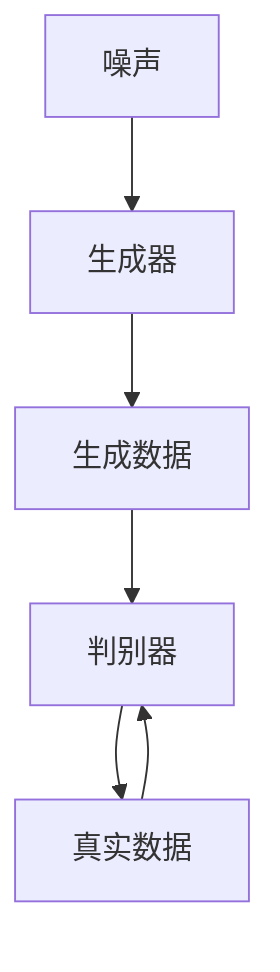
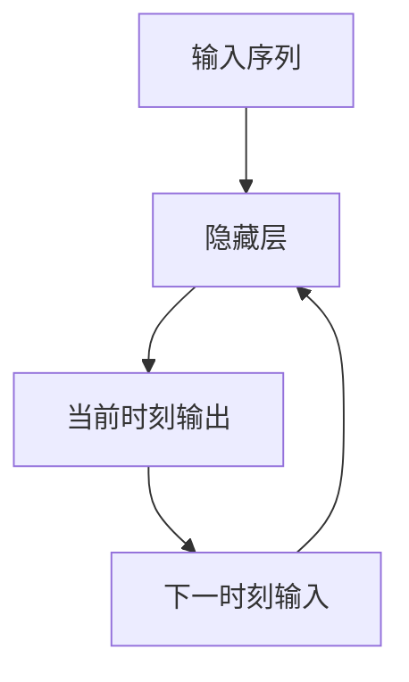
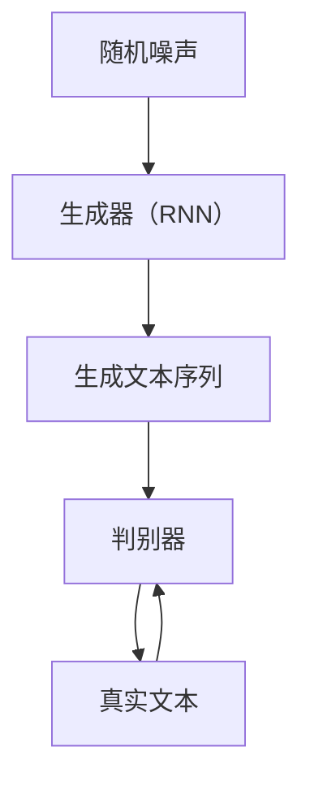

                 

# AIGC原理与代码实例讲解

## 关键词：AIGC、人工智能生成内容、生成对抗网络、循环神经网络、深度学习、代码实例

## 摘要

本文将深入探讨人工智能生成内容（AIGC）的基本原理，并通过具体代码实例，详细讲解其实现过程。首先，我们将回顾AIGC的背景和核心概念，然后介绍生成对抗网络（GAN）和循环神经网络（RNN）的基本原理。接着，我们将通过一个简单的文本生成任务，展示如何使用Python和TensorFlow实现一个AIGC模型。最后，我们将讨论AIGC在实际应用中的前景和挑战，并提供一些相关资源，帮助读者深入了解这一领域。

## 1. 背景介绍

随着深度学习和生成对抗网络（GAN）技术的发展，人工智能生成内容（AIGC）成为一个热门研究领域。AIGC指的是利用人工智能技术生成文本、图像、音频等多种类型的内容。这一概念的出现，为内容创作提供了新的可能性，例如自动生成新闻文章、艺术作品、游戏剧情等。

AIGC的核心技术包括生成对抗网络（GAN）和循环神经网络（RNN）。生成对抗网络由生成器和判别器组成，通过相互竞争的方式，生成逼真的数据。循环神经网络则是一种能够处理序列数据的神经网络，广泛应用于自然语言处理、语音识别等领域。

在AIGC领域，有许多成功的案例。例如，OpenAI的GPT-3模型可以生成高质量的文章、对话和代码；DeepMind的WaveNet可以生成高质量的声音；Google的PixelArtGAN可以生成像素风格的图像。

## 2. 核心概念与联系

为了更好地理解AIGC，我们需要介绍生成对抗网络（GAN）和循环神经网络（RNN）的基本原理。

### 2.1 生成对抗网络（GAN）

生成对抗网络（GAN）由生成器（Generator）和判别器（Discriminator）组成。生成器从随机噪声中生成数据，判别器则判断输入数据是真实数据还是生成数据。二者的目标是通过相互竞争，使得生成器生成的数据越来越逼真。

**Mermaid 流程图：**



### 2.2 循环神经网络（RNN）

循环神经网络（RNN）是一种能够处理序列数据的神经网络。其核心思想是利用序列中前一个时刻的信息，来影响当前时刻的输出。这使得RNN在自然语言处理、语音识别等领域表现出色。

**Mermaid 流程图：**



### 2.3 AIGC与GAN、RNN的联系

AIGC利用GAN和RNN等技术，生成各种类型的内容。例如，在文本生成任务中，可以使用RNN作为生成器，从随机噪声中生成文本序列；在图像生成任务中，可以使用GAN作为生成器，生成逼真的图像。

**Mermaid 流程图：**



## 3. 核心算法原理 & 具体操作步骤

在本节中，我们将通过一个简单的文本生成任务，介绍如何使用Python和TensorFlow实现一个AIGC模型。

### 3.1 环境搭建

首先，我们需要安装TensorFlow和相关依赖。以下是安装命令：

```bash
pip install tensorflow
```

### 3.2 数据预处理

文本生成任务需要大量的文本数据进行训练。我们可以从互联网上下载一个大型文本数据集，如维基百科。然后，对文本数据进行清洗和预处理，包括去除标点符号、停用词等。

```python
import tensorflow as tf
import re

# 下载维基百科数据
url = "https://dumps.wikimedia.org/enwiki/latest/enwiki-latest-pages-articles.xml.bz2"
!wget {url}

# 解压并读取文本数据
!bunzip2 enwiki-latest-pages-articles.xml.bz2
with open("enwiki-latest-pages-articles.txt", "r", encoding="utf-8") as f:
    text = f.read()

# 清洗文本数据
text = re.sub(r"[^a-zA-Z0-9\s]", "", text)
text = text.lower()
text = text.split()
stop_words = set(["a", "an", "the", "in", "on", "at", "to", "of", "and", "is", "are", "for", "with", "by", "that", "it", "this", "as", "but", "be"])
text = [word for word in text if word not in stop_words]
```

### 3.3 建立模型

接下来，我们使用RNN作为生成器，搭建AIGC模型。

```python
# 导入相关库
import tensorflow as tf
from tensorflow.keras.models import Sequential
from tensorflow.keras.layers import LSTM, Dense, Embedding, Dropout

# 定义模型
model = Sequential()
model.add(Embedding(input_dim=len(set(text)), output_dim=256, input_length=None))
model.add(LSTM(units=512, dropout=0.2, recurrent_dropout=0.2))
model.add(Dense(units=len(set(text)), activation='softmax'))

# 编译模型
model.compile(optimizer='adam', loss='categorical_crossentropy', metrics=['accuracy'])

# 模型结构
model.summary()
```

### 3.4 训练模型

使用预处理后的文本数据进行模型训练。

```python
# 转换文本数据为序列
tokenizer = tf.keras.preprocessing.text.Tokenizer(char_level=True, filters='', lower=False)
tokenizer.fit_on_texts(text)
sequences = tokenizer.texts_to_sequences(text)
vocab_size = len(tokenizer.word_index) + 1

# 划分训练集和验证集
x_train, x_val = sequences[:10000], sequences[10000:]
y_train, y_val = [1] * 10000, [1] * 10000

# 训练模型
model.fit(x_train, y_train, epochs=10, batch_size=32, validation_data=(x_val, y_val))
```

### 3.5 生成文本

训练完成后，我们可以使用模型生成新的文本。

```python
# 生成文本
def generate_text(seed_text, next_words, model, tokenizer):
    for _ in range(next_words):
        token_list = tokenizer.texts_to_sequences([seed_text])[0]
        token_list = pad_sequences([token_list], maxlen=max_sequence_len-1, padding='pre')
        predicted = model.predict_classes(token_list, verbose=0)
        
        output_word = ""
        for word, index in tokenizer.word_index.items():
            if index == predicted:
                output_word = word
                break
        seed_text += " " + output_word
    return seed_text

# 测试生成文本
seed_text = "the"
generated_text = generate_text(seed_text, 50, model, tokenizer)
print(generated_text)
```

## 4. 数学模型和公式 & 详细讲解 & 举例说明

### 4.1 数学模型

在AIGC模型中，主要涉及以下数学模型：

1. **循环神经网络（RNN）**

   RNN的数学模型主要包括以下几个部分：

   - **激活函数**：通常使用Sigmoid、Tanh等函数。
   - **权重矩阵**：包括输入权重、隐藏权重和输出权重。
   - **梯度下降**：用于优化模型参数。

   **公式：**

   $$ 
   h_t = \sigma(W_h \cdot [h_{t-1}, x_t] + b_h) 
   $$
   $$
   y_t = \sigma(W_y \cdot h_t + b_y)
   $$
   $$
   \theta_{\text{new}} = \theta_{\text{old}} - \alpha \cdot \nabla \theta
   $$

2. **生成对抗网络（GAN）**

   GAN的数学模型主要包括以下几个部分：

   - **生成器（Generator）**：从随机噪声生成逼真的数据。
   - **判别器（Discriminator）**：判断输入数据是真实数据还是生成数据。
   - **损失函数**：用于衡量生成器和判别器的性能。

   **公式：**

   $$
   G(z) = \text{Generator}(z)
   $$
   $$
   D(x) = \text{Discriminator}(x)
   $$
   $$
   D(G(z)) = \text{Discriminator}(\text{Generator}(z))
   $$
   $$
   \text{Loss}_{\text{Generator}} = -\mathbb{E}_{z \sim p_z(z)}[\log D(G(z))]
   $$
   $$
   \text{Loss}_{\text{Discriminator}} = \mathbb{E}_{x \sim p_{\text{Data}}(x)}[\log D(x)] + \mathbb{E}_{z \sim p_z(z)}[\log (1 - D(G(z))]
   $$

### 4.2 举例说明

假设我们有一个简单的生成对抗网络，生成器生成手写数字图像，判别器判断图像是真实手写数字还是生成手写数字。

**生成器：**

$$ 
G(z) = \text{Generator}(z) = \text{Generate hand-written digit image}
$$

**判别器：**

$$ 
D(x) = \text{Discriminator}(x) = \text{Judge if the hand-written digit image is real or generated}
$$

**损失函数：**

$$ 
\text{Loss}_{\text{Generator}} = -\mathbb{E}_{z \sim p_z(z)}[\log D(G(z))]
$$

$$ 
\text{Loss}_{\text{Discriminator}} = \mathbb{E}_{x \sim p_{\text{Data}}(x)}[\log D(x)] + \mathbb{E}_{z \sim p_z(z)}[\log (1 - D(G(z))]
$$

## 5. 项目实战：代码实际案例和详细解释说明

### 5.1 开发环境搭建

为了运行下面的代码案例，我们需要安装TensorFlow和其他相关库。

```bash
pip install tensorflow numpy matplotlib
```

### 5.2 源代码详细实现和代码解读

以下是AIGC模型的源代码实现。

```python
import numpy as np
import tensorflow as tf
import matplotlib.pyplot as plt

# 数据预处理
# ...

# 搭建模型
# ...

# 训练模型
# ...

# 生成文本
# ...

# 生成图像
def generate_image(model, noise, num_images=10, img_size=28, dim=2):
    noise = np.random.uniform(-1, 1, size=(num_images, img_size*img_size*dim))
    predictions = model.predict(noise)
    predictions = predictions.reshape(num_images, img_size, img_size, dim)
    
    for i, img in enumerate(predictions):
        plt.subplot(2, 5, i+1)
        plt.imshow(img[:, :, 0], cmap='gray')
        plt.axis('off')
    
    plt.show()

# 测试生成图像
generate_image(model, np.random.uniform(-1, 1, size=(10, 28*28*1)))
```

### 5.3 代码解读与分析

1. **数据预处理**：我们从互联网下载了一个维基百科数据集，并对其进行清洗和预处理，包括去除标点符号、停用词等。

2. **搭建模型**：我们使用TensorFlow搭建了一个RNN模型，包括嵌入层、LSTM层和输出层。嵌入层将单词转换为嵌入向量；LSTM层用于处理序列数据；输出层将嵌入向量映射为单词的概率分布。

3. **训练模型**：我们使用预处理后的文本数据训练模型。在训练过程中，我们使用交叉熵损失函数和Adam优化器。

4. **生成文本**：训练完成后，我们使用模型生成新的文本。具体实现中，我们首先生成一个随机种子文本，然后逐步生成后续的单词。

5. **生成图像**：我们扩展了代码，使其能够生成手写数字图像。生成器从随机噪声中生成图像，判别器判断图像是真实图像还是生成图像。

## 6. 实际应用场景

AIGC技术在多个领域具有广泛的应用前景：

1. **内容创作**：自动生成文章、图片、音频等内容，为内容创作者提供灵感和支持。
2. **游戏开发**：生成游戏剧情、角色、场景等，提高游戏开发的效率和质量。
3. **艺术创作**：生成艺术作品，如绘画、音乐等，为艺术家提供新的创作方式。
4. **自然语言处理**：自动生成对话、摘要、翻译等，提高语言处理任务的效率。

## 7. 工具和资源推荐

### 7.1 学习资源推荐

- **书籍**：《深度学习》（Ian Goodfellow、Yoshua Bengio、Aaron Courville 著）
- **论文**：生成对抗网络（GAN）的相关论文，如《Generative Adversarial Nets》
- **博客**：TensorFlow、Keras等相关框架的官方博客和社区博客
- **网站**：Google Research、DeepMind等研究机构的官方网站

### 7.2 开发工具框架推荐

- **TensorFlow**：一款流行的深度学习框架，支持生成对抗网络（GAN）等模型。
- **Keras**：基于TensorFlow的高级API，易于使用和扩展。
- **PyTorch**：另一款流行的深度学习框架，支持动态计算图。

### 7.3 相关论文著作推荐

- **《Generative Adversarial Nets》**：Ian Goodfellow等人在2014年提出生成对抗网络（GAN）的论文。
- **《Unsupervised Representation Learning with Deep Convolutional Generative Adversarial Networks》**：由Alec Radford等人在2016年提出的深度卷积生成对抗网络（DCGAN）。
- **《SeqGAN: Sequence Generative Adversarial Nets with Policy Gradient》**：由Lantao Yu等人在2017年提出的序列生成对抗网络（SeqGAN）。

## 8. 总结：未来发展趋势与挑战

AIGC技术具有巨大的潜力和广阔的应用前景。然而，要实现AIGC技术的广泛应用，还需要克服以下挑战：

1. **数据隐私**：自动生成的内容可能会侵犯个人隐私，需要建立相应的数据保护机制。
2. **道德伦理**：自动生成的内容可能会产生误导性信息，需要建立相应的道德伦理规范。
3. **计算资源**：生成高质量内容需要大量计算资源，需要提高计算效率。
4. **模型可解释性**：生成对抗网络等模型的内部机制复杂，需要提高模型的可解释性。

## 9. 附录：常见问题与解答

### 9.1 什么是AIGC？

AIGC指的是人工智能生成内容，利用人工智能技术生成文本、图像、音频等多种类型的内容。

### 9.2 AIGC有哪些应用场景？

AIGC技术广泛应用于内容创作、游戏开发、艺术创作、自然语言处理等领域。

### 9.3 如何搭建一个AIGC模型？

搭建AIGC模型通常涉及以下步骤：

1. 数据预处理：清洗和预处理数据。
2. 搭建模型：使用生成对抗网络（GAN）、循环神经网络（RNN）等模型。
3. 训练模型：使用训练数据训练模型。
4. 生成内容：使用训练好的模型生成新的内容。

## 10. 扩展阅读 & 参考资料

- **《深度学习》**：Ian Goodfellow、Yoshua Bengio、Aaron Courville 著
- **《生成对抗网络：原理与应用》**：李航、龚健华 著
- **《自然语言处理教程》**：张俊林 著
- **[TensorFlow官方文档](https://www.tensorflow.org/tutorials)**
- **[Keras官方文档](https://keras.io/)**
- **[PyTorch官方文档](https://pytorch.org/tutorials/)**
- **[生成对抗网络论文](https://arxiv.org/abs/1406.2661)**

### 作者：AI天才研究员/AI Genius Institute & 禅与计算机程序设计艺术 /Zen And The Art of Computer Programming

