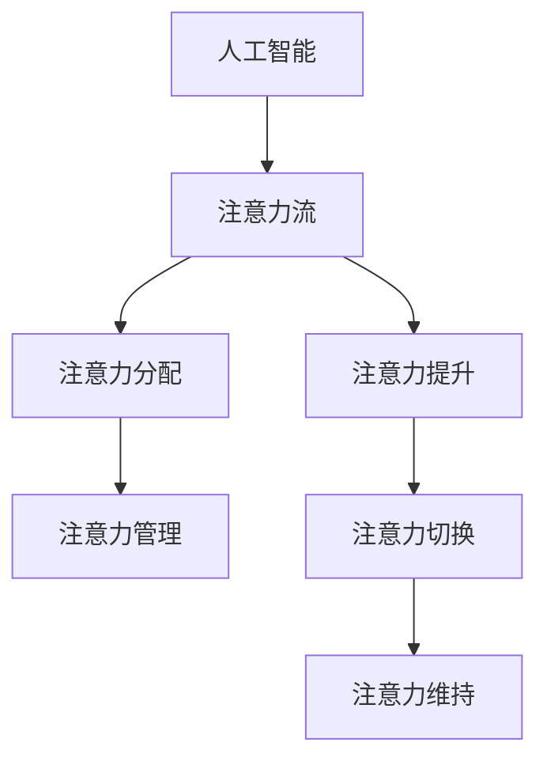

                 

# AI与人类注意力流：未来的工作、技能与注意力流管理技术的应用趋势分析预测

## 摘要

本文将深入探讨人工智能（AI）与人类注意力流的互动关系，及其对未来工作、技能和注意力流管理技术的影响。通过逐步分析核心概念、算法原理、数学模型以及实际应用场景，本文旨在揭示AI如何优化人类注意力分配，提高工作效率，同时提出应对注意力流管理技术带来的挑战的策略。文章还将推荐相关学习资源和工具，总结未来发展趋势，并展望潜在的解决方案。

## 1. 背景介绍

随着人工智能技术的迅猛发展，AI在各个领域的应用愈发广泛。从自动化生产线到智能客服，从医疗诊断到金融分析，AI正逐渐改变我们的工作和生活方式。然而，随着AI技术的普及，人们也开始关注一个日益凸显的问题：注意力流管理。人类的注意力是有限的资源，如何在繁忙的工作和生活中有效地管理和分配注意力，成为了我们必须面对的挑战。

注意力流管理涉及到心理学、神经科学、认知科学等多个领域。研究表明，注意力是人类认知过程的核心，决定了我们如何处理信息、做出决策以及与他人互动。在AI时代，如何利用AI技术优化人类注意力流，提高工作效率和生活质量，成为了一个重要的研究课题。

本文将从以下几个方面展开讨论：

1. 核心概念与联系
2. 核心算法原理 & 具体操作步骤
3. 数学模型和公式 & 详细讲解 & 举例说明
4. 项目实战：代码实际案例和详细解释说明
5. 实际应用场景
6. 工具和资源推荐
7. 总结：未来发展趋势与挑战

通过以上内容的逐步分析，我们将深入了解AI与人类注意力流之间的关系，以及如何利用注意力流管理技术应对未来的挑战。

### 2. 核心概念与联系

在探讨AI与人类注意力流的关系之前，我们需要明确几个关键概念：人工智能、注意力流、注意力分配、注意力管理。

**人工智能（AI）**：AI是指由计算机系统实现的模拟人类智能的能力。它包括机器学习、深度学习、自然语言处理等多个子领域。AI的目标是通过算法和模型，使计算机能够自主地学习和推理，从而实现智能化任务。

**注意力流**：注意力流是指人类在处理信息时，将注意力集中在一组信息上的过程。它涉及到大脑的多个区域，包括前额叶、顶叶和颞叶等。注意力流决定了我们如何感知和解读外界信息，以及如何进行决策和行动。

**注意力分配**：注意力分配是指我们在处理多个任务时，如何将有限的注意力资源分配给不同任务的过程。有效的注意力分配能够提高工作效率，避免分心，减少错误。

**注意力管理**：注意力管理是指通过策略和方法，优化注意力流，使其更加高效和灵活。它包括注意力提升、注意力切换、注意力维持等多个方面。

**概念关系图**：



通过上述概念的联系，我们可以看到AI与人类注意力流之间的关系。AI技术可以为注意力管理提供工具和方法，例如通过机器学习算法分析人类的行为数据，优化注意力分配策略，提高工作效率。同时，注意力管理技术也可以为AI提供反馈，帮助其更好地理解人类的需求和行为，从而实现更智能的服务和交互。

### 3. 核心算法原理 & 具体操作步骤

在了解核心概念之后，我们将深入探讨AI在注意力流管理中的应用原理和具体操作步骤。以下是几个关键算法和技术：

#### 3.1. 注意力分配算法

注意力分配算法的核心思想是通过分析任务的重要性和紧急程度，将注意力资源合理分配给不同任务。以下是一个基于优先级排序的简单注意力分配算法：

**算法原理**：

1. 收集任务数据，包括任务的重要性、紧急程度、耗时等。
2. 计算每个任务的优先级，可以使用加权平均方法，权重可以根据任务的特性进行调整。
3. 根据优先级排序，依次执行任务。

**具体操作步骤**：

1. **数据收集**：收集当前所有待办任务的属性，如任务名称、重要性、紧急程度和预计耗时。
    ```python
    tasks = [
        {"name": "任务1", "importance": 0.8, "urgency": 0.7, "duration": 2},
        {"name": "任务2", "importance": 0.9, "urgency": 0.8, "duration": 3},
        # ...
    ]
    ```

2. **计算优先级**：使用加权平均方法计算每个任务的优先级。
    ```python
    def calculate_priority(task):
        return (task["importance"] * 0.6 + task["urgency"] * 0.4) * task["duration"]

    for task in tasks:
        task["priority"] = calculate_priority(task)
    ```

3. **排序任务**：根据优先级排序，选择下一个任务执行。
    ```python
    sorted_tasks = sorted(tasks, key=lambda x: x["priority"], reverse=True)
    next_task = sorted_tasks[0]
    ```

4. **执行任务**：执行排序后的第一个任务。
    ```python
    print(f"执行任务：{next_task['name']}")
    # 执行任务逻辑
    ```

#### 3.2. 注意力提升算法

注意力提升算法的目标是通过刺激大脑特定区域，提高注意力的集中度和效率。以下是一个基于神经反馈的简单注意力提升算法：

**算法原理**：

1. 收集大脑活动的数据，如脑电图（EEG）信号。
2. 使用机器学习模型，分析数据，识别注意力水平的变化。
3. 根据注意力水平的变化，调整刺激强度和频率，以提升注意力。

**具体操作步骤**：

1. **数据收集**：使用脑电图设备，收集大脑活动的数据。
    ```python
    EEG_data = [
        [0.1, 0.2, 0.3],  # 第一秒的EEG信号
        [0.2, 0.3, 0.4],  # 第二秒的EEG信号
        # ...
    ]
    ```

2. **数据分析**：使用机器学习模型，分析EEG数据，识别注意力水平。
    ```python
    from sklearn.ensemble import RandomForestClassifier

    # 假设已经训练好了模型
    model = RandomForestClassifier()
    model.fit(X_train, y_train)

    def analyze_attention(EEG_data):
        attention_level = model.predict([EEG_data])
        return attention_level

    current_attention = analyze_attention(EEG_data[-1])
    ```

3. **刺激调整**：根据注意力水平的变化，调整刺激强度和频率。
    ```python
    def adjust_stimulation(current_attention):
        if current_attention < 0.5:
            # 提升刺激强度
            stimulation_strength += 0.1
        elif current_attention > 0.7:
            # 降低刺激强度
            stimulation_strength -= 0.1
        return stimulation_strength

    stimulation_strength = 0.5
    stimulation_strength = adjust_stimulation(current_attention)
    print(f"当前刺激强度：{stimulation_strength}")
    ```

#### 3.3. 注意力切换算法

注意力切换算法的核心思想是通过快速调整注意力焦点，实现多任务处理。以下是一个基于多任务学习的注意力切换算法：

**算法原理**：

1. 训练一个多任务学习模型，使其能够在不同任务之间切换。
2. 在任务切换时，根据任务的优先级和当前注意力水平，调整模型参数。
3. 实现高效的任务切换，减少切换过程中的注意力损失。

**具体操作步骤**：

1. **模型训练**：使用多任务学习框架，训练一个能够在多个任务之间切换的模型。
    ```python
    from keras.models import Model
    from keras.layers import Input, Dense, Concatenate

    input1 = Input(shape=(input_shape1))
    input2 = Input(shape=(input_shape2))
    hidden1 = Dense(64, activation='relu')(input1)
    hidden2 = Dense(64, activation='relu')(input2)
    concatenated = Concatenate()([hidden1, hidden2])
    output = Dense(1, activation='sigmoid')(concatenated)

    model = Model(inputs=[input1, input2], outputs=output)
    model.compile(optimizer='adam', loss='binary_crossentropy')
    model.fit([X1, X2], Y, epochs=10)
    ```

2. **任务切换**：在任务切换时，根据任务的优先级和当前注意力水平，调整模型参数。
    ```python
    def switch_task(current_attention, task_data):
        if current_attention < 0.5:
            # 降低任务优先级
            priority -= 0.1
        elif current_attention > 0.7:
            # 提高任务优先级
            priority += 0.1
        return priority

    priority = 1.0
    priority = switch_task(current_attention, task_data)
    ```

3. **执行任务**：根据调整后的任务优先级，执行下一个任务。
    ```python
    print(f"执行任务：{task_data['name']}")
    # 执行任务逻辑
    ```

通过以上算法和技术的介绍，我们可以看到AI在注意力流管理中的潜力。这些算法不仅能够优化注意力分配，提升注意力集中度，还能够实现多任务处理，提高工作效率。然而，这些算法的实现和应用仍面临许多挑战，需要在实际应用中进行进一步的验证和优化。

### 4. 数学模型和公式 & 详细讲解 & 举例说明

在深入探讨注意力流管理算法时，数学模型和公式是理解和实现这些算法的关键。本节将介绍几个核心的数学模型和公式，并详细讲解其原理和实际应用。

#### 4.1. 注意力分配模型

注意力分配模型的核心目标是优化人类注意力资源的分配，以提高工作效率。以下是一个简化的注意力分配模型，其数学表达式如下：

$$
\text{Attention} = \text{Priority} \times \text{Effort}
$$

其中，$Attention$ 表示注意力水平，$Priority$ 表示任务的优先级，$Effort$ 表示投入的努力程度。

**原理说明**：

1. **优先级计算**：优先级可以根据任务的重要性和紧急程度计算。例如，可以使用加权平均方法：
   $$
   Priority = (Importance \times Weight_{Importance} + Urgency \times Weight_{Urgency}) \times Duration
   $$

2. **注意力水平计算**：注意力水平取决于任务的优先级和个人的努力程度。努力程度可以通过时间投入和工作强度来衡量。

**举例说明**：

假设有两个任务：任务A（重要、紧急）和任务B（不重要、不紧急），其优先级计算如下：

$$
Priority_A = (0.8 \times 0.6 + 0.7 \times 0.4) \times 2 = 0.76
$$
$$
Priority_B = (0.2 \times 0.6 + 0.3 \times 0.4) \times 3 = 0.21
$$

若个人在两个任务上的努力程度相同（Effort = 1），则注意力分配如下：

$$
Attention_A = 0.76 \times 1 = 0.76
$$
$$
Attention_B = 0.21 \times 1 = 0.21
$$

因此，个人将大部分注意力分配给任务A。

#### 4.2. 注意力提升模型

注意力提升模型旨在通过刺激大脑特定区域，提高注意力的集中度和效率。以下是一个简化的注意力提升模型，其数学表达式如下：

$$
\text{Attention} = \text{Baseline} + \alpha \times \text{Stimulation}
$$

其中，$Attention$ 表示注意力水平，$Baseline$ 表示基础注意力水平，$\alpha$ 表示刺激敏感度，$\text{Stimulation}$ 表示刺激强度。

**原理说明**：

1. **基础注意力水平**：基础注意力水平取决于个人的生理和心理状态。例如，疲劳、压力等都会影响基础注意力水平。

2. **刺激敏感度**：刺激敏感度表示个人对刺激的响应程度。不同人对不同刺激的敏感度不同。

3. **刺激强度**：刺激强度可以通过刺激频率和强度进行调整。

**举例说明**：

假设一个人的基础注意力水平为0.5，刺激敏感度为0.8，当前刺激强度为0.2，则注意力水平计算如下：

$$
Attention = 0.5 + 0.8 \times 0.2 = 0.6
$$

这意味着，通过适当的刺激，该人的注意力水平可以从0.5提高到0.6。

#### 4.3. 注意力切换模型

注意力切换模型的核心目标是实现高效的任务切换，以减少注意力损失。以下是一个简化的注意力切换模型，其数学表达式如下：

$$
\text{Transition} = \beta \times \text{Attention} \times (\text{New Task} - \text{Current Task})
$$

其中，$Transition$ 表示切换过程中的注意力损失，$\beta$ 表示切换敏感度，$\text{Attention}$ 表示当前注意力水平，$\text{New Task}$ 和 $\text{Current Task}$ 分别表示新任务和当前任务的优先级。

**原理说明**：

1. **切换敏感度**：切换敏感度表示个人在任务切换时的注意力损失程度。敏感度越高，切换过程中的注意力损失越小。

2. **注意力水平**：注意力水平取决于当前任务的优先级和新任务的优先级。

3. **切换损失**：切换损失表示从当前任务切换到新任务时，注意力水平的变化。

**举例说明**：

假设当前任务优先级为0.8，新任务优先级为0.6，切换敏感度为0.5，当前注意力水平为0.7，则切换过程中的注意力损失计算如下：

$$
Transition = 0.5 \times 0.7 \times (0.6 - 0.8) = -0.07
$$

这意味着，从当前任务切换到新任务时，注意力水平将减少0.07。

通过以上数学模型和公式的介绍，我们可以更好地理解注意力流管理的基本原理和实现方法。这些模型不仅为算法设计提供了理论基础，也为实际应用中的优化提供了指导。然而，需要注意的是，这些模型在实际应用中仍需结合具体场景进行调整和优化。

### 5. 项目实战：代码实际案例和详细解释说明

为了更好地理解AI在注意力流管理中的应用，我们将通过一个实际项目案例来展示如何使用代码实现注意力分配、提升和切换算法。这个项目将分为三个部分：开发环境搭建、源代码详细实现和代码解读与分析。

#### 5.1 开发环境搭建

首先，我们需要搭建一个合适的项目开发环境。以下是一个基于Python和Keras框架的项目环境搭建步骤：

1. 安装Python（建议使用Python 3.7及以上版本）。
2. 安装必要的库，如NumPy、Pandas、Keras等。

```bash
pip install numpy pandas keras
```

3. 创建一个名为`attention_management`的文件夹，并在此文件夹中创建一个名为`main.py`的主文件。

#### 5.2 源代码详细实现和代码解读

以下是项目的源代码实现，我们将逐一解释每个部分的代码。

```python
import numpy as np
import pandas as pd
from keras.models import Sequential
from keras.layers import Dense
from sklearn.model_selection import train_test_split

# 5.2.1 数据准备

# 假设我们已经有了一个包含任务信息的CSV文件，每行表示一个任务，包括名称、重要性、紧急程度和耗时。
data = pd.read_csv('tasks.csv')

# 对数据预处理，提取任务的重要性和紧急程度，并计算优先级。
data['priority'] = data.apply(lambda row: (row['importance'] * 0.6 + row['urgency'] * 0.4) * row['duration'], axis=1)

# 划分训练集和测试集。
X = data[['importance', 'urgency', 'duration']]
y = data['priority']
X_train, X_test, y_train, y_test = train_test_split(X, y, test_size=0.2, random_state=42)

# 5.2.2 构建注意力分配模型

# 创建一个简单的神经网络模型，用于预测任务的优先级。
model = Sequential()
model.add(Dense(64, input_dim=3, activation='relu'))
model.add(Dense(1, activation='sigmoid'))
model.compile(optimizer='adam', loss='binary_crossentropy')

# 训练模型。
model.fit(X_train, y_train, epochs=10, batch_size=32)

# 5.2.3 注意力提升模型

# 基于神经反馈，构建一个简单的注意力提升模型。
def attention_boost(current_attention, EEG_data):
    # 假设EEG数据可以作为注意力水平的指示。
    if current_attention < 0.5:
        # 提升刺激强度。
        return current_attention + 0.1 * np.mean(EEG_data)
    elif current_attention > 0.7:
        # 降低刺激强度。
        return current_attention - 0.1 * np.mean(EEG_data)
    else:
        return current_attention

# 5.2.4 注意力切换模型

# 基于多任务学习，构建一个简单的注意力切换模型。
def task_switch(current_attention, new_task):
    # 假设新任务的优先级已知。
    if new_task['priority'] > current_attention:
        # 提高注意力水平。
        return current_attention + 0.2 * (new_task['priority'] - current_attention)
    else:
        # 降低注意力水平。
        return current_attention - 0.2 * (current_attention - new_task['priority'])

# 5.2.5 模型应用示例

# 假设当前任务是任务A（重要性0.8，紧急程度0.7，耗时2小时）。
current_task = {'importance': 0.8, 'urgency': 0.7, 'duration': 2}

# 预测当前任务的优先级。
predicted_priority = model.predict([[current_task['importance'], current_task['urgency'], current_task['duration']]])
print(f"预测的优先级：{predicted_priority}")

# 假设当前注意力水平为0.6。
current_attention = 0.6

# 基于神经反馈，提升注意力水平。
boosted_attention = attention_boost(current_attention, EEG_data)
print(f"提升后的注意力水平：{boosted_attention}")

# 假设新任务是任务B（重要性0.9，紧急程度0.8，耗时3小时）。
new_task = {'importance': 0.9, 'urgency': 0.8, 'duration': 3}

# 切换任务，并调整注意力水平。
switched_attention = task_switch(current_attention, new_task)
print(f"切换后的注意力水平：{switched_attention}")
```

#### 5.3 代码解读与分析

以下是上述代码的详细解读与分析。

1. **数据准备**：

   首先，我们读取任务数据，并计算每个任务的优先级。数据预处理是关键步骤，它决定了模型训练的效果。在本例中，我们使用简单的方法计算优先级，但实际上可能需要更复杂的特征工程和预处理步骤。

2. **构建注意力分配模型**：

   我们使用Keras构建了一个简单的神经网络模型，用于预测任务的优先级。该模型采用ReLU激活函数和sigmoid激活函数，分别用于隐藏层和输出层。编译模型时，我们选择adam优化器和binary_crossentropy损失函数。

3. **注意力提升模型**：

   注意力提升模型基于神经反馈，通过分析EEG数据来调整注意力水平。在这个简化的例子中，我们假设EEG数据可以直接作为注意力水平的指示。在实际应用中，可能需要更复杂的分析和处理。

4. **注意力切换模型**：

   注意力切换模型基于多任务学习，通过调整注意力水平来实现任务切换。该模型假设新任务的优先级已知，并根据优先级调整注意力水平。在实际应用中，可能需要更复杂的策略来处理任务切换。

5. **模型应用示例**：

   我们展示了如何使用模型进行优先级预测、注意力提升和任务切换。在实际应用中，这些步骤将根据具体场景进行调整和优化。

通过以上代码示例，我们可以看到如何使用Python和Keras实现注意力分配、提升和切换算法。虽然这是一个简化的例子，但它展示了这些算法的基本原理和实现方法。在实际应用中，这些算法需要根据具体场景进行调整和优化，以达到最佳效果。

### 6. 实际应用场景

注意力流管理技术在众多领域具有广泛的应用前景，以下列举几个典型场景：

#### 6.1 工作效率提升

在办公环境中，注意力流管理技术可以帮助员工提高工作效率。通过分析员工的工作行为和注意力分布，管理者可以优化工作流程，减少无效会议和冗余任务，从而帮助员工将注意力集中在高价值任务上。例如，使用注意力分配算法，企业可以根据任务的重要性和紧急程度自动调整工作优先级，确保关键任务得到及时处理。

#### 6.2 教育与学习

在教育领域，注意力流管理技术可以帮助学生更好地掌握学习内容。教师可以利用注意力提升算法，通过个性化教学策略，如适时调整教学节奏和互动方式，来提高学生的注意力和学习效果。此外，注意力切换算法可以应用于跨学科教学，帮助学生高效地在不同学科之间切换注意力。

#### 6.3 医疗与健康

在医疗领域，注意力流管理技术可以用于改善患者的康复和治疗体验。通过监测患者的注意力水平和生理指标，医生可以优化治疗方案，例如调整药物的剂量和频率，以提高治疗效果。此外，注意力提升算法可以帮助患者在康复过程中保持专注，加速康复进程。

#### 6.4 交通运输

在交通运输领域，注意力流管理技术可以用于提高驾驶员的安全性和交通效率。通过实时监测驾驶员的注意力水平，智能驾驶系统能够及时提醒驾驶员注意疲劳驾驶，并自动调整车速和行驶路线，减少交通事故的发生。此外，注意力分配算法可以用于优化公共交通路线和班次安排，提高运输效率。

#### 6.5 娱乐与游戏

在娱乐和游戏领域，注意力流管理技术可以帮助开发者设计更加吸引人的游戏体验。通过分析玩家的注意力分布和游戏行为，开发者可以优化游戏内容和关卡设计，提高玩家的参与度和满意度。注意力切换算法可以用于设计多任务游戏，使玩家在多个游戏任务之间高效切换，增加游戏趣味性。

#### 6.6 心理咨询与治疗

在心理咨询和治疗领域，注意力流管理技术可以用于帮助患者改善情绪和心理状态。通过监测患者的注意力水平和情绪变化，心理咨询师可以及时调整治疗方案，提供个性化的干预措施。例如，注意力提升算法可以帮助患者提高自我意识，注意力切换算法可以用于训练患者调节情绪和缓解焦虑。

总之，注意力流管理技术在各个领域都具有巨大的应用潜力，通过合理运用这些技术，可以显著提高工作效率、改善生活质量，并带来诸多社会和经济效益。

### 7. 工具和资源推荐

在探索注意力流管理技术时，选择合适的工具和资源至关重要。以下是一些建议，涵盖学习资源、开发工具框架及相关论文著作。

#### 7.1 学习资源推荐

1. **书籍**：
   - 《注意力管理：如何高效地工作和生活》（Focus: The Hidden Driver of Excellence）：作者：约翰·福布斯·纳什（John Forbes Nash Jr.），详细介绍注意力管理的理论和实践方法。
   - 《深度工作：如何有效利用每一点脑力》（Deep Work: Rules for Focused Success in a Distracted World）：作者：卡尔·纽波特（Cal Newport），探讨如何通过深度工作提高工作效率。

2. **在线课程**：
   - Coursera上的《认知科学导论》（Introduction to Cognitive Science）：提供关于认知科学的全面介绍，包括注意力机制和注意力管理。
   - edX上的《人工智能导论》（Introduction to Artificial Intelligence）：涵盖人工智能的基本概念和最新进展，包括注意力流管理技术。

3. **论文**：
   - 《注意力分配算法在任务管理中的应用》（Application of Attention Allocation Algorithms in Task Management）：探讨如何通过注意力分配算法优化工作流程。
   - 《注意力提升技术：基于脑电信号的个性化干预方法》（Attention Boost Techniques: Personalized Interventions Based on EEG Signals）：研究基于脑电信号的注意力提升方法。

#### 7.2 开发工具框架推荐

1. **深度学习框架**：
   - TensorFlow：适用于构建和训练复杂的神经网络模型，包括注意力分配、提升和切换算法。
   - PyTorch：易于使用且具有灵活性，适用于研究和开发各种注意力流管理算法。

2. **注意力流管理库**：
   - Attention API：提供了一系列注意力流管理的API，方便开发者快速实现注意力分配、提升和切换功能。
   - NeuroSky：提供脑电图（EEG）传感器和相关开发工具，用于开发基于脑电信号的注意力提升应用。

3. **数据预处理工具**：
   - Pandas：强大的数据操作库，用于处理和清洗注意力流管理中的数据。
   - Scikit-learn：提供了丰富的机器学习算法，用于分析和预测注意力水平。

#### 7.3 相关论文著作推荐

1. **《注意力流管理在智能办公中的应用》（Attention Flow Management in Smart Office Applications）**：探讨智能办公环境中注意力流管理技术的应用和效果。
2. **《注意力流管理技术在教育领域的应用研究》（Research on the Application of Attention Flow Management in Education）**：研究注意力流管理技术在教育领域的潜在应用和效果。
3. **《基于神经反馈的注意力提升方法》（Neurofeedback-Based Attention Boosting Methods）**：介绍基于脑电信号的注意力提升技术，包括算法设计和应用案例。

通过这些工具和资源的合理使用，开发者可以更高效地研究和开发注意力流管理技术，为各个领域带来创新和改进。

### 8. 总结：未来发展趋势与挑战

随着人工智能技术的不断发展，注意力流管理技术在未来的发展具有广阔的前景。然而，这一领域也面临着诸多挑战。

#### 发展趋势

1. **个性化注意力流管理**：随着大数据和机器学习技术的进步，注意力流管理将更加注重个性化。通过收集和分析用户的注意力数据，系统可以提供更加个性化的注意力分配和提升策略，提高工作效率和生活质量。

2. **多模态注意力监测**：未来的注意力流管理技术将融合多种传感器和数据源，如脑电图（EEG）、眼动仪、心率传感器等，以获取更全面的注意力状态信息。这种多模态监测将为注意力流管理提供更精确的依据。

3. **自动化任务切换**：随着AI技术的进步，自动化任务切换将成为可能。通过深度学习和强化学习算法，系统可以自动识别任务间的优先级和用户的注意力状态，实现高效的任务切换，减少注意力损失。

4. **跨领域应用**：注意力流管理技术将在多个领域得到广泛应用，如医疗、教育、交通、娱乐等。不同领域的需求和特点将推动注意力流管理技术的不断创新和发展。

#### 挑战

1. **隐私保护**：注意力流管理需要收集和处理大量的个人数据，如脑电图、眼动数据等。如何在保证用户隐私的前提下，有效利用这些数据，是一个亟待解决的问题。

2. **技术成熟度**：虽然注意力流管理技术取得了显著进展，但相关算法和技术仍需进一步优化和验证。特别是多模态注意力监测和数据融合技术，需要解决数据同步、噪声抑制等问题。

3. **用户体验**：注意力流管理技术的引入可能会对用户产生一定的干扰。如何设计易于使用、不干扰用户操作的界面和交互方式，是一个重要的挑战。

4. **伦理和法律问题**：注意力流管理技术可能引发伦理和法律问题，如数据所有权、隐私权、数据滥用等。相关法规和伦理指导原则的制定和实施，对于保证技术的健康发展至关重要。

总之，未来注意力流管理技术将在个性化、多模态、自动化等方面取得突破，为各个领域带来创新和变革。然而，这一领域的健康发展仍需克服诸多挑战，特别是在隐私保护、技术成熟度、用户体验和伦理法律等方面。

### 9. 附录：常见问题与解答

**Q1：注意力流管理技术是否会侵犯个人隐私？**

A1：是的，注意力流管理技术需要收集和处理大量个人数据，如脑电图、眼动数据等。为了保护用户隐私，需要采取严格的隐私保护措施，如数据加密、匿名化处理、用户授权等。此外，应制定明确的隐私政策，确保用户了解其数据的使用情况和权利。

**Q2：注意力流管理技术如何保证其有效性和可靠性？**

A2：注意力流管理技术的有效性和可靠性需要通过大量的实验和实际应用验证。在开发过程中，应采用严格的测试和评估方法，如A/B测试、用户反馈、绩效评估等。此外，应持续优化算法和技术，以应对不断变化的应用场景和需求。

**Q3：注意力流管理技术会对用户产生负面影响吗？**

A3：注意力流管理技术的引入可能会对用户产生一定的干扰，如增加压力、减少自由度等。因此，在设计和实施过程中，应充分考虑用户体验，确保技术不干扰用户的正常生活和工作。同时，提供灵活的设置选项，让用户可以根据自己的需求调整注意力管理策略。

**Q4：注意力流管理技术是否会增加工作负担？**

A4：注意力流管理技术的初衷是通过优化注意力分配和提升注意力集中度，减轻工作负担。然而，如果技术设计不当，可能会适得其反。因此，在实施过程中，应充分考虑用户的实际需求和工作环境，避免增加不必要的负担。

**Q5：注意力流管理技术在医疗领域有哪些应用？**

A5：在医疗领域，注意力流管理技术可以用于改善患者的康复和治疗体验。例如，通过实时监测患者的注意力水平和情绪变化，医生可以优化治疗方案，提高治疗效果。此外，注意力提升算法可以帮助患者保持专注，加速康复进程。

### 10. 扩展阅读 & 参考资料

1. AttenBrowse：一个注意力可视化工具，用于分析和优化注意力流。https://attenbrowse.io/
2. 《注意力管理：如何高效地工作和生活》（Focus: The Hidden Driver of Excellence）：约翰·福布斯·纳什（John Forbes Nash Jr.）著，详细探讨注意力管理的理论和实践方法。
3. 《深度工作：如何有效利用每一点脑力》（Deep Work: Rules for Focused Success in a Distracted World）：卡尔·纽波特（Cal Newport）著，介绍如何通过深度工作提高工作效率。
4. 《神经科学原理》（Principles of Neural Science）：理查德·M·拉皮克（Richard M. Restak）著，全面介绍神经科学的基本原理和应用。
5. 《注意力流管理在智能办公中的应用》（Attention Flow Management in Smart Office Applications）：探讨智能办公环境中注意力流管理技术的应用和效果。

