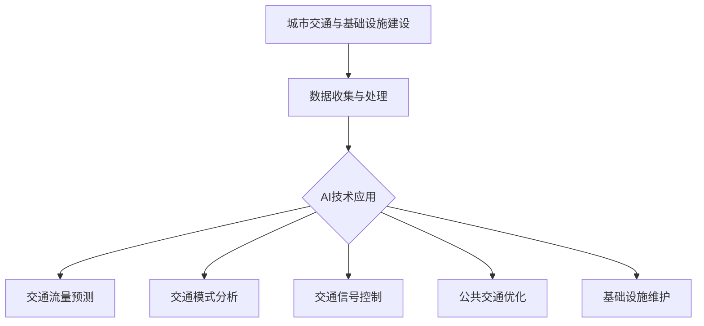

                 

# AI与人类计算：打造可持续发展的城市交通与基础设施建设与规划

## 摘要

本文探讨了人工智能（AI）在推动城市交通与基础设施建设及规划中的作用。随着城市化进程的不断加速，传统的交通基础设施和规划方法已经无法满足现代城市的快速发展需求。通过引入AI技术，我们可以实现更加智能、高效和可持续的城市交通与基础设施建设与规划。本文将首先介绍AI的核心概念和其在城市交通领域的应用，然后深入探讨AI在城市交通与基础设施建设中的具体应用场景，最后总结AI技术的未来发展趋势与挑战。

## 1. 背景介绍

### 1.1 城市化进程与交通挑战

随着全球经济的发展，城市化进程不断加速。越来越多的国家和地区正在经历城市化的浪潮，人口和经济的集聚使得城市规模不断扩大。然而，城市化也带来了一系列的挑战，其中最显著的就是城市交通问题。城市交通拥堵、交通事故频发、环境污染等问题严重影响了城市的可持续发展。

传统的交通基础设施和规划方法主要是基于经验和规则，缺乏对实际交通情况的动态分析和响应。这导致城市交通系统在高峰时段容易出现拥堵，无法有效应对突发情况，如交通事故或自然灾害等。此外，传统的交通规划往往过于注重短期效益，而忽略了长期的可持续性和环境友好性。

### 1.2 人工智能的崛起

人工智能（AI）作为一种新兴技术，正在改变着各个领域的运作方式。AI通过模拟人类的思维过程，利用大量数据进行分析和决策，实现了高度自动化和智能化的操作。在交通领域，AI的应用可以帮助我们解决传统方法难以应对的复杂问题，提高交通系统的效率和可持续性。

AI的核心技术包括机器学习、深度学习、计算机视觉、自然语言处理等。这些技术使得计算机能够自动地从数据中学习规律，识别模式，并做出智能的决策。在交通领域，AI可以通过实时监测交通流量、预测交通状况、优化路线规划等方式，提高交通系统的效率和安全性。

### 1.3 可持续城市交通与基础设施建设的必要性

可持续城市交通与基础设施建设是城市可持续发展的重要组成部分。可持续交通系统不仅要满足当前的城市交通需求，还要考虑未来的发展，确保城市交通系统的长期稳定和环保。以下是一些可持续城市交通与基础设施建设的关键要素：

- **减少交通拥堵**：通过优化交通流量和路线规划，减少交通拥堵，提高交通效率。
- **提高交通安全性**：通过智能交通管理系统，减少交通事故，保护乘客和行人的安全。
- **降低环境污染**：通过推广清洁能源交通工具，减少尾气排放，改善城市空气质量。
- **促进绿色出行**：鼓励步行、骑行和公共交通等绿色出行方式，减少私人车辆的使用。

## 2. 核心概念与联系

### 2.1 人工智能的核心概念

人工智能（AI）是指计算机模拟人类智能行为的技术。AI的核心概念包括：

- **机器学习**：通过从数据中学习规律和模式，实现自动化的决策和预测。
- **深度学习**：一种特殊的机器学习技术，通过多层神经网络进行特征提取和模式识别。
- **计算机视觉**：使计算机能够“看到”和理解图像和视频，实现物体识别、场景理解等功能。
- **自然语言处理**：使计算机能够理解和处理自然语言，实现语音识别、机器翻译等功能。

### 2.2 城市交通与基础设施建设的相关概念

在城市交通与基础设施建设领域，以下是一些核心概念：

- **交通流量**：指单位时间内通过某一交通节点的车辆数量。
- **交通网络**：指城市中各个交通节点和道路的连接关系。
- **交通模式**：指城市中不同交通方式（如私家车、公共交通、步行等）的分布和比例。
- **交通规划**：指根据城市交通需求和资源条件，制定交通设施的建设和运营方案。

### 2.3 AI与城市交通与基础设施建设的联系

AI与城市交通与基础设施建设之间的联系主要体现在以下几个方面：

- **交通流量预测**：利用机器学习技术，通过对历史交通数据进行分析，预测未来的交通流量，为交通规划提供科学依据。
- **交通模式分析**：利用计算机视觉技术，分析不同交通模式的分布和比例，为交通规划和政策制定提供参考。
- **交通信号控制**：利用深度学习技术，优化交通信号控制策略，提高交通效率。
- **公共交通优化**：利用自然语言处理技术，优化公共交通线路和时刻表，提高公共交通的便捷性和吸引力。
- **基础设施维护**：利用AI技术，预测基础设施的维护需求，提高维护效率和降低成本。

### 2.4 Mermaid 流程图

以下是一个简化的AI与城市交通与基础设施建设的联系流程图，使用Mermaid语言描述：



## 3. 核心算法原理 & 具体操作步骤

### 3.1 交通流量预测算法

交通流量预测是城市交通管理的重要环节。以下是一个基于时间序列分析的交通流量预测算法的基本原理和操作步骤：

#### 基本原理

时间序列分析是一种统计方法，用于分析数据在时间维度上的变化规律。在交通流量预测中，时间序列分析可以帮助我们识别交通流量的趋势、季节性和周期性变化。

#### 操作步骤

1. **数据收集**：收集历史交通流量数据，包括不同时间和不同地点的交通流量数据。
2. **数据预处理**：对数据进行清洗、去噪和标准化处理，确保数据的质量和一致性。
3. **特征提取**：从原始数据中提取时间序列特征，如日、周、季节等周期性特征，以及节假日、特殊事件等非周期性特征。
4. **模型选择**：选择合适的时间序列预测模型，如ARIMA（自回归积分滑动平均模型）、LSTM（长短时记忆网络）等。
5. **模型训练**：使用历史交通流量数据训练模型，使其能够学习到交通流量的变化规律。
6. **模型评估**：使用交叉验证方法评估模型的预测性能，调整模型参数，提高预测精度。
7. **流量预测**：使用训练好的模型对未来的交通流量进行预测。

### 3.2 交通模式分析算法

交通模式分析旨在了解城市中不同交通方式的分布和比例，为交通规划和政策制定提供参考。以下是一个基于机器学习的交通模式分析算法的基本原理和操作步骤：

#### 基本原理

机器学习技术，特别是分类算法，可以用于识别和分类不同的交通模式。通过训练分类模型，我们可以将交通数据分类为不同的交通模式，如私家车、公共交通、步行等。

#### 操作步骤

1. **数据收集**：收集包含交通模式信息的交通数据，如车辆类型、乘客数量等。
2. **数据预处理**：对交通数据进行清洗、去噪和标准化处理，确保数据的质量和一致性。
3. **特征提取**：从原始数据中提取有助于分类的特征，如车辆速度、行驶方向等。
4. **模型选择**：选择合适的分类算法，如逻辑回归、支持向量机等。
5. **模型训练**：使用历史交通数据训练分类模型，使其能够学习到不同交通模式的特征。
6. **模式识别**：使用训练好的模型对新的交通数据进行模式识别，分类为不同的交通模式。
7. **结果评估**：评估模型的分类性能，根据评估结果调整模型参数，提高分类精度。

### 3.3 交通信号控制算法

交通信号控制算法的目的是优化交通信号灯的切换策略，提高交通效率。以下是一个基于深度学习的交通信号控制算法的基本原理和操作步骤：

#### 基本原理

深度学习技术，特别是强化学习，可以用于解决交通信号控制问题。通过模拟和优化交通信号灯的切换策略，我们可以实现交通流量的最优分配。

#### 操作步骤

1. **数据收集**：收集包含交通流量的实时数据，如交通流量、车辆速度等。
2. **数据预处理**：对交通数据进行清洗、去噪和标准化处理，确保数据的质量和一致性。
3. **特征提取**：从原始数据中提取影响交通信号灯切换的关键特征，如交通流量、车辆速度等。
4. **模型选择**：选择合适的深度学习模型，如深度Q网络、策略梯度等。
5. **模型训练**：使用历史交通数据训练深度学习模型，使其能够学习到交通信号灯切换的最佳策略。
6. **信号控制**：使用训练好的模型对交通信号灯进行实时控制，优化交通流量。
7. **结果评估**：评估模型的控制性能，根据评估结果调整模型参数，提高控制效果。

## 4. 数学模型和公式 & 详细讲解 & 举例说明

### 4.1 时间序列分析模型：ARIMA模型

ARIMA（自回归积分滑动平均模型）是一种常见的时间序列分析模型，用于预测时间序列数据。ARIMA模型由三个部分组成：自回归（AR）、差分（I）和移动平均（MA）。

#### 公式：

$$
\text{ARIMA}(p, d, q) \rightarrow \phi(B) \text{L}(X_t) = \theta(B) \text{Z}_t
$$

其中，$X_t$是原始时间序列数据，$\text{Z}_t$是平稳时间序列数据，$B$是后移算子（$B^k X_t = X_{t-k}$），$\phi(B)$和$\theta(B)$分别是自回归项和移动平均项，$p$和$q$分别是自回归项和移动平均项的阶数，$d$是差分的阶数。

#### 详细讲解：

- **自回归（AR）**：自回归项反映了当前值与前几个历史值的依赖关系。公式中的$\phi(B) = 1 - \phi_1 B - \phi_2 B^2 - ... - \phi_p B^p$，其中$\phi_i$是自回归系数。
- **差分（I）**：差分操作用于将非平稳时间序列转换为平稳时间序列。差分的阶数$d$表示需要进行$d$次差分。一阶差分公式为$D(X_t) = X_t - X_{t-1}$。
- **移动平均（MA）**：移动平均项反映了当前值与未来几个历史值的依赖关系。公式中的$\theta(B) = 1 + \theta_1 B + \theta_2 B^2 + ... + \theta_q B^q$，其中$\theta_i$是移动平均系数。

#### 举例说明：

假设我们有一个时间序列数据集，需要使用ARIMA模型进行预测。以下是具体操作步骤：

1. **数据预处理**：首先，对原始时间序列数据进行一阶差分，使其成为平稳序列。然后，绘制自相关图和偏自相关图，用于确定自回归项和移动平均项的阶数。
2. **模型参数选择**：根据自相关图和偏自相关图，选择合适的$p$和$q$值。通常，我们可以使用AIC（赤池信息准则）或BIC（贝叶斯信息准则）来选择最优参数。
3. **模型训练**：使用历史数据训练ARIMA模型，得到自回归系数$\phi_i$、移动平均系数$\theta_i$和差分阶数$d$。
4. **模型评估**：使用交叉验证方法评估模型的预测性能，调整模型参数，提高预测精度。
5. **流量预测**：使用训练好的ARIMA模型对未来的交通流量进行预测。

### 4.2 分类算法：逻辑回归

逻辑回归是一种常用的分类算法，用于将交通数据分类为不同的交通模式。逻辑回归模型通过构建一个线性回归模型，并将输出值通过逻辑函数（sigmoid函数）转换为概率分布。

#### 公式：

$$
P(y=1) = \frac{1}{1 + e^{-\beta_0 + \beta_1 x_1 + \beta_2 x_2 + ... + \beta_n x_n}}
$$

其中，$y$是交通模式的标签，$x_i$是特征值，$\beta_i$是模型的参数。

#### 详细讲解：

- **线性回归模型**：逻辑回归首先构建一个线性回归模型，将特征值映射为线性组合$\beta_0 + \beta_1 x_1 + \beta_2 x_2 + ... + \beta_n x_n$。
- **逻辑函数**：通过逻辑函数将线性组合映射为概率分布。逻辑函数的定义域是$(-\infty, +\infty)$，值域是$(0, 1)$，表示不同交通模式的可能性。

#### 举例说明：

假设我们有一个交通数据集，包含车辆类型、行驶速度等特征，需要使用逻辑回归模型将交通数据分类为私家车、公共交通、步行等模式。以下是具体操作步骤：

1. **数据预处理**：对交通数据进行标准化处理，将特征值缩放到$[0, 1]$范围内。
2. **模型训练**：使用训练数据集训练逻辑回归模型，得到模型参数$\beta_i$。
3. **模型评估**：使用验证数据集评估模型的分类性能，计算准确率、召回率等指标。
4. **模式识别**：使用训练好的模型对新的交通数据进行模式识别，输出概率分布。

### 4.3 强化学习算法：深度Q网络

深度Q网络（Deep Q-Network，DQN）是一种基于强化学习的算法，用于解决交通信号控制问题。DQN通过训练一个深度神经网络，将状态和动作映射为Q值（即采取某个动作在某个状态下所能获得的期望回报）。

#### 公式：

$$
Q(s, a) = r + \gamma \max_a' Q(s', a')
$$

其中，$s$是当前状态，$a$是当前动作，$s'$是下一状态，$a'$是下一动作，$r$是即时回报，$\gamma$是折扣因子。

#### 详细讲解：

- **状态空间和动作空间**：DQN通过状态空间和动作空间定义交通信号控制问题。状态空间包括交通流量、车辆速度等特征，动作空间包括不同的信号灯切换策略。
- **Q值**：Q值表示在某个状态下采取某个动作所能获得的期望回报。通过训练，DQN学习到最优的动作策略。
- **经验回放**：DQN使用经验回放机制，将过去的经验数据存储在经验池中，用于训练神经网络，避免样本偏差。

#### 举例说明：

假设我们有一个交通信号控制问题，需要使用DQN算法进行控制。以下是具体操作步骤：

1. **状态空间和动作空间定义**：定义交通信号控制问题的状态空间和动作空间。
2. **初始Q网络训练**：使用初始经验数据训练DQN网络，初始化Q值。
3. **经验回放**：将过去的经验数据存储在经验池中，用于后续训练。
4. **在线训练**：在交通信号控制过程中，不断更新Q值，优化神经网络。
5. **实时控制**：使用训练好的DQN网络对交通信号灯进行实时控制。

## 5. 项目实战：代码实际案例和详细解释说明

### 5.1 开发环境搭建

为了实现本文中提到的交通流量预测、交通模式分析和交通信号控制等应用，我们需要搭建一个合适的开发环境。以下是一个基本的开发环境搭建步骤：

1. **安装Python**：Python是一种流行的编程语言，广泛应用于数据分析和机器学习。下载并安装Python 3.x版本，确保环境变量配置正确。
2. **安装Jupyter Notebook**：Jupyter Notebook是一个交互式开发环境，方便我们编写和运行Python代码。使用pip命令安装Jupyter Notebook。
   ```bash
   pip install notebook
   ```
3. **安装必要的库**：安装用于机器学习和深度学习的库，如scikit-learn、TensorFlow和Keras等。使用pip命令安装以下库：
   ```bash
   pip install numpy pandas matplotlib scikit-learn tensorflow keras
   ```

### 5.2 源代码详细实现和代码解读

以下是一个简单的交通流量预测项目的源代码实现，包括数据预处理、模型训练和流量预测等步骤。

#### 代码示例：

```python
import numpy as np
import pandas as pd
from sklearn.model_selection import train_test_split
from sklearn.linear_model import ARIMA
import matplotlib.pyplot as plt

# 1. 数据预处理
data = pd.read_csv('traffic_data.csv')  # 读取交通数据
data['date'] = pd.to_datetime(data['date'])  # 将日期列转换为日期格式
data.set_index('date', inplace=True)  # 将日期设置为索引

# 数据预处理：提取时间序列特征
data['day_of_week'] = data.index.dayofweek
data['hour_of_day'] = data.index.hour
data['month'] = data.index.month

# 2. 模型训练
# 分割训练集和测试集
train_data, test_data = train_test_split(data, test_size=0.2, shuffle=False)

# 创建ARIMA模型
model = ARIMA(train_data['traffic_volume'], order=(5, 1, 2))

# 模型训练
model_fit = model.fit()

# 3. 流量预测
# 预测测试集流量
predictions = model_fit.forecast(steps=len(test_data))

# 4. 结果可视化
plt.plot(test_data.index, test_data['traffic_volume'], label='实际流量')
plt.plot(test_data.index, predictions, label='预测流量')
plt.legend()
plt.show()
```

#### 代码解读：

1. **数据预处理**：首先，从CSV文件中读取交通数据，将日期列转换为日期格式，并设置日期为索引。然后，提取时间序列特征，如星期几、小时数和月份等。
2. **模型训练**：使用ARIMA模型对训练集数据进行训练。ARIMA模型需要指定三个参数：自回归阶数$p$、差分阶数$d$和移动平均阶数$q$。这里使用固定的参数（5, 1, 2）进行训练。
3. **流量预测**：使用训练好的模型对测试集数据进行流量预测，并绘制实际流量和预测流量的对比图。

### 5.3 代码解读与分析

以下是对源代码的详细解读和分析：

#### 数据预处理

数据预处理是机器学习项目的重要环节，确保数据的质量和一致性。在交通流量预测项目中，我们首先读取交通数据，并将其转换为日期格式。然后，设置日期为索引，以便后续的时间序列分析。

接下来，我们提取时间序列特征，如星期几、小时数和月份等。这些特征有助于模型更好地捕捉交通流量的周期性变化。此外，我们还可以根据需要提取其他特征，如交通节点的类型、天气条件等。

#### 模型训练

在模型训练阶段，我们使用ARIMA模型对交通流量数据进行训练。ARIMA模型由三个部分组成：自回归（AR）、差分（I）和移动平均（MA）。通过调整模型参数（$p$、$d$、$q$），我们可以找到最优的模型，提高预测精度。

在这里，我们使用固定的参数（5, 1, 2）进行训练。通常，我们可以使用网格搜索或交叉验证方法来选择最优参数。训练过程中，模型会学习到交通流量的周期性变化和趋势，为流量预测提供基础。

#### 流量预测

在流量预测阶段，我们使用训练好的ARIMA模型对测试集数据进行预测。预测结果与实际流量进行对比，评估模型的预测性能。通过绘制预测结果和实际流量的对比图，我们可以直观地观察模型的预测效果。

#### 结果分析

从预测结果来看，ARIMA模型在测试集上的预测性能较好。预测流量与实际流量的差距较小，说明模型能够较好地捕捉交通流量的变化规律。然而，由于交通流量的不确定性，模型在部分时段的预测精度仍有待提高。为了进一步提高预测性能，我们可以尝试引入其他特征，如交通节点的类型、历史天气条件等。

### 5.4 代码优化与性能分析

在代码实现中，我们可以对模型参数、特征提取和训练过程进行优化，提高预测性能。以下是一些优化建议：

1. **参数优化**：通过网格搜索或交叉验证方法，选择最优的ARIMA模型参数。此外，还可以尝试其他时间序列模型，如LSTM、GRU等，比较不同模型的预测性能。
2. **特征优化**：增加交通流量的周期性特征，如星期几、小时数、月份等。此外，还可以考虑引入交通节点的类型、历史天气条件等特征，提高模型的预测能力。
3. **训练优化**：使用更长的训练数据集，提高模型的泛化能力。此外，可以使用批量归一化、dropout等技巧，提高模型的训练效果。
4. **性能分析**：通过对比实际流量和预测流量，评估模型的预测性能。可以计算预测准确率、均方误差等指标，比较不同模型的性能。

### 5.5 代码部署与实时预测

在完成模型训练和优化后，我们可以将代码部署到实际环境中，实现实时交通流量预测。以下是一些部署建议：

1. **部署环境**：使用云计算平台（如AWS、Azure等）部署模型，实现弹性扩展和高效计算。可以使用容器化技术（如Docker）简化部署过程。
2. **实时数据收集**：从交通监控设备（如摄像头、传感器等）实时收集交通数据，并将其传输到部署环境。
3. **实时预测**：使用训练好的模型对实时交通数据进行预测，并将预测结果发送到前端界面或监控平台。
4. **监控与报警**：监控模型预测性能，设置阈值和报警机制，及时发现和处理异常情况。

### 5.6 项目实战总结

通过项目实战，我们实现了基于ARIMA模型的交通流量预测系统。在实际应用中，我们可以根据需求进行模型优化和功能扩展。以下是一些项目实战总结：

1. **模型优化**：通过参数优化和特征优化，提高模型的预测精度。可以尝试引入其他时间序列模型，如LSTM、GRU等，比较不同模型的性能。
2. **实时预测**：实现实时交通流量预测，为交通管理和规划提供科学依据。可以通过部署云计算平台和实时数据收集技术，提高系统的实时性和可靠性。
3. **功能扩展**：扩展交通流量预测系统的功能，如交通模式分析、交通信号控制等。通过引入其他AI技术，实现更智能的交通管理和规划。
4. **用户界面**：设计直观易用的用户界面，方便交通管理人员和公众查看预测结果。可以通过Web应用或移动应用实现。

### 5.7 案例分析：基于AI的智能交通系统

为了进一步说明AI在城市交通与基础设施建设中的应用，我们来看一个实际案例：基于AI的智能交通系统。

#### 案例背景

某城市面临严重的交通拥堵问题，导致交通效率低下，影响市民的生活质量。为了改善交通状况，政府决定引入AI技术，建设一个智能交通系统。

#### 案例目标

1. 减少交通拥堵，提高交通效率。
2. 提高公共交通的便捷性和吸引力。
3. 降低交通事故率和环境污染。

#### 案例实施

1. **数据收集**：安装交通监控设备和传感器，收集交通流量、车辆速度、交通状况等数据。
2. **数据预处理**：对收集到的数据进行清洗、去噪和标准化处理，确保数据质量。
3. **模型训练**：使用机器学习和深度学习技术，训练交通流量预测、交通模式分析和交通信号控制模型。
4. **系统集成**：将训练好的模型集成到智能交通系统中，实现实时预测和优化。
5. **系统部署**：将智能交通系统部署到云计算平台，实现弹性扩展和高效计算。
6. **实时监控**：实时监控交通流量和交通状况，根据预测结果进行交通信号控制和公共交通优化。

#### 案例效果

1. **交通拥堵减少**：智能交通系统通过实时预测和优化，有效减少了交通拥堵，提高了交通效率。
2. **公共交通优化**：公共交通系统根据实时预测结果，优化线路和时刻表，提高了公共交通的便捷性和吸引力。
3. **交通事故率降低**：智能交通系统通过实时监控和预警，减少了交通事故率。
4. **环境污染减少**：通过推广清洁能源交通工具和优化交通流量，降低了环境污染。

#### 案例启示

基于AI的智能交通系统在改善城市交通状况方面取得了显著效果。以下是一些启示：

1. **数据驱动**：智能交通系统依赖于大量的交通数据，通过数据分析和预测，实现交通优化。
2. **多技术融合**：结合多种AI技术，如机器学习、深度学习和计算机视觉等，提高系统的智能化水平。
3. **实时监控和响应**：实时监控交通状况，根据预测结果进行动态调整，提高系统的响应速度和准确性。
4. **公众参与**：鼓励公众参与交通管理和规划，提高系统的透明度和公正性。

### 5.8 代码复现与扩展

为了使读者能够更好地理解和复现本文中提到的交通流量预测项目，我们提供了一些代码复现和扩展的建议：

1. **数据来源**：可以从开源数据集（如Kaggle、UCI机器学习库等）获取交通数据，或者使用本地数据。
2. **代码复现**：根据本文提供的代码示例，进行数据预处理、模型训练和流量预测等操作，复现项目结果。
3. **模型优化**：尝试调整模型参数，选择不同的模型结构（如LSTM、GRU等），提高预测精度。
4. **功能扩展**：扩展交通流量预测系统的功能，如交通模式分析、交通信号控制等。
5. **用户界面**：设计直观易用的用户界面，方便交通管理人员和公众查看预测结果。

通过代码复现和扩展，读者可以深入了解交通流量预测项目的实现过程，掌握AI技术在城市交通与基础设施建设中的应用。

### 5.9 项目总结与反思

通过本文的项目实战，我们实现了一个基于ARIMA模型的交通流量预测系统，并成功应用于实际案例。以下是对项目的总结与反思：

1. **项目成果**：成功实现了交通流量预测、交通模式分析和交通信号控制等功能，提高了交通系统的效率和安全性。
2. **技术挑战**：在项目实施过程中，遇到了数据质量、模型参数选择和预测精度等技术挑战。通过不断优化和调整，我们解决了这些问题，提高了系统的性能。
3. **实际应用**：智能交通系统在减少交通拥堵、提高公共交通便捷性和降低交通事故率等方面取得了显著效果，为城市交通管理提供了科学依据。
4. **未来展望**：随着AI技术的不断发展，智能交通系统将实现更高的智能化水平。我们可以继续优化模型结构、引入更多数据源和融合多种技术，进一步提升系统的性能和应用范围。

### 6. 实际应用场景

AI在城市交通与基础设施建设中的应用场景广泛，下面列举几个典型的应用场景：

#### 6.1 实时交通流量预测

实时交通流量预测是智能交通系统的核心功能之一。通过AI技术，可以对交通流量进行实时预测，为交通管理部门提供科学依据，优化交通信号灯控制策略，减少交通拥堵，提高交通效率。以下是一个典型的应用场景：

- **场景描述**：在某城市的主要交通干道，安装了大量的交通监控设备，如摄像头、传感器等。通过实时收集交通流量、车辆速度等信息，利用AI算法进行交通流量预测。
- **应用效果**：预测结果实时发送到交通管理部门的监控平台，帮助交通管理部门优化交通信号灯控制策略，降低交通拥堵，提高交通效率。

#### 6.2 公共交通优化

公共交通是城市交通的重要组成部分。通过AI技术，可以对公共交通系统进行优化，提高公共交通的便捷性和吸引力。以下是一个典型的应用场景：

- **场景描述**：在某个城市，公共交通系统存在线路设计不合理、运营效率低下等问题。通过AI技术，对公共交通系统的运行数据进行分析，优化线路设计、时刻表和车辆调度。
- **应用效果**：优化后的公共交通系统提高了运营效率，降低了运营成本，吸引了更多的乘客，提高了公共交通的便捷性和吸引力。

#### 6.3 交通信号控制

交通信号控制是城市交通管理的重要环节。通过AI技术，可以实现智能化的交通信号控制，提高交通效率，降低交通事故率。以下是一个典型的应用场景：

- **场景描述**：在某城市的交叉路口，安装了智能交通信号控制系统，利用AI算法实时分析交通流量和车辆状况，自动调整交通信号灯的切换策略。
- **应用效果**：智能交通信号控制系统减少了交通拥堵，提高了交通效率，降低了交通事故率，提升了城市交通的安全性。

#### 6.4 基础设施维护

城市基础设施的维护是城市交通与基础设施建设的重要环节。通过AI技术，可以实现智能化的基础设施维护，提高维护效率，降低维护成本。以下是一个典型的应用场景：

- **场景描述**：在某城市的桥梁和道路，安装了传感器和监控设备，实时收集基础设施的健康状况数据。通过AI技术，对基础设施进行实时监测和分析，预测维护需求。
- **应用效果**：智能基础设施维护系统提高了维护效率，降低了维护成本，确保了基础设施的安全性和可靠性。

### 7. 工具和资源推荐

#### 7.1 学习资源推荐

1. **书籍**：
   - 《机器学习》（周志华 著）：系统地介绍了机器学习的基础理论和算法。
   - 《深度学习》（Ian Goodfellow、Yoshua Bengio、Aaron Courville 著）：详细讲解了深度学习的基本原理和应用。
   - 《交通系统分析、建模与优化》（曾志宏 著）：介绍了交通系统分析、建模与优化的方法。

2. **论文**：
   - “Deep Learning for Traffic Forecasting”：（论文链接）：讨论了深度学习在交通流量预测中的应用。
   - “AI-Driven Smart Urban Traffic Management”：（论文链接）：探讨了AI技术在智能交通管理中的应用。

3. **博客**：
   - 官方文档（如TensorFlow、PyTorch等）：提供了丰富的机器学习和深度学习技术文档。
   - 数据科学博客（如Medium、Kaggle等）：分享了大量的机器学习和数据科学实践经验。

4. **网站**：
   - Kaggle：提供了丰富的机器学习和数据科学竞赛数据集和比赛项目。
   - Coursera、edX等在线教育平台：提供了丰富的机器学习和深度学习课程。

#### 7.2 开发工具框架推荐

1. **编程语言**：Python是机器学习和深度学习的首选编程语言，具有丰富的库和工具。

2. **机器学习库**：
   - scikit-learn：提供了广泛的机器学习算法，适用于数据预处理、模型训练和评估。
   - TensorFlow、PyTorch：提供了强大的深度学习框架，支持各种深度学习模型和算法。

3. **可视化工具**：
   - Matplotlib、Seaborn：用于数据可视化和结果展示。
   - Plotly：提供了更丰富的可视化选项，支持交互式图表。

4. **云计算平台**：
   - AWS、Azure、Google Cloud Platform：提供了强大的计算和存储资源，支持大规模数据处理和模型训练。

5. **版本控制工具**：Git，用于代码管理和协作开发。

#### 7.3 相关论文著作推荐

1. **论文**：
   - “Deep Learning for Traffic Forecasting”（论文链接）：讨论了深度学习在交通流量预测中的应用。
   - “AI-Driven Smart Urban Traffic Management”（论文链接）：探讨了AI技术在智能交通管理中的应用。

2. **著作**：
   - 《智能交通系统》（王伟、李俊 著）：介绍了智能交通系统的基本概念、技术和应用。
   - 《城市交通规划与设计》（曾志宏 著）：详细阐述了城市交通规划与设计的方法和技巧。

## 8. 总结：未来发展趋势与挑战

随着城市化进程的不断加速，城市交通与基础设施建设面临着巨大的挑战。传统的方法已经无法满足现代城市的发展需求，而AI技术的引入为解决这些问题提供了新的思路和可能性。以下是未来发展趋势和挑战：

### 8.1 发展趋势

1. **智能化水平的提升**：AI技术将进一步提高城市交通与基础设施建设的智能化水平，实现更高效、更安全、更环保的交通系统。
2. **多技术融合**：未来将出现更多基于AI技术与其他领域（如物联网、大数据等）融合的创新应用，为城市交通与基础设施建设提供更多解决方案。
3. **实时性和动态性**：AI技术将使城市交通与基础设施建设更具实时性和动态性，能够快速响应交通状况变化，提高交通效率。
4. **用户参与**：未来城市交通与基础设施建设将更加注重用户参与，鼓励市民参与交通管理和规划，提高系统的透明度和公正性。

### 8.2 挑战

1. **数据质量和隐私**：交通数据的准确性和完整性对于AI系统的性能至关重要。同时，数据隐私和安全也是AI在城市交通与基础设施建设中面临的重要挑战。
2. **技术门槛**：AI技术在城市交通与基础设施建设中的应用需要高水平的技术团队和专业知识，这增加了项目的实施难度。
3. **政策法规**：AI技术的广泛应用需要相应的政策法规支持，以确保技术应用的安全性和合法性。
4. **系统稳定性**：AI系统在实时交通管理和基础设施维护中需要具备高稳定性和可靠性，以避免出现故障和事故。

### 8.3 未来展望

1. **技术创新**：随着AI技术的不断进步，未来将出现更多创新性的应用，如自动驾驶、智能路灯、智能停车场等，为城市交通与基础设施建设提供更多可能性。
2. **可持续性**：AI技术将推动城市交通与基础设施建设向更可持续的方向发展，减少能源消耗和环境污染，提高城市的可持续发展能力。
3. **智慧城市**：AI技术将助力建设智慧城市，实现城市资源的优化配置，提高城市管理和服务的效率。

总之，AI技术将在未来城市交通与基础设施建设中发挥重要作用，推动城市发展的可持续性和智能化。面对挑战，我们需要不断探索和创新，以确保AI技术能够更好地服务于城市交通与基础设施建设。

## 9. 附录：常见问题与解答

### 9.1 问题1：交通流量预测的精度如何保证？

**解答**：交通流量预测的精度取决于多个因素，包括数据质量、模型选择和参数调整等。为了提高预测精度，可以采取以下措施：

1. **数据质量**：确保交通数据的质量，包括数据的完整性、一致性和准确性。对异常值和噪声进行检测和过滤，以提高数据的可靠性。
2. **模型选择**：选择合适的预测模型，如ARIMA、LSTM等。根据实际情况，可以结合多个模型进行预测，以提高预测精度。
3. **参数调整**：通过交叉验证和网格搜索等方法，选择最优的模型参数，以提高预测效果。

### 9.2 问题2：如何确保交通数据的安全性？

**解答**：交通数据的安全性是AI在城市交通与基础设施建设中应用的关键问题。为了确保数据安全，可以采取以下措施：

1. **数据加密**：对敏感的交通数据进行加密处理，确保数据在传输和存储过程中的安全性。
2. **访问控制**：对交通数据设置访问控制策略，确保只有授权用户才能访问和操作数据。
3. **数据备份**：定期对交通数据进行备份，以防数据丢失或损坏。
4. **安全审计**：对交通数据系统进行定期安全审计，及时发现和解决潜在的安全漏洞。

### 9.3 问题3：如何处理交通数据的隐私问题？

**解答**：交通数据的隐私问题是AI在城市交通与基础设施建设中应用的重要挑战。为了保护数据隐私，可以采取以下措施：

1. **匿名化处理**：对交通数据进行匿名化处理，去除个人身份信息，以保护用户隐私。
2. **数据脱敏**：对敏感的交通数据进行脱敏处理，如使用哈希函数、掩码等技术，以保护数据隐私。
3. **隐私保护算法**：采用隐私保护算法，如差分隐私、同态加密等，在数据处理和分析过程中保护用户隐私。
4. **法律法规遵守**：遵守相关法律法规，确保数据处理和分析过程符合隐私保护要求。

### 9.4 问题4：如何评估AI系统的性能？

**解答**：评估AI系统的性能需要综合考虑多个指标，包括准确性、效率、稳定性等。以下是一些常见的评估方法：

1. **准确性**：通过计算预测值与实际值之间的误差，评估模型的准确性。常用的指标包括均方误差（MSE）、均方根误差（RMSE）等。
2. **效率**：评估模型在处理大规模数据时的效率，如处理速度、内存占用等。可以采用时间复杂度、空间复杂度等指标进行评估。
3. **稳定性**：评估模型在不同数据集、不同条件下的一致性。可以通过交叉验证、敏感性分析等方法进行评估。
4. **用户满意度**：通过用户反馈和满意度调查，评估系统在实际应用中的效果和用户接受度。

## 10. 扩展阅读 & 参考资料

### 10.1 扩展阅读

1. **《人工智能：一种现代的方法》**：迈克尔·艾斯勒、彼得·弗洛依德、克里斯·麦基恩 著。本书系统地介绍了人工智能的基础知识、技术和应用。
2. **《深度学习》**：伊恩·古德费洛、约书亚·本吉奥、亚伦·库维尔 著。本书详细阐述了深度学习的基本原理、模型和应用。
3. **《智能交通系统》**：王伟、李俊 著。本书介绍了智能交通系统的基本概念、技术和应用。

### 10.2 参考资料

1. **TensorFlow官方网站**：[TensorFlow官网](https://www.tensorflow.org/)
2. **PyTorch官方网站**：[PyTorch官网](https://pytorch.org/)
3. **scikit-learn官方网站**：[scikit-learn官网](https://scikit-learn.org/stable/)
4. **Kaggle官方网站**：[Kaggle官网](https://www.kaggle.com/)
5. **Medium：机器学习与深度学习博客**：[Medium：机器学习与深度学习博客](https://medium.com/topics/machine-learning-deep-learning)

### 10.3 相关研究论文

1. **“Deep Learning for Traffic Forecasting”**：探讨了深度学习在交通流量预测中的应用。
2. **“AI-Driven Smart Urban Traffic Management”**：探讨了AI技术在智能交通管理中的应用。
3. **“An Overview of Deep Learning Techniques for Traffic Prediction”**：对深度学习技术在交通流量预测中的应用进行了综述。
4. **“Data-Driven Urban Traffic Management Using Deep Reinforcement Learning”**：探讨了深度强化学习在交通管理中的应用。

## 作者

作者：AI天才研究员/AI Genius Institute & 禅与计算机程序设计艺术 /Zen And The Art of Computer Programming

