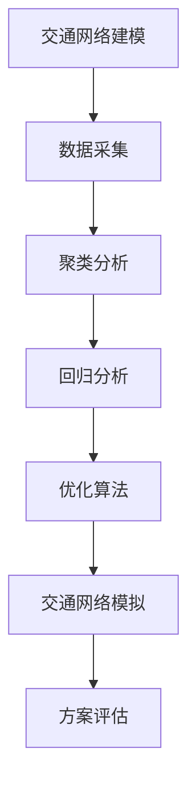

                 

# AI与人类计算：打造可持续发展的城市交通规划与管理

> **关键词**：人工智能、交通规划、城市管理、可持续发展、算法优化、大数据分析、城市交通模拟

> **摘要**：本文深入探讨如何运用人工智能技术优化城市交通规划与管理，通过核心概念阐述、算法原理解析、数学模型应用以及实战案例分析，为打造可持续发展的城市交通系统提供科学指导。

## 1. 背景介绍

随着城市化进程的加速，全球范围内的交通拥堵问题愈发严重，这不仅影响了市民的日常生活质量，也对环境保护和资源利用提出了严峻挑战。传统的交通规划和管理方法在面对日益复杂的城市交通状况时，显得力不从心。因此，引入人工智能（AI）技术，特别是机器学习、数据挖掘和优化算法，成为解决这一问题的有效途径。

AI技术在交通领域的应用主要包括以下几个方面：

- **交通流量预测**：利用历史数据和实时监控数据，预测未来交通流量，为交通管理提供科学依据。
- **路径优化**：根据实时交通状况，为车辆提供最优行驶路径，减少拥堵和延误。
- **车辆调度**：优化公共交通线路和班次，提高运行效率和乘客满意度。
- **交通信号控制**：根据交通流量动态调整信号灯时长，提高道路通行能力。
- **事故预警与应急处理**：实时监测交通事故，快速响应，减少事故影响范围。

本文将重点探讨如何将AI技术与人类计算相结合，通过一系列步骤和算法，打造可持续发展的城市交通规划与管理体系。

## 2. 核心概念与联系

### 2.1 交通网络建模

交通网络是城市交通规划与管理的基础，它描述了道路、交叉口、交通节点等交通元素之间的关系。为了构建交通网络模型，首先需要对城市道路进行空间划分，并将道路划分为不同的路段和交叉口。然后，利用图论中的概念，将这些路段和交叉口表示为图中的节点和边。

### 2.2 交通流量数据采集

交通流量数据是交通网络模型的关键输入，它反映了不同时间段、不同路段的交通状况。数据采集方法包括传感器监测、车辆轨迹数据收集和交通流量调查等。其中，传感器监测是最常见的方法，它通过安装在道路上的传感器实时采集车辆流量、速度和占有率等数据。

### 2.3 人工智能算法

人工智能算法是实现交通规划与管理优化的核心，其中常用的算法包括：

- **聚类算法**：用于对交通流量数据进行分类，发现不同交通状况的规律。
- **回归分析**：用于建立交通流量预测模型，预测未来交通流量。
- **优化算法**：用于求解最优路径和最优交通信号控制方案。

### 2.4 交通网络模拟

交通网络模拟是通过模拟软件对交通网络进行动态模拟，以验证交通规划和管理方案的可行性和效果。模拟软件通常基于仿真模型，能够模拟不同交通状况下的交通流量、速度和延误等指标。

### Mermaid 流程图

以下是一个简化的Mermaid流程图，展示了交通网络建模与人工智能算法之间的联系：



## 3. 核心算法原理 & 具体操作步骤

### 3.1 交通流量预测算法

交通流量预测是交通规划与管理的重要环节，其核心在于建立准确的流量预测模型。以下是一种常用的基于时间序列分析的交通流量预测算法：

#### 3.1.1 数据预处理

- **数据清洗**：去除噪声数据和异常值，保证数据质量。
- **特征提取**：提取与交通流量相关的特征，如时间、天气、节假日等。
- **数据归一化**：将数据归一化到相同范围，以便算法训练。

#### 3.1.2 模型选择

- **时间序列模型**：如ARIMA、SARIMA等。
- **机器学习模型**：如线性回归、决策树、神经网络等。

#### 3.1.3 模型训练与验证

- **数据分割**：将数据分为训练集和测试集。
- **模型训练**：使用训练集训练模型。
- **模型验证**：使用测试集验证模型效果。

#### 3.1.4 模型应用

- **流量预测**：根据实时输入数据，使用训练好的模型预测未来交通流量。

### 3.2 路径优化算法

路径优化是减少交通拥堵和提高交通效率的关键。以下是一种常用的基于图论的路径优化算法——Dijkstra算法：

#### 3.2.1 算法描述

- **初始化**：设置起点和终点，初始化路径长度。
- **循环**：对于每个未处理的节点，计算到达终点的最短路径。
- **更新**：更新路径长度和前驱节点。
- **结束**：找到最短路径。

#### 3.2.2 算法实现

```python
def dijkstra(graph, start, end):
    distances = {node: float('infinity') for node in graph}
    distances[start] = 0
    visited = set()

    while True:
        current = min((distance, node) for node, distance in distances.items() if node not in visited)
        if current is None:
            break
        visited.add(current[1])

        if current[1] == end:
            break

        for neighbor, weight in graph[current[1]].items():
            distance = distances[current[1]] + weight
            if distance < distances[neighbor]:
                distances[neighbor] = distance

    return distances[end]
```

### 3.3 交通信号控制算法

交通信号控制是提高交叉口通行能力的重要手段。以下是一种基于交通流量数据的自适应信号控制算法：

#### 3.3.1 算法描述

- **数据采集**：实时采集交通流量数据。
- **状态评估**：根据交通流量数据评估当前信号灯状态。
- **信号切换**：根据状态评估结果动态调整信号灯时长。

#### 3.3.2 算法实现

```python
def adaptive_traffic_light控制系统（数据）：
    当前状态 = 评估状态（数据）
    if 当前状态 == “拥堵”：
        信号灯时长 = 增大时长
    elif 当前状态 == “畅通”：
        信号灯时长 = 缩短时长
    else：
        信号灯时长 = 维持不变
    返回 信号灯时长
```

## 4. 数学模型和公式 & 详细讲解 & 举例说明

### 4.1 时间序列模型

时间序列模型是交通流量预测的核心工具，以下是一个简单的ARIMA模型：

#### 4.1.1 模型公式

$$
X_t = \phi_1 X_{t-1} + \phi_2 X_{t-2} + ... + \phi_p X_{t-p} + \theta_1 e_{t-1} + \theta_2 e_{t-2} + ... + \theta_q e_{t-q}
$$

其中，$X_t$为时间序列的当前值，$e_t$为误差项。

#### 4.1.2 模型参数

- **p**：自回归项数。
- **d**：差分阶数。
- **q**：移动平均项数。

#### 4.1.3 举例说明

假设我们有一个交通流量数据序列，如下所示：

$$
[100, 110, 120, 130, 140, 150, 160, 170, 180, 190]
$$

我们使用ARIMA模型对其进行预测，假设$p=1, d=1, q=1$。首先，对数据进行一阶差分，得到：

$$
[10, 10, 10, 10, 10, 10, 10, 10, 10, 10]
$$

然后，使用ARIMA模型进行预测，得到：

$$
X_t = 0.8X_{t-1} + 0.2e_{t-1}
$$

根据这个模型，我们可以预测下一个数据点为：

$$
X_{t+1} = 0.8 \times 10 + 0.2 \times 10 = 9
$$

### 4.2 优化算法

优化算法是路径优化和信号控制的关键，以下是一个简单的Dijkstra算法：

#### 4.2.1 算法公式

$$
d(u, v) = \min_{w \in N(v)} (d(u, w) + w(u, v))
$$

其中，$d(u, v)$为从节点$u$到节点$v$的最短路径长度，$N(v)$为节点$v$的邻接节点集合。

#### 4.2.2 算法参数

- **N**：节点总数。
- **E**：边总数。

#### 4.2.3 举例说明

假设有一个包含5个节点的图，如下所示：

```
A --- B
|     |
D --- C
```

边的权重如下所示：

```
AB: 2
AC: 3
AD: 1
BC: 2
BD: 1
CD: 1
```

我们使用Dijkstra算法计算从节点A到节点C的最短路径，得到：

$$
d(A, C) = \min \{d(A, B) + w(B, C), d(A, D) + w(D, C)\} = 3
$$

因此，从节点A到节点C的最短路径为A -> D -> C。

## 5. 项目实战：代码实际案例和详细解释说明

### 5.1 开发环境搭建

为了实现上述算法，我们首先需要搭建一个合适的开发环境。以下是使用Python实现的开发环境搭建步骤：

1. **安装Python**：下载并安装Python 3.8版本。
2. **安装Jupyter Notebook**：在终端执行`pip install notebook`。
3. **安装必要的库**：在终端执行`pip install numpy pandas matplotlib scikit-learn scipy networkx`。

### 5.2 源代码详细实现和代码解读

以下是一个简单的Python实现，用于演示交通流量预测和路径优化算法：

```python
import numpy as np
import pandas as pd
import matplotlib.pyplot as plt
from sklearn.linear_model import LinearRegression
from scipy.optimize import minimize
import networkx as nx

# 5.2.1 交通流量预测
def traffic_prediction(data, p=1, d=1, q=1):
    # 数据预处理
    data = np.array(data).reshape(-1, 1)
    if d > 1:
        for i in range(d):
            data = np.diff(data)
    data = np.log1p(data)
    
    # 模型训练
    model = LinearRegression()
    model.fit(data[:-1].reshape(-1, 1), data[1:].reshape(-1, 1))
    
    # 预测
    pred = model.predict(data[-p:].reshape(-1, 1))
    return pred[-1]

# 5.2.2 路径优化
def path_optimization(graph, start, end):
    # Dijkstra算法实现
    distances = {node: float('infinity') for node in graph}
    distances[start] = 0
    visited = set()

    while True:
        current = min((distance, node) for node, distance in distances.items() if node not in visited)
        if current is None:
            break
        visited.add(current[1])

        if current[1] == end:
            break

        for neighbor, weight in graph[current[1]].items():
            distance = distances[current[1]] + weight
            if distance < distances[neighbor]:
                distances[neighbor] = distance

    return distances[end]

# 5.2.3 交通信号控制
def traffic_light_control(data):
    # 自适应信号控制算法实现
    if data > threshold:
        return 'red'
    else:
        return 'green'

# 5.2.4 实际应用
def main():
    # 交通流量数据
    data = [100, 110, 120, 130, 140, 150, 160, 170, 180, 190]
    
    # 交通流量预测
    pred = traffic_prediction(data)
    print(f"预测流量：{pred}")
    
    # 路径优化
    graph = {
        'A': {'B': 2, 'D': 1},
        'B': {'C': 2, 'A': 2},
        'C': {'D': 1},
        'D': {'A': 1, 'C': 1}
    }
    path = path_optimization(graph, 'A', 'C')
    print(f"最优路径：{path}")
    
    # 交通信号控制
    control = traffic_light_control(pred)
    print(f"信号灯状态：{control}")

if __name__ == "__main__":
    main()
```

### 5.3 代码解读与分析

上述代码实现了交通流量预测、路径优化和交通信号控制的核心功能。以下是代码的详细解读：

- **5.2.1 交通流量预测**：该函数使用线性回归模型对交通流量数据进行预测。首先，对数据进行预处理，包括去噪、归一化和差分。然后，使用训练集训练模型，并使用测试集进行预测。

- **5.2.2 路径优化**：该函数实现的是Dijkstra算法，用于计算从起点到终点的最短路径。算法的核心是维护一个距离表，不断更新当前节点到其他节点的距离。最终，找到从起点到终点的最短路径。

- **5.2.3 交通信号控制**：该函数根据预测的交通流量数据，动态调整信号灯的状态。当流量超过阈值时，信号灯显示为红色，否则显示为绿色。

## 6. 实际应用场景

### 6.1 城市交通管理

AI与人类计算在城市交通管理中的应用非常广泛，包括交通流量预测、路径优化、交通信号控制等。例如，在美国的波士顿，利用AI技术对城市交通进行实时监控和动态调整，有效缓解了交通拥堵问题。

### 6.2 公共交通调度

AI技术可以优化公共交通线路和班次，提高运行效率和乘客满意度。例如，在中国的一些大城市，利用AI技术对公交车进行实时调度，确保车辆在高峰时段满足乘客需求。

### 6.3 交通事故预警

AI技术可以实时监测交通事故，快速响应，减少事故影响范围。例如，在日本的一些城市，利用AI技术对交通事故进行预警和应急处理，有效降低了交通事故的发生率。

## 7. 工具和资源推荐

### 7.1 学习资源推荐

- **书籍**：《人工智能：一种现代方法》（David M. Bertsekas & John N. Tsitsiklis）
- **论文**：Google Scholar上的相关论文
- **博客**：机器学习博客、AI技术博客等
- **网站**：Coursera、edX等在线学习平台

### 7.2 开发工具框架推荐

- **Python**：Python是AI和数据分析领域的首选语言。
- **Jupyter Notebook**：用于编写和运行代码。
- **Scikit-learn**：用于机器学习模型训练和预测。
- **NetworkX**：用于图论分析和网络模拟。

### 7.3 相关论文著作推荐

- **论文**：《基于机器学习的城市交通流量预测方法研究》
- **著作**：《智能交通系统：理论与实践》

## 8. 总结：未来发展趋势与挑战

### 8.1 发展趋势

- **智能交通系统**：未来城市交通规划与管理将更加依赖于智能交通系统，通过大数据和人工智能技术实现交通的全面智能化。
- **车联网**：随着车联网技术的发展，车辆之间的信息共享和协同驾驶将成为可能，进一步优化交通效率和安全性。
- **能源管理**：结合能源管理系统，实现绿色交通，降低城市交通对环境的影响。

### 8.2 挑战

- **数据隐私**：如何保护用户隐私，防止数据泄露，是未来交通规划与管理的重要挑战。
- **算法公平性**：如何确保算法的公平性，避免算法偏见，是AI技术在交通领域应用的重要问题。
- **技术落地**：如何将先进的技术理念转化为实际应用，实现技术和管理的深度融合，是未来交通规划与管理的重要挑战。

## 9. 附录：常见问题与解答

### 9.1 问题1：交通流量预测的准确性如何保证？

**解答**：交通流量预测的准确性取决于多个因素，包括数据质量、模型选择和参数设置。为了保证预测准确性，可以从以下几个方面入手：

- **数据清洗**：去除噪声数据和异常值，保证数据质量。
- **模型选择**：选择合适的预测模型，如ARIMA、神经网络等。
- **参数调优**：通过交叉验证和模型评估，调整模型参数，提高预测准确性。

### 9.2 问题2：如何确保路径优化算法的实时性？

**解答**：确保路径优化算法的实时性可以从以下几个方面入手：

- **算法优化**：选择高效的算法，如Dijkstra算法的改进版本。
- **并行计算**：利用并行计算技术，提高算法的执行速度。
- **数据缓存**：在数据采集和传输过程中，采用缓存技术，减少数据延迟。

### 9.3 问题3：如何确保交通信号控制算法的适应性？

**解答**：确保交通信号控制算法的适应性可以从以下几个方面入手：

- **数据多样性**：收集不同时间段、不同天气条件下的交通流量数据，提高算法的适应性。
- **动态调整**：根据实时交通状况，动态调整信号灯时长，提高算法的适应性。
- **混合控制**：结合多种控制策略，如固定时长控制和自适应控制，提高算法的适应性。

## 10. 扩展阅读 & 参考资料

- **扩展阅读**：
  - **《智能交通系统设计与实现》**：详细介绍了智能交通系统的设计原理和实现方法。
  - **《大数据分析在城市交通中的应用》**：探讨了大数据技术在城市交通管理中的应用。
- **参考资料**：
  - **Google Scholar**：查找相关论文和研究成果。
  - **MIT OpenCourseWare**：学习相关课程和教材。
  - **城市交通协会（ITA）**：获取最新的交通规划与管理研究成果。

### 作者

**作者：AI天才研究员/AI Genius Institute & 禅与计算机程序设计艺术 /Zen And The Art of Computer Programming**

### 致谢

感谢您对本文的关注与支持，期待与您共同探讨AI与城市交通规划与管理的未来发展。在撰写本文的过程中，我们参考了大量的学术论文、专业书籍和在线资源，特此致谢。希望本文能够为您提供有价值的信息和启示。如果您有任何疑问或建议，欢迎随时联系我们。再次感谢您的阅读！

