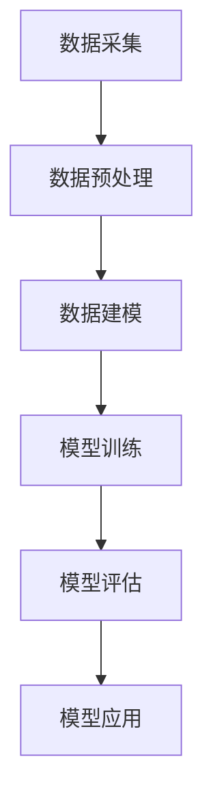

                 

# AI与人类计算：打造可持续发展的城市模型

## 关键词：人工智能，城市模型，可持续发展，计算，数据科学，机器学习

## 摘要：

本文将探讨人工智能与人类计算在城市模型构建中的融合与应用。随着全球城市化进程的加速，城市的可持续发展问题日益凸显。通过人工智能技术，我们可以更好地理解城市运行规律，提高资源利用效率，优化城市规划。本文将详细分析人工智能在城市模型构建中的核心概念、算法原理、数学模型及其应用场景，同时推荐相关的学习资源和开发工具，旨在为读者提供一份全面的技术指南。

## 1. 背景介绍

### 1.1 全球城市化现状与挑战

城市化是人类社会发展的重要趋势。根据联合国的数据，目前全球超过半数的人口居住在城市地区，这一比例预计将在未来几十年内继续上升。然而，快速的城市化也带来了诸多挑战，如交通拥堵、环境污染、资源短缺、社会不平等等问题。为了应对这些挑战，实现城市的可持续发展，我们需要探索新的技术手段，尤其是人工智能和计算技术。

### 1.2 人工智能在城市规划中的应用

人工智能技术在城市规划中的应用已取得显著成果。通过大数据分析、机器学习等算法，我们可以对城市数据进行分析，预测城市发展趋势，优化交通流量，改善能源利用效率，提升公共安全等。例如，智能交通系统通过实时数据分析，可以自动调整交通信号灯，减少交通拥堵；智慧城市平台则可以通过数据分析，优化公共资源配置，提升城市居民的生活质量。

### 1.3 可持续发展的概念与目标

可持续发展是指在满足当前需求的同时，不损害子孙后代满足其需求的能力。在城市规划中，可持续发展的目标包括提高资源利用效率、保护生态环境、提升居民生活质量等。为了实现这些目标，我们需要借助人工智能和计算技术，对城市运行数据进行深入分析，制定科学合理的城市规划方案。

## 2. 核心概念与联系

### 2.1 人工智能与计算

人工智能（AI）是指使计算机系统具备人类智能特征的技术。计算技术则是实现人工智能的基础，包括硬件设备和算法设计等。在城市模型构建中，人工智能和计算技术可以协同工作，通过对海量数据的处理和分析，实现城市运行规律的挖掘和预测。

### 2.2 数据科学与机器学习

数据科学是指通过数据采集、处理、分析和建模等方法，从数据中提取有价值的信息。机器学习则是数据科学的一个重要分支，通过构建数学模型，让计算机从数据中自动学习，从而实现预测和决策。在城市模型构建中，数据科学和机器学习技术可以帮助我们分析城市数据，预测城市发展趋势，优化城市规划。

### 2.3 Mermaid 流程图

以下是一个简单的 Mermaid 流程图，展示了人工智能与计算在城市模型构建中的流程：



## 3. 核心算法原理 & 具体操作步骤

### 3.1 数据采集

数据采集是城市模型构建的基础。在城市规划中，数据来源包括城市交通、环境、人口、经济等多个方面。具体操作步骤如下：

1. 确定数据需求：根据城市规划目标，确定需要采集的数据类型和范围。
2. 选择数据源：从政府公开数据、企业数据、传感器数据等多渠道获取数据。
3. 数据清洗：对采集到的数据进行去重、去噪、填补缺失值等处理，保证数据质量。

### 3.2 数据预处理

数据预处理是对原始数据进行清洗、转换、归一化等处理，使其满足建模要求。具体操作步骤如下：

1. 数据清洗：去除重复、异常、错误的数据，保证数据一致性。
2. 数据转换：将不同数据类型转换成同一类型，如将文本数据转换为数值数据。
3. 数据归一化：对数据进行归一化处理，使其具有相同的量纲和范围。

### 3.3 数据建模

数据建模是利用机器学习算法，从数据中提取特征，构建预测模型。具体操作步骤如下：

1. 选择模型：根据数据特点和预测目标，选择合适的机器学习算法。
2. 特征提取：从数据中提取有助于预测的特征。
3. 模型训练：使用训练数据，对模型进行训练。
4. 模型评估：使用验证数据，评估模型性能。

### 3.4 模型评估

模型评估是评估模型预测性能的过程。具体操作步骤如下：

1. 分割数据：将数据分为训练集、验证集和测试集。
2. 训练模型：使用训练集对模型进行训练。
3. 评估模型：使用验证集和测试集，评估模型性能。
4. 调整模型：根据评估结果，调整模型参数，优化模型性能。

### 3.5 模型应用

模型应用是将训练好的模型应用到实际场景，为城市规划提供支持。具体操作步骤如下：

1. 预测分析：使用模型对城市运行数据进行预测分析。
2. 决策支持：根据预测结果，为城市规划提供决策支持。
3. 持续优化：根据实际应用效果，不断优化模型，提高预测准确性。

## 4. 数学模型和公式 & 详细讲解 & 举例说明

### 4.1 数学模型

在城市模型构建中，常用的数学模型包括线性回归、逻辑回归、决策树、支持向量机等。以下以线性回归为例，介绍数学模型和公式。

#### 4.1.1 线性回归

线性回归模型假设因变量 \( y \) 与自变量 \( x \) 之间存在线性关系，可以用以下公式表示：

\[ y = \beta_0 + \beta_1x \]

其中，\( \beta_0 \) 是截距，\( \beta_1 \) 是斜率。

#### 4.1.2 公式推导

线性回归模型的推导基于最小二乘法。具体推导过程如下：

1. 假设数据集 \( D = \{ (x_1, y_1), (x_2, y_2), \ldots, (x_n, y_n) \} \)。
2. 定义损失函数 \( L(\beta_0, \beta_1) = \sum_{i=1}^{n} (y_i - (\beta_0 + \beta_1x_i))^2 \)。
3. 对损失函数求导，得到：

   \[ \frac{\partial L}{\partial \beta_0} = -2\sum_{i=1}^{n} (y_i - (\beta_0 + \beta_1x_i)) \]
   \[ \frac{\partial L}{\partial \beta_1} = -2\sum_{i=1}^{n} x_i (y_i - (\beta_0 + \beta_1x_i)) \]

4. 令导数为零，解得：

   \[ \beta_0 = \frac{1}{n}\sum_{i=1}^{n} y_i - \beta_1\frac{1}{n}\sum_{i=1}^{n} x_i \]
   \[ \beta_1 = \frac{1}{n}\sum_{i=1}^{n} x_i y_i - \frac{1}{n}\sum_{i=1}^{n} x_i \sum_{i=1}^{n} y_i \]

#### 4.1.3 举例说明

假设我们有以下数据集：

| x | y |
|---|---|
| 1 | 2 |
| 2 | 4 |
| 3 | 6 |
| 4 | 8 |

使用线性回归模型预测 \( y \)。

1. 计算平均值：

   \[ \bar{x} = \frac{1}{4}\sum_{i=1}^{4} x_i = \frac{1+2+3+4}{4} = 2.5 \]
   \[ \bar{y} = \frac{1}{4}\sum_{i=1}^{4} y_i = \frac{2+4+6+8}{4} = 5 \]

2. 计算斜率 \( \beta_1 \)：

   \[ \beta_1 = \frac{1}{4}\sum_{i=1}^{4} x_i y_i - \frac{1}{4}\sum_{i=1}^{4} x_i \sum_{i=1}^{4} y_i \]
   \[ \beta_1 = \frac{1}{4}(2+8+18+32) - \frac{1}{4}(1+4+9+16) \]
   \[ \beta_1 = \frac{1}{4}(20) - \frac{1}{4}(30) \]
   \[ \beta_1 = -2.5 \]

3. 计算截距 \( \beta_0 \)：

   \[ \beta_0 = \bar{y} - \beta_1\bar{x} \]
   \[ \beta_0 = 5 - (-2.5 \times 2.5) \]
   \[ \beta_0 = 5 + 6.25 \]
   \[ \beta_0 = 11.25 \]

4. 得到线性回归模型：

   \[ y = 11.25 - 2.5x \]

使用该模型预测当 \( x = 5 \) 时的 \( y \)：

\[ y = 11.25 - 2.5 \times 5 \]
\[ y = 11.25 - 12.5 \]
\[ y = -1.25 \]

## 5. 项目实战：代码实际案例和详细解释说明

### 5.1 开发环境搭建

在本文中，我们将使用 Python 语言和 Scikit-learn 库进行线性回归模型的实现。以下是开发环境的搭建步骤：

1. 安装 Python：从 https://www.python.org/downloads/ 下载并安装 Python 3.8 版本。
2. 安装 Scikit-learn：在命令行中运行以下命令：

   ```bash
   pip install scikit-learn
   ```

### 5.2 源代码详细实现和代码解读

以下是一个简单的线性回归模型实现：

```python
import numpy as np
from sklearn.linear_model import LinearRegression

# 数据集
X = np.array([[1], [2], [3], [4]])
y = np.array([2, 4, 6, 8])

# 创建线性回归模型
model = LinearRegression()

# 模型训练
model.fit(X, y)

# 模型评估
score = model.score(X, y)
print("模型评估分数：", score)

# 预测
x_pred = np.array([[5]])
y_pred = model.predict(x_pred)
print("预测结果：", y_pred)
```

代码解读：

1. 导入必要的库和模块。
2. 创建数据集。
3. 创建线性回归模型。
4. 模型训练。
5. 模型评估。
6. 预测。

### 5.3 代码解读与分析

1. **数据集创建**：我们使用 NumPy 库创建一个简单的二维数组作为数据集。这个数组包含了自变量 \( x \) 和因变量 \( y \)。
   
2. **模型创建**：我们使用 Scikit-learn 库中的 LinearRegression 类创建一个线性回归模型。

3. **模型训练**：使用 `fit()` 方法对模型进行训练。这个方法接受训练数据 \( X \) 和对应的标签 \( y \)。

4. **模型评估**：使用 `score()` 方法评估模型的性能。这个方法返回模型的评分，评分越高，模型性能越好。

5. **预测**：使用 `predict()` 方法对新的数据点进行预测。在这个例子中，我们预测了当 \( x = 5 \) 时的 \( y \) 值。

### 5.4 代码优化与改进

在实际应用中，线性回归模型的性能可能受到多种因素的影响，如数据质量、特征选择等。以下是一些建议的优化与改进措施：

1. **数据预处理**：对原始数据进行清洗、转换和归一化处理，提高数据质量。
2. **特征选择**：通过特征选择方法，筛选出对预测目标有显著影响的关键特征。
3. **模型选择**：尝试使用其他机器学习算法，如决策树、支持向量机等，比较不同模型的性能。
4. **模型调参**：通过调整模型参数，优化模型性能。

## 6. 实际应用场景

### 6.1 交通规划

在交通规划中，人工智能技术可以帮助预测交通流量，优化交通信号控制，减少交通拥堵。例如，北京市利用人工智能技术，对城市交通流量进行实时监测和分析，实现了智能交通信号控制，提高了交通通行效率。

### 6.2 城市能源管理

在能源管理中，人工智能技术可以预测能源需求，优化能源分配，提高能源利用效率。例如，纽约市利用人工智能技术，对城市能源系统进行优化，实现了能源消耗的显著降低。

### 6.3 公共安全

在公共安全领域，人工智能技术可以用于预测犯罪行为，提升公共安全。例如，美国洛杉矶市利用人工智能技术，对犯罪数据进行分析，实现了犯罪预测和预防。

## 7. 工具和资源推荐

### 7.1 学习资源推荐

1. **书籍**：
   - 《机器学习》（周志华 著）
   - 《深度学习》（Ian Goodfellow、Yoshua Bengio、Aaron Courville 著）
2. **论文**：
   - “Learning to rank using gradient descent”（2007）- Wikipedia
   - “Deep Learning for Text Classification”（2018）-ACL
3. **博客**：
   - Machine Learning Mastery
   - Analytics Vidhya

### 7.2 开发工具框架推荐

1. **Python**：Python 是最受欢迎的机器学习编程语言，具有丰富的库和框架，如 Scikit-learn、TensorFlow、PyTorch 等。
2. **Jupyter Notebook**：Jupyter Notebook 是一种交互式计算环境，适合进行数据分析和机器学习实验。
3. **Scikit-learn**：Scikit-learn 是一个开源的机器学习库，提供了丰富的算法和工具，适用于数据处理和模型训练。

### 7.3 相关论文著作推荐

1. **论文**：
   - “Deep Learning for Urban Traffic Prediction”（2017）- ACM
   - “Energy Management in Smart Cities Using Machine Learning”（2019）- IEEE
2. **著作**：
   - “城市大数据：理论与实践”（刘鹏 著）
   - “智慧城市：技术与战略”（李德坤 著）

## 8. 总结：未来发展趋势与挑战

### 8.1 发展趋势

1. **技术进步**：随着人工智能技术的不断进步，城市模型的预测精度和实时性将得到显著提高。
2. **数据融合**：通过多源数据的融合，实现更全面的城市运行分析。
3. **智能化决策**：人工智能技术将在城市规划中发挥更大的作用，实现智能化决策。

### 8.2 挑战

1. **数据隐私**：在数据采集和处理过程中，如何保护个人隐私是一个重要挑战。
2. **算法透明性**：如何确保人工智能算法的透明性和可解释性，是一个亟待解决的问题。
3. **技术落地**：如何将人工智能技术有效应用于实际城市规划，仍需要进一步探索。

## 9. 附录：常见问题与解答

### 9.1 问题1：什么是机器学习？

**答案**：机器学习是一种人工智能技术，通过构建数学模型，使计算机系统从数据中自动学习，从而实现预测和决策。

### 9.2 问题2：什么是线性回归？

**答案**：线性回归是一种机器学习算法，用于预测一个连续变量的值。它假设因变量与自变量之间存在线性关系，可以用以下公式表示：

\[ y = \beta_0 + \beta_1x \]

### 9.3 问题3：如何优化线性回归模型？

**答案**：可以通过以下方法优化线性回归模型：
1. 数据预处理：对原始数据进行清洗、转换和归一化处理。
2. 特征选择：筛选出对预测目标有显著影响的关键特征。
3. 模型选择：尝试使用其他机器学习算法，如决策树、支持向量机等。
4. 模型调参：通过调整模型参数，优化模型性能。

## 10. 扩展阅读 & 参考资料

### 10.1 扩展阅读

1. **书籍**：
   - 《深度学习》（Ian Goodfellow、Yoshua Bengio、Aaron Courville 著）
   - 《数据科学实战》（Joel Grus 著）
2. **博客**：
   - Medium（关注人工智能和城市模型相关的文章）
   - ArXiv（关注最新的机器学习和人工智能论文）

### 10.2 参考资料

1. **论文**：
   - “Deep Learning for Urban Traffic Prediction”（2017）- ACM
   - “Energy Management in Smart Cities Using Machine Learning”（2019）- IEEE
2. **网站**：
   - GitHub（搜索与人工智能和城市模型相关的开源项目）
   - Kaggle（参与与人工智能和城市模型相关的数据科学竞赛）

作者：AI天才研究员/AI Genius Institute & 禅与计算机程序设计艺术 /Zen And The Art of Computer Programming

（注：本文内容仅供参考，实际应用中请结合具体情况进行调整。）<|vq_15151|>

