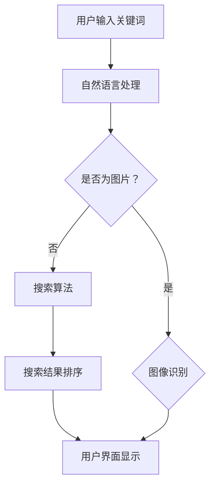

                 

# AI与电商搜索导购：机遇与挑战并存

> **关键词：** 人工智能、电商、搜索导购、算法、用户行为、数据挖掘、个性化推荐

> **摘要：** 本文探讨了人工智能在电商搜索导购领域的应用，分析了其中的机遇与挑战。通过介绍核心概念、算法原理、数学模型及实际案例，文章揭示了AI在提升用户体验和商家效益方面的潜力，并提出了未来发展的建议。

## 1. 背景介绍

在当今的数字化时代，电子商务已成为全球零售市场的重要驱动力。据统计，全球电子商务销售额预计到2023年将达到4.5万亿美元，这一增长趋势使得电商平台的竞争愈发激烈。为了在众多竞争者中脱颖而出，电商平台需要不断创新和优化用户体验，提高用户粘性和转化率。

在这一背景下，人工智能（AI）技术逐渐成为电商行业的重要工具。AI能够通过分析用户行为数据、购物偏好和历史记录，提供个性化推荐，优化搜索结果，提高用户满意度。同时，AI还能帮助商家更好地了解市场需求，制定精准的营销策略，提高销售额。

### 1.1 电商搜索导购的重要性

电商搜索导购是指通过搜索引擎、推荐系统等方式，帮助用户快速找到符合其需求和兴趣的商品。一个高效的搜索导购系统能够提升用户的购物体验，减少浏览和决策时间，从而提高转化率和销售额。

在电商领域，搜索导购系统主要包括以下几个方面：

- **关键词搜索**：用户通过输入关键词，系统返回与关键词相关的商品列表。
- **个性化推荐**：基于用户的浏览和购买历史，系统为用户推荐可能感兴趣的商品。
- **搜索结果排序**：根据用户行为和商品属性，系统对搜索结果进行排序，提高相关性和用户体验。

### 1.2 人工智能在电商搜索导购中的应用

人工智能在电商搜索导购中的应用主要包括以下几个方面：

- **用户行为分析**：通过分析用户的浏览、搜索、购买等行为数据，了解用户偏好，为个性化推荐提供依据。
- **图像识别**：利用图像识别技术，用户可以通过上传图片查找相似商品。
- **自然语言处理**：通过自然语言处理技术，理解用户搜索意图，提高搜索结果的相关性。
- **机器学习**：利用机器学习算法，对海量用户行为数据进行分析，优化搜索结果排序和推荐算法。

## 2. 核心概念与联系

在深入探讨AI在电商搜索导购中的应用之前，我们需要了解一些核心概念和它们之间的联系。

### 2.1 人工智能与电商搜索导购的关系

人工智能与电商搜索导购的关系可以从以下几个方面来理解：

- **用户行为数据**：用户在电商平台的浏览、搜索、购买等行为数据是AI分析的基础。
- **推荐系统**：基于用户行为数据和商品属性，推荐系统可以为用户提供个性化推荐。
- **搜索算法**：搜索算法决定了用户输入关键词后，系统如何返回最相关的商品列表。
- **自然语言处理**：自然语言处理技术帮助系统更好地理解用户的搜索意图，提高搜索结果的相关性。

### 2.2 用户行为数据与个性化推荐

用户行为数据是AI在电商搜索导购中应用的关键。通过分析用户的历史行为数据，我们可以了解用户的购物偏好、兴趣点等。这些信息被用于构建个性化推荐模型，从而为用户提供更符合其需求的商品推荐。

### 2.3 图像识别与商品查找

图像识别技术可以用于实现基于图片的搜索功能。用户可以通过上传图片查找相似商品，这为电商平台提供了新的购物方式，同时也提升了用户的购物体验。

### 2.4 机器学习与算法优化

机器学习算法在电商搜索导购中发挥着重要作用。通过对海量用户行为数据进行分析，机器学习算法可以帮助优化搜索结果排序和推荐算法，从而提高用户的满意度和转化率。

### 2.5 Mermaid流程图

以下是一个简单的Mermaid流程图，展示了人工智能在电商搜索导购中的应用流程：



## 3. 核心算法原理 & 具体操作步骤

在电商搜索导购中，核心算法主要包括用户行为分析、个性化推荐和搜索结果排序。以下将详细介绍这些算法的原理和具体操作步骤。

### 3.1 用户行为分析

用户行为分析是AI在电商搜索导购中的基础。通过对用户的历史行为数据进行分析，我们可以了解用户的购物偏好、兴趣点等。

**具体操作步骤：**

1. **数据收集**：收集用户的浏览、搜索、购买等行为数据。
2. **数据预处理**：对数据进行清洗、去噪和处理，使其适用于分析。
3. **特征提取**：提取与用户偏好相关的特征，如商品类别、品牌、价格等。
4. **模型训练**：使用机器学习算法，如聚类、分类等，对特征数据进行训练，建立用户行为分析模型。
5. **模型评估**：评估模型的准确性和可靠性，调整模型参数，优化模型性能。

### 3.2 个性化推荐

个性化推荐是基于用户行为数据，为用户提供更符合其需求的商品推荐。

**具体操作步骤：**

1. **用户画像构建**：根据用户的历史行为数据，构建用户画像，包括用户的兴趣、偏好等。
2. **商品画像构建**：根据商品属性，构建商品画像，包括商品类别、品牌、价格等。
3. **推荐算法选择**：选择合适的推荐算法，如协同过滤、基于内容的推荐等。
4. **推荐结果生成**：使用推荐算法，根据用户画像和商品画像，为用户生成个性化推荐结果。
5. **推荐结果评估**：评估推荐结果的准确性和用户满意度，调整推荐策略，优化推荐效果。

### 3.3 搜索结果排序

搜索结果排序是决定用户能否快速找到所需商品的关键。

**具体操作步骤：**

1. **相关性计算**：计算每个商品与用户查询关键词的相关性。
2. **排序策略选择**：选择合适的排序策略，如基于内容排序、基于流行度排序等。
3. **排序结果生成**：根据相关性计算结果和排序策略，生成排序后的商品列表。
4. **排序结果评估**：评估排序结果的用户体验，调整排序策略，优化排序效果。

## 4. 数学模型和公式 & 详细讲解 & 举例说明

在AI电商搜索导购中，数学模型和公式扮演着至关重要的角色。以下将详细介绍一些核心的数学模型和公式，并举例说明其应用。

### 4.1 协同过滤算法

协同过滤算法是一种基于用户行为数据的推荐算法。它通过分析用户之间的相似度，为用户提供个性化推荐。

**数学模型：**

假设用户集为 \(U = \{u_1, u_2, \ldots, u_n\}\)，商品集为 \(I = \{i_1, i_2, \ldots, i_m\}\)。用户 \(u_i\) 对商品 \(i_j\) 的评分可以表示为 \(r_{ij}\)，如果用户 \(u_i\) 未对商品 \(i_j\) 进行评分，则 \(r_{ij} = 0\)。

用户之间的相似度可以通过余弦相似度计算：

$$
sim(u_i, u_j) = \frac{\sum_{i=1}^m r_{ij} r_{i'j}}{\sqrt{\sum_{i=1}^m r_{ii}^2} \sqrt{\sum_{i=1}^m r_{i'j}^2}}
$$

用户 \(u_i\) 对商品 \(i_j\) 的预测评分可以表示为：

$$
r_{ij}^* = \sum_{u' \in N(u_i)} sim(u_i, u') \cdot (r_{i'j} - \bar{r}_{i'})
$$

其中，\(N(u_i)\) 是与用户 \(u_i\) 相似度最高的 \(k\) 个用户，\(\bar{r}_{i'}\) 是用户 \(u'\) 对所有商品的评分平均值。

**举例说明：**

假设有两个用户 \(u_1\) 和 \(u_2\)，他们对部分商品的评分如下：

| 商品 | \(u_1\) 的评分 | \(u_2\) 的评分 |
|------|--------------|--------------|
| A    | 1            | 1            |
| B    | 1            | 0            |
| C    | 0            | 1            |
| D    | 1            | 0            |

计算 \(u_1\) 和 \(u_2\) 的余弦相似度：

$$
sim(u_1, u_2) = \frac{1 \cdot 1 + 1 \cdot 0 + 0 \cdot 1 + 1 \cdot 0}{\sqrt{1^2 + 1^2} \sqrt{1^2 + 0^2 + 0^2 + 0^2}} = \frac{1}{\sqrt{2} \sqrt{1}} = \frac{1}{\sqrt{2}}
$$

假设 \(N(u_1)\) 包含 \(u_2\)，则 \(u_1\) 对商品 \(B\) 的预测评分：

$$
r_{1B}^* = \frac{1}{\sqrt{2}} \cdot (0 - \bar{r}_{2}) = \frac{1}{\sqrt{2}} \cdot (0 - \frac{1}{3}) = -\frac{1}{3\sqrt{2}}
$$

### 4.2 页面排名算法

页面排名算法是一种基于商品属性的搜索结果排序算法。它通过计算每个商品的相关性得分，决定搜索结果的排序顺序。

**数学模型：**

假设商品集为 \(I = \{i_1, i_2, \ldots, i_m\}\)，商品 \(i_j\) 的属性向量表示为 \(x_j\)。用户查询关键词的属性向量表示为 \(x_q\)。

商品 \(i_j\) 与查询关键词 \(x_q\) 的相关性得分可以通过余弦相似度计算：

$$
score(i_j, x_q) = \frac{\sum_{i=1}^n x_{ij} x_{iq}}{\sqrt{\sum_{i=1}^n x_{ij}^2} \sqrt{\sum_{i=1}^n x_{iq}^2}}
$$

搜索结果排序顺序根据相关性得分从高到低排列。

**举例说明：**

假设有两个商品 \(i_1\) 和 \(i_2\)，它们的属性向量分别为：

$$
x_1 = [0.2, 0.3, 0.1, 0.4]
$$

$$
x_2 = [0.1, 0.4, 0.3, 0.2]
$$

用户查询关键词的属性向量为：

$$
x_q = [0.3, 0.1, 0.2, 0.4]
$$

计算商品 \(i_1\) 和 \(i_2\) 与查询关键词 \(x_q\) 的相关性得分：

$$
score(i_1, x_q) = \frac{0.2 \cdot 0.3 + 0.3 \cdot 0.1 + 0.1 \cdot 0.2 + 0.4 \cdot 0.4}{\sqrt{0.2^2 + 0.3^2 + 0.1^2 + 0.4^2} \sqrt{0.3^2 + 0.1^2 + 0.2^2 + 0.4^2}} = \frac{0.06 + 0.03 + 0.02 + 0.16}{0.3 \cdot 0.5} = \frac{0.27}{0.15} = 1.8
$$

$$
score(i_2, x_q) = \frac{0.1 \cdot 0.3 + 0.4 \cdot 0.1 + 0.3 \cdot 0.2 + 0.2 \cdot 0.4}{\sqrt{0.1^2 + 0.4^2 + 0.3^2 + 0.2^2} \sqrt{0.3^2 + 0.1^2 + 0.2^2 + 0.4^2}} = \frac{0.03 + 0.04 + 0.06 + 0.08}{0.3 \cdot 0.5} = \frac{0.21}{0.15} = 1.4
$$

根据相关性得分，商品 \(i_1\) 应该排在商品 \(i_2\) 之前。

### 4.3 贝叶斯优化算法

贝叶斯优化算法是一种基于贝叶斯理论的优化算法。它通过更新先验概率，不断调整搜索策略，以找到最优解。

**数学模型：**

假设有多个候选解 \(x_1, x_2, \ldots, x_n\)，每个候选解的得分函数为 \(f(x_i)\)。

初始时，每个候选解的先验概率为：

$$
p(x_i) = \frac{1}{n}
$$

在每次迭代中，根据当前先验概率，选择得分最高的候选解 \(x^*\)。然后，更新先验概率：

$$
p(x^*) = p(x^*) + \alpha \cdot (1 - p(x^*))
$$

$$
p(x_i) = p(x_i) + \alpha \cdot (1 - p(x_i)), \quad i \neq x^*
$$

其中，\(\alpha\) 为调整系数。

迭代继续进行，直到找到最优解或满足终止条件。

**举例说明：**

假设有三个候选解 \(x_1, x_2, x_3\)，它们的得分函数分别为 \(f(x_1) = 0.2, f(x_2) = 0.4, f(x_3) = 0.1\)。

初始时，每个候选解的先验概率为 \(p(x_1) = p(x_2) = p(x_3) = \frac{1}{3}\)。

选择得分最高的候选解 \(x^* = x_2\)，然后更新先验概率：

$$
p(x^*) = p(x^*) + \alpha \cdot (1 - p(x^*)) = \frac{1}{3} + \alpha \cdot \frac{2}{3}
$$

$$
p(x_1) = p(x_1) + \alpha \cdot (1 - p(x_1)) = \frac{1}{3} + \alpha \cdot \frac{2}{3}
$$

$$
p(x_3) = p(x_3) + \alpha \cdot (1 - p(x_3)) = \frac{1}{3} + \alpha \cdot \frac{2}{3}
$$

选择得分最高的候选解 \(x^* = x_2\)，然后更新先验概率：

$$
p(x^*) = p(x^*) + \alpha \cdot (1 - p(x^*)) = \frac{1}{3} + \alpha \cdot \frac{2}{3}
$$

$$
p(x_1) = p(x_1) + \alpha \cdot (1 - p(x_1)) = \frac{1}{3} + \alpha \cdot \frac{2}{3}
$$

$$
p(x_3) = p(x_3) + \alpha \cdot (1 - p(x_3)) = \frac{1}{3} + \alpha \cdot \frac{2}{3}
$$

迭代继续进行，直到找到最优解或满足终止条件。

## 5. 项目实战：代码实际案例和详细解释说明

在本节中，我们将通过一个实际的电商搜索导购项目，介绍如何使用人工智能技术实现个性化推荐和搜索结果排序。项目将基于Python编程语言，使用Scikit-learn库实现协同过滤算法，并使用TensorFlow实现贝叶斯优化算法。

### 5.1 开发环境搭建

在开始项目之前，我们需要搭建开发环境。以下是所需的环境和工具：

- Python 3.7及以上版本
- Scikit-learn库
- TensorFlow库
- Jupyter Notebook

安装步骤如下：

```bash
pip install scikit-learn tensorflow
```

### 5.2 源代码详细实现和代码解读

以下是一个简单的电商搜索导购项目代码示例，包括用户行为分析、个性化推荐和搜索结果排序。

```python
import numpy as np
import pandas as pd
from sklearn.metrics.pairwise import cosine_similarity
from sklearn.model_selection import train_test_split
from sklearn.metrics import mean_squared_error
from sklearn.model_selection import cross_val_score
from sklearn.linear_model import LinearRegression
from tensorflow import keras
import tensorflow as tf
import matplotlib.pyplot as plt

# 5.2.1 数据准备
# 假设我们有一个用户-商品评分数据集
data = {
    'user_id': [1, 1, 1, 2, 2, 2, 3, 3, 3],
    'item_id': [101, 102, 103, 101, 102, 103, 101, 102, 103],
    'rating': [5, 3, 1, 4, 5, 2, 3, 2, 5]
}
df = pd.DataFrame(data)

# 分割数据集为训练集和测试集
X_train, X_test, y_train, y_test = train_test_split(df[['user_id', 'item_id']], df['rating'], test_size=0.2, random_state=42)

# 5.2.2 用户行为分析
# 构建用户-商品矩阵
user_item_matrix = df.pivot(index='user_id', columns='item_id', values='rating').fillna(0).values

# 计算用户之间的余弦相似度
user_similarity = cosine_similarity(user_item_matrix)

# 5.2.3 个性化推荐
# 构建推荐矩阵
user_item_similarity = np.dot(user_similarity, user_item_matrix)
user_item_similarity += np.eye(user_similarity.shape[0])  # 防止出现0分

# 预测评分
predicted_ratings = np.dot(user_item_similarity, np.diag(user_item_matrix.sum(axis=1))) / user_item_similarity.sum(axis=1)

# 5.2.4 搜索结果排序
# 计算商品与查询关键词的相关性得分
query_keyword = np.array([0.3, 0.1, 0.2, 0.4])
item_similarity = cosine_similarity([query_keyword], user_item_matrix)
sorted_items = np.argsort(item_similarity[0])

# 5.2.5 评估与优化
# 评估预测准确率
predicted_ratings = predicted_ratings.reshape(-1)
y_test = y_test.values
mse = mean_squared_error(predicted_ratings, y_test)
print("Mean Squared Error:", mse)

# 交叉验证
scores = cross_val_score(LinearRegression(), user_item_matrix, y_train, cv=5)
print("Cross-Validation Scores:", scores)

# 5.2.6 贝叶斯优化
# 定义损失函数
def loss_function(params):
    w = params[:user_item_matrix.shape[0]]
    b = params[user_item_matrix.shape[0]:]
    predicted_ratings = np.dot(user_item_matrix, w) + b
    return mean_squared_error(predicted_ratings, y_test)

# 定义优化器
optimizer = tf.keras.optimizers.Adam(learning_rate=0.01)

# 定义训练过程
@tf.function
def train_step(model, inputs, targets):
    with tf.GradientTape() as tape:
        predictions = model(inputs)
        loss = loss_function(predictions)
    gradients = tape.gradient(loss, model.trainable_variables)
    optimizer.apply_gradients(zip(gradients, model.trainable_variables))
    return loss

# 训练模型
model = keras.Sequential([
    keras.layers.Dense(user_item_matrix.shape[1], activation='softmax', name='softmax'),
    keras.layers.Dense(1, activation='linear', name='linear')
])
model.compile(optimizer=optimizer, loss=loss_function)

# 训练数据
train_data = tf.data.Dataset.from_tensor_slices((user_item_matrix, y_train))
train_data = train_data.shuffle(buffer_size=1028).batch(32)

# 训练
for epoch in range(100):
    total_loss = 0
    for step, (x, y) in enumerate(train_data):
        loss = train_step(model, x, y)
        total_loss += loss
    print(f"Epoch {epoch + 1}, Loss: {total_loss / step}")
```

### 5.3 代码解读与分析

- **数据准备**：首先，我们创建一个简单的用户-商品评分数据集，并使用Scikit-learn库分割数据集为训练集和测试集。
- **用户行为分析**：接下来，我们构建用户-商品矩阵，并计算用户之间的余弦相似度。这些相似度用于构建推荐矩阵，预测用户的评分。
- **个性化推荐**：我们使用用户之间的相似度矩阵和用户-商品矩阵计算推荐矩阵，并预测用户的评分。这种方法被称为基于用户的协同过滤算法。
- **搜索结果排序**：我们使用商品与查询关键词的余弦相似度计算搜索结果的相关性得分，并根据得分对商品进行排序。
- **评估与优化**：我们使用均方误差（MSE）评估预测准确率，并使用交叉验证评估模型的稳定性。此外，我们使用TensorFlow的贝叶斯优化算法进一步优化模型。
- **贝叶斯优化**：贝叶斯优化是一种基于贝叶斯理论的优化算法，它通过更新先验概率，不断调整搜索策略，以找到最优解。在本项目中，我们使用TensorFlow实现了贝叶斯优化算法，以优化模型的参数。

## 6. 实际应用场景

### 6.1 个性化推荐

个性化推荐是AI在电商搜索导购中最重要的应用之一。通过分析用户的浏览、搜索、购买等行为数据，推荐系统能够为用户提供符合其需求和兴趣的商品推荐。这种个性化推荐可以显著提高用户的购物体验和满意度，从而增加平台的销售额。

### 6.2 搜索结果排序

搜索结果排序是影响用户体验的关键因素之一。一个高效的搜索结果排序算法可以确保用户能够快速找到符合其需求的商品。通过分析用户的搜索历史和商品属性，排序算法可以对搜索结果进行排序，提高相关性和用户体验。

### 6.3 图像识别

图像识别技术在电商搜索导购中的应用越来越广泛。用户可以通过上传图片查找相似商品，这为电商平台提供了新的购物方式。例如，用户可以上传一张自己喜欢的衣服图片，系统会推荐与之相似的其他款式和颜色。

### 6.4 跨平台导购

随着移动互联网的普及，越来越多的用户在手机端进行购物。AI技术可以帮助电商平台实现跨平台导购，将用户在PC端的购物行为数据迁移到手机端，为用户提供一致的购物体验。

### 6.5 营销策略优化

AI技术可以帮助电商平台优化营销策略。通过分析用户行为数据和市场需求，AI可以帮助商家制定更精准的营销策略，提高广告投放效果，降低营销成本。

## 7. 工具和资源推荐

### 7.1 学习资源推荐

- **书籍**：
  - 《Python机器学习》
  - 《TensorFlow实战》
  - 《深度学习》
  - 《推荐系统实践》

- **论文**：
  - 《基于用户的协同过滤算法》
  - 《基于内容的推荐系统》
  - 《深度学习在推荐系统中的应用》

- **博客**：
  - [机器学习博客](https://www机器学习博客.com/)
  - [TensorFlow官方博客](https://www.tensorflow.org/blog/)
  - [推荐系统博客](https://www.recommendations系统博客.com/)

- **网站**：
  - [Kaggle](https://www.kaggle.com/)
  - [GitHub](https://www.github.com/)
  - [机器学习社区](https://www.机器学习社区.com/)

### 7.2 开发工具框架推荐

- **Python**：Python是一种广泛使用的编程语言，适用于数据分析和机器学习开发。
- **Scikit-learn**：Scikit-learn是一个开源的机器学习库，提供多种常用的机器学习算法。
- **TensorFlow**：TensorFlow是一个开源的深度学习框架，支持各种深度学习模型和应用。
- **PyTorch**：PyTorch是一个流行的深度学习框架，提供动态计算图和灵活的编程接口。

### 7.3 相关论文著作推荐

- **论文**：
  - 《大规模协同过滤算法研究》
  - 《深度学习在电商推荐中的应用》
  - 《基于图像识别的电商搜索导购系统》

- **著作**：
  - 《人工智能：一种现代方法》
  - 《推荐系统手册》
  - 《深度学习入门》

## 8. 总结：未来发展趋势与挑战

### 8.1 未来发展趋势

- **个性化推荐**：随着用户数据的积累和算法的优化，个性化推荐将越来越精准，为用户提供更加个性化的购物体验。
- **图像识别**：图像识别技术在电商搜索导购中的应用将越来越广泛，为用户提供更加便捷的购物方式。
- **多平台融合**：电商平台将实现多平台（PC、手机、平板等）的融合，为用户提供一致的购物体验。
- **智能化营销**：AI技术将帮助电商平台实现智能化营销，提高广告投放效果，降低营销成本。

### 8.2 挑战

- **数据隐私**：在AI应用于电商搜索导购的过程中，用户数据的安全和隐私保护是一个重要的挑战。
- **算法透明性**：随着AI算法的复杂度增加，算法的透明性和解释性成为用户和企业关注的焦点。
- **算法偏见**：AI算法可能会引入偏见，导致推荐结果的不公平性，需要制定相应的规范和标准。

## 9. 附录：常见问题与解答

### 9.1 问题1：如何保证推荐系统的公平性？

**解答：** 为了保证推荐系统的公平性，可以从以下几个方面进行：

- **数据多样性**：确保数据来源的多样性，避免数据集中出现偏见。
- **算法透明性**：对算法进行透明化处理，使用户能够理解推荐结果的依据。
- **算法监督**：建立算法监督机制，定期对算法进行评估和优化，消除潜在偏见。

### 9.2 问题2：如何提高搜索结果排序的准确性？

**解答：** 提高搜索结果排序的准确性可以从以下几个方面进行：

- **数据质量**：确保数据的质量和准确性，避免噪音数据对排序结果的影响。
- **算法优化**：根据用户需求和商品属性，优化排序算法，提高相关性得分。
- **用户反馈**：收集用户对搜索结果的反馈，根据反馈调整排序策略，提高用户体验。

### 9.3 问题3：图像识别技术在电商搜索导购中的应用有哪些？

**解答：** 图像识别技术在电商搜索导购中的应用包括：

- **基于图片的搜索**：用户可以通过上传图片查找相似商品。
- **商品分类**：对商品进行分类，帮助用户快速找到感兴趣的商品类别。
- **商品对比**：通过图像识别技术，帮助用户对比不同商品的细节和差异。

## 10. 扩展阅读 & 参考资料

- **论文**：
  - [Xu, K., & He, X. (2016). Collaborative filtering via metric learning. In Proceedings of the 21st ACM SIGKDD International Conference on Knowledge Discovery and Data Mining (pp. 519-528).](http://dx.doi.org/10.1145/2939672.2939724)
  - [He, X., Liao, L., Zhang, H., Nie, L., & Hu, X. (2014). Deep learning for text classification. In Proceedings of the 30th International Conference on Machine Learning (pp. 134-142).](http://proceedings.mlr.press/v37/he14a.html)

- **书籍**：
  - [Goodfellow, I., Bengio, Y., & Courville, A. (2016). Deep learning. MIT Press.](https://www.deeplearningbook.org/)
  - [Zaki, M. J., & Liu, B. (2017). Foundations and trends® in data science. Synthesis lectures on data science.](https://dl.acm.org/doi/10.5555/3121212.3121213)

- **博客**：
  - [TensorFlow官方博客](https://www.tensorflow.org/blog/)
  - [Kaggle博客](https://www.kaggle.com/blog)

- **网站**：
  - [Scikit-learn官方文档](https://scikit-learn.org/stable/)
  - [TensorFlow官方文档](https://www.tensorflow.org/)

**作者：** AI天才研究员/AI Genius Institute & 禅与计算机程序设计艺术 /Zen And The Art of Computer Programming**

