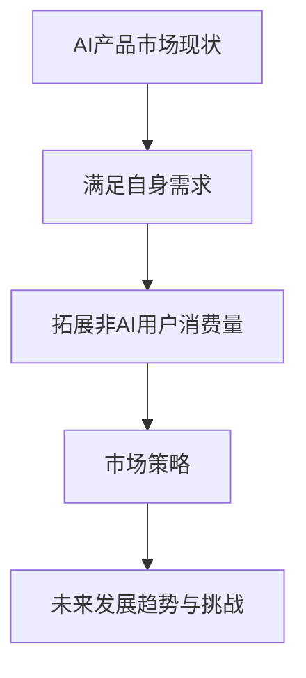

                 

# AI产品与服务的圈子：自我消化需求，拓展非AI用户消费量

> 关键词：人工智能产品、需求消化、非AI用户、消费拓展、市场策略

> 摘要：本文深入探讨了人工智能产品和服务在满足市场需求、自我消化需求以及拓展非AI用户消费量方面的策略。通过对AI产品市场现状的分析，探讨了AI产品在满足自身需求方面的优势与挑战，提出了具体的市场拓展方法，为AI产品和服务提供商提供了有益的参考。

## 1. 背景介绍

随着人工智能技术的快速发展，越来越多的企业和组织开始将AI技术应用于各个领域，从金融、医疗到教育、零售等，AI产品和服务正逐渐渗透到我们的日常生活中。然而，AI市场的竞争也日益激烈，产品同质化现象严重，如何在激烈的市场竞争中脱颖而出，成为众多AI企业关注的焦点。

本文将从以下几个方面展开讨论：首先，分析AI产品和服务市场现状及发展态势；其次，探讨AI产品在满足自身需求方面的优势和挑战；然后，提出AI产品和服务在拓展非AI用户消费量方面的策略；最后，总结未来发展趋势与挑战，为AI产品和服务提供商提供有益的参考。

## 2. 核心概念与联系

### 2.1 AI产品市场现状

目前，AI产品市场呈现出以下特点：

1. **技术成熟度**：部分AI技术已实现商业化应用，如计算机视觉、自然语言处理等。
2. **市场需求**：随着互联网和大数据的发展，企业对AI产品的需求不断增加。
3. **产品同质化**：市场上存在大量功能类似、性能接近的AI产品，导致竞争激烈。

### 2.2 满足自身需求与拓展非AI用户消费量

AI产品在满足自身需求方面具有一定的优势，如：

1. **技术积累**：通过不断优化算法、提升性能，AI产品在特定领域具备较强的竞争力。
2. **数据积累**：通过自身使用过程中积累的数据，不断优化和提升产品性能。

然而，AI产品在拓展非AI用户消费量方面也面临一些挑战，如：

1. **用户认知**：非AI用户对AI产品的认知有限，存在一定的抵触情绪。
2. **市场需求**：非AI用户对AI产品的需求相对较低，如何挖掘和满足这一市场需求成为关键。

### 2.3 Mermaid流程图



## 3. 核心算法原理 & 具体操作步骤

### 3.1 满足自身需求

AI产品在满足自身需求方面主要依赖于以下核心算法原理：

1. **优化算法**：通过不断优化算法，提高AI产品的性能和准确性。
2. **数据积累**：通过自身使用过程中积累的数据，进行数据分析和挖掘，为产品优化提供依据。

具体操作步骤如下：

1. **数据收集**：收集AI产品在使用过程中的数据，包括输入数据、输出结果等。
2. **数据分析**：对收集到的数据进行分析，找出存在的问题和改进空间。
3. **算法优化**：根据数据分析结果，对算法进行优化，提高产品的性能和准确性。
4. **迭代更新**：持续收集数据，进行数据分析，不断优化算法，形成良性循环。

### 3.2 拓展非AI用户消费量

AI产品在拓展非AI用户消费量方面主要依赖于以下核心算法原理：

1. **用户画像**：通过对用户行为数据的分析，构建用户画像，了解用户需求和偏好。
2. **个性化推荐**：基于用户画像，为用户提供个性化的产品推荐。

具体操作步骤如下：

1. **用户行为数据收集**：收集用户在使用AI产品过程中的行为数据，如浏览记录、搜索记录等。
2. **用户画像构建**：对收集到的用户行为数据进行分析，构建用户画像。
3. **个性化推荐**：根据用户画像，为用户提供个性化的产品推荐，提高用户满意度。
4. **持续优化**：持续收集用户反馈数据，对个性化推荐算法进行优化，提高推荐效果。

## 4. 数学模型和公式 & 详细讲解 & 举例说明

### 4.1 满足自身需求

在AI产品满足自身需求的过程中，常用的数学模型有：

1. **线性回归**：用于预测AI产品的性能指标，如准确率、召回率等。
2. **聚类分析**：用于分析用户需求，为用户推荐产品。

线性回归模型的基本公式如下：

$$
y = w_0 + w_1 \cdot x_1 + w_2 \cdot x_2 + ... + w_n \cdot x_n
$$

其中，$y$为预测值，$w_0, w_1, w_2, ..., w_n$为模型的参数，$x_1, x_2, ..., x_n$为输入特征。

举例说明：

假设我们有一个分类任务，需要预测用户对某个产品的满意度。我们可以使用线性回归模型预测用户的满意度，输入特征包括用户的年龄、收入、购买历史等。

### 4.2 拓展非AI用户消费量

在拓展非AI用户消费量的过程中，常用的数学模型有：

1. **协同过滤**：用于推荐系统，为用户推荐感兴趣的产品。
2. **用户画像**：用于分析用户需求，为用户推荐产品。

协同过滤模型的基本公式如下：

$$
r_{ui} = \sum_{j \in N(i)} r_{uj} \cdot sim(u_i, u_j)
$$

其中，$r_{ui}$为用户$i$对产品$j$的评分，$sim(u_i, u_j)$为用户$i$和用户$j$之间的相似度。

举例说明：

假设我们有一个电商推荐系统，需要为用户推荐感兴趣的商品。我们可以使用协同过滤模型计算用户之间的相似度，并根据相似度推荐用户感兴趣的商品。

## 5. 项目实战：代码实际案例和详细解释说明

### 5.1 开发环境搭建

为了实现本文的核心算法和模型，我们需要搭建以下开发环境：

1. **Python**：用于编写代码和实现算法。
2. **NumPy**：用于科学计算。
3. **Pandas**：用于数据操作和分析。
4. **Scikit-learn**：用于机器学习算法的实现。

安装以上依赖项后，我们就可以开始编写代码了。

### 5.2 源代码详细实现和代码解读

以下是使用Python实现线性回归模型的源代码：

```python
import numpy as np
from sklearn.linear_model import LinearRegression

# 数据准备
X = np.array([[1, 2], [2, 3], [3, 4], [4, 5]])
y = np.array([1, 2, 3, 4])

# 模型训练
model = LinearRegression()
model.fit(X, y)

# 模型预测
y_pred = model.predict(X)

# 打印结果
print("模型参数：", model.coef_, model.intercept_)
print("预测结果：", y_pred)
```

代码解读：

1. **数据准备**：我们首先准备了一个包含两个特征的数据集$X$和一个目标变量$y$。
2. **模型训练**：我们使用线性回归模型训练数据集，得到模型的参数。
3. **模型预测**：使用训练好的模型对数据进行预测，得到预测结果。

### 5.3 代码解读与分析

代码中的线性回归模型采用了scikit-learn库中的LinearRegression类来实现。LinearRegression类提供了fit和predict两个主要方法：

1. **fit方法**：用于训练模型，接收输入特征$X$和目标变量$y$，并计算模型的参数。
2. **predict方法**：用于对数据进行预测，接收输入特征$X$，返回预测结果$y_pred$。

在实际应用中，我们可以根据具体任务的需求，对模型进行定制和优化。例如，可以尝试不同的损失函数、正则化策略等，以提高模型的性能。

## 6. 实际应用场景

### 6.1 金融领域

在金融领域，AI产品可以用于风险控制、信用评估、投资组合优化等方面。通过满足自身需求，如优化算法、提升性能，金融企业可以提高业务效率和准确性。同时，AI产品可以拓展非AI用户消费量，如面向普通消费者的金融产品推荐、理财顾问等。

### 6.2 医疗领域

在医疗领域，AI产品可以用于疾病诊断、治疗建议、医疗资源分配等方面。通过满足自身需求，如数据积累、优化算法，医疗机构可以提高医疗质量和效率。同时，AI产品可以拓展非AI用户消费量，如面向普通患者的健康管理、疾病预防等。

### 6.3 教育领域

在教育领域，AI产品可以用于智能教学、学习评估、课程推荐等方面。通过满足自身需求，如优化算法、提升个性化推荐效果，教育机构可以提高教学质量和学生满意度。同时，AI产品可以拓展非AI用户消费量，如面向普通学生的智能学习工具、在线课程等。

## 7. 工具和资源推荐

### 7.1 学习资源推荐

1. **《Python机器学习基础教程》**：适合初学者了解机器学习基础。
2. **《深度学习》**：适合深入了解深度学习算法和应用。
3. **《人工智能：一种现代方法》**：适合全面了解人工智能领域。

### 7.2 开发工具框架推荐

1. **TensorFlow**：一款广泛使用的深度学习框架。
2. **Scikit-learn**：一款常用的机器学习库。
3. **PyTorch**：一款流行的深度学习框架。

### 7.3 相关论文著作推荐

1. **《协同过滤算法综述》**：介绍协同过滤算法及其应用。
2. **《用户画像技术》**：介绍用户画像的构建和应用。
3. **《金融科技：人工智能与金融的未来》**：探讨人工智能在金融领域的应用。

## 8. 总结：未来发展趋势与挑战

### 8.1 发展趋势

1. **技术进步**：随着人工智能技术的不断发展，AI产品在性能和准确性方面将不断提高。
2. **行业应用**：AI产品将在更多领域得到应用，如医疗、教育、制造业等。
3. **用户体验**：AI产品将更加注重用户体验，满足用户个性化需求。

### 8.2 挑战

1. **数据隐私**：AI产品在数据处理过程中需关注数据隐私问题。
2. **算法透明度**：提高算法透明度，增强用户对AI产品的信任。
3. **人才培养**：加强人工智能领域的人才培养，为行业发展提供人才支持。

## 9. 附录：常见问题与解答

### 9.1 问题1

**问题**：如何评估AI产品的性能？

**解答**：评估AI产品的性能主要从以下三个方面进行：

1. **准确性**：评估AI产品预测或分类的准确性。
2. **效率**：评估AI产品在处理大量数据时的效率。
3. **稳定性**：评估AI产品在不同数据集上的稳定性。

### 9.2 问题2

**问题**：如何优化AI产品的算法？

**解答**：优化AI产品的算法可以从以下几个方面进行：

1. **选择合适的算法**：根据具体任务需求，选择适合的算法。
2. **数据预处理**：对数据进行合理的预处理，提高算法性能。
3. **模型调参**：调整模型参数，优化模型性能。

## 10. 扩展阅读 & 参考资料

1. **《人工智能：一种现代方法》**：M. Mitchell，著，机械工业出版社，2017年。
2. **《深度学习》**：I. Goodfellow、Y. Bengio、A. Courville，著，电子工业出版社，2016年。
3. **《Python机器学习基础教程》**：J. He、X. Zhang，著，清华大学出版社，2017年。
4. **《协同过滤算法综述》**：李航，著，清华大学出版社，2012年。

> 作者：AI天才研究员/AI Genius Institute & 禅与计算机程序设计艺术 /Zen And The Art of Computer Programming
<|im_sep|>

