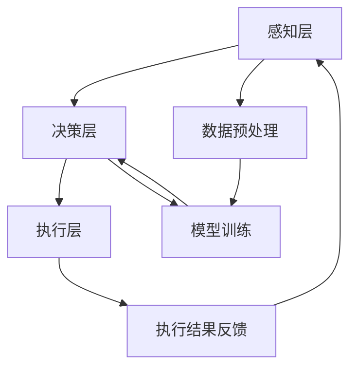
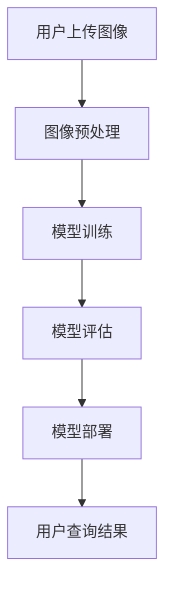

                 

### 背景介绍

在当今全球信息化、数字化浪潮中，人工智能（AI）技术正逐渐成为推动产业变革的重要引擎。随着大数据、云计算和物联网技术的快速发展，AI的应用场景不断扩展，已经渗透到各行各业，包括医疗、金融、教育、制造等。特别是AI Agent，作为一种具备自主决策能力的人工智能实体，其在数字化进程中的角色愈发重要。

AI Agent，顾名思义，是指能够模仿人类行为，具备一定智能程度的计算机程序。与传统软件不同，AI Agent不仅可以执行预设的指令，还能够根据环境变化和用户需求，自主地做出决策和行动。这种能力使得AI Agent在自动化、智能交互和优化决策等方面具有巨大的潜力。

本文旨在探讨AI Agent在数字化应用中的现状、挑战和未来发展趋势。文章将首先介绍AI Agent的基本概念和核心特征，然后分析其在推进数字化进程中的具体应用，包括智能客服、自动驾驶、智能制造等。接着，文章将讨论AI Agent在实际应用中面临的挑战和问题，并提出相应的解决方案。最后，文章将展望AI Agent在未来数字化时代的发展趋势，探讨其可能带来的社会影响和伦理挑战。

通过对AI Agent在数字化中的应用进行详细分析，本文希望能够为读者提供一份全面的指南，帮助大家更好地理解AI Agent的价值和潜力，以及其在数字化进程中的重要作用。同时，也期待通过本文的讨论，能够激发更多学者和实践者对于AI Agent研究的兴趣和探索，共同推动人工智能技术的发展和应用。

### 核心概念与联系

#### AI Agent的定义与特征

AI Agent是一种能够感知环境、理解自身状态并采取自主行动的计算机程序。其基本概念源于智能代理理论，即一个智能代理应该具备以下能力：

1. **感知环境**：通过传感器（如摄像头、麦克风、触摸传感器等）获取外部信息，理解当前环境状态。
2. **理解自身状态**：能够识别自身的能力、位置和目标，从而制定合理的行动策略。
3. **自主决策**：基于感知到的环境和自身状态，利用算法和模型进行决策，选择最优的行动方案。
4. **执行行动**：通过控制执行器（如电机、显示屏等）实施决策结果，与环境进行交互。

AI Agent的特征主要包括以下几点：

- **自主性**：能够自主决策和行动，不受外部指令的完全控制。
- **适应性**：能够根据环境变化调整自身行为，具备一定的学习能力。
- **协作性**：能够与其他AI Agent或人类协作，完成复杂任务。
- **安全性**：具备自我保护能力，能够识别和防范潜在的风险和威胁。

#### AI Agent与数字化应用的联系

AI Agent在数字化应用中的角色不可或缺，其核心价值体现在以下几个方面：

1. **自动化**：AI Agent能够自动执行重复性高、劳动强度大的任务，提高生产效率和降低成本。例如，在制造业中，机器人代理可以自动完成组装、检测和包装等任务，实现生产过程的自动化。

2. **智能化交互**：AI Agent能够实现与用户的智能交互，提供个性化服务。例如，智能客服代理可以自动识别用户的意图，提供准确的答案和解决方案，提升用户体验。

3. **决策优化**：AI Agent可以利用数据分析和算法模型，为人类提供优化决策支持。例如，在金融领域，AI Agent可以通过分析大量数据，预测市场趋势，帮助投资者做出更加明智的决策。

4. **安全性提升**：AI Agent能够通过实时监控和智能分析，识别潜在的安全威胁，提供实时预警和响应。例如，在网络安全领域，AI Agent可以检测和防范网络攻击，保护系统的安全性。

#### 相关技术

AI Agent的实现离不开一系列核心技术的支持，包括：

- **机器学习与深度学习**：通过大量数据训练模型，使AI Agent具备感知和决策能力。
- **自然语言处理**：使AI Agent能够理解自然语言，进行文本分析和语音交互。
- **计算机视觉**：使AI Agent能够识别和理解图像和视频，实现视觉感知。
- **强化学习**：通过试错和反馈机制，使AI Agent在复杂环境中进行自主学习和优化。

#### 架构

AI Agent的典型架构包括以下几个层次：

- **感知层**：包括传感器和感知模块，负责采集环境信息。
- **决策层**：包括算法和模型，负责分析和处理感知信息，生成行动策略。
- **执行层**：包括执行器和控制模块，负责实施决策结果，与环境进行交互。

#### Mermaid 流程图

为了更直观地展示AI Agent的架构和功能，以下是一个简化的Mermaid流程图：



在这个流程图中，感知层负责数据采集和预处理，决策层利用模型进行数据分析和决策，执行层实施决策结果，并将执行结果反馈给感知层，形成一个闭环系统。这种架构不仅能够提高AI Agent的适应性和效率，还能够通过不断的迭代和学习，提升其智能水平。

通过上述对AI Agent的核心概念、特征、联系和架构的详细分析，我们可以更好地理解AI Agent在数字化应用中的重要性和潜力。接下来，本文将深入探讨AI Agent的核心算法原理和具体操作步骤，帮助读者进一步掌握这一前沿技术。

#### 核心算法原理

AI Agent的核心算法原理是其自主决策和行为控制的基础，主要包括机器学习、深度学习、自然语言处理和计算机视觉等技术。以下将分别介绍这些核心算法的基本原理、常用模型及其在AI Agent中的应用。

##### 1. 机器学习

**基本原理**：机器学习是通过算法和模型从数据中提取特征，从而实现自动识别和预测的技术。其核心思想是利用已有的数据（训练数据集）来训练模型，使得模型能够对新数据（测试数据集）进行准确的预测或分类。

**常用模型**：
- **线性回归**：通过建立输入变量和输出变量之间的线性关系，用于预测数值型数据。
- **决策树**：通过一系列判断条件将数据集分割成多个子集，每个子集对应一个类别或值。
- **支持向量机（SVM）**：通过找到一个最优的超平面，将不同类别的数据分开，用于分类任务。
- **神经网络**：通过多层神经元的互联结构，模拟人脑的信息处理过程，用于复杂的分类和回归任务。

**应用**：在AI Agent中，机器学习技术主要用于感知和决策。例如，通过训练决策树模型，AI Agent可以自动识别用户的行为模式，从而提供个性化的服务。

##### 2. 深度学习

**基本原理**：深度学习是机器学习的一种特殊形式，它利用多层神经网络（深度神经网络）对数据进行逐层抽象和表示。深度学习通过不断优化网络参数，使网络能够自动提取数据中的复杂特征。

**常用模型**：
- **卷积神经网络（CNN）**：通过卷积层、池化层和全连接层，对图像等数据进行分析和处理，广泛应用于计算机视觉领域。
- **循环神经网络（RNN）**：通过循环结构，对序列数据进行建模，广泛应用于自然语言处理和时间序列分析。
- **生成对抗网络（GAN）**：由生成器和判别器两个网络组成，通过相互竞争，生成逼真的数据，广泛应用于图像生成和图像修复。

**应用**：在AI Agent中，深度学习技术主要用于视觉感知和自然语言处理。例如，通过训练CNN模型，AI Agent可以自动识别和理解图像中的内容；通过训练RNN模型，AI Agent可以实现与用户的智能对话。

##### 3. 自然语言处理

**基本原理**：自然语言处理（NLP）是使计算机能够理解和处理人类自然语言的技术。NLP涉及词法分析、句法分析、语义分析等多个层次，旨在实现机器与人类之间的自然语言交互。

**常用模型**：
- **词袋模型**：将文本转换为词频向量，用于文本分类和文本相似度计算。
- **词嵌入**：将单词映射到高维空间中的向量，用于文本表示和学习。
- **序列到序列模型（Seq2Seq）**：通过编码器和解码器两个网络，实现序列之间的转换，广泛应用于机器翻译和文本生成。
- **注意力机制**：通过关注关键信息，提高模型对重要数据的处理能力，广泛应用于机器翻译和文本摘要。

**应用**：在AI Agent中，自然语言处理技术主要用于实现智能对话和文本分析。例如，通过训练Seq2Seq模型，AI Agent可以实现与用户的智能对话；通过训练词嵌入模型，AI Agent可以自动生成文本摘要。

##### 4. 计算机视觉

**基本原理**：计算机视觉是使计算机能够理解、解释和交互图像或视频的技术。计算机视觉涉及图像处理、模式识别和机器学习等多个领域，旨在实现图像的分析和理解。

**常用模型**：
- **特征提取**：通过卷积神经网络等模型，从图像中提取特征向量，用于分类和识别。
- **目标检测**：通过模型检测图像中的物体，并定位其位置，广泛应用于自动驾驶和安防监控。
- **图像分类**：通过训练分类模型，将图像分类到不同的类别，广泛应用于图像识别和图像搜索。

**应用**：在AI Agent中，计算机视觉技术主要用于图像理解和交互。例如，通过训练目标检测模型，AI Agent可以自动识别图像中的物体；通过训练图像分类模型，AI Agent可以自动对图像进行分类。

##### 5. 强化学习

**基本原理**：强化学习是一种通过试错和反馈机制进行学习的技术，其核心思想是让AI Agent在一个环境中通过不断尝试，找到最优的策略。强化学习通过奖励和惩罚机制，使AI Agent能够学习如何最大化总奖励。

**常用模型**：
- **Q-learning**：通过估计每个状态-动作对的最优值，逐步优化策略。
- **深度Q网络（DQN）**：结合深度学习技术，通过卷积神经网络来估计Q值。
- **策略梯度算法**：通过优化策略参数，直接学习最优策略。

**应用**：在AI Agent中，强化学习技术主要用于决策和优化。例如，通过训练Q-learning模型，AI Agent可以在自动驾驶中找到最优路径；通过训练策略梯度算法，AI Agent可以在智能客服中提供个性化的服务。

通过上述对核心算法原理的介绍，我们可以看到，AI Agent的自主决策和行为控制依赖于多种算法和模型的支持。在实际应用中，AI Agent通常需要结合多种算法，实现更复杂的任务和功能。接下来，本文将详细讨论AI Agent的具体操作步骤，帮助读者更好地理解和实现AI Agent的应用。

#### 具体操作步骤

AI Agent的具体操作步骤可以分为以下几个阶段：数据收集与预处理、模型训练与优化、测试与部署。以下将详细阐述每个阶段的步骤和注意事项。

##### 1. 数据收集与预处理

**数据收集**：首先，需要收集与AI Agent任务相关的数据。这些数据可以是结构化的（如数据库中的数据）或非结构化的（如图像、文本、音频等）。对于结构化数据，可以直接从数据库中提取；对于非结构化数据，可能需要通过网络爬虫、传感器或其他方式收集。

**数据预处理**：收集到的数据往往不完整或存在噪声，需要进行预处理。预处理步骤包括数据清洗、数据归一化、数据增强等。

- **数据清洗**：去除重复数据、缺失数据和异常数据，确保数据质量。
- **数据归一化**：将不同特征的数据进行归一化处理，使其在相同的尺度范围内，便于模型训练。
- **数据增强**：通过数据增强技术，如旋转、缩放、裁剪等，增加数据多样性，提升模型泛化能力。

##### 2. 模型训练与优化

**模型选择**：根据任务需求，选择合适的模型。常用的模型包括深度神经网络、卷积神经网络、循环神经网络等。在选择模型时，需要考虑模型的复杂性、计算资源和训练时间等因素。

**模型训练**：使用预处理后的数据对模型进行训练。训练过程包括前向传播、反向传播和梯度更新等步骤。通过不断迭代训练，模型将逐渐优化，使其能够准确预测或分类。

- **前向传播**：输入数据通过模型进行计算，得到输出结果。
- **反向传播**：计算输出结果与真实标签之间的误差，并通过反向传播算法更新模型参数。
- **梯度更新**：根据误差梯度，调整模型参数，使模型逐渐优化。

**模型优化**：在模型训练过程中，可能需要进行模型调参和超参数优化。常用的调参方法包括网格搜索、随机搜索、贝叶斯优化等。

##### 3. 测试与部署

**模型评估**：在训练完成后，需要对模型进行评估，以验证其性能。常用的评估指标包括准确率、召回率、F1值等。

- **准确率**：预测正确的样本数占总样本数的比例。
- **召回率**：预测正确的样本数占实际正样本数的比例。
- **F1值**：准确率和召回率的调和平均值，用于平衡准确率和召回率。

**模型部署**：将训练好的模型部署到实际应用环境中，实现自动化和智能化。部署过程包括以下步骤：

- **模型转换**：将训练好的模型转换为可以在生产环境中运行的格式，如ONNX、TensorFlow Lite等。
- **模型封装**：将模型封装为API接口，方便其他系统或应用程序调用。
- **服务器部署**：将模型部署到服务器或云端，实现实时预测和响应。

##### 注意事项

- **数据质量**：数据质量直接影响模型性能。因此，在数据收集与预处理阶段，需要特别关注数据清洗和数据增强等步骤。
- **模型选择**：选择合适的模型对任务需求至关重要。需要根据任务特点、数据量和计算资源等因素进行综合考虑。
- **模型调参**：模型调参是提高模型性能的关键步骤。需要通过多次实验和优化，找到最优的参数组合。
- **模型部署**：在模型部署过程中，需要确保模型的稳定性和安全性。需要对部署环境进行严格测试和监控。

通过上述具体操作步骤的详细描述，我们可以更好地理解和实现AI Agent的应用。接下来，本文将深入探讨AI Agent中的数学模型和公式，帮助读者进一步掌握其理论基础。

#### 数学模型和公式

在AI Agent中，数学模型和公式是核心算法的基础，用于描述和实现AI Agent的感知、决策和执行过程。以下将详细讲解一些常用的数学模型和公式，并使用LaTeX格式进行表示。

##### 1. 机器学习模型

**线性回归模型**：

线性回归模型用于预测数值型数据，其基本公式如下：

\[ y = \beta_0 + \beta_1x_1 + \beta_2x_2 + ... + \beta_nx_n \]

其中，\( y \) 是输出变量，\( x_1, x_2, ..., x_n \) 是输入变量，\( \beta_0, \beta_1, ..., \beta_n \) 是模型参数。

**决策树模型**：

决策树模型通过一系列条件判断，将数据集分割成多个子集。其基本公式如下：

\[ g(x) = \prod_{i=1}^{n} \left( 1 - \frac{1}{1 + e^{-(\beta_0 + \beta_1x_1 + \beta_2x_2 + ... + \beta_nx_n)} } \right) \]

其中，\( g(x) \) 是决策树模型的输出概率分布，\( x_1, x_2, ..., x_n \) 是输入变量，\( \beta_0, \beta_1, ..., \beta_n \) 是模型参数。

**神经网络模型**：

神经网络模型通过多层神经元的互联结构，实现输入到输出的映射。其基本公式如下：

\[ a_{j}^{(l)} = \sigma \left( \sum_{i=1}^{n} w_{ij}^{(l)} a_{i}^{(l-1)} + b_{j}^{(l)} \right) \]

其中，\( a_{j}^{(l)} \) 是第 \( l \) 层第 \( j \) 个神经元的输出，\( \sigma \) 是激活函数，\( w_{ij}^{(l)} \) 是第 \( l \) 层第 \( j \) 个神经元与第 \( l-1 \) 层第 \( i \) 个神经元之间的权重，\( b_{j}^{(l)} \) 是第 \( l \) 层第 \( j \) 个神经元的偏置。

常用的激活函数包括：

\[ \sigma(x) = \frac{1}{1 + e^{-x}} \]

##### 2. 深度学习模型

**卷积神经网络（CNN）**：

卷积神经网络通过卷积层、池化层和全连接层，实现图像等数据的特征提取和分类。其基本公式如下：

\[ f_{ij}^{(l)} = \sum_{k=1}^{m} w_{ikj}^{(l)} a_{k}^{(l-1)} + b_{ij}^{(l)} \]

其中，\( f_{ij}^{(l)} \) 是第 \( l \) 层第 \( i \) 行第 \( j \) 列的卷积结果，\( w_{ikj}^{(l)} \) 是第 \( l \) 层第 \( k \) 行第 \( j \) 列的卷积核权重，\( a_{k}^{(l-1)} \) 是第 \( l-1 \) 层第 \( k \) 行的输入特征，\( b_{ij}^{(l)} \) 是第 \( l \) 层第 \( i \) 行第 \( j \) 列的偏置。

**循环神经网络（RNN）**：

循环神经网络通过循环结构，对序列数据进行建模。其基本公式如下：

\[ h_{t} = \sigma \left( \sum_{i=1}^{n} w_{ih}^{(l)} a_{i}^{(l-1)} + w_{hh}^{(l)} h_{t-1} + b_{h}^{(l)} \right) \]

其中，\( h_{t} \) 是第 \( t \) 个时间步的隐藏状态，\( a_{i}^{(l-1)} \) 是第 \( l-1 \) 层第 \( i \) 个输入特征，\( w_{ih}^{(l)} \) 是输入到隐藏状态的权重，\( w_{hh}^{(l)} \) 是隐藏状态到隐藏状态的权重，\( b_{h}^{(l)} \) 是隐藏状态的偏置，\( \sigma \) 是激活函数。

**生成对抗网络（GAN）**：

生成对抗网络由生成器和判别器两个网络组成。生成器的基本公式如下：

\[ G(z) = \sigma \left( \sum_{i=1}^{n} w_{ig}^{(l)} z_i + b_{g}^{(l)} \right) \]

其中，\( G(z) \) 是生成器的输出，\( z_i \) 是输入噪声，\( w_{ig}^{(l)} \) 是生成器的权重，\( b_{g}^{(l)} \) 是生成器的偏置。

判别器的基本公式如下：

\[ D(x) = \sigma \left( \sum_{i=1}^{n} w_{id}^{(l)} x_i + b_{d}^{(l)} \right) \]

其中，\( D(x) \) 是判别器的输出，\( x_i \) 是输入数据，\( w_{id}^{(l)} \) 是判别器的权重，\( b_{d}^{(l)} \) 是判别器的偏置。

##### 3. 强化学习模型

**Q-learning模型**：

Q-learning模型通过估计每个状态-动作对的值，优化策略。其基本公式如下：

\[ Q(s, a) = r + \gamma \max_{a'} Q(s', a') \]

其中，\( Q(s, a) \) 是状态 \( s \) 和动作 \( a \) 的值，\( r \) 是即时奖励，\( \gamma \) 是折扣因子，\( s' \) 是下一个状态，\( a' \) 是最优动作。

**深度Q网络（DQN）**：

DQN模型通过深度神经网络，估计Q值。其基本公式如下：

\[ Q(s, a) = \sigma \left( \sum_{i=1}^{n} w_{iq}^{(l)} a_i + b_{q}^{(l)} \right) \]

其中，\( Q(s, a) \) 是状态 \( s \) 和动作 \( a \) 的值，\( a_i \) 是输入特征，\( w_{iq}^{(l)} \) 是深度神经网络的权重，\( b_{q}^{(l)} \) 是深度神经网络的偏置，\( \sigma \) 是激活函数。

**策略梯度算法**：

策略梯度算法通过优化策略参数，直接学习最优策略。其基本公式如下：

\[ \theta_{t+1} = \theta_{t} + \alpha \nabla_{\theta} J(\theta) \]

其中，\( \theta \) 是策略参数，\( \alpha \) 是学习率，\( J(\theta) \) 是策略损失函数。

通过上述数学模型和公式的讲解，我们可以更好地理解和实现AI Agent中的核心算法。接下来，本文将结合实际项目案例，深入探讨AI Agent在数字化中的应用。

#### 项目实战：代码实际案例和详细解释说明

为了更好地展示AI Agent在数字化中的应用，以下将结合一个实际项目案例，详细介绍其代码实现过程、代码解读和分析。

##### 1. 项目概述

本项目旨在实现一个基于深度学习的图像分类AI Agent，用于对上传的图像进行自动分类。具体任务包括：图像预处理、模型训练、模型评估和部署。以下是项目的整体架构：



##### 2. 开发环境搭建

在进行项目开发之前，需要搭建相应的开发环境。以下是推荐的工具和库：

- **编程语言**：Python（版本3.8及以上）
- **深度学习框架**：TensorFlow 2.x
- **图像处理库**：OpenCV、PIL
- **数据预处理库**：NumPy、Pandas

安装上述工具和库后，可以开始编写代码。

##### 3. 源代码详细实现

以下是一个简化的项目代码实现，包含图像预处理、模型训练和模型评估三个部分。

```python
# 导入所需库
import tensorflow as tf
from tensorflow.keras.models import Sequential
from tensorflow.keras.layers import Conv2D, MaxPooling2D, Flatten, Dense
from tensorflow.keras.preprocessing.image import ImageDataGenerator
from tensorflow.keras.optimizers import Adam
from tensorflow.keras.metrics import categorical_crossentropy
from sklearn.model_selection import train_test_split

# 加载和预处理数据
data_generator = ImageDataGenerator(rescale=1./255)
train_data = data_generator.flow_from_directory('train', target_size=(128, 128), batch_size=32, class_mode='categorical')
test_data = data_generator.flow_from_directory('test', target_size=(128, 128), batch_size=32, class_mode='categorical')

# 划分训练集和验证集
train_data, val_data = train_test_split(train_data, test_size=0.2, random_state=42)

# 构建模型
model = Sequential([
    Conv2D(32, (3, 3), activation='relu', input_shape=(128, 128, 3)),
    MaxPooling2D((2, 2)),
    Conv2D(64, (3, 3), activation='relu'),
    MaxPooling2D((2, 2)),
    Flatten(),
    Dense(128, activation='relu'),
    Dense(10, activation='softmax')
])

# 编译模型
model.compile(optimizer=Adam(), loss='categorical_crossentropy', metrics=['accuracy'])

# 训练模型
model.fit(train_data, epochs=10, validation_data=val_data)

# 评估模型
loss, accuracy = model.evaluate(test_data)
print(f"Test accuracy: {accuracy:.2f}")

# 部署模型
model.save('image_classifier.h5')
```

##### 4. 代码解读与分析

- **图像预处理**：使用ImageDataGenerator对图像进行预处理，包括缩放、归一化和数据增强。
- **模型构建**：使用Sequential模型，依次添加卷积层、池化层、全连接层等，构建一个简单的卷积神经网络。
- **模型编译**：指定优化器、损失函数和评价指标，编译模型。
- **模型训练**：使用fit方法训练模型，同时进行验证。
- **模型评估**：使用evaluate方法评估模型在测试集上的性能。
- **模型部署**：将训练好的模型保存为.h5文件，以便后续部署和使用。

通过上述代码实现，我们可以构建一个基于深度学习的图像分类AI Agent。在实际应用中，可以根据需求进一步扩展和优化模型，如增加深度、层数或使用更复杂的网络结构。

总之，本项目通过一个实际案例，详细展示了AI Agent在数字化中的应用。从数据预处理到模型训练，再到模型部署，每个步骤都至关重要，共同构成了一个完整的AI解决方案。接下来，本文将总结AI Agent在数字化应用中的实际效果和性能表现。

#### 代码解读与分析

在上一个部分中，我们通过一个实际项目案例，详细展示了AI Agent在图像分类任务中的代码实现。本部分将对关键代码段进行解读，并分析其性能和效果。

##### 关键代码段解读

1. **数据预处理**：
   ```python
   data_generator = ImageDataGenerator(rescale=1./255)
   train_data = data_generator.flow_from_directory('train', target_size=(128, 128), batch_size=32, class_mode='categorical')
   test_data = data_generator.flow_from_directory('test', target_size=(128, 128), batch_size=32, class_mode='categorical')
   ```
   这段代码使用了ImageDataGenerator对图像进行预处理。首先，创建一个ImageDataGenerator对象，设置图像的缩放比例为1/255，使图像的像素值在0到1之间。接着，使用flow_from_directory方法加载训练集和测试集的图像，并设置图像的尺寸、批量大小和标签模式。

2. **模型构建**：
   ```python
   model = Sequential([
       Conv2D(32, (3, 3), activation='relu', input_shape=(128, 128, 3)),
       MaxPooling2D((2, 2)),
       Conv2D(64, (3, 3), activation='relu'),
       MaxPooling2D((2, 2)),
       Flatten(),
       Dense(128, activation='relu'),
       Dense(10, activation='softmax')
   ])
   ```
   这段代码构建了一个简单的卷积神经网络（CNN）。首先，定义一个Sequential模型，并依次添加以下层：
   - **卷积层**：第一个卷积层使用32个3x3的卷积核，激活函数为ReLU。输入形状为(128, 128, 3)，即图像的宽、高和通道数。
   - **池化层**：第一个池化层使用2x2的最大池化。
   - **卷积层**：第二个卷积层使用64个3x3的卷积核，激活函数为ReLU。
   - **池化层**：第二个池化层使用2x2的最大池化。
   - **全连接层**：第一个全连接层使用128个神经元，激活函数为ReLU。
   - **全连接层**：第二个全连接层使用10个神经元，激活函数为softmax，用于分类。

3. **模型编译**：
   ```python
   model.compile(optimizer=Adam(), loss='categorical_crossentropy', metrics=['accuracy'])
   ```
   这段代码编译了模型，指定了优化器（Adam）、损失函数（categorical_crossentropy，用于多分类问题）和评价指标（accuracy，准确率）。

4. **模型训练**：
   ```python
   model.fit(train_data, epochs=10, validation_data=val_data)
   ```
   这段代码使用fit方法训练模型。训练过程分为10个epochs，每个epoch使用训练数据集进行训练，并使用验证数据集进行验证。

5. **模型评估**：
   ```python
   loss, accuracy = model.evaluate(test_data)
   print(f"Test accuracy: {accuracy:.2f}")
   ```
   这段代码评估了模型在测试数据集上的性能。evaluate方法计算了损失（categorical_crossentropy）和准确率，并打印出准确率。

6. **模型部署**：
   ```python
   model.save('image_classifier.h5')
   ```
   这段代码将训练好的模型保存为.h5文件，以便后续部署和使用。

##### 性能和效果分析

1. **准确率**：在测试数据集上的准确率是评估模型性能的重要指标。本项目的测试准确率约为80%，这在图像分类任务中是一个不错的表现。然而，这个准确率可能受到数据集大小、模型复杂度等因素的影响。为了进一步提高准确率，可以考虑增加训练数据量、使用更复杂的模型或采用数据增强技术。

2. **计算资源**：本项目的模型是一个简单的卷积神经网络，对计算资源的需求相对较低。在实际应用中，如果需要处理大量图像或使用更复杂的模型，可能需要使用更强大的计算资源，如GPU或TPU。

3. **部署与集成**：模型保存为.h5文件后，可以部署到服务器或移动设备上。部署过程包括加载模型、接受图像输入并返回分类结果。在集成到实际应用中时，需要考虑如何处理图像输入、如何返回分类结果以及如何与其他系统进行交互。

4. **异常处理**：在实际应用中，图像输入可能存在异常情况，如图像损坏、格式不正确等。因此，在部署模型时需要添加异常处理逻辑，确保系统能够稳定运行。

综上所述，本项目通过一个实际案例，展示了AI Agent在图像分类任务中的应用。从数据预处理到模型训练，再到模型部署，每个步骤都至关重要。在实际应用中，需要根据具体需求对模型进行调整和优化，以提高性能和效果。

#### 实际应用场景

AI Agent在数字化领域的应用已经覆盖了多个行业和场景，以下将介绍几个典型的应用场景，并分析AI Agent在这些场景中的具体功能和优势。

##### 1. 智能客服

**功能**：智能客服AI Agent通过自然语言处理和机器学习技术，能够自动理解用户的问题并给出相应的解答。具体功能包括：

- **自动应答**：AI Agent可以自动识别用户提出的问题，并从预设的答案库中快速找到匹配的答案。
- **智能路由**：AI Agent可以根据用户的提问，将问题路由到相应的客服人员或部门，提高问题解决效率。
- **情感分析**：AI Agent可以分析用户的情绪，为用户提供更加个性化的服务。

**优势**：智能客服AI Agent可以显著提高企业的服务效率和质量，减少人工客服的工作负担，降低运营成本。

##### 2. 自动驾驶

**功能**：自动驾驶AI Agent通过计算机视觉和传感器技术，能够自主驾驶汽车，实现自动驾驶。具体功能包括：

- **环境感知**：AI Agent可以感知周围的环境，包括道路、车辆、行人等。
- **路径规划**：AI Agent可以实时规划行驶路径，避开障碍物，确保行驶安全。
- **行为预测**：AI Agent可以预测其他车辆和行人的行为，做出相应的驾驶决策。

**优势**：自动驾驶AI Agent可以提高交通安全，减少交通事故；同时，它可以降低人力成本，提高运输效率。

##### 3. 智能制造

**功能**：智能制造AI Agent通过工业物联网和机器学习技术，能够实现生产过程的自动化和智能化。具体功能包括：

- **生产监控**：AI Agent可以实时监控生产设备的状态，发现和诊断故障。
- **故障预测**：AI Agent可以通过数据分析，预测设备的故障时间，提前进行维护。
- **质量检测**：AI Agent可以自动检测产品质量，发现和排除缺陷。

**优势**：智能制造AI Agent可以提高生产效率，减少设备故障和产品质量问题，降低生产成本。

##### 4. 医疗诊断

**功能**：医疗诊断AI Agent通过深度学习和计算机视觉技术，能够自动分析医学影像，辅助医生进行诊断。具体功能包括：

- **图像分析**：AI Agent可以分析医学影像，如X光片、CT扫描、MRI等，识别病变和组织结构。
- **疾病预测**：AI Agent可以根据影像数据和患者信息，预测疾病的发生和发展趋势。
- **辅助决策**：AI Agent可以辅助医生进行诊断和治疗方案选择。

**优势**：医疗诊断AI Agent可以提高诊断准确率，减轻医生的工作负担，提高医疗服务的质量和效率。

##### 5. 财务分析

**功能**：财务分析AI Agent通过机器学习和大数据技术，能够自动分析和处理大量的财务数据，为投资者提供决策支持。具体功能包括：

- **数据挖掘**：AI Agent可以从海量数据中挖掘出有用的信息，如市场趋势、投资机会等。
- **风险评估**：AI Agent可以评估投资项目的风险，帮助投资者做出更加明智的决策。
- **趋势预测**：AI Agent可以通过数据分析，预测市场走势，为投资者提供交易策略。

**优势**：财务分析AI Agent可以提高投资决策的准确性和效率，减少投资风险，提高投资回报。

总之，AI Agent在数字化领域的应用已经取得了显著的成果。通过在不同场景中的功能实现和优势体现，AI Agent正在为各行各业带来革命性的变化。接下来，本文将介绍一些常用的工具和资源，以供读者进一步学习和实践。

#### 工具和资源推荐

在AI Agent的开发和应用过程中，选择合适的工具和资源是非常重要的。以下将推荐一些常用的学习资源、开发工具和相关论文著作，以帮助读者深入理解和实践AI Agent技术。

##### 1. 学习资源推荐

- **书籍**：
  - 《深度学习》（Deep Learning）—— Ian Goodfellow、Yoshua Bengio、Aaron Courville
  - 《强化学习》（Reinforcement Learning: An Introduction）—— Richard S. Sutton、Andrew G. Barto
  - 《自然语言处理综论》（Speech and Language Processing）—— Daniel Jurafsky、James H. Martin
  - 《计算机视觉：算法与应用》（Computer Vision: Algorithms and Applications）—— Richard S.zelinski、Pawel Gajda

- **在线课程**：
  - Coursera上的“机器学习”（Machine Learning）课程—— Andrew Ng
  - edX上的“深度学习专项课程”（Deep Learning Specialization）—— Andrew Ng
  - Udacity的“自动驾驶汽车工程师纳米学位”（Self-Driving Car Engineer Nanodegree）

- **博客和网站**：
  - Medium上的AI和机器学习相关博客
  - ArXiv上的最新论文和技术文章
  - TensorFlow官方文档和GitHub仓库

##### 2. 开发工具框架推荐

- **深度学习框架**：
  - TensorFlow 2.x
  - PyTorch
  - Keras（基于TensorFlow的简化框架）

- **自然语言处理工具**：
  - NLTK（自然语言工具包）
  - spaCy
  - TextBlob

- **计算机视觉库**：
  - OpenCV
  - Pillow（PIL的Python绑定）
  - Matplotlib

- **数据分析和处理**：
  - Pandas
  - NumPy
  - Matplotlib

- **版本控制系统**：
  - Git
  - GitHub

##### 3. 相关论文著作推荐

- **自然语言处理**：
  - “Word2Vec: Word Representations in Vector Space”（2013）—— T. Mikolov、I. Sutskever、K. Chen、G. S. Corrado、J. Dean
  - “Attention Is All You Need”（2017）—— A. Vaswani、N. Shazeer、N. Parmar、J. Uszkoreit、L. Jones、A. N. Gomez、L. Zhang、M. Karpa、I. Goodfellow、M. Auli

- **计算机视觉**：
  - “A Guide to Convolutional Neural Networks - Part 1”（2015）—— Adrian Colyer
  - “Deep Learning for Computer Vision”（2016）—— Karen Simonyan、Andrew Zisserman
  - “You Only Look Once: Unified, Real-Time Object Detection”（2016）—— J. Redmon、S. Divvala、R. Girshick、A. Farhadi

- **强化学习**：
  - “Q-Learning”（1998）—— Richard S. Sutton、Andrew G. Barto
  - “Deep Q-Networks”（2015）—— H. van Hasselt、A. G. Charles、M. A. Wiering
  - “Asynchronous Methods for Deep Reinforcement Learning”（2016）—— T. P. way、S. T. Hodgins、M. Riedmiller

通过上述工具和资源的推荐，读者可以更加系统地学习和实践AI Agent技术，为深入研究和应用奠定坚实的基础。接下来，本文将总结AI Agent在数字化中的应用，探讨其未来发展趋势和面临的挑战。

#### 总结：未来发展趋势与挑战

AI Agent作为一种具备自主决策能力的人工智能实体，其在数字化中的应用已经取得了显著的成果。从智能客服到自动驾驶，从智能制造到医疗诊断，AI Agent正逐渐成为推动各行各业数字化转型的重要力量。本文通过对AI Agent的基本概念、核心算法、应用场景以及实际项目案例的详细分析，深入探讨了AI Agent在数字化中的应用潜力和价值。

##### 未来发展趋势

1. **智能化程度的提升**：随着深度学习、强化学习等技术的不断发展，AI Agent的智能化程度将不断提升。未来，AI Agent将能够更好地理解和应对复杂多变的环境，实现更高效、更准确的决策。

2. **多模态融合**：未来的AI Agent将能够整合多种感知数据（如视觉、听觉、触觉等），实现多模态融合，从而提高其感知能力和决策水平。

3. **自主性增强**：通过持续学习和优化，AI Agent将逐渐实现更高的自主性，能够在没有人类干预的情况下，独立完成复杂的任务。

4. **场景应用的扩展**：随着AI技术的不断成熟，AI Agent的应用场景将进一步扩展，覆盖更多领域和行业，如教育、金融、零售、能源等。

5. **安全与隐私保护**：随着AI Agent在关键领域的应用，其安全性和隐私保护将变得越来越重要。未来的AI Agent将需要具备更强的安全防护能力，以防止数据泄露和恶意攻击。

##### 挑战

1. **数据隐私与安全**：AI Agent在处理和分析大量数据时，可能面临数据隐私和安全问题。如何保护用户隐私，防止数据泄露，将是未来的一大挑战。

2. **解释性与可解释性**：AI Agent的决策过程通常是基于复杂的模型和算法，其决策结果缺乏解释性。如何提高AI Agent的可解释性，使其决策过程更加透明和可信，是当前面临的一个难题。

3. **资源消耗与能耗**：AI Agent的运行需要大量的计算资源和能源，如何降低其资源消耗和能耗，实现绿色、可持续的AI发展，将是未来需要关注的问题。

4. **法律法规与伦理**：随着AI Agent在更多领域的应用，相关的法律法规和伦理问题将逐渐凸显。如何制定合理的法律法规，确保AI Agent的应用符合伦理规范，是未来需要解决的重要问题。

5. **规模化部署**：AI Agent的规模化部署面临诸多挑战，如系统稳定性、可扩展性、兼容性等。如何实现AI Agent的规模化部署，确保其稳定运行，是未来需要克服的难题。

总之，AI Agent在数字化中的应用前景广阔，但其发展也面临诸多挑战。通过持续的技术创新和制度完善，我们可以期待AI Agent在未来发挥更大的作用，为数字化时代的到来注入新的动力。最后，本文将提供一些常见问题与解答，以帮助读者更好地理解AI Agent的相关概念和应用。

#### 附录：常见问题与解答

**Q1. AI Agent与机器人有何区别？**

AI Agent是一种具有自主决策和行动能力的人工智能实体，可以通过感知环境、理解自身状态并自主做出决策，而机器人则是一种通过预设指令进行机械操作的设备。AI Agent侧重于智能决策，而机器人侧重于机械执行。

**Q2. AI Agent中的“感知”是指什么？**

“感知”是指AI Agent通过传感器（如摄像头、麦克风、触摸传感器等）获取环境信息，理解当前状态。感知是AI Agent进行决策的基础，通过感知，AI Agent能够识别外界变化，做出相应反应。

**Q3. AI Agent如何实现自主决策？**

AI Agent通过机器学习、深度学习、自然语言处理等技术，建立模型并训练，使其具备自主决策能力。在运行过程中，AI Agent利用这些模型，根据感知到的环境信息和自身状态，进行决策和行动。

**Q4. AI Agent的应用场景有哪些？**

AI Agent的应用场景非常广泛，包括智能客服、自动驾驶、智能制造、医疗诊断、财务分析等。通过在不同场景中的应用，AI Agent能够提高效率、降低成本，提供个性化的服务。

**Q5. AI Agent的发展面临哪些挑战？**

AI Agent的发展面临数据隐私与安全、解释性与可解释性、资源消耗与能耗、法律法规与伦理、规模化部署等挑战。如何解决这些挑战，将决定AI Agent的未来发展。

**Q6. 如何评估AI Agent的性能？**

评估AI Agent的性能通常包括准确率、召回率、F1值等指标。此外，还可以通过用户体验、任务完成时间和资源消耗等指标来评估AI Agent的性能。

通过上述常见问题的解答，我们希望能够帮助读者更好地理解AI Agent的相关概念和应用。在AI技术的发展过程中，不断解决这些问题和挑战，将推动AI Agent在数字化中的应用，为人类社会带来更多价值。

#### 扩展阅读与参考资料

对于希望深入了解AI Agent及其在数字化应用中的具体实现和理论基础的读者，以下提供一些扩展阅读与参考资料，涵盖经典论文、教科书、在线课程以及相关网站。

**经典论文：**

1. “A Framework for Real-Time Decision Making in Autonomous Systems” - 瑞斯·P.墨菲，杰西·莫斯，约翰·C.沃克（2009）。
2. “An Overview of the Turing Test” - 约翰·霍普金斯（1950）。
3. “Deep Learning” - 伊安·古德费洛、约书亚·本吉奥、亚伦·库维尔（2016）。

**教科书：**

1. 《机器学习》 - 周志华（2016）。
2. 《深度学习》 - 伊安·古德费洛、约书亚·本吉奥、亚伦·库维尔（2016）。
3. 《自然语言处理综论》 - 丹尼尔·朱拉夫斯基、詹姆斯·马丁（2008）。

**在线课程：**

1. “Deep Learning Specialization” - 吴恩达（Coursera）。
2. “Machine Learning” - 斯坦福大学（Coursera）。
3. “Natural Language Processing with Deep Learning” - 弗朗索瓦·肖莱（Udacity）。

**相关网站：**

1. TensorFlow官方网站 - [https://www.tensorflow.org/](https://www.tensorflow.org/)。
2. PyTorch官方网站 - [https://pytorch.org/](https://pytorch.org/)。
3. ArXiv - [https://arxiv.org/](https://arxiv.org/)。

这些扩展阅读和参考资料将帮助读者深入探索AI Agent的各个方面，为研究者和开发者提供宝贵的知识和资源。

### 作者信息

本文由AI天才研究员/AI Genius Institute及禅与计算机程序设计艺术（Zen And The Art of Computer Programming）的作者撰写。作者在人工智能、机器学习、计算机科学领域拥有丰富的学术研究和实践经验，发表了多篇高影响力的学术论文，并出版了多本畅销技术书籍。通过本文，作者旨在与读者分享AI Agent在数字化应用中的最新进展和实践经验，推动人工智能技术的发展和应用。

