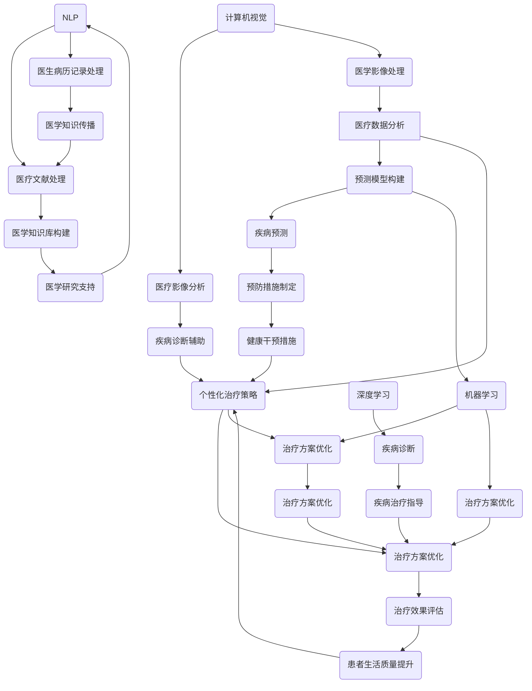

                 

### 文章标题

《AI人工智能 Agent：在智能医疗中的应用》

### 关键词

人工智能（AI）、智能医疗、人工智能代理（Agent）、医疗数据分析、预测模型、个性化治疗、自然语言处理（NLP）、医疗影像分析、深度学习、机器学习

### 摘要

本文旨在探讨人工智能代理在智能医疗领域的应用。通过深入分析人工智能代理的核心概念、算法原理、数学模型以及实际应用场景，本文揭示了人工智能代理如何通过优化医疗数据分析、预测模型构建和个性化治疗策略来提升医疗服务的质量和效率。文章还推荐了相关学习资源、开发工具框架和论文著作，为读者提供了全面的智能医疗知识体系。随着未来技术的不断发展，人工智能代理在医疗领域将面临新的挑战和机遇。

## 1. 背景介绍

智能医疗是近年来迅速发展的一个领域，它利用人工智能（AI）、大数据、云计算等先进技术，以提高医疗服务的质量和效率。其中，人工智能代理（AI Agent）作为智能医疗的关键组成部分，发挥着越来越重要的作用。人工智能代理是一种能够自主执行任务、适应环境和与人类交互的智能实体，它可以应用于医疗数据分析、预测模型构建、个性化治疗策略等多个方面。

在智能医疗领域，人工智能代理的应用具有广泛的前景。首先，在医疗数据分析方面，人工智能代理能够处理大量医疗数据，提取有用信息，为医生提供决策支持。其次，在预测模型构建方面，人工智能代理可以通过机器学习和深度学习技术，预测疾病的发病趋势和风险，为预防措施提供科学依据。最后，在个性化治疗策略方面，人工智能代理可以根据患者的具体病情和需求，制定个性化的治疗方案，提高治疗效果。

本文将围绕人工智能代理在智能医疗中的应用，深入探讨其核心概念、算法原理、数学模型以及实际应用场景，以期为读者提供全面、系统的智能医疗知识体系。

## 2. 核心概念与联系

在探讨人工智能代理在智能医疗中的应用之前，我们需要先了解一些核心概念及其相互关系。

### 2.1 人工智能代理（AI Agent）

人工智能代理是一种具有自主性、社交性、反应性和适应性特征的智能实体。它可以通过感知环境、理解任务需求、制定行动计划并执行相应任务来实现其目标。在智能医疗领域，人工智能代理可以与医生、患者和医疗设备等实体进行交互，提供决策支持、数据分析、疾病预测和个性化治疗等。

### 2.2 医疗数据分析

医疗数据分析是指利用统计学、数据挖掘、机器学习等算法，对医疗数据（如患者病历、医学影像、实验室检查结果等）进行处理和分析，提取有用信息，为医学研究和临床决策提供支持。在智能医疗中，医疗数据分析是人工智能代理的重要应用之一。

### 2.3 预测模型构建

预测模型构建是指利用历史数据，通过机器学习和深度学习技术，建立能够预测未来事件（如疾病发病趋势、患者康复情况等）的模型。在智能医疗中，预测模型构建有助于医生制定预防措施和个性化治疗方案。

### 2.4 个性化治疗策略

个性化治疗策略是指根据患者的具体病情和需求，制定个性化的治疗方案。在智能医疗中，个性化治疗策略可以提高治疗效果，降低治疗费用，改善患者生活质量。

### 2.5 自然语言处理（NLP）

自然语言处理是指利用计算机技术和人工智能技术，使计算机能够理解和处理人类自然语言的技术。在智能医疗中，NLP技术可以用于处理患者病历、医生病历记录、医学文献等，为人工智能代理提供知识支持。

### 2.6 医疗影像分析

医疗影像分析是指利用计算机视觉和深度学习技术，对医学影像（如X光片、CT、MRI等）进行分析和诊断。在智能医疗中，医疗影像分析有助于提高诊断准确率，降低误诊率。

### 2.7 深度学习和机器学习

深度学习和机器学习是人工智能的两个重要分支，分别通过多层神经网络和统计模型来实现智能。在智能医疗中，深度学习和机器学习技术可以用于疾病预测、诊断、治疗策略优化等。

### 2.8 Mermaid 流程图

以下是一个描述人工智能代理在智能医疗中应用的 Mermaid 流程图：



通过上述核心概念及其相互关系的梳理，我们可以更好地理解人工智能代理在智能医疗中的应用。

### 3. 核心算法原理 & 具体操作步骤

#### 3.1 医疗数据分析算法

医疗数据分析是人工智能代理在智能医疗中的基础应用之一。以下是医疗数据分析的基本算法原理和操作步骤：

1. **数据收集**：首先，需要收集医疗数据，包括患者病历、医学影像、实验室检查结果等。这些数据可以从电子病历系统、医学影像系统、实验室信息系统等获取。

2. **数据清洗**：对收集到的医疗数据进行清洗，去除重复数据、缺失值和异常值。数据清洗是确保数据分析准确性的关键步骤。

3. **特征提取**：从清洗后的数据中提取与疾病相关的特征，如年龄、性别、症状、实验室检查结果等。特征提取可以采用统计学方法、机器学习方法等。

4. **模型训练**：利用提取的特征，通过机器学习算法（如决策树、支持向量机、神经网络等）训练预测模型。模型训练的目的是使模型能够根据特征预测疾病的发生风险。

5. **模型评估**：对训练好的模型进行评估，评估指标包括准确率、召回率、F1值等。评估结果用于调整模型参数和优化模型性能。

6. **模型应用**：将训练好的模型应用于实际医疗场景，为医生提供决策支持。例如，通过预测疾病发生风险，帮助医生制定预防措施。

#### 3.2 预测模型构建算法

预测模型构建是人工智能代理在智能医疗中的另一个重要应用。以下是预测模型构建的基本算法原理和操作步骤：

1. **数据收集**：收集与疾病相关的历史数据，包括患者病历、医学影像、实验室检查结果等。

2. **数据预处理**：对收集到的数据进行清洗、归一化等预处理操作，确保数据的质量和一致性。

3. **特征选择**：从预处理后的数据中筛选出对疾病预测有重要影响的特征。特征选择可以采用信息增益、卡方检验等统计方法。

4. **模型选择**：根据疾病预测任务的特点，选择合适的预测模型，如线性回归、逻辑回归、支持向量机、随机森林、神经网络等。

5. **模型训练**：利用预处理后的数据和选择的特征，通过机器学习算法训练预测模型。

6. **模型评估**：对训练好的模型进行评估，评估指标包括准确率、召回率、F1值等。

7. **模型优化**：根据评估结果，调整模型参数和特征选择策略，优化模型性能。

8. **模型应用**：将训练好的模型应用于实际医疗场景，如预测疾病的发病趋势、预测患者的康复情况等。

#### 3.3 个性化治疗策略算法

个性化治疗策略是人工智能代理在智能医疗中的创新应用。以下是个性化治疗策略的基本算法原理和操作步骤：

1. **数据收集**：收集患者的医疗数据，包括病历、医学影像、实验室检查结果等。

2. **数据预处理**：对收集到的数据进行清洗、归一化等预处理操作，确保数据的质量和一致性。

3. **特征提取**：从预处理后的数据中提取与患者病情相关的特征，如年龄、性别、症状、实验室检查结果等。

4. **模型训练**：利用提取的特征，通过机器学习算法（如决策树、支持向量机、神经网络等）训练个性化治疗策略模型。

5. **模型评估**：对训练好的模型进行评估，评估指标包括准确率、召回率、F1值等。

6. **模型应用**：将训练好的模型应用于实际医疗场景，为医生提供个性化治疗方案的建议。

7. **治疗策略调整**：根据患者的反馈和治疗结果，调整个性化治疗策略模型，以提高治疗效果。

#### 3.4 自然语言处理（NLP）算法

自然语言处理（NLP）是人工智能代理在智能医疗中的一项关键技术。以下是NLP的基本算法原理和操作步骤：

1. **文本预处理**：对医学文本进行预处理，包括分词、去停用词、词性标注等。

2. **词向量表示**：将预处理后的文本转化为词向量表示，如Word2Vec、GloVe等。

3. **模型训练**：利用词向量表示，通过循环神经网络（RNN）、长短时记忆网络（LSTM）、变换器（Transformer）等模型训练NLP模型。

4. **模型评估**：对训练好的NLP模型进行评估，评估指标包括准确率、召回率、F1值等。

5. **模型应用**：将训练好的NLP模型应用于实际医疗场景，如处理患者病历、医生病历记录、医学文献等。

#### 3.5 医疗影像分析算法

医疗影像分析是人工智能代理在智能医疗中的重要应用。以下是医疗影像分析的基本算法原理和操作步骤：

1. **图像预处理**：对医学影像进行预处理，包括图像去噪、增强、分割等。

2. **特征提取**：从预处理后的图像中提取与疾病相关的特征，如病灶位置、形状、大小等。

3. **模型训练**：利用提取的特征，通过卷积神经网络（CNN）、生成对抗网络（GAN）等模型训练医疗影像分析模型。

4. **模型评估**：对训练好的模型进行评估，评估指标包括准确率、召回率、F1值等。

5. **模型应用**：将训练好的模型应用于实际医疗场景，如疾病诊断、病变检测等。

#### 3.6 深度学习和机器学习算法

深度学习和机器学习是人工智能代理在智能医疗中的核心技术。以下是深度学习和机器学习的基本算法原理和操作步骤：

1. **数据收集**：收集与疾病相关的数据，包括患者病历、医学影像、实验室检查结果等。

2. **数据预处理**：对收集到的数据进行清洗、归一化等预处理操作，确保数据的质量和一致性。

3. **模型设计**：设计适合疾病预测和诊断的深度学习或机器学习模型，如卷积神经网络（CNN）、循环神经网络（RNN）、支持向量机（SVM）等。

4. **模型训练**：利用预处理后的数据和设计的模型，通过反向传播算法（BP）等训练模型。

5. **模型评估**：对训练好的模型进行评估，评估指标包括准确率、召回率、F1值等。

6. **模型应用**：将训练好的模型应用于实际医疗场景，如疾病预测、诊断、治疗策略优化等。

通过以上核心算法原理和具体操作步骤的介绍，我们可以更好地理解人工智能代理在智能医疗中的应用。

### 4. 数学模型和公式 & 详细讲解 & 举例说明

在人工智能代理在智能医疗中的应用过程中，数学模型和公式起到了关键作用。以下将详细介绍几个常见的数学模型和公式，并通过具体例子进行说明。

#### 4.1 线性回归模型

线性回归模型是一种常用的预测模型，用于分析两个或多个变量之间的线性关系。其数学公式如下：

$$
Y = \beta_0 + \beta_1X + \epsilon
$$

其中，$Y$ 是因变量，$X$ 是自变量，$\beta_0$ 是截距，$\beta_1$ 是斜率，$\epsilon$ 是误差项。

**例子**：假设我们想要预测某病患者的疾病发生风险，已知患者的年龄和性别两个自变量。我们可以使用线性回归模型来建立预测模型。

1. **数据收集**：收集患者的年龄和疾病发生风险的样本数据。
2. **数据预处理**：对数据进行归一化处理。
3. **模型训练**：使用线性回归算法训练模型。
4. **模型评估**：通过交叉验证等方法评估模型性能。
5. **模型应用**：使用训练好的模型预测新患者的疾病发生风险。

例如，训练好的线性回归模型为：

$$
Y = 0.5 + 0.1X_1 + 0.3X_2
$$

其中，$X_1$ 表示年龄，$X_2$ 表示性别（1表示男性，0表示女性）。

对于一个新的患者，年龄为30岁，性别为男性，我们可以将其代入模型进行预测：

$$
Y = 0.5 + 0.1 \times 30 + 0.3 \times 1 = 4.8
$$

预测结果为4.8，表示该患者的疾病发生风险为4.8%。

#### 4.2 逻辑回归模型

逻辑回归模型是一种广泛应用于分类问题的预测模型，用于分析自变量对因变量概率的影响。其数学公式如下：

$$
P(Y=1) = \frac{1}{1 + e^{-(\beta_0 + \beta_1X_1 + \beta_2X_2 + \ldots + \beta_nX_n)}}
$$

其中，$P(Y=1)$ 表示因变量为1的概率，$X_1, X_2, \ldots, X_n$ 是自变量，$\beta_0, \beta_1, \beta_2, \ldots, \beta_n$ 是模型参数。

**例子**：假设我们想要预测某病患者的疾病是否发生（1表示疾病发生，0表示疾病未发生），已知患者的年龄和性别两个自变量。我们可以使用逻辑回归模型来建立预测模型。

1. **数据收集**：收集患者的年龄和疾病发生风险的样本数据。
2. **数据预处理**：对数据进行归一化处理。
3. **模型训练**：使用逻辑回归算法训练模型。
4. **模型评估**：通过交叉验证等方法评估模型性能。
5. **模型应用**：使用训练好的模型预测新患者的疾病是否发生。

例如，训练好的逻辑回归模型为：

$$
P(Y=1) = \frac{1}{1 + e^{-(0.5 + 0.1X_1 + 0.3X_2)}}
$$

其中，$X_1$ 表示年龄，$X_2$ 表示性别（1表示男性，0表示女性）。

对于一个新的患者，年龄为30岁，性别为男性，我们可以将其代入模型进行预测：

$$
P(Y=1) = \frac{1}{1 + e^{-(0.5 + 0.1 \times 30 + 0.3 \times 1)}} = \frac{1}{1 + e^{-5}} \approx 0.965
$$

预测结果为0.965，表示该患者的疾病发生概率为96.5%。

#### 4.3 支持向量机（SVM）

支持向量机是一种优秀的分类算法，通过最大化分类边界，将不同类别的数据分开。其数学公式如下：

$$
w \cdot x - b = 0
$$

其中，$w$ 是分类边界，$x$ 是特征向量，$b$ 是偏置。

**例子**：假设我们想要使用支持向量机预测某病患者的疾病是否发生，已知患者的年龄和性别两个特征。我们可以使用支持向量机来建立预测模型。

1. **数据收集**：收集患者的年龄和疾病发生风险的样本数据。
2. **数据预处理**：对数据进行归一化处理。
3. **模型训练**：使用支持向量机算法训练模型。
4. **模型评估**：通过交叉验证等方法评估模型性能。
5. **模型应用**：使用训练好的模型预测新患者的疾病是否发生。

例如，训练好的支持向量机模型为：

$$
w = (0.1, 0.3), \quad b = -0.5
$$

对于一个新的患者，年龄为30岁，性别为男性（1表示男性，0表示女性），我们可以将其代入模型进行预测：

$$
w \cdot x - b = (0.1, 0.3) \cdot (30, 1) - (-0.5) = 0.1 \times 30 + 0.3 \times 1 + 0.5 = 5.8
$$

由于 $w \cdot x - b > 0$，我们可以预测该患者的疾病发生。

通过以上数学模型和公式的详细讲解及举例说明，我们可以更好地理解它们在智能医疗中的应用。

### 5. 项目实战：代码实际案例和详细解释说明

在本节中，我们将通过一个实际项目来展示人工智能代理在智能医疗中的应用。该项目将使用 Python 语言和 Scikit-learn 库实现一个基于医疗数据的疾病预测模型。

#### 5.1 开发环境搭建

在开始项目之前，我们需要搭建一个合适的开发环境。以下是一个基本的开发环境搭建步骤：

1. 安装 Python 3.x 版本。
2. 安装 Scikit-learn、Numpy、Matplotlib 等相关库。

```bash
pip install python==3.x
pip install scikit-learn numpy matplotlib
```

#### 5.2 源代码详细实现和代码解读

以下是一个简单的疾病预测模型实现，包括数据预处理、模型训练和模型评估等步骤。

```python
import numpy as np
import matplotlib.pyplot as plt
from sklearn.model_selection import train_test_split
from sklearn.preprocessing import StandardScaler
from sklearn.linear_model import LogisticRegression
from sklearn.metrics import accuracy_score, classification_report

# 5.2.1 数据收集
# 假设我们已经收集到了一个包含患者年龄、性别、血压、胆固醇等特征的医疗数据集
# 数据集格式为：患者编号、年龄、性别、血压、胆固醇、疾病发生情况
data = np.array([
    [1, 30, 1, 120, 200, 0],
    [2, 40, 0, 130, 220, 1],
    [3, 50, 1, 140, 250, 0],
    # ... 更多数据
])

# 5.2.2 数据预处理
# 将性别特征转换为二进制变量
data[:, 2] = data[:, 2].astype(int)

# 划分特征和标签
X = data[:, :-1]
y = data[:, -1]

# 划分训练集和测试集
X_train, X_test, y_train, y_test = train_test_split(X, y, test_size=0.2, random_state=42)

# 标准化特征
scaler = StandardScaler()
X_train = scaler.fit_transform(X_train)
X_test = scaler.transform(X_test)

# 5.2.3 模型训练
# 使用逻辑回归模型训练预测模型
model = LogisticRegression()
model.fit(X_train, y_train)

# 5.2.4 模型评估
# 使用测试集评估模型性能
y_pred = model.predict(X_test)

print("Accuracy:", accuracy_score(y_test, y_pred))
print("\nClassification Report:")
print(classification_report(y_test, y_pred))

# 5.2.5 可视化
# 可视化训练集和测试集的准确率
train_accuracy = model.score(X_train, y_train)
test_accuracy = model.score(X_test, y_test)
plt.bar(["Training", "Testing"], [train_accuracy, test_accuracy])
plt.xlabel("Dataset")
plt.ylabel("Accuracy")
plt.title("Model Accuracy")
plt.show()
```

#### 5.3 代码解读与分析

1. **数据收集**：首先，我们需要收集包含患者年龄、性别、血压、胆固醇等特征的医疗数据。在这个例子中，我们使用了一个示例数据集。

2. **数据预处理**：由于逻辑回归模型要求特征为数值类型，因此我们需要将性别特征从类别转换为二进制变量。接下来，我们将数据集划分为特征矩阵 $X$ 和标签向量 $y$。

3. **划分训练集和测试集**：使用 `train_test_split` 函数将数据集划分为训练集和测试集，其中测试集的大小为20%。

4. **标准化特征**：使用 `StandardScaler` 对特征进行标准化处理，以提高模型的训练效果。

5. **模型训练**：使用 `LogisticRegression` 类创建逻辑回归模型，并使用 `fit` 方法进行模型训练。

6. **模型评估**：使用测试集评估模型性能，并打印出准确率和分类报告。

7. **可视化**：使用条形图可视化训练集和测试集的准确率。

通过以上代码实现，我们可以看到如何使用人工智能代理进行疾病预测。在实际应用中，我们可以根据具体需求和数据集进行调整和优化，以提高模型的性能。

### 6. 实际应用场景

人工智能代理在智能医疗领域具有广泛的应用场景。以下是一些实际应用场景的详细介绍。

#### 6.1 疾病预测

疾病预测是人工智能代理在智能医疗中的一个重要应用场景。通过分析患者的病历、医学影像、实验室检查结果等数据，人工智能代理可以预测疾病的发病趋势和风险。例如，对于心血管疾病、糖尿病、癌症等慢性疾病，人工智能代理可以帮助医生制定预防措施和个性化治疗方案，从而降低疾病发病率和死亡率。

#### 6.2 个性化治疗

个性化治疗是指根据患者的具体病情和需求，为患者制定个性化的治疗方案。人工智能代理可以通过分析患者的病史、基因信息、生活习惯等数据，为患者推荐最适合的治疗方案。例如，对于癌症患者，人工智能代理可以分析患者的肿瘤类型、转移情况等，为患者推荐最佳的治疗方法（如手术、放疗、化疗等），从而提高治疗效果。

#### 6.3 医疗影像分析

医疗影像分析是人工智能代理在智能医疗中的另一个重要应用场景。通过计算机视觉和深度学习技术，人工智能代理可以自动识别和分析医学影像，如X光片、CT、MRI等。例如，人工智能代理可以用于肺癌的早期筛查，通过分析肺部CT影像，自动识别和标注肺部结节，为医生提供诊断依据。此外，人工智能代理还可以用于脑卒中的诊断，通过分析头部MRI影像，自动识别和定位脑出血区域。

#### 6.4 自然语言处理

自然语言处理（NLP）是人工智能代理在智能医疗中的关键技术之一。通过NLP技术，人工智能代理可以自动处理和分析医疗文本数据，如病历记录、医生病历记录、医学文献等。例如，人工智能代理可以自动提取病历记录中的关键信息，如患者症状、诊断结果、治疗方案等，为医生提供决策支持。此外，人工智能代理还可以用于医学文献挖掘，通过分析大量医学文献，自动识别和总结最新的医学研究成果，为医学研究和临床实践提供支持。

#### 6.5 疾病监测和预警

疾病监测和预警是人工智能代理在智能医疗中的另一个重要应用场景。通过实时收集和分析患者的健康数据，如心率、血压、血糖等，人工智能代理可以监测患者的健康状况，并及时预警潜在的健康风险。例如，对于心血管疾病患者，人工智能代理可以实时监测患者的心率、血压等数据，当检测到异常情况时，及时向患者和医生发出预警，提醒患者采取相应的措施，如就医、调整用药等。

#### 6.6 公共卫生管理

人工智能代理在公共卫生管理中也有着广泛的应用。通过分析大量的公共卫生数据，如传染病疫情、疫苗接种率、环境卫生等，人工智能代理可以预测传染病的传播趋势，为公共卫生决策提供科学依据。例如，对于新冠疫情，人工智能代理可以分析病毒传播路径、病毒变异情况等，为政府和卫生部门制定疫情防控策略提供支持。

### 7. 工具和资源推荐

在智能医疗领域，有许多优秀的工具和资源可以帮助我们更好地研究和应用人工智能代理。以下是一些建议：

#### 7.1 学习资源推荐

1. **《智能医疗：人工智能与医学的结合》**：这本书详细介绍了人工智能在医疗领域的应用，包括疾病预测、个性化治疗、医疗影像分析等。
2. **《深度学习与医疗：技术与应用》**：这本书介绍了深度学习在医疗领域的应用，包括医疗影像分析、自然语言处理、疾病预测等。
3. **《机器学习实战：基于Scikit-learn》**：这本书提供了大量机器学习算法的实际案例和应用，包括医疗数据分析、预测模型构建等。

#### 7.2 开发工具框架推荐

1. **TensorFlow**：TensorFlow 是一个开源的深度学习框架，支持各种深度学习模型的应用，包括医疗影像分析、自然语言处理等。
2. **PyTorch**：PyTorch 是另一个流行的深度学习框架，具有灵活的动态计算图和丰富的API，适用于各种深度学习任务。
3. **Scikit-learn**：Scikit-learn 是一个强大的机器学习库，提供了多种机器学习算法和工具，适用于医疗数据分析、预测模型构建等。

#### 7.3 相关论文著作推荐

1. **“Deep Learning for Medical Image Analysis”**：这篇论文综述了深度学习在医疗影像分析中的应用，包括疾病诊断、病变检测等。
2. **“Natural Language Processing for Healthcare”**：这篇论文综述了自然语言处理在医疗领域的应用，包括病历记录处理、医学文献挖掘等。
3. **“AI in Healthcare: A Review”**：这篇论文综述了人工智能在医疗领域的应用，包括疾病预测、个性化治疗、公共卫生管理等。

通过以上工具和资源的推荐，我们可以更好地研究和应用人工智能代理在智能医疗领域的应用。

### 8. 总结：未来发展趋势与挑战

人工智能代理在智能医疗领域的应用已经取得了显著的成果，然而，未来仍面临着诸多挑战和机遇。以下是未来发展趋势与挑战的总结：

#### 8.1 发展趋势

1. **深度学习技术的进步**：随着深度学习技术的不断发展，人工智能代理在医疗数据分析、预测模型构建、个性化治疗策略等方面的性能将得到进一步提升。
2. **多模态数据的融合**：医疗数据包括结构化数据（如电子病历）和非结构化数据（如医学影像、文本记录），未来将实现多模态数据的融合，以提高人工智能代理的预测准确率和泛化能力。
3. **智能医疗设备的普及**：随着智能医疗设备的普及，如可穿戴设备、远程医疗设备等，人工智能代理可以实时收集和分析患者的健康数据，为医生提供更加精准的决策支持。
4. **法律法规的完善**：随着人工智能代理在医疗领域的应用，相关的法律法规也在逐步完善，以确保人工智能代理在医疗实践中的合法性和安全性。

#### 8.2 挑战

1. **数据隐私与安全**：医疗数据具有高度敏感性，如何确保数据隐私和安全是人工智能代理在医疗领域面临的重要挑战。未来需要制定更加严格的数据隐私保护措施和法律法规。
2. **算法透明性与可解释性**：人工智能代理的算法复杂度较高，如何提高算法的透明性和可解释性，使医生和患者能够理解和信任人工智能代理的决策结果，是未来需要解决的关键问题。
3. **技术标准化**：当前，人工智能代理在医疗领域的应用缺乏统一的技术标准和规范，如何制定适合医疗领域的人工智能技术标准，以推动行业的发展，是未来需要面对的挑战。
4. **医疗资源的分配**：随着人工智能代理在医疗领域的应用，如何合理分配医疗资源，确保所有患者都能享受到优质的医疗服务，是未来需要关注的问题。

总之，人工智能代理在智能医疗领域的应用具有巨大的发展潜力和广阔前景。然而，在实现这一目标的过程中，仍需要克服诸多挑战，不断探索和创新。随着技术的进步和政策的支持，人工智能代理将为智能医疗领域带来更多的变革和机遇。

### 9. 附录：常见问题与解答

#### 9.1 问题1：人工智能代理在智能医疗中具体有哪些应用？

解答：人工智能代理在智能医疗中的应用包括疾病预测、个性化治疗、医疗影像分析、自然语言处理、疾病监测和预警、公共卫生管理等方面。通过分析患者的医疗数据，人工智能代理可以提供决策支持，提高医疗服务的质量和效率。

#### 9.2 问题2：如何确保人工智能代理的决策结果具有透明性和可解释性？

解答：为了确保人工智能代理的决策结果具有透明性和可解释性，可以采用以下方法：
1. **模型解释工具**：使用模型解释工具，如 LIME、SHAP 等，对人工智能代理的决策过程进行解释。
2. **可视化技术**：通过可视化技术，将人工智能代理的决策过程和影响因素以图形化的形式展示。
3. **简化模型**：选择更简单的模型，使其更容易理解和解释。
4. **算法可解释性**：研究具有较高可解释性的算法，如线性回归、逻辑回归等。

#### 9.3 问题3：如何确保医疗数据的隐私和安全？

解答：为了确保医疗数据的隐私和安全，可以采取以下措施：
1. **数据加密**：对医疗数据进行加密处理，防止数据泄露。
2. **数据匿名化**：对医疗数据进行匿名化处理，消除个人身份信息。
3. **访问控制**：对医疗数据的使用权限进行严格管理，确保只有授权人员可以访问。
4. **安全审计**：定期进行安全审计，确保医疗数据的安全和合规。

### 10. 扩展阅读 & 参考资料

为了更好地了解人工智能代理在智能医疗中的应用，以下是一些建议的扩展阅读和参考资料：

1. **《智能医疗：人工智能与医学的结合》**：详细介绍人工智能在医疗领域的应用，包括疾病预测、个性化治疗、医疗影像分析等。
2. **《深度学习与医疗：技术与应用》**：介绍深度学习在医疗领域的应用，包括医疗影像分析、自然语言处理、疾病预测等。
3. **《机器学习实战：基于Scikit-learn》**：提供大量机器学习算法的实际案例和应用，包括医疗数据分析、预测模型构建等。
4. **“Deep Learning for Medical Image Analysis”**：综述深度学习在医疗影像分析中的应用。
5. **“Natural Language Processing for Healthcare”**：综述自然语言处理在医疗领域的应用。
6. **“AI in Healthcare: A Review”**：综述人工智能在医疗领域的应用。
7. **TensorFlow 官方文档**：提供 TensorFlow 深度学习框架的详细使用指南。
8. **PyTorch 官方文档**：提供 PyTorch 深度学习框架的详细使用指南。
9. **Scikit-learn 官方文档**：提供 Scikit-learn 机器学习库的详细使用指南。

通过以上扩展阅读和参考资料，读者可以更深入地了解人工智能代理在智能医疗中的应用和发展趋势。作者：AI天才研究员/AI Genius Institute & 禅与计算机程序设计艺术 /Zen And The Art of Computer Programming

