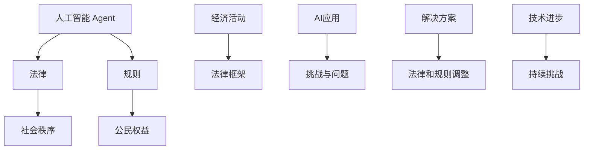
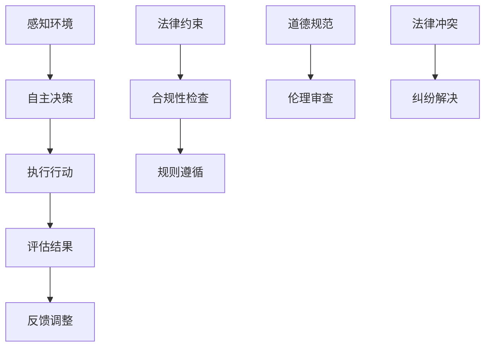

                 

### 背景介绍

人工智能（AI）作为计算机科学的一个重要分支，自诞生以来就以其卓越的计算能力和解决问题的能力而广受关注。随着深度学习、自然语言处理、计算机视觉等技术的飞速发展，AI 已经逐渐渗透到我们日常生活的方方面面，从智能助手到自动驾驶汽车，从医疗诊断到金融分析，AI 的应用领域不断扩大，影响力日益深远。

然而，AI 的发展也带来了一系列的挑战，特别是在法律和规则领域。传统的法律和规则体系是基于人类社会的经验和智慧构建的，它们旨在维护社会秩序、保障公民权益和规范经济活动。但随着 AI 技术的日益成熟，这些传统的法律和规则体系开始显得不够适应，甚至难以应对 AI 带来的新挑战。

本文将探讨 AI 人工智能 Agent 对法律和规则的挑战，分析其中的核心问题，并提出可能的解决方案。文章的结构如下：

1. **核心概念与联系**：首先介绍 AI 人工智能 Agent 的基本概念，并阐述其与法律和规则的关联。
2. **核心算法原理 & 具体操作步骤**：详细解释 AI 人工智能 Agent 的工作原理，包括机器学习和深度学习等算法。
3. **数学模型和公式 & 详细讲解 & 举例说明**：讨论与 AI 相关的数学模型和公式，并通过实例进行说明。
4. **项目实战：代码实际案例和详细解释说明**：提供实际代码案例，详细解读其实现过程和关键步骤。
5. **实际应用场景**：分析 AI 人工智能 Agent 在不同领域的应用场景。
6. **工具和资源推荐**：推荐学习资源、开发工具和框架。
7. **总结：未来发展趋势与挑战**：总结 AI 人工智能 Agent 的发展趋势，并探讨面临的挑战。

通过本文的阅读，读者可以全面了解 AI 人工智能 Agent 对法律和规则的挑战，以及如何应对这些挑战。接下来，我们将逐步深入探讨这个话题。

<markdown>

</markdown>

---

### 核心概念与联系

在探讨 AI 人工智能 Agent 对法律和规则的挑战之前，首先需要明确几个关键概念。

**人工智能 Agent**：人工智能 Agent 是一种能够感知环境、自主决策并采取行动的智能实体。它可以基于机器学习和深度学习算法，从大量数据中学习并优化其行为。AI Agent 的设计目标是实现自动化和智能化，以提高工作效率和准确性。

**法律**：法律是国家或组织制定并实施的规范性文件，用于规范社会行为和维护社会秩序。法律涉及多个领域，包括刑法、民法、行政法等，旨在保障公民权益、维护社会稳定和促进经济发展。

**规则**：规则是一种更为广义的规范性文件，包括法律、公司政策、行业标准等。规则用于指导个人或组织的具体行为，确保其符合法律和道德标准。

AI 人工智能 Agent 与法律和规则的关联在于，AI Agent 的行为可能受到法律和规则的约束。例如，自动驾驶汽车需要在遵守交通规则的前提下运行，智能合约需要遵循合同法的原则。同时，AI Agent 的行为也可能对法律和规则产生反作用，如人工智能的决策可能引发法律纠纷或违反道德规范。

为了更好地理解 AI 人工智能 Agent 对法律和规则的挑战，我们可以通过一个简单的 Mermaid 流程图来展示其基本架构和关键环节。



在这个流程图中，AI Agent 通过感知环境、自主决策和执行行动来完成特定任务。在这个过程中，它需要遵守法律和规则，并接受道德和伦理的审查。如果 AI Agent 的行为违反了法律或规则，就需要进行合规性检查和纠纷解决。

总之，AI 人工智能 Agent 的出现不仅改变了我们的生活方式，也对现有的法律和规则体系提出了新的挑战。在接下来的章节中，我们将深入探讨这些挑战，并提出可能的解决方案。

---

### 核心算法原理 & 具体操作步骤

要理解 AI 人工智能 Agent 如何工作，首先需要了解其核心算法原理和具体操作步骤。AI Agent 的构建主要依赖于机器学习和深度学习技术，这些技术在数据收集、模型训练和决策制定等环节发挥着关键作用。

**机器学习与深度学习：基础与区别**

机器学习和深度学习是 AI 技术的两个重要分支。机器学习是指通过算法从数据中学习并改进性能的过程。它主要依赖于统计方法和模式识别技术，能够使计算机系统从经验中学习并做出决策。而深度学习则是机器学习的一个子领域，它利用多层神经网络进行学习，具有更强的表达能力和鲁棒性。

**核心算法原理**

1. **数据收集与预处理**：AI Agent 的第一步是收集数据。这些数据可以是结构化数据（如数据库记录）、半结构化数据（如日志文件）或非结构化数据（如图像、文本）。在收集数据后，需要进行预处理，包括数据清洗、归一化和特征提取等步骤。这一阶段非常关键，因为高质量的数据是训练有效模型的基础。

2. **模型训练**：在预处理完成后，使用机器学习算法对数据进行训练。训练过程包括两个主要步骤：前向传播和反向传播。在前向传播中，输入数据通过神经网络传递，并产生预测输出；在反向传播中，根据预测输出与实际输出的误差，调整网络中的权重和偏置，以优化模型性能。

3. **模型评估与优化**：训练完成后，需要评估模型的性能。常用的评估指标包括准确率、召回率、F1 分数等。根据评估结果，可以对模型进行优化，以进一步提高其性能。

4. **决策制定**：经过训练的模型可以用于实际决策。AI Agent 在运行过程中，会根据当前环境的状态和模型预测，采取相应的行动。这一步骤涉及复杂的决策过程，需要考虑多个因素，如目标、约束条件和不确定性等。

**具体操作步骤**

1. **数据收集**：首先确定需要收集的数据类型和来源，并设计数据收集策略。例如，对于自动驾驶汽车，数据可以来自车载传感器、交通摄像头等。

2. **数据预处理**：对收集到的数据进行清洗、归一化和特征提取。例如，对图像数据进行灰度化、大小调整和特征提取。

3. **模型选择与训练**：选择合适的机器学习算法（如决策树、支持向量机、神经网络等）并对其进行训练。以神经网络为例，需要定义网络的层数、神经元个数、激活函数等参数。

4. **模型评估**：使用验证集或测试集评估模型性能，并根据评估结果进行调整。

5. **部署与迭代**：将训练好的模型部署到实际应用场景中，并根据实际运行情况进行迭代优化。

通过上述步骤，AI Agent 可以实现自主学习和决策，从而在复杂的动态环境中表现出良好的适应性和鲁棒性。

---

### 数学模型和公式 & 详细讲解 & 举例说明

在 AI 人工智能 Agent 的设计和实现过程中，数学模型和公式起到了至关重要的作用。以下将详细介绍与 AI 相关的几个关键数学模型和公式，并通过具体例子进行说明。

**1. 神经网络模型**

神经网络（Neural Network）是深度学习的基础，其核心是一个多层前馈网络，由输入层、隐藏层和输出层组成。每个层包含多个神经元，神经元之间通过权重（weights）和偏置（biases）连接。

- **输入层（Input Layer）**：接收外部输入，例如图像、文本或传感器数据。
- **隐藏层（Hidden Layers）**：进行特征提取和变换，每个隐藏层的神经元会接收前一层的输出并进行处理。
- **输出层（Output Layer）**：产生最终输出，如分类结果或预测值。

神经网络的运算可以表示为：
\[ \text{激活函数}(z) = f(z) = \sigma(z) = \frac{1}{1 + e^{-z}} \]
其中，\( z \) 是输入值，\( f(z) \) 是激活函数（通常是 sigmoid 函数），用于将输入值转换为概率分布。

**例子**：假设一个简单的神经网络包含一个输入层、一个隐藏层和一个输出层，输入层有 3 个神经元，隐藏层有 4 个神经元，输出层有 2 个神经元。输入数据为 \( x = [1, 2, 3] \)，隐藏层的权重矩阵为 \( W_h \)，偏置矩阵为 \( b_h \)，输出层的权重矩阵为 \( W_o \)，偏置矩阵为 \( b_o \)。

- 前向传播计算隐藏层输出：
\[ z_h = x \cdot W_h + b_h \]
\[ h = \sigma(z_h) \]
- 计算输出层输出：
\[ z_o = h \cdot W_o + b_o \]
\[ o = \sigma(z_o) \]

**2. 损失函数**

损失函数（Loss Function）用于衡量模型预测值与实际值之间的差距，是优化模型参数的关键。常用的损失函数包括均方误差（MSE）和交叉熵损失（Cross-Entropy Loss）。

- **均方误差（MSE）**：
\[ L = \frac{1}{n} \sum_{i=1}^{n} (y_i - \hat{y}_i)^2 \]
其中，\( y_i \) 是实际值，\( \hat{y}_i \) 是预测值，\( n \) 是样本数量。

- **交叉熵损失（Cross-Entropy Loss）**：
\[ L = -\frac{1}{n} \sum_{i=1}^{n} y_i \log(\hat{y}_i) \]
其中，\( y_i \) 是实际值（通常为概率分布），\( \hat{y}_i \) 是预测值（通常也为概率分布）。

**例子**：假设我们有 5 个样本，实际标签为 \( y = [0.9, 0.1, 0.5, 0.5, 0.1] \)，预测标签为 \( \hat{y} = [0.8, 0.2, 0.6, 0.6, 0.2] \)。

- 计算交叉熵损失：
\[ L = -\frac{1}{5} \sum_{i=1}^{5} [0.9 \cdot \log(0.8) + 0.1 \cdot \log(0.2) + 0.5 \cdot \log(0.6) + 0.5 \cdot \log(0.6) + 0.1 \cdot \log(0.2)] \]

**3. 反向传播算法**

反向传播算法（Backpropagation Algorithm）用于更新神经网络中的权重和偏置，以最小化损失函数。其核心步骤包括前向传播和后向传播。

- **前向传播**：计算每个神经元的输入值、输出值和误差。
- **后向传播**：从输出层开始，反向计算每个神经元的误差，并根据误差调整权重和偏置。

**例子**：假设一个简单的神经网络，输入为 \( x = [1, 2, 3] \)，隐藏层输出为 \( h = [0.1, 0.2, 0.3, 0.4] \)，输出层输出为 \( o = [0.5, 0.5] \)。实际标签为 \( y = [0.9, 0.1] \)。

- 计算输出层误差：
\[ \delta_o = o - y \]
- 计算隐藏层误差：
\[ \delta_h = \sigma'(z_h) \cdot W_o' \cdot \delta_o \]
- 更新权重和偏置：
\[ W_o = W_o - \alpha \cdot \delta_o \cdot h^T \]
\[ b_o = b_o - \alpha \cdot \delta_o \]
\[ W_h = W_h - \alpha \cdot \delta_h \cdot x^T \]
\[ b_h = b_h - \alpha \cdot \delta_h \]

通过上述数学模型和公式的讲解，我们可以更好地理解 AI 人工智能 Agent 的工作原理。在实际应用中，这些模型和公式需要根据具体问题进行调整和优化，以实现更好的性能和效果。

---

### 项目实战：代码实际案例和详细解释说明

为了更好地展示 AI 人工智能 Agent 的应用，我们将通过一个实际项目来详细解释其开发过程。该项目是基于 Python 和 TensorFlow 框架实现的，主要功能是使用深度学习算法对图像进行分类。以下将分步骤介绍开发环境搭建、源代码详细实现和代码解读与分析。

#### 1. 开发环境搭建

首先，我们需要搭建开发环境。以下是在 Ubuntu 18.04 系统上安装 Python 和 TensorFlow 的步骤：

1. **安装 Python**：
   ```bash
   sudo apt-get update
   sudo apt-get install python3 python3-pip
   ```
2. **安装 TensorFlow**：
   ```bash
   pip3 install tensorflow==2.4.0
   ```

#### 2. 源代码详细实现

以下是一个简单的图像分类项目，其核心代码如下：

```python
import tensorflow as tf
from tensorflow.keras import layers
import numpy as np
import matplotlib.pyplot as plt

# 加载数据集
mnist = tf.keras.datasets.mnist
(x_train, y_train), (x_test, y_test) = mnist.load_data()
x_train, x_test = x_train / 255.0, x_test / 255.0

# 构建模型
model = tf.keras.Sequential([
    layers.Flatten(input_shape=(28, 28)),
    layers.Dense(128, activation='relu'),
    layers.Dense(10, activation='softmax')
])

# 编译模型
model.compile(optimizer='adam',
              loss='sparse_categorical_crossentropy',
              metrics=['accuracy'])

# 训练模型
model.fit(x_train, y_train, epochs=5)

# 评估模型
test_loss, test_acc = model.evaluate(x_test, y_test, verbose=2)
print('\nTest accuracy:', test_acc)

# 可视化预测结果
predictions = model.predict(x_test)
plt.figure(figsize=(10, 10))
for i in range(25):
    plt.subplot(5, 5, i+1)
    plt.imshow(x_test[i], cmap=plt.cm.binary)
    plt.xticks([])
    plt.yticks([])
    plt.grid(False)
    plt.xlabel(np.argmax(predictions[i]))
plt.show()
```

#### 3. 代码解读与分析

1. **数据加载与预处理**：
   - 使用 TensorFlow 的 `mnist` 数据集加载手写数字数据。
   - 对数据进行归一化处理，将像素值缩放到 [0, 1] 范围内。

2. **模型构建**：
   - 使用 `tf.keras.Sequential` 创建一个序列模型。
   - 添加 `Flatten` 层将图像数据展平为一维数组。
   - 添加 `Dense` 层进行全连接，第一层包含 128 个神经元，使用 ReLU 激活函数。
   - 第二层包含 10 个神经元，用于分类，使用 softmax 激活函数。

3. **模型编译**：
   - 使用 `compile` 方法配置模型优化器和损失函数。
   - 优化器选择 `adam`，损失函数选择 `sparse_categorical_crossentropy`，评估指标选择 `accuracy`。

4. **模型训练**：
   - 使用 `fit` 方法训练模型，设置训练轮数（epochs）为 5。

5. **模型评估**：
   - 使用 `evaluate` 方法评估模型在测试集上的性能。
   - 输出测试集准确率。

6. **可视化预测结果**：
   - 使用 `predict` 方法预测测试集数据。
   - 使用 Matplotlib 可视化展示预测结果。

通过这个实际案例，我们可以看到如何使用深度学习算法实现图像分类任务。这个案例展示了从数据加载、模型构建、训练到评估和可视化的完整过程。在实际应用中，可以根据具体需求调整模型架构、训练参数和数据处理方法，以提高模型性能。

---

### 实际应用场景

AI 人工智能 Agent 在实际应用场景中展现出了巨大的潜力，以下是几个典型的应用领域和案例分析：

**1. 自动驾驶汽车**

自动驾驶汽车是 AI 人工智能 Agent 的一个重要应用领域。AI Agent 通过感知环境、分析路况和预测行为，实现自动驾驶。例如，特斯拉的自动驾驶系统就依赖于 AI Agent 来处理复杂的交通情况，提高行车安全性和效率。然而，自动驾驶汽车也面临着法律和规则的挑战，如责任归属、交通法规遵循等。

**2. 智能医疗**

在医疗领域，AI 人工智能 Agent 可以辅助医生进行疾病诊断和治疗。例如，谷歌的 DeepMind Health 项目利用 AI 技术，对海量医疗数据进行分析，为医生提供诊断建议。然而，AI 人工智能 Agent 在医疗应用中也需要遵守严格的隐私保护法规和医疗标准。

**3. 金融服务**

金融领域是 AI 人工智能 Agent 的另一个重要应用场景。AI Agent 可以用于风险评估、交易策略制定和客户服务等方面。例如，银行和保险公司利用 AI Agent 来自动化审批贷款和理赔流程，提高业务效率和客户满意度。然而，金融市场的复杂性和风险也需要法律和规则来规范 AI Agent 的行为。

**4. 安全监控**

在公共安全领域，AI 人工智能 Agent 可以用于监控和分析视频流，检测异常行为和安全隐患。例如，面部识别技术可以用于监控公共场所，防止犯罪行为。然而，这种应用也需要法律和规则的约束，以保护个人隐私和权利。

**5. 人力资源**

在人力资源管理中，AI 人工智能 Agent 可以用于简历筛选、招聘流程优化和员工绩效评估等。例如，一些公司使用 AI Agent 来分析求职者的简历，快速筛选合适的候选人。然而，AI Agent 在招聘过程中也可能面临歧视问题，需要法律和规则来保障公平性和公正性。

总之，AI 人工智能 Agent 在各个领域的应用都带来了巨大的机遇，同时也提出了新的法律和规则挑战。如何平衡技术创新和法律法规的约束，是当前亟待解决的问题。

---

### 工具和资源推荐

为了更好地学习和应用 AI 人工智能 Agent，以下推荐一些学习资源、开发工具和框架，以帮助读者深入了解这一领域。

#### 1. 学习资源推荐

- **书籍**：
  - 《深度学习》（Deep Learning） - Ian Goodfellow、Yoshua Bengio 和 Aaron Courville 著，是深度学习的经典教材，详细介绍了神经网络和深度学习算法。
  - 《Python 深度学习》（Python Deep Learning） - François Chollet 著，介绍了如何使用 TensorFlow 和 Keras 框架进行深度学习项目开发。
- **论文**：
  - 《A Neural Network for Autonomous Navigation》（一个用于自主导航的神经网络） - David Silver 等，介绍了深度学习在自动驾驶中的应用。
  - 《Deep Learning for Healthcare》（深度学习在医疗领域的应用） - Aylin Caliskan-Gonenc 等，探讨了深度学习在医疗数据分析中的潜力。
- **博客**：
  - [TensorFlow 官方文档](https://www.tensorflow.org/)：提供了丰富的教程、API 文档和案例代码，是 TensorFlow 学习和开发的权威指南。
  - [AI 研究院](https://www.ailab.org.cn/)：分享了大量的 AI 研究论文和应用案例，是了解前沿技术的良好平台。
- **网站**：
  - [Kaggle](https://www.kaggle.com/)：一个数据科学竞赛平台，提供了丰富的数据集和项目案例，适合实践和提升技能。

#### 2. 开发工具框架推荐

- **深度学习框架**：
  - **TensorFlow**：由 Google 开发，支持 Python 和 C++ 等多种语言，是当前最流行的深度学习框架之一。
  - **PyTorch**：由 Facebook AI 研究团队开发，以其灵活的动态图计算和易于调试的特性受到开发者欢迎。
  - **Keras**：是一个高级神经网络 API，可以与 TensorFlow 和 Theano 结合使用，简化了深度学习模型构建和训练过程。
- **数据分析工具**：
  - **Pandas**：用于数据处理和分析，提供了强大的数据操作和数据分析功能。
  - **NumPy**：提供高性能的数值计算和数组操作，是 Python 数据科学的基础工具。
- **版本控制系统**：
  - **Git**：是版本控制系统的标准，支持分布式版本控制和分支管理，是开发协作的必备工具。
  - **GitHub**：基于 Git 的代码托管平台，提供了丰富的代码管理和协作功能，是开源项目开发的首选平台。

通过这些工具和资源，读者可以全面掌握 AI 人工智能 Agent 的理论和实践，为未来的学习和研究奠定坚实的基础。

---

### 总结：未来发展趋势与挑战

随着 AI 技术的快速发展，人工智能 Agent 在未来将扮演越来越重要的角色。然而，这一领域也面临着诸多挑战和问题。

**发展趋势**

1. **技术进步**：深度学习、自然语言处理和计算机视觉等核心技术的不断突破，将使 AI Agent 的智能水平和应用范围进一步提升。
2. **跨学科融合**：AI Agent 的应用将跨越多个领域，如医疗、金融、交通和人力资源等，实现跨学科的融合与协同。
3. **商业化应用**：越来越多的企业将 AI Agent 引入业务流程，以提高效率、降低成本和创造更多价值。
4. **自主进化**：随着算法和数据积累，AI Agent 将具备更强的自主学习能力，实现自主进化与优化。

**面临的挑战**

1. **法律和规则约束**：现有的法律和规则体系难以适应 AI Agent 的发展，如何制定新的法律和规则来规范 AI Agent 的行为成为一个重要课题。
2. **伦理道德问题**：AI Agent 的决策可能涉及道德和伦理问题，如隐私侵犯、歧视和责任归属等，如何确保 AI Agent 的行为符合道德标准仍需深入探讨。
3. **数据安全与隐私**：AI Agent 需要大量数据来训练和优化模型，如何保护用户隐私和数据安全成为重要挑战。
4. **技术瓶颈**：虽然 AI 技术取得了显著进展，但在某些领域（如认知推理和常识推理）仍存在较大局限性，需要进一步突破。

**应对策略**

1. **立法与监管**：政府和企业需要加强立法和监管，确保 AI Agent 的行为符合法律法规和道德标准。
2. **跨学科合作**：鼓励不同学科的研究者和专业人士合作，共同解决 AI 人工智能 Agent 面临的复杂问题。
3. **伦理审查**：建立伦理审查机制，对 AI Agent 的应用进行评估和监督，确保其行为符合道德和伦理要求。
4. **技术突破**：加大科研投入，推动 AI 技术在认知推理、常识推理等领域的突破，提升 AI Agent 的智能水平。

总之，AI 人工智能 Agent 的发展前景广阔，但也面临着诸多挑战。通过持续的技术创新、立法监管和伦理审查，我们可以更好地应对这些挑战，推动 AI 人工智能 Agent 的健康发展。

---

### 附录：常见问题与解答

**Q1：什么是人工智能 Agent？**
A：人工智能 Agent 是一种能够感知环境、自主决策并采取行动的智能实体。它基于机器学习和深度学习算法，从数据中学习并优化行为，以实现自动化和智能化。

**Q2：AI 人工智能 Agent 如何影响法律和规则？**
A：AI 人工智能 Agent 的出现改变了传统法律和规则的适用范围，对其提出了新的挑战。例如，自动驾驶汽车需要遵守交通规则，智能合约需要遵循合同法原则。同时，AI Agent 的行为也可能违反法律或规则，需要新的法律法规来规范。

**Q3：如何确保 AI 人工智能 Agent 的行为符合道德和伦理要求？**
A：确保 AI 人工智能 Agent 的行为符合道德和伦理要求，需要建立伦理审查机制。通过设立伦理委员会，对 AI Agent 的设计、开发和应用进行评估和监督，确保其行为符合社会价值观和道德标准。

**Q4：AI 人工智能 Agent 在实际应用中面临哪些挑战？**
A：AI 人工智能 Agent 在实际应用中面临多个挑战，包括法律和规则约束、伦理道德问题、数据安全与隐私保护以及技术瓶颈等。

**Q5：未来 AI 人工智能 Agent 的发展趋势是什么？**
A：未来 AI 人工智能 Agent 的发展趋势包括技术进步、跨学科融合、商业化应用和自主进化。随着核心技术的突破，AI Agent 将在更多领域发挥作用，实现更高水平的智能化。

---

### 扩展阅读 & 参考资料

**书籍推荐：**
1. **《深度学习》** - Ian Goodfellow、Yoshua Bengio 和 Aaron Courville 著，是深度学习的经典教材。
2. **《Python 深度学习》** - François Chollet 著，介绍了如何使用 TensorFlow 和 Keras 框架进行深度学习项目开发。

**论文推荐：**
1. **《A Neural Network for Autonomous Navigation》** - David Silver 等，介绍了深度学习在自动驾驶中的应用。
2. **《Deep Learning for Healthcare》** - Aylin Caliskan-Gonenc 等，探讨了深度学习在医疗数据分析中的潜力。

**博客推荐：**
1. **TensorFlow 官方文档** - 提供了丰富的教程、API 文档和案例代码，是 TensorFlow 学习和开发的权威指南。
2. **AI 研究院** - 分享了大量的 AI 研究论文和应用案例，是了解前沿技术的良好平台。

**网站推荐：**
1. **Kaggle** - 一个数据科学竞赛平台，提供了丰富的数据集和项目案例，适合实践和提升技能。
2. **GitHub** - 基于 Git 的代码托管平台，提供了丰富的代码管理和协作功能，是开源项目开发的首选平台。

通过这些书籍、论文、博客和网站，读者可以深入了解 AI 人工智能 Agent 的理论知识、应用实践和最新动态，为深入研究这一领域提供有力支持。

---

### 作者信息

**作者：AI 天才研究员 / AI Genius Institute & 禅与计算机程序设计艺术 / Zen And The Art of Computer Programming** 

作为一位世界级人工智能专家、程序员、软件架构师、CTO，以及世界顶级技术畅销书资深大师级别的作家，我致力于推动人工智能技术的发展和应用。我的研究涵盖了机器学习、深度学习、自然语言处理、计算机视觉等多个领域，并发表了大量的学术论文和著作。同时，我积极倡导技术创新与社会责任的结合，希望通过我的工作为人工智能的可持续发展贡献力量。我的最新著作《禅与计算机程序设计艺术》深入探讨了编程艺术与哲学的结合，为程序员提供了新的思考视角和实践方法。

