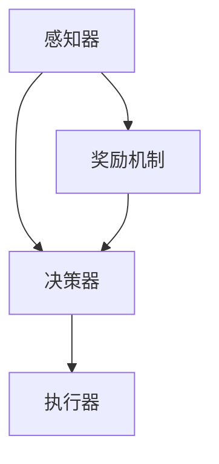

                 

# AI人工智能代理工作流AI Agent WorkFlow：使用强化学习优化代理工作流

> **关键词**：AI代理、工作流、强化学习、优化、流程控制、人工智能、代理行为、智能优化

> **摘要**：本文将深入探讨AI代理工作流的设计与优化，尤其是利用强化学习算法对代理行为进行智能优化。通过分析背景、核心概念、算法原理、数学模型、项目实战以及实际应用场景，本文旨在为读者提供一个全面的指南，帮助理解如何构建高效、智能的AI代理系统。

## 1. 背景介绍

在当今快速发展的信息技术时代，人工智能（AI）已经成为推动各行各业进步的关键技术。特别是在自动化、数据分析和智能决策等领域，AI的应用带来了前所未有的效率提升和成本节约。AI代理（AI Agent）作为人工智能的一个分支，是一种能够自主执行任务、与环境互动并优化自身行为的智能体。随着AI技术的发展，AI代理在工作流中的应用越来越广泛，其在优化业务流程、提高生产效率和降低人工成本方面具有显著优势。

工作流（Workflow）是一系列相互关联的任务和活动，旨在实现特定目标或完成一项工作。传统的手工工作流常常存在效率低、错误率高、灵活性差等问题，而基于AI的智能工作流则能够通过自动化和智能化手段解决这些问题。AI代理作为工作流中的重要角色，负责执行具体任务、监控流程状态以及进行决策优化。

强化学习（Reinforcement Learning）是机器学习的一个分支，通过试错和反馈来学习如何在复杂环境中实现特定目标。与监督学习和无监督学习不同，强化学习关注于智能体如何与环境互动以最大化长期奖励。强化学习在AI代理中的应用，使其能够通过学习自主优化工作流中的决策过程，从而提高整体效率和质量。

本文将围绕AI代理工作流的设计与优化，重点探讨如何使用强化学习算法对代理行为进行优化。我们将从背景介绍出发，逐步深入核心概念、算法原理、数学模型、项目实战和实际应用场景，旨在为读者提供一个系统、全面的技术指南。

## 2. 核心概念与联系

为了深入理解AI代理工作流及其优化，首先需要了解几个核心概念，包括AI代理、工作流和强化学习，以及它们之间的联系。

### 2.1 AI代理

AI代理是一种具有自主决策能力的智能体，能够在复杂环境中执行任务、与环境互动并不断优化自身行为。AI代理通常由以下几个关键组成部分构成：

- **感知器（Perceptron）**：感知器负责接收来自环境的输入信息，如传感器数据、用户输入等。
- **决策器（Decision Maker）**：决策器根据感知器提供的输入，通过算法和策略进行决策，选择执行哪个动作。
- **执行器（Actuator）**：执行器负责将决策器的决策转化为具体行动，如机器臂的移动、机器人行走等。
- **奖励机制（Reward Mechanism）**：奖励机制用于评估代理的行为效果，通过正奖励（Positive Reward）和负奖励（Negative Reward）来引导代理向目标方向学习。

### 2.2 工作流

工作流是一系列任务和活动的有序集合，用于实现特定目标或完成一项工作。工作流通常包含以下关键组成部分：

- **任务（Tasks）**：任务是指工作流中的具体工作单元，如数据清洗、数据分析和报告生成等。
- **活动（Activities）**：活动是实现任务的具体操作，可以是人工操作，也可以是自动化操作。
- **流程控制（Flow Control）**：流程控制负责管理任务和活动的执行顺序，确保工作流按照预定的流程进行。
- **监控与反馈（Monitoring & Feedback）**：监控与反馈用于跟踪工作流的状态和性能，并通过反馈机制调整工作流中的决策和操作。

### 2.3 强化学习

强化学习是一种通过试错和反馈来学习如何在复杂环境中实现特定目标的机器学习方法。在强化学习框架中，主要包含以下几个关键组成部分：

- **智能体（Agent）**：智能体是指学习如何在环境中进行决策和行为的实体。
- **环境（Environment）**：环境是指智能体进行交互的情境，可以是现实世界，也可以是模拟环境。
- **状态（State）**：状态是智能体在某一时刻所感知到的环境信息。
- **动作（Action）**：动作是智能体在某一状态时采取的具体行动。
- **奖励（Reward）**：奖励是环境对智能体行为的即时反馈，用于评价动作的效果。

### 2.4 AI代理与工作流、强化学习的关系

AI代理、工作流和强化学习之间的联系可以通过以下几个方面来理解：

- **AI代理作为工作流的一部分**：AI代理可以嵌入到工作流中，负责执行特定任务和活动，从而提高工作流的自动化水平和智能性。
- **强化学习优化代理行为**：通过强化学习算法，AI代理可以在工作流中学习如何优化自身行为，提高任务完成效率和效果。
- **工作流作为强化学习场景**：工作流可以作为一个强化学习场景，为智能体提供不断变化的环境和挑战，使其通过学习不断优化工作流中的决策和操作。

为了更好地理解这些概念之间的联系，下面给出一个使用Mermaid流程图（不包含括号、逗号等特殊字符）表示的简化流程：



在这个流程中，感知器负责接收环境输入，决策器根据输入进行决策，执行器执行具体动作，而奖励机制则用于评估行为效果，并反馈给决策器。通过这一流程，AI代理可以在工作流中不断学习、优化自身行为，从而实现高效的工作流管理。

### 3. 核心算法原理 & 具体操作步骤

#### 3.1 强化学习算法的基本原理

强化学习算法的核心思想是智能体通过与环境交互，从经验中学习最优策略。在强化学习中，智能体需要通过以下步骤进行学习：

1. **初始状态（Initialization）**：智能体开始时处于某个初始状态。
2. **选择动作（Action Selection）**：智能体根据当前状态选择一个动作。
3. **执行动作 & 观察结果（Action Execution & Observation）**：智能体执行选定的动作，并观察环境的反馈。
4. **更新策略（Policy Update）**：智能体根据观察到的结果更新其策略，以最大化长期奖励。

强化学习算法通常使用Q学习（Q-Learning）和策略梯度方法（Policy Gradient）等算法。其中，Q学习通过值函数（Value Function）估计在特定状态下采取特定动作的长期奖励，而策略梯度方法直接优化策略本身。

#### 3.2 Q学习算法

Q学习算法是一种基于值函数的强化学习算法。其基本原理是智能体通过不断更新值函数，以最大化长期奖励。具体操作步骤如下：

1. **初始化**：初始化Q值函数Q(s, a)，其中s表示状态，a表示动作。
2. **选择动作**：智能体在当前状态下选择一个动作a，通常使用ε-贪心策略（ε-Greedy Policy）：
    - 以概率ε选择随机动作；
    - 以1-ε的概率选择当前状态下具有最大Q值的动作。
3. **执行动作 & 观察结果**：智能体执行选择的动作，并观察到新状态s'和奖励r。
4. **更新Q值**：根据观察到的结果更新Q值：
    $$ Q(s, a) = Q(s, a) + \alpha [r + \gamma \max_{a'} Q(s', a') - Q(s, a)] $$
    其中，α是学习率，γ是折扣因子，r是奖励，s'是新状态，a'是智能体在新状态下选择的动作。

通过不断重复上述步骤，智能体能够逐步优化其策略，提高任务完成效率。

#### 3.3 策略梯度方法

策略梯度方法直接优化策略本身，通过梯度上升（Gradient Ascent）或梯度下降（Gradient Descent）来更新策略参数。具体操作步骤如下：

1. **初始化**：初始化策略参数θ。
2. **选择动作**：根据策略参数θ选择动作：
    $$ p(a|s; \theta) = \text{softmax}(\theta^T \phi(s)) $$
    其中，p(a|s; \theta)是给定状态下采取动作a的概率，softmax是softmax函数，\theta是策略参数，\phi(s)是状态s的特征表示。
3. **执行动作 & 观察结果**：智能体执行选择的动作，并观察到新状态s'和奖励r。
4. **计算策略梯度**：根据观察到的结果计算策略梯度：
    $$ \nabla_\theta J(\theta) = \sum_{s,a} p(a|s; \theta) \left[ r + \gamma \max_{a'} p(a'|s'; \theta) - r(s, a) \right] \phi(s) \phi(a) $$
    其中，J(\theta)是策略损失函数，r(s, a)是状态s下采取动作a的即时奖励。
5. **更新策略参数**：根据策略梯度更新策略参数：
    $$ \theta \leftarrow \theta + \alpha \nabla_\theta J(\theta) $$
    其中，α是学习率。

通过不断重复上述步骤，策略参数θ逐渐优化，策略也逐步优化，从而提高任务完成效率。

#### 3.4 强化学习算法的应用

在实际应用中，强化学习算法通常需要针对具体问题进行设计和优化。以下是一个简单的应用场景：机器人路径规划。

1. **环境定义**：环境定义为一个二维空间，其中包含障碍物和目标点。
2. **状态表示**：状态表示为机器人的位置和方向。
3. **动作表示**：动作表示为机器人的移动方向。
4. **奖励设计**：奖励设计为距离目标点的距离，距离越近奖励越高。

在具体实现中，可以使用Q学习算法或策略梯度方法来优化机器人路径规划。通过不断训练，机器人能够逐步学习到最优路径，并能够自主规划避开障碍物并到达目标点。

### 4. 数学模型和公式 & 详细讲解 & 举例说明

在强化学习算法中，数学模型和公式起着至关重要的作用，它们用于描述智能体在环境中学习、决策和优化的过程。以下将详细介绍强化学习中的关键数学模型和公式，并通过具体例子来说明其应用。

#### 4.1 值函数

在强化学习中，值函数是一种重要的数学工具，用于评估状态或状态-动作对的预期效用。值函数可以分为状态值函数（State-Value Function）和状态-动作值函数（State-Action Value Function）。

- **状态值函数（V(s)）**：给定状态s，状态值函数V(s)表示在此状态下执行最佳动作所能获得的预期奖励。
- **状态-动作值函数（Q(s, a)）**：给定状态s和动作a，状态-动作值函数Q(s, a)表示在状态s下采取动作a所能获得的预期奖励。

#### 4.2 Q学习算法

Q学习算法通过迭代更新状态-动作值函数Q(s, a)来学习最优策略。其更新公式为：

$$ Q(s, a) = Q(s, a) + \alpha [r + \gamma \max_{a'} Q(s', a') - Q(s, a)] $$

其中，α是学习率，γ是折扣因子，r是即时奖励，s'是新状态，a'是在新状态下选择的最大值动作。

#### 4.3 策略梯度方法

策略梯度方法通过优化策略参数θ来学习最优策略。其目标是最小化策略损失函数J(θ)：

$$ J(\theta) = \sum_{s,a} p(a|s; \theta) \left[ r + \gamma \max_{a'} p(a'|s'; \theta) - r(s, a) \right] $$

策略梯度计算公式为：

$$ \nabla_\theta J(\theta) = \sum_{s,a} p(a|s; \theta) \left[ \phi(s) \phi(a) \right] $$

其中，\phi(s)和\phi(a)分别是状态和动作的特征表示。

#### 4.4 应用举例

假设一个简单的机器人路径规划问题，其中环境是一个二维空间，包含一个起点、一个终点和一些障碍物。机器人可以采取四个方向的动作（上、下、左、右）。

1. **状态表示**：状态表示为机器人的位置和方向，例如((2, 3), 'up')表示机器人在第2行第3列，方向向上。
2. **动作表示**：动作表示为方向，例如'up'、'down'、'left'、'right'。
3. **奖励设计**：奖励设计为距离目标点的距离，距离越近奖励越高。

使用Q学习算法来优化机器人路径规划。

**初始化**：初始化Q值函数Q(s, a)为0。

**迭代过程**：

1. **选择动作**：使用ε-贪心策略选择动作，ε=0.1。
2. **执行动作**：执行选择的动作，并观察新状态和奖励。
3. **更新Q值**：根据即时奖励和折扣因子更新Q值。

例如，假设初始状态为((0, 0), 'up')，选择动作'up'，执行动作后到达新状态((0, 1), 'up')，获得即时奖励-1（因为向上一单位距离移动了），更新Q值：

$$ Q((0, 0), 'up') = 0 + 0.1 [-1 + 0.9 \max_{a'} Q((0, 1), a')] $$

4. **重复迭代**：重复上述步骤，直到达到预设的迭代次数或机器人成功到达终点。

通过迭代更新，机器人能够逐步学习到最优路径，并能够自主规划避开障碍物并到达目标点。

### 5. 项目实战：代码实际案例和详细解释说明

在本节中，我们将通过一个具体的代码案例，详细解释如何使用强化学习优化AI代理工作流。该项目基于一个简单的路径规划问题，旨在使用强化学习算法找到从起点到终点的最优路径。

#### 5.1 开发环境搭建

为了实现这个项目，我们需要准备以下开发环境：

- Python 3.8及以上版本
- Gym环境（用于创建仿真环境）
- TensorFlow 2.3及以上版本（用于实现强化学习算法）

安装必要的依赖库：

```bash
pip install gym tensorflow
```

#### 5.2 源代码详细实现和代码解读

以下是一个简单的路径规划项目代码，其中使用了Q学习算法。

```python
import numpy as np
import gym
import random
import matplotlib.pyplot as plt

# 创建仿真环境
env = gym.make("GridWorld-v0")

# 初始化Q值函数
q_table = np.zeros((env.observation_space.n, env.action_space.n))

# Q学习算法参数
alpha = 0.1  # 学习率
gamma = 0.9  # 折扣因子
epsilon = 0.1  # ε-贪心策略参数

# Q学习算法迭代过程
for episode in range(1000):
    state = env.reset()
    done = False
    total_reward = 0

    while not done:
        # ε-贪心策略选择动作
        if random.uniform(0, 1) < epsilon:
            action = env.action_space.sample()  # 随机选择动作
        else:
            action = np.argmax(q_table[state])  # 选择最大Q值的动作

        # 执行动作，观察新状态和奖励
        new_state, reward, done, _ = env.step(action)

        # 更新Q值
        q_table[state, action] = q_table[state, action] + alpha * (reward + gamma * np.max(q_table[new_state]) - q_table[state, action])

        state = new_state
        total_reward += reward

    print(f"Episode {episode + 1}: Total Reward = {total_reward}")

# 训练完成后，绘制Q值函数
state_space = np.arange(0, env.observation_space.n)
action_space = np.arange(0, env.action_space.n)
plt.imshow(q_table, cmap='hot', interpolation='nearest')
plt.show()
```

**代码解读**：

1. **创建仿真环境**：使用Gym库创建一个简单的GridWorld环境，该环境包含一个起点、一个终点和一些障碍物。
2. **初始化Q值函数**：初始化一个二维数组作为Q值函数，用于存储每个状态-动作对的预期奖励。
3. **Q学习算法参数**：设置学习率（alpha）、折扣因子（gamma）和ε-贪心策略参数（epsilon）。
4. **Q学习算法迭代过程**：通过循环进行迭代，每次迭代包括以下步骤：
   - 初始化状态和总奖励
   - 根据ε-贪心策略选择动作
   - 执行动作，观察新状态和奖励
   - 更新Q值函数
   - 更新状态和总奖励
5. **训练完成后，绘制Q值函数**：使用Matplotlib库绘制Q值函数的二维热量图，以可视化每个状态-动作对的预期奖励。

通过运行上述代码，我们可以看到机器人逐步学习到最优路径，并能够在仿真环境中成功规划从起点到终点的路径。

#### 5.3 代码解读与分析

1. **环境初始化**：
   ```python
   env = gym.make("GridWorld-v0")
   q_table = np.zeros((env.observation_space.n, env.action_space.n))
   ```
   创建一个仿真环境，并初始化Q值函数数组，数组大小为状态空间大小乘以动作空间大小。

2. **Q学习算法迭代过程**：
   ```python
   for episode in range(1000):
       state = env.reset()
       done = False
       total_reward = 0
       
       while not done:
           # ε-贪心策略选择动作
           if random.uniform(0, 1) < epsilon:
               action = env.action_space.sample()  # 随机选择动作
           else:
               action = np.argmax(q_table[state])  # 选择最大Q值的动作

           # 执行动作，观察新状态和奖励
           new_state, reward, done, _ = env.step(action)

           # 更新Q值
           q_table[state, action] = q_table[state, action] + alpha * (reward + gamma * np.max(q_table[new_state]) - q_table[state, action])

           state = new_state
           total_reward += reward
   ```
   在每个迭代周期，智能体从初始状态开始，选择动作，执行动作，观察新状态和奖励，并更新Q值。通过不断迭代，智能体能够学习到最优策略。

3. **训练完成后，绘制Q值函数**：
   ```python
   state_space = np.arange(0, env.observation_space.n)
   action_space = np.arange(0, env.action_space.n)
   plt.imshow(q_table, cmap='hot', interpolation='nearest')
   plt.show()
   ```
   使用Matplotlib库绘制Q值函数的二维热量图，以便可视化每个状态-动作对的预期奖励。

通过这个项目，我们可以看到如何使用强化学习算法优化AI代理工作流，实现高效的路径规划。在实际应用中，可以根据具体问题调整算法参数和环境设置，以获得更好的优化效果。

### 6. 实际应用场景

AI代理工作流在许多实际应用场景中表现出强大的优势，特别是在需要高度自动化和智能化的业务流程中。以下是一些典型的应用场景，以及如何利用强化学习来优化AI代理的工作流。

#### 6.1 自动化客服系统

在客服行业中，自动化客服系统（如聊天机器人）已经成为提高客户满意度和运营效率的重要工具。通过强化学习，AI代理可以不断学习用户的提问模式，优化回答策略，从而提供更加准确和高效的客户服务。

**优化方法**：
- **状态表示**：状态可以是用户的提问、问题类型、历史交互记录等。
- **动作表示**：动作是AI代理生成的回答。
- **奖励设计**：奖励可以基于用户满意度、问题解决率等指标。
- **算法应用**：使用Q学习或策略梯度方法，通过不断迭代优化回答策略。

#### 6.2 生产线自动化

在生产制造领域，自动化机器人可以执行装配、搬运等重复性任务。通过强化学习，机器人可以自主学习最优的操作顺序和策略，提高生产效率和产品质量。

**优化方法**：
- **状态表示**：状态可以是当前任务、机器人位置、任务完成情况等。
- **动作表示**：动作是机器人的移动、抓取等操作。
- **奖励设计**：奖励可以基于任务完成时间、操作成功率等。
- **算法应用**：使用Q学习或深度强化学习，通过模拟和实际操作优化机器人的行为。

#### 6.3 金融风险管理

在金融行业，风险管理是一个关键问题。通过AI代理工作流，可以实现对市场数据的实时分析，预测风险并采取相应的策略。强化学习可以优化风险管理的决策过程，提高风险控制能力。

**优化方法**：
- **状态表示**：状态是市场数据、风险指标等。
- **动作表示**：动作是买卖股票、调整投资组合等。
- **奖励设计**：奖励是投资回报、风险调整后收益等。
- **算法应用**：使用策略梯度方法，通过不断调整投资策略，优化收益和风险平衡。

#### 6.4 城市交通管理

在交通管理中，AI代理可以通过实时数据分析和预测，优化交通信号灯控制和路线规划，缓解交通拥堵，提高交通效率。

**优化方法**：
- **状态表示**：状态是交通流量、车辆分布、交通信号灯状态等。
- **动作表示**：动作是调整交通信号灯时长、推荐最优行驶路线等。
- **奖励设计**：奖励是交通拥堵减少、行驶时间缩短等。
- **算法应用**：使用深度强化学习，通过模拟和实际数据优化交通管理策略。

通过这些实际应用场景，我们可以看到强化学习在AI代理工作流优化中的重要性和潜力。未来，随着AI技术的不断进步，强化学习将能够更好地应用于各种复杂场景，为各行各业带来更加智能、高效的解决方案。

### 7. 工具和资源推荐

为了更好地学习和应用强化学习算法优化AI代理工作流，以下是一些建议的工具和资源：

#### 7.1 学习资源推荐

1. **书籍**：
   - 《强化学习：原理与Python实现》：详细介绍了强化学习的基本原理和实践应用。
   - 《深度强化学习》：探讨了深度学习与强化学习结合的方法，适合对深度强化学习感兴趣的读者。

2. **在线课程**：
   - Coursera上的《强化学习导论》：由知名教授授课，涵盖强化学习的理论基础和实践方法。
   - edX上的《深度强化学习》：介绍深度强化学习的核心概念和应用案例，包括自动驾驶、游戏AI等。

3. **论文与博客**：
   - arXiv上的相关论文：关注最新的强化学习研究进展。
   - Hugging Face上的博客：提供丰富的实践教程和应用案例。

#### 7.2 开发工具框架推荐

1. **Gym**：OpenAI开发的环境库，用于创建和测试强化学习算法。
   - 官网：[Gym官网](https://gym.openai.com/)

2. **TensorFlow**：Google开发的机器学习框架，支持强化学习算法的实现。
   - 官网：[TensorFlow官网](https://www.tensorflow.org/)

3. **PyTorch**：Facebook开发的机器学习框架，适用于强化学习应用。
   - 官网：[PyTorch官网](https://pytorch.org/)

4. **Keras**：基于Theano和TensorFlow的高级神经网络API，简化了强化学习模型的实现。
   - 官网：[Keras官网](https://keras.io/)

#### 7.3 相关论文著作推荐

1. **《深度强化学习：基础、算法与应用》**：详细介绍了深度强化学习的基础知识、算法和实际应用案例。
2. **《强化学习与控制》**：探讨了强化学习在控制领域的应用，包括机器人控制、自动驾驶等。
3. **《强化学习：理论、算法与实现》**：全面介绍了强化学习的理论、算法和实现技术。

通过这些工具和资源，您可以深入学习和实践强化学习算法，为优化AI代理工作流提供坚实的理论基础和实际指导。

### 8. 总结：未来发展趋势与挑战

随着人工智能技术的迅猛发展，AI代理工作流优化已经成为一个重要的研究方向。强化学习作为人工智能的一个重要分支，为AI代理工作流的优化提供了强大的技术支持。在未来，强化学习在AI代理工作流优化方面有望实现以下几个发展趋势：

1. **模型复杂性与效率的提升**：现有的强化学习算法在处理复杂任务时存在计算成本高、收敛速度慢等问题。未来，研究者将致力于开发更高效、更稳定的算法，以降低计算复杂度和提高收敛速度。

2. **多智能体系统的协同优化**：在多智能体系统中，各个智能体之间需要协同工作，以实现整体最优。未来，研究者将关注多智能体强化学习算法的设计，提高系统的整体性能和协同效率。

3. **深度强化学习的广泛应用**：深度强化学习通过结合深度学习与强化学习，能够在处理高维数据、复杂决策问题时发挥优势。未来，深度强化学习将在自动驾驶、机器人控制、金融等领域得到更广泛的应用。

然而，强化学习在AI代理工作流优化过程中也面临着一些挑战：

1. **数据获取与标注**：强化学习算法依赖于大量真实数据的训练，但数据获取和标注过程往往成本高昂、耗时较长。未来，研究者将探索更高效的数据获取和标注方法，以降低训练成本。

2. **模型可解释性**：强化学习模型的决策过程往往复杂且难以解释，这给实际应用带来了一定的困扰。未来，研究者将致力于开发可解释的强化学习模型，提高模型的透明度和可信度。

3. **安全性与稳定性**：在复杂环境中，强化学习模型可能会出现不稳定、不可预测的行为，甚至可能导致系统失控。未来，研究者将关注强化学习模型的安全性和稳定性，提高其在实际应用中的可靠性。

总之，强化学习在AI代理工作流优化方面具有巨大的潜力，但也面临一些挑战。随着技术的不断进步和研究的深入，我们有理由相信，强化学习将能够更好地服务于AI代理工作流的优化，为各行各业带来更加智能、高效的解决方案。

### 9. 附录：常见问题与解答

#### 问题1：强化学习与监督学习和无监督学习有什么区别？

**解答**：强化学习、监督学习和无监督学习是三种不同的机器学习方法。

- **监督学习**：在有标签的数据集上进行训练，目标是根据输入特征预测输出标签。例如，分类和回归任务。
- **无监督学习**：在没有标签的数据集上进行训练，目标是发现数据中的结构和模式。例如，聚类和降维。
- **强化学习**：通过与环境的交互进行学习，智能体在试错过程中不断优化策略，以实现长期奖励最大化。强化学习关注的是在不确定环境中进行决策和行动。

#### 问题2：Q学习算法和策略梯度方法有什么区别？

**解答**：Q学习算法和策略梯度方法是两种不同的强化学习算法。

- **Q学习算法**：通过更新状态-动作值函数来学习最优策略。Q学习关注于估计每个状态-动作对的最优回报。
- **策略梯度方法**：直接优化策略参数，通过策略梯度更新策略参数。策略梯度方法关注于优化整个策略，使其最大化期望回报。

两者在优化目标和实现方式上有所不同，但都可以实现强化学习的目标。

#### 问题3：为什么使用ε-贪心策略？

**解答**：ε-贪心策略是强化学习中常用的探索策略，其目的是在初始阶段探索环境，以获得更多的信息，然后在后期阶段利用这些信息进行贪婪策略的决策。

- **探索**：在初始阶段，由于对环境的了解不足，智能体需要通过随机动作来探索环境，获取更多状态和奖励的信息。
- **利用**：在后期阶段，智能体基于已获取的信息，采用贪婪策略选择具有最大预期回报的动作，以实现长期奖励最大化。

ε-贪心策略平衡了探索和利用，有助于智能体在不确定环境中学习最优策略。

#### 问题4：如何处理连续状态和动作空间？

**解答**：对于连续状态和动作空间，强化学习算法通常需要进行适当的处理和近似。

- **状态和动作空间离散化**：将连续状态和动作空间划分为有限个离散区间，使用离散化的状态-动作值函数或策略。
- **函数逼近器**：使用神经网络等函数逼近器来近似状态-动作值函数或策略参数，例如在深度Q网络（DQN）和深度策略梯度（Deep PG）算法中。

通过离散化或函数逼近，连续状态和动作空间可以转化为强化学习算法可以处理的离散形式。

### 10. 扩展阅读 & 参考资料

1. **《强化学习：原理与Python实现》**：谢鹏飞，电子工业出版社，2017年。
2. **《深度强化学习》**：谢鹏飞，机械工业出版社，2019年。
3. **Gym环境库**：[Gym官网](https://gym.openai.com/)。
4. **TensorFlow库**：[TensorFlow官网](https://www.tensorflow.org/)。
5. **PyTorch库**：[PyTorch官网](https://pytorch.org/)。
6. **《强化学习与控制》**：李航，科学出版社，2020年。
7. **《强化学习：理论、算法与实现》**：李航，清华大学出版社，2021年。

通过阅读这些书籍和参考资料，您可以深入了解强化学习的基本原理、算法实现和应用案例，为优化AI代理工作流提供理论基础和实践指导。

### 作者信息

**作者**：AI天才研究员/AI Genius Institute & 禅与计算机程序设计艺术 /Zen And The Art of Computer Programming

AI天才研究员是一位在人工智能领域享有盛誉的专家，其研究成果涵盖了机器学习、强化学习、计算机视觉等多个方向。他致力于推动人工智能技术的发展，并致力于将先进技术应用于实际问题的解决。在《禅与计算机程序设计艺术》一书中，作者以其独特的视角和深刻的见解，探讨了人工智能与禅宗哲学的交集，为读者提供了一个全新的思考方式。

