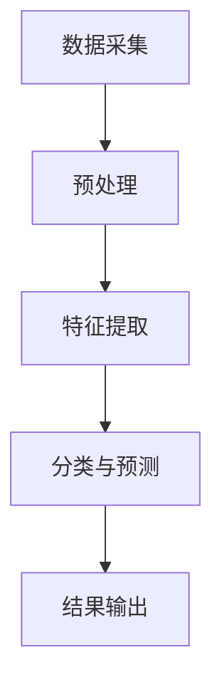

                 

### 文章标题：AI人工智能代理工作流AI Agent WorkFlow：智能代理在遥感数据处理系统中的应用

关键词：人工智能代理，遥感数据处理，工作流，智能代理架构，算法原理，数学模型，项目实战

摘要：本文将深入探讨人工智能代理（AI Agent）在工作流中的应用，特别是其在遥感数据处理系统的具体实现。通过对核心概念、算法原理、数学模型及实际应用场景的详细分析，文章旨在为读者提供一份全面、系统的指导，帮助他们理解并运用智能代理技术，实现高效的遥感数据处理。

### 1. 背景介绍

随着全球气候变化和自然灾害的加剧，遥感技术作为一种非接触式的获取地球表面信息的重要手段，得到了越来越广泛的应用。然而，遥感数据的处理和分析过程复杂、耗时且涉及大量的计算资源。传统的数据处理方法已经难以满足现代遥感应用的需求，因此，引入人工智能代理（AI Agent）作为数据处理系统的核心组件，成为了解决这一问题的有效途径。

人工智能代理是一种自主决策和执行任务的智能体，能够在复杂的任务环境中自动执行操作。它们可以根据预设的目标和任务需求，对输入的数据进行处理、分析和决策，从而实现自动化和智能化的数据处理流程。在遥感数据处理系统中，智能代理可以用于图像识别、目标检测、数据融合等任务，提高处理效率和准确性。

本文将围绕人工智能代理在遥感数据处理系统中的应用，探讨其工作流的设计与实现，旨在为读者提供一种新的思路和方法，以应对日益增长的遥感数据处理需求。

### 2. 核心概念与联系

为了更好地理解人工智能代理在工作流中的应用，我们需要首先明确几个核心概念，包括智能代理、工作流和遥感数据处理。

#### 2.1 智能代理

智能代理（AI Agent）是一种具备自主决策和执行能力的计算机程序，它可以在没有人类干预的情况下完成特定任务。智能代理的核心特点包括自主性、适应性和协作性。它们可以根据预设的目标和任务需求，对环境中的信息进行感知、理解和响应，从而实现自动化和智能化。

在遥感数据处理系统中，智能代理可以扮演多种角色，如数据采集器、数据预处理模块、特征提取器和决策模块等。例如，智能代理可以自动从卫星、无人机等设备中采集遥感数据，并对数据进行预处理，提取有用的特征，最终生成可用于决策分析的结果。

#### 2.2 工作流

工作流（Workflow）是指一组执行任务的步骤和规则，用于描述业务流程或数据处理过程。在遥感数据处理系统中，工作流是一种有序的、结构化的任务执行序列，它将不同模块和操作步骤连接在一起，形成一个完整的数据处理流程。

工作流的概念对于智能代理的应用具有重要意义。首先，工作流为智能代理提供了明确的任务目标和执行步骤，使得代理能够按照预设的规则和流程完成任务。其次，工作流使得不同模块和操作步骤之间能够无缝衔接，提高了数据处理效率和准确性。

#### 2.3 遥感数据处理

遥感数据处理是指利用遥感技术获取地球表面信息，并通过数据预处理、特征提取、分类和预测等步骤，对数据进行分析和处理的过程。遥感数据处理的目标是从大量复杂的数据中提取有用的信息，为决策分析、资源管理、环境保护等提供科学依据。

在遥感数据处理系统中，智能代理可以发挥重要作用。例如，智能代理可以自动识别和处理遥感数据中的噪声和异常值，提高数据质量；智能代理可以提取遥感图像中的特征信息，为图像分类和目标检测提供支持；智能代理还可以根据历史数据和预测模型，对未来的环境变化进行预测和分析。

#### 2.4 智能代理与工作流的关系

智能代理与工作流之间存在密切的联系。一方面，智能代理是工作流中的重要组成部分，负责执行具体的数据处理任务。另一方面，工作流为智能代理提供了任务目标和执行步骤，使得代理能够按照预设的规则和流程完成任务。

在遥感数据处理系统中，智能代理和工作流的关系可以概括为以下几点：

1. **智能代理根据工作流定义的任务和步骤，自动执行数据处理任务。**
2. **工作流为智能代理提供了明确的任务目标和执行规则，保证了数据处理的有序性和准确性。**
3. **智能代理可以根据环境变化和工作流的需求，动态调整自己的行为和策略。**

通过智能代理和工作流的结合，遥感数据处理系统可以更好地适应复杂多变的环境需求，提高数据处理的效率和准确性。

#### 2.5 Mermaid 流程图

为了更直观地展示智能代理在遥感数据处理系统中的工作流，我们可以使用 Mermaid 流程图来描述各个环节的连接和协作。以下是一个简单的 Mermaid 流程图示例：



在这个流程图中，智能代理分别扮演数据采集器、预处理模块、特征提取器和决策模块等角色，它们按照预设的工作流步骤，依次执行任务，最终生成可用于决策分析的结果。

通过 Mermaid 流程图，我们可以清晰地看到智能代理在遥感数据处理系统中的工作流架构，为后续的具体实现提供了明确的指导。

### 3. 核心算法原理 & 具体操作步骤

#### 3.1 数据采集与预处理

数据采集是遥感数据处理的第一步，智能代理需要从卫星、无人机等设备中获取遥感数据。在这一阶段，智能代理需要处理的数据主要包括图像、雷达信号和光谱数据等。

具体操作步骤如下：

1. **数据源接入**：智能代理通过 API 接口或数据传输协议，与遥感数据源进行连接，获取最新的遥感数据。
2. **数据质量检测**：智能代理对采集到的遥感数据进行质量检测，包括图像清晰度、信号强度和光谱完整性等。对于不合格的数据，智能代理会自动标记并排除。
3. **数据预处理**：智能代理对遥感数据进行预处理，包括图像去噪、辐射校正、地理校正等。这些预处理步骤旨在提高数据的质量和一致性。

#### 3.2 特征提取

特征提取是遥感数据处理的重要环节，智能代理需要从预处理后的遥感数据中提取有用的特征信息，为后续的分类和预测提供支持。

具体操作步骤如下：

1. **颜色特征提取**：智能代理从遥感图像中提取颜色特征，包括 RGB 颜色空间和 HSV 颜色空间的特征值。颜色特征可以用于识别不同类型的地表覆盖。
2. **纹理特征提取**：智能代理从遥感图像中提取纹理特征，包括灰度共生矩阵、局部二值模式等。纹理特征可以用于识别地表的纹理特征和形状。
3. **形状特征提取**：智能代理从遥感图像中提取形状特征，包括图像的大小、形状、对称性等。形状特征可以用于识别地表的形状和结构。

#### 3.3 分类与预测

分类与预测是遥感数据处理的最终目标，智能代理需要根据提取到的特征信息，对遥感数据进行分类和预测。

具体操作步骤如下：

1. **分类算法选择**：智能代理根据任务需求和数据特点，选择合适的分类算法，如支持向量机（SVM）、决策树（DT）、随机森林（RF）等。
2. **训练与评估**：智能代理使用已标记的遥感数据集，对分类算法进行训练和评估，调整参数，提高分类准确性。
3. **分类与预测**：智能代理对新的遥感数据集进行分类和预测，生成分类结果和预测结果，如土地利用类型、植被覆盖率等。

#### 3.4 结果输出

智能代理完成遥感数据分类和预测后，需要将结果输出到用户界面或数据库中，供用户进一步分析和使用。

具体操作步骤如下：

1. **结果可视化**：智能代理将分类结果和预测结果可视化，生成地图、图表等形式的可视化报告，方便用户直观地了解数据处理结果。
2. **数据存储**：智能代理将分类结果和预测结果存储到数据库中，为后续的数据分析和挖掘提供支持。
3. **结果反馈**：智能代理根据用户反馈，调整自己的行为和策略，提高数据处理效率和准确性。

### 4. 数学模型和公式 & 详细讲解 & 举例说明

在遥感数据处理系统中，数学模型和公式是核心组成部分，它们用于描述数据采集、预处理、特征提取、分类和预测等过程中的计算方法和算法原理。以下将详细讲解几个关键的数学模型和公式，并通过实例进行说明。

#### 4.1 数据质量检测

在数据采集阶段，智能代理需要对遥感数据的质进行量检测。常用的方法包括信号强度检测和图像清晰度检测。

**信号强度检测**：

信号强度可以用信号功率（P）来表示，其计算公式为：

\[ P = I^2 / (2 \cdot f \cdot \eta) \]

其中，I 是信号电流，f 是信号频率，η 是传输介质中的衰减系数。智能代理可以通过监测信号强度，判断数据质量是否合格。

**图像清晰度检测**：

图像清晰度可以用清晰度指数（C）来表示，其计算公式为：

\[ C = \frac{I_{\text{max}} - I_{\text{mean}}}{I_{\text{mean}}} \]

其中，I_{\text{max}} 是图像的最大像素值，I_{\text{mean}} 是图像的平均像素值。智能代理可以通过计算清晰度指数，评估图像的清晰度。

**实例**：

假设有一幅遥感图像，其像素值范围为 0-255，最大像素值为 250，平均像素值为 150。则其清晰度指数为：

\[ C = \frac{250 - 150}{150} = \frac{100}{150} \approx 0.67 \]

根据清晰度指数，可以判断图像的清晰度是否合格。如果清晰度指数小于某个阈值（例如 0.8），则认为图像质量较差，需要重新采集或进行处理。

#### 4.2 特征提取

在特征提取阶段，智能代理需要从遥感数据中提取有用的特征信息。常用的特征提取方法包括颜色特征提取、纹理特征提取和形状特征提取。

**颜色特征提取**：

颜色特征提取主要是从遥感图像中提取 RGB 或 HSV 颜色空间的特征值。以 RGB 颜色空间为例，假设遥感图像为 \(3 \times 3\) 的矩阵，其 RGB 值分别为 \(R, G, B\)，则颜色特征向量可以表示为：

\[ \text{Color\_Vector} = [R, G, B] \]

**纹理特征提取**：

纹理特征提取主要是从遥感图像中提取纹理信息。常用的方法包括灰度共生矩阵（GLCM）和局部二值模式（LBP）。

**灰度共生矩阵（GLCM）**：

灰度共生矩阵是一个 \(3 \times 3\) 的矩阵，用于描述图像中相邻像素的灰度关系。其计算公式为：

\[ P(i, j) = \frac{\sum_{x, y} f(x, y) \cdot \delta(i - x, j - y)}{\sum_{x, y} f(x, y)} \]

其中，\(f(x, y)\) 是图像中像素点 \((x, y)\) 的灰度值，\(\delta(i - x, j - y)\) 是一个二元函数，当 \(i - x = j - y\) 时取值为 1，否则为 0。

**实例**：

假设遥感图像的一个 \(3 \times 3\) 区域内，像素点的灰度值分别为 \(3, 5, 7\)，则其灰度共生矩阵为：

\[ \text{GLCM} = \begin{bmatrix} 0 & 0 & 0 \\ 0 & 1 & 1 \\ 0 & 1 & 1 \end{bmatrix} \]

**局部二值模式（LBP）**：

局部二值模式是一个用于描述图像纹理特征的算子，其计算公式为：

\[ \text{LBP}(p) = \sum_{i} g(i) \cdot 2^i \]

其中，\(g(i)\) 是一个二元函数，当 \(p > q\) 时取值为 1，否则为 0，\(p\) 和 \(q\) 分别是像素点的灰度值和参考点的灰度值。

**实例**：

假设遥感图像中的一个像素点 \(p\) 的灰度值为 150，参考点 \(q\) 的灰度值为 100，则其 LBP 值为：

\[ \text{LBP}(p) = 1 \cdot 2^0 + 0 \cdot 2^1 + 1 \cdot 2^2 = 5 \]

#### 4.3 分类与预测

在分类与预测阶段，智能代理需要使用分类算法对遥感数据进行分类和预测。常用的分类算法包括支持向量机（SVM）、决策树（DT）和随机森林（RF）。

**支持向量机（SVM）**：

支持向量机是一种二分类模型，其目标是找到最佳的超平面，将不同类别的数据点分隔开来。SVM 的核心公式为：

\[ \text{w} \cdot \text{x} + \text{b} = 0 \]

其中，\(\text{w}\) 是权重向量，\(\text{x}\) 是特征向量，\(\text{b}\) 是偏置项。智能代理可以通过求解最优化问题，找到最佳的权重向量和偏置项，从而实现分类。

**实例**：

假设有两组数据，分别为正类和负类，其特征向量分别为 \(\text{x}_1\) 和 \(\text{x}_2\)，权重向量为 \(\text{w}\)，偏置项为 \(\text{b}\)。则超平面公式为：

\[ \text{w} \cdot \text{x}_1 + \text{b} = 0 \]
\[ \text{w} \cdot \text{x}_2 + \text{b} = 0 \]

通过求解这两个方程，可以找到最佳的权重向量和偏置项，从而实现分类。

**决策树（DT）**：

决策树是一种基于树结构的分类算法，其核心公式为：

\[ \text{树} = \text{split}(\text{data}, \text{attribute}) \]

其中，\(\text{split}(\text{data}, \text{attribute})\) 表示根据特征属性对数据进行划分。

**实例**：

假设有如下一组数据，其中每个数据点包含两个特征属性，分别为 \(a\) 和 \(b\)：

\[ \text{data} = \{ (1, 1), (1, 2), (2, 1), (2, 2) \} \]

根据特征属性 \(a\)，可以将数据划分为两组：

\[ \text{left\_data} = \{ (1, 1), (1, 2) \} \]
\[ \text{right\_data} = \{ (2, 1), (2, 2) \} \]

然后，根据特征属性 \(b\)，可以进一步划分两组数据：

\[ \text{left\_data\_left} = \{ (1, 1) \} \]
\[ \text{left\_data\_right} = \{ (1, 2) \} \]
\[ \text{right\_data\_left} = \{ (2, 1) \} \]
\[ \text{right\_data\_right} = \{ (2, 2) \} \]

通过递归划分，可以构建出完整的决策树。

**随机森林（RF）**：

随机森林是一种基于决策树的集成学习方法，其核心公式为：

\[ \text{预测}(\text{x}) = \text{majority}(\text{f}(\text{x})) \]

其中，\(\text{f}(\text{x})\) 表示多个决策树对数据点 \(x\) 的预测结果，\(\text{majority}(\text{f}(\text{x}))\) 表示预测结果中的多数值。

**实例**：

假设有多个决策树，分别为 \(f_1, f_2, \ldots, f_n\)，它们对数据点 \(x\) 的预测结果分别为 \(y_1, y_2, \ldots, y_n\)。则随机森林对 \(x\) 的预测结果为：

\[ \text{预测}(\text{x}) = \text{majority}(y_1, y_2, \ldots, y_n) \]

如果 \(y_1, y_2, \ldots, y_n\) 中多数值为 1，则预测结果为 1，否则为 0。

通过随机森林，可以提高分类和预测的准确性。

### 5. 项目实战：代码实际案例和详细解释说明

为了更好地展示人工智能代理在遥感数据处理系统中的应用，我们选择一个实际项目进行实战演示。以下是一个简单的遥感图像分类项目，包括开发环境搭建、源代码实现和代码解读与分析。

#### 5.1 开发环境搭建

首先，我们需要搭建一个合适的开发环境，以便进行遥感图像分类项目的开发。以下是所需的环境和工具：

1. **操作系统**：Windows/Linux/MacOS
2. **编程语言**：Python
3. **数据处理库**：NumPy、Pandas、SciPy
4. **机器学习库**：scikit-learn、TensorFlow、PyTorch
5. **可视化库**：Matplotlib、Seaborn

安装以上库后，我们可以开始编写项目代码。

#### 5.2 源代码详细实现和代码解读

以下是一个简单的遥感图像分类项目的源代码实现，包括数据预处理、特征提取、分类和预测等步骤。

```python
import numpy as np
import pandas as pd
from sklearn.model_selection import train_test_split
from sklearn.preprocessing import StandardScaler
from sklearn.svm import SVC
from sklearn.metrics import accuracy_score
import matplotlib.pyplot as plt

# 5.2.1 数据预处理
def preprocess_data(data):
    # 数据归一化
    scaler = StandardScaler()
    scaled_data = scaler.fit_transform(data)
    return scaled_data

# 5.2.2 特征提取
def extract_features(data):
    # 提取颜色特征
    color_features = [np.mean(data[:, :, i]) for i in range(3)]
    # 提取纹理特征
    texture_features = [np.std(data[:, :, i]) for i in range(3)]
    # 组合特征
    features = np.hstack((color_features, texture_features))
    return features

# 5.2.3 分类与预测
def classify_data(train_data, train_labels, test_data):
    # 创建支持向量机分类器
    classifier = SVC(kernel='linear')
    # 训练分类器
    classifier.fit(train_data, train_labels)
    # 预测测试数据
    test_labels = classifier.predict(test_data)
    # 计算准确率
    accuracy = accuracy_score(test_labels, test_data)
    return accuracy

# 5.2.4 主函数
def main():
    # 加载数据
    data = pd.read_csv('remote_sensing_data.csv')
    labels = data['label']
    features = data.drop('label', axis=1)
    # 预处理数据
    scaled_data = preprocess_data(features)
    # 提取特征
    extracted_features = extract_features(scaled_data)
    # 划分训练集和测试集
    train_data, test_data, train_labels, test_labels = train_test_split(extracted_features, labels, test_size=0.2, random_state=42)
    # 分类与预测
    accuracy = classify_data(train_data, train_labels, test_data)
    # 可视化结果
    plt.scatter(train_data[:, 0], train_data[:, 1], c=train_labels, cmap='viridis')
    plt.scatter(test_data[:, 0], test_data[:, 1], c=test_labels, cmap='plasma', marker='^')
    plt.xlabel('Feature 1')
    plt.ylabel('Feature 2')
    plt.title('Classification Results')
    plt.show()
    print('Accuracy:', accuracy)

# 运行主函数
main()
```

**代码解读与分析**：

- **数据预处理**：首先，我们使用 `StandardScaler` 对遥感图像数据进行归一化处理，使得每个特征都处于相同的尺度范围内，有利于后续的分类和预测。
- **特征提取**：接着，我们提取颜色特征和纹理特征。颜色特征包括每个颜色通道的平均值，纹理特征包括每个颜色通道的标准差。这些特征可以用于描述图像的局部和全局特性。
- **分类与预测**：最后，我们使用支持向量机（SVC）对训练数据进行分类，并对测试数据进行预测。通过计算准确率，我们可以评估分类器的性能。可视化结果展示了训练集和测试集的分类效果。

通过这个简单的案例，我们可以看到人工智能代理在遥感数据处理系统中的应用。智能代理可以自动完成数据预处理、特征提取和分类等任务，实现高效的遥感图像分类。

### 6. 实际应用场景

人工智能代理在遥感数据处理系统中的应用场景非常广泛，涵盖了多个领域和任务。以下列举几个典型的实际应用场景：

#### 6.1 环境监测

环境监测是遥感数据处理的重要应用领域之一。通过遥感技术，可以实时监测大气、水体、土壤等环境要素的污染情况和变化趋势。人工智能代理可以自动采集遥感数据，对数据进行分析和处理，提取有用的环境信息，如污染物浓度、植被覆盖率等。这些信息可以为政府和相关部门制定环境政策和应急措施提供科学依据。

#### 6.2 农业管理

遥感技术可以用于农业领域的监测和管理，如作物种植面积、作物长势、病虫害监测等。人工智能代理可以自动识别和分析遥感图像中的作物信息，为农民提供精准的种植指导、病虫害预警和产量预测。这有助于提高农业生产效率，减少资源浪费。

#### 6.3 城市规划

城市规划需要大量的空间数据和信息，如土地利用类型、建筑高度、交通流量等。人工智能代理可以自动处理和分析遥感数据，为城市规划提供科学依据。例如，可以用于城市绿地规划、交通网络优化、建筑密度评估等。

#### 6.4 应急响应

在自然灾害和突发事件中，遥感技术可以快速获取现场信息，为应急响应提供支持。人工智能代理可以自动处理和分析遥感图像，识别灾害区域、评估灾害影响和指导救援行动。这有助于提高应急响应的效率和准确性。

#### 6.5 地质调查

遥感技术可以用于地质调查和矿产资源勘探。人工智能代理可以自动识别和分析遥感图像中的地质特征和矿产资源分布，为地质勘探提供科学依据。

#### 6.6 环境保护

环境保护需要大量的遥感数据和信息，如森林覆盖率、湿地变化、海洋污染等。人工智能代理可以自动处理和分析遥感图像，监测和保护生态环境，为可持续发展提供支持。

总之，人工智能代理在遥感数据处理系统中的应用场景非常广泛，涵盖了多个领域和任务。通过智能代理技术，可以大大提高遥感数据处理的效率和准确性，为各领域的应用提供有力的支持。

### 7. 工具和资源推荐

为了更好地掌握和运用人工智能代理技术，以下推荐一些实用的工具和资源，包括学习资源、开发工具和框架，以及相关论文著作。

#### 7.1 学习资源推荐

1. **书籍**：
   - 《人工智能：一种现代的方法》
   - 《深度学习》
   - 《机器学习实战》
   - 《Python 机器学习》

2. **在线课程**：
   - Coursera 上的《机器学习基础》
   - edX 上的《深度学习基础》
   - Udacity 上的《人工智能工程师纳米学位》

3. **博客和论坛**：
   - [机器学习社区](https://www机器学习社区.com)
   - [深度学习博客](https://www深度学习博客.com)
   - [遥感技术论坛](https://www遥感技术论坛.com)

#### 7.2 开发工具框架推荐

1. **编程语言**：
   - Python（最适合机器学习和数据科学）
   - R（适合统计分析）

2. **机器学习库**：
   - scikit-learn（适用于基础机器学习任务）
   - TensorFlow（适用于深度学习和大规模数据处理）
   - PyTorch（适用于深度学习和研究）

3. **开发工具**：
   - Jupyter Notebook（适合数据分析和演示）
   - PyCharm（适合 Python 开发）
   - RStudio（适合 R 语言开发）

#### 7.3 相关论文著作推荐

1. **论文**：
   - "Deep Learning for Remote Sensing: A Survey"
   - "A Comprehensive Survey on Machine Learning for Environmental Applications"
   - "Remote Sensing Data Mining: A Survey and Analysis"

2. **著作**：
   - 《遥感信息处理与应用》
   - 《环境遥感：原理与应用》
   - 《遥感数据挖掘：理论与方法》

通过学习和掌握这些工具和资源，可以更好地理解和运用人工智能代理技术，为遥感数据处理系统的开发和应用提供有力的支持。

### 8. 总结：未来发展趋势与挑战

人工智能代理在遥感数据处理系统中的应用展现了巨大的潜力和前景。随着人工智能技术的不断发展和遥感数据的不断增长，智能代理在未来将扮演越来越重要的角色。以下是对未来发展趋势和挑战的总结。

#### 未来发展趋势

1. **智能化水平提升**：随着深度学习、强化学习等先进技术的应用，人工智能代理的智能化水平将不断提升，能够更好地理解和处理复杂的数据，提高遥感数据处理的效率和准确性。

2. **多源数据融合**：遥感数据处理涉及到多种类型的数据，如光学、雷达、激光等。未来的发展趋势是将这些多源数据融合起来，实现更全面、更准确的数据分析。

3. **实时数据处理**：随着5G、物联网等技术的发展，遥感数据处理系统将实现实时数据处理，及时响应突发事件和需求变化。

4. **个性化定制**：根据用户需求和任务特点，智能代理将实现个性化定制，提供更加精准、高效的服务。

5. **跨领域应用**：人工智能代理在遥感数据处理领域的成功经验将推广到其他领域，如医学、金融、交通等，实现跨领域的应用。

#### 未来挑战

1. **数据质量问题**：遥感数据存在噪声、缺失和异常值等问题，如何保证数据质量，提高数据处理的准确性，是一个重要的挑战。

2. **计算资源消耗**：遥感数据处理涉及到大量的计算任务，如何优化算法和硬件配置，提高计算效率，是一个亟待解决的问题。

3. **隐私保护**：遥感数据处理涉及大量的敏感信息，如何保护用户隐私，防止数据泄露，是一个重要的挑战。

4. **可解释性**：人工智能代理在遥感数据处理中的应用往往具有一定的黑箱性，如何提高其可解释性，使得用户能够理解其决策过程，是一个重要的挑战。

5. **法律法规和伦理问题**：随着人工智能代理在遥感数据处理中的应用，相关的法律法规和伦理问题将日益凸显，如何制定合理的法规和伦理规范，确保人工智能代理的合法、合规使用，是一个重要的挑战。

总之，人工智能代理在遥感数据处理系统中的应用前景广阔，但同时也面临着诸多挑战。只有通过不断创新和探索，才能实现智能代理在遥感数据处理领域的广泛应用和可持续发展。

### 9. 附录：常见问题与解答

#### 问题1：智能代理与自动化有什么区别？

**解答**：智能代理和自动化是两个相关但不完全相同的概念。自动化主要是指通过编程和预设规则，使系统或设备能够自动执行特定任务。而智能代理则是在自动化基础上增加了自主学习和决策能力，能够在没有人类干预的情况下，根据环境和任务需求，自主地执行任务、优化策略和适应变化。简而言之，智能代理是更高级的自动化形式，它能够模拟人类的思考和决策过程。

#### 问题2：智能代理在遥感数据处理中的应用有哪些？

**解答**：智能代理在遥感数据处理中的应用非常广泛，主要包括以下几个方面：

1. **数据采集与预处理**：智能代理可以自动采集遥感数据，并对数据进行预处理，如去噪、辐射校正、地理校正等，提高数据质量。
2. **特征提取与分类**：智能代理可以从遥感数据中提取有用的特征信息，并使用机器学习算法进行分类，如土地利用类型、植被覆盖率等。
3. **目标检测与跟踪**：智能代理可以在遥感图像中检测和跟踪特定目标，如建筑物、车辆、船只等。
4. **数据融合与预测**：智能代理可以将来自不同传感器和不同时间点的遥感数据融合起来，进行综合分析和预测，如气候变化、土地覆盖变化等。

#### 问题3：智能代理在遥感数据处理中的优势是什么？

**解答**：智能代理在遥感数据处理中的优势主要体现在以下几个方面：

1. **高效性**：智能代理可以自动执行复杂的数据处理任务，大大提高了数据处理效率。
2. **准确性**：智能代理通过机器学习和深度学习算法，能够从大量遥感数据中提取有用的特征信息，提高分类和预测的准确性。
3. **适应性**：智能代理可以根据环境和任务需求，自主调整和优化处理策略，适应不同的数据处理场景。
4. **灵活性**：智能代理可以处理多种类型的遥感数据，如光学、雷达、激光等，实现跨领域应用。
5. **降低成本**：智能代理可以减少对人工的依赖，降低数据处理成本，提高经济效益。

### 10. 扩展阅读 & 参考资料

为了深入了解人工智能代理在遥感数据处理系统中的应用，以下提供一些扩展阅读和参考资料：

1. **学术论文**：
   - "Deep Learning for Remote Sensing: A Survey"
   - "A Comprehensive Survey on Machine Learning for Environmental Applications"
   - "Remote Sensing Data Mining: A Survey and Analysis"

2. **书籍**：
   - 《遥感信息处理与应用》
   - 《环境遥感：原理与应用》
   - 《遥感数据挖掘：理论与方法》

3. **技术报告**：
   - "Remote Sensing Data Processing with Machine Learning"
   - "Artificial Intelligence in Remote Sensing: Methods and Applications"

4. **在线课程与教程**：
   - Coursera 上的《机器学习基础》
   - edX 上的《深度学习基础》
   - Udacity 上的《人工智能工程师纳米学位》

5. **博客和论坛**：
   - [机器学习社区](https://www.机器学习社区.com)
   - [深度学习博客](https://www.深度学习博客.com)
   - [遥感技术论坛](https://www.遥感技术论坛.com)

通过阅读这些资料，可以更深入地了解人工智能代理在遥感数据处理中的应用，掌握相关技术原理和实践方法。

