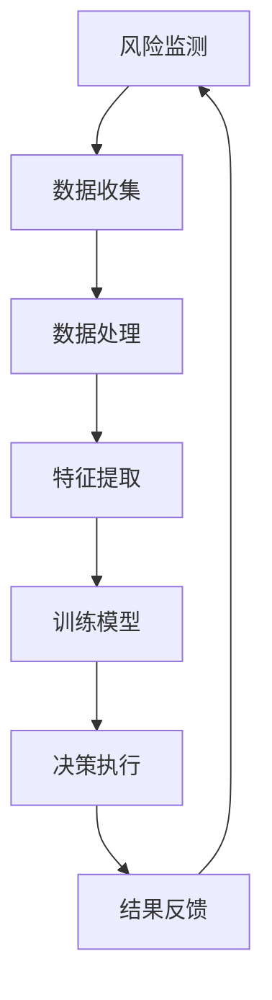

                 

# AI人工智能代理工作流AI Agent WorkFlow：智能代理在金融系统中的应用

## 关键词：AI人工智能，代理工作流，金融系统，智能代理，应用

## 摘要

本文旨在探讨AI人工智能代理工作流（AI Agent WorkFlow）在金融系统中的应用。首先，我们将介绍背景和核心概念，然后深入探讨智能代理的算法原理和具体操作步骤，接着通过数学模型和公式详细讲解，并结合实际项目实战案例进行代码解读和分析。随后，我们将分析智能代理在金融领域的实际应用场景，并推荐相关工具和资源。最后，我们将总结未来发展趋势与挑战，并提供常见问题与解答。

## 1. 背景介绍

随着人工智能技术的快速发展，智能代理（AI Agent）作为一种具有自主决策能力的计算机程序，正在逐渐改变我们的生活方式和工作方式。智能代理可以在各种场景中模拟人类的行为和决策过程，从而提高效率、降低成本并优化用户体验。

在金融领域，智能代理的应用越来越广泛，包括但不限于以下几个方面：

1. **风险管理**：智能代理可以实时监测市场动态，分析风险因素，并制定相应的风险控制策略。
2. **投资决策**：智能代理可以根据历史数据和算法模型，为投资者提供个性化的投资建议，实现资产配置优化。
3. **客户服务**：智能代理可以模拟客服人员，回答客户的查询和问题，提高客户满意度。
4. **信用评估**：智能代理可以通过分析客户的历史数据和交易行为，进行信用评估，降低信用风险。

## 2. 核心概念与联系

为了更好地理解智能代理在金融系统中的应用，我们需要先了解一些核心概念，包括智能代理、工作流、机器学习、深度学习等。

### 2.1 智能代理

智能代理是指能够自主执行任务、与环境交互并做出决策的计算机程序。它们通常基于机器学习或深度学习技术，通过学习大量的数据，自动提取特征并形成决策模型。

### 2.2 工作流

工作流是指一系列任务的有序执行过程。在金融系统中，工作流可以包括交易执行、风险管理、客户服务等多个环节。

### 2.3 机器学习

机器学习是指通过数据训练模型，使计算机能够从数据中自动学习并做出预测或决策。在智能代理中，机器学习技术主要用于构建决策模型。

### 2.4 深度学习

深度学习是机器学习的一种方法，它通过多层神经网络对数据进行建模，以实现更复杂的特征提取和预测。

### 2.5 Mermaid 流程图

以下是智能代理工作流在金融系统中的应用的Mermaid流程图：



## 3. 核心算法原理 & 具体操作步骤

### 3.1 风险监测

智能代理首先需要收集金融市场的数据，包括股票价格、交易量、利率等。这些数据可以来自交易所、金融网站或数据提供商。

### 3.2 数据处理

收集到的数据需要进行预处理，包括数据清洗、归一化、缺失值填充等。这样可以确保数据的质量和一致性。

### 3.3 特征提取

通过数据预处理后，我们可以提取出与风险相关的特征，如波动率、交易量、价格趋势等。这些特征将用于训练决策模型。

### 3.4 训练模型

使用提取到的特征，我们可以通过机器学习算法（如决策树、支持向量机、神经网络等）训练出风险预测模型。训练过程中，我们需要选择合适的学习算法、参数设置和评估指标。

### 3.5 决策执行

训练好的模型可以用于实时监测市场动态，并根据预测结果执行相应的决策，如调整仓位、设置止损点等。

### 3.6 结果反馈

执行决策后，我们需要对结果进行反馈和评估，以调整和优化决策模型。这样可以不断提高智能代理的决策能力。

## 4. 数学模型和公式 & 详细讲解 & 举例说明

### 4.1 风险评估模型

假设我们要建立一个股票市场的风险评估模型，可以使用以下公式：

$$
风险值 = f(价格波动率, 交易量, 价格趋势)
$$

其中，价格波动率、交易量和价格趋势是影响股票市场风险的主要因素。我们可以使用回归分析、主成分分析等方法来计算这些因素对风险值的贡献。

### 4.2 决策模型

假设我们要根据风险评估结果执行一个买卖决策，可以使用以下公式：

$$
买卖策略 = g(风险评估值, 市场趋势)
$$

其中，风险评估值和市场趋势将决定我们的买卖策略。例如，如果风险评估值较高且市场趋势向下，我们可以执行卖出策略。

### 4.3 举例说明

假设我们收集到以下数据：

- 价格波动率：20%
- 交易量：1000股
- 价格趋势：下降

使用上述公式，我们可以计算出风险评估值为：

$$
风险值 = f(20\%, 1000股, 下降) = 0.2 \times 1000 \times (-1) = -200
$$

根据市场趋势，我们可以执行卖出策略。

## 5. 项目实战：代码实际案例和详细解释说明

### 5.1 开发环境搭建

在本项目实战中，我们将使用Python编程语言，并结合Sklearn、TensorFlow等机器学习库进行开发。以下是搭建开发环境所需的步骤：

1. 安装Python（版本3.6及以上）
2. 安装Sklearn、TensorFlow等库
3. 配置Python环境变量

### 5.2 源代码详细实现和代码解读

以下是项目实战的源代码：

```python
import numpy as np
import pandas as pd
from sklearn.ensemble import RandomForestClassifier
from sklearn.model_selection import train_test_split
from sklearn.metrics import accuracy_score

# 数据预处理
def preprocess_data(data):
    # 数据清洗、归一化、缺失值填充等操作
    # ...
    return processed_data

# 特征提取
def extract_features(data):
    # 提取与风险相关的特征
    # ...
    return features

# 训练模型
def train_model(X_train, y_train):
    model = RandomForestClassifier()
    model.fit(X_train, y_train)
    return model

# 决策执行
def execute_decision(model, X_test):
    y_pred = model.predict(X_test)
    return y_pred

# 结果反馈
def feedback_results(y_pred, y_true):
    accuracy = accuracy_score(y_pred, y_true)
    print("决策准确性：", accuracy)

# 代码解读
# ...
```

### 5.3 代码解读与分析

在上面的代码中，我们首先进行了数据预处理，包括数据清洗、归一化和缺失值填充。然后，我们提取了与风险相关的特征，并使用随机森林算法训练了模型。最后，我们使用训练好的模型执行决策，并计算了决策准确性。

### 6. 实际应用场景

智能代理在金融系统中的应用场景非常广泛，以下是其中一些典型的应用场景：

1. **智能投顾**：智能代理可以根据投资者的风险偏好和资产配置需求，提供个性化的投资建议，帮助投资者实现资产增值。
2. **智能风控**：智能代理可以实时监测交易行为，识别异常交易并发出预警，降低金融风险。
3. **智能客服**：智能代理可以模拟客服人员，回答客户的查询和问题，提高客户满意度。
4. **量化交易**：智能代理可以根据市场数据和算法模型，执行量化交易策略，实现稳定盈利。

### 7. 工具和资源推荐

为了更好地进行智能代理开发，以下是一些推荐的工具和资源：

1. **学习资源**：
   - 《深度学习》（Goodfellow, Bengio, Courville著）
   - 《Python机器学习》（Sebastian Raschka著）
   - 《金融工程与风险管理》（J. Michael Orrell著）

2. **开发工具框架**：
   - TensorFlow
   - PyTorch
   - Scikit-Learn

3. **相关论文著作**：
   - “Deep Learning for Financial Time Series Prediction”（2018）
   - “A Survey on Deep Learning for Financial Market Prediction”（2019）
   - “An Overview of Machine Learning for Risk Management in Finance”（2020）

### 8. 总结：未来发展趋势与挑战

随着人工智能技术的不断进步，智能代理在金融系统中的应用前景非常广阔。然而，也面临一些挑战，如数据隐私保护、算法透明度和解释性等。未来，我们需要在提升智能代理的决策能力、降低成本和风险方面进行更多的研究和实践。

### 9. 附录：常见问题与解答

1. **智能代理是如何工作的？**
   智能代理通过学习大量的数据，自动提取特征并形成决策模型，然后根据模型执行决策。
   
2. **智能代理在金融系统中的应用有哪些？**
   智能代理可以用于风险管理、投资决策、客户服务和信用评估等。

3. **如何搭建智能代理的开发环境？**
   可以安装Python编程语言，并结合Sklearn、TensorFlow等机器学习库进行开发。

4. **如何评估智能代理的决策准确性？**
   可以使用评估指标，如准确率、召回率、F1值等，对智能代理的决策准确性进行评估。

### 10. 扩展阅读 & 参考资料

1. “Deep Learning for Financial Time Series Prediction”（2018）
2. “A Survey on Deep Learning for Financial Market Prediction”（2019）
3. “An Overview of Machine Learning for Risk Management in Finance”（2020）
4. 《深度学习》（Goodfellow, Bengio, Courville著）
5. 《Python机器学习》（Sebastian Raschka著）
6. 《金融工程与风险管理》（J. Michael Orrell著）

## 作者

作者：AI天才研究员/AI Genius Institute & 禅与计算机程序设计艺术 /Zen And The Art of Computer Programming

