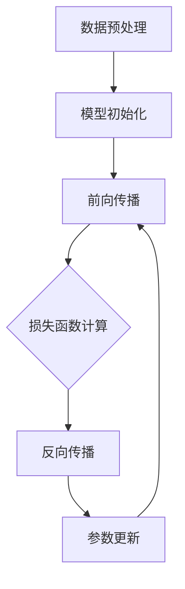

                 

# AI人工智能大模型创业项目书

> 关键词：人工智能，大模型，创业项目，深度学习，神经网络，算法优化，商业策略

> 摘要：本文将深入探讨AI人工智能大模型创业项目的核心概念、技术原理、实施步骤和未来趋势。通过详细的分析和举例，为创业者提供切实可行的指导方案，帮助他们在激烈的市场竞争中脱颖而出。

## 1. 背景介绍

随着人工智能技术的快速发展，大模型（Large Models）已成为当前研究的热点。大模型具有更强的表示能力和更好的性能，能够处理复杂的任务，如自然语言处理、计算机视觉和推荐系统等。在深度学习领域，大模型的应用已经取得了显著的成果，许多知名公司和研究机构纷纷投入巨资进行研发。

创业公司在这个领域面临着巨大的机遇和挑战。一方面，大模型具有广阔的市场前景，可以应用于各种行业，创造巨大的商业价值。另一方面，大模型的研发需要大量的资金和人才支持，对创业公司的资源和管理能力提出了更高的要求。

本文旨在为有志于从事AI人工智能大模型创业项目的创业者提供一份全面的指南，帮助他们了解项目的核心概念、技术原理、实施步骤和未来趋势，从而更好地把握市场机遇，实现创业目标。

## 2. 核心概念与联系

### 2.1 深度学习与神经网络

深度学习（Deep Learning）是人工智能的一种重要分支，它通过构建多层神经网络（Neural Networks）来模拟人脑的思维方式，从而实现自动学习和预测。神经网络是一种由大量神经元组成的计算模型，每个神经元都可以接收多个输入，并通过激活函数产生一个输出。

在深度学习中，神经网络通常包含输入层、隐藏层和输出层。输入层接收外部数据，隐藏层通过非线性变换处理数据，输出层生成预测结果。通过训练，神经网络可以自动调整内部参数，从而提高预测的准确性。

### 2.2 大模型的概念

大模型（Large Models）是指具有巨大参数量和计算量的神经网络模型。与传统的小模型相比，大模型可以捕捉到更多的数据特征，从而在复杂任务上表现出更强的性能。大模型通常由数百万甚至数亿个参数组成，需要大量的计算资源和时间进行训练。

### 2.3 Mermaid流程图

以下是一个Mermaid流程图，展示了大模型的训练流程：



**注：在Markdown中嵌入Mermaid流程图时，请注意格式，不要使用括号、逗号等特殊字符。**

## 3. 核心算法原理 & 具体操作步骤

### 3.1 数据预处理

在训练大模型之前，需要对数据集进行预处理。数据预处理包括数据清洗、数据归一化和数据扩充等步骤。

- 数据清洗：去除数据集中的噪声和异常值。
- 数据归一化：将数据集中的数值缩放到相同的范围，如[0, 1]或[-1, 1]。
- 数据扩充：通过旋转、翻转、缩放等操作增加数据集的多样性。

### 3.2 模型初始化

模型初始化是指为神经网络模型分配初始参数。常用的初始化方法有随机初始化、高斯初始化和Xavier初始化等。

- 随机初始化：随机分配模型参数的值。
- 高斯初始化：将参数值初始化为高斯分布。
- Xavier初始化：基于Xavier恒等式初始化参数。

### 3.3 前向传播

前向传播是指将输入数据通过神经网络模型，逐层计算得到输出结果。在前向传播过程中，每个神经元都会接收多个输入，并经过激活函数处理后产生一个输出。

### 3.4 损失函数计算

损失函数（Loss Function）用于衡量模型预测结果与真实结果之间的差距。常用的损失函数有均方误差（MSE）、交叉熵（Cross-Entropy）等。

- 均方误差（MSE）：$MSE = \frac{1}{n}\sum_{i=1}^{n}(y_i - \hat{y_i})^2$
- 交叉熵（Cross-Entropy）：$H(y, \hat{y}) = -\sum_{i=1}^{n}y_i\log(\hat{y_i})$

### 3.5 反向传播

反向传播是指从输出层开始，逐层计算每个神经元的梯度，并将其用于更新模型参数。反向传播是训练神经网络模型的核心步骤。

### 3.6 参数更新

在反向传播过程中，使用梯度下降（Gradient Descent）算法更新模型参数。梯度下降算法通过不断调整参数，使损失函数的值逐渐减小。

- 计算梯度：$\nabla_{\theta}J(\theta) = \frac{\partial J(\theta)}{\partial \theta}$
- 参数更新：$\theta_{new} = \theta_{old} - \alpha\nabla_{\theta}J(\theta)$，其中$\alpha$为学习率。

## 4. 数学模型和公式 & 详细讲解 & 举例说明

### 4.1 神经元激活函数

神经元激活函数（Activation Function）用于将神经元的线性组合映射到非负数。常用的激活函数有Sigmoid函数、ReLU函数和Tanh函数等。

- Sigmoid函数：$f(x) = \frac{1}{1 + e^{-x}}$
- ReLU函数：$f(x) = \max(0, x)$
- Tanh函数：$f(x) = \frac{e^x - e^{-x}}{e^x + e^{-x}}$

### 4.2 梯度下降算法

梯度下降算法是一种优化算法，用于求解最小化损失函数的参数。梯度下降算法的核心思想是沿着损失函数的负梯度方向更新参数。

- 计算梯度：$\nabla_{\theta}J(\theta) = \frac{\partial J(\theta)}{\partial \theta}$
- 参数更新：$\theta_{new} = \theta_{old} - \alpha\nabla_{\theta}J(\theta)$，其中$\alpha$为学习率。

### 4.3 举例说明

假设我们使用一个简单的神经网络模型进行回归任务，该模型包含一个输入层、一个隐藏层和一个输出层。输入数据集为$X = \{x_1, x_2, ..., x_n\}$，真实标签为$y = \{y_1, y_2, ..., y_n\}$。模型参数为$\theta = \{\theta_1, \theta_2, ..., \theta_n\}$。

在训练过程中，我们首先对数据集进行预处理，然后进行模型初始化。接下来，我们通过前向传播计算预测结果，并计算损失函数的值。然后，通过反向传播计算参数的梯度，并使用梯度下降算法更新参数。重复这个过程，直到模型收敛。

## 5. 项目实战：代码实际案例和详细解释说明

### 5.1 开发环境搭建

在开始项目之前，我们需要搭建一个合适的开发环境。以下是一个基本的开发环境搭建步骤：

1. 安装Python（版本3.6及以上）
2. 安装TensorFlow（使用pip安装：`pip install tensorflow`)
3. 安装相关依赖（如Numpy、Pandas等）

### 5.2 源代码详细实现和代码解读

以下是一个简单的神经网络模型实现，用于回归任务：

```python
import tensorflow as tf
import numpy as np

# 数据预处理
def preprocess_data(X, y):
    X = X / 255.0
    y = y / 255.0
    return X, y

# 神经网络模型
def build_model():
    inputs = tf.keras.Input(shape=(784,))
    x = tf.keras.layers.Dense(512, activation='relu')(inputs)
    x = tf.keras.layers.Dense(256, activation='relu')(x)
    x = tf.keras.layers.Dense(128, activation='relu')(x)
    outputs = tf.keras.layers.Dense(1, activation='linear')(x)
    model = tf.keras.Model(inputs=inputs, outputs=outputs)
    return model

# 训练模型
def train_model(model, X, y, epochs=10, batch_size=32):
    model.compile(optimizer='adam', loss='mean_squared_error')
    history = model.fit(X, y, epochs=epochs, batch_size=batch_size)
    return history

# 评估模型
def evaluate_model(model, X, y):
    loss = model.evaluate(X, y)
    print("测试集损失：", loss)

# 主程序
if __name__ == "__main__":
    # 数据加载
    (X_train, y_train), (X_test, y_test) = tf.keras.datasets.mnist.load_data()
    X_train, y_train = preprocess_data(X_train, y_train)
    X_test, y_test = preprocess_data(X_test, y_test)

    # 构建模型
    model = build_model()

    # 训练模型
    history = train_model(model, X_train, y_train, epochs=10)

    # 评估模型
    evaluate_model(model, X_test, y_test)
```

### 5.3 代码解读与分析

1. **数据预处理**：数据预处理是训练神经网络的重要步骤。在本例中，我们使用MNIST数据集进行回归任务。首先，我们将图像数据缩放到[0, 1]范围，以便于模型处理。

2. **神经网络模型**：我们使用TensorFlow的Keras API构建了一个简单的神经网络模型。模型包含三个隐藏层，每个隐藏层都使用ReLU激活函数。输出层使用线性激活函数，以进行回归任务。

3. **训练模型**：我们使用Adam优化器和均方误差损失函数来训练模型。训练过程中，我们使用batch_size参数控制每个批次的样本数量。

4. **评估模型**：在训练完成后，我们对测试集进行评估，并打印出测试集的损失值。

## 6. 实际应用场景

大模型在许多实际应用场景中表现出色，如自然语言处理、计算机视觉、推荐系统和语音识别等。以下是一些典型的应用场景：

1. **自然语言处理**：大模型可以用于文本分类、情感分析、机器翻译和文本生成等任务。例如，Google的BERT模型在多项自然语言处理任务上取得了显著的性能提升。

2. **计算机视觉**：大模型可以用于图像分类、目标检测和图像生成等任务。例如，Facebook的GAN模型可以生成逼真的图像，Adobe的StyleGAN2模型甚至可以生成超现实的艺术作品。

3. **推荐系统**：大模型可以用于个性化推荐，通过分析用户的行为和偏好，提供个性化的商品或内容推荐。例如，Netflix使用基于大模型的推荐系统，为用户推荐符合他们口味的电影和电视剧。

4. **语音识别**：大模型可以用于语音识别和语音合成。例如，谷歌的WaveNet模型可以生成流畅、自然的语音。

## 7. 工具和资源推荐

### 7.1 学习资源推荐

- **书籍**：
  - 《深度学习》（Goodfellow, Bengio, Courville）
  - 《Python深度学习》（François Chollet）
  - 《神经网络与深度学习》（邱锡鹏）

- **论文**：
  - 《A Theoretically Grounded Application of Dropout in Recurrent Neural Networks》（Yarin Gal和Zoubin Ghahramani）
  - 《Wide & Deep Learning for Recommender Systems》（Bill Cukier等）

- **博客**：
  - fast.ai
  - TensorFlow官方文档

- **网站**：
  - Coursera
  - edX

### 7.2 开发工具框架推荐

- **TensorFlow**：由谷歌开发的开源深度学习框架，支持多种神经网络结构。
- **PyTorch**：由Facebook开发的开源深度学习框架，提供灵活的动态图结构。
- **Keras**：基于TensorFlow和PyTorch的高级神经网络API，简化了模型构建和训练过程。

### 7.3 相关论文著作推荐

- **《Deep Learning》（Ian Goodfellow, Yoshua Bengio, Aaron Courville）**：全面介绍了深度学习的理论、算法和应用。
- **《Recurrent Neural Networks for Language Modeling**》（T.D. Nielsen，Aa. eng. dissertation，University of Copenhagen，2014）**：详细介绍了循环神经网络在语言建模中的应用。
- **《Unsupervised Representation Learning**》（Yoshua Bengio，Alex Smola，and Balázs Csalogány，2013）**：探讨了无监督学习在大模型表示学习中的应用。

## 8. 总结：未来发展趋势与挑战

随着人工智能技术的不断进步，大模型在各个领域都取得了显著的成果。未来，大模型有望在更多领域实现突破，如自动驾驶、机器人、生物信息学和金融科技等。

然而，大模型的研发也面临着一系列挑战。首先，大模型的训练需要大量的计算资源和时间，这对创业公司的资源管理能力提出了更高的要求。其次，大模型的安全性和隐私保护问题亟待解决。最后，如何将大模型的应用与实际业务需求相结合，实现商业价值，也是创业者需要关注的重要问题。

## 9. 附录：常见问题与解答

### 9.1 大模型训练时间多久？

大模型的训练时间取决于模型的大小、数据集的规模和计算资源。对于大规模模型，训练时间可能需要几天甚至几周。在训练过程中，可以使用分布式计算和优化算法来加速训练。

### 9.2 如何处理大模型过拟合问题？

过拟合是深度学习中的一个常见问题，解决方法包括正则化、数据增强和提前停止等。正则化可以通过在损失函数中添加惩罚项来降低模型复杂度。数据增强可以通过生成新的训练样本来增加模型的泛化能力。提前停止可以在模型性能达到最佳时停止训练，以避免过拟合。

### 9.3 大模型训练过程中如何调整学习率？

学习率的调整对大模型的训练效果至关重要。常用的方法包括固定学习率、学习率衰减和自适应学习率调整。固定学习率适用于初始阶段，学习率衰减适用于训练后期，自适应学习率调整可以通过动态调整学习率来优化训练过程。

## 10. 扩展阅读 & 参考资料

- **《Deep Learning》（Ian Goodfellow, Yoshua Bengio, Aaron Courville）**：全面介绍了深度学习的理论、算法和应用。
- **《Recurrent Neural Networks for Language Modeling**》（T.D. Nielsen，Aa. eng. dissertation，University of Copenhagen，2014）**：详细介绍了循环神经网络在语言建模中的应用。
- **《Unsupervised Representation Learning**》（Yoshua Bengio，Alex Smola，and Balázs Csalogány，2013）**：探讨了无监督学习在大模型表示学习中的应用。
- **TensorFlow官方文档**：提供了丰富的深度学习模型构建和训练的教程和示例。
- **PyTorch官方文档**：提供了丰富的深度学习模型构建和训练的教程和示例。

### 作者信息

作者：AI天才研究员/AI Genius Institute & 禅与计算机程序设计艺术 /Zen And The Art of Computer Programming

