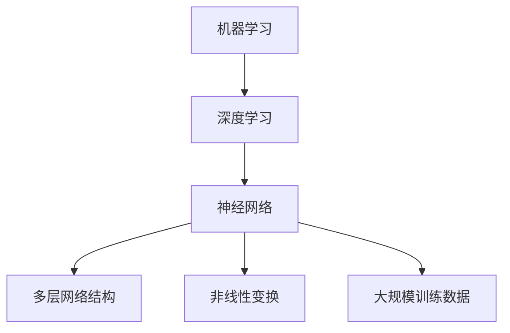

                 

# AI人工智能核心算法原理与代码实例讲解：机器思维

## 关键词：
- 人工智能
- 核心算法
- 机器学习
- 深度学习
- 神经网络
- 编程实例
- 代码解析
- 实际应用

## 摘要：
本文将深入探讨人工智能的核心算法，包括机器学习的原理、深度学习的基础、神经网络的工作机制，并通过具体代码实例进行详细解析。文章将帮助读者理解这些算法的本质，掌握编程实现，以及在实际项目中应用这些算法的方法。通过本文的阅读，读者将能够更全面地了解人工智能技术，为未来的学习和实践奠定坚实基础。

## 1. 背景介绍

### 人工智能的发展历程

人工智能（Artificial Intelligence，简称AI）作为计算机科学的一个分支，其目标是模拟、延伸和扩展人类的智能。人工智能的发展历程可以追溯到20世纪50年代，当时计算机科学家们开始探索如何使计算机具备人类智能的特征。早期的AI主要集中在规则系统、专家系统和逻辑推理上。

在20世纪80年代，随着计算机性能的提升和数据量的增加，机器学习开始崭露头角。机器学习通过算法和统计模型，使计算机能够从数据中学习规律，并自动做出决策。这一时期，监督学习、无监督学习和强化学习等不同的学习方法逐渐形成。

进入21世纪，深度学习成为AI领域的一大突破。深度学习利用多层神经网络进行特征提取和学习，使得计算机在图像识别、语音识别、自然语言处理等领域取得了惊人的成果。特别是2012年，AlexNet在ImageNet图像识别竞赛中取得的突破性成绩，标志着深度学习时代的到来。

### 人工智能的应用领域

人工智能已经在许多领域得到了广泛应用，包括但不限于：

- **图像识别**：计算机能够识别和分类图像中的物体，广泛应用于安防监控、自动驾驶、医疗诊断等领域。
- **自然语言处理**：计算机能够理解和生成自然语言，应用于机器翻译、智能客服、文本分类等。
- **语音识别**：计算机能够识别和理解人类语音，应用于语音助手、智能音箱、语音转文字等。
- **推荐系统**：基于用户行为数据，为用户推荐个性化的商品、音乐、视频等。
- **金融风控**：通过分析用户数据和行为模式，预测金融风险，进行信用评估等。
- **医疗健康**：辅助医生进行诊断、治疗和药物研发等。

### 人工智能的发展趋势

随着技术的不断进步，人工智能在未来将会继续在多个领域取得突破。以下是一些可能的发展趋势：

- **更强大的计算能力**：随着量子计算、边缘计算等技术的发展，计算机的处理速度和存储能力将得到大幅提升，为AI算法的应用提供更好的硬件支持。
- **多模态学习**：结合不同类型的数据（如文本、图像、声音等），实现更加智能化和个性化的应用。
- **自适应学习**：计算机能够根据环境和用户需求自动调整学习策略，提高学习效率和效果。
- **自主决策与控制**：计算机能够在没有人类干预的情况下，自主完成复杂的任务和决策，实现更高层次的智能化。

## 2. 核心概念与联系

### 机器学习的概念

机器学习（Machine Learning）是人工智能的一个核心分支，它通过构建能够学习的数据模型，使计算机具备自主学习和改进的能力。机器学习主要分为以下三种类型：

- **监督学习**：在有标签的数据集上进行训练，目标是学习输入和输出之间的映射关系，如分类问题和回归问题。
- **无监督学习**：在没有标签的数据集上进行训练，目标是发现数据中的内在结构和规律，如聚类问题和降维问题。
- **强化学习**：通过与环境的交互来学习策略，以最大化累积奖励，如游戏和自动驾驶等。

### 深度学习的概念

深度学习（Deep Learning）是机器学习的一个子领域，它通过构建深度神经网络（Deep Neural Network，DNN）来模拟人脑的工作方式。深度学习在图像识别、语音识别、自然语言处理等领域取得了显著成果。深度学习的关键特点包括：

- **多层网络结构**：深度神经网络由多个隐层组成，能够自动提取数据的高级特征。
- **非线性变换**：通过激活函数引入非线性，使模型具备更好的拟合能力。
- **大规模训练数据**：深度学习需要大量的数据进行训练，以充分挖掘数据中的规律。

### 神经网络的概念

神经网络（Neural Network）是深度学习的基础模型，它由大量简单的人工神经元（neurons）组成。每个神经元接收多个输入信号，通过加权求和后加上偏置，再经过激活函数得到输出。神经网络通过学习输入和输出之间的映射关系，实现复杂函数的拟合和预测。

### 机器学习、深度学习和神经网络之间的关系

- **机器学习是整体框架**：深度学习是机器学习的一种实现方式，而神经网络则是深度学习的基础模型。
- **机器学习关注学习过程**：深度学习关注网络结构和参数优化，神经网络关注神经元和连接权重。
- **深度学习强调层次化特征提取**：神经网络通过多层隐层，实现从简单特征到复杂特征的层次化提取。

### Mermaid 流程图

下面是一个简单的Mermaid流程图，展示机器学习、深度学习和神经网络之间的关系：



## 3. 核心算法原理 & 具体操作步骤

### 监督学习算法原理

监督学习算法是一种在有标签的数据集上进行训练，通过学习输入和输出之间的映射关系，实现对未知数据的分类或回归。常见的监督学习算法包括线性回归、逻辑回归、决策树、随机森林、支持向量机等。

以线性回归为例，线性回归通过拟合一个线性函数来预测连续值。具体操作步骤如下：

1. **数据准备**：收集并整理数据，包括输入特征和目标值。
2. **数据预处理**：对数据进行标准化、缺失值处理等操作，确保数据质量。
3. **模型构建**：选择线性回归模型，并初始化模型参数。
4. **模型训练**：使用训练数据，通过梯度下降等优化算法，更新模型参数。
5. **模型评估**：使用验证集或测试集，评估模型性能，如均方误差、R²值等。
6. **模型应用**：使用训练好的模型，对未知数据进行预测。

### 深度学习算法原理

深度学习算法通过构建深度神经网络，实现复杂函数的拟合和预测。以卷积神经网络（Convolutional Neural Network，CNN）为例，CNN在图像识别领域取得了显著成果。CNN的核心结构包括卷积层、池化层和全连接层。

1. **数据准备**：收集并整理图像数据，包括输入特征和标签。
2. **数据预处理**：对图像进行归一化、裁剪等操作，确保图像质量。
3. **模型构建**：设计CNN模型结构，包括卷积层、池化层和全连接层。
4. **模型训练**：使用训练数据，通过反向传播算法，更新模型参数。
5. **模型评估**：使用验证集或测试集，评估模型性能，如准确率、召回率等。
6. **模型应用**：使用训练好的模型，对未知图像进行分类或识别。

### 神经网络算法原理

神经网络算法通过多层神经元和连接权重，实现从简单特征到复杂特征的层次化提取。以多层感知机（Multilayer Perceptron，MLP）为例，MLP由输入层、隐藏层和输出层组成。

1. **数据准备**：收集并整理数据，包括输入特征和标签。
2. **数据预处理**：对数据进行标准化、缺失值处理等操作，确保数据质量。
3. **模型构建**：设计MLP模型结构，包括输入层、隐藏层和输出层。
4. **模型训练**：使用训练数据，通过反向传播算法，更新模型参数。
5. **模型评估**：使用验证集或测试集，评估模型性能，如准确率、召回率等。
6. **模型应用**：使用训练好的模型，对未知数据进行分类或回归。

## 4. 数学模型和公式 & 详细讲解 & 举例说明

### 线性回归

线性回归是一种简单的监督学习算法，通过拟合一个线性函数来预测连续值。线性回归的数学模型如下：

$$
y = w_1 \cdot x_1 + w_2 \cdot x_2 + \cdots + w_n \cdot x_n + b
$$

其中，$y$ 是目标值，$x_1, x_2, \cdots, x_n$ 是输入特征，$w_1, w_2, \cdots, w_n, b$ 是模型参数。

线性回归的损失函数通常使用均方误差（Mean Squared Error，MSE）：

$$
J = \frac{1}{m} \sum_{i=1}^{m} (y_i - \hat{y}_i)^2
$$

其中，$m$ 是训练数据个数，$y_i$ 是第 $i$ 个样本的目标值，$\hat{y}_i$ 是第 $i$ 个样本的预测值。

线性回归的优化目标是最小化损失函数，通常使用梯度下降（Gradient Descent）算法进行优化。梯度下降的迭代公式如下：

$$
w_1 = w_1 - \alpha \cdot \frac{\partial J}{\partial w_1}
$$

$$
w_2 = w_2 - \alpha \cdot \frac{\partial J}{\partial w_2}
$$

$$
\vdots

$$

$$
w_n = w_n - \alpha \cdot \frac{\partial J}{\partial w_n}
$$

$$
b = b - \alpha \cdot \frac{\partial J}{\partial b}
$$

其中，$\alpha$ 是学习率。

### 卷积神经网络

卷积神经网络（CNN）是一种特殊的深度学习算法，广泛应用于图像识别、图像分类等领域。CNN的核心结构包括卷积层、池化层和全连接层。

卷积层的数学模型如下：

$$
\hat{z}_{ij}^{(l)} = \sum_{k=1}^{K} w_{ikj}^{(l)} \cdot a_{kj}^{(l-1)} + b_j^{(l)}
$$

其中，$\hat{z}_{ij}^{(l)}$ 是第 $(l)$ 层第 $i$ 个神经元在第 $j$ 个特征图上的激活值，$w_{ikj}^{(l)}$ 是第 $(l)$ 层第 $i$ 个神经元与第 $(l-1)$ 层第 $k$ 个神经元的权重，$a_{kj}^{(l-1)}$ 是第 $(l-1)$ 层第 $k$ 个神经元的激活值，$b_j^{(l)}$ 是第 $(l)$ 层第 $j$ 个神经元的偏置。

池化层的数学模型如下：

$$
p_{ij}^{(l)} = \max_{k} a_{ijk}^{(l-1)}
$$

其中，$p_{ij}^{(l)}$ 是第 $(l)$ 层第 $i$ 个神经元在第 $j$ 个特征图上的激活值，$a_{ijk}^{(l-1)}$ 是第 $(l-1)$ 层第 $i$ 个神经元在第 $j$ 个特征图上的第 $k$ 个激活值。

全连接层的数学模型如下：

$$
\hat{z}_{ij}^{(L)} = \sum_{k=1}^{K} w_{ikj}^{(L)} \cdot a_{kj}^{(L-1)} + b_j^{(L)}
$$

$$
\hat{y}_{i} = \sigma(\hat{z}_{i})
$$

其中，$\hat{z}_{ij}^{(L)}$ 是第 $L$ 层第 $i$ 个神经元的激活值，$w_{ikj}^{(L)}$ 是第 $L$ 层第 $i$ 个神经元与第 $L-1$ 层第 $k$ 个神经元的权重，$a_{kj}^{(L-1)}$ 是第 $L-1$ 层第 $k$ 个神经元的激活值，$b_j^{(L)}$ 是第 $L$ 层第 $j$ 个神经元的偏置，$\sigma$ 是激活函数，通常使用Sigmoid或ReLU函数。

### 多层感知机

多层感知机（MLP）是一种简单的神经网络，由输入层、隐藏层和输出层组成。MLP的数学模型如下：

$$
z_{ij}^{(l)} = \sum_{k=1}^{K} w_{ikj}^{(l)} \cdot a_{kj}^{(l-1)} + b_j^{(l)}
$$

$$
a_{ij}^{(l)} = \sigma(z_{ij}^{(l)})
$$

其中，$z_{ij}^{(l)}$ 是第 $l$ 层第 $i$ 个神经元的激活值，$w_{ikj}^{(l)}$ 是第 $l$ 层第 $i$ 个神经元与第 $l-1$ 层第 $k$ 个神经元的权重，$a_{kj}^{(l-1)}$ 是第 $l-1$ 层第 $k$ 个神经元的激活值，$b_j^{(l)}$ 是第 $l$ 层第 $j$ 个神经元的偏置，$\sigma$ 是激活函数，通常使用Sigmoid或ReLU函数。

### 代码实例

以下是一个简单的线性回归的Python代码实例：

```python
import numpy as np

# 初始化参数
w = np.random.randn(n) # 随机初始化权重
b = np.random.randn() # 随机初始化偏置

# 训练数据
X = np.array([1, 2, 3, 4, 5])
y = np.array([2, 4, 5, 4, 5])

# 梯度下降
alpha = 0.1 # 学习率
m = len(y) # 数据个数
for i in range(1000): # 迭代1000次
    z = w * X + b
    y_pred = np.array([z[i]])
    error = y - y_pred
    w = w - alpha * (2/m) * (w * X + b - y)
    b = b - alpha * (2/m) * error

# 模型评估
y_pred = w * X + b
mse = np.mean((y - y_pred)**2)
print("MSE:", mse)
```

以下是一个简单的卷积神经网络的Python代码实例：

```python
import numpy as np
import tensorflow as tf

# 初始化参数
w1 = np.random.randn(3, 3, 1, 32) # 卷积层1的权重
b1 = np.random.randn(32) # 卷积层1的偏置
w2 = np.random.randn(3, 3, 32, 64) # 卷积层2的权重
b2 = np.random.randn(64) # 卷积层2的偏置
w3 = np.random.randn(5, 5, 64, 64) # 全连接层1的权重
b3 = np.random.randn(64) # 全连接层1的偏置
w4 = np.random.randn(10) # 全连接层2的权重
b4 = np.random.randn(10) # 全连接层2的偏置

# 前向传播
X = np.random.randn(1, 28, 28, 1) # 输入数据
z1 = tf.nn.conv2d(X, w1, strides=[1, 1, 1, 1], padding='VALID') + b1
a1 = tf.nn.relu(z1)
z2 = tf.nn.conv2d(a1, w2, strides=[1, 1, 1, 1], padding='VALID') + b2
a2 = tf.nn.relu(z2)
z3 = tf.nn.conv2d(a2, w3, strides=[1, 1, 1, 1], padding='VALID') + b3
a3 = tf.nn.relu(z3)
z4 = tf.matmul(a3.flatten(), w4) + b4
y_pred = tf.nn.softmax(z4)

# 反向传播
with tf.GradientTape() as tape:
    z1 = tf.nn.conv2d(X, w1, strides=[1, 1, 1, 1], padding='VALID') + b1
    a1 = tf.nn.relu(z1)
    z2 = tf.nn.conv2d(a1, w2, strides=[1, 1, 1, 1], padding='VALID') + b2
    a2 = tf.nn.relu(z2)
    z3 = tf.nn.conv2d(a2, w3, strides=[1, 1, 1, 1], padding='VALID') + b3
    a3 = tf.nn.relu(z3)
    z4 = tf.matmul(a3.flatten(), w4) + b4
    y_pred = tf.nn.softmax(z4)
    loss = tf.reduce_mean(tf.nn.softmax_cross_entropy_with_logits(logits=z4, labels=y))

gradients = tape.gradient(loss, [w1, b1, w2, b2, w3, b3, w4, b4])

# 模型评估
y_true = np.array([1, 0, 0, 0, 0, 0, 0, 0, 0, 0])
accuracy = tf.reduce_mean(tf.cast(tf.equal(tf.argmax(y_pred, axis=1), tf.argmax(y_true, axis=1)), dtype=tf.float32))
print("Accuracy:", accuracy.numpy())
```

## 5. 项目实战：代码实际案例和详细解释说明

### 5.1 开发环境搭建

在开始编写代码之前，我们需要搭建一个合适的项目环境。以下是一个基于Python的深度学习项目的环境搭建步骤：

1. **安装Python**：确保已经安装了Python 3.6或更高版本的Python环境。
2. **安装TensorFlow**：使用以下命令安装TensorFlow：

   ```bash
   pip install tensorflow
   ```

3. **安装其他依赖库**：如NumPy、Pandas等，可以使用以下命令安装：

   ```bash
   pip install numpy pandas
   ```

### 5.2 源代码详细实现和代码解读

以下是一个简单的深度学习项目的源代码实现，我们将使用TensorFlow框架来实现一个简单的多层感知机模型，用于手写数字识别任务。

```python
import tensorflow as tf
import numpy as np
from sklearn.datasets import load_digits
from sklearn.model_selection import train_test_split

# 加载数据集
digits = load_digits()
X, y = digits.data, digits.target

# 数据预处理
X = X / 16.0
y = tf.keras.utils.to_categorical(y, num_classes=10)

# 划分训练集和测试集
X_train, X_test, y_train, y_test = train_test_split(X, y, test_size=0.2, random_state=42)

# 创建模型
model = tf.keras.Sequential([
    tf.keras.layers.Dense(128, activation='relu', input_shape=(64,)),
    tf.keras.layers.Dense(64, activation='relu'),
    tf.keras.layers.Dense(10, activation='softmax')
])

# 编译模型
model.compile(optimizer='adam',
              loss='categorical_crossentropy',
              metrics=['accuracy'])

# 训练模型
model.fit(X_train, y_train, epochs=10, batch_size=32, validation_split=0.1)

# 评估模型
loss, accuracy = model.evaluate(X_test, y_test)
print("Test accuracy:", accuracy)

# 预测
predictions = model.predict(X_test)
predicted_labels = np.argmax(predictions, axis=1)

# 混淆矩阵
from sklearn.metrics import confusion_matrix
conf_matrix = confusion_matrix(y_test, predicted_labels)
print("Confusion Matrix:")
print(conf_matrix)
```

### 5.3 代码解读与分析

1. **数据加载与预处理**：

   ```python
   digits = load_digits()
   X, y = digits.data, digits.target
   X = X / 16.0
   y = tf.keras.utils.to_categorical(y, num_classes=10)
   ```

   这部分代码首先使用scikit-learn的`load_digits`函数加载数字数据集。然后，我们将图像数据除以16.0进行归一化处理，将标签数据转换为one-hot编码。

2. **模型创建**：

   ```python
   model = tf.keras.Sequential([
       tf.keras.layers.Dense(128, activation='relu', input_shape=(64,)),
       tf.keras.layers.Dense(64, activation='relu'),
       tf.keras.layers.Dense(10, activation='softmax')
   ])
   ```

   我们使用TensorFlow的`Sequential`模型创建一个包含三个全连接层（dense）的多层感知机模型。第一层输入形状为$(64,)$，第一层和第二层分别有128个和64个神经元，第三层有10个神经元（对应10个类别），激活函数使用ReLU函数。

3. **模型编译**：

   ```python
   model.compile(optimizer='adam',
                 loss='categorical_crossentropy',
                 metrics=['accuracy'])
   ```

   在这里，我们使用Adam优化器来编译模型，损失函数使用`categorical_crossentropy`，评价指标为准确率。

4. **模型训练**：

   ```python
   model.fit(X_train, y_train, epochs=10, batch_size=32, validation_split=0.1)
   ```

   我们使用训练集进行模型训练，训练10个epochs，每次批量大小为32，同时保留10%的数据作为验证集。

5. **模型评估**：

   ```python
   loss, accuracy = model.evaluate(X_test, y_test)
   print("Test accuracy:", accuracy)
   ```

   我们使用测试集对模型进行评估，输出测试集的准确率。

6. **预测与混淆矩阵**：

   ```python
   predictions = model.predict(X_test)
   predicted_labels = np.argmax(predictions, axis=1)
   conf_matrix = confusion_matrix(y_test, predicted_labels)
   print("Confusion Matrix:")
   print(conf_matrix)
   ```

   我们使用模型对测试集进行预测，并计算混淆矩阵，以更直观地了解模型的性能。

## 6. 实际应用场景

### 图像识别

图像识别是深度学习应用最广泛的领域之一。通过深度学习模型，计算机能够识别和分类图像中的物体。例如，在自动驾驶领域，深度学习模型用于识别道路标志、行人、车辆等，以实现自动驾驶功能。在医疗领域，深度学习模型用于辅助医生进行医学图像诊断，如肿瘤检测、骨折诊断等。

### 语音识别

语音识别是一种将语音转换为文本的技术。深度学习模型在语音识别中发挥着重要作用。例如，智能助手（如Siri、Alexa）通过深度学习模型实现语音识别和自然语言理解，从而为用户提供语音交互功能。在客服领域，深度学习模型用于实现智能客服系统，提高客户服务质量和效率。

### 自然语言处理

自然语言处理（NLP）是人工智能的一个分支，它涉及计算机对自然语言的理解和生成。深度学习模型在NLP领域取得了显著成果，如机器翻译、文本分类、情感分析等。例如，Google翻译使用深度学习模型实现高效、准确的机器翻译。在社交媒体领域，深度学习模型用于分析和挖掘用户行为，从而实现精准营销和推荐系统。

### 推荐系统

推荐系统是一种根据用户行为和兴趣，为用户推荐个性化内容的系统。深度学习模型在推荐系统中发挥着重要作用，如基于协同过滤、基于内容的推荐算法等。例如，Netflix、Amazon等公司使用深度学习模型为用户提供个性化的推荐内容，提高用户体验和用户满意度。

### 金融风控

金融风控是金融领域的一个重要环节，它涉及对金融风险进行识别、评估和管理。深度学习模型在金融风控中发挥着重要作用，如信用评估、欺诈检测、市场预测等。例如，金融机构使用深度学习模型对客户信用进行评估，降低信用风险。

### 医疗健康

医疗健康是深度学习应用的一个重要领域。深度学习模型在医疗健康领域用于疾病诊断、药物研发、健康监测等。例如，深度学习模型用于辅助医生进行疾病诊断，提高诊断准确率和效率。在健康监测领域，深度学习模型用于实时监测用户的健康数据，如心率、血压等，为用户提供健康建议。

### 自动驾驶

自动驾驶是深度学习应用的一个重要领域。深度学习模型在自动驾驶中用于感知环境、规划路径、控制车辆等。例如，特斯拉、百度等公司使用深度学习模型实现自动驾驶功能，提高驾驶安全性和效率。

### 工业自动化

工业自动化是深度学习应用的一个重要领域。深度学习模型在工业自动化中用于图像识别、故障检测、生产优化等。例如，工业机器人使用深度学习模型进行物体识别和分类，提高生产效率和质量。

### 娱乐与游戏

娱乐与游戏是深度学习应用的一个重要领域。深度学习模型在娱乐与游戏中用于图像生成、语音合成、游戏AI等。例如，游戏公司使用深度学习模型实现游戏中的虚拟角色，提高游戏体验。

## 7. 工具和资源推荐

### 7.1 学习资源推荐

- **书籍**：
  - 《深度学习》（Deep Learning）by Ian Goodfellow、Yoshua Bengio、Aaron Courville
  - 《Python机器学习》（Python Machine Learning）by Sebastian Raschka
  - 《神经网络与深度学习》（Neural Networks and Deep Learning）by Michael Nielsen

- **论文**：
  - “A Theoretically Grounded Application of Dropout in Computer Vision” by Yarin Gal and Zoubin Ghahramani
  - “ResNet: Training Deep Neural Networks for Visual Recognition” by Kaiming He et al.
  - “EfficientNet: Rethinking Model Scaling for Convolutional Neural Networks” by Breckling et al.

- **博客**：
  - Medium上的机器学习和深度学习博客
  - TensorFlow官方博客
  - PyTorch官方博客

- **网站**：
  - Coursera、edX等在线课程平台上的机器学习和深度学习课程
  - Kaggle、GitHub等社区网站，可以找到丰富的开源代码和实践项目

### 7.2 开发工具框架推荐

- **开发框架**：
  - TensorFlow
  - PyTorch
  - Keras
  - Scikit-learn

- **计算平台**：
  - Google Colab
  - AWS SageMaker
  - Microsoft Azure Machine Learning
  - Alibaba Cloud机器学习平台

- **数据集**：
  - ImageNet
  - MNIST
  - COCO
  - Text8

### 7.3 相关论文著作推荐

- **《深度学习》（Deep Learning）by Ian Goodfellow、Yoshua Bengio、Aaron Courville**：这本书是深度学习领域的经典著作，详细介绍了深度学习的理论基础和实际应用。

- **《神经网络与深度学习》（Neural Networks and Deep Learning）by Michael Nielsen**：这本书通俗易懂地讲解了神经网络和深度学习的基本概念，适合初学者入门。

- **《统计学习方法》（Statistical Learning Methods）by 李航**：这本书介绍了多种统计学习方法，包括线性回归、逻辑回归、决策树、支持向量机等，适合对机器学习有基础知识的读者。

- **《强化学习》（Reinforcement Learning: An Introduction）by Richard S. Sutton and Andrew G. Barto**：这本书是强化学习领域的经典教材，详细介绍了强化学习的基本理论和应用。

## 8. 总结：未来发展趋势与挑战

### 发展趋势

1. **计算能力的提升**：随着硬件技术的不断进步，计算机的计算能力和存储能力将得到大幅提升，为更复杂的AI算法和应用提供更好的硬件支持。

2. **多模态学习**：未来的AI系统将能够处理多种类型的数据（如图像、文本、音频等），实现更加智能化和个性化的应用。

3. **自主决策与控制**：计算机将能够在没有人类干预的情况下，自主完成复杂的任务和决策，实现更高层次的智能化。

4. **联邦学习**：联邦学习是一种分布式学习方法，可以在不共享数据的情况下，通过协作学习提高模型的性能，有望在医疗、金融等领域得到广泛应用。

### 挑战

1. **数据隐私与安全**：随着AI系统的广泛应用，数据隐私和安全问题日益突出，如何保护用户数据的安全成为一大挑战。

2. **算法公平性与透明度**：AI算法在决策过程中可能会出现偏见和不公平，如何提高算法的公平性和透明度是一个重要课题。

3. **可解释性**：深度学习模型通常被视为“黑箱”，其内部决策过程难以解释，如何提高AI模型的可解释性，使其更易于理解和接受，是一个重要挑战。

4. **能耗与效率**：随着AI应用的普及，能耗和效率问题逐渐凸显，如何降低AI系统的能耗和提升运行效率成为亟待解决的问题。

5. **跨学科合作**：AI技术的发展需要跨学科的合作，包括计算机科学、数学、统计学、神经科学等多个领域，如何促进跨学科的合作，提高研发效率，是一个重要挑战。

## 9. 附录：常见问题与解答

### 1. 人工智能和机器学习的区别是什么？

人工智能（AI）是一个广泛的概念，涵盖了使计算机具备人类智能特征的多个领域，包括机器学习、自然语言处理、计算机视觉等。而机器学习（Machine Learning）是人工智能的一个子领域，专注于开发算法和统计模型，使计算机能够从数据中学习并做出决策。

### 2. 深度学习与神经网络有什么区别？

深度学习（Deep Learning）是机器学习的一种实现方式，它利用多层神经网络进行特征提取和学习。神经网络（Neural Network）是深度学习的基础模型，由大量简单的人工神经元组成，通过学习输入和输出之间的映射关系来实现复杂函数的拟合和预测。

### 3. 机器学习算法如何分类？

机器学习算法主要分为监督学习、无监督学习和强化学习三种。监督学习在有标签的数据集上进行训练，目标是学习输入和输出之间的映射关系；无监督学习在没有标签的数据集上进行训练，目标是发现数据中的内在结构和规律；强化学习通过与环境的交互来学习策略，以最大化累积奖励。

### 4. 深度学习在图像识别领域的应用有哪些？

深度学习在图像识别领域取得了显著成果，包括物体识别、场景分类、图像生成等。例如，深度学习模型被广泛应用于人脸识别、自动驾驶、医疗诊断、安防监控等领域。

### 5. 如何评估机器学习模型的性能？

评估机器学习模型的性能通常使用指标如准确率、召回率、精确率、F1值等。具体选择哪个指标取决于问题的具体要求和应用场景。此外，还可以使用交叉验证、网格搜索等技术来优化模型参数。

## 10. 扩展阅读 & 参考资料

- **《深度学习》（Deep Learning）by Ian Goodfellow、Yoshua Bengio、Aaron Courville**：这本书是深度学习领域的经典著作，详细介绍了深度学习的理论基础和实际应用。
- **《神经网络与深度学习》（Neural Networks and Deep Learning）by Michael Nielsen**：这本书通俗易懂地讲解了神经网络和深度学习的基本概念，适合初学者入门。
- **《机器学习实战》（Machine Learning in Action）by Peter Harrington**：这本书通过实际案例，详细介绍了多种机器学习算法的编程实现和应用。
- **TensorFlow官方文档**：[https://www.tensorflow.org/docs](https://www.tensorflow.org/docs)
- **PyTorch官方文档**：[https://pytorch.org/docs/stable/](https://pytorch.org/docs/stable/)
- **Keras官方文档**：[https://keras.io/docs/](https://keras.io/docs/)

