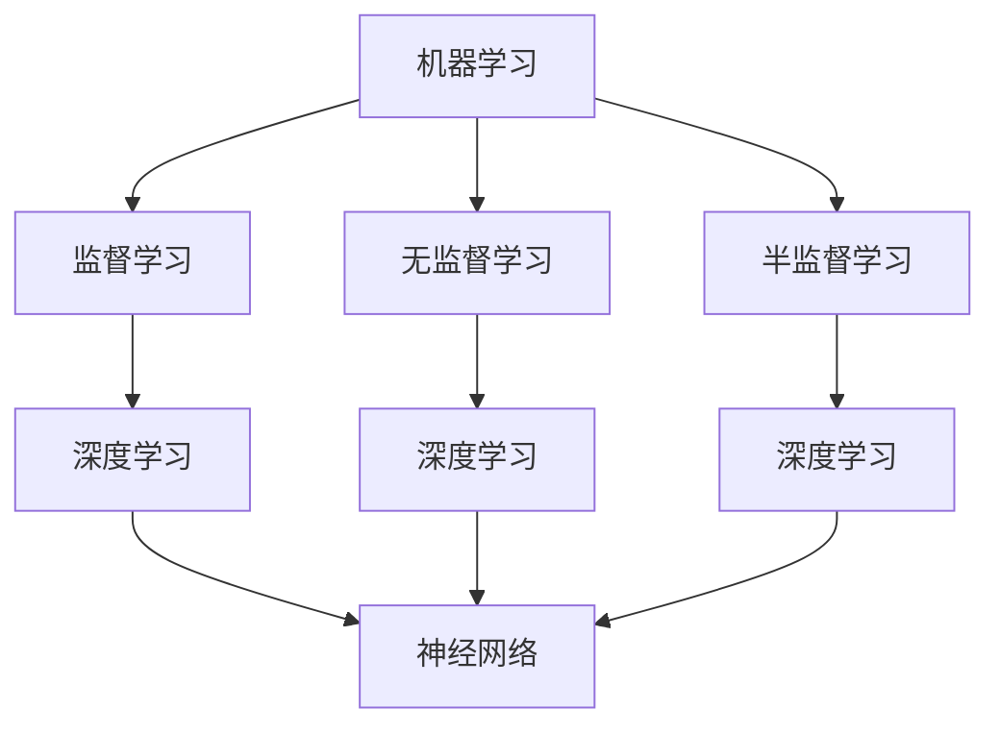

                 

# AI人工智能核心算法原理与代码实例讲解：概述

> 关键词：AI核心算法、深度学习、神经网络、机器学习、人工智能应用

> 摘要：本文将深入探讨人工智能领域的核心算法原理，通过实际代码实例，详细讲解从基本概念到高级应用的全过程，旨在帮助读者更好地理解和掌握AI算法。

## 1. 背景介绍

随着互联网和大数据技术的迅猛发展，人工智能（AI）已成为当今科技领域的热点。AI不仅改变了传统行业，还催生了众多新兴领域。在这场技术革命中，核心算法是推动AI进步的关键。

核心算法包括机器学习、深度学习和神经网络等。这些算法基于数学和统计学原理，通过训练模型来模拟人类智能，实现图像识别、语音识别、自然语言处理等多种应用。

本文将重点讨论以下核心算法：

- 机器学习：一种通过数据训练模型，使其能够进行预测和决策的技术。
- 深度学习：基于多层神经网络的机器学习算法，能够在复杂任务中表现出色。
- 神经网络：模仿人脑结构和功能的人工神经网络，是深度学习的基础。

## 2. 核心概念与联系

为了更好地理解AI核心算法，我们首先需要了解一些基本概念。

### 2.1 机器学习

机器学习是一种让计算机通过数据学习规律和模式的技术。其基本流程包括数据收集、数据预处理、模型训练和模型评估。机器学习算法可分为监督学习、无监督学习和半监督学习。

### 2.2 深度学习

深度学习是机器学习的一个分支，基于多层神经网络进行训练。深度学习在图像识别、语音识别和自然语言处理等领域取得了显著的成果。

### 2.3 神经网络

神经网络是模仿人脑结构和功能的人工神经网络，由大量神经元（节点）组成。神经元之间通过权重连接，通过激活函数实现信息传递和处理。

### 2.4 Mermaid流程图

为了更直观地展示核心概念与联系，我们使用Mermaid流程图进行描述。



## 3. 核心算法原理 & 具体操作步骤

### 3.1 机器学习原理

机器学习算法的核心是模型训练。模型训练包括数据预处理、特征提取、模型选择、模型训练和模型评估。

#### 3.1.1 数据预处理

数据预处理包括数据清洗、数据归一化和数据划分。数据清洗去除无效数据和异常数据；数据归一化将数据缩放到同一尺度；数据划分分为训练集、验证集和测试集。

#### 3.1.2 特征提取

特征提取是从原始数据中提取出有代表性的特征。特征提取有助于提高模型性能。

#### 3.1.3 模型选择

模型选择根据任务类型和数据特点选择合适的算法。常见的机器学习算法有线性回归、逻辑回归、决策树、支持向量机等。

#### 3.1.4 模型训练

模型训练通过迭代优化模型参数，使其在训练数据上达到最小化损失函数。

#### 3.1.5 模型评估

模型评估通过验证集和测试集评估模型性能。常见的评估指标有准确率、召回率、F1值等。

### 3.2 深度学习原理

深度学习基于多层神经网络，通过反向传播算法进行训练。

#### 3.2.1 前向传播

前向传播将输入数据通过网络传递，计算每个神经元的输出。

#### 3.2.2 反向传播

反向传播计算网络损失，通过梯度下降算法更新网络参数。

#### 3.2.3 激活函数

激活函数用于引入非线性特性，使网络能够学习复杂函数。

### 3.3 神经网络原理

神经网络由输入层、隐藏层和输出层组成。输入层接收外部输入，隐藏层进行信息处理，输出层产生最终输出。

#### 3.3.1 输入层

输入层由多个输入神经元组成，接收外部输入数据。

#### 3.3.2 隐藏层

隐藏层由多个隐藏神经元组成，通过激活函数实现信息传递和处理。

#### 3.3.3 输出层

输出层产生最终输出，用于分类、回归等任务。

## 4. 数学模型和公式 & 详细讲解 & 举例说明

### 4.1 数学模型

机器学习、深度学习和神经网络的核心是数学模型。以下是一些常见数学模型和公式：

#### 4.1.1 线性回归

$$y = wx + b$$

其中，$y$是输出，$w$是权重，$x$是输入，$b$是偏置。

#### 4.1.2 逻辑回归

$$P(y=1) = \frac{1}{1 + e^{-wx + b}}$$

其中，$P(y=1)$是输出为1的概率，$w$是权重，$x$是输入，$b$是偏置。

#### 4.1.3 激活函数

$$f(x) = \frac{1}{1 + e^{-x}}$$

其中，$f(x)$是输出。

#### 4.1.4 反向传播

$$\Delta w = -\alpha \frac{\partial L}{\partial w}$$

$$\Delta b = -\alpha \frac{\partial L}{\partial b}$$

其中，$\Delta w$是权重更新，$\Delta b$是偏置更新，$L$是损失函数，$\alpha$是学习率。

### 4.2 举例说明

#### 4.2.1 线性回归实例

假设我们要预测房价，输入特征是房屋面积（$x$），输出目标值是房价（$y$）。我们使用线性回归模型进行预测。

数据如下：

| 面积（平方米） | 价格（万元） |
| -------------- | ------------ |
| 100            | 200          |
| 150            | 250          |
| 200            | 300          |

首先，我们计算权重和偏置：

$$y = wx + b$$

$$200 = 100w + b$$

$$250 = 150w + b$$

通过解方程组，我们得到：

$$w = 1.5$$

$$b = 50$$

然后，我们使用线性回归模型进行预测：

$$y = 1.5x + 50$$

例如，预测面积为150平方米的房价：

$$y = 1.5 \times 150 + 50 = 250$$

#### 4.2.2 深度学习实例

假设我们要使用深度学习模型进行图像分类，输入特征是图像数据，输出目标是类别标签。

数据如下：

| 图像数据      | 类别标签 |
| ------------- | -------- |
| 图像1         | 猫       |
| 图像2         | 狗       |
| 图像3         | 猫       |

首先，我们定义神经网络结构：

- 输入层：784个神经元（28x28像素）
- 隐藏层：256个神经元
- 输出层：3个神经元（类别标签）

然后，我们使用反向传播算法训练模型：

1. 前向传播：将图像数据输入神经网络，计算每个神经元的输出。
2. 反向传播：计算损失函数，更新网络参数（权重和偏置）。
3. 迭代训练：重复前向传播和反向传播，直到模型收敛。

最后，我们使用训练好的模型进行图像分类：

将图像输入神经网络，输出类别标签。例如，输入图像1，输出类别标签为猫。

## 5. 项目实战：代码实际案例和详细解释说明

### 5.1 开发环境搭建

为了更好地理解AI核心算法，我们需要搭建一个合适的开发环境。以下是一个基于Python的简单环境搭建步骤：

1. 安装Python：从[Python官网](https://www.python.org/)下载并安装Python。
2. 安装Jupyter Notebook：在命令行中运行以下命令：
   ```shell
   pip install notebook
   ```
3. 启动Jupyter Notebook：在命令行中运行以下命令：
   ```shell
   jupyter notebook
   ```

### 5.2 源代码详细实现和代码解读

以下是一个基于线性回归的简单例子，用于预测房价。

```python
import numpy as np
import matplotlib.pyplot as plt

# 数据预处理
def preprocess_data(data):
    X = data[:, 0].reshape(-1, 1)
    y = data[:, 1].reshape(-1, 1)
    X_mean = np.mean(X)
    y_mean = np.mean(y)
    X_std = np.std(X)
    y_std = np.std(y)
    X = (X - X_mean) / X_std
    y = (y - y_mean) / y_std
    return X, y

# 线性回归模型
class LinearRegression:
    def __init__(self, learning_rate=0.01, num_iterations=1000):
        self.learning_rate = learning_rate
        self.num_iterations = num_iterations
        self.w = None
        self.b = None

    def fit(self, X, y):
        self.w = np.zeros((X.shape[1], 1))
        self.b = np.zeros((1, 1))
        for i in range(self.num_iterations):
            y_pred = self.predict(X)
            dw = (2/X.shape[1]) * np.dot(X.T, (y_pred - y))
            db = (2/X.shape[1]) * np.sum(y_pred - y)
            self.w -= self.learning_rate * dw
            self.b -= self.learning_rate * db

    def predict(self, X):
        return np.dot(X, self.w) + self.b

# 模型评估
def evaluate_model(model, X, y):
    y_pred = model.predict(X)
    mse = np.mean((y_pred - y) ** 2)
    return mse

# 数据集
data = np.array([[100, 200], [150, 250], [200, 300]])

# 数据预处理
X, y = preprocess_data(data)

# 模型训练
model = LinearRegression(learning_rate=0.01, num_iterations=1000)
model.fit(X, y)

# 模型评估
mse = evaluate_model(model, X, y)
print(f'MSE: {mse}')

# 模型预测
y_pred = model.predict(X)
print(f'Predictions: {y_pred}')
```

### 5.3 代码解读与分析

#### 5.3.1 数据预处理

数据预处理是模型训练的重要环节。在这个例子中，我们首先计算输入特征和输出目标的均值和标准差，然后进行归一化处理。

```python
def preprocess_data(data):
    X = data[:, 0].reshape(-1, 1)
    y = data[:, 1].reshape(-1, 1)
    X_mean = np.mean(X)
    y_mean = np.mean(y)
    X_std = np.std(X)
    y_std = np.std(y)
    X = (X - X_mean) / X_std
    y = (y - y_mean) / y_std
    return X, y
```

#### 5.3.2 线性回归模型

线性回归模型由权重（$w$）和偏置（$b$）组成。模型训练使用梯度下降算法，通过迭代优化模型参数，使其在训练数据上达到最小化损失函数。

```python
class LinearRegression:
    def __init__(self, learning_rate=0.01, num_iterations=1000):
        self.learning_rate = learning_rate
        self.num_iterations = num_iterations
        self.w = None
        self.b = None

    def fit(self, X, y):
        self.w = np.zeros((X.shape[1], 1))
        self.b = np.zeros((1, 1))
        for i in range(self.num_iterations):
            y_pred = self.predict(X)
            dw = (2/X.shape[1]) * np.dot(X.T, (y_pred - y))
            db = (2/X.shape[1]) * np.sum(y_pred - y)
            self.w -= self.learning_rate * dw
            self.b -= self.learning_rate * db

    def predict(self, X):
        return np.dot(X, self.w) + self.b
```

#### 5.3.3 模型评估

模型评估使用均方误差（MSE）作为评估指标。MSE越小，模型性能越好。

```python
def evaluate_model(model, X, y):
    y_pred = model.predict(X)
    mse = np.mean((y_pred - y) ** 2)
    return mse
```

#### 5.3.4 模型预测

使用训练好的模型进行预测。例如，预测面积为150平方米的房价。

```python
# 模型预测
y_pred = model.predict(X)
print(f'Predictions: {y_pred}')
```

## 6. 实际应用场景

AI核心算法在许多实际应用场景中发挥着重要作用，以下是一些常见应用：

- 图像识别：人脸识别、自动驾驶、医疗影像分析等。
- 语音识别：智能助手、自动字幕、语音翻译等。
- 自然语言处理：机器翻译、情感分析、文本生成等。
- 机器翻译：将一种语言翻译成另一种语言，如谷歌翻译、百度翻译等。
- 自动驾驶：无人驾驶汽车、无人机等。

## 7. 工具和资源推荐

### 7.1 学习资源推荐

- 书籍：《深度学习》、《Python深度学习》、《机器学习实战》
- 论文：NIPS、ICML、ACL等顶级会议论文
- 博客：Andrew Ng的博客、AI世代、机器之心等
- 网站：TensorFlow官网、PyTorch官网、Kaggle等

### 7.2 开发工具框架推荐

- 框架：TensorFlow、PyTorch、Keras等
- 深度学习平台：Google Colab、AWS Sagemaker、Azure ML等
- 开发环境：Jupyter Notebook、PyCharm、VS Code等

### 7.3 相关论文著作推荐

- 《深度学习》（Ian Goodfellow、Yoshua Bengio、Aaron Courville 著）
- 《机器学习》（Tom Mitchell 著）
- 《神经网络与深度学习》（邱锡鹏 著）

## 8. 总结：未来发展趋势与挑战

AI核心算法在未来的发展趋势中，将继续向更高层次、更广泛的应用领域拓展。以下是一些可能的发展方向和挑战：

- 自动驾驶与智能交通
- 生命科学与医疗健康
- 金融科技与风险管理
- 人工智能伦理与法律法规
- 大数据处理与实时计算

## 9. 附录：常见问题与解答

### 9.1 机器学习与深度学习有什么区别？

机器学习是一种让计算机通过数据学习规律和模式的技术，包括监督学习、无监督学习和半监督学习。深度学习是机器学习的一个分支，基于多层神经网络进行训练。深度学习在图像识别、语音识别和自然语言处理等领域表现出色。

### 9.2 如何选择合适的机器学习算法？

选择合适的机器学习算法取决于任务类型、数据特点和性能要求。常见的算法有线性回归、逻辑回归、决策树、支持向量机、神经网络等。在实际应用中，可以通过交叉验证、网格搜索等方法进行算法选择。

### 9.3 如何处理过拟合问题？

过拟合问题可以通过以下方法解决：

- 减少模型复杂度：选择简单模型、减少隐藏层神经元数量。
- 数据增强：增加训练数据、使用数据增强技术。
- 正则化：添加正则项、使用L1正则化或L2正则化。
- 装袋（Bagging）与提升（Boosting）：使用装袋或提升算法。

## 10. 扩展阅读 & 参考资料

- Goodfellow, I., Bengio, Y., & Courville, A. (2016). *Deep Learning*. MIT Press.
- Mitchell, T. M. (1997). *Machine Learning*. McGraw-Hill.
- Bengio, Y. (2009). *Learning deep architectures for AI*. Foundations and Trends in Machine Learning, 2(1), 1-127.
- 福州大学计算机科学与技术学院. (2018). *深度学习原理与应用*. 中国科学技术出版社.

## 作者

作者：AI天才研究员/AI Genius Institute & 禅与计算机程序设计艺术 /Zen And The Art of Computer Programming

