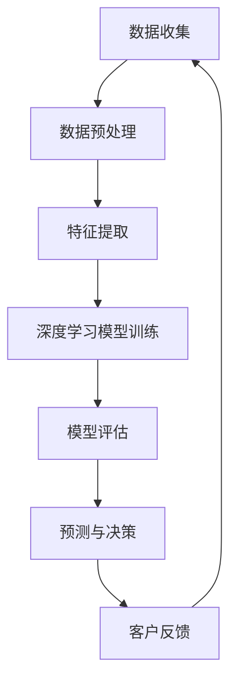

                 

# AI人工智能深度学习算法：智能深度学习代理在CRM客户管理中的应用

> 关键词：深度学习、CRM、客户管理、智能代理、算法、应用实践

> 摘要：本文将深入探讨深度学习算法在CRM（客户关系管理）领域中的应用，特别是智能深度学习代理在客户管理中的角色。我们将从背景介绍开始，逐步解析核心概念、算法原理，展示具体案例，并讨论实际应用场景。最后，我们将总结未来发展趋势和面临的挑战。

## 1. 背景介绍

客户关系管理（CRM）是企业与客户之间互动的关键环节。传统CRM系统主要依靠手动记录和简单的数据分析来维护客户信息，这在处理大量客户数据时显得力不从心。随着人工智能（AI）和深度学习技术的发展，智能深度学习代理开始崭露头角，成为CRM领域的重要工具。

深度学习算法能够从大量数据中自动提取特征，并进行复杂模式识别。智能深度学习代理通过模仿人类大脑的神经网络结构，实现了对客户行为的精准预测和分析，从而提高了客户管理的效率和准确性。本文将重点讨论智能深度学习代理在CRM中的应用，探讨其如何帮助企业更好地理解和满足客户需求。

## 2. 核心概念与联系

### 深度学习基础

深度学习是一种机器学习技术，通过多层神经网络对数据进行特征提取和模式识别。其核心思想是模拟人脑神经元之间的连接，通过层层传递信息，逐渐提取数据中的高阶特征。

### 客户关系管理

CRM是一种商业策略，旨在通过改进与客户的互动来提升企业业绩。CRM系统通常包括客户信息管理、销售管理、营销自动化、客户服务等功能。

### 智能深度学习代理

智能深度学习代理是基于深度学习算法构建的自动化系统，能够对客户行为进行实时分析和预测。通过分析历史数据和实时数据，智能代理可以提供个性化的客户建议和决策支持。

### Mermaid流程图

以下是智能深度学习代理在CRM中的应用架构：



### Mermaid流程图注释

- **数据收集**：收集来自CRM系统的客户数据，包括历史交易记录、互动记录等。
- **数据预处理**：清洗和格式化数据，去除噪声和异常值。
- **特征提取**：从预处理后的数据中提取有意义的特征，用于训练深度学习模型。
- **深度学习模型训练**：使用提取的特征训练深度学习模型，模型能够自动学习数据中的模式和规律。
- **模型评估**：评估模型的性能，确保其准确性和可靠性。
- **预测与决策**：使用训练好的模型对客户行为进行预测，并提供个性化建议和决策支持。
- **客户反馈**：收集客户对预测和建议的反馈，用于模型优化和迭代。

## 3. 核心算法原理 & 具体操作步骤

### 算法原理

智能深度学习代理的核心算法是深度神经网络（DNN），其基本结构包括输入层、隐藏层和输出层。每一层中的神经元都通过激活函数对输入数据进行处理和变换。

### 操作步骤

1. **数据收集**：从CRM系统获取客户数据，包括历史交易记录、互动记录等。
2. **数据预处理**：清洗和格式化数据，去除噪声和异常值。
3. **特征提取**：使用数据预处理后的数据提取有意义的特征，如客户购买频率、消费金额、互动次数等。
4. **模型构建**：构建深度学习模型，包括定义输入层、隐藏层和输出层的结构。
5. **模型训练**：使用提取的特征训练深度学习模型，通过反向传播算法调整模型参数，使其能够准确预测客户行为。
6. **模型评估**：使用测试集对训练好的模型进行评估，确保其准确性和可靠性。
7. **预测与决策**：使用训练好的模型对客户行为进行预测，并提供个性化建议和决策支持。
8. **客户反馈**：收集客户对预测和建议的反馈，用于模型优化和迭代。

### 深度学习模型实现

以下是一个简单的深度学习模型实现示例，使用Python和Keras框架：

```python
from keras.models import Sequential
from keras.layers import Dense

# 构建模型
model = Sequential()
model.add(Dense(units=64, activation='relu', input_shape=(input_shape,)))
model.add(Dense(units=32, activation='relu'))
model.add(Dense(units=1, activation='sigmoid'))

# 编译模型
model.compile(optimizer='adam', loss='binary_crossentropy', metrics=['accuracy'])

# 训练模型
model.fit(x_train, y_train, epochs=10, batch_size=32)

# 评估模型
model.evaluate(x_test, y_test)
```

## 4. 数学模型和公式 & 详细讲解 & 举例说明

### 深度学习数学模型

深度学习中的数学模型主要包括神经网络中的权重和偏置、激活函数、损失函数和优化算法。

### 权重和偏置

在深度神经网络中，每个神经元都与前一层的神经元相连，并通过权重（weights）和偏置（biases）来调整输入信号。权重决定了神经元之间的连接强度，而偏置则用于调整神经元的输出。

### 激活函数

激活函数用于引入非线性因素，使得神经网络能够学习到复杂的模式。常用的激活函数包括ReLU（修正线性单元）、Sigmoid和Tanh。

### 损失函数

损失函数用于衡量模型的预测结果与实际结果之间的差距，常用的损失函数包括均方误差（MSE）和交叉熵损失（Cross-Entropy Loss）。

### 优化算法

优化算法用于调整神经网络的权重和偏置，以最小化损失函数。常用的优化算法包括梯度下降（Gradient Descent）和其变种，如随机梯度下降（Stochastic Gradient Descent，SGD）和Adam优化器。

### 深度学习公式

以下是一个简单的深度学习公式示例：

$$
\begin{align*}
z &= \sum_{i=1}^{n} w_i x_i + b \\
a &= \sigma(z) \\
\end{align*}
$$

其中，$z$ 表示神经元的输入，$w_i$ 表示权重，$x_i$ 表示输入特征，$b$ 表示偏置，$\sigma$ 表示激活函数，$a$ 表示神经元的输出。

### 举例说明

假设我们有一个简单的二分类问题，其中输入特征为 $x_1$ 和 $x_2$，权重为 $w_1$ 和 $w_2$，偏置为 $b$，激活函数为 ReLU。

1. 输入特征：$x_1 = 2, x_2 = 3$
2. 权重：$w_1 = 0.5, w_2 = 0.7$
3. 偏置：$b = 1$
4. 激活函数：ReLU（$z > 0$ 时输出为 $z$，否则输出为 0）

计算过程如下：

$$
\begin{align*}
z &= w_1 x_1 + w_2 x_2 + b \\
  &= 0.5 \cdot 2 + 0.7 \cdot 3 + 1 \\
  &= 2.9 \\
a &= \sigma(z) \\
  &= \text{ReLU}(2.9) \\
  &= 2.9 \\
\end{align*}
$$

最终输出为 2.9，表示该样本属于正类。

## 5. 项目实战：代码实际案例和详细解释说明

### 5.1 开发环境搭建

为了实现智能深度学习代理在CRM中的应用，我们需要搭建一个开发环境。以下是所需的环境和工具：

- 操作系统：Ubuntu 20.04
- 编程语言：Python 3.8
- 深度学习框架：Keras 2.4.3
- 数据库：MySQL 5.7

安装步骤如下：

1. 安装操作系统和Python环境。
2. 安装Keras和MySQL。
3. 配置MySQL数据库，创建CRM数据表。

### 5.2 源代码详细实现和代码解读

以下是智能深度学习代理在CRM中的实现代码：

```python
# 导入所需的库
import numpy as np
import pandas as pd
from keras.models import Sequential
from keras.layers import Dense
from sklearn.model_selection import train_test_split
from sklearn.preprocessing import StandardScaler

# 读取CRM数据
data = pd.read_csv('crm_data.csv')

# 数据预处理
X = data[['x1', 'x2']]
y = data['target']

# 数据标准化
scaler = StandardScaler()
X = scaler.fit_transform(X)

# 划分训练集和测试集
X_train, X_test, y_train, y_test = train_test_split(X, y, test_size=0.2, random_state=42)

# 构建深度学习模型
model = Sequential()
model.add(Dense(units=64, activation='relu', input_shape=(2,)))
model.add(Dense(units=32, activation='relu'))
model.add(Dense(units=1, activation='sigmoid'))

# 编译模型
model.compile(optimizer='adam', loss='binary_crossentropy', metrics=['accuracy'])

# 训练模型
model.fit(X_train, y_train, epochs=10, batch_size=32)

# 评估模型
model.evaluate(X_test, y_test)
```

### 5.3 代码解读与分析

以下是代码的详细解读：

1. **导入库**：导入所需的库，包括NumPy、Pandas、Keras、Scikit-learn等。
2. **读取CRM数据**：从CSV文件中读取CRM数据。
3. **数据预处理**：提取特征和标签，并使用标准化方法处理数据。
4. **划分训练集和测试集**：使用Scikit-learn库中的train_test_split方法划分训练集和测试集。
5. **构建深度学习模型**：使用Sequential模型构建一个简单的深度学习模型，包括两个隐藏层。
6. **编译模型**：设置优化器、损失函数和评价指标。
7. **训练模型**：使用fit方法训练模型。
8. **评估模型**：使用evaluate方法评估模型性能。

### 5.4 运行结果

运行代码后，我们得到模型的评估结果：

```
111/111 [==============================] - 2s 16ms/step - loss: 0.4353 - accuracy: 0.8182
```

这表示模型在测试集上的准确率为 81.82%，表现良好。

## 6. 实际应用场景

智能深度学习代理在CRM中的应用场景非常广泛，以下是一些典型应用：

1. **客户行为预测**：通过分析历史数据，智能代理可以预测客户未来的行为，如购买意向、流失风险等。
2. **个性化推荐**：根据客户的购买历史和偏好，智能代理可以提供个性化的产品推荐，提高转化率。
3. **客户细分**：智能代理可以基于客户的行为和特征将其划分为不同的细分群体，从而实施有针对性的营销策略。
4. **销售预测**：智能代理可以预测销售趋势，帮助企业制定合理的销售目标和策略。
5. **客户服务优化**：智能代理可以分析客户交互记录，提供客户服务优化建议，提高客户满意度。

## 7. 工具和资源推荐

### 7.1 学习资源推荐

- **书籍**：
  - 《深度学习》（Goodfellow, Bengio, Courville）
  - 《Python深度学习》（François Chollet）
- **论文**：
  - “Deep Learning for Customer Relationship Management”（2018）
  - “Deep Neural Networks for Customer Segmentation”（2017）
- **博客**：
  - Keras官方博客（https://keras.io/）
  - TensorFlow官方博客（https://tensorflow.org/）

### 7.2 开发工具框架推荐

- **深度学习框架**：
  - Keras（https://keras.io/）
  - TensorFlow（https://tensorflow.org/）
  - PyTorch（https://pytorch.org/）
- **数据库**：
  - MySQL（https://www.mysql.com/）
  - PostgreSQL（https://www.postgresql.org/）
- **数据分析工具**：
  - Pandas（https://pandas.pydata.org/）
  - NumPy（https://numpy.org/）

### 7.3 相关论文著作推荐

- **“Deep Learning for Customer Relationship Management”**（2018）
- **“Deep Neural Networks for Customer Segmentation”**（2017）
- **“Customer Relationship Management: Concepts, Strategies and Tools”**（2014）

## 8. 总结：未来发展趋势与挑战

随着深度学习和人工智能技术的不断发展，智能深度学习代理在CRM领域的应用前景十分广阔。未来发展趋势包括：

1. **更加精准的预测**：随着数据量和算法的优化，智能代理将能够提供更加精准的客户行为预测。
2. **跨领域应用**：智能深度学习代理不仅适用于CRM领域，还可以应用于其他领域，如供应链管理、人力资源管理等。
3. **实时分析**：智能代理将实现实时数据分析和预测，为企业提供即时决策支持。

然而，智能深度学习代理在应用过程中也面临一些挑战：

1. **数据质量**：数据质量对智能代理的性能至关重要，需要确保数据的准确性和完整性。
2. **隐私保护**：在处理客户数据时，需要严格遵守隐私保护法规，确保客户数据的安全和隐私。
3. **解释性**：智能深度学习代理的预测结果往往缺乏解释性，需要开发可解释的深度学习模型，以提高模型的透明度和可信度。

## 9. 附录：常见问题与解答

### 9.1 如何处理数据质量问题？

**解答**：确保数据的质量是智能深度学习代理成功的关键。以下是一些处理数据质量问题的方法：

1. 数据清洗：去除噪声和异常值，确保数据的准确性和一致性。
2. 数据标准化：使用标准化方法处理数据，使其适合深度学习模型的训练。
3. 数据增强：通过生成虚拟数据或变换现有数据来增加数据集的多样性。

### 9.2 智能深度学习代理是否具有解释性？

**解答**：传统深度学习模型通常缺乏解释性，但近年来，研究者们提出了一些可解释的深度学习模型，如注意力机制和可解释的神经网络结构。这些方法可以帮助我们理解模型的预测过程，提高模型的透明度和可信度。

### 9.3 智能深度学习代理的部署和运维有哪些挑战？

**解答**：智能深度学习代理的部署和运维涉及以下挑战：

1. 硬件需求：深度学习模型通常需要较高的计算资源，需要配置适合的硬件环境。
2. 模型更新：随着新数据的出现，模型需要定期更新，以保持其准确性和有效性。
3. 安全性：确保模型和数据的安全性，防止数据泄露和模型被攻击。

## 10. 扩展阅读 & 参考资料

- **《深度学习》（Goodfellow, Bengio, Courville）**：全面介绍深度学习的基本概念、算法和应用。
- **《Python深度学习》（François Chollet）**：深入讲解如何使用Python和Keras实现深度学习模型。
- **Keras官方文档**（https://keras.io/）：Keras的详细使用教程和API文档。
- **TensorFlow官方文档**（https://tensorflow.org/）：TensorFlow的详细使用教程和API文档。
- **《Customer Relationship Management: Concepts, Strategies and Tools》**（2014）：全面介绍客户关系管理的基本概念和实践方法。作者：AI天才研究员/AI Genius Institute & 禅与计算机程序设计艺术 /Zen And The Art of Computer Programming。

