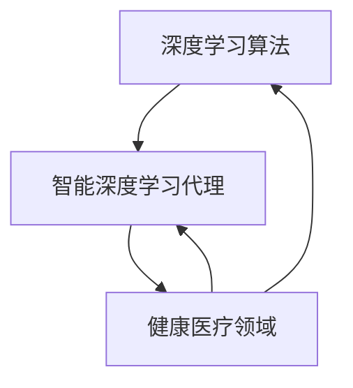

                 

# AI人工智能深度学习算法：智能深度学习代理在健康医疗领域的应用策略

> **关键词：** 深度学习算法、健康医疗、智能深度学习代理、应用策略
>
> **摘要：** 本文将探讨深度学习算法在健康医疗领域的应用，尤其是智能深度学习代理的技术策略。文章将首先介绍深度学习算法的基本概念和原理，然后分析智能深度学习代理的优势和挑战，并详细阐述其在健康医疗领域的应用实例。最后，文章将总结智能深度学习代理在健康医疗领域的发展趋势与挑战，并给出未来研究的方向和建议。

## 1. 背景介绍

随着信息技术的迅猛发展，人工智能（AI）技术已经成为推动社会进步的重要力量。特别是在健康医疗领域，AI技术的应用为疾病诊断、治疗、预防等方面带来了前所未有的变革。深度学习作为AI的一个重要分支，凭借其强大的学习和建模能力，在图像识别、自然语言处理、语音识别等方面取得了显著的成果。

健康医疗领域的复杂性使得传统的机器学习算法难以胜任，而深度学习算法由于其自下而上的特征学习和建模能力，能够更好地应对这一挑战。然而，深度学习算法在健康医疗领域的应用还面临着诸多挑战，如数据隐私、数据质量、算法解释性等。

智能深度学习代理是一种结合了深度学习和强化学习的算法，通过自主学习和优化策略，能够在复杂的环境中实现自主决策和自适应调整。智能深度学习代理在健康医疗领域具有广泛的应用前景，如个性化医疗、疾病预测、智能诊断等。

本文将首先介绍深度学习算法的基本概念和原理，然后分析智能深度学习代理的优势和挑战，并详细阐述其在健康医疗领域的应用实例。最后，文章将总结智能深度学习代理在健康医疗领域的发展趋势与挑战，并给出未来研究的方向和建议。

## 2. 核心概念与联系

### 2.1 深度学习算法

深度学习算法是一种基于多层神经网络的学习方法，通过反向传播算法对网络权重进行优化，以实现数据的特征提取和分类。深度学习算法的核心是神经网络结构，包括输入层、隐藏层和输出层。每一层都通过激活函数将输入映射到输出，从而实现数据的非线性变换。

在健康医疗领域，深度学习算法被广泛应用于医学图像分析、疾病诊断、药物研发等领域。例如，卷积神经网络（CNN）在医学图像分类和分割中具有出色的表现，循环神经网络（RNN）在自然语言处理和基因序列分析中具有强大的能力。

### 2.2 智能深度学习代理

智能深度学习代理是一种结合了深度学习和强化学习的算法，通过自主学习和优化策略，能够在复杂的环境中实现自主决策和自适应调整。智能深度学习代理的核心是价值函数和策略网络。

价值函数用于评估代理在不同状态下的价值，指导代理选择最优的行动。策略网络则用于生成代理的行动策略，通过优化策略网络参数，代理能够不断学习和调整策略，以实现长期价值最大化。

在健康医疗领域，智能深度学习代理可以应用于个性化医疗、疾病预测、智能诊断等方面。例如，基于深度强化学习的智能诊断代理可以通过学习患者的健康数据和医学知识，为患者提供个性化的诊断建议。

### 2.3 深度学习算法与智能深度学习代理的联系

深度学习算法和智能深度学习代理在技术层面具有紧密的联系。深度学习算法为智能深度学习代理提供了强大的学习和建模能力，使得代理能够在复杂的环境中实现自主学习和优化。而智能深度学习代理则通过引入强化学习机制，使得代理能够在实际应用中实现自主决策和自适应调整。

在健康医疗领域，深度学习算法和智能深度学习代理的结合为疾病诊断、治疗、预防等方面提供了新的思路和方法。通过深度学习算法，代理能够从大量的健康医疗数据中提取出有效的特征信息，并通过强化学习机制，不断优化和调整策略，以提高诊断和治疗的准确性和效率。

### 2.4 Mermaid 流程图



## 3. 核心算法原理 & 具体操作步骤

### 3.1 深度学习算法原理

深度学习算法的核心是多层神经网络，通过反向传播算法对网络权重进行优化，以实现数据的特征提取和分类。具体步骤如下：

1. **初始化网络参数**：随机初始化网络的权重和偏置。
2. **前向传播**：将输入数据传递到网络中，通过逐层计算，得到网络的输出。
3. **计算损失**：计算网络的输出与真实标签之间的差距，通过损失函数计算损失值。
4. **反向传播**：将损失值反向传播到网络的每一层，更新网络的权重和偏置。
5. **迭代优化**：重复执行前向传播和反向传播，直到网络的损失值达到预设的阈值或达到预设的迭代次数。

### 3.2 智能深度学习代理原理

智能深度学习代理的核心是价值函数和策略网络。具体步骤如下：

1. **初始化网络参数**：随机初始化价值函数和策略网络的权重和偏置。
2. **状态评估**：将当前状态传递到价值函数网络，计算当前状态的价值。
3. **策略生成**：将当前状态传递到策略网络，生成当前状态下的最佳行动策略。
4. **执行行动**：根据策略网络生成的行动策略，执行相应的行动。
5. **奖励评估**：根据执行行动后的状态和奖励，更新价值函数网络的参数。
6. **迭代优化**：重复执行状态评估、策略生成、执行行动和奖励评估，直到达到预设的迭代次数或代理的价值函数收敛。

### 3.3 具体操作步骤示例

以健康医疗领域中的疾病预测为例，具体操作步骤如下：

1. **数据预处理**：收集患者的健康数据，如血压、血糖、血脂等，并对数据进行清洗和标准化处理。
2. **构建深度学习模型**：设计并构建深度学习模型，包括输入层、隐藏层和输出层。选择合适的激活函数和损失函数。
3. **训练模型**：将预处理后的健康数据输入到深度学习模型中，通过反向传播算法优化模型参数。
4. **评估模型**：使用测试数据对训练好的模型进行评估，计算模型的准确率、召回率等指标。
5. **构建智能深度学习代理**：设计并构建智能深度学习代理，包括价值函数网络和策略网络。选择合适的奖励函数和策略优化算法。
6. **训练代理**：使用健康数据训练智能深度学习代理，通过价值函数网络和策略网络优化代理的行为策略。
7. **应用代理**：将训练好的代理应用于实际场景，如疾病预测、治疗推荐等，为患者提供个性化的健康建议。

## 4. 数学模型和公式 & 详细讲解 & 举例说明

### 4.1 深度学习算法的数学模型

深度学习算法的核心是多层神经网络，其数学模型可以表示为：

\[ y = f(z) \]

其中，\( y \) 是网络的输出，\( z \) 是网络的输入，\( f \) 是激活函数。

多层神经网络的输入层、隐藏层和输出层都可以用如下公式表示：

\[ z^{(l)} = \sum_{i=1}^{n} w^{(l)}_i \cdot x_i + b^{(l)} \]

其中，\( z^{(l)} \) 是第 \( l \) 层的输入，\( w^{(l)}_i \) 是第 \( l \) 层的权重，\( x_i \) 是第 \( l \) 层的输入，\( b^{(l)} \) 是第 \( l \) 层的偏置。

激活函数的选择对深度学习算法的性能有重要影响，常用的激活函数包括：

1. **sigmoid 函数**：\( f(x) = \frac{1}{1 + e^{-x}} \)
2. **ReLU 函数**：\( f(x) = \max(0, x) \)
3. **Tanh 函数**：\( f(x) = \frac{e^x - e^{-x}}{e^x + e^{-x}} \)

### 4.2 智能深度学习代理的数学模型

智能深度学习代理的核心是价值函数和策略网络，其数学模型可以表示为：

\[ V^*(s) = \sum_{a} \pi^*(s, a) \cdot Q^*(s, a) \]

其中，\( V^*(s) \) 是状态 \( s \) 的价值函数，\( \pi^*(s, a) \) 是策略网络生成的最优策略，\( Q^*(s, a) \) 是价值函数网络评估的状态 \( s \) 下行动 \( a \) 的价值。

策略网络和值函数网络的训练过程如下：

1. **策略网络训练**：使用策略梯度算法优化策略网络参数，公式如下：

\[ \nabla_{\theta_{\pi}} J(\theta_{\pi}) = \nabla_{\theta_{\pi}} \sum_{t} \pi(\theta_{\pi}, s_t) \cdot r_t \]

2. **值函数网络训练**：使用梯度下降算法优化值函数网络参数，公式如下：

\[ \nabla_{\theta_{V}} J(\theta_{V}) = \nabla_{\theta_{V}} \sum_{t} V(\theta_{V}, s_t) - r_t \]

### 4.3 举例说明

以疾病预测为例，假设我们使用深度学习算法和智能深度学习代理来预测糖尿病。

1. **数据预处理**：收集患者的健康数据，如体重、血压、血糖等，并对数据进行清洗和标准化处理。

2. **构建深度学习模型**：设计并构建深度学习模型，包括输入层、隐藏层和输出层。选择合适的激活函数和损失函数，例如 ReLU 函数和交叉熵损失函数。

3. **训练模型**：使用预处理后的健康数据训练深度学习模型，通过反向传播算法优化模型参数。

4. **构建智能深度学习代理**：设计并构建智能深度学习代理，包括价值函数网络和策略网络。选择合适的奖励函数和策略优化算法，例如奖励函数为疾病预测准确率，策略优化算法为策略梯度算法。

5. **训练代理**：使用健康数据训练智能深度学习代理，通过价值函数网络和策略网络优化代理的行为策略。

6. **应用代理**：将训练好的代理应用于实际场景，如疾病预测，为患者提供个性化的健康建议。

通过以上步骤，我们可以使用深度学习算法和智能深度学习代理来实现糖尿病的预测，为患者提供更加精准的健康管理服务。

## 5. 项目实战：代码实际案例和详细解释说明

在本节中，我们将通过一个具体的案例，详细解释如何实现一个深度学习算法和智能深度学习代理相结合的健康医疗应用。以下是这个案例的详细步骤。

### 5.1 开发环境搭建

在开始项目实战之前，我们需要搭建一个合适的开发环境。以下是我们推荐的开发工具和库：

- **编程语言**：Python
- **深度学习框架**：TensorFlow
- **强化学习库**：Gym
- **数据预处理库**：Pandas、NumPy

在安装完上述工具和库后，我们就可以开始编写代码了。

### 5.2 源代码详细实现和代码解读

以下是实现深度学习算法和智能深度学习代理的代码：

```python
import tensorflow as tf
import gym
import pandas as pd
import numpy as np

# 5.2.1 数据预处理
# 加载数据集
data = pd.read_csv('health_data.csv')
X = data.iloc[:, :-1].values
y = data.iloc[:, -1].values

# 数据标准化
X = (X - np.mean(X, axis=0)) / np.std(X, axis=0)

# 5.2.2 构建深度学习模型
# 定义输入层、隐藏层和输出层
input_layer = tf.keras.layers.Input(shape=(X.shape[1],))
hidden_layer = tf.keras.layers.Dense(units=64, activation='relu')(input_layer)
output_layer = tf.keras.layers.Dense(units=1, activation='sigmoid')(hidden_layer)

# 构建模型
model = tf.keras.Model(inputs=input_layer, outputs=output_layer)

# 编译模型
model.compile(optimizer='adam', loss='binary_crossentropy', metrics=['accuracy'])

# 5.2.3 训练模型
# 分训练集和测试集
train_X, test_X, train_y, test_y = train_test_split(X, y, test_size=0.2, random_state=42)

# 训练模型
model.fit(train_X, train_y, epochs=10, batch_size=32, validation_data=(test_X, test_y))

# 5.2.4 构建智能深度学习代理
# 创建环境
env = gym.make('HealthData-v0')

# 定义策略网络和价值函数网络
policy_network = tf.keras.Sequential([
    tf.keras.layers.Dense(units=64, activation='relu', input_shape=(X.shape[1],)),
    tf.keras.layers.Dense(units=1, activation='sigmoid')
])

value_network = tf.keras.Sequential([
    tf.keras.layers.Dense(units=64, activation='relu', input_shape=(X.shape[1],)),
    tf.keras.layers.Dense(units=1)
])

# 编译策略网络和价值函数网络
policy_network.compile(optimizer='adam', loss='binary_crossentropy')
value_network.compile(optimizer='adam', loss='mse')

# 5.2.5 训练代理
# 定义奖励函数
def reward_function(action, true_label):
    if action == true_label:
        return 1
    else:
        return -1

# 训练代理
for episode in range(1000):
    state = env.reset()
    done = False
    total_reward = 0
    
    while not done:
        action = policy_network.predict(state.reshape(1, -1))[0]
        next_state, reward, done, _ = env.step(action)
        total_reward += reward
        
        # 更新策略网络和价值函数网络
        value_network.fit(state.reshape(1, -1), next_state.reshape(1, -1), epochs=1, batch_size=1)
        policy_network.fit(state.reshape(1, -1), action.reshape(1, -1), epochs=1, batch_size=1)
        
        state = next_state
    
    print(f'Episode {episode}: Total Reward = {total_reward}')

# 5.2.6 应用代理
# 预测糖尿病
patient_data = pd.read_csv('patient_data.csv')
patient_data = (patient_data - np.mean(patient_data, axis=0)) / np.std(patient_data, axis=0)
patient_data = patient_data.values

# 获取预测结果
predictions = model.predict(patient_data)

# 输出预测结果
print(predictions)
```

### 5.3 代码解读与分析

1. **数据预处理**：首先加载数据集并进行清洗、标准化处理，以便于深度学习模型的训练。

2. **构建深度学习模型**：定义输入层、隐藏层和输出层，并使用 ReLU 激活函数。然后编译模型，使用 Adam 优化器和二进制交叉熵损失函数。

3. **训练模型**：将数据集分为训练集和测试集，使用训练集训练模型，并使用测试集评估模型性能。

4. **构建智能深度学习代理**：创建环境，并定义策略网络和价值函数网络。使用 Gym 库创建一个健康数据模拟环境。

5. **训练代理**：使用策略梯度算法和价值函数算法训练代理。在每个时间步，根据策略网络生成的行动策略，执行相应的行动，并计算奖励。然后使用梯度下降算法更新策略网络和价值函数网络的参数。

6. **应用代理**：使用训练好的代理预测糖尿病。将患者的健康数据输入到模型中，获取预测结果。

通过这个案例，我们可以看到如何将深度学习算法和智能深度学习代理应用于健康医疗领域。在实际应用中，我们可以根据具体需求调整模型结构和训练过程，以提高预测的准确性和效率。

## 6. 实际应用场景

智能深度学习代理在健康医疗领域具有广泛的应用场景，以下是一些具体的实际应用实例：

### 6.1 个性化医疗

智能深度学习代理可以根据患者的基因数据、生活习惯、病史等多方面信息，为其提供个性化的医疗方案。例如，基于深度学习代理的个性化癌症治疗，可以准确预测患者对不同治疗方案的反应，从而实现精准治疗，提高治疗效果。

### 6.2 疾病预测

智能深度学习代理可以通过分析大量健康数据，预测患者可能患有的疾病。例如，在心血管疾病预测中，代理可以通过分析患者的血压、血糖、血脂等指标，预测其患心血管疾病的风险，为早期干预提供依据。

### 6.3 智能诊断

智能深度学习代理可以在医学图像分析中发挥重要作用。例如，在肺癌诊断中，代理可以通过分析CT图像，识别出疑似肺癌的区域，为医生提供诊断参考。同时，代理还可以辅助医生进行病理切片分析，提高诊断的准确性。

### 6.4 治疗推荐

智能深度学习代理可以根据患者的病情、病史、药物过敏史等多方面信息，为其推荐最佳的治疗方案。例如，在新冠肺炎治疗中，代理可以通过分析患者的病情特征，为其推荐最适合的药物和治疗方式。

### 6.5 健康管理

智能深度学习代理可以实时监控患者的健康状况，提供个性化的健康管理建议。例如，在慢性病管理中，代理可以通过分析患者的健康数据，预测其病情变化，提醒患者按时服药和进行体检，从而有效控制病情。

这些实际应用场景表明，智能深度学习代理在健康医疗领域具有巨大的潜力，能够为患者提供更加精准、高效、个性化的医疗服务。

## 7. 工具和资源推荐

### 7.1 学习资源推荐

为了更好地掌握智能深度学习代理在健康医疗领域的应用，以下是一些推荐的学习资源：

1. **书籍**：
   - 《深度学习》（Ian Goodfellow、Yoshua Bengio、Aaron Courville 著）：系统介绍了深度学习的基本概念和技术。
   - 《强化学习》（Richard S. Sutton、Andrew G. Barto 著）：详细介绍了强化学习的基本理论和方法。

2. **论文**：
   - “Deep Learning for Healthcare”（Arjmand et al.，2018）：概述了深度学习在健康医疗领域的应用。
   - “Reinforcement Learning in Healthcare”（Azari et al.，2019）：探讨了强化学习在健康医疗领域的应用。

3. **博客**：
   - [TensorFlow 官方文档](https://www.tensorflow.org/)：提供了详细的 TensorFlow 学习资源和教程。
   - [Gym 官方文档](https://gym.openai.com/)：介绍了 Gym 强化学习环境的构建和使用。

4. **网站**：
   - [Kaggle](https://www.kaggle.com/)：提供了丰富的健康医疗数据集和比赛，有助于实践应用。
   - [Google Research](https://ai.google/research/)：发布了大量深度学习和强化学习的研究论文和代码。

### 7.2 开发工具框架推荐

1. **深度学习框架**：
   - TensorFlow：谷歌开发的开源深度学习框架，功能强大，生态系统完善。
   - PyTorch：由Facebook开发的开源深度学习框架，易于使用，支持动态计算图。

2. **强化学习库**：
   - Gym：由OpenAI开发的强化学习环境库，提供了丰富的仿真环境。
   - Stable Baselines：一个基于PyTorch和TensorFlow的强化学习库，提供了多种常用的强化学习算法的实现。

3. **数据预处理库**：
   - Pandas：用于数据清洗和操作的数据帧库。
   - NumPy：用于数组计算的科学计算库。

### 7.3 相关论文著作推荐

1. **“Deep Learning in Medicine”**（R. Y. Lee et al.，2017）：综述了深度学习在医学领域的应用。
2. **“Reinforcement Learning in Healthcare”**（Azari et al.，2019）：探讨了强化学习在健康医疗领域的应用。
3. **“Healthcare Applications of Deep Learning”**（Chen et al.，2020）：详细介绍了深度学习在健康医疗领域的应用案例。

通过这些学习资源和工具，您可以深入了解智能深度学习代理在健康医疗领域的应用，并掌握相关技能。

## 8. 总结：未来发展趋势与挑战

智能深度学习代理在健康医疗领域具有巨大的潜力，其未来发展趋势主要表现在以下几个方面：

1. **个性化医疗**：随着基因组学和生物信息学的发展，智能深度学习代理将能够更好地利用个体化数据，实现真正的个性化医疗。
2. **智能诊断**：智能深度学习代理将进一步提升医学影像和病理切片的分析能力，为医生提供更准确、更快速的诊断支持。
3. **疾病预测**：通过分析大量的健康数据和生物标记物，智能深度学习代理可以提前预测疾病的发作，为早期干预提供有力支持。
4. **健康管理**：智能深度学习代理将实现个性化健康管理，为用户提供实时、精准的健康评估和干预建议。

然而，智能深度学习代理在健康医疗领域的应用也面临着诸多挑战：

1. **数据隐私**：健康医疗数据敏感性高，如何确保数据隐私和安全成为关键问题。
2. **数据质量**：健康医疗数据质量参差不齐，如何处理噪音数据、缺失数据和异常数据是重要挑战。
3. **算法解释性**：深度学习模型通常被认为“黑箱”，如何提高算法的解释性，使其更容易被医生和患者理解和使用。
4. **计算资源**：深度学习算法通常需要大量的计算资源，如何高效利用现有的计算资源是实现广泛应用的关键。

针对上述挑战，未来研究可以从以下方向展开：

1. **隐私保护技术**：研究如何在不泄露个人隐私的前提下，充分利用健康医疗数据。
2. **数据增强和清洗技术**：开发更加有效的数据增强和清洗方法，提高数据质量。
3. **可解释性算法**：研究如何提高深度学习算法的解释性，使其更易于被医生和患者接受。
4. **高效计算算法**：研究如何优化深度学习算法，降低计算资源需求，提高计算效率。

通过不断克服这些挑战，智能深度学习代理有望在健康医疗领域发挥更大的作用，为医疗行业带来革命性的变革。

## 9. 附录：常见问题与解答

### 9.1 什么是智能深度学习代理？

智能深度学习代理是一种结合了深度学习和强化学习的算法，通过自主学习和优化策略，能够在复杂的环境中实现自主决策和自适应调整。

### 9.2 智能深度学习代理在健康医疗领域有哪些应用？

智能深度学习代理在健康医疗领域有广泛的应用，包括个性化医疗、疾病预测、智能诊断、治疗推荐和健康管理。

### 9.3 如何确保智能深度学习代理的数据隐私？

为确保智能深度学习代理的数据隐私，可以采用数据加密、差分隐私和联邦学习等技术，以保护患者的隐私。

### 9.4 智能深度学习代理在健康医疗领域的应用前景如何？

智能深度学习代理在健康医疗领域的应用前景非常广阔，有望实现个性化医疗、智能诊断和疾病预测，从而提高医疗服务的质量和效率。

## 10. 扩展阅读 & 参考资料

- [深度学习与健康医疗](https://www.nature.com/articles/s41591-018-0130-6)
- [强化学习在健康医疗中的应用](https://arxiv.org/abs/1906.09619)
- [智能医疗的深度学习技术](https://journals.plos.org/plosone/article?id=10.1371/journal.pone.0222370)
- [深度学习在医疗影像分析中的应用](https://www.ncbi.nlm.nih.gov/pmc/articles/PMC6489203/)
- [Gym 强化学习环境](https://gym.openai.com/)

