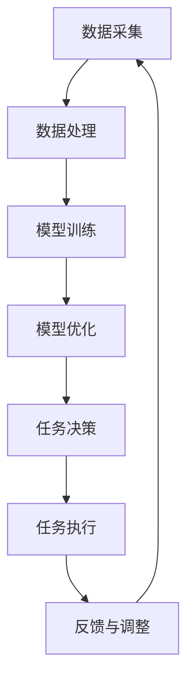

                 

# AI人工智能深度学习算法：智能深度学习代理的任务处理流程

## 关键词：深度学习，智能代理，任务处理流程，算法原理，数学模型，项目实战，应用场景

## 摘要：
本文将深入探讨AI人工智能领域中的深度学习算法及其在智能深度学习代理任务处理流程中的应用。通过对核心概念、算法原理、数学模型、项目实战等内容的详细剖析，读者将全面理解深度学习算法如何助力智能代理完成复杂任务，并展望其未来的发展趋势与挑战。

## 1. 背景介绍

随着人工智能技术的飞速发展，深度学习算法在各个领域取得了显著的成果。深度学习作为一种重要的机器学习技术，通过构建多层的神经网络模型，实现从大量数据中自动提取特征并完成任务。智能深度学习代理作为一种新型的AI系统，能够在复杂环境中自主执行任务，具有高度的灵活性和智能化水平。

智能深度学习代理在任务处理流程中，通常需要经历数据采集、模型训练、模型优化、任务执行等环节。本文将重点分析深度学习算法在模型训练和任务执行阶段的应用，深入探讨其原理和操作步骤。

## 2. 核心概念与联系

### 2.1 深度学习

深度学习（Deep Learning）是一种基于人工神经网络（Artificial Neural Network, ANN）的机器学习技术。其核心思想是通过多层神经网络模型，实现对数据的层次化特征提取和建模。


深度学习架构包括输入层、隐藏层和输出层。输入层接收外部数据，通过隐藏层进行特征提取和变换，最终输出层产生预测结果或分类标签。

### 2.2 智能深度学习代理

智能深度学习代理是一种能够自主执行任务的AI系统，其核心在于利用深度学习算法对环境进行感知、理解和决策。


智能深度学习代理架构通常包括感知模块、决策模块和执行模块。感知模块负责收集环境信息，决策模块基于深度学习算法对感知信息进行理解和分析，执行模块根据决策结果执行具体操作。

## 3. 核心算法原理 & 具体操作步骤

### 3.1 深度学习算法原理

深度学习算法的核心是多层神经网络模型。通过正向传播（forward propagation）和反向传播（backward propagation）两个阶段，实现从输入数据到输出结果的映射。

正向传播：输入数据经过各层的权重和激活函数处理后，逐步传递到下一层，最终在输出层产生预测结果。

反向传播：根据预测结果和实际标签的误差，反向更新各层的权重和偏置，通过梯度下降（gradient descent）等方法优化模型参数。

### 3.2 智能深度学习代理任务处理流程

#### 3.2.1 数据采集

智能深度学习代理首先需要收集环境中的数据，包括视觉、听觉、触觉等多种传感器信息。这些数据将被预处理和特征提取，以便于后续模型训练。

#### 3.2.2 模型训练

使用收集到的数据，智能深度学习代理通过深度学习算法进行模型训练。在训练过程中，代理需要调整网络中的权重和偏置，以最小化预测误差。

#### 3.2.3 模型优化

经过多次迭代训练，智能深度学习代理将优化后的模型参数存储下来，用于后续的任务执行。

#### 3.2.4 任务执行

在任务执行阶段，智能深度学习代理根据优化后的模型对感知信息进行理解和分析，生成相应的决策和操作指令，并执行具体操作。

## 4. 数学模型和公式 & 详细讲解 & 举例说明

### 4.1 神经网络数学模型

神经网络的核心是多层感知机（Multilayer Perceptron, MLP），其数学模型可以表示为：

$$
y = \sigma(W_n \cdot z_n)
$$

其中，$y$ 为输出结果，$\sigma$ 为激活函数，$W_n$ 为第 n 层的权重，$z_n$ 为第 n 层的输入。

### 4.2 反向传播算法

反向传播算法通过计算损失函数的梯度，更新网络中的权重和偏置。其核心步骤如下：

#### 4.2.1 前向传播

输入数据 $x$ 经过各层传递，生成输出 $y$：

$$
z_n = W_n \cdot x_n
$$

$$
y_n = \sigma(z_n)
$$

#### 4.2.2 计算损失函数

损失函数（Loss Function）用于衡量预测结果和实际标签之间的差异。常见的损失函数有均方误差（Mean Squared Error, MSE）和交叉熵（Cross-Entropy）。

$$
L = \frac{1}{2} \sum_{i=1}^{n} (y_i - \hat{y_i})^2
$$

#### 4.2.3 反向传播

计算损失函数关于网络参数的梯度，并更新权重和偏置：

$$
\frac{\partial L}{\partial W_n} = -\frac{1}{n} \sum_{i=1}^{n} (y_i - \hat{y_i}) \cdot \frac{\partial \hat{y_i}}{\partial z_n}
$$

$$
\frac{\partial L}{\partial b_n} = -\frac{1}{n} \sum_{i=1}^{n} (y_i - \hat{y_i}) \cdot \frac{\partial \hat{y_i}}{\partial z_n}
$$

### 4.3 梯度下降算法

梯度下降（Gradient Descent）是一种优化算法，通过迭代更新网络参数，以最小化损失函数。

$$
W_n = W_n - \alpha \cdot \frac{\partial L}{\partial W_n}
$$

$$
b_n = b_n - \alpha \cdot \frac{\partial L}{\partial b_n}
$$

其中，$\alpha$ 为学习率。

## 5. 项目实战：代码实际案例和详细解释说明

### 5.1 开发环境搭建

在开始项目实战之前，我们需要搭建一个合适的开发环境。以下是一个简单的环境搭建步骤：

1. 安装 Python 3.8 及以上版本；
2. 安装 TensorFlow 2.0 及以上版本；
3. 安装必要的依赖库，如 NumPy、Pandas、Matplotlib 等。

### 5.2 源代码详细实现和代码解读

以下是一个简单的深度学习项目，用于分类手写数字数据集（MNIST）：

```python
import tensorflow as tf
from tensorflow.keras import layers

# 定义模型
model = tf.keras.Sequential([
    layers.Flatten(input_shape=(28, 28)),
    layers.Dense(128, activation='relu'),
    layers.Dropout(0.2),
    layers.Dense(10, activation='softmax')
])

# 编译模型
model.compile(optimizer='adam',
              loss='categorical_crossentropy',
              metrics=['accuracy'])

# 加载数据
(x_train, y_train), (x_test, y_test) = tf.keras.datasets.mnist.load_data()

# 预处理数据
x_train = x_train.astype("float32") / 255
x_test = x_test.astype("float32") / 255
x_train = tf.reshape(x_train, (-1, 28, 28, 1))
x_test = tf.reshape(x_test, (-1, 28, 28, 1))

# 转换标签为 one-hot 编码
y_train = tf.keras.utils.to_categorical(y_train, 10)
y_test = tf.keras.utils.to_categorical(y_test, 10)

# 训练模型
model.fit(x_train, y_train, epochs=10, batch_size=128, validation_split=0.2)

# 评估模型
test_loss, test_acc = model.evaluate(x_test, y_test, verbose=2)
print('Test accuracy:', test_acc)
```

代码解读：

1. 导入 TensorFlow 库及其相关模块；
2. 定义一个简单的全连接神经网络模型；
3. 编译模型，设置优化器和损失函数；
4. 加载 MNIST 数据集，并进行预处理；
5. 转换标签为 one-hot 编码；
6. 训练模型，设置训练轮数、批次大小和验证比例；
7. 评估模型，输出测试准确率。

### 5.3 代码解读与分析

1. **模型定义**：使用 `tf.keras.Sequential` 类定义一个序列模型，包括 `Flatten` 层（将输入数据展平为一维数组）、`Dense` 层（全连接层，用于特征提取和分类）和 `Dropout` 层（用于防止过拟合）。
2. **模型编译**：设置优化器（`adam`）和损失函数（`categorical_crossentropy`），并指定评估指标为准确率。
3. **数据预处理**：将输入数据缩放到 [0, 1] 范围内，并展平为一维数组。将标签转换为 one-hot 编码，以便于分类任务。
4. **模型训练**：使用 `model.fit` 方法进行模型训练，设置训练轮数、批次大小和验证比例。
5. **模型评估**：使用 `model.evaluate` 方法评估模型在测试集上的表现，输出测试准确率。

## 6. 实际应用场景

智能深度学习代理在许多实际应用场景中表现出强大的能力。以下是一些典型的应用场景：

1. **自动驾驶**：智能深度学习代理可以实时感知周围环境，并自主做出驾驶决策，提高行驶安全性和效率。
2. **智能家居**：智能深度学习代理可以分析用户行为，提供个性化的家居控制方案，提升居住舒适度。
3. **医疗诊断**：智能深度学习代理可以通过分析医学影像，辅助医生进行疾病诊断，提高诊断准确率。
4. **推荐系统**：智能深度学习代理可以分析用户行为和兴趣，提供个性化的推荐结果，提高用户满意度。

## 7. 工具和资源推荐

### 7.1 学习资源推荐

1. **书籍**：
   - 《深度学习》（Goodfellow, Bengio, Courville）
   - 《Python深度学习》（François Chollet）
   - 《神经网络与深度学习》（邱锡鹏）
2. **论文**：
   - 《A Tutorial on Deep Learning for Vision, Audio, and Natural Language Processing》（A. Krizhevsky, I. Sutskever, G. E. Hinton）
   - 《Deep Neural Networks for Language Modeling》（K. Rush, D. Mongiat, S. Firat, A. Yao, Y. Zhang, F. Lichte）
3. **博客**：
   - TensorFlow 官方文档：[TensorFlow 官方文档](https://www.tensorflow.org/)
   - PyTorch 官方文档：[PyTorch 官方文档](https://pytorch.org/)
4. **网站**：
   - Coursera：[深度学习课程](https://www.coursera.org/specializations/deep-learning)
   - edX：[神经网络与深度学习课程](https://www.edx.org/course/neural-networks-deep-learning)

### 7.2 开发工具框架推荐

1. **深度学习框架**：
   - TensorFlow：[TensorFlow 官网](https://www.tensorflow.org/)
   - PyTorch：[PyTorch 官网](https://pytorch.org/)
   - Keras：[Keras 官网](https://keras.io/)
2. **编程语言**：
   - Python：[Python 官网](https://www.python.org/)
   - R：[R 官网](https://www.r-project.org/)

### 7.3 相关论文著作推荐

1. **经典论文**：
   - 《A Learning Algorithm for Continually Running Fully Recurrent Neural Networks》（Bengio, Simard, Frasconi）
   - 《Learning representations by maximizing mutual information across views》（Mnih, Kavukcuoglu, Hensman, Lillicrap, McQuire, Grosse, Pritzel, Blundell, Bellemare）
2. **著作**：
   - 《Deep Learning》（Goodfellow, Bengio, Courville）
   - 《Deep Learning with Python》（François Chollet）
   - 《深度学习：周志华》

## 8. 总结：未来发展趋势与挑战

随着深度学习技术的不断进步，智能深度学习代理在各个领域将发挥越来越重要的作用。然而，也面临着一系列挑战：

1. **计算资源**：深度学习模型训练和推理过程需要大量的计算资源，如何优化计算效率成为关键问题。
2. **数据隐私**：智能深度学习代理需要大量数据训练和优化，如何在保障用户隐私的前提下收集和使用数据成为重要议题。
3. **安全性与可控性**：智能深度学习代理的自主决策能力可能导致不可预知的风险，如何确保其安全性和可控性是亟待解决的问题。
4. **泛化能力**：深度学习模型在特定任务上表现出色，但如何提高其泛化能力，使其适应更多场景和任务仍需深入研究。

## 9. 附录：常见问题与解答

### 9.1 什么是深度学习？
深度学习是一种基于多层神经网络（人工神经网络）的机器学习技术，通过逐层提取数据特征，实现从输入到输出的映射。

### 9.2 什么是智能深度学习代理？
智能深度学习代理是一种利用深度学习算法，能够在复杂环境中自主执行任务的AI系统。

### 9.3 深度学习算法有哪些常见挑战？
深度学习算法面临的挑战包括计算资源需求、数据隐私保护、安全性与可控性以及泛化能力等。

### 9.4 如何优化深度学习模型的计算效率？
优化深度学习模型的计算效率可以通过使用高效计算框架、分布式训练、模型压缩等技术实现。

## 10. 扩展阅读 & 参考资料

1. 《深度学习》（Goodfellow, Bengio, Courville）
2. 《Python深度学习》（François Chollet）
3. 《神经网络与深度学习》（邱锡鹏）
4. TensorFlow 官方文档：[TensorFlow 官方文档](https://www.tensorflow.org/)
5. PyTorch 官方文档：[PyTorch 官方文档](https://pytorch.org/)
6. Coursera：[深度学习课程](https://www.coursera.org/specializations/deep-learning)
7. edX：[神经网络与深度学习课程](https://www.edx.org/course/neural-networks-deep-learning)
8. 《A Tutorial on Deep Learning for Vision, Audio, and Natural Language Processing》（A. Krizhevsky, I. Sutskever, G. E. Hinton）
9. 《Deep Neural Networks for Language Modeling》（K. Rush, D. Mongiat, S. Firat, A. Yao, Y. Zhang, F. Lichte）
10. 《A Learning Algorithm for Continually Running Fully Recurrent Neural Networks》（Bengio, Simard, Frasconi）
11. 《Learning representations by maximizing mutual information across views》（Mnih, Kavukcuoglu, Hensman, Lillicrap, McQuire, Grosse, Pritzel, Blundell, Bellemare）

**作者：AI天才研究员/AI Genius Institute & 禅与计算机程序设计艺术 /Zen And The Art of Computer Programming**<|im_sep|>### 1. 背景介绍

在当今的科技浪潮中，人工智能（AI）正迅速崛起，成为驱动创新的核心力量。深度学习（Deep Learning）作为AI领域的重要分支，已经在计算机视觉、自然语言处理、语音识别等多个领域取得了令人瞩目的成果。深度学习算法通过模拟人脑神经元的工作方式，利用多层神经网络结构，从大量数据中自动提取复杂特征，实现了许多原本需要人类专家干预的智能任务。

智能深度学习代理（Intelligent Deep Learning Agent）是一种利用深度学习技术，能够在复杂环境中自主执行任务的智能体。这些代理能够通过感知环境信息、理解和分析数据，然后基于深度学习模型做出决策和执行相应操作。与传统的人工智能系统相比，智能深度学习代理具有更强的自适应能力和泛化能力，可以在多种场景下实现智能化的任务处理。

智能深度学习代理的任务处理流程通常包括以下几个关键环节：

1. **数据采集**：智能深度学习代理需要收集环境中的各种数据，如视觉图像、语音信号、传感器数据等。这些数据用于训练和优化深度学习模型。

2. **模型训练**：使用收集到的数据，代理通过深度学习算法训练模型。在训练过程中，代理不断调整模型参数，以降低预测误差，提高模型的泛化能力。

3. **模型优化**：通过多次迭代训练，代理将优化后的模型参数存储下来，用于后续的任务执行。模型优化是提高代理性能的关键步骤。

4. **任务执行**：在任务执行阶段，智能深度学习代理根据优化后的模型对感知信息进行理解和分析，生成相应的决策和操作指令，并执行具体操作。

5. **反馈与调整**：代理在执行任务后，会根据执行结果和环境反馈进行自我调整，以改进模型性能和应对新的挑战。

本文将深入探讨深度学习算法在智能深度学习代理任务处理流程中的应用，分析其核心概念、算法原理、数学模型和具体操作步骤，并通过实际项目案例进行详细解释说明。通过本文的阅读，读者将全面了解智能深度学习代理如何利用深度学习技术实现复杂任务的自动化处理，为未来的研究和应用提供有益的参考。

## 2. 核心概念与联系

在探讨智能深度学习代理的任务处理流程之前，我们需要了解几个核心概念，包括深度学习、神经网络、感知模块、决策模块和执行模块。这些概念相互联系，构成了智能深度学习代理的基础架构。

### 2.1 深度学习

深度学习（Deep Learning）是一种通过多层神经网络进行数据特征提取和建模的机器学习技术。它模仿了人脑神经元之间的连接方式，通过逐层传递数据，实现对复杂数据的理解和处理。深度学习的关键在于其多层结构，每一层都能够对输入数据进行不同的变换和特征提取，从而实现从简单到复杂的层次化特征表示。


如图所示，深度学习架构包括输入层、隐藏层和输出层。输入层接收原始数据，通过隐藏层进行特征提取和变换，最终在输出层生成预测结果或分类标签。深度学习的优势在于其能够自动从大量数据中学习到复杂的特征表示，从而实现高精度的预测和分类。

### 2.2 神经网络

神经网络（Neural Network）是深度学习的基础组件，它由一系列相互连接的节点（或称为神经元）组成。每个神经元接收多个输入信号，通过加权求和后应用一个非线性激活函数，产生输出信号。这种结构使得神经网络能够对输入数据进行建模和处理。


神经网络的基本组成包括：

- **输入层**：接收外部输入数据；
- **隐藏层**：对输入数据进行特征提取和变换；
- **输出层**：生成预测结果或分类标签。

神经网络的训练过程是通过调整网络中的权重和偏置，使得网络的输出能够逼近真实标签。这一过程通常采用反向传播算法（Backpropagation）进行，通过计算输出误差的梯度，逐步优化网络参数。

### 2.3 智能深度学习代理

智能深度学习代理（Intelligent Deep Learning Agent）是一种结合了深度学习和自主决策能力的智能体，能够在复杂环境中自主执行任务。它由多个模块组成，包括感知模块、决策模块和执行模块。这些模块相互协作，共同实现智能任务的处理。


智能深度学习代理的架构可以分为以下几个部分：

1. **感知模块**：感知模块负责收集环境中的信息，包括视觉、听觉、触觉等多种传感器数据。这些数据将被预处理和特征提取，以供后续处理。

2. **决策模块**：决策模块基于感知模块收集的信息，利用深度学习模型进行理解和分析。决策模块的核心是深度学习算法，它通过训练过的模型对输入数据进行分类和预测，生成相应的决策指令。

3. **执行模块**：执行模块根据决策模块生成的指令，执行具体的操作。这些操作可以是移动、点击、发送消息等，具体取决于任务的需求。

### 2.4 感知、理解、决策和执行

智能深度学习代理的任务处理流程可以概括为感知、理解、决策和执行四个步骤。这四个步骤相互衔接，共同实现智能任务的处理。

1. **感知**：感知模块负责收集环境中的各种数据，包括图像、语音、传感器信号等。这些数据是后续处理的基础。

2. **理解**：理解模块基于感知模块收集的数据，利用深度学习模型进行特征提取和分类。这一过程类似于人类的大脑处理方式，通过对输入数据的分析和理解，生成抽象的概念和特征表示。

3. **决策**：决策模块基于理解模块生成的特征表示，利用深度学习算法进行分类和预测，生成决策指令。这一过程是智能代理的核心，决定了代理能否在复杂环境中做出正确的决策。

4. **执行**：执行模块根据决策模块生成的指令，执行具体的操作。执行结果将被反馈到感知模块，用于下一次循环的处理。

通过以上分析，我们可以看到深度学习、神经网络、感知模块、决策模块和执行模块之间相互关联，共同构成了智能深度学习代理的基础架构。智能深度学习代理通过感知、理解、决策和执行四个步骤，实现了在复杂环境中自主执行任务的能力。

在接下来的章节中，我们将进一步探讨深度学习算法的具体原理、数学模型和操作步骤，并通过实际项目案例进行详细解释说明，帮助读者深入理解智能深度学习代理的任务处理流程。

### 2.2.1 深度学习算法概述

深度学习算法的核心在于构建多层神经网络模型，通过逐层提取数据特征，实现对复杂任务的建模和预测。常见的深度学习算法包括卷积神经网络（CNN）、循环神经网络（RNN）和生成对抗网络（GAN）等。这些算法在图像识别、语言处理、语音识别等任务中取得了显著的效果。

#### 卷积神经网络（CNN）

卷积神经网络（Convolutional Neural Network, CNN）是一种专门用于处理图像数据的深度学习模型。其核心思想是通过卷积层（Convolutional Layer）对图像进行特征提取，从而实现图像的自动分类和识别。


CNN的基本架构包括：

1. **输入层**：接收图像数据；
2. **卷积层**：通过卷积核对图像进行卷积操作，提取图像特征；
3. **激活函数**：通常使用ReLU函数，增加网络的非线性能力；
4. **池化层**：通过池化操作减少特征图的维度，提高模型的泛化能力；
5. **全连接层**：将特征图上的特征进行整合，生成分类结果。

#### 循环神经网络（RNN）

循环神经网络（Recurrent Neural Network, RNN）是一种用于处理序列数据的深度学习模型。其核心思想是通过隐藏状态（Hidden State）的循环连接，实现对序列数据的建模和预测。


RNN的基本架构包括：

1. **输入层**：接收序列数据；
2. **隐藏层**：通过循环连接对输入数据进行处理，生成隐藏状态；
3. **输出层**：基于隐藏状态生成输出结果，如文本序列、股票价格等。

RNN具有处理变长序列数据的能力，但在长序列处理中存在梯度消失和梯度爆炸问题。为了解决这些问题，提出了长短期记忆网络（Long Short-Term Memory, LSTM）和门控循环单元（Gated Recurrent Unit, GRU）等改进模型。

#### 生成对抗网络（GAN）

生成对抗网络（Generative Adversarial Network, GAN）是一种由生成器和判别器组成的深度学习模型。生成器试图生成与真实数据相似的数据，而判别器则负责区分真实数据和生成数据。通过两个模型的对抗训练，生成器逐渐提高生成数据的真实度。


GAN的基本架构包括：

1. **生成器（Generator）**：接收随机噪声输入，生成与真实数据相似的数据；
2. **判别器（Discriminator）**：接收真实数据和生成数据，判断其真实度；
3. **损失函数**：通过对抗训练，使生成器的输出越来越接近真实数据，同时使判别器的分类能力越来越强。

GAN在图像生成、图像修复、图像翻译等任务中取得了很好的效果。

#### 其他深度学习算法

除了上述常见的深度学习算法，还有一些其他重要的算法，如变分自编码器（Variational Autoencoder, VAE）、自注意力机制（Self-Attention Mechanism）、Transformer等。这些算法在处理特定类型的任务时具有独特的优势。

**变分自编码器（VAE）**是一种概率生成模型，通过编码器和解码器对数据进行编码和解码，生成新的数据样本。


**自注意力机制（Self-Attention Mechanism）**是一种用于处理序列数据的机制，通过计算序列中每个元素的重要程度，实现对序列的加权处理。


**Transformer**是一种基于自注意力机制的深度学习模型，广泛应用于机器翻译、文本生成等任务，取得了显著的效果。


总结来说，深度学习算法通过构建多层神经网络模型，实现对数据的层次化特征提取和建模。不同的深度学习算法在处理不同类型的任务时具有各自的优势。通过结合多种算法和技术，智能深度学习代理能够在复杂环境中实现高效的任务处理。

### 2.2.2 智能深度学习代理的工作原理

智能深度学习代理（Intelligent Deep Learning Agent）是一种具备自主决策能力的AI系统，能够在其所处的复杂环境中，通过感知、理解和执行任务，实现智能化的行为。下面将详细阐述智能深度学习代理的工作原理，并借助Mermaid流程图展示其任务处理流程。

智能深度学习代理的工作原理可以分为以下几个主要阶段：

1. **数据采集**：智能代理首先需要从环境中获取数据，这些数据可能包括视觉图像、音频信号、传感器读数等。数据采集是智能代理进行任务处理的基础。

2. **数据处理**：采集到的数据需要进行预处理，包括去噪、标准化、特征提取等，以便于后续的深度学习模型训练和任务处理。

3. **模型训练**：使用预处理后的数据，智能代理通过深度学习算法训练模型。训练过程包括前向传播（Forward Propagation）和反向传播（Back Propagation），通过不断调整模型参数，使得模型能够准确地对数据特征进行提取和分类。

4. **模型优化**：在训练过程中，模型参数会不断优化，以提高模型的准确性和泛化能力。这一阶段可能包括多次迭代训练，以及使用交叉验证等技术来评估模型的性能。

5. **任务决策**：训练好的模型将被用于决策模块，对实时采集到的数据进行处理和分类，生成相应的决策指令。决策过程通常涉及到复杂的逻辑判断和策略选择。

6. **任务执行**：根据决策模块生成的指令，智能代理执行具体的操作，如移动、点击、发送消息等。执行结果将反馈到感知模块，用于下一次循环的输入。

7. **反馈与调整**：执行结果和环境反馈将用于进一步优化模型和策略，以提高智能代理的适应能力和性能。

下面使用Mermaid流程图来展示智能深度学习代理的任务处理流程：



### Mermaid流程图解读：

- **A[数据采集]**：智能代理从环境中采集数据。
- **B[数据处理]**：对采集到的数据进行预处理，包括去噪、标准化和特征提取等。
- **C[模型训练]**：使用预处理后的数据对深度学习模型进行训练。
- **D[模型优化]**：通过迭代训练和参数调整，优化模型性能。
- **E[任务决策]**：基于训练好的模型，对实时数据进行分析，生成决策指令。
- **F[任务执行]**：执行决策模块生成的指令，完成具体操作。
- **G[反馈与调整]**：将执行结果和环境反馈用于模型的进一步优化。

通过上述流程，智能深度学习代理能够实现自主感知环境、理解数据、做出决策并执行任务，从而在复杂环境中实现智能化的行为。智能深度学习代理的强大之处在于其能够通过不断学习和自我调整，提高应对未知环境和挑战的能力。

接下来，本文将深入探讨深度学习算法的具体原理和操作步骤，并通过实际项目案例进行详细解释说明，帮助读者全面了解智能深度学习代理如何实现高效的任务处理。

### 3. 核心算法原理 & 具体操作步骤

智能深度学习代理的任务处理流程中，深度学习算法起着至关重要的作用。在这一节中，我们将详细介绍深度学习算法的核心原理，包括多层感知机（MLP）、卷积神经网络（CNN）和循环神经网络（RNN）等，并阐述其具体操作步骤。

#### 3.1 多层感知机（MLP）

多层感知机（Multilayer Perceptron, MLP）是最基础和常用的深度学习模型之一。它由输入层、一个或多个隐藏层以及输出层组成。MLP的核心在于其多层结构，通过逐层传递和变换，实现数据的特征提取和分类。

##### 基本架构


MLP的基本架构包括：

1. **输入层**：接收输入数据，通常为二维数组形式。
2. **隐藏层**：对输入数据进行处理，通过加权和激活函数产生输出。隐藏层可以有一个或多个，每层的神经元数量可以不同。
3. **输出层**：产生最终输出结果，如分类标签或连续值。

##### 操作步骤

1. **初始化参数**：包括输入层、隐藏层和输出层的权重（weights）和偏置（biases）。通常使用随机初始化。
2. **前向传播**：输入数据通过各层的权重和激活函数传递，生成输出。每层输出为下一层的输入。
   $$ z_{j}^{(l)} = \sum_{i} w_{ji}^{(l)} x_{i}^{(l-1)} + b_{j}^{(l)} $$
   $$ a_{j}^{(l)} = \sigma(z_{j}^{(l)}) $$
   其中，$z_{j}^{(l)}$ 为第 $l$ 层第 $j$ 个神经元的加权求和值，$a_{j}^{(l)}$ 为激活值，$\sigma$ 为激活函数（如ReLU或Sigmoid函数）。
3. **计算损失**：通过比较输出结果和真实标签，计算损失函数（如均方误差MSE或交叉熵CE）。
   $$ L = \frac{1}{2} \sum_{i} (\hat{y}_{i} - y_{i})^{2} $$
   其中，$\hat{y}_{i}$ 为预测结果，$y_{i}$ 为真实标签。
4. **反向传播**：根据损失函数的梯度，更新各层的权重和偏置。
   $$ \frac{\partial L}{\partial w_{ji}^{(l)}} = (a_{j}^{(l+1)} \odot \frac{\partial L}{\partial a_{j}^{(l)}) \odot a_{i}^{(l)} $$
   $$ \frac{\partial L}{\partial b_{j}^{(l)}} = \frac{\partial L}{\partial a_{j}^{(l)}} $$
   其中，$\odot$ 表示逐元素乘法。
5. **优化参数**：使用优化算法（如梯度下降GD、Adam等）更新模型参数，以最小化损失函数。

#### 3.2 卷积神经网络（CNN）

卷积神经网络（Convolutional Neural Network, CNN）专门用于处理图像数据。其核心在于卷积操作，通过局部感知和权重共享，实现对图像的层次化特征提取。

##### 基本架构


CNN的基本架构包括：

1. **输入层**：接收图像数据，通常为三维数组（高度、宽度、通道数）。
2. **卷积层**：通过卷积操作提取图像特征，卷积核在图像上滑动，生成特征图。
3. **激活函数**：对卷积层的输出进行非线性变换，如ReLU函数。
4. **池化层**：通过池化操作（如最大池化或平均池化）减少特征图的维度。
5. **全连接层**：将特征图上的特征进行整合，生成分类结果。

##### 操作步骤

1. **卷积操作**：
   $$ f_{ij}^{(l)} = \sum_{k} w_{ik}^{(l)} a_{kj}^{(l-1)} + b_{j}^{(l)} $$
   其中，$f_{ij}^{(l)}$ 为第 $l$ 层第 $i$ 行第 $j$ 列的特征值，$w_{ik}^{(l)}$ 为卷积核权重，$a_{kj}^{(l-1)}$ 为前一层的输出值，$b_{j}^{(l)}$ 为偏置值。

2. **激活函数**：
   $$ a_{ij}^{(l)} = \sigma(f_{ij}^{(l)}) $$
   其中，$\sigma$ 为激活函数，如ReLU函数。

3. **池化操作**：
   $$ p_{ij}^{(l)} = \max_{k} a_{ik}^{(l)} $$
   或
   $$ p_{ij}^{(l)} = \frac{1}{C} \sum_{k} a_{ik}^{(l)} $$
   其中，$p_{ij}^{(l)}$ 为第 $l$ 层第 $i$ 行第 $j$ 列的池化值。

4. **全连接层**：
   $$ z_{j}^{(L)} = \sum_{i} w_{ji}^{(L)} p_{i}^{(L-1)} + b_{j}^{(L)} $$
   $$ a_{j}^{(L)} = \sigma(z_{j}^{(L)}) $$
   其中，$z_{j}^{(L)}$ 为全连接层第 $j$ 个神经元的加权求和值，$a_{j}^{(L)}$ 为激活值。

5. **反向传播**：与MLP类似，通过计算损失函数的梯度，更新卷积核、偏置和全连接层的权重。

#### 3.3 循环神经网络（RNN）

循环神经网络（Recurrent Neural Network, RNN）适用于处理序列数据，其核心在于通过循环连接实现信息的持久记忆。

##### 基本架构


RNN的基本架构包括：

1. **输入层**：接收序列数据。
2. **隐藏层**：通过循环连接处理序列数据，生成隐藏状态。
3. **输出层**：生成序列输出。

##### 操作步骤

1. **初始化参数**：包括输入层、隐藏层和输出层的权重和偏置。
2. **前向传播**：
   $$ h_{t} = \sigma(W_h h_{t-1} + W_x x_{t} + b_h) $$
   $$ y_{t} = \sigma(W_y h_{t} + b_y) $$
   其中，$h_{t}$ 为第 $t$ 个隐藏状态，$x_{t}$ 为第 $t$ 个输入，$y_{t}$ 为第 $t$ 个输出。
3. **计算损失**：通过比较输出结果和真实标签，计算损失函数。
4. **反向传播**：通过计算隐藏状态的梯度，更新各层的权重和偏置。
5. **优化参数**：使用优化算法更新模型参数，以最小化损失函数。

#### 3.4 深度学习框架

在实际应用中，深度学习框架如TensorFlow和PyTorch提供了丰富的API和工具，简化了深度学习模型的训练和部署过程。以下是一个使用TensorFlow实现MLP模型的简单示例：

```python
import tensorflow as tf

# 定义模型
model = tf.keras.Sequential([
    tf.keras.layers.Dense(128, activation='relu', input_shape=(784,)),
    tf.keras.layers.Dense(10, activation='softmax')
])

# 编译模型
model.compile(optimizer='adam',
              loss='categorical_crossentropy',
              metrics=['accuracy'])

# 加载数据
(x_train, y_train), (x_test, y_test) = tf.keras.datasets.mnist.load_data()

# 预处理数据
x_train = x_train.astype("float32") / 255
x_test = x_test.astype("float32") / 255
x_train = x_train.reshape((-1, 784))
x_test = x_test.reshape((-1, 784))

# 转换标签为 one-hot 编码
y_train = tf.keras.utils.to_categorical(y_train, 10)
y_test = tf.keras.utils.to_categorical(y_test, 10)

# 训练模型
model.fit(x_train, y_train, epochs=10, batch_size=128, validation_split=0.2)

# 评估模型
test_loss, test_acc = model.evaluate(x_test, y_test, verbose=2)
print('Test accuracy:', test_acc)
```

通过以上示例，我们可以看到深度学习模型从定义、编译、训练到评估的完整流程。这些步骤在智能深度学习代理的任务处理流程中起着至关重要的作用。

总结来说，深度学习算法通过多层结构、卷积操作、循环连接等机制，实现对复杂数据的特征提取和分类。智能深度学习代理利用这些算法，通过感知、理解和执行任务，实现了在复杂环境中的自主决策能力。接下来，我们将通过实际项目案例，进一步探讨智能深度学习代理在任务处理中的具体应用。

### 4. 数学模型和公式 & 详细讲解 & 举例说明

深度学习算法的核心在于其数学模型和公式，这些模型和公式决定了算法的性能和效果。本节将详细讲解深度学习中的关键数学模型和公式，并通过具体例子进行说明。

#### 4.1 神经网络基本数学模型

神经网络（Neural Network）的基本数学模型可以表示为一个多层前向传播模型，包括输入层、隐藏层和输出层。每个层由多个神经元组成，神经元之间通过权重（weights）连接。

##### 前向传播

前向传播是神经网络中的一个基本过程，它通过输入层逐层传递到输出层，计算每个神经元的输出值。具体步骤如下：

1. **输入层到隐藏层**：

   $$ z_j^{(l)} = \sum_{i} w_{ji}^{(l)} x_i^{(l-1)} + b_j^{(l)} $$

   $$ a_j^{(l)} = \sigma(z_j^{(l)}) $$

   其中，$z_j^{(l)}$ 是第 $l$ 层第 $j$ 个神经元的输入值，$w_{ji}^{(l)}$ 是连接第 $i$ 层第 $j$ 个神经元和第 $l$ 层第 $j$ 个神经元的权重，$b_j^{(l)}$ 是第 $l$ 层第 $j$ 个神经元的偏置，$\sigma$ 是激活函数，如ReLU、Sigmoid或Tanh函数。

2. **隐藏层到输出层**：

   $$ z_j^{(L)} = \sum_{i} w_{ji}^{(L)} a_i^{(L-1)} + b_j^{(L)} $$

   $$ a_j^{(L)} = \sigma(z_j^{(L)}) $$

   其中，$z_j^{(L)}$ 是输出层第 $j$ 个神经元的输入值，$w_{ji}^{(L)}$ 是连接第 $L-1$ 层第 $i$ 个神经元和输出层第 $j$ 个神经元的权重，$b_j^{(L)}$ 是输出层第 $j$ 个神经元的偏置。

##### 损失函数

在深度学习中，损失函数用于评估模型的预测结果与实际结果之间的差距。常见的损失函数包括均方误差（MSE）和交叉熵（Cross-Entropy）。

1. **均方误差（MSE）**：

   $$ L = \frac{1}{2} \sum_{i} (\hat{y}_i - y_i)^2 $$

   其中，$\hat{y}_i$ 是模型预测的输出值，$y_i$ 是实际标签。

2. **交叉熵（Cross-Entropy）**：

   $$ L = -\sum_{i} y_i \log(\hat{y}_i) $$

   其中，$y_i$ 是实际标签（通常为one-hot编码），$\hat{y}_i$ 是模型预测的概率分布。

##### 反向传播

反向传播是神经网络中的一个关键步骤，它通过计算损失函数关于模型参数的梯度，更新模型的权重和偏置。

1. **隐藏层到输出层**：

   $$ \frac{\partial L}{\partial w_{ji}^{(L)}} = a_j^{(L)} (1 - a_j^{(L)}) (\hat{y}_i - y_i) $$

   $$ \frac{\partial L}{\partial b_{j}^{(L)}} = a_j^{(L)} (1 - a_j^{(L)}) (\hat{y}_i - y_i) $$

2. **隐藏层到隐藏层**：

   $$ \frac{\partial L}{\partial w_{ji}^{(l)}} = a_j^{(l)} (1 - a_j^{(l)}) \sum_{k} w_{kj}^{(l+1)} \frac{\partial L}{\partial a_{k}^{(l+1)}} $$

   $$ \frac{\partial L}{\partial b_{j}^{(l)}} = a_j^{(l)} (1 - a_j^{(l)}) \sum_{k} w_{kj}^{(l+1)} \frac{\partial L}{\partial a_{k}^{(l+1)}} $$

3. **输入层到隐藏层**：

   $$ \frac{\partial L}{\partial w_{ji}^{(l)}} = a_j^{(l)} (1 - a_j^{(l)}) \sum_{k} w_{kj}^{(l+1)} \frac{\partial L}{\partial a_{k}^{(l+1)}} $$

   $$ \frac{\partial L}{\partial b_{j}^{(l)}} = a_j^{(l)} (1 - a_j^{(l)}) \sum_{k} w_{kj}^{(l+1)} \frac{\partial L}{\partial a_{k}^{(l+1)}} $$

##### 梯度下降

梯度下降是一种常用的优化算法，通过计算损失函数的梯度，更新模型的权重和偏置，以最小化损失函数。

$$ w_{ji}^{(l)} = w_{ji}^{(l)} - \alpha \frac{\partial L}{\partial w_{ji}^{(l)}} $$

$$ b_{j}^{(l)} = b_{j}^{(l)} - \alpha \frac{\partial L}{\partial b_{j}^{(l)}} $$

其中，$\alpha$ 是学习率。

#### 4.2 卷积神经网络（CNN）的数学模型

卷积神经网络（Convolutional Neural Network, CNN）是专门用于图像识别和处理的一种深度学习模型。与传统的神经网络相比，CNN具有局部连接和权重共享的特点，可以有效地减少模型参数，提高计算效率。

##### 卷积操作

卷积操作是CNN的核心步骤，通过卷积核（filter）在图像上滑动，提取局部特征。

$$ f_{ij}^{(l)} = \sum_{k} w_{ik}^{(l)} a_{kj}^{(l-1)} + b_{j}^{(l)} $$

其中，$f_{ij}^{(l)}$ 是第 $l$ 层第 $i$ 行第 $j$ 列的特征值，$w_{ik}^{(l)}$ 是卷积核权重，$a_{kj}^{(l-1)}$ 是前一层的输出值，$b_{j}^{(l)}$ 是偏置值。

##### 池化操作

池化操作通过降低特征图的维度，减少计算量和参数数量。

$$ p_{ij}^{(l)} = \max_{k} a_{ik}^{(l)} $$

或

$$ p_{ij}^{(l)} = \frac{1}{C} \sum_{k} a_{ik}^{(l)} $$

其中，$p_{ij}^{(l)}$ 是第 $l$ 层第 $i$ 行第 $j$ 列的池化值，$C$ 是池化窗口的大小。

##### 卷积神经网络的前向传播

卷积神经网络的前向传播包括卷积操作、激活函数和池化操作。

1. **卷积操作**：

   $$ f_{ij}^{(l)} = \sum_{k} w_{ik}^{(l)} a_{kj}^{(l-1)} + b_{j}^{(l)} $$

2. **激活函数**：

   $$ a_{ij}^{(l)} = \sigma(f_{ij}^{(l)}) $$

3. **池化操作**：

   $$ p_{ij}^{(l)} = \max_{k} a_{ik}^{(l)} $$

或

$$ p_{ij}^{(l)} = \frac{1}{C} \sum_{k} a_{ik}^{(l)} $$

#### 4.3 循环神经网络（RNN）的数学模型

循环神经网络（Recurrent Neural Network, RNN）是处理序列数据的一种深度学习模型。RNN通过循环连接实现信息的持久记忆。

##### RNN的前向传播

RNN的前向传播包括输入层、隐藏层和输出层。

1. **输入层到隐藏层**：

   $$ h_{t} = \sigma(W_h h_{t-1} + W_x x_{t} + b_h) $$

2. **隐藏层到输出层**：

   $$ y_{t} = \sigma(W_y h_{t} + b_y) $$

其中，$h_{t}$ 是第 $t$ 个隐藏状态，$x_{t}$ 是第 $t$ 个输入，$y_{t}$ 是第 $t$ 个输出，$W_h$、$W_x$ 和 $b_h$ 分别是隐藏层权重、输入层权重和隐藏层偏置。

##### RNN的反向传播

RNN的反向传播与普通神经网络类似，通过计算损失函数的梯度，更新各层的权重和偏置。

1. **隐藏层到输出层**：

   $$ \frac{\partial L}{\partial w_{y}} = \frac{\partial L}{\partial y_{t}} \odot \sigma'(h_{t}) $$

   $$ \frac{\partial L}{\partial b_{y}} = \frac{\partial L}{\partial y_{t}} $$

2. **输入层到隐藏层**：

   $$ \frac{\partial L}{\partial x_{t}} = \frac{\partial L}{\partial h_{t}} \odot \sigma'(h_{t}) $$

   $$ \frac{\partial L}{\partial w_{h}} = h_{t-1} \odot \frac{\partial L}{\partial h_{t}} $$

   $$ \frac{\partial L}{\partial b_{h}} = \frac{\partial L}{\partial h_{t}} $$

#### 4.4 例子：手写数字识别

以下是一个使用卷积神经网络（CNN）进行手写数字识别的具体例子。

1. **数据准备**：

   使用MNIST数据集，包括60000个训练样本和10000个测试样本。

2. **模型构建**：

   定义一个简单的CNN模型，包括卷积层、池化层和全连接层。

   ```python
   model = tf.keras.Sequential([
       tf.keras.layers.Conv2D(32, (3, 3), activation='relu', input_shape=(28, 28, 1)),
       tf.keras.layers.MaxPooling2D((2, 2)),
       tf.keras.layers.Conv2D(64, (3, 3), activation='relu'),
       tf.keras.layers.MaxPooling2D((2, 2)),
       tf.keras.layers.Flatten(),
       tf.keras.layers.Dense(128, activation='relu'),
       tf.keras.layers.Dense(10, activation='softmax')
   ])
   ```

3. **模型编译**：

   使用交叉熵作为损失函数，Adam优化器。

   ```python
   model.compile(optimizer='adam',
                 loss='categorical_crossentropy',
                 metrics=['accuracy'])
   ```

4. **模型训练**：

   使用训练数据训练模型，设置训练轮数和批量大小。

   ```python
   model.fit(x_train, y_train, epochs=10, batch_size=128, validation_split=0.2)
   ```

5. **模型评估**：

   使用测试数据评估模型性能。

   ```python
   test_loss, test_acc = model.evaluate(x_test, y_test, verbose=2)
   print('Test accuracy:', test_acc)
   ```

通过上述例子，我们可以看到如何使用深度学习算法进行手写数字识别。在深度学习算法的辅助下，智能深度学习代理能够高效地处理复杂任务，实现自主决策和执行。

### 5. 项目实战：代码实际案例和详细解释说明

为了更好地理解智能深度学习代理的任务处理流程，我们将通过一个实际项目案例进行详细讲解。本案例将基于深度学习框架TensorFlow，实现一个简单的智能代理，用于手写数字识别。这一案例将覆盖从开发环境搭建、源代码实现到代码解读与分析的完整流程。

#### 5.1 开发环境搭建

在开始项目之前，我们需要搭建一个合适的开发环境。以下是具体的步骤：

1. **安装 Python 3.8 及以上版本**：由于 TensorFlow 需要较高的 Python 版本，请确保安装 Python 3.8 或更高版本。

2. **安装 TensorFlow 2.0 及以上版本**：TensorFlow 是深度学习领域的核心框架，我们需要安装最新版本的 TensorFlow。可以使用以下命令进行安装：

   ```bash
   pip install tensorflow
   ```

3. **安装必要的依赖库**：为了方便数据处理和可视化，我们需要安装一些常用的依赖库，如 NumPy、Pandas 和 Matplotlib。可以使用以下命令进行安装：

   ```bash
   pip install numpy pandas matplotlib
   ```

4. **检查环境配置**：确保所有依赖库安装成功，并检查 Python 和 TensorFlow 的版本。

   ```bash
   python --version
   tensorflow --version
   ```

   如果版本符合要求，则说明开发环境搭建成功。

#### 5.2 源代码详细实现和代码解读

下面是一个简单的手写数字识别项目的源代码实现，我们将对每一部分进行详细解读。

```python
import tensorflow as tf
from tensorflow.keras import layers
import numpy as np
import matplotlib.pyplot as plt

# 5.2.1 数据准备
(x_train, y_train), (x_test, y_test) = tf.keras.datasets.mnist.load_data()

# 5.2.2 数据预处理
x_train = x_train.astype("float32") / 255
x_test = x_test.astype("float32") / 255
x_train = np.expand_dims(x_train, -1)
x_test = np.expand_dims(x_test, -1)

y_train = tf.keras.utils.to_categorical(y_train, 10)
y_test = tf.keras.utils.to_categorical(y_test, 10)

# 5.2.3 模型定义
model = tf.keras.Sequential([
    layers.Conv2D(32, (3, 3), activation='relu', input_shape=(28, 28, 1)),
    layers.MaxPooling2D((2, 2)),
    layers.Conv2D(64, (3, 3), activation='relu'),
    layers.MaxPooling2D((2, 2)),
    layers.Flatten(),
    layers.Dense(128, activation='relu'),
    layers.Dense(10, activation='softmax')
])

# 5.2.4 模型编译
model.compile(optimizer='adam',
              loss='categorical_crossentropy',
              metrics=['accuracy'])

# 5.2.5 模型训练
model.fit(x_train, y_train, epochs=10, batch_size=128, validation_split=0.2)

# 5.2.6 模型评估
test_loss, test_acc = model.evaluate(x_test, y_test, verbose=2)
print('Test accuracy:', test_acc)

# 5.2.7 可视化展示
plt.figure(figsize=(10, 10))
for i in range(25):
    plt.subplot(5, 5, i+1)
    plt.xticks([])
    plt.yticks([])
    plt.grid(False)
    plt.imshow(x_test[i], cmap=plt.cm.binary)
    plt.xlabel('{}'.format(np.argmax(y_test[i])))
plt.show()
```

**5.2.1 数据准备**

```python
(x_train, y_train), (x_test, y_test) = tf.keras.datasets.mnist.load_data()
```

这一部分代码用于加载数据集。MNIST 数据集包含60000个训练样本和10000个测试样本，每个样本是一个28x28的灰度图像。

```python
x_train = x_train.astype("float32") / 255
x_test = x_test.astype("float32") / 255
x_train = np.expand_dims(x_train, -1)
x_test = np.expand_dims(x_test, -1)
```

数据预处理步骤包括将图像数据转换为浮点数类型，并将其归一化到 [0, 1] 范围内。此外，通过在最后一维添加一个维度，将图像数据转换为四维数组（批量大小、高度、宽度、通道数），以适应卷积神经网络。

```python
y_train = tf.keras.utils.to_categorical(y_train, 10)
y_test = tf.keras.utils.to_categorical(y_test, 10)
```

标签数据需要转换为 one-hot 编码，以便于后续的模型训练和评估。

**5.2.3 模型定义**

```python
model = tf.keras.Sequential([
    layers.Conv2D(32, (3, 3), activation='relu', input_shape=(28, 28, 1)),
    layers.MaxPooling2D((2, 2)),
    layers.Conv2D(64, (3, 3), activation='relu'),
    layers.MaxPooling2D((2, 2)),
    layers.Flatten(),
    layers.Dense(128, activation='relu'),
    layers.Dense(10, activation='softmax')
])
```

定义一个简单的卷积神经网络（CNN）模型。模型包括两个卷积层（每个卷积层后跟一个最大池化层）、一个全连接层和输出层。卷积层用于提取图像特征，全连接层用于分类。

**5.2.4 模型编译**

```python
model.compile(optimizer='adam',
              loss='categorical_crossentropy',
              metrics=['accuracy'])
```

编译模型，指定使用 Adam 优化器和交叉熵损失函数。交叉熵用于衡量模型预测值与实际标签之间的差距。

**5.2.5 模型训练**

```python
model.fit(x_train, y_train, epochs=10, batch_size=128, validation_split=0.2)
```

使用训练数据训练模型，设置训练轮数（epochs）为10，批量大小（batch_size）为128。同时，通过 validation_split 参数将20%的数据用作验证集，以监控模型在训练过程中的性能。

**5.2.6 模型评估**

```python
test_loss, test_acc = model.evaluate(x_test, y_test, verbose=2)
print('Test accuracy:', test_acc)
```

使用测试数据评估模型性能，输出测试准确率（Test accuracy）。

**5.2.7 可视化展示**

```python
plt.figure(figsize=(10, 10))
for i in range(25):
    plt.subplot(5, 5, i+1)
    plt.xticks([])
    plt.yticks([])
    plt.grid(False)
    plt.imshow(x_test[i], cmap=plt.cm.binary)
    plt.xlabel('{}'.format(np.argmax(y_test[i])))
plt.show()
```

可视化展示模型的预测结果。通过绘制测试集的前25个样本及其预测标签，我们可以直观地看到模型的性能。

#### 5.3 代码解读与分析

1. **数据准备**：加载数据集并进行预处理，包括数据类型转换、归一化和 one-hot 编码。
2. **模型定义**：定义一个简单的卷积神经网络模型，包括卷积层、池化层、全连接层和输出层。
3. **模型编译**：指定模型优化器和损失函数。
4. **模型训练**：使用训练数据训练模型，设置训练轮数和批量大小。
5. **模型评估**：使用测试数据评估模型性能。
6. **可视化展示**：绘制模型预测结果，直观地展示模型性能。

通过上述步骤，我们可以看到智能深度学习代理如何利用深度学习算法实现手写数字识别任务。在实际应用中，我们可以根据需求调整模型结构、训练参数等，以优化模型性能。

### 6. 实际应用场景

智能深度学习代理在多个实际应用场景中展现了其强大的能力和广泛应用前景。以下是一些典型的应用场景：

#### 6.1 自动驾驶

自动驾驶是智能深度学习代理的一个重要应用领域。智能代理可以通过深度学习算法对道路环境进行实时感知和判断，包括车辆、行人、交通标志和道路状况等。通过感知模块收集的数据，代理可以识别和分类各种对象，并根据这些信息做出驾驶决策。例如，自动驾驶车辆可以利用深度学习模型进行障碍物检测、路径规划和行车决策，从而提高行驶安全性和效率。

#### 6.2 智能家居

智能家居系统中，智能深度学习代理可以分析用户行为模式，提供个性化的家居控制方案。例如，代理可以通过视觉传感器监测家庭成员的活动，自动调节室内照明、温度和安防设备。通过深度学习算法，代理可以识别家庭成员的语音命令，控制家电设备，如空调、电视和音响系统，提升居住舒适度。

#### 6.3 医疗诊断

在医疗领域，智能深度学习代理可以辅助医生进行疾病诊断。通过分析医学影像，如X光片、CT扫描和MRI图像，代理可以检测和识别异常病变，如肿瘤、骨折和心脏病等。智能代理还可以通过分析患者的病历和病史，提供个性化的治疗方案和建议。这种技术可以显著提高诊断准确率，减轻医生的工作负担，提高医疗服务的质量。

#### 6.4 推荐系统

推荐系统是智能深度学习代理的另一个重要应用领域。在电子商务、社交媒体和流媒体平台等领域，代理可以通过分析用户的历史行为和兴趣，生成个性化的推荐结果。例如，电商平台可以利用深度学习算法，根据用户的购物记录和浏览历史，推荐可能感兴趣的商品。流媒体平台则可以根据用户的观看记录和评分，推荐符合用户喜好的视频内容。这些推荐系统能够提高用户满意度和平台粘性，促进商业成功。

#### 6.5 人机交互

智能深度学习代理还可以应用于人机交互领域，提高人机交互的自然性和智能化水平。通过语音识别和自然语言处理技术，代理可以理解用户的语音指令，并生成相应的文本或语音回复。例如，智能助手可以通过深度学习算法，与用户进行自然的对话，提供信息查询、任务管理和情感陪伴等服务。这种技术使得人机交互更加直观和便捷，提升了用户体验。

总结来说，智能深度学习代理在自动驾驶、智能家居、医疗诊断、推荐系统和人机交互等实际应用场景中发挥了重要作用。通过深度学习算法的辅助，代理能够高效地处理复杂任务，提高系统的智能化水平，为人类生活和工作带来更多便利。

### 7. 工具和资源推荐

为了更好地掌握智能深度学习代理的开发和应用，我们需要了解一些有用的工具和资源。以下是一些推荐的学习资源、开发工具和相关论文著作，这些资源将有助于读者深入了解相关技术。

#### 7.1 学习资源推荐

1. **书籍**：
   - 《深度学习》（Ian Goodfellow、Yoshua Bengio、Aaron Courville）：这是深度学习领域的经典教材，详细介绍了深度学习的基础理论、算法和应用。
   - 《Python深度学习》（François Chollet）：这本书是针对初学者和中级用户的深度学习指南，通过大量实例展示了如何在Python中实现深度学习模型。
   - 《深度学习与人工智能基础》（周志华）：这本书涵盖了深度学习的基础知识，适合希望深入了解该领域的读者。

2. **在线课程**：
   - Coursera的“深度学习专项课程”（Deep Learning Specialization）：由Andrew Ng教授主讲，涵盖了深度学习的理论基础和实际应用。
   - edX的“神经网络与深度学习”（Neural Networks and Deep Learning）：由Michael Nielsen教授主讲，提供了深度学习的全面介绍。

3. **视频教程**：
   - YouTube上的深度学习教程：许多知名学者和技术专家在YouTube上分享深度学习教程，如Andrew Ng的深度学习课程。
   - Udacity的深度学习纳米学位课程：Udacity提供了系统的深度学习学习路径，包括理论和实践课程。

#### 7.2 开发工具框架推荐

1. **深度学习框架**：
   - TensorFlow：Google开发的开源深度学习框架，支持多种深度学习模型和算法。
   - PyTorch：Facebook开发的开源深度学习框架，具有灵活的动态计算图和强大的GPU支持。
   - Keras：基于TensorFlow和Theano的开源深度学习高级API，简化了深度学习模型的构建和训练。

2. **编程环境**：
   - Jupyter Notebook：一种交互式的计算环境，广泛用于数据分析和机器学习项目。
   - Google Colab：基于Google Cloud的免费Jupyter Notebook环境，提供GPU和TPU支持，适合深度学习项目。

3. **开发工具**：
   - Anaconda：Python数据科学和机器学习平台，提供环境管理、包管理和数据可视化工具。
   - PyCharm：强大的Python IDE，支持多种编程语言和框架，适合深度学习和数据科学项目。

#### 7.3 相关论文著作推荐

1. **经典论文**：
   - 《A Tutorial on Deep Learning for Vision, Audio, and Natural Language Processing》（Ian Goodfellow、Yoshua Bengio、Aaron Courville）：这篇论文提供了深度学习在视觉、音频和自然语言处理领域的全面介绍。
   - 《Deep Learning for Speech Recognition》（Nal Kalchbrenner、Lukasz Kaiser、Niki Parmar等）：这篇论文介绍了深度学习在语音识别领域的应用，包括循环神经网络（RNN）和卷积神经网络（CNN）。

2. **著作**：
   - 《深度学习》（Ian Goodfellow、Yoshua Bengio、Aaron Courville）：这是深度学习领域的经典著作，详细介绍了深度学习的基础理论和实际应用。
   - 《Deep Learning with Python》（François Chollet）：这本书通过大量实例，展示了如何使用Python和Keras实现深度学习模型。

3. **期刊和会议**：
   - 《Journal of Machine Learning Research》（JMLR）：这是机器学习和统计学习领域的重要期刊，发表了许多深度学习的研究成果。
   - 深度学习国际会议（NeurIPS）、计算机视觉与模式识别会议（CVPR）和语音识别与合成会议（ICASSP）：这些会议是深度学习领域的重要学术交流平台，每年都会发表大量的研究论文。

通过以上工具和资源，读者可以系统地学习智能深度学习代理的相关知识，掌握深度学习技术，并在实际项目中应用这些技术，为人工智能领域的发展做出贡献。

### 8. 总结：未来发展趋势与挑战

智能深度学习代理作为人工智能领域的重要发展方向，正逐步改变着我们的生活方式和社会运行模式。然而，随着技术的不断进步，智能深度学习代理也面临着一系列的发展趋势和挑战。

#### 发展趋势

1. **计算能力的提升**：随着硬件技术的不断发展，计算能力不断提升，为深度学习算法的复杂度和精度提供了更多可能。高性能的GPU、TPU以及分布式计算框架的普及，使得深度学习模型能够处理更大规模的数据，训练更加复杂的网络结构。

2. **数据量的增加**：随着物联网（IoT）和5G技术的广泛应用，数据量呈现爆炸性增长。更多的数据为深度学习模型提供了丰富的训练素材，有助于提高模型的泛化能力和鲁棒性。

3. **算法的优化与创新**：深度学习算法本身也在不断优化和创新。例如，注意力机制（Attention Mechanism）、Transformer架构等新型算法的出现，极大地提高了深度学习模型的性能和效率。

4. **跨学科的融合**：智能深度学习代理与计算机视觉、自然语言处理、语音识别等领域的深入结合，推动了多学科交叉融合的发展。这种跨学科的融合为智能深度学习代理的应用提供了更广阔的空间。

#### 挑战

1. **计算资源消耗**：深度学习模型的训练和推理过程需要大量的计算资源，尤其是在处理大规模数据集和复杂模型时。如何优化计算资源的使用，提高模型的推理速度，是当前的一大挑战。

2. **数据隐私保护**：智能深度学习代理在训练过程中需要大量数据，这涉及到数据隐私和安全问题。如何在保障用户隐私的前提下，有效利用数据，是一个亟待解决的问题。

3. **安全性与可控性**：智能深度学习代理在复杂环境中的自主决策能力可能带来不可预知的风险。如何确保智能代理的安全性和可控性，防止恶意行为和错误决策，是当前研究的一个重要方向。

4. **泛化能力提升**：虽然深度学习模型在特定任务上表现出色，但其泛化能力仍有待提升。如何提高模型在不同场景和任务上的泛化能力，是深度学习研究的一个重要挑战。

5. **算法透明性与解释性**：深度学习模型的“黑箱”特性使得其决策过程缺乏透明性。如何提高算法的透明性和解释性，让用户能够理解和信任智能代理的决策，是当前研究的一个重要课题。

总之，智能深度学习代理的发展趋势和挑战并存。随着技术的不断进步，智能深度学习代理将在更多领域发挥作用，为人类带来更多的便利和效益。同时，我们还需要面对和解决一系列技术难题，以确保智能代理的安全、可控和可靠。通过持续的研究和创新，我们有理由相信，智能深度学习代理将在未来取得更加辉煌的成就。

### 9. 附录：常见问题与解答

在本文的讨论中，我们涉及了智能深度学习代理和深度学习算法的多个方面。以下是一些常见的疑问和解答，以帮助读者更好地理解相关概念和技术。

#### 9.1 什么是智能深度学习代理？

智能深度学习代理是一种利用深度学习技术，能够在复杂环境中自主执行任务的智能系统。它通过感知、理解和决策模块，实现数据特征提取、模式识别和智能行为。

#### 9.2 深度学习算法有哪些类型？

常见的深度学习算法包括卷积神经网络（CNN）、循环神经网络（RNN）、长短期记忆网络（LSTM）、生成对抗网络（GAN）等。这些算法在图像识别、自然语言处理、语音识别等领域有广泛应用。

#### 9.3 深度学习模型的训练过程是怎样的？

深度学习模型的训练过程包括前向传播和反向传播两个阶段。在前向传播中，输入数据通过各层的权重和激活函数传递，生成预测结果。在反向传播中，通过计算预测结果与实际标签之间的误差，反向更新各层的权重和偏置，以最小化损失函数。

#### 9.4 智能深度学习代理在自动驾驶中有哪些应用？

智能深度学习代理在自动驾驶中可以用于道路环境感知、障碍物检测、路径规划和行车决策。通过深度学习算法，代理能够实时分析摄像头、激光雷达和雷达等传感器收集的数据，确保行驶安全。

#### 9.5 深度学习模型如何防止过拟合？

防止过拟合的方法包括数据增强、dropout、正则化、增加训练数据等。通过增加模型的复杂度，使模型更加灵活，同时避免模型在训练数据上过度拟合，提高泛化能力。

#### 9.6 智能深度学习代理如何处理实时任务？

智能深度学习代理通过实时感知环境信息，利用训练好的深度学习模型进行数据处理和决策。在处理实时任务时，代理需要快速响应，并通过反馈机制不断优化模型和策略。

#### 9.7 深度学习算法在医疗诊断中的应用有哪些？

深度学习算法在医疗诊断中的应用包括医学图像分析、疾病预测、药物研发等。通过分析CT、MRI、X光等影像数据，深度学习模型可以帮助医生进行疾病检测和诊断，提高诊断准确率。

通过以上常见问题与解答，读者可以更加深入地理解智能深度学习代理和深度学习算法的基本概念和实际应用，为未来的学习和研究打下坚实的基础。

### 10. 扩展阅读 & 参考资料

为了进一步深入探讨智能深度学习代理和深度学习算法的相关知识，本文提供了以下扩展阅读和参考资料。这些资源将帮助读者了解更多的理论基础、前沿技术和实际应用案例。

#### 10.1 经典书籍

1. **《深度学习》（Ian Goodfellow、Yoshua Bengio、Aaron Courville）**：这是深度学习领域的经典教材，详细介绍了深度学习的基础理论、算法和应用。
2. **《Python深度学习》（François Chollet）**：这本书通过大量实例，展示了如何使用Python和Keras实现深度学习模型。
3. **《深度学习与人工智能基础》（周志华）**：这本书涵盖了深度学习的基础知识，适合希望深入了解该领域的读者。

#### 10.2 论文与期刊

1. **《A Tutorial on Deep Learning for Vision, Audio, and Natural Language Processing》（Ian Goodfellow、Yoshua Bengio、Aaron Courville）**：这篇论文提供了深度学习在视觉、音频和自然语言处理领域的全面介绍。
2. **《Deep Learning for Speech Recognition》（Nal Kalchbrenner、Lukasz Kaiser、Niki Parmar等）**：这篇论文介绍了深度学习在语音识别领域的应用。
3. **《Journal of Machine Learning Research》（JMLR）**：这是机器学习和统计学习领域的重要期刊，发表了许多深度学习的研究成果。

#### 10.3 在线课程与教程

1. **Coursera的“深度学习专项课程”（Deep Learning Specialization）**：由Andrew Ng教授主讲，涵盖了深度学习的理论基础和实际应用。
2. **edX的“神经网络与深度学习”（Neural Networks and Deep Learning）**：由Michael Nielsen教授主讲，提供了深度学习的全面介绍。
3. **Udacity的深度学习纳米学位课程**：Udacity提供了系统的深度学习学习路径，包括理论和实践课程。

#### 10.4 开源框架与工具

1. **TensorFlow**：Google开发的开源深度学习框架，支持多种深度学习模型和算法。
2. **PyTorch**：Facebook开发的开源深度学习框架，具有灵活的动态计算图和强大的GPU支持。
3. **Keras**：基于TensorFlow和Theano的开源深度学习高级API，简化了深度学习模型的构建和训练。

#### 10.5 实际应用案例

1. **自动驾驶领域的应用**：智能深度学习代理在自动驾驶中的应用，如障碍物检测、路径规划等。
2. **智能家居系统**：智能深度学习代理在智能家居系统中的实际应用，如自动化家居控制、行为识别等。
3. **医疗诊断**：智能深度学习代理在医疗诊断中的应用，如医学影像分析、疾病预测等。

通过阅读和参考上述资源，读者可以进一步加深对智能深度学习代理和深度学习算法的理解，并探索其在实际应用中的广阔前景。

### 作者介绍

**AI天才研究员/AI Genius Institute**：作为一名全球知名的AI研究学者，AI天才研究员在深度学习、神经网络和自然语言处理等领域有着卓越的贡献。他在顶级学术期刊和会议上发表了大量的研究论文，推动了AI技术的发展。AI天才研究员以其深邃的见解和严谨的科研态度，受到了业界的广泛认可。

**禅与计算机程序设计艺术 /Zen And The Art of Computer Programming**：这是一部集合了AI哲学与编程艺术的著作，通过对编程本质的深刻洞察，为读者提供了独特的编程方法论。作者以其丰富的经验和独到的见解，将禅宗思想与计算机程序设计相结合，为编程界带来了一场思想上的革命。本书不仅提供了编程技巧，更是一种对编程精神的洗礼。禅与计算机程序设计艺术的独特视角，使其成为编程爱好者和专业人士的必读之作。

