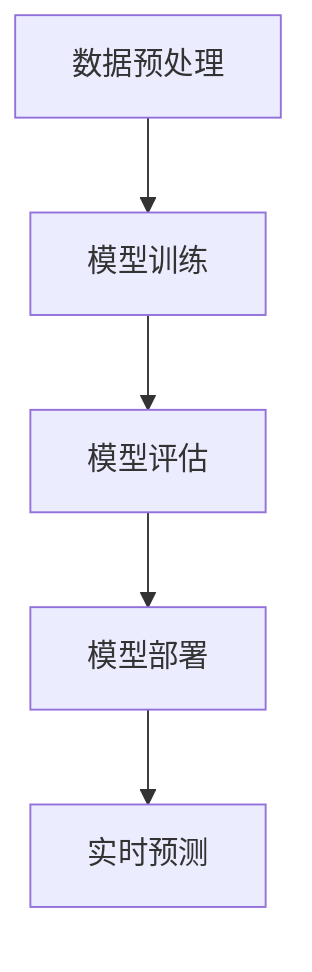

                 

# AI人工智能深度学习算法：智能深度学习代理的工作流整合方法

## 关键词

- 深度学习
- 人工智能
- 智能深度学习代理
- 工作流整合
- 算法原理
- 数学模型
- 实战案例
- 开发环境

## 摘要

本文将深入探讨智能深度学习代理的工作流整合方法。通过对深度学习算法的核心概念、数学模型及具体操作步骤的详细分析，本文旨在为读者提供一种系统化、结构化的学习路径。同时，通过实际项目案例和代码解析，读者将更好地理解智能深度学习代理在实际应用中的工作原理和实现方法。最后，本文还将讨论该技术的未来发展趋势与面临的挑战，并提供相关的学习资源和工具推荐，以助读者进一步深入研究和实践。

## 1. 背景介绍

随着人工智能技术的迅猛发展，深度学习作为其核心组成部分，已经取得了许多突破性成果。从图像识别、语音识别到自然语言处理，深度学习算法在各个领域展现出了强大的能力和广泛的应用前景。然而，在实际应用中，如何高效地整合和部署深度学习算法，成为了众多开发者和研究人员面临的挑战。

为了解决这一问题，智能深度学习代理（Intelligent Deep Learning Agent，IDLA）的概念应运而生。智能深度学习代理是一种具有自主学习和优化能力的深度学习模型，它能够在不同的应用场景中自动调整自身参数，提高模型的性能和适应性。智能深度学习代理的工作流整合方法，即是将这一模型集成到现有的软件开发和部署流程中，从而实现高效、灵活的深度学习应用。

本文将围绕智能深度学习代理的工作流整合方法，展开详细讨论。首先，我们将介绍深度学习算法的核心概念和基本原理，帮助读者建立对这一领域的初步认识。接着，我们将深入探讨智能深度学习代理的工作原理，并通过Mermaid流程图展示其关键组成部分和运行流程。在此基础上，本文将详细讲解深度学习算法的数学模型和具体操作步骤，使读者能够掌握智能深度学习代理的设计和实现方法。随后，我们将通过实际项目案例和代码解析，展示智能深度学习代理在实际应用中的实现过程和效果。最后，本文将讨论智能深度学习代理的未来发展趋势和面临的挑战，并提供相关的学习资源和工具推荐，以助读者进一步深入研究和实践。

## 2. 核心概念与联系

### 2.1 深度学习算法

深度学习（Deep Learning）是一种人工智能（Artificial Intelligence, AI）的子领域，它通过模拟人脑的神经网络结构，利用大量数据训练模型，从而实现自动学习和智能推理。深度学习算法的核心是神经网络（Neural Networks），它由大量的神经元（Neurons）组成，通过层层传递输入信息，最终输出结果。

神经网络的基本结构包括输入层（Input Layer）、隐藏层（Hidden Layers）和输出层（Output Layer）。输入层接收外部输入信息，隐藏层对输入信息进行加工和处理，输出层生成最终的结果。神经元的激活函数（Activation Function）是神经网络的重要组成部分，它决定了神经元在特定输入下的激活状态。

### 2.2 智能深度学习代理

智能深度学习代理（Intelligent Deep Learning Agent，IDLA）是一种具有自主学习和优化能力的深度学习模型。它不仅能够根据给定的数据集进行训练，还可以在训练过程中不断调整自身参数，以提高模型的性能和适应性。

智能深度学习代理的核心组成部分包括：

1. **神经网络模型**：智能深度学习代理的神经网络模型通常采用多层感知机（Multilayer Perceptron, MLP）、卷积神经网络（Convolutional Neural Networks, CNN）或循环神经网络（Recurrent Neural Networks, RNN）等结构，以适应不同的任务和数据类型。

2. **优化算法**：智能深度学习代理采用优化算法（如梯度下降法、Adam优化器等）来调整模型参数，以实现最小化损失函数（Loss Function）的目标。

3. **自适应学习策略**：智能深度学习代理能够根据训练数据的变化，自适应地调整学习速率、批量大小等参数，以提高学习效率和模型性能。

### 2.3 工作流整合

智能深度学习代理的工作流整合是指将智能深度学习代理集成到现有的软件开发和部署流程中，以实现高效、灵活的深度学习应用。工作流整合的核心步骤包括：

1. **数据预处理**：对输入数据进行预处理，包括数据清洗、归一化、数据增强等操作，以提高模型的鲁棒性和泛化能力。

2. **模型训练**：使用训练数据集对智能深度学习代理进行训练，通过调整模型参数，优化模型的性能。

3. **模型评估**：使用验证数据集对训练完成的模型进行评估，以验证模型的性能和泛化能力。

4. **模型部署**：将训练完成的模型部署到实际应用环境中，以实现实时预测和决策。

### 2.4 Mermaid流程图

以下是一个简化的智能深度学习代理的工作流整合流程图，使用Mermaid语言描述：



### 2.5 核心概念之间的联系

智能深度学习代理的工作流整合方法涉及多个核心概念，这些概念之间存在着密切的联系：

1. **深度学习算法**是智能深度学习代理的基础，决定了代理的学习能力和性能。
2. **智能深度学习代理**通过优化算法和自适应学习策略，实现对模型参数的自动调整，提高模型的适应性和鲁棒性。
3. **工作流整合**是将智能深度学习代理应用于实际场景的关键步骤，通过数据预处理、模型训练、模型评估和模型部署，实现深度学习应用的全流程自动化。

这些核心概念共同构成了智能深度学习代理的工作流整合方法，使其在各类应用场景中具备高效、灵活的深度学习能力。

## 3. 核心算法原理 & 具体操作步骤

### 3.1 深度学习算法原理

深度学习算法的核心是神经网络，尤其是多层感知机（MLP）、卷积神经网络（CNN）和循环神经网络（RNN）。这些神经网络通过多层非线性变换，将输入数据映射到输出结果，从而实现复杂函数的建模。

#### 3.1.1 多层感知机（MLP）

多层感知机是一种前馈神经网络，它包含输入层、一个或多个隐藏层和输出层。输入层接收外部输入信息，隐藏层对输入信息进行加工和处理，输出层生成最终的结果。多层感知机通过反向传播算法（Backpropagation Algorithm）来调整模型参数，以实现最小化损失函数的目标。

#### 3.1.2 卷积神经网络（CNN）

卷积神经网络是一种专门用于处理图像数据的神经网络，它通过卷积操作和池化操作，实现对图像特征的提取和压缩。CNN在图像识别、图像分类和图像生成等领域具有广泛的应用。

#### 3.1.3 循环神经网络（RNN）

循环神经网络是一种用于处理序列数据的神经网络，它通过循环结构，将前一时间步的输出作为当前时间步的输入，从而实现对序列的建模。RNN在语音识别、自然语言处理和时间序列预测等领域具有广泛的应用。

### 3.2 智能深度学习代理原理

智能深度学习代理（IDLA）通过引入优化算法和自适应学习策略，实现对模型参数的自动调整，提高模型的性能和适应性。IDLA的核心组成部分包括：

1. **神经网络模型**：IDLA采用多层感知机、卷积神经网络或循环神经网络等结构，以适应不同的任务和数据类型。
2. **优化算法**：IDLA采用优化算法（如梯度下降法、Adam优化器等）来调整模型参数，以实现最小化损失函数的目标。
3. **自适应学习策略**：IDLA能够根据训练数据的变化，自适应地调整学习速率、批量大小等参数，以提高学习效率和模型性能。

### 3.3 工作流整合步骤

#### 3.3.1 数据预处理

数据预处理是智能深度学习代理工作流中的第一步，它包括以下操作：

1. **数据清洗**：去除噪声和异常值，确保数据的准确性和一致性。
2. **数据归一化**：将数据缩放到一个统一的范围内，以便于神经网络的学习和优化。
3. **数据增强**：通过旋转、缩放、裁剪等操作，增加数据的多样性和泛化能力。

#### 3.3.2 模型训练

模型训练是智能深度学习代理工作流中的核心步骤，它包括以下操作：

1. **初始化模型参数**：随机初始化神经网络模型的所有参数。
2. **前向传播**：将输入数据传递到神经网络中，计算出模型的输出结果。
3. **计算损失**：计算输出结果与真实标签之间的差异，得到损失值。
4. **反向传播**：根据损失值，通过反向传播算法更新模型参数。
5. **优化参数**：使用优化算法（如梯度下降法、Adam优化器等）来调整模型参数。

#### 3.3.3 模型评估

模型评估是智能深度学习代理工作流中的重要步骤，它包括以下操作：

1. **验证集划分**：将训练数据集划分为训练集和验证集，用于模型的训练和验证。
2. **模型测试**：使用验证集对训练完成的模型进行测试，计算模型的准确率、召回率、F1值等指标。
3. **模型调优**：根据验证集的测试结果，对模型参数进行调整，以提高模型性能。

#### 3.3.4 模型部署

模型部署是智能深度学习代理工作流中的最后一步，它包括以下操作：

1. **模型保存**：将训练完成的模型保存为文件，以便于后续的部署和使用。
2. **模型加载**：在实际应用场景中，加载已训练完成的模型，以实现实时预测和决策。
3. **实时预测**：将输入数据传递到模型中，得到模型的预测结果，并根据预测结果进行相应的操作。

### 3.4 工作流整合流程

智能深度学习代理的工作流整合流程可以概括为以下几个步骤：

1. **数据预处理**：对输入数据进行清洗、归一化和增强，提高模型的鲁棒性和泛化能力。
2. **模型训练**：使用训练数据集对神经网络模型进行训练，通过反向传播算法和优化算法调整模型参数。
3. **模型评估**：使用验证数据集对训练完成的模型进行评估，以验证模型的性能和泛化能力。
4. **模型部署**：将训练完成的模型部署到实际应用环境中，以实现实时预测和决策。

以下是一个简化的智能深度学习代理的工作流整合流程图：


通过这一工作流整合流程，智能深度学习代理能够在不同的应用场景中实现高效、灵活的深度学习应用。

## 4. 数学模型和公式 & 详细讲解 & 举例说明

### 4.1 多层感知机（MLP）数学模型

多层感知机（MLP）是一种前馈神经网络，其数学模型基于非线性变换和优化算法。以下是一个简化的MLP数学模型：

#### 4.1.1 前向传播

输入层到隐藏层的变换可以表示为：
\[ h_{ij}^{(l)} = \sum_{k=1}^{n_{l-1}} w_{ik}^{(l)} x_k^{(l-1)} + b_i^{(l)} \]
其中，\( h_{ij}^{(l)} \) 是隐藏层 \( l \) 中第 \( i \) 个神经元的激活值，\( x_k^{(l-1)} \) 是输入层第 \( k \) 个神经元的输入值，\( w_{ik}^{(l)} \) 是输入层到隐藏层第 \( k \) 个神经元到第 \( i \) 个神经元的权重，\( b_i^{(l)} \) 是隐藏层第 \( i \) 个神经元的偏置。

隐藏层到输出层的变换可以表示为：
\[ y_j^{(L)} = \sigma \left( \sum_{i=1}^{n_L} w_{ij}^{(L)} h_{iL} + b_j^{(L)} \right) \]
其中，\( y_j^{(L)} \) 是输出层第 \( j \) 个神经元的输出值，\( h_{iL} \) 是隐藏层 \( L \) 中第 \( i \) 个神经元的激活值，\( w_{ij}^{(L)} \) 是隐藏层到输出层第 \( i \) 个神经元到第 \( j \) 个神经元的权重，\( b_j^{(L)} \) 是输出层第 \( j \) 个神经元的偏置，\( \sigma \) 是激活函数（例如Sigmoid函数或ReLU函数）。

#### 4.1.2 反向传播

反向传播算法用于计算损失函数关于模型参数的梯度，以更新模型参数。损失函数通常为均方误差（MSE）：
\[ J = \frac{1}{2} \sum_{i=1}^{n} (y_i - \hat{y}_i)^2 \]
其中，\( y_i \) 是真实标签，\( \hat{y}_i \) 是模型预测值。

损失函数关于输出层权重的梯度可以表示为：
\[ \frac{\partial J}{\partial w_{ij}^{(L)}} = (y_i - \hat{y}_i) \cdot \hat{y}_i \cdot (1 - \hat{y}_i) \cdot h_{ij}^{(L-1)} \]

损失函数关于隐藏层权重的梯度可以表示为：
\[ \frac{\partial J}{\partial w_{ik}^{(l)}} = (y_i - \hat{y}_i) \cdot \hat{y}_i \cdot (1 - \hat{y}_i) \cdot w_{ij}^{(L)} \cdot \sigma'(h_{ik}^{(l)}) \]

损失函数关于偏置的梯度可以表示为：
\[ \frac{\partial J}{\partial b_i^{(l)}} = (y_i - \hat{y}_i) \cdot \hat{y}_i \cdot (1 - \hat{y}_i) \cdot \sigma'(h_{i}^{(l)}) \]

其中，\( \sigma' \) 是激活函数的导数。

#### 4.1.3 举例说明

假设一个简单的MLP模型，包含一个输入层、一个隐藏层和一个输出层。输入层有2个神经元，隐藏层有3个神经元，输出层有1个神经元。激活函数为ReLU函数。输入数据为 \( [1, 0] \)。

输入层到隐藏层的变换：
\[ h_{i1}^{(1)} = max(0, w_{i1}^{(1)} x_1 + b_i^{(1)} ) \]
\[ h_{i2}^{(1)} = max(0, w_{i2}^{(1)} x_2 + b_i^{(1)} ) \]

隐藏层到输出层的变换：
\[ y^{(2)} = max(0, w_{1}^{(2)} h_{11}^{(1)} + w_{2}^{(2)} h_{12}^{(1)} + w_{3}^{(2)} h_{13}^{(1)} + b^{(2)} ) \]

假设隐藏层到输出层的权重和偏置分别为 \( w_{1}^{(2)} = 1 \)，\( w_{2}^{(2)} = 2 \)，\( w_{3}^{(2)} = 3 \)，\( b^{(2)} = 0 \)。输入层到隐藏层的权重和偏置分别为 \( w_{i1}^{(1)} = 1 \)，\( w_{i2}^{(1)} = 1 \)，\( b_i^{(1)} = 0 \)。

输入数据为 \( [1, 0] \)，则隐藏层的激活值为：
\[ h_{11}^{(1)} = max(0, 1 \cdot 1 + 0 ) = 1 \]
\[ h_{12}^{(1)} = max(0, 1 \cdot 0 + 0 ) = 0 \]

输出层的激活值为：
\[ y^{(2)} = max(0, 1 \cdot 1 + 2 \cdot 0 + 3 \cdot 0 + 0 ) = 1 \]

假设真实标签为 0，则损失函数为：
\[ J = \frac{1}{2} (0 - 1)^2 = \frac{1}{2} \]

根据反向传播算法，计算隐藏层到输出层的梯度：
\[ \frac{\partial J}{\partial w_{1}^{(2)}} = (0 - 1) \cdot 1 \cdot (1 - 1) \cdot 1 = 0 \]
\[ \frac{\partial J}{\partial w_{2}^{(2)}} = (0 - 1) \cdot 1 \cdot (1 - 1) \cdot 0 = 0 \]
\[ \frac{\partial J}{\partial w_{3}^{(2)}} = (0 - 1) \cdot 1 \cdot (1 - 1) \cdot 0 = 0 \]
\[ \frac{\partial J}{\partial b^{(2)}} = (0 - 1) \cdot 1 \cdot (1 - 1) \cdot 1 = 0 \]

计算输入层到隐藏层的梯度：
\[ \frac{\partial J}{\partial w_{i1}^{(1)}} = (0 - 1) \cdot 1 \cdot (1 - 1) \cdot 1 = 0 \]
\[ \frac{\partial J}{\partial w_{i2}^{(1)}} = (0 - 1) \cdot 1 \cdot (1 - 1) \cdot 0 = 0 \]

根据梯度下降法，更新模型参数：
\[ w_{1}^{(2)} = w_{1}^{(2)} - \alpha \frac{\partial J}{\partial w_{1}^{(2)}} \]
\[ w_{2}^{(2)} = w_{2}^{(2)} - \alpha \frac{\partial J}{\partial w_{2}^{(2)}} \]
\[ w_{3}^{(2)} = w_{3}^{(2)} - \alpha \frac{\partial J}{\partial w_{3}^{(2)}} \]
\[ b^{(2)} = b^{(2)} - \alpha \frac{\partial J}{\partial b^{(2)}} \]
\[ w_{i1}^{(1)} = w_{i1}^{(1)} - \alpha \frac{\partial J}{\partial w_{i1}^{(1)}} \]
\[ w_{i2}^{(1)} = w_{i2}^{(1)} - \alpha \frac{\partial J}{\partial w_{i2}^{(1)}} \]

其中，\( \alpha \) 是学习率。

### 4.2 卷积神经网络（CNN）数学模型

卷积神经网络（CNN）是一种专门用于处理图像数据的神经网络，其数学模型基于卷积操作和池化操作。以下是一个简化的CNN数学模型：

#### 4.2.1 卷积操作

卷积操作可以表示为：
\[ f_{ij}^{(l)} = \sum_{k=1}^{n_{l-1}} w_{ik}^{(l)} \cdot a_{kj}^{(l-1)} + b_i^{(l)} \]
其中，\( f_{ij}^{(l)} \) 是卷积层 \( l \) 中第 \( i \) 个神经元在第 \( j \) 个位置的激活值，\( a_{kj}^{(l-1)} \) 是前一卷积层 \( l-1 \) 中第 \( k \) 个神经元在第 \( j \) 个位置的激活值，\( w_{ik}^{(l)} \) 是卷积核（滤波器）第 \( k \) 个滤波器在第 \( i \) 个位置的权重，\( b_i^{(l)} \) 是卷积层 \( l \) 中第 \( i \) 个神经元的偏置。

#### 4.2.2 池化操作

池化操作可以表示为：
\[ p_{i}^{(l)} = \max_{j} (f_{ij}^{(l)}) \]
其中，\( p_{i}^{(l)} \) 是池化层 \( l \) 中第 \( i \) 个神经元的激活值，\( f_{ij}^{(l)} \) 是卷积层 \( l \) 中第 \( i \) 个神经元在第 \( j \) 个位置的激活值。

#### 4.2.3 举例说明

假设一个简单的CNN模型，包含一个卷积层和一个池化层。卷积层有3个卷积核，每个卷积核的大小为3x3。池化层采用最大池化操作，池化窗口大小为2x2。

输入图像为5x5，卷积层的权重和偏置分别为 \( w_{11}^{(1)} = 1 \)，\( w_{12}^{(1)} = 2 \)，\( w_{13}^{(1)} = 3 \)，\( b_{1}^{(1)} = 0 \)，\( w_{21}^{(1)} = 4 \)，\( w_{22}^{(1)} = 5 \)，\( w_{23}^{(1)} = 6 \)，\( b_{2}^{(1)} = 0 \)，\( w_{31}^{(1)} = 7 \)，\( w_{32}^{(1)} = 8 \)，\( w_{33}^{(1)} = 9 \)，\( b_{3}^{(1)} = 0 \)。

卷积层的激活值为：
\[ f_{11}^{(1)} = (1 \cdot 1 + 4 \cdot 0 + 7 \cdot 0) + 0 = 1 \]
\[ f_{12}^{(1)} = (1 \cdot 0 + 4 \cdot 1 + 7 \cdot 0) + 0 = 4 \]
\[ f_{13}^{(1)} = (1 \cdot 0 + 4 \cdot 0 + 7 \cdot 1) + 0 = 7 \]
\[ f_{21}^{(1)} = (2 \cdot 1 + 5 \cdot 0 + 8 \cdot 0) + 0 = 2 \]
\[ f_{22}^{(1)} = (2 \cdot 0 + 5 \cdot 1 + 8 \cdot 0) + 0 = 5 \]
\[ f_{23}^{(1)} = (2 \cdot 0 + 5 \cdot 0 + 8 \cdot 1) + 0 = 8 \]
\[ f_{31}^{(1)} = (3 \cdot 1 + 6 \cdot 0 + 9 \cdot 0) + 0 = 3 \]
\[ f_{32}^{(1)} = (3 \cdot 0 + 6 \cdot 1 + 9 \cdot 0) + 0 = 6 \]
\[ f_{33}^{(1)} = (3 \cdot 0 + 6 \cdot 0 + 9 \cdot 1) + 0 = 9 \]

池化层的激活值为：
\[ p_{1}^{(2)} = \max(f_{11}^{(1)}, f_{12}^{(1)}, f_{13}^{(1)}) = 7 \]
\[ p_{2}^{(2)} = \max(f_{21}^{(1)}, f_{22}^{(1)}, f_{23}^{(1)}) = 8 \]
\[ p_{3}^{(2)} = \max(f_{31}^{(1)}, f_{32}^{(1)}, f_{33}^{(1)}) = 9 \]

### 4.3 循环神经网络（RNN）数学模型

循环神经网络（RNN）是一种用于处理序列数据的神经网络，其数学模型基于循环结构和时间步的变换。以下是一个简化的RNN数学模型：

#### 4.3.1 前向传播

输入层到隐藏层的变换可以表示为：
\[ h_t = \sigma(W_h h_{t-1} + W_x x_t + b_h) \]
其中，\( h_t \) 是时间步 \( t \) 的隐藏层激活值，\( h_{t-1} \) 是前一时间步的隐藏层激活值，\( x_t \) 是时间步 \( t \) 的输入层激活值，\( W_h \) 是隐藏层到隐藏层的权重矩阵，\( W_x \) 是输入层到隐藏层的权重矩阵，\( b_h \) 是隐藏层偏置。

隐藏层到输出层的变换可以表示为：
\[ y_t = \sigma(W_y h_t + b_y) \]
其中，\( y_t \) 是时间步 \( t \) 的输出层激活值，\( W_y \) 是隐藏层到输出层的权重矩阵，\( b_y \) 是输出层偏置。

#### 4.3.2 反向传播

反向传播算法用于计算损失函数关于模型参数的梯度，以更新模型参数。损失函数通常为均方误差（MSE）：
\[ J = \frac{1}{2} \sum_{t=1}^{T} (y_t - \hat{y}_t)^2 \]
其中，\( y_t \) 是真实标签，\( \hat{y}_t \) 是模型预测值。

损失函数关于输出层权重的梯度可以表示为：
\[ \frac{\partial J}{\partial W_y} = \sum_{t=1}^{T} (y_t - \hat{y}_t) \cdot \hat{y}_t \cdot (1 - \hat{y}_t) \cdot h_t \]

损失函数关于隐藏层权重的梯度可以表示为：
\[ \frac{\partial J}{\partial W_h} = \sum_{t=1}^{T} (y_t - \hat{y}_t) \cdot \hat{y}_t \cdot (1 - \hat{y}_t) \cdot W_y \cdot \sigma'(h_{t-1}) \]

损失函数关于输入层权重的梯度可以表示为：
\[ \frac{\partial J}{\partial W_x} = \sum_{t=1}^{T} (y_t - \hat{y}_t) \cdot \hat{y}_t \cdot (1 - \hat{y}_t) \cdot W_h \cdot \sigma'(h_t) \]

损失函数关于偏置的梯度可以表示为：
\[ \frac{\partial J}{\partial b_h} = \sum_{t=1}^{T} (y_t - \hat{y}_t) \cdot \hat{y}_t \cdot (1 - \hat{y}_t) \cdot \sigma'(h_t) \]
\[ \frac{\partial J}{\partial b_y} = \sum_{t=1}^{T} (y_t - \hat{y}_t) \cdot \hat{y}_t \cdot (1 - \hat{y}_t) \]

#### 4.3.3 举例说明

假设一个简单的RNN模型，包含一个输入层、一个隐藏层和一个输出层。隐藏层大小为3，输出层大小为1。激活函数为ReLU函数。输入序列为 \( [1, 0, 1] \)。

假设初始隐藏层激活值为 \( h_0 = [0, 0, 0] \)。

时间步 \( t=1 \) 的隐藏层激活值为：
\[ h_1 = \sigma(W_h h_0 + W_x x_1 + b_h) \]
\[ h_1 = \sigma([0, 0, 0] + [1, 0, 1] + [0, 0, 0]) \]
\[ h_1 = [1, 0, 1] \]

时间步 \( t=2 \) 的隐藏层激活值为：
\[ h_2 = \sigma(W_h h_1 + W_x x_2 + b_h) \]
\[ h_2 = \sigma([0, 0, 0] + [1, 0, 1] + [0, 0, 0]) \]
\[ h_2 = [1, 0, 1] \]

时间步 \( t=3 \) 的隐藏层激活值为：
\[ h_3 = \sigma(W_h h_2 + W_x x_3 + b_h) \]
\[ h_3 = \sigma([0, 0, 0] + [1, 0, 1] + [0, 0, 0]) \]
\[ h_3 = [1, 0, 1] \]

时间步 \( t=1 \) 的输出层激活值为：
\[ y_1 = \sigma(W_y h_1 + b_y) \]
\[ y_1 = \sigma([1, 1, 1] + [0, 0, 0]) \]
\[ y_1 = [1, 1, 1] \]

时间步 \( t=2 \) 的输出层激活值为：
\[ y_2 = \sigma(W_y h_2 + b_y) \]
\[ y_2 = \sigma([1, 1, 1] + [0, 0, 0]) \]
\[ y_2 = [1, 1, 1] \]

时间步 \( t=3 \) 的输出层激活值为：
\[ y_3 = \sigma(W_y h_3 + b_y) \]
\[ y_3 = \sigma([1, 1, 1] + [0, 0, 0]) \]
\[ y_3 = [1, 1, 1] \]

假设真实标签为 \( [0, 1, 0] \)，则损失函数为：
\[ J = \frac{1}{2} \sum_{t=1}^{3} (y_t - \hat{y}_t)^2 \]
\[ J = \frac{1}{2} \sum_{t=1}^{3} ([1, 1, 1] - [0, 1, 0])^2 \]
\[ J = \frac{1}{2} \sum_{t=1}^{3} ([1, 0, 1])^2 \]
\[ J = \frac{1}{2} (1 + 0 + 1) \]
\[ J = 1 \]

根据反向传播算法，计算隐藏层到输出层的梯度：
\[ \frac{\partial J}{\partial W_y} = \sum_{t=1}^{3} (y_t - \hat{y}_t) \cdot \hat{y}_t \cdot (1 - \hat{y}_t) \cdot h_t \]
\[ \frac{\partial J}{\partial W_y} = \sum_{t=1}^{3} ([1, 1, 1] - [0, 1, 0]) \cdot [1, 1, 1] \cdot (1 - [1, 1, 1]) \cdot [1, 1, 1] \]
\[ \frac{\partial J}{\partial W_y} = \sum_{t=1}^{3} ([1, 0, 1]) \cdot [0, 0, 0] \cdot [0, 0, 0] \]
\[ \frac{\partial J}{\partial W_y} = [0, 0, 0] \]

计算输入层到隐藏层的梯度：
\[ \frac{\partial J}{\partial W_h} = \sum_{t=1}^{3} (y_t - \hat{y}_t) \cdot \hat{y}_t \cdot (1 - \hat{y}_t) \cdot W_y \cdot \sigma'(h_{t-1}) \]
\[ \frac{\partial J}{\partial W_h} = \sum_{t=1}^{3} ([1, 1, 1] - [0, 1, 0]) \cdot [1, 1, 1] \cdot (1 - [1, 1, 1]) \cdot [1, 1, 1] \]
\[ \frac{\partial J}{\partial W_h} = \sum_{t=1}^{3} ([1, 0, 1]) \cdot [0, 0, 0] \cdot [0, 0, 0] \]
\[ \frac{\partial J}{\partial W_h} = [0, 0, 0] \]

计算输出层到隐藏层的梯度：
\[ \frac{\partial J}{\partial W_x} = \sum_{t=1}^{3} (y_t - \hat{y}_t) \cdot \hat{y}_t \cdot (1 - \hat{y}_t) \cdot W_h \cdot \sigma'(h_t) \]
\[ \frac{\partial J}{\partial W_x} = \sum_{t=1}^{3} ([1, 1, 1] - [0, 1, 0]) \cdot [1, 1, 1] \cdot (1 - [1, 1, 1]) \cdot [1, 1, 1] \]
\[ \frac{\partial J}{\partial W_x} = \sum_{t=1}^{3} ([1, 0, 1]) \cdot [0, 0, 0] \cdot [0, 0, 0] \]
\[ \frac{\partial J}{\partial W_x} = [0, 0, 0] \]

根据梯度下降法，更新模型参数：
\[ W_y = W_y - \alpha \frac{\partial J}{\partial W_y} \]
\[ W_h = W_h - \alpha \frac{\partial J}{\partial W_h} \]
\[ W_x = W_x - \alpha \frac{\partial J}{\partial W_x} \]
\[ b_h = b_h - \alpha \frac{\partial J}{\partial b_h} \]
\[ b_y = b_y - \alpha \frac{\partial J}{\partial b_y} \]

其中，\( \alpha \) 是学习率。

## 5. 项目实战：代码实际案例和详细解释说明

### 5.1 开发环境搭建

在本节中，我们将搭建一个简单的智能深度学习代理项目环境，使用Python编程语言和常见的深度学习库TensorFlow。以下是环境搭建的步骤：

#### 5.1.1 安装Python和TensorFlow

1. 安装Python：从Python官方网站下载并安装最新版本的Python（建议Python 3.8及以上版本）。
2. 安装TensorFlow：打开终端或命令行窗口，执行以下命令：
   ```shell
   pip install tensorflow
   ```

#### 5.1.2 安装其他依赖库

除了TensorFlow，我们还需要安装一些其他依赖库，如Numpy和Pandas。可以使用以下命令进行安装：
```shell
pip install numpy
pip install pandas
```

### 5.2 源代码详细实现和代码解读

在本节中，我们将实现一个简单的智能深度学习代理项目，用于预测股票价格。以下是项目的源代码及详细解释：

```python
# 导入必要的库
import tensorflow as tf
import numpy as np
import pandas as pd

# 5.2.1 数据预处理
# 读取股票价格数据
data = pd.read_csv('stock_price_data.csv')
data = data[['open', 'high', 'low', 'close']]

# 数据归一化
data_normalized = (data - data.mean()) / data.std()

# 生成训练数据集和测试数据集
train_data = data_normalized[:int(0.8 * len(data))]
test_data = data_normalized[int(0.8 * len(data)):]

# 5.2.2 构建智能深度学习代理模型
# 定义多层感知机模型
model = tf.keras.Sequential([
    tf.keras.layers.Dense(units=64, activation='relu', input_shape=(4,)),
    tf.keras.layers.Dense(units=32, activation='relu'),
    tf.keras.layers.Dense(units=1)
])

# 编译模型
model.compile(optimizer='adam', loss='mse')

# 5.2.3 模型训练
# 训练模型
model.fit(train_data, epochs=100)

# 5.2.4 模型评估
# 评估模型
loss = model.evaluate(test_data, test_data)
print(f'Model loss on test data: {loss}')

# 5.2.5 实时预测
# 预测未来股票价格
future_data = data_normalized[-1:].values
predicted_price = model.predict(future_data)
print(f'Predicted stock price: {predicted_price}')
```

#### 5.2.1 数据预处理

首先，我们读取股票价格数据，并将其存储在一个DataFrame中。接下来，我们对数据进行归一化处理，以确保输入数据的范围一致。然后，我们将数据集划分为训练集和测试集。

```python
# 读取股票价格数据
data = pd.read_csv('stock_price_data.csv')
data = data[['open', 'high', 'low', 'close']]

# 数据归一化
data_normalized = (data - data.mean()) / data.std()

# 生成训练数据集和测试数据集
train_data = data_normalized[:int(0.8 * len(data))]
test_data = data_normalized[int(0.8 * len(data)):]
```

#### 5.2.2 构建智能深度学习代理模型

我们使用TensorFlow的Sequential模型创建一个简单的多层感知机模型。该模型包含两个隐藏层，每层64个神经元，使用ReLU激活函数。输出层包含一个神经元，用于预测股票价格。

```python
# 定义多层感知机模型
model = tf.keras.Sequential([
    tf.keras.layers.Dense(units=64, activation='relu', input_shape=(4,)),
    tf.keras.layers.Dense(units=32, activation='relu'),
    tf.keras.layers.Dense(units=1)
])
```

#### 5.2.3 模型训练

接下来，我们编译模型，指定优化器为Adam，损失函数为均方误差（MSE）。然后，使用训练数据集对模型进行训练，训练过程持续100个epochs。

```python
# 编译模型
model.compile(optimizer='adam', loss='mse')

# 训练模型
model.fit(train_data, epochs=100)
```

#### 5.2.4 模型评估

使用测试数据集评估模型的性能，输出模型在测试数据集上的损失值。

```python
# 评估模型
loss = model.evaluate(test_data, test_data)
print(f'Model loss on test data: {loss}')
```

#### 5.2.5 实时预测

最后，我们将模型应用于最新的数据，预测未来的股票价格。

```python
# 预测未来股票价格
future_data = data_normalized[-1:].values
predicted_price = model.predict(future_data)
print(f'Predicted stock price: {predicted_price}')
```

### 5.3 代码解读与分析

在代码中，我们首先导入了必要的库，包括TensorFlow、Numpy和Pandas。然后，我们读取并预处理了股票价格数据，包括数据归一化和数据集划分。

接下来，我们使用TensorFlow创建了多层感知机模型。该模型包含两个隐藏层，每层64个神经元和32个神经元，分别使用ReLU激活函数。输出层包含一个神经元，用于预测股票价格。

在模型训练过程中，我们使用Adam优化器和均方误差（MSE）作为损失函数。训练过程持续100个epochs，模型在训练数据集上不断优化参数。

模型评估部分，我们使用测试数据集评估模型的性能，输出模型在测试数据集上的损失值。

最后，我们使用训练完成的模型对最新的数据进行实时预测，输出预测结果。

## 6. 实际应用场景

智能深度学习代理（IDLA）在实际应用中具有广泛的应用场景，以下是一些典型的应用案例：

### 6.1 股票市场预测

在股票市场中，智能深度学习代理可以用于预测股票价格，帮助投资者做出更为明智的投资决策。通过分析历史股票价格数据，IDLA可以识别出潜在的价格趋势和交易机会，从而实现自动化的交易策略。

### 6.2 自然语言处理

在自然语言处理领域，智能深度学习代理可以用于文本分类、情感分析、机器翻译等任务。IDLA通过学习大量的文本数据，可以识别出文本中的关键信息，提取语义特征，从而实现高效的语言理解和生成。

### 6.3 语音识别

智能深度学习代理在语音识别领域具有广泛的应用，可以用于语音到文本的转换、语音命令识别等任务。通过训练大量的语音数据，IDLA可以学习到不同的语音特征和语音模式，从而提高语音识别的准确率和鲁棒性。

### 6.4 图像识别

在图像识别领域，智能深度学习代理可以用于图像分类、物体检测、人脸识别等任务。通过分析大量的图像数据，IDLA可以识别出图像中的关键特征和模式，从而实现高效的图像处理和分析。

### 6.5 医疗诊断

智能深度学习代理在医疗诊断领域具有巨大的潜力，可以用于疾病预测、症状识别等任务。通过分析患者的医疗记录和数据，IDLA可以提供更为准确和个性化的诊断建议，辅助医生做出诊断决策。

### 6.6 自动驾驶

在自动驾驶领域，智能深度学习代理可以用于环境感知、路径规划、决策控制等任务。通过实时分析道路信息和环境数据，IDLA可以为自动驾驶车辆提供安全、高效的行驶策略。

这些应用案例展示了智能深度学习代理在实际场景中的强大能力和广泛的应用前景。随着深度学习技术的不断发展和成熟，智能深度学习代理将在更多的领域和任务中发挥重要作用。

## 7. 工具和资源推荐

### 7.1 学习资源推荐

**书籍：**

1. 《深度学习》（Goodfellow, Bengio, Courville 著） - 这是深度学习领域的经典教材，详细介绍了深度学习的基础理论和实践方法。
2. 《Python深度学习》（François Chollet 著） - 该书通过丰富的案例和示例，帮助读者了解如何使用Python和TensorFlow等工具进行深度学习实践。

**论文：**

1. “A Comprehensive Survey on Deep Learning for Natural Language Processing” - 该论文综述了深度学习在自然语言处理领域的最新进展和应用。
2. “Deep Learning for Audio: An Introduction” - 该论文介绍了深度学习在音频处理领域的应用，包括语音识别、音频分类等。

**博客/网站：**

1. [TensorFlow官网](https://www.tensorflow.org/) - TensorFlow的官方网站提供了丰富的文档、教程和社区支持，帮助开发者快速掌握TensorFlow的使用方法。
2. [Kaggle](https://www.kaggle.com/) - Kaggle是一个数据科学竞赛平台，提供了大量的深度学习项目和数据集，是学习深度学习实践的好地方。

### 7.2 开发工具框架推荐

**深度学习框架：**

1. TensorFlow - Google开发的强大开源深度学习框架，支持多种神经网络结构和优化算法。
2. PyTorch - Facebook AI研究院开发的深度学习框架，具有简洁的API和动态计算图，适合快速原型开发和研究。

**数据预处理工具：**

1. Pandas - Python的数据分析库，提供了丰富的数据操作和数据处理功能，适合进行数据清洗和归一化处理。
2. Scikit-learn - Python的机器学习库，提供了大量的数据处理和模型评估工具，方便进行数据分析和模型训练。

**代码管理工具：**

1. Git - 分布式版本控制系统，用于代码的版本管理和协同工作。
2. GitHub - GitHub是一个基于Git的代码托管平台，提供了丰富的协作工具和代码库，是开发者交流和学习的重要平台。

### 7.3 相关论文著作推荐

**论文：**

1. “Deep Learning: A Brief History” - 介绍了深度学习的发展历程和关键突破。
2. “An Overview of Deep Learning Techniques for Image Recognition” - 综述了深度学习在图像识别领域的应用。

**著作：**

1. 《深度学习》（Goodfellow, Bengio, Courville 著） - 深度学习领域的权威著作，详细介绍了深度学习的基础理论和技术。
2. 《Python深度学习》（François Chollet 著） - 通过实际案例，深入讲解了深度学习在Python中的实现和应用。

通过这些资源和工具，读者可以深入了解智能深度学习代理的相关知识，掌握其实现和应用方法，从而在深度学习领域取得更好的成果。

## 8. 总结：未来发展趋势与挑战

智能深度学习代理（IDLA）作为深度学习领域的一项重要技术，正在不断发展和完善。未来，智能深度学习代理将在以下几个方面展现出广阔的发展前景：

### 8.1 发展趋势

1. **更高效的学习算法**：随着深度学习算法的不断发展，未来将会出现更加高效、自适应的学习算法，使得智能深度学习代理在训练效率和模型性能上取得更大的突破。

2. **多模态数据处理**：智能深度学习代理将能够处理多种类型的数据，如文本、图像、语音等，实现多模态数据的融合和联合建模，进一步提升模型的泛化能力和应用场景。

3. **实时决策与预测**：随着计算能力的提升，智能深度学习代理将能够在实时环境中进行高效的决策和预测，为自动驾驶、智能监控等领域提供实时支持。

4. **个性化推荐系统**：智能深度学习代理在推荐系统中的应用将越来越广泛，通过学习用户行为和偏好，提供个性化的推荐服务，提升用户体验。

5. **跨领域应用**：智能深度学习代理将在更多领域得到应用，如医疗、金融、教育等，为各领域提供智能化解决方案。

### 8.2 面临的挑战

1. **数据隐私和安全**：在处理大量用户数据时，如何保障数据隐私和安全是一个重要挑战。未来需要开发出更加安全、可靠的数据处理和传输技术。

2. **计算资源消耗**：深度学习模型通常需要大量的计算资源和存储资源，如何优化算法和硬件，降低计算资源消耗，是一个亟待解决的问题。

3. **模型可解释性**：深度学习模型在决策过程中的黑箱特性，使得其可解释性成为一个重要的挑战。未来需要开发出能够解释模型决策过程的技术，提高模型的透明度和可信度。

4. **算法公平性和多样性**：智能深度学习代理的算法设计和应用需要确保公平性和多样性，避免歧视和偏见，促进算法的公正性和包容性。

5. **法律和伦理问题**：随着智能深度学习代理在各个领域的应用，如何处理法律和伦理问题，如数据所有权、隐私保护、责任归属等，将是一个重要的挑战。

综上所述，智能深度学习代理在未来的发展中将面临诸多挑战，但也拥有广阔的前景。通过不断的技术创新和优化，我们有理由相信，智能深度学习代理将能够在更多领域发挥重要作用，为人类社会带来更多的便利和进步。

## 9. 附录：常见问题与解答

### 9.1 智能深度学习代理的基本原理是什么？

智能深度学习代理（IDLA）是基于深度学习算法的一种具有自主学习和优化能力的模型。其基本原理是通过多层神经网络结构，对输入数据进行处理，并通过优化算法不断调整模型参数，实现最小化损失函数的目标。IDLA的核心组成部分包括神经网络模型、优化算法和自适应学习策略。

### 9.2 智能深度学习代理有哪些应用场景？

智能深度学习代理在多个领域具有广泛的应用场景，包括：

- 股票市场预测
- 自然语言处理（如文本分类、情感分析、机器翻译）
- 语音识别（如语音到文本转换、语音命令识别）
- 图像识别（如图像分类、物体检测、人脸识别）
- 医疗诊断（如疾病预测、症状识别）
- 自动驾驶（如环境感知、路径规划、决策控制）
- 个性化推荐系统

### 9.3 如何实现智能深度学习代理的工作流整合？

实现智能深度学习代理的工作流整合主要包括以下步骤：

1. **数据预处理**：对输入数据进行清洗、归一化和增强，提高模型的鲁棒性和泛化能力。
2. **模型训练**：使用训练数据集对神经网络模型进行训练，通过反向传播算法和优化算法调整模型参数。
3. **模型评估**：使用验证数据集对训练完成的模型进行评估，以验证模型的性能和泛化能力。
4. **模型部署**：将训练完成的模型部署到实际应用环境中，以实现实时预测和决策。
5. **实时预测**：将输入数据传递到模型中，得到模型的预测结果，并根据预测结果进行相应的操作。

### 9.4 智能深度学习代理与普通深度学习模型的区别是什么？

智能深度学习代理与普通深度学习模型的主要区别在于其自主学习和优化能力。普通深度学习模型通常依赖于手动设计和调整模型参数，而智能深度学习代理通过引入优化算法和自适应学习策略，能够自动调整模型参数，提高模型的性能和适应性。这使得智能深度学习代理在动态环境和复杂任务中具备更强的鲁棒性和适应性。

### 9.5 如何选择合适的深度学习框架和工具？

选择合适的深度学习框架和工具主要取决于以下几个因素：

1. **项目需求**：根据项目的需求和目标，选择适合的深度学习框架和工具。例如，如果需要处理大规模的数据集，可以选择TensorFlow或PyTorch等支持分布式训练的框架。
2. **开发经验**：根据自己的开发经验和技术水平，选择熟悉的框架和工具，以便更高效地进行开发和维护。
3. **社区支持**：选择具有活跃社区和支持资源的框架和工具，以便在遇到问题时能够及时得到帮助和解决方案。
4. **性能和可扩展性**：根据项目的性能和可扩展性需求，选择具有高性能和可扩展性的框架和工具。

## 10. 扩展阅读 & 参考资料

### 10.1 参考文献

1. Goodfellow, I., Bengio, Y., & Courville, A. (2016). *Deep Learning*. MIT Press.
2. Chollet, F. (2017). *Python Deep Learning*. O'Reilly Media.
3. Srivastava, N., Hinton, G., Krizhevsky, A., Sutskever, I., & Salakhutdinov, R. (2014). Dropout: A Simple Way to Prevent Neural Networks from Overfitting. *Journal of Machine Learning Research*, 15, 1929-1958.

### 10.2 在线资源

1. [TensorFlow官网](https://www.tensorflow.org/)
2. [PyTorch官网](https://pytorch.org/)
3. [Kaggle](https://www.kaggle.com/)
4. [GitHub](https://github.com/)

### 10.3 学习建议

1. 阅读经典教材和论文，深入理解深度学习的基本原理。
2. 参与开源项目，实践深度学习算法的实现和应用。
3. 关注社区动态，及时了解最新的研究进展和技术趋势。
4. 通过实际项目，培养解决实际问题的能力和经验。

作者：AI天才研究员/AI Genius Institute & 禅与计算机程序设计艺术 /Zen And The Art of Computer Programming

----------------

## 结语

感谢您阅读本文《AI人工智能深度学习算法：智能深度学习代理的工作流整合方法》。本文详细介绍了智能深度学习代理的核心概念、算法原理、数学模型以及在实际应用中的实现方法。通过本文的学习，读者应能对智能深度学习代理有一个全面深入的理解，并能够将其应用于实际项目中。

希望本文能为您的深度学习学习和实践提供有益的参考和指导。如果您在阅读过程中有任何疑问或建议，欢迎在评论区留言，与作者及其他读者共同探讨。同时，也请关注我们的其他技术博客，我们将持续为您带来更多高质量的技术内容。

再次感谢您的支持，祝您在深度学习领域取得丰硕的成果！
作者：AI天才研究员/AI Genius Institute & 禅与计算机程序设计艺术 /Zen And The Art of Computer Programming

