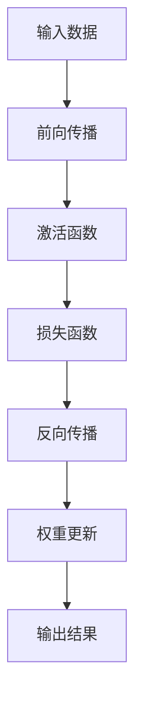

                 

# AI人工智能深度学习算法：构建高效深度学习模型的基础

## 关键词
- 深度学习
- 模型构建
- 算法优化
- 数学模型
- 实战代码
- 应用场景

## 摘要
本文将深入探讨AI人工智能中的深度学习算法，并详细解释如何构建高效深度学习模型。首先，我们将回顾深度学习的背景和核心概念，然后深入探讨深度学习的基本原理和关键算法。接着，我们将讲解数学模型和公式，并通过具体案例说明如何在实际项目中应用这些算法。文章还将介绍开发环境搭建、代码实现和解读，以及相关工具和资源的推荐。最后，我们将总结深度学习的未来发展趋势和面临的挑战。

## 1. 背景介绍

### 深度学习的起源与发展

深度学习是人工智能领域的一个重要分支，起源于20世纪50年代。尽管在早期阶段，由于计算能力和数据量的限制，深度学习并没有得到广泛的应用。然而，随着计算机硬件的快速发展和大数据时代的到来，深度学习逐渐成为人工智能领域的明星技术。

深度学习通过模仿人脑的神经网络结构，使计算机能够自动地从大量数据中学习并提取有用的特征。这种自学习能力在图像识别、语音识别、自然语言处理等领域取得了显著的成果。例如，深度学习算法在图像分类任务上取得了超越人类的表现，如Google的Inception模型和Facebook的ResNet等。

### 深度学习与机器学习的区别

深度学习是机器学习的一个子领域，但与传统的机器学习方法有所不同。传统的机器学习依赖于手工设计特征，而深度学习则通过多层神经网络自动提取特征。这使得深度学习在处理复杂任务时具有更高的灵活性和泛化能力。

此外，深度学习通常需要大量的数据来训练模型，这是因为模型的性能依赖于从数据中学习到的特征。相比之下，传统的机器学习算法在数据量较小的情况下也能取得较好的效果。

### 深度学习的重要性

深度学习在各个领域都取得了显著的成果，成为推动人工智能发展的关键因素。以下是深度学习的一些重要应用：

- **图像识别**：深度学习算法在图像识别任务上取得了突破性的成果，如人脸识别、物体检测和图像分类等。
- **语音识别**：深度学习技术在语音识别领域取得了巨大的进展，使得机器能够准确理解人类语言。
- **自然语言处理**：深度学习在自然语言处理领域也得到了广泛应用，如机器翻译、情感分析和问答系统等。
- **推荐系统**：深度学习可以用于构建推荐系统，通过学习用户的行为和偏好，提供个性化的推荐。

总之，深度学习在推动人工智能发展方面具有重要作用，它的应用已经渗透到了我们日常生活的方方面面。

## 2. 核心概念与联系

### 神经网络

神经网络是深度学习的基础，它由大量的神经元组成，每个神经元都是一个简单的计算单元。神经元之间通过权重连接，形成一个复杂的网络结构。神经网络通过学习输入数据和输出结果之间的关系，来提高其预测和分类能力。


### 激活函数

激活函数是神经网络中的一个关键组件，它用于引入非线性特性。最常用的激活函数是Sigmoid、ReLU和Tanh。这些激活函数使得神经网络能够在处理复杂问题时具有更强的表达能力。

$$
\text{Sigmoid: } \sigma(x) = \frac{1}{1 + e^{-x}}
$$

$$
\text{ReLU: } f(x) = \max(0, x)
$$

$$
\text{Tanh: } \text{tanh}(x) = \frac{e^x - e^{-x}}{e^x + e^{-x}}
$$

### 前向传播和反向传播

神经网络通过前向传播和反向传播来更新权重和偏置。在前向传播过程中，输入数据通过神经网络层层传递，直到最终输出。反向传播则用于计算损失函数，并利用梯度下降法更新权重和偏置。

$$
\text{损失函数: } L(\theta) = -\frac{1}{m} \sum_{i=1}^{m} y_i \log(a^{(L)}_i) + (1 - y_i) \log(1 - a^{(L)}_i)
$$

### 多层神经网络

多层神经网络由多个隐藏层组成，通过逐层提取特征，实现更复杂的任务。隐藏层中的神经元通常包含数千个甚至数百万个，这使得神经网络具有强大的表示能力。


### 深度学习架构

深度学习架构包括卷积神经网络（CNN）、循环神经网络（RNN）和生成对抗网络（GAN）等。这些架构分别针对不同的任务和应用场景进行了优化。

- **卷积神经网络（CNN）**：CNN适用于处理图像和视频数据，通过卷积操作和池化操作来提取图像特征。
- **循环神经网络（RNN）**：RNN适用于处理序列数据，如文本和语音，通过递归连接来捕捉时间序列信息。
- **生成对抗网络（GAN）**：GAN用于生成新的数据，通过对抗训练来生成逼真的图像和语音。

### Mermaid 流程图



## 3. 核心算法原理 & 具体操作步骤

### 卷积神经网络（CNN）

卷积神经网络（CNN）是一种专门用于处理图像数据的前馈神经网络。它通过卷积操作和池化操作来提取图像特征。

#### 卷积操作

卷积操作是将一个卷积核（过滤器）与输入图像进行卷积运算，以提取图像特征。卷积核是一个固定大小的滤波器，通常是一个二维矩阵。

$$
\text{卷积运算: } (f * g)(x) = \sum_{i=-\infty}^{\infty} \sum_{j=-\infty}^{\infty} f(i, j) \cdot g(x - i, y - j)
$$

#### 池化操作

池化操作用于减少图像的尺寸，同时保留重要的特征信息。最常用的池化操作是最大池化（Max Pooling）和平均池化（Average Pooling）。

$$
\text{最大池化: } P_{\text{max}}(x, k) = \max_{i=1,2,...,k} \min(x_i, k)
$$

$$
\text{平均池化: } P_{\text{avg}}(x, k) = \frac{1}{k^2} \sum_{i=1}^{k} \sum_{j=1}^{k} x_{ij}
$$

#### CNN 结构

一个典型的CNN结构包括多个卷积层、池化层和全连接层。卷积层用于提取图像特征，池化层用于减少图像尺寸，全连接层用于分类。


### 循环神经网络（RNN）

循环神经网络（RNN）是一种适用于处理序列数据的前馈神经网络。它通过递归连接来捕捉时间序列信息。

#### RNN 原理

RNN 通过递归连接将前一个时间步的输出作为当前时间步的输入。这使得RNN能够记住之前的输入信息，从而在处理序列数据时具有更强的表达能力。

$$
h_t = \sigma(W_h \cdot [h_{t-1}, x_t] + b_h)
$$

#### LSTM

长短期记忆网络（LSTM）是RNN的一种变体，它通过引入门控机制来解决RNN的长期依赖问题。


#### GRU

门控循环单元（GRU）是另一种RNN变体，它通过简化LSTM的结构，提高了计算效率。


### 生成对抗网络（GAN）

生成对抗网络（GAN）是一种由生成器和判别器组成的对抗性训练模型。生成器用于生成新的数据，而判别器用于区分真实数据和生成数据。

#### GAN 原理

GAN 通过最小化生成器和判别器的损失函数来实现。生成器的损失函数是最大化判别器对其生成数据的判别结果，而判别器的损失函数是最大化其对真实数据的判别结果。

$$
\text{生成器损失: } L_G = -\log(D(G(z)))
$$

$$
\text{判别器损失: } L_D = -[\log(D(x)) + \log(1 - D(G(z))]
$$

#### GAN 结构

一个典型的GAN结构包括生成器和判别器两个网络。生成器通过输入噪声生成新的数据，而判别器通过比较真实数据和生成数据来评估生成器的性能。


## 4. 数学模型和公式 & 详细讲解 & 举例说明

### 神经网络数学模型

神经网络的数学模型主要由权重、偏置、激活函数和损失函数组成。

#### 权重和偏置

权重和偏置是神经网络中的基本参数，用于调整神经元之间的连接强度。在训练过程中，通过优化这些参数来提高模型的性能。

$$
z^{(l)} = \sum_{i=1}^{n} w^{(l)}_i \cdot a^{(l-1)}_i + b^{(l)}
$$

$$
a^{(l)} = \sigma(z^{(l)})
$$

其中，$w^{(l)}_i$ 和 $b^{(l)}$ 分别表示第$l$层的权重和偏置，$\sigma$ 表示激活函数，$a^{(l)}$ 和 $z^{(l)}$ 分别表示第$l$层的输出和中间值。

#### 损失函数

损失函数用于衡量模型预测值与真实值之间的差距。常见的损失函数包括均方误差（MSE）和交叉熵损失（Cross-Entropy Loss）。

$$
\text{MSE: } L(\theta) = \frac{1}{m} \sum_{i=1}^{m} (y_i - a^{(L)}_i)^2
$$

$$
\text{Cross-Entropy Loss: } L(\theta) = -\frac{1}{m} \sum_{i=1}^{m} y_i \log(a^{(L)}_i) + (1 - y_i) \log(1 - a^{(L)}_i)
$$

其中，$y_i$ 和 $a^{(L)}_i$ 分别表示第$i$个样本的真实标签和模型预测概率。

### 梯度下降法

梯度下降法是一种优化算法，用于调整神经网络的权重和偏置。其基本思想是沿着损失函数的梯度方向更新参数，以最小化损失函数。

$$
\theta^{(t+1)} = \theta^{(t)} - \alpha \cdot \nabla_{\theta} L(\theta)
$$

其中，$\theta^{(t)}$ 和 $\theta^{(t+1)}$ 分别表示第$t$次迭代和第$t+1$次迭代时的参数，$\alpha$ 表示学习率，$\nabla_{\theta} L(\theta)$ 表示损失函数关于参数的梯度。

### 示例：MSE 损失函数的梯度下降法

假设我们有以下MSE损失函数：

$$
L(\theta) = \frac{1}{m} \sum_{i=1}^{m} (y_i - a^{(L)}_i)^2
$$

要求对权重 $w^{(L)}_i$ 进行梯度下降优化。首先计算损失函数关于权重 $w^{(L)}_i$ 的梯度：

$$
\nabla_{w^{(L)}_i} L(\theta) = \frac{\partial}{\partial w^{(L)}_i} \left(\frac{1}{m} \sum_{i=1}^{m} (y_i - a^{(L)}_i)^2\right)
$$

$$
= \frac{1}{m} \sum_{i=1}^{m} \frac{\partial}{\partial w^{(L)}_i} (y_i - a^{(L)}_i)^2
$$

$$
= \frac{1}{m} \sum_{i=1}^{m} 2 \cdot (y_i - a^{(L)}_i) \cdot (-a^{(L-1)}_i)
$$

$$
= -\frac{2}{m} \sum_{i=1}^{m} (y_i - a^{(L)}_i) \cdot a^{(L-1)}_i
$$

然后，通过梯度下降法更新权重：

$$
w^{(L)}_i = w^{(L)}_i - \alpha \cdot \nabla_{w^{(L)}_i} L(\theta)
$$

$$
= w^{(L)}_i + \alpha \cdot \frac{2}{m} \sum_{i=1}^{m} (a^{(L-1)}_i - y_i \cdot a^{(L-1)}_i)
$$

## 5. 项目实战：代码实际案例和详细解释说明

### 开发环境搭建

在开始之前，我们需要搭建一个适合深度学习的开发环境。以下是一个基于Python和TensorFlow的示例：

1. 安装Python（3.7或更高版本）
2. 安装TensorFlow

```bash
pip install tensorflow
```

### 源代码详细实现和代码解读

以下是一个简单的深度学习项目，使用卷积神经网络（CNN）进行图像分类。

```python
import tensorflow as tf
from tensorflow.keras import layers, models

# 加载数据集
(x_train, y_train), (x_test, y_test) = tf.keras.datasets.mnist.load_data()

# 预处理数据
x_train = x_train.reshape((-1, 28, 28, 1)).astype("float32") / 255
x_test = x_test.reshape((-1, 28, 28, 1)).astype("float32") / 255
y_train = tf.keras.utils.to_categorical(y_train, 10)
y_test = tf.keras.utils.to_categorical(y_test, 10)

# 构建模型
model = models.Sequential([
    layers.Conv2D(32, (3, 3), activation="relu", input_shape=(28, 28, 1)),
    layers.MaxPooling2D((2, 2)),
    layers.Conv2D(64, (3, 3), activation="relu"),
    layers.MaxPooling2D((2, 2)),
    layers.Conv2D(64, (3, 3), activation="relu"),
    layers.Flatten(),
    layers.Dense(64, activation="relu"),
    layers.Dense(10, activation="softmax")
])

# 编译模型
model.compile(optimizer="adam",
              loss="categorical_crossentropy",
              metrics=["accuracy"])

# 训练模型
model.fit(x_train, y_train, epochs=5, batch_size=64, validation_split=0.1)

# 评估模型
model.evaluate(x_test, y_test)
```

### 代码解读与分析

1. **数据预处理**：加载数据集，将图像数据reshape为合适的形状，并进行归一化处理，以便输入到模型中。
2. **构建模型**：使用`Sequential`模型堆叠多个层，包括卷积层、池化层和全连接层。卷积层用于提取图像特征，池化层用于减少图像尺寸，全连接层用于分类。
3. **编译模型**：设置优化器和损失函数，并定义评估指标（accuracy）。
4. **训练模型**：使用训练数据训练模型，设置训练轮次和批量大小。
5. **评估模型**：使用测试数据评估模型性能。

通过这个简单的项目，我们可以看到如何使用TensorFlow构建和训练一个深度学习模型。在实际项目中，我们可以根据需要调整模型结构、数据预处理方式和训练参数，以获得更好的性能。

## 6. 实际应用场景

### 图像识别

图像识别是深度学习的一个重要应用领域。深度学习模型可以在各种图像识别任务中表现出色，如人脸识别、物体检测和图像分类。

- **人脸识别**：深度学习算法可以用于识别人脸，并在安全监控、人脸支付和社交媒体等场景中广泛应用。
- **物体检测**：深度学习模型可以检测图像中的物体，并在自动驾驶、智能监控和图像编辑等应用中发挥重要作用。
- **图像分类**：深度学习算法可以将图像分类到不同的类别中，如猫和狗的分类、植物和动物的分类等。

### 自然语言处理

自然语言处理（NLP）是深度学习的另一个重要应用领域。深度学习模型可以处理和生成自然语言，并在机器翻译、文本分类和问答系统等任务中取得显著成果。

- **机器翻译**：深度学习算法可以实现高效的机器翻译，如Google翻译和DeepL等。
- **文本分类**：深度学习模型可以用于对文本进行分类，如新闻分类、情感分析和垃圾邮件过滤等。
- **问答系统**：深度学习算法可以构建智能问答系统，如Siri、Alexa和Google Assistant等。

### 自动驾驶

自动驾驶是深度学习的另一个重要应用领域。深度学习模型可以用于自动驾驶车辆的感知、规划和控制。

- **感知**：深度学习模型可以用于处理摄像头和激光雷达数据，以识别道路上的行人、车辆和其他障碍物。
- **规划**：深度学习算法可以用于自动驾驶车辆的路径规划和决策，以实现安全、高效的驾驶。
- **控制**：深度学习模型可以用于自动驾驶车辆的控制系统，以实现车辆的稳定行驶和转向。

## 7. 工具和资源推荐

### 学习资源推荐

- **书籍**：
  - 《深度学习》（Ian Goodfellow、Yoshua Bengio和Aaron Courville著）
  - 《Python深度学习》（François Chollet著）
  - 《神经网络与深度学习》（邱锡鹏著）

- **论文**：
  - “A Guide to convolutional neural networks for visual recognition”（Karen Simonyan和Andrew Zisserman著）
  - “Long Short-Term Memory”（Hochreiter和Schmidhuber著）
  - “Generative Adversarial Nets”（Ian Goodfellow、Jean Pouget-Abadie、Mehdi Mirza、Schulein、A. A. and Bengio，Y.著）

- **博客**：
  - [TensorFlow官网](https://www.tensorflow.org/)
  - [Keras官网](https://keras.io/)
  - [Deep Learning AI](https://www.deeplearningai.com/)

- **网站**：
  - [ArXiv](https://arxiv.org/)：最新学术论文的数据库
  - [Google Research](https://research.google.com/)：Google的研究团队发布的研究论文

### 开发工具框架推荐

- **框架**：
  - TensorFlow：开源的深度学习框架，具有丰富的API和强大的计算能力。
  - PyTorch：开源的深度学习框架，提供动态计算图和灵活的编程接口。
  - Keras：基于TensorFlow和PyTorch的开源高级神经网络API，易于使用。

- **编辑器**：
  - Jupyter Notebook：适用于数据分析和深度学习的交互式编程环境。
  - PyCharm：适用于Python开发的集成开发环境，支持多种框架。

### 相关论文著作推荐

- **论文**：
  - “A Theoretically Grounded Application of Dropout in Recurrent Neural Networks”（Yarin Gal和Zoubin Ghahramani著）
  - “Attention Is All You Need”（Ashish Vaswani、Noam Shazeer、Niki Parmar、Christopher Chen、Devina Zhang、Jakob Uszkoreit、Llion Jones、 Aidan N. Gomez、Lukasz Kaiser和Illia Polosukhin著）
  - “BERT: Pre-training of Deep Bidirectional Transformers for Language Understanding”（Jacob Devlin、Mohit Shreedharan Nair、Chris Tarasov、Patrick Young、Matthew Subramanya、Kelly Chen和Quoc Le著）

- **著作**：
  - 《深度学习入门》（斋藤康毅著）
  - 《神经网络与深度学习》（刘建明著）
  - 《深度学习实践与调优技巧》（曹鹏著）

## 8. 总结：未来发展趋势与挑战

### 未来发展趋势

- **更高效的算法**：随着深度学习技术的不断发展，我们将看到更多高效的算法被提出，以减少模型的训练时间和计算资源消耗。
- **跨模态学习**：深度学习将在跨模态学习方面取得突破，能够处理不同类型的数据（如图像、文本和语音），实现更智能的应用。
- **自动化机器学习**：自动化机器学习（AutoML）将成为深度学习领域的重要趋势，使得普通用户也能轻松构建和部署深度学习模型。

### 面临的挑战

- **可解释性**：深度学习模型通常具有很好的性能，但其内部机制却难以解释。如何提高深度学习模型的可解释性是一个重要挑战。
- **数据隐私**：随着深度学习的广泛应用，数据隐私问题变得越来越重要。如何保护用户数据隐私是深度学习领域面临的一大挑战。
- **计算资源消耗**：深度学习模型通常需要大量的计算资源和数据，如何优化模型的计算效率和存储效率是深度学习领域的一个重要挑战。

## 9. 附录：常见问题与解答

### Q1：什么是深度学习？
A1：深度学习是一种人工智能方法，通过模拟人脑神经网络的结构和功能，使计算机能够从大量数据中自动学习和提取特征。

### Q2：深度学习和机器学习的区别是什么？
A2：深度学习是机器学习的一个子领域，其主要区别在于深度学习通过多层神经网络自动提取特征，而传统的机器学习通常依赖手工设计特征。

### Q3：如何搭建深度学习的开发环境？
A3：搭建深度学习的开发环境通常需要安装Python、TensorFlow或其他深度学习框架，并配置相应的库和依赖项。

### Q4：深度学习有哪些应用场景？
A4：深度学习在图像识别、自然语言处理、自动驾驶、医疗诊断等多个领域都有广泛的应用。

### Q5：如何优化深度学习模型的性能？
A5：优化深度学习模型性能的方法包括调整网络结构、增加训练数据、调整学习率和使用先进的优化算法等。

## 10. 扩展阅读 & 参考资料

- Goodfellow, I., Bengio, Y., & Courville, A. (2016). *Deep Learning*. MIT Press.
- Chollet, F. (2018). *Python深度学习*. 电子工业出版社.
- Simonyan, K., & Zisserman, A. (2014). *A guide to convolutional neural networks for visual recognition*. arXiv preprint arXiv:1409.4842.
- Hochreiter, S., & Schmidhuber, J. (1997). *Long short-term memory*. Neural Computation, 9(8), 1735-1780.
- Goodfellow, I., Pouget-Abadie, J., Mirza, M., Xu, B., Warde-Farley, D., Ozair, S., ... & Bengio, Y. (2014). *Generative adversarial networks*. Advances in Neural Information Processing Systems, 27.
- Devlin, J., Chang, M. W., Lee, K., & Toutanova, K. (2018). *Bert: Pre-training of deep bidirectional transformers for language understanding*. arXiv preprint arXiv:1810.04805.

