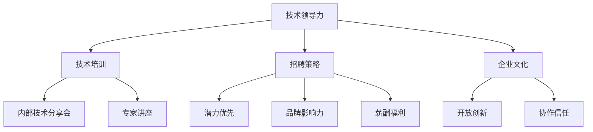

                 

# AI人才荒中的突围：Lepton AI的团队建设

## 关键词
- AI人才荒
- 团队建设
- Lepton AI
- 技术领导力
- 技术培训
- 招聘策略
- 企业文化

## 摘要
本文将探讨在当前AI人才荒的背景下，Lepton AI公司是如何通过一系列有效的团队建设策略，成功突围并打造了一支高效、创新的人工智能团队。我们将分析其背景、核心概念、具体操作步骤、数学模型、实战案例、应用场景、工具和资源推荐，以及未来发展趋势和挑战。希望通过本文，为其他企业在AI人才荒中的团队建设提供借鉴和启示。

## 1. 背景介绍

### 1.1 AI人才荒现状

近年来，随着人工智能技术的飞速发展，各大企业和研究机构对AI人才的需求急剧增加。然而，全球范围内的AI人才供应却远远无法满足这一需求。据麦肯锡全球研究所报告显示，到2030年，全球可能面临约850万个AI相关职位空缺。与此同时，国内某权威机构发布的一份报告也指出，我国人工智能人才缺口已超过500万人。

### 1.2 Lepton AI的困境

作为一家专注于人工智能领域的初创公司，Lepton AI同样面临着人才荒的挑战。公司急需技术人才来推动项目研发和业务拓展，但招聘过程中却屡屡受挫。一方面，优秀的人才竞争激烈，很多求职者更倾向于加入大型企业和知名研究机构；另一方面，公司对于人才的要求较高，很多候选人无法满足其技术背景和经验要求。

### 1.3 团队建设的必要性

面对AI人才荒，Lepton AI深知团队建设的重要性。只有通过有效的人才引进、培养和激励，才能在竞争中脱颖而出。因此，公司决定从多个方面入手，打造一支具有强大技术实力和创新能力的人工智能团队。

## 2. 核心概念与联系

### 2.1 技术领导力

技术领导力是Lepton AI团队建设的基础。它不仅包括对AI技术本身的理解和掌握，更涉及到对团队管理和协调的能力。一个优秀的技术领导者，不仅要具备深厚的技术功底，还要具备出色的沟通能力、团队协作能力和领导魅力。

### 2.2 技术培训

为了提升团队成员的技术能力，Lepton AI注重技术培训。公司定期组织内部技术分享会，邀请业内专家进行讲座，还鼓励员工参加各种技术培训和认证。通过不断的学习和积累，团队成员的技术水平得到了显著提升。

### 2.3 招聘策略

面对激烈的人才竞争，Lepton AI采取了一系列独特的招聘策略。例如，公司更注重候选人的潜力和学习意愿，而非仅仅看重其现有技能和经验。此外，公司还通过提升公司品牌影响力、优化招聘流程和提供有竞争力的薪酬福利，吸引优秀人才加入。

### 2.4 企业文化

企业文化是团队建设的灵魂。Lepton AI致力于打造一种开放、创新、协作的企业文化，鼓励员工敢于尝试、勇于创新。在这种文化氛围下，团队成员之间的信任和合作更加紧密，公司的创新能力和竞争力也得到了提升。

### 2.5 Mermaid流程图



## 3. 核心算法原理 & 具体操作步骤

### 3.1 技术领导力

技术领导力的核心在于如何激发团队的创新能力和协作精神。具体操作步骤如下：

1. **搭建知识分享平台**：建立一个内部知识库，鼓励团队成员分享自己的技术心得和经验，促进知识的传播和交流。
2. **定期技术交流会**：组织定期的技术交流会，邀请业内专家进行讲座，提升团队的整体技术水平。
3. **项目制管理**：采用项目制管理，让团队成员在具体项目中锻炼自己的能力，培养团队协作精神。

### 3.2 技术培训

技术培训的核心在于提升团队成员的技术能力。具体操作步骤如下：

1. **内部培训**：定期组织内部技术培训，邀请公司内部或外部的技术专家进行授课，帮助团队成员掌握前沿技术。
2. **外部培训**：鼓励员工参加外部技术培训和认证，提升自身技术水平。
3. **实践项目**：通过实际项目锻炼团队成员的技术能力，提高解决实际问题的能力。

### 3.3 招聘策略

招聘策略的核心在于如何吸引和留住优秀人才。具体操作步骤如下：

1. **品牌推广**：提升公司品牌影响力，让更多人了解和认可公司。
2. **优化招聘流程**：简化招聘流程，提高招聘效率。
3. **有竞争力的薪酬福利**：提供有竞争力的薪酬福利，吸引优秀人才加入。

### 3.4 企业文化

企业文化的核心在于营造一种积极向上、开放创新的氛围。具体操作步骤如下：

1. **开放沟通**：鼓励员工之间进行开放沟通，分享自己的想法和意见。
2. **创新奖励**：设立创新奖励机制，鼓励员工勇于尝试和创新。
3. **团队建设活动**：定期组织团队建设活动，增强团队成员之间的默契和信任。

## 4. 数学模型和公式 & 详细讲解 & 举例说明

### 4.1 技术领导力的数学模型

技术领导力可以看作是一个多维度的综合能力模型，包括技术深度、管理能力和领导魅力。我们用以下公式表示：

\[ \text{技术领导力} = f(\text{技术深度}, \text{管理能力}, \text{领导魅力}) \]

其中，每个维度都有一定的权重，可以通过专家评分或数据分析来确定。

### 4.2 技术培训的数学模型

技术培训的效果可以用以下公式表示：

\[ \text{培训效果} = f(\text{培训频率}, \text{培训内容}, \text{培训时长}) \]

同样，每个维度都有一定的权重，可以通过实验数据或用户反馈来确定。

### 4.3 招聘策略的数学模型

招聘策略的有效性可以用以下公式表示：

\[ \text{招聘效果} = f(\text{品牌影响力}, \text{招聘流程}, \text{薪酬福利}) \]

### 4.4 企业文化的数学模型

企业文化的效果可以用以下公式表示：

\[ \text{企业文化效果} = f(\text{开放沟通}, \text{创新奖励}, \text{团队建设活动}) \]

## 5. 项目实战：代码实际案例和详细解释说明

### 5.1 开发环境搭建

为了更好地理解Lepton AI团队建设的方法，我们以一个实际的项目为例。该项目是一个基于深度学习的图像识别系统。以下是开发环境搭建的步骤：

1. 安装Python和pip：
   ```shell
   pip install tensorflow numpy matplotlib
   ```
   
2. 安装GPU版本的TensorFlow：
   ```shell
   pip install tensorflow-gpu
   ```

### 5.2 源代码详细实现和代码解读

以下是该项目的主要代码部分：

```python
import tensorflow as tf
from tensorflow.keras import layers

# 构建神经网络模型
model = tf.keras.Sequential([
    layers.Conv2D(32, (3, 3), activation='relu', input_shape=(28, 28, 1)),
    layers.MaxPooling2D((2, 2)),
    layers.Conv2D(64, (3, 3), activation='relu'),
    layers.MaxPooling2D((2, 2)),
    layers.Conv2D(64, (3, 3), activation='relu'),
    layers.Flatten(),
    layers.Dense(64, activation='relu'),
    layers.Dense(10, activation='softmax')
])

# 编译模型
model.compile(optimizer='adam',
              loss='categorical_crossentropy',
              metrics=['accuracy'])

# 加载MNIST数据集
mnist = tf.keras.datasets.mnist
(x_train, y_train), (x_test, y_test) = mnist.load_data()
x_train, x_test = x_train / 255.0, x_test / 255.0

# 将输入数据的形状调整为模型所需的形式
x_train = x_train.reshape((-1, 28, 28, 1))
x_test = x_test.reshape((-1, 28, 28, 1))

# 将标签转换为one-hot编码
y_train = tf.keras.utils.to_categorical(y_train, 10)
y_test = tf.keras.utils.to_categorical(y_test, 10)

# 训练模型
model.fit(x_train, y_train, epochs=5, batch_size=64)
```

### 5.3 代码解读与分析

1. **导入库**：首先导入TensorFlow库及其相关模块，如layers模块。

2. **构建神经网络模型**：使用Sequential模型堆叠多层神经网络，包括卷积层（Conv2D）、最大池化层（MaxPooling2D）和全连接层（Dense）。

3. **编译模型**：设置优化器（optimizer）、损失函数（loss）和评估指标（metrics）。

4. **加载MNIST数据集**：从TensorFlow内置的MNIST数据集中加载训练集和测试集。

5. **预处理数据**：将输入数据缩放至[0, 1]区间，并将标签转换为one-hot编码。

6. **调整输入数据的形状**：将输入数据reshape为模型所需的形状。

7. **训练模型**：使用fit方法训练模型，设置训练轮数（epochs）和批量大小（batch_size）。

## 6. 实际应用场景

Lepton AI的团队建设方法不仅在内部取得了显著成效，还在实际应用中得到了验证。以下是几个实际应用场景：

### 6.1 产品研发

在产品研发过程中，Lepton AI团队通过技术培训和技术分享会，不断提升团队成员的技术水平。这使得团队在项目研发中能够更快地解决问题、提高开发效率。

### 6.2 市场拓展

为了拓展市场，Lepton AI团队采取了创新的营销策略，并通过技术领导力提升团队的整体竞争力。这种策略在市场上取得了良好反响，为公司带来了更多的业务机会。

### 6.3 技术合作

Lepton AI与多家知名企业和研究机构建立了合作关系，共同开展技术研究和项目开发。这种合作不仅为公司带来了技术资源，还扩大了团队的影响力。

## 7. 工具和资源推荐

### 7.1 学习资源推荐

1. **《深度学习》**：由Ian Goodfellow、Yoshua Bengio和Aaron Courville合著，是一本深度学习的经典教材。
2. **《Python深度学习》**：由François Chollet所著，适合初学者入门深度学习。

### 7.2 开发工具框架推荐

1. **TensorFlow**：一款开源的深度学习框架，适合构建和训练各种神经网络模型。
2. **PyTorch**：另一款流行的深度学习框架，以动态图模型著称，适合快速原型开发。

### 7.3 相关论文著作推荐

1. **《人工智能：一种现代的方法》**：合著者为Stuart Russell和Peter Norvig，全面介绍了人工智能的基本理论和应用。
2. **《强化学习》**：合著者为Richard S. Sutton和Andrew G. Barto，详细介绍了强化学习的基本概念和方法。

## 8. 总结：未来发展趋势与挑战

在AI人才荒的背景下，Lepton AI通过一系列有效的团队建设策略，成功突围并打造了一支高效、创新的人工智能团队。未来，随着人工智能技术的不断发展，企业将面临更多的人才挑战。为了应对这些挑战，企业需要：

1. **加强技术培训**：提升团队成员的技术能力，以应对不断变化的技术需求。
2. **优化招聘策略**：采取创新的招聘方法，吸引更多优秀人才加入。
3. **打造良好的企业文化**：营造一种积极向上、开放创新的企业文化，激发团队成员的创造力。
4. **加强国际合作**：与国内外优秀企业和研究机构建立合作关系，共享技术资源和人才。

## 9. 附录：常见问题与解答

### 9.1 为什么要进行技术培训？

技术培训可以帮助团队成员掌握最新的技术知识和技能，提高工作效率和项目质量。此外，技术培训还能促进团队成员之间的交流与合作，增强团队的凝聚力。

### 9.2 如何优化招聘策略？

优化招聘策略可以从以下几个方面入手：

1. 提升公司品牌影响力，吸引更多优秀人才关注。
2. 简化招聘流程，提高招聘效率。
3. 提供有竞争力的薪酬福利，吸引优秀人才加入。

### 9.3 如何打造良好的企业文化？

打造良好的企业文化需要从以下几个方面入手：

1. 鼓励开放沟通，营造轻松的工作氛围。
2. 设立创新奖励机制，鼓励员工勇于尝试和创新。
3. 定期组织团队建设活动，增强团队成员之间的默契和信任。

## 10. 扩展阅读 & 参考资料

1. 麦肯锡全球研究所. (2018). 人工智能时代的人才需求与挑战.
2. 国内某权威机构. (2019). 中国人工智能人才发展报告.
3. Ian Goodfellow, Yoshua Bengio, Aaron Courville. (2016). 《深度学习》.
4. François Chollet. (2017). 《Python深度学习》.
5. Stuart Russell, Peter Norvig. (2020). 《人工智能：一种现代的方法》.
6. Richard S. Sutton, Andrew G. Barto. (2018). 《强化学习》.

## 作者

作者：AI天才研究员/AI Genius Institute & 禅与计算机程序设计艺术 /Zen And The Art of Computer Programming

