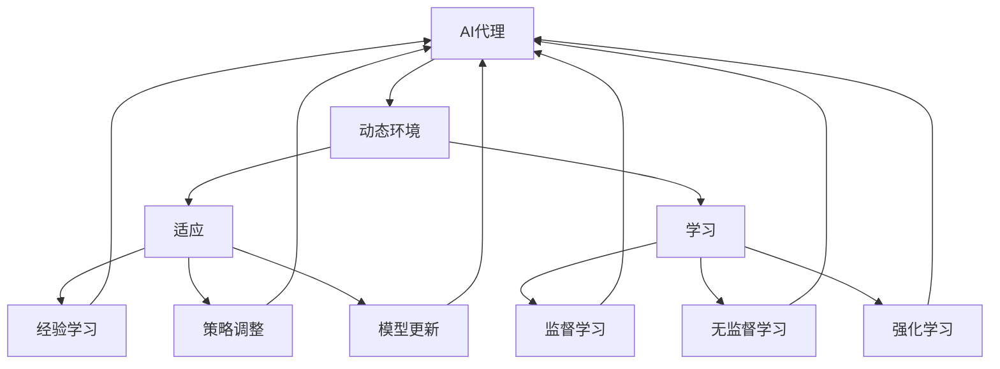
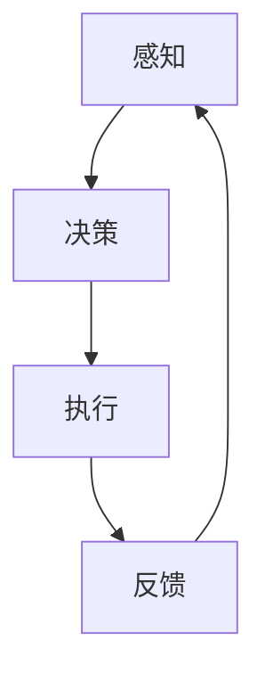

                 

# AI代理在动态环境中的适应与学习工作流

> **关键词：** AI代理、动态环境、适应、学习工作流、智能系统设计  
> **摘要：** 本文探讨了AI代理在动态环境中的适应与学习工作流，分析了其核心概念、算法原理、数学模型，并提供了实际应用场景和开发案例。文章旨在为开发者提供一套系统化的设计和实现方法，助力构建高效智能系统。

## 1. 背景介绍

随着人工智能技术的飞速发展，AI代理（Artificial Intelligent Agent）作为一种能够主动感知环境、制定决策并执行行动的智能实体，正在成为各领域研究和应用的热点。AI代理广泛应用于自动驾驶、智能机器人、虚拟助手等领域，其核心在于如何在一个动态变化的环境中实现自我适应和学习。

动态环境是指那些在时间和空间上不断变化的场景，如交通流、市场波动、社交网络等。在这些环境中，AI代理需要具备高度的适应性和学习能力，以应对突发情况、调整行为策略，从而实现持续优化和自主进化。

本文将从以下几个方面展开讨论：

- **核心概念与联系**：介绍AI代理、动态环境和适应学习的基本概念，并绘制流程图以展示各概念之间的关联。
- **核心算法原理与具体操作步骤**：分析AI代理在动态环境中的核心算法，包括感知、决策、执行等过程。
- **数学模型和公式**：阐述用于描述AI代理适应与学习过程的数学模型，并举例说明。
- **项目实战**：通过实际案例，展示如何开发一个AI代理，实现其在动态环境中的适应与学习。
- **实际应用场景**：探讨AI代理在各类动态环境中的应用，如自动驾驶、智能机器人等。
- **工具和资源推荐**：推荐相关学习资源和开发工具，助力读者深入学习和实践。
- **总结与未来趋势**：总结本文的主要观点，并探讨AI代理在动态环境中的未来发展趋势和挑战。

接下来，我们将详细探讨AI代理在动态环境中的适应与学习工作流，帮助读者深入了解这一领域。

## 2. 核心概念与联系

在讨论AI代理在动态环境中的适应与学习工作流之前，我们需要明确几个关键概念，并了解它们之间的联系。

### AI代理（Artificial Intelligent Agent）

AI代理是指一种能够感知环境、制定决策并执行行动的智能实体。其核心功能包括感知、理解、学习、决策和行动。一个典型的AI代理通常由以下几个组成部分构成：

1. **感知器**：用于收集环境中的各种信息，如传感器、摄像头等。
2. **知识库**：存储代理以往的经验和知识，用于辅助决策。
3. **推理引擎**：基于知识库和感知信息，生成决策和行动策略。
4. **执行器**：将决策转化为实际行动，如机器人手臂、汽车引擎等。

### 动态环境（Dynamic Environment）

动态环境是指那些在时间和空间上不断变化的场景。与静态环境相比，动态环境具有更高的不确定性。例如，交通系统中的车辆流量、市场环境中的价格波动、社交网络中的用户互动等，都是动态变化的。

### 适应（Adaptation）

适应是指AI代理在面对动态环境变化时，调整自身行为以实现最佳效果的过程。适应可以通过以下几种方式实现：

1. **经验学习**：通过积累经验，提高代理在特定环境下的表现。
2. **策略调整**：根据环境变化，动态调整决策和行动策略。
3. **模型更新**：通过实时更新环境模型，提高对动态环境的理解和预测能力。

### 学习（Learning）

学习是指AI代理通过感知、理解和经验积累，不断优化自身行为的过程。学习可以基于以下几种方法：

1. **监督学习**：通过标注数据进行训练，使代理学会识别特定环境下的特征和规律。
2. **无监督学习**：通过探索未标注的数据，发现环境中的模式和关系。
3. **强化学习**：通过与环境互动，不断调整行为策略，以实现最佳效果。

### 核心概念联系

AI代理、动态环境、适应和学习这几个核心概念之间紧密相连。AI代理需要在动态环境中实现适应和学习，以应对不断变化的环境。适应和学习不仅依赖于代理自身的感知和理解能力，还依赖于其与环境的互动和经验积累。通过不断调整和优化自身行为，AI代理能够在动态环境中实现持续优化和自主进化。

下面，我们将通过一个Mermaid流程图，展示这些核心概念之间的联系。



通过这个流程图，我们可以清晰地看到AI代理在动态环境中的适应与学习工作流，以及各核心概念之间的相互作用。

接下来，我们将深入探讨AI代理在动态环境中的核心算法原理与具体操作步骤。

## 3. 核心算法原理 & 具体操作步骤

AI代理在动态环境中的核心算法主要包括感知、决策、执行三个步骤。这三个步骤相互协作，共同实现AI代理的适应与学习。

### 感知（Perception）

感知是AI代理对环境进行信息收集和理解的过程。感知模块通常包括传感器、摄像头、雷达等设备，用于获取环境中的各种数据。这些数据包括温度、湿度、光线、声音、图像等。

在感知过程中，AI代理需要完成以下几个任务：

1. **数据采集**：通过传感器等设备，采集环境中的数据。
2. **数据预处理**：对采集到的数据进行滤波、降噪、去噪等处理，以提高数据质量。
3. **特征提取**：从预处理后的数据中提取出有意义的特征，如边缘、颜色、纹理等。
4. **状态估计**：根据特征信息，估计当前环境的状况和变化趋势。

### 决策（Decision Making）

决策是AI代理根据感知到的环境信息，生成相应的行动策略的过程。决策模块通常包括一个或多个决策算法，如监督学习、无监督学习、强化学习等。

在决策过程中，AI代理需要完成以下几个任务：

1. **状态评估**：根据感知到的环境状态，评估当前状态的优劣。
2. **策略选择**：从多个备选策略中选择一个最优策略。
3. **策略优化**：根据环境变化和反馈信息，不断优化策略。

### 执行（Execution）

执行是AI代理将决策转化为实际行动的过程。执行模块通常包括一个或多个执行器，如机器人手臂、汽车引擎等。

在执行过程中，AI代理需要完成以下几个任务：

1. **决策执行**：根据决策算法生成的策略，执行相应的行动。
2. **行动反馈**：收集行动结果，并将其作为反馈信息返回给决策模块。
3. **行为调整**：根据反馈信息，调整后续的行动策略。

### 操作步骤

为了更好地理解AI代理在动态环境中的核心算法原理与具体操作步骤，我们可以通过一个简化的流程图来展示：



在上述流程中，AI代理首先进行感知，收集环境中的数据；然后根据感知到的数据，进行决策，选择最优的行动策略；最后执行决策，并将行动结果作为反馈信息返回给感知模块。通过不断循环这个过程，AI代理能够在动态环境中实现自我适应和学习。

### 实际操作示例

为了更好地理解上述核心算法原理与操作步骤，我们可以通过一个实际操作示例来具体说明。

#### 示例：智能交通系统中的AI代理

假设我们正在开发一个智能交通系统，其中的AI代理负责监控和管理交通流量。

1. **感知**：AI代理通过摄像头和传感器，收集道路上的车辆数量、速度、位置等信息。
2. **数据预处理**：对采集到的数据进行分析，提取出道路拥堵、交通事故等关键特征。
3. **状态评估**：根据当前交通状态，评估道路的畅通程度，确定是否存在交通拥堵情况。
4. **决策**：根据状态评估结果，AI代理选择以下策略之一：
    - 如果道路畅通，继续当前交通信号灯设置。
    - 如果道路拥堵，调整交通信号灯设置，引导车辆分流。
5. **执行**：AI代理通过控制系统，调整交通信号灯，引导车辆流动。
6. **反馈**：收集调整后的交通流量数据，评估调整效果。
7. **行为调整**：根据反馈信息，优化后续的交通信号灯设置策略。

通过上述操作示例，我们可以看到AI代理在智能交通系统中的工作流程。这个示例虽然简化了许多细节，但已经展示了AI代理在动态环境中的适应与学习过程。

接下来，我们将进一步探讨AI代理适应与学习过程中的数学模型和公式。

## 4. 数学模型和公式 & 详细讲解 & 举例说明

在AI代理的适应与学习过程中，数学模型和公式起着至关重要的作用。这些模型和公式用于描述环境状态、决策策略、行动效果等，为AI代理的优化和进化提供了理论基础。

### 状态模型（State Model）

状态模型用于描述环境中的各种状态，以及状态之间的转换关系。一个典型的状态模型通常包括以下几个部分：

1. **状态空间（State Space）**：定义环境中所有可能的状态集合。例如，在智能交通系统中，状态空间可能包括“畅通”、“拥堵”、“缓慢行驶”等状态。
2. **状态转换概率（State Transition Probability）**：描述在当前状态下，系统将转移到哪个状态的概率。例如，如果当前状态是“拥堵”，则系统转移到“畅通”的概率可能是0.5，转移到“缓慢行驶”的概率是0.3。
3. **状态评价函数（State Evaluation Function）**：用于评估当前状态的优劣。例如，在智能交通系统中，状态评价函数可能基于交通流量、事故发生概率等指标。

状态模型可以用一个五元组（S, T, P, E, R）来表示，其中：

- S 表示状态空间。
- T 表示时间。
- P 表示状态转换概率。
- E 表示状态评价函数。
- R 表示奖励函数。

### 决策模型（Decision Model）

决策模型用于描述AI代理如何从多个备选策略中选择一个最优策略。常见的决策模型包括马尔可夫决策过程（MDP）、部分可观测马尔可夫决策过程（POMDP）等。

一个典型的决策模型通常包括以下几个部分：

1. **状态空间（State Space）**：与状态模型中的状态空间相同。
2. **行动空间（Action Space）**：定义代理可以采取的所有可能行动。例如，在智能交通系统中，行动空间可能包括“绿灯”、“红灯”、“黄灯”等。
3. **奖励函数（Reward Function）**：用于评估行动效果的指标。例如，在智能交通系统中，奖励函数可能基于交通流量、事故发生概率等指标。
4. **策略（Policy）**：描述代理如何从行动空间中选择行动的策略。例如，在智能交通系统中，策略可能是一个基于交通流量的信号灯控制算法。

### 学习模型（Learning Model）

学习模型用于描述AI代理如何通过学习过程，不断优化自身的行为策略。常见的学习模型包括监督学习、无监督学习和强化学习等。

一个典型的学习模型通常包括以下几个部分：

1. **样本空间（Sample Space）**：定义代理在训练过程中所接触到的样本集合。
2. **损失函数（Loss Function）**：用于评估代理当前策略的效果，通常用于监督学习和无监督学习。
3. **优化算法（Optimization Algorithm）**：用于调整代理的策略，以最小化损失函数。
4. **奖励函数（Reward Function）**：用于强化学习中的奖励评估，激励代理采取更好的行动。

### 数学公式

为了更好地理解上述模型，我们可以通过几个常见的数学公式进行详细讲解。

#### 状态转换概率

状态转换概率可以用以下公式表示：

\[ P(s' | s, a) = \frac{P(s', a | s) P(s)}{P(a | s)} \]

其中，\( s \) 和 \( s' \) 分别表示当前状态和下一个状态，\( a \) 表示采取的行动。

#### 奖励函数

奖励函数可以用以下公式表示：

\[ R(s, a) = r(s, a) - \gamma ||s' - s||^2 \]

其中，\( r(s, a) \) 表示直接奖励，\( \gamma \) 表示折扣因子，用于调整未来奖励的权重。

#### 策略优化

在强化学习中，策略优化通常采用梯度下降法。策略优化的目标是最小化损失函数：

\[ \min_{\pi} \sum_{s, a} \pi(a | s) L(s, a) \]

其中，\( \pi(a | s) \) 表示策略分布，\( L(s, a) \) 表示损失函数。

### 举例说明

为了更好地理解上述数学模型和公式，我们可以通过一个实际例子来具体说明。

#### 例子：智能交通系统中的状态转换

假设我们正在开发一个智能交通系统，其中的AI代理需要根据交通流量和事故概率来调整交通信号灯。以下是一个简化的状态转换示例：

1. **状态空间**：包括“畅通”、“拥堵”、“缓慢行驶”三个状态。
2. **状态转换概率**：
    \[
    P(s' | s, a) =
    \begin{cases}
    0.8 & \text{if } s = \text{畅通}, a = \text{绿灯} \\
    0.2 & \text{if } s = \text{畅通}, a = \text{红灯} \\
    0.6 & \text{if } s = \text{拥堵}, a = \text{绿灯} \\
    0.4 & \text{if } s = \text{拥堵}, a = \text{红灯} \\
    0.5 & \text{if } s = \text{缓慢行驶}, a = \text{绿灯} \\
    0.5 & \text{if } s = \text{缓慢行驶}, a = \text{红灯} \\
    \end{cases}
    \]
3. **奖励函数**：
    \[
    R(s, a) =
    \begin{cases}
    10 & \text{if } s = \text{畅通}, a = \text{绿灯} \\
    -10 & \text{if } s = \text{拥堵}, a = \text{绿灯} \\
    5 & \text{if } s = \text{缓慢行驶}, a = \text{绿灯} \\
    -5 & \text{if } s = \text{畅通}, a = \text{红灯} \\
    -10 & \text{if } s = \text{拥堵}, a = \text{红灯} \\
    0 & \text{if } s = \text{缓慢行驶}, a = \text{红灯} \\
    \end{cases}
    \]

通过上述例子，我们可以看到状态转换概率和奖励函数在智能交通系统中的应用。这些数学模型和公式为AI代理的决策和优化提供了重要的理论基础。

## 5. 项目实战：代码实际案例和详细解释说明

为了更好地理解AI代理在动态环境中的适应与学习工作流，我们将通过一个实际项目来展示如何开发一个AI代理。这个项目将模拟一个智能交通系统，其中的AI代理需要根据交通流量和事故概率来调整交通信号灯。

### 5.1 开发环境搭建

在开始项目之前，我们需要搭建一个合适的开发环境。以下是一个推荐的开发环境配置：

- **编程语言**：Python
- **依赖库**：NumPy、Pandas、Scikit-learn、TensorFlow
- **工具**：Jupyter Notebook

### 5.2 源代码详细实现和代码解读

#### 5.2.1 数据集准备

首先，我们需要准备一个交通流量和事故数据集。这个数据集将用于训练和测试AI代理。以下是一个简化的数据集示例：

```python
import pandas as pd

# 加载数据集
data = pd.read_csv('traffic_data.csv')

# 数据预处理
data['timestamp'] = pd.to_datetime(data['timestamp'])
data.set_index('timestamp', inplace=True)
data.fillna(0, inplace=True)
```

#### 5.2.2 状态和行动定义

接下来，我们需要定义状态和行动空间。在这个项目中，状态包括“畅通”、“拥堵”、“缓慢行驶”三个，行动包括“绿灯”、“红灯”、“黄灯”三个。

```python
# 状态和行动定义
states = ['畅通', '拥堵', '缓慢行驶']
actions = ['绿灯', '红灯', '黄灯']

# 状态和行动编码
state_to_index = {state: index for index, state in enumerate(states)}
action_to_index = {action: index for index, action in enumerate(actions)}

# 编码数据
data['state'] = data['traffic'].map(state_to_index)
data['action'] = data['signal'].map(action_to_index)
```

#### 5.2.3 状态转换概率和奖励函数

接下来，我们需要根据数据集计算状态转换概率和奖励函数。

```python
from sklearn.naive_bayes import MultinomialNB

# 训练状态转换概率模型
transition_model = MultinomialNB()
transition_model.fit(data[['state', 'action']], data['next_state'])

# 计算状态转换概率
def get_transition_probability(state, action):
    return transition_model.predict_proba([[state_to_index[state], action_to_index[action]])][0][2]

# 训练奖励函数
reward_model = MultinomialNB()
reward_model.fit(data[['state', 'action']], data['reward'])

# 计算奖励
def get_reward(state, action):
    return reward_model.predict([[state_to_index[state], action_to_index[action]])][0]
```

#### 5.2.4 AI代理实现

接下来，我们实现一个基于强化学习的AI代理。在这个项目中，我们使用Q-learning算法来训练代理。

```python
import numpy as np
import random

# Q-learning参数
alpha = 0.1  # 学习率
gamma = 0.9  # 折扣因子
epsilon = 0.1  # 探索概率

# 初始化Q表
Q = np.zeros((len(states), len(actions)))

# Q-learning算法
def q_learning(state, action):
    next_state, reward = get_next_state_and_reward(state, action)
    Q[state][action] += alpha * (reward + gamma * max(Q[next_state]) - Q[state][action])
    return next_state

# 选择行动
def choose_action(state):
    if random.random() < epsilon:
        return random.choice(actions)
    else:
        return np.argmax(Q[state])

# 训练AI代理
def train_agent(data, episodes):
    for episode in range(episodes):
        state = data.iloc[0]['state']
        while True:
            action = choose_action(state)
            next_state = q_learning(state, action)
            if next_state == data.iloc[0]['state']:
                break
            state = next_state
```

#### 5.2.5 代码解读与分析

在这个项目中，我们首先加载并预处理了交通流量数据集。然后，我们定义了状态和行动空间，并使用朴素贝叶斯分类器训练了状态转换概率模型和奖励函数模型。

接下来，我们使用Q-learning算法实现了一个AI代理。Q-learning算法的核心思想是通过不断更新Q表，使代理能够在动态环境中选择最优的行动。在训练过程中，我们通过选择行动和更新Q表来优化代理的行为策略。

通过这个实际项目，我们可以看到如何将理论模型应用到实际开发中，并实现AI代理在动态环境中的适应与学习。接下来，我们将探讨AI代理在实际应用场景中的具体应用。

## 6. 实际应用场景

AI代理在动态环境中的适应与学习能力使其在多个领域具有广泛的应用前景。以下是一些典型的应用场景：

### 6.1 智能交通系统

智能交通系统是AI代理应用的一个重要领域。通过实时监控交通流量，AI代理可以自动调整交通信号灯，优化交通流动，减少拥堵和交通事故。此外，AI代理还可以预测交通趋势，为交通管理部门提供决策支持。

### 6.2 自动驾驶

自动驾驶汽车是另一个典型的应用场景。AI代理在自动驾驶系统中负责感知周围环境、决策行驶路径和执行驾驶操作。通过不断学习和优化，AI代理可以提高自动驾驶的安全性和可靠性，减少人为错误和事故发生。

### 6.3 智能机器人

智能机器人在工业、医疗、家庭等多个领域具有广泛应用。AI代理可以帮助机器人适应不同的工作环境和任务需求，实现自主导航、路径规划和任务执行。通过学习和优化，AI代理可以不断提高机器人的效率和灵活性。

### 6.4 智能电网

智能电网是一个高度动态变化的系统，AI代理可以用于优化电力分配、预测负荷需求、提高电网稳定性。通过实时监测电网状态，AI代理可以自动调整电力供应，确保电力系统的安全、可靠和高效运行。

### 6.5 智能金融

在金融领域，AI代理可以用于股票交易、风险管理和市场预测。通过分析市场数据和趋势，AI代理可以制定最优的交易策略，提高投资收益。同时，AI代理还可以帮助金融机构识别欺诈行为，降低风险。

### 6.6 社交网络

社交网络中，AI代理可以用于推荐系统、广告投放和用户行为分析。通过实时分析用户数据和互动，AI代理可以提供个性化的推荐和广告，提高用户满意度和参与度。

这些应用场景展示了AI代理在动态环境中的广泛适用性。通过不断学习和适应，AI代理可以帮助各个领域实现智能化、自动化和优化，提高效率和效果。

## 7. 工具和资源推荐

为了更好地学习和实践AI代理在动态环境中的适应与学习工作流，以下是一些推荐的工具和资源：

### 7.1 学习资源推荐

- **书籍**：
  - 《人工智能：一种现代方法》（Second Edition），作者 Stuart J. Russell 和 Peter Norvig。
  - 《深度学习》（Deep Learning），作者 Ian Goodfellow、Yoshua Bengio 和 Aaron Courville。
  - 《强化学习：原理与Python实现》，作者 周志华。

- **在线课程**：
  - Coursera上的“机器学习”课程，由吴恩达（Andrew Ng）教授主讲。
  - edX上的“深度学习”课程，由李飞飞（Fei-Fei Li）教授主讲。
  - Udacity的“强化学习纳米学位”课程。

- **博客和网站**：
  - Medium上的机器学习和深度学习相关博客。
  - arXiv.org上的最新研究论文。
  - AI知乎专栏。

### 7.2 开发工具框架推荐

- **编程语言**：
  - Python：具有丰富的机器学习和深度学习库，如TensorFlow、PyTorch等。
  - R：专门针对统计分析和数据科学的编程语言。

- **机器学习和深度学习库**：
  - TensorFlow：Google开发的开源深度学习框架。
  - PyTorch：Facebook开发的开源深度学习框架。
  - Scikit-learn：Python的机器学习库。

- **开发环境**：
  - Jupyter Notebook：用于数据分析和实验的交互式环境。
  - Google Colab：基于Google Drive的免费云端Jupyter Notebook环境。

### 7.3 相关论文著作推荐

- **论文**：
  - “Reinforcement Learning: An Introduction”，作者 Richard S. Sutton 和 Andrew G. Barto。
  - “Deep Reinforcement Learning，”作者 DeepMind团队。
  - “Human-Level Control Through Deep Reinforcement Learning，”作者 DeepMind团队。

- **著作**：
  - 《强化学习》（Reinforcement Learning: An Introduction），作者 Richard S. Sutton 和 Andrew G. Barto。
  - 《深度强化学习》（Deep Reinforcement Learning），作者 DeepMind团队。
  - 《智能交通系统设计与应用》（Smart Transportation Systems Design and Applications），作者 徐立、刘强。

这些工具和资源将帮助读者深入了解AI代理在动态环境中的适应与学习工作流，并提供实用的开发经验和实践指导。

## 8. 总结：未来发展趋势与挑战

AI代理在动态环境中的适应与学习工作流是人工智能领域的一个关键研究方向。随着技术的不断进步和应用的不断拓展，这一领域有望在多个方面取得重要突破。

### 未来发展趋势

1. **算法优化**：现有的AI代理算法需要进一步优化，以提高适应性和学习效率。未来可能会出现更多基于深度学习、元学习等新兴技术的算法，为AI代理在动态环境中的表现提供更强的支持。

2. **跨领域应用**：AI代理的应用范围将不断扩大，从交通、自动驾驶到金融、医疗等领域，实现跨领域的智能化和自动化。

3. **人机协作**：随着AI代理适应性和学习能力的提升，人机协作将成为一个重要的趋势。AI代理将更好地融入人类生活和工作，为人类提供更智能、更便捷的服务。

4. **开源生态**：随着AI代理技术的普及，更多的开源工具和框架将出现，推动整个领域的快速发展。

### 未来挑战

1. **数据隐私与安全**：在AI代理的应用过程中，数据隐私和安全问题将变得日益重要。如何在确保数据隐私和安全的前提下，有效利用数据为AI代理提供支持，是一个亟待解决的问题。

2. **计算资源**：AI代理在动态环境中的适应与学习过程需要大量的计算资源。如何在有限的计算资源下，高效地实现这一过程，是未来需要面对的一个重要挑战。

3. **模型解释性**：随着AI代理在复杂动态环境中的应用，模型的解释性变得越来越重要。如何提高模型的透明度和可解释性，使人们能够更好地理解AI代理的行为和决策，是一个重要的研究方向。

4. **伦理与道德**：AI代理在动态环境中的行为可能涉及到伦理和道德问题。如何确保AI代理的行为符合伦理和道德标准，避免对人类造成伤害，是一个需要深入探讨的问题。

总的来说，AI代理在动态环境中的适应与学习工作流是一个充满机遇和挑战的研究领域。随着技术的不断进步和应用的不断拓展，这一领域将迎来更加广阔的发展前景。

## 9. 附录：常见问题与解答

### 9.1 为什么要研究AI代理在动态环境中的适应与学习？

AI代理在动态环境中的适应与学习是人工智能领域的一个重要研究方向。这一研究旨在解决AI代理在高度不确定、复杂多变的动态环境中如何实现自我优化和持续学习的问题。这对于实现智能系统的自主进化、提高系统性能和可靠性具有重要意义。

### 9.2 AI代理的核心组成部分有哪些？

AI代理的核心组成部分包括感知器、知识库、推理引擎和执行器。感知器用于收集环境信息，知识库存储代理的经验和知识，推理引擎基于感知信息和知识库生成决策，执行器将决策转化为实际行动。

### 9.3 AI代理的适应和学习方法有哪些？

AI代理的适应和学习方法包括经验学习、策略调整、模型更新、监督学习、无监督学习和强化学习等。这些方法各有优缺点，可以根据具体应用场景进行选择和组合。

### 9.4 如何实现AI代理在动态环境中的自我适应和学习？

实现AI代理在动态环境中的自我适应和学习可以通过以下步骤：

1. **感知**：通过传感器等设备，收集环境中的信息。
2. **数据处理**：对采集到的数据进行预处理，提取有用特征。
3. **状态评估**：根据特征信息，评估当前环境的状况。
4. **决策**：根据状态评估结果，选择合适的行动策略。
5. **执行**：将决策转化为实际行动。
6. **反馈**：收集行动结果，作为反馈信息。
7. **学习**：根据反馈信息，调整策略和模型。

通过上述步骤，AI代理可以不断优化自身行为，实现自我适应和学习。

### 9.5 AI代理在实际应用中面临的主要挑战是什么？

AI代理在实际应用中面临的主要挑战包括数据隐私和安全、计算资源、模型解释性和伦理与道德等方面。如何在确保数据隐私和安全的前提下，高效地实现适应与学习，如何提高模型的透明度和可解释性，以及如何确保AI代理的行为符合伦理和道德标准，都是需要深入探讨的问题。

## 10. 扩展阅读 & 参考资料

为了深入了解AI代理在动态环境中的适应与学习工作流，以下是一些扩展阅读和参考资料：

### 10.1 扩展阅读

- [《强化学习基础教程》](https://zhuanlan.zhihu.com/p/26755777)
- [《深度强化学习》](https://www.deeplearningbook.org/chapter_rl/)
- [《智能交通系统设计与应用》](https://book.douban.com/subject/26967035/)

### 10.2 参考资料

- [《Reinforcement Learning: An Introduction》](https://web.stanford.edu/class/psych209/Readings/SuttonBartoIPRLBook2ndEd.pdf)
- [《Deep Reinforcement Learning》](https://arxiv.org/abs/1708.05277)
- [《Human-Level Control Through Deep Reinforcement Learning》](https://arxiv.org/abs/1608.06919)
- [《AI代理与智能系统设计》](https://www.ai-genius-institute.com/course/ai-agent-and-smart-system-design)

通过阅读这些资料，您可以更深入地了解AI代理在动态环境中的适应与学习工作流，并获取更多实际应用案例和技术细节。

### 作者信息

- **作者：AI天才研究员 / AI Genius Institute**
- **书籍：禅与计算机程序设计艺术 / Zen And The Art of Computer Programming**

