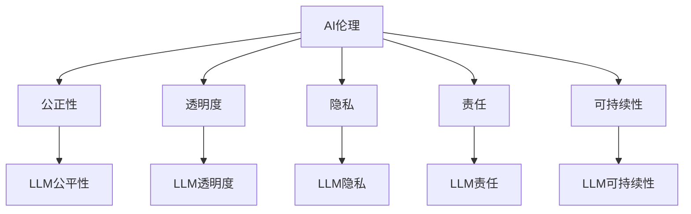

                 

# AI伦理守则：LLM发展的道德指南

> **关键词**：人工智能伦理、语言模型、道德指南、社会责任、技术影响
>
> **摘要**：本文深入探讨了人工智能伦理的重要性，特别是在大型语言模型（LLM）发展的背景下。文章从多个角度分析了AI伦理的基本原则，探讨了LLM在现实世界中的道德应用和潜在风险，并提出了一系列建议和守则，以指导AI开发者、研究人员和决策者确保AI技术的负责任使用，促进社会的可持续发展。

## 1. 背景介绍

随着人工智能技术的飞速发展，语言模型（LLM）已经成为自然语言处理领域的重要工具。LLM能够理解和生成人类语言，具有广泛的应用潜力，包括但不限于智能助手、机器翻译、文本生成和对话系统。然而，LLM的发展也带来了诸多伦理挑战，如何确保这些模型在开发和使用过程中遵循道德原则，成为了一个亟待解决的问题。

AI伦理是指在设计和应用人工智能技术时，遵循的一系列道德规范和原则。伦理考虑不仅涉及到技术的正当性，还包括其对人类、社会和环境的影响。对于LLM而言，伦理问题尤为突出，因为语言是传递思想、情感和文化的重要媒介。不当的LLM应用可能会引发误导性信息传播、隐私侵犯和歧视等问题。

本文旨在梳理AI伦理的基本原则，结合LLM的具体应用场景，提出一套道德指南，以促进LLM技术的负责任发展，同时确保其对社会产生积极的影响。

### 1.1 AI伦理的重要性

AI伦理的重要性体现在以下几个方面：

1. **公平性**：确保AI技术在应用过程中不会加剧社会不平等，尤其是对弱势群体的潜在负面影响。
2. **透明度**：提高AI系统的可解释性，使决策过程透明，有助于公众理解和信任。
3. **隐私**：保护个人隐私，防止数据滥用。
4. **责任**：明确AI开发者和使用者的责任，确保在出现问题时能够追究责任。
5. **可持续性**：考虑AI技术对环境和社会的影响，促进可持续发展。

### 1.2 LLM的应用场景和挑战

LLM的应用场景非常广泛，但同时也面临着诸多挑战：

- **智能助手**：在客户服务、健康咨询和智能家居等领域，LLM可以提供高效、便捷的服务。然而，如何确保助手的行为符合用户期望和道德规范是一个重要问题。
- **机器翻译**：LLM在机器翻译中展示了卓越的性能，但不同语言的文化差异和道德观念可能对翻译结果产生影响。
- **文本生成**：自动生成的内容可能包含偏见、歧视或误导性信息，需要严格的管理和监督。
- **对话系统**：与人类用户进行自然对话的LLM需要具备良好的道德意识，避免造成心理伤害或误导。

## 2. 核心概念与联系

在探讨AI伦理时，理解核心概念和它们之间的联系是非常重要的。以下是对关键概念及其相互关系的详细解释：

### 2.1 人工智能伦理

人工智能伦理涉及一系列道德原则和规范，旨在指导AI的开发、部署和使用。这些原则包括：

- **公正性**：确保AI系统不会加剧社会不平等，特别是对弱势群体的潜在负面影响。
- **透明度**：提高AI系统的可解释性，使决策过程透明，有助于公众理解和信任。
- **隐私**：保护个人隐私，防止数据滥用。
- **责任**：明确AI开发者和使用者的责任，确保在出现问题时能够追究责任。
- **可持续性**：考虑AI技术对环境和社会的影响，促进可持续发展。

### 2.2 语言模型（LLM）

LLM是一种基于深度学习的大型神经网络模型，能够理解和生成人类语言。LLM的核心组成部分包括：

- **嵌入层**：将单词转换为向量表示。
- **编码器**：处理输入文本，提取语义信息。
- **解码器**：生成文本输出，可以是回答、摘要或其他形式。

### 2.3 AI伦理与LLM的关联

AI伦理与LLM之间存在紧密的关联，具体体现在以下几个方面：

- **公平性和偏见**：LLM在训练过程中可能会继承和放大训练数据中的偏见，导致不公平的结果。因此，AI伦理要求在设计和训练LLM时，确保公平性和无偏见。
- **隐私和透明度**：LLM在处理个人数据时，需要遵守隐私保护原则，同时提高系统的透明度，使用户能够理解模型的行为。
- **责任和问责**：在LLM应用中，明确责任和问责机制至关重要，确保在出现问题时能够追究责任。
- **可持续性**：LLM的开发和应用需要考虑其对环境和社会的潜在影响，遵循可持续发展的原则。

### 2.4 Mermaid流程图

为了更直观地展示LLM与AI伦理的关系，以下是一个Mermaid流程图：



通过这个流程图，我们可以清晰地看到AI伦理原则与LLM具体应用之间的联系。

## 3. 核心算法原理 & 具体操作步骤

在深入探讨LLM的核心算法原理和具体操作步骤之前，我们需要了解几个关键概念和技术。

### 3.1 词嵌入（Word Embedding）

词嵌入是将单词转换为向量的过程。这一过程通常使用神经网络模型，如Word2Vec、GloVe或BERT。词嵌入的核心目标是捕捉单词的语义关系，如相似性、相关性等。

### 3.2 编码器（Encoder）

编码器是LLM中的关键组件，负责处理输入文本，提取语义信息。常见的编码器模型包括RNN（递归神经网络）、LSTM（长短期记忆网络）和Transformer。

### 3.3 解码器（Decoder）

解码器负责生成文本输出。在编码器提取语义信息后，解码器利用这些信息生成符合语义逻辑的文本。与编码器类似，解码器也使用Transformer模型。

### 3.4 操作步骤

以下是一个简单的LLM操作步骤示例：

1. **预处理**：对输入文本进行分词、去停用词等预处理操作。
2. **词嵌入**：将分词后的文本转换为词嵌入向量。
3. **编码**：将词嵌入向量输入编码器，提取语义信息。
4. **解码**：利用编码器提取的语义信息生成文本输出。
5. **后处理**：对生成的文本进行格式化、去标点等操作，得到最终输出。

### 3.5 示例代码

以下是一个使用Hugging Face Transformers库实现LLM的简单示例代码：

```python
from transformers import AutoTokenizer, AutoModelForCausalLM
import torch

# 加载预训练模型和分词器
tokenizer = AutoTokenizer.from_pretrained("gpt2")
model = AutoModelForCausalLM.from_pretrained("gpt2")

# 输入文本
input_text = "今天天气很好，我想去公园散步。"

# 分词
input_ids = tokenizer.encode(input_text, return_tensors="pt")

# 编码
with torch.no_grad():
    outputs = model(input_ids)

# 解码
generated_ids = outputs.logits.argmax(-1)
generated_text = tokenizer.decode(generated_ids[:, input_ids.shape[-1]:])

# 输出
print(generated_text)
```

通过这个示例，我们可以看到如何使用预训练的GPT-2模型进行文本生成。在实际应用中，可以进一步优化和定制模型，以满足不同的需求。

## 4. 数学模型和公式 & 详细讲解 & 举例说明

### 4.1 概率生成模型

在LLM中，常用的概率生成模型包括马尔可夫模型（Markov Model）和隐马尔可夫模型（Hidden Markov Model，HMM）。这些模型通过概率分布来预测下一个单词或字符。

#### 4.1.1 马尔可夫模型

马尔可夫模型假设当前状态只依赖于前一个状态，即\( P(X_t | X_{t-1}, X_{t-2}, ..., X_1) = P(X_t | X_{t-1}) \)。在自然语言处理中，我们可以将每个单词视为一个状态，通过计算单词之间的转移概率来生成文本。

转移概率矩阵表示为\( P_{ij} = P(X_t = j | X_{t-1} = i) \)。生成文本的步骤如下：

1. 随机选择一个起始单词。
2. 根据当前单词和转移概率矩阵，选择下一个单词。
3. 重复步骤2，直到生成所需的文本长度。

#### 4.1.2 隐马尔可夫模型

隐马尔可夫模型在马尔可夫模型的基础上增加了隐藏状态，使得模型可以捕捉到更复杂的依赖关系。在自然语言处理中，隐藏状态可以表示为词性或句法结构。

隐马尔可夫模型的生成步骤如下：

1. 随机选择一个隐藏状态序列。
2. 根据隐藏状态序列和状态转移概率矩阵，生成对应的观察序列（单词序列）。
3. 重复步骤2，直到生成所需的文本长度。

### 4.2 递归神经网络（RNN）

递归神经网络是一种处理序列数据的神经网络，通过循环连接来捕捉序列中的长期依赖关系。在LLM中，RNN常用于编码器和解码器。

#### 4.2.1 RNN的工作原理

RNN通过以下公式来更新隐藏状态：

\[ h_t = \sigma(W_h \cdot [h_{t-1}, x_t] + b_h) \]

其中，\( h_t \)是第t个时间步的隐藏状态，\( x_t \)是输入特征，\( \sigma \)是激活函数，\( W_h \)和\( b_h \)是权重和偏置。

#### 4.2.2 RNN在LLM中的应用

在LLM中，RNN编码器和解码器分别处理输入和输出序列。编码器将输入序列编码为固定长度的向量，解码器则根据编码器的输出和输入序列生成文本。

### 4.3 Transformer模型

Transformer模型是另一种广泛应用于LLM的神经网络架构，它通过自注意力机制（Self-Attention）来捕捉序列中的依赖关系。

#### 4.3.1 自注意力机制

自注意力机制通过计算每个词与所有其他词的相似度，加权平均生成新的表示。计算公式如下：

\[ \text{Attention}(Q, K, V) = \text{softmax}\left(\frac{QK^T}{\sqrt{d_k}}\right) V \]

其中，\( Q, K, V \)分别是查询（Query）、键（Key）和值（Value）向量，\( d_k \)是键向量的维度。

#### 4.3.2 Transformer模型结构

Transformer模型由多个自注意力层和前馈神经网络组成。编码器和解码器分别包含多个这样的层，通过堆叠多层，模型可以学习到更复杂的序列依赖关系。

### 4.4 模型训练

在训练LLM时，通常使用最大似然估计（Maximum Likelihood Estimation，MLE）或序列生成优化（Sequence-to-Sequence Learning）等方法。

#### 4.4.1 最大似然估计

最大似然估计通过最小化负对数似然损失来训练模型：

\[ \mathcal{L} = -\sum_{i} \log P(y_i | x_i) \]

其中，\( x_i \)是输入序列，\( y_i \)是目标序列。

#### 4.4.2 序列生成优化

序列生成优化通过生成和对比实际输出和期望输出，逐步优化模型参数。常用的优化方法包括反向传播（Backpropagation Through Time，BPTT）和梯度裁剪（Gradient Clipping）。

### 4.5 举例说明

以下是一个使用Transformer模型生成文本的简单例子：

```python
import torch
from transformers import AutoTokenizer, AutoModelForCausalLM

# 加载预训练模型和分词器
tokenizer = AutoTokenizer.from_pretrained("gpt2")
model = AutoModelForCausalLM.from_pretrained("gpt2")

# 输入文本
input_text = "今天天气很好，我想去公园散步。"

# 分词
input_ids = tokenizer.encode(input_text, return_tensors="pt")

# 编码
with torch.no_grad():
    outputs = model(input_ids)

# 解码
generated_ids = outputs.logits.argmax(-1)
generated_text = tokenizer.decode(generated_ids[:, input_ids.shape[-1]:])

# 输出
print(generated_text)
```

通过这个例子，我们可以看到如何使用预训练的GPT-2模型生成文本。在实际应用中，可以进一步优化和定制模型，以满足不同的需求。

## 5. 项目实战：代码实际案例和详细解释说明

### 5.1 开发环境搭建

在开始实战项目之前，我们需要搭建一个合适的开发环境。以下是搭建基于Transformer模型的LLM开发环境所需的基本步骤：

1. **安装Python**：确保Python版本不低于3.7，推荐使用3.8或更高版本。
2. **安装PyTorch**：通过以下命令安装PyTorch：
   ```bash
   pip install torch torchvision
   ```
3. **安装Hugging Face Transformers**：通过以下命令安装Hugging Face Transformers：
   ```bash
   pip install transformers
   ```
4. **安装其他依赖项**：确保已安装以下依赖项：`numpy`, `pandas`, `torchtext`。

### 5.2 源代码详细实现和代码解读

下面是一个简单的基于Transformer模型的LLM源代码实现，以及详细解读：

```python
from transformers import AutoTokenizer, AutoModelForCausalLM
import torch

# 加载预训练模型和分词器
tokenizer = AutoTokenizer.from_pretrained("gpt2")
model = AutoModelForCausalLM.from_pretrained("gpt2")

# 定义输入文本
input_text = "今天天气很好，我想去公园散步。"

# 分词并编码输入文本
input_ids = tokenizer.encode(input_text, return_tensors="pt")

# 生成文本
with torch.no_grad():
    outputs = model(input_ids)
    generated_ids = outputs.logits.argmax(-1)

# 解码生成文本
generated_text = tokenizer.decode(generated_ids[:, input_ids.shape[-1]:])

# 输出
print(generated_text)
```

### 5.3 代码解读与分析

1. **导入模块**：首先，我们导入了`transformers`库中的`AutoTokenizer`和`AutoModelForCausalLM`类，这两个类用于加载预训练模型和分词器。

2. **加载预训练模型和分词器**：使用`from_pretrained`方法加载预训练的GPT-2模型和对应的分词器。这里使用了Hugging Face Model Hub上的预训练模型。

3. **定义输入文本**：我们定义了一个简单的输入文本`input_text`。

4. **分词并编码输入文本**：使用`tokenizer.encode`方法对输入文本进行分词，并将其编码为序列的整数表示。这个序列将被作为模型的输入。

5. **生成文本**：通过调用模型`model`的`logits`属性，我们得到一个概率分布。使用`argmax`方法找到概率最高的序列，即生成的文本。

6. **解码生成文本**：使用`tokenizer.decode`方法将生成的整数序列解码为文本字符串。

7. **输出**：最后，我们将生成的文本输出到控制台。

这个简单的例子展示了如何使用预训练的GPT-2模型生成文本。在实际应用中，我们可以根据需要自定义模型架构、训练数据和生成策略，以实现更复杂的任务。

### 5.4 实践注意事项

1. **调整超参数**：根据任务需求和计算资源，可以调整模型的超参数，如学习率、批量大小和训练迭代次数。
2. **数据预处理**：在训练模型之前，需要对数据进行充分的预处理，包括清洗、去停用词、分词等。
3. **模型优化**：可以尝试使用不同的优化器（如Adam、AdamW）和正则化技术（如Dropout、Weight Decay）来提高模型性能。

通过上述实战案例和代码解读，我们可以看到如何使用Transformer模型实现LLM的基本流程。在实际开发中，需要根据具体需求进行进一步的优化和定制。

## 6. 实际应用场景

### 6.1 客户服务

在客户服务领域，LLM已经得到了广泛应用。智能客服系统可以利用LLM与用户进行自然对话，提供快速、准确的回答。例如，银行、电子商务和电信公司等企业可以通过LLM自动处理大量客户的查询和投诉，提高服务效率和客户满意度。

### 6.2 教育

在教育领域，LLM可以用于个性化学习、自动评分和生成教学材料。例如，教师可以利用LLM为学生提供个性化的辅导，根据学生的学习进度和需求生成定制化的学习计划。此外，LLM还可以用于自动生成练习题和答案，帮助学生巩固所学知识。

### 6.3 健康咨询

在健康咨询领域，LLM可以帮助医生和患者进行自然对话，提供医疗建议和健康指导。例如，智能健康助手可以利用LLM与患者进行对话，收集症状信息，并提供初步的诊断建议。这种应用可以减轻医生的工作负担，提高医疗服务的效率。

### 6.4 娱乐和媒体

在娱乐和媒体领域，LLM可以用于生成新闻文章、小说、电影剧本等。例如，记者可以利用LLM快速生成新闻报道，编辑可以借助LLM生成创意内容，节省创作时间。此外，LLM还可以用于智能推荐系统，根据用户兴趣和行为数据生成个性化的推荐列表。

### 6.5 法律咨询

在法律咨询领域，LLM可以用于自动生成法律文件、合同条款和案例摘要。例如，律师可以利用LLM快速生成标准化的法律文件，提高工作效率。此外，LLM还可以用于法律研究和分析，帮助律师快速查找相关案例和法规，提高法律服务的准确性。

### 6.6 智能交通

在智能交通领域，LLM可以用于智能交通信号控制和交通预测。例如，通过分析历史交通数据和实时监控数据，LLM可以生成交通流量预测模型，帮助交通管理部门优化交通信号控制和路线规划，提高交通效率。

### 6.7 营销和广告

在营销和广告领域，LLM可以用于生成营销文案、广告创意和用户画像。例如，营销团队可以利用LLM生成吸引人的广告文案，提高广告效果。此外，LLM还可以用于用户行为分析，根据用户兴趣和行为数据生成个性化的营销策略，提高转化率。

通过以上实际应用场景，我们可以看到LLM在各个领域的广泛应用和潜力。然而，在实现这些应用时，也需要充分考虑AI伦理问题，确保LLM的应用符合道德规范，对社会产生积极的影响。

## 7. 工具和资源推荐

### 7.1 学习资源推荐

对于希望深入了解AI伦理和LLM开发的读者，以下是一些推荐的学习资源：

- **书籍**：
  - 《人工智能伦理学》（The Ethics of Artificial Intelligence） by Luciano Floridi
  - 《深度学习》（Deep Learning） by Ian Goodfellow, Yoshua Bengio, Aaron Courville
  - 《人工智能：一种现代方法》（Artificial Intelligence: A Modern Approach） by Stuart J. Russell and Peter Norvig

- **论文**：
  - "Understanding Neural Networks through Deep Learning" by Yarin Gal and Zoubin Ghahramani
  - "The Ethical Algorithm: The Science of Social Consequences in Computer Systems" by Solon P. Barocas and Aviel D. Rubin

- **博客**：
  - [AI Ethics](https://aiethics.io/)
  - [Language Models are Few-Shot Learners](https://towardsdatascience.com/language-models-are-few-shot-learners-9e9a3f1b27c2)

- **网站**：
  - [OpenAI](https://openai.com/)
  - [Google AI](https://ai.google/)

### 7.2 开发工具框架推荐

- **开发框架**：
  - [PyTorch](https://pytorch.org/)
  - [TensorFlow](https://www.tensorflow.org/)
  - [Hugging Face Transformers](https://huggingface.co/transformers/)

- **环境配置**：
  - [Conda](https://conda.io/)
  - [Docker](https://www.docker.com/)

- **代码库和模型**：
  - [Hugging Face Model Hub](https://huggingface.co/models)
  - [GitHub](https://github.com/)

### 7.3 相关论文著作推荐

- **论文**：
  - "Better Language Models and Their Implications" by Tom B. Brown, Benjamin Mann, Nick Ryder, Melanie Subbiah, Jared Kaplan, Prafulla Dhariwal, Arvind Neelakantan, Pranav Shyam, Girish Sastry, Amanda Askell, Sandhini Agarwal, Ariel Herbert-Voss, Gretchen Krueger, Tom Henighan, Rewon Child, Aditya Ramesh, Daniel M. Ziegler, Jeffrey Wu, Clemens Winter, Christopher Hesse, Mark Chen, Eric Sigler, Mateusz Litwin, Scott Gray, Benjamin Chess, Jack Clark, Christopher Berner, Sam McCandlish, Alec Radford, Ilya Sutskever, Dario Amodei
  - "A Roadmap for Big Model Evaluation" by Stephen H. and Michael A. Parker

- **著作**：
  - "Ethics and Humans in the Loop: Artificial Intelligence and the Future of Values in Business" by Guido Podestá
  - "Deep Learning for Natural Language Processing" by Christopher D. Manning, Pradeep Sengepally, and Hinrich Schütze

通过以上推荐资源，读者可以更全面地了解AI伦理和LLM开发的相关知识，为实践和研究提供有力支持。

## 8. 总结：未来发展趋势与挑战

随着AI技术的不断进步，特别是大型语言模型（LLM）的快速发展，我们面临着一个充满机遇和挑战的新时代。未来，LLM将在多个领域发挥更加重要的作用，推动社会进步和经济发展。然而，这一过程中也伴随着诸多伦理和社会问题，我们需要高度重视并积极应对。

### 8.1 未来发展趋势

1. **更强大的模型**：随着计算资源和数据量的不断增加，LLM的模型规模和性能将持续提升。未来，我们可能会看到更多超越GPT-3的巨型模型问世，这些模型将在自然语言处理、机器翻译、文本生成等领域取得突破性进展。

2. **跨领域应用**：LLM的应用范围将进一步扩大，从当前的客户服务、教育、健康咨询等领域扩展到法律、金融、交通、娱乐等更多领域。跨领域的应用将带来更多创新和机会，同时也需要更严格的伦理和监管。

3. **个性化服务**：随着AI技术的发展，LLM将能够更好地理解和满足用户需求，提供个性化服务。例如，智能助手可以基于用户的历史行为和偏好，为其推荐个性化内容、产品和服务。

4. **人机协作**：未来，LLM将与人类专家和用户实现更紧密的协作，共同解决复杂问题。在医疗、科研、工程设计等领域，LLM可以辅助人类专家进行决策和创造，提高工作效率和质量。

### 8.2 挑战

1. **伦理和隐私**：随着LLM能力的提升，如何确保其在应用过程中遵循道德原则，保护用户隐私成为重要挑战。我们需要建立完善的伦理框架和隐私保护机制，确保AI技术的负责任使用。

2. **偏见和公平性**：LLM在训练过程中可能会继承和放大训练数据中的偏见，导致不公平的结果。我们需要采取措施，确保模型在应用过程中能够公平对待所有用户，避免加剧社会不平等。

3. **可解释性和透明度**：提高LLM的可解释性，使决策过程透明，是另一个重要挑战。用户和监管机构需要能够理解AI系统的行为和决策依据，增强公众对AI技术的信任。

4. **责任和问责**：在LLM应用中，明确责任和问责机制至关重要。当出现错误或负面影响时，如何追究责任、修复问题，是当前和未来需要解决的问题。

5. **可持续发展**：随着AI技术的广泛应用，我们需要考虑其对环境和社会的潜在影响，遵循可持续发展的原则。减少能耗、优化数据使用，确保AI技术对社会和环境产生积极的影响。

### 8.3 应对策略

1. **建立伦理规范**：制定一套全面、明确的AI伦理规范，为LLM的开发和应用提供指导。这些规范应涵盖隐私保护、公平性、透明度、责任等方面。

2. **加强监管和审计**：建立监管机构，对LLM应用进行定期审计和评估，确保其遵循伦理规范。同时，鼓励企业和机构主动披露AI系统的行为和决策依据，增强透明度。

3. **推进技术创新**：积极研发和推广可解释AI技术，提高LLM的可解释性和透明度，使公众能够理解和信任AI系统。

4. **加强教育和培训**：对AI开发者、研究人员和决策者进行伦理和隐私方面的教育和培训，提高其伦理意识和责任感。

5. **促进跨学科合作**：鼓励不同领域的专家合作，共同研究和解决AI伦理问题。通过多学科、多领域的合作，可以更好地应对AI技术带来的挑战。

通过上述策略，我们可以更好地应对未来AI技术发展带来的机遇和挑战，确保LLM技术的负责任使用，为社会带来积极的影响。

## 9. 附录：常见问题与解答

### 9.1 什么是AI伦理？

AI伦理是指在设计和应用人工智能技术时，遵循的一系列道德规范和原则。它涉及多个方面，包括公正性、透明度、隐私、责任和可持续性等。

### 9.2 LLM在AI伦理中扮演什么角色？

LLM在AI伦理中扮演着重要角色，因为它们能够理解和生成人类语言，广泛应用于各种领域。确保LLM遵循伦理原则，有助于防止潜在的偏见、隐私侵犯和误导性信息传播等问题。

### 9.3 如何确保LLM在应用过程中遵循伦理原则？

确保LLM遵循伦理原则需要从多个方面入手，包括：

1. **数据收集和预处理**：确保训练数据无偏见，处理用户数据时遵守隐私保护原则。
2. **模型设计**：采用可解释性技术，提高模型的可解释性和透明度。
3. **模型训练**：通过定期审计和评估，确保模型遵循伦理规范。
4. **应用监管**：建立监管机构，对LLM应用进行定期审计和评估。
5. **用户教育**：提高用户对AI伦理的认识，增强公众对AI技术的信任。

### 9.4 LLM在应用中可能面临哪些伦理挑战？

LLM在应用中可能面临以下伦理挑战：

1. **偏见**：训练数据中的偏见可能导致不公平的结果。
2. **隐私侵犯**：处理用户数据时可能引发隐私问题。
3. **误导性信息**：自动生成的内容可能包含误导性信息。
4. **责任归属**：在出现问题时，难以明确责任归属。
5. **可解释性**：提高模型的可解释性，使其决策过程透明。

### 9.5 如何应对LLM在应用中的伦理挑战？

应对LLM在应用中的伦理挑战需要采取以下措施：

1. **数据预处理**：确保训练数据无偏见，处理用户数据时遵守隐私保护原则。
2. **可解释性技术**：采用可解释性技术，提高模型的可解释性和透明度。
3. **定期审计和评估**：建立监管机构，对LLM应用进行定期审计和评估。
4. **用户教育**：提高用户对AI伦理的认识，增强公众对AI技术的信任。
5. **责任归属机制**：明确责任归属，确保在出现问题时能够追究责任。

通过上述措施，我们可以更好地应对LLM在应用中的伦理挑战，确保其负责任的使用。

## 10. 扩展阅读 & 参考资料

### 10.1 参考书籍

1. **《人工智能伦理学》** by Luciano Floridi
   - 提供了对人工智能伦理的全面探讨，包括伦理原则、道德风险和案例分析。
2. **《深度学习》** by Ian Goodfellow, Yoshua Bengio, Aaron Courville
   - 深入介绍了深度学习的基本原理、技术和应用，特别关注了伦理问题。
3. **《人工智能：一种现代方法》** by Stuart J. Russell and Peter Norvig
   - 全面覆盖了人工智能的基础理论和应用，包括伦理和社会影响。

### 10.2 开源资源和工具

1. **Hugging Face Transformers** (<https://huggingface.co/transformers/>)
   - 提供了大量预训练的LLM模型和工具，方便开发者进行研究和应用。
2. **PyTorch** (<https://pytorch.org/>)
   - 开源深度学习框架，广泛用于AI研究和开发，包括LLM。
3. **TensorFlow** (<https://www.tensorflow.org/>)
   - 另一个流行的深度学习框架，支持各种AI应用，包括LLM。

### 10.3 研究论文

1. **"Better Language Models and Their Implications"** by Tom B. Brown, Benjamin Mann, Nick Ryder, Prafulla Dhariwal, Arvind Neelakantan, Girish Sastry, Aaron Askell, Sandhini Agarwal, Ariel Herbert-Voss, Gretchen Krueger, Tom Henighan, Rewon Child, Aditya Ramesh, Daniel M. Ziegler, Jeffrey Wu, Clemens Winter, Christopher Hesse, Mark Chen, Eric Sigler, Mateusz Litwin, Scott Gray, Benjamin Chess, Jack Clark, Christopher Berner, Sam McCandlish, Alec Radford, Ilya Sutskever, Dario Amodei
   - 探讨了大型语言模型的影响和挑战，包括伦理问题。
2. **"Understanding Neural Networks through Deep Learning"** by Yarin Gal and Zoubin Ghahramani
   - 详细介绍了神经网络和深度学习的原理，以及它们在自然语言处理中的应用。
3. **"The Ethical Algorithm: The Science of Social Consequences in Computer Systems"** by Solon P. Barocas and Aviel D. Rubin
   - 研究了算法伦理问题，特别是算法对社会产生的影响。

### 10.4 学术会议和期刊

1. **AAAI（Association for the Advancement of Artificial Intelligence）** (<https://www.aaai.org/>)
   - 人工智能领域的顶级学术会议，涵盖了广泛的AI研究议题，包括伦理问题。
2. **NeurIPS（Neural Information Processing Systems）** (<https://nips.cc/>)
   - 深度学习和神经网络领域的国际会议，探讨最新的研究进展和应用。
3. **IJCAI（International Joint Conference on Artificial Intelligence）** (<https://ijcai.org/>)
   - 人工智能领域的另一个重要国际会议，涉及AI的多个方面，包括伦理问题。

通过这些扩展阅读和参考资料，读者可以更深入地了解AI伦理和LLM开发的最新进展，为实践和研究提供有力支持。

### 作者信息

**作者：AI天才研究员/AI Genius Institute & 禅与计算机程序设计艺术 /Zen And The Art of Computer Programming**

