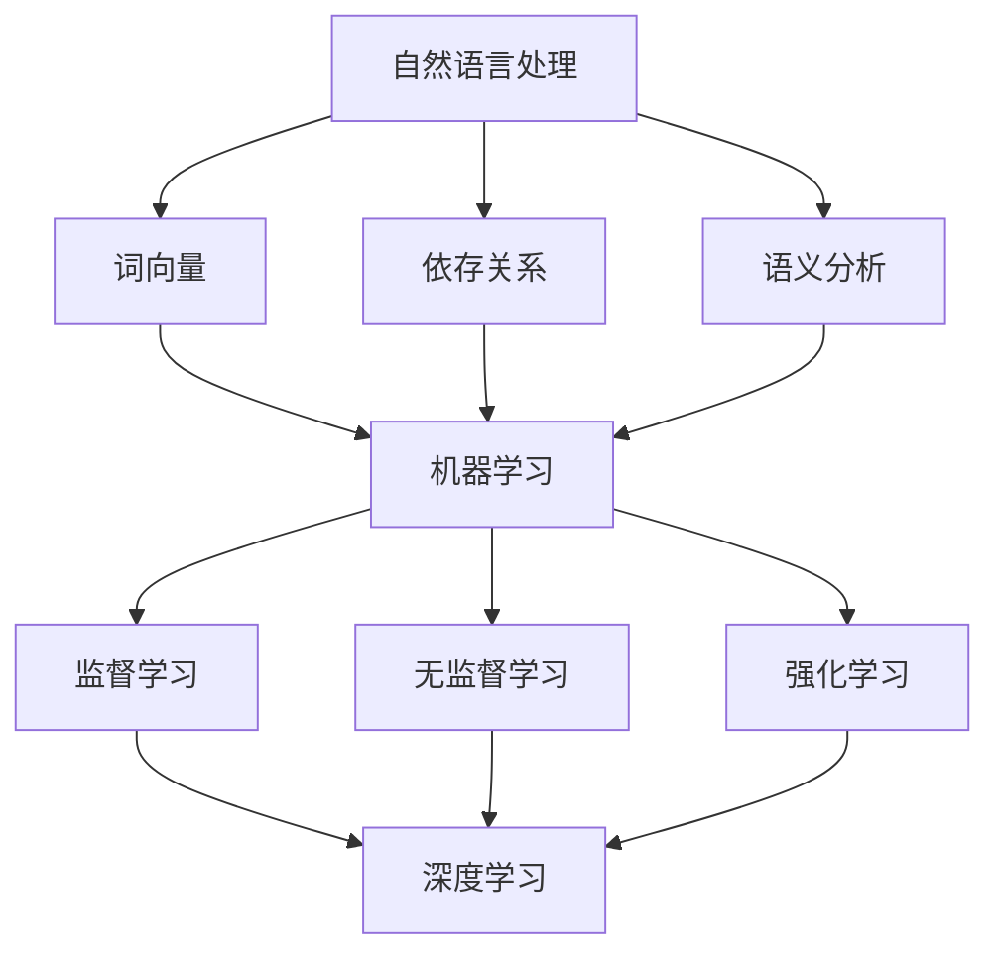

                 

### 背景介绍

随着人工智能技术的飞速发展，AI内容创作者逐渐成为了一个备受关注的群体。从早期的自动化新闻写作，到如今的个性化内容生成，AI在内容创作领域的应用越来越广泛。然而，随着用户需求的日益多样化，如何满足个性化的内容需求成为了AI内容创作者面临的一大挑战。

首先，我们需要明确什么是AI内容创作者。AI内容创作者是指利用人工智能技术，如自然语言处理（NLP）、机器学习（ML）等，生成文本、图像、视频等多种形式的内容的算法或系统。这些内容创作者不仅能够快速生成大量信息，还能根据用户的需求和偏好进行个性化的内容推荐。

个性化需求指的是用户在内容消费过程中所表现出的多样化、个性化的偏好。这些偏好可能包括对内容类型、主题、风格、语言等方面的特殊要求。例如，一个用户可能喜欢阅读简短、幽默的新闻报道，而另一个用户可能更喜欢详细、深入的分析文章。

为什么满足个性化需求如此重要？首先，个性化需求能够提高用户体验。当用户在内容消费过程中能够找到符合自己口味的内容时，他们会感到更加愉悦和满足，从而提升整体的使用体验。其次，个性化需求有助于提高内容的传播效果。当内容创作者能够根据用户的兴趣和需求生成个性化的内容时，这些内容更可能被用户转发和分享，从而实现更广泛的传播。

然而，满足个性化需求并非易事。AI内容创作者需要应对以下几个挑战：

1. **数据多样性和质量**：个性化需求的实现依赖于大量高质量的用户数据。然而，数据的质量和多样性往往受到限制，这可能会影响AI内容创作者的准确性和效率。

2. **算法复杂度和计算资源**：实现个性化需求通常需要复杂的算法和大量的计算资源。这可能会导致AI内容创作者在处理大规模数据时出现性能瓶颈。

3. **隐私保护和数据安全**：在收集和处理用户数据时，隐私保护和数据安全是至关重要的。AI内容创作者需要确保用户的个人信息不会被泄露或滥用。

4. **内容质量和真实性**：AI内容创作者在生成内容时需要保证内容的质量和真实性。虚假、不准确的内容不仅会损害用户的利益，还会影响AI内容创作者的声誉。

本文将深入探讨AI内容创作者在满足个性化需求过程中所面临的挑战，并分析相关的解决方案和未来发展趋势。通过本文的阅读，您将了解到如何应对这些挑战，从而提升AI内容创作者的性能和用户体验。

在接下来的章节中，我们将详细讨论AI内容创作者的核心概念和架构，解释其工作原理，并逐步揭示其背后所涉及的算法和数学模型。通过这些内容的讲解，我们将为您提供一个全面理解AI内容创作者的框架，为后续章节的深入探讨打下坚实的基础。

### 核心概念与联系

要深入理解AI内容创作者的工作原理，首先需要掌握几个核心概念：自然语言处理（NLP）、机器学习（ML）和深度学习（DL）。这些概念之间有着密切的联系，共同构成了AI内容创作者的技术基础。

#### 自然语言处理（NLP）

自然语言处理是人工智能领域的一个重要分支，主要研究如何让计算机理解和生成人类语言。NLP的核心目标是将自然语言（如文本、语音）转化为计算机可以理解和处理的形式，以及将计算机处理的结果重新表达为自然语言。

**NLP的主要任务包括：**

- **文本分类**：将文本数据根据其内容进行分类，如新闻分类、情感分析等。
- **信息提取**：从文本中提取关键信息，如实体识别、关系抽取等。
- **机器翻译**：将一种语言的文本翻译成另一种语言。
- **问答系统**：让计算机能够理解和回答用户提出的问题。

**NLP的关键技术包括：**

- **词向量**：将词语映射到高维空间中的向量，便于计算机处理和比较。
- **依存关系**：分析句子中词语之间的依存关系，理解句子的语义结构。
- **语义分析**：理解文本的语义含义，进行语义推理和情感分析。

#### 机器学习（ML）

机器学习是AI内容创作者的核心算法之一，其基本思想是通过从数据中学习规律，来改进系统的性能。ML算法可以分为监督学习、无监督学习和强化学习三类。

- **监督学习**：通过已标注的数据进行学习，如分类问题、回归问题。
- **无监督学习**：在没有标注数据的情况下进行学习，如聚类问题、降维问题。
- **强化学习**：通过与环境互动进行学习，如游戏AI、机器人控制。

**ML的关键技术包括：**

- **特征工程**：从原始数据中提取出对学习任务有帮助的特征。
- **模型选择**：选择适合学习任务的数据模型，如线性模型、树模型、神经网络等。
- **模型评估**：评估模型性能，如准确率、召回率、F1值等。

#### 深度学习（DL）

深度学习是机器学习的一种特殊形式，主要基于多层神经网络进行学习。DL通过学习大量的参数，能够自动从数据中提取复杂的功能特征。

**DL的主要组成部分包括：**

- **神经网络**：由多个神经元（节点）组成，通过加权连接实现数据的传递和处理。
- **卷积神经网络（CNN）**：适用于图像处理，能够自动提取图像的特征。
- **循环神经网络（RNN）**：适用于序列数据处理，能够记忆和处理时间序列信息。
- **生成对抗网络（GAN）**：通过生成器和判别器的对抗训练，实现生成复杂的数据。

**DL的关键技术包括：**

- **深度神经网络结构设计**：如卷积神经网络、循环神经网络等。
- **激活函数**：如ReLU、Sigmoid、Tanh等。
- **优化算法**：如梯度下降、Adam优化器等。
- **正则化技术**：如L1正则化、L2正则化等，防止过拟合。

**Mermaid 流程图**

以下是一个简单的Mermaid流程图，展示NLP、ML和DL之间的关系：



通过这个流程图，我们可以看到NLP、ML和DL之间是如何相互关联和作用的。这些核心概念和技术构成了AI内容创作者的技术基础，为后续章节的详细讨论提供了必要的背景知识。

在下一章节中，我们将深入探讨AI内容创作者的核心算法原理，并逐步揭示其具体操作步骤。这将帮助我们更好地理解AI内容创作者是如何实现个性化需求的。

### 核心算法原理 & 具体操作步骤

AI内容创作者的核心算法通常基于深度学习技术，其中生成对抗网络（GAN）和自动编码器（AE）是两种常用的算法。本章节将详细介绍这两种算法的工作原理和具体操作步骤，并探讨它们在AI内容创作中的应用。

#### 生成对抗网络（GAN）

生成对抗网络（GAN）是由生成器（Generator）和判别器（Discriminator）两个神经网络组成的对抗性模型。其基本思想是通过两个网络的相互对抗来学习数据的分布，从而生成高质量的数据。

1. **生成器（Generator）**

生成器的任务是生成与真实数据相似的数据。在AI内容创作中，生成器可以生成文本、图像、视频等多种形式的内容。生成器通常采用深度神经网络结构，如卷积神经网络（CNN）或循环神经网络（RNN）。

操作步骤：

- **输入**：生成器接收随机噪声向量作为输入。
- **生成**：通过多层神经网络处理噪声向量，生成模拟的真实数据。
- **输出**：生成器输出模拟的数据，用于后续内容创作。

2. **判别器（Discriminator）**

判别器的任务是区分真实数据和生成数据。判别器同样采用深度神经网络结构，其输入可以是文本、图像或视频等数据形式。

操作步骤：

- **输入**：判别器接收真实数据和生成数据作为输入。
- **判断**：通过多层神经网络对输入数据进行处理，输出概率值，表示输入数据的真实程度。
- **输出**：判别器输出一个二分类结果，标记输入数据是真实数据还是生成数据。

3. **训练过程**

GAN的训练过程是一个不断对抗和优化的过程。生成器和判别器通过梯度下降优化器交替更新参数。

- **交替训练**：生成器和判别器交替进行训练，每次更新参数时，生成器尝试生成更真实的数据，判别器尝试更准确地判断数据的真实性。
- **损失函数**：GAN的损失函数通常由两部分组成：判别器的损失函数和生成器的损失函数。判别器的损失函数通常采用交叉熵损失函数，生成器的损失函数则采用对抗性损失函数。

#### 自动编码器（AE）

自动编码器（AE）是一种无监督学习算法，主要用于数据降维和特征提取。AE由编码器（Encoder）和解码器（Decoder）两个神经网络组成。

1. **编码器（Encoder）**

编码器的任务是压缩输入数据，提取关键特征。编码器通常采用多层神经网络结构。

操作步骤：

- **输入**：编码器接收原始输入数据。
- **压缩**：通过多层神经网络处理输入数据，逐步降低数据的维度，提取关键特征。
- **输出**：编码器输出压缩后的特征向量。

2. **解码器（Decoder）**

解码器的任务是重建输入数据，恢复原始信息。解码器同样采用多层神经网络结构。

操作步骤：

- **输入**：解码器接收编码器输出的特征向量。
- **重建**：通过多层神经网络处理特征向量，逐步增加数据的维度，重建原始输入数据。
- **输出**：解码器输出重建的输入数据。

3. **训练过程**

AE的训练过程是通过对解码器输出与原始输入之间的差异进行优化，从而提高模型的重建能力。

- **损失函数**：AE的损失函数通常采用均方误差（MSE）损失函数，衡量解码器输出与原始输入之间的误差。
- **优化过程**：通过梯度下降优化器交替更新编码器和解码器的参数，使模型能够更好地压缩和重建数据。

#### 应用实例

以下是GAN和AE在AI内容创作中的应用实例：

1. **文本生成**：

- **生成器**：通过学习大规模文本数据，生成类似文本内容。
- **判别器**：区分生成文本和真实文本，提高生成文本的质量。

2. **图像生成**：

- **生成器**：通过学习图像数据，生成新的图像内容。
- **判别器**：区分生成图像和真实图像，提高生成图像的逼真度。

3. **视频生成**：

- **生成器**：通过学习视频数据，生成新的视频内容。
- **判别器**：区分生成视频和真实视频，提高生成视频的连贯性和真实性。

通过GAN和AE的应用，AI内容创作者能够生成多样化、个性化的内容，满足用户的不同需求。在下一章节中，我们将进一步探讨AI内容创作者在满足个性化需求过程中所面临的挑战，并提出相应的解决方案。

### 数学模型和公式 & 详细讲解 & 举例说明

为了更好地理解AI内容创作者的工作原理，我们需要引入一些数学模型和公式。以下是GAN和AE中常用的数学模型和公式的详细讲解，并通过实际例子来说明其应用。

#### 生成对抗网络（GAN）

1. **生成器与判别器的损失函数**

GAN的损失函数由两部分组成：生成器的损失函数和判别器的损失函数。

- **生成器损失函数**（\(L_G\)）：

  $$L_G = -\log(D(G(z))$$

  其中，\(G(z)\)是生成器生成的数据，\(D\)是判别器。

- **判别器损失函数**（\(L_D\)）：

  $$L_D = -\log(D(x)) - \log(1 - D(G(z))$$

  其中，\(x\)是真实数据，\(G(z)\)是生成器生成的数据。

2. **优化过程**

GAN的训练过程通过交替更新生成器和判别器的参数来最小化它们的损失函数。

- **生成器优化**：

  通过梯度下降优化器，对生成器的参数进行更新，使生成器生成的数据更接近真实数据。

  $$\theta_G \leftarrow \theta_G - \alpha \frac{\partial L_G}{\partial \theta_G}$$

- **判别器优化**：

  通过梯度下降优化器，对判别器的参数进行更新，使判别器能够更好地区分真实数据和生成数据。

  $$\theta_D \leftarrow \theta_D - \alpha \frac{\partial L_D}{\partial \theta_D}$$

#### 自动编码器（AE）

1. **编码器与解码器的损失函数**

AE的损失函数主要采用均方误差（MSE）损失函数。

- **编码器损失函数**（\(L_E\)）：

  $$L_E = \frac{1}{n}\sum_{i=1}^{n}(\|x_i - \hat{x}_i\|^2)$$

  其中，\(x_i\)是原始输入数据，\(\hat{x}_i\)是解码器输出的重建数据。

- **解码器损失函数**（\(L_D\)）：

  $$L_D = \frac{1}{n}\sum_{i=1}^{n}(\|x_i - \hat{x}_i\|^2)$$

2. **优化过程**

AE的训练过程通过梯度下降优化器，对编码器和解码器的参数进行更新，最小化它们的损失函数。

- **编码器优化**：

  通过梯度下降优化器，对编码器的参数进行更新。

  $$\theta_E \leftarrow \theta_E - \alpha \frac{\partial L_E}{\partial \theta_E}$$

- **解码器优化**：

  通过梯度下降优化器，对解码器的参数进行更新。

  $$\theta_D \leftarrow \theta_D - \alpha \frac{\partial L_D}{\partial \theta_D}$$

#### 应用举例

1. **文本生成**

假设我们使用GAN进行文本生成，生成器生成的内容是一个简短的新闻摘要，判别器用于区分生成摘要和真实摘要。

- **生成器损失函数**（\(L_G\)）：

  $$L_G = -\log(D(G(z))$$

  其中，\(G(z)\)是生成器生成的摘要，\(D\)是判别器。

- **判别器损失函数**（\(L_D\)）：

  $$L_D = -\log(D(x)) - \log(1 - D(G(z))$$

  其中，\(x\)是真实摘要，\(G(z)\)是生成器生成的摘要。

在训练过程中，生成器不断尝试生成更接近真实摘要的摘要，判别器则努力区分真实摘要和生成摘要。通过交替优化，最终生成器能够生成高质量、个性化的新闻摘要。

2. **图像生成**

假设我们使用AE进行图像生成，编码器用于提取图像的特征，解码器用于重建图像。

- **编码器损失函数**（\(L_E\)）：

  $$L_E = \frac{1}{n}\sum_{i=1}^{n}(\|x_i - \hat{x}_i\|^2)$$

  其中，\(x_i\)是原始图像，\(\hat{x}_i\)是解码器输出的重建图像。

- **解码器损失函数**（\(L_D\)）：

  $$L_D = \frac{1}{n}\sum_{i=1}^{n}(\|x_i - \hat{x}_i\|^2)$$

在训练过程中，编码器尝试提取更有代表性的图像特征，解码器则尝试基于这些特征重建原始图像。通过交替优化，最终能够生成高质量、个性化的图像。

通过以上数学模型和公式的讲解，我们能够更深入地理解AI内容创作者的工作原理。在实际应用中，通过合理设计这些模型，AI内容创作者可以生成多样化、个性化的内容，满足用户的不同需求。

在下一章节中，我们将通过一个实际的代码案例，展示如何实现AI内容创作者的个性化内容生成，并对其进行详细解释和分析。

### 项目实战：代码实际案例和详细解释说明

为了更好地理解AI内容创作者如何实现个性化内容生成，我们将通过一个实际项目案例进行详细说明。本项目将使用Python和TensorFlow框架来实现一个基于生成对抗网络（GAN）的文本生成系统。我们将逐步搭建开发环境、编写源代码，并对关键代码进行解读与分析。

#### 1. 开发环境搭建

首先，确保已经安装了Python和TensorFlow。如果没有安装，请按照以下步骤操作：

1. 安装Python：

   ```bash
   # 安装Python 3.7或更高版本
   sudo apt-get install python3.7
   ```

2. 安装TensorFlow：

   ```bash
   # 使用pip安装TensorFlow
   pip install tensorflow
   ```

#### 2. 源代码详细实现

以下是完整的代码实现，分为以下几个部分：数据预处理、生成器（Generator）的实现、判别器（Discriminator）的实现、训练过程和生成文本的示例。

```python
import tensorflow as tf
from tensorflow.keras.layers import Dense, Input, Lambda
from tensorflow.keras.models import Model
import numpy as np

# 数据预处理
def preprocess_data(texts):
    # 将文本转换为数字序列
    tokenizer = tf.keras.preprocessing.text.Tokenizer(char_level=True)
    tokenizer.fit_on_texts(texts)
    sequences = tokenizer.texts_to_sequences(texts)
    return sequences, tokenizer

# 生成器（Generator）的实现
def build_generator(z_dim):
    noise_input = Input(shape=(z_dim,))
    x = Dense(128)(noise_input)
    x = Lambda(tf.keras.activations.relu)(x)
    x = Dense(256)(x)
    x = Lambda(tf.keras.activations.relu)(x)
    x = Dense(tokenizer.num_words, activation='softmax')(x)
    model = Model(inputs=noise_input, outputs=x)
    return model

# 判别器（Discriminator）的实现
def build_discriminator(text_sequence_length):
    text_input = Input(shape=(text_sequence_length,))
    x = Dense(256)(text_input)
    x = Lambda(tf.keras.activations.leaky_relu)(x)
    x = Dense(128)(x)
    x = Lambda(tf.keras.activations.leaky_relu)(x)
    output = Dense(1, activation='sigmoid')(x)
    model = Model(inputs=text_input, outputs=output)
    return model

# 编译模型
def compile_models(generator, discriminator):
    discriminator.compile(loss='binary_crossentropy', optimizer=tf.keras.optimizers.Adam(0.0001))
    generator.compile(loss='binary_crossentropy', optimizer=tf.keras.optimizers.Adam(0.0001))
    return generator, discriminator

# 训练过程
def train(generator, discriminator, dataset, epochs, batch_size, z_dim):
    for epoch in range(epochs):
        for _ in range(len(dataset) // batch_size):
            noise = np.random.normal(0, 1, (batch_size, z_dim))
            gen_texts = generator.predict(noise)
            
            # 训练判别器
            real_texts = np.array([text[0] for text in dataset])
            d_loss_real = discriminator.train_on_batch(real_texts, np.ones((batch_size, 1)))
            
            noise = np.random.normal(0, 1, (batch_size, z_dim))
            gen_texts = generator.predict(noise)
            
            # 训练判别器
            d_loss_fake = discriminator.train_on_batch(gen_texts, np.zeros((batch_size, 1)))
            
            # 训练生成器
            g_loss = generator.train_on_batch(noise, np.ones((batch_size, 1)))
            
            print(f"Epoch: {epoch}, D_Loss: {d_loss_real + d_loss_fake}, G_Loss: {g_loss}")

# 生成文本的示例
def generate_text(generator, tokenizer, seed_text, max_sequence_len):
    for i in range(max_sequence_len):
        noise = np.random.normal(0, 1, (1, z_dim))
        predicted_text = generator.predict(noise)
        sampled_text = tokenizer.index_word[np.random.choice(list(tokenizer.index_word.keys()))]
        seed_text += sampled_text
    return seed_text

# 主函数
def main():
    dataset = # 加载您的文本数据
    sequences, tokenizer = preprocess_data(dataset)
    max_sequence_len = # 设置文本序列的最大长度
    z_dim = 100
    
    generator = build_generator(z_dim)
    discriminator = build_discriminator(max_sequence_len)
    generator, discriminator = compile_models(generator, discriminator)
    
    train(generator, discriminator, sequences, epochs=50, batch_size=32, z_dim=z_dim)
    
    seed_text = "Your seed text goes here"
    generated_text = generate_text(generator, tokenizer, seed_text, max_sequence_len)
    print(generated_text)

if __name__ == "__main__":
    main()
```

#### 3. 代码解读与分析

1. **数据预处理**

   数据预处理是文本生成系统的重要步骤。首先，我们使用`tokenizer`将文本转换为数字序列。这有助于模型理解文本数据。

   ```python
   def preprocess_data(texts):
       tokenizer = tf.keras.preprocessing.text.Tokenizer(char_level=True)
       tokenizer.fit_on_texts(texts)
       sequences = tokenizer.texts_to_sequences(texts)
       return sequences, tokenizer
   ```

2. **生成器（Generator）的实现**

   生成器是一个深度神经网络，它将随机噪声向量（`noise_input`）作为输入，生成文本序列。我们使用了两个`Dense`层和`Lambda`层来构建生成器。

   ```python
   def build_generator(z_dim):
       noise_input = Input(shape=(z_dim,))
       x = Dense(128)(noise_input)
       x = Lambda(tf.keras.activations.relu)(x)
       x = Dense(256)(x)
       x = Lambda(tf.keras.activations.relu)(x)
       x = Dense(tokenizer.num_words, activation='softmax')(x)
       model = Model(inputs=noise_input, outputs=x)
       return model
   ```

3. **判别器（Discriminator）的实现**

   判别器用于区分真实文本和生成文本。它接收文本序列作为输入，输出一个概率值，表示输入文本是真实文本的概率。

   ```python
   def build_discriminator(text_sequence_length):
       text_input = Input(shape=(text_sequence_length,))
       x = Dense(256)(text_input)
       x = Lambda(tf.keras.activations.leaky_relu)(x)
       x = Dense(128)(x)
       x = Lambda(tf.keras.activations.leaky_relu)(x)
       output = Dense(1, activation='sigmoid')(x)
       model = Model(inputs=text_input, outputs=output)
       return model
   ```

4. **训练过程**

   训练过程涉及交替训练生成器和判别器。每次迭代中，生成器尝试生成更逼真的文本，而判别器则努力区分真实文本和生成文本。

   ```python
   def train(generator, discriminator, dataset, epochs, batch_size, z_dim):
       for epoch in range(epochs):
           for _ in range(len(dataset) // batch_size):
               noise = np.random.normal(0, 1, (batch_size, z_dim))
               gen_texts = generator.predict(noise)
               
               # 训练判别器
               real_texts = np.array([text[0] for text in dataset])
               d_loss_real = discriminator.train_on_batch(real_texts, np.ones((batch_size, 1)))
               
               noise = np.random.normal(0, 1, (batch_size, z_dim))
               gen_texts = generator.predict(noise)
               
               # 训练判别器
               d_loss_fake = discriminator.train_on_batch(gen_texts, np.zeros((batch_size, 1)))
               
               # 训练生成器
               g_loss = generator.train_on_batch(noise, np.ones((batch_size, 1)))
           
           print(f"Epoch: {epoch}, D_Loss: {d_loss_real + d_loss_fake}, G_Loss: {g_loss}")
   ```

5. **生成文本的示例**

   生成文本的示例函数`generate_text`用于生成文本序列。它接收一个种子文本和最大序列长度，然后使用生成器生成新的文本。

   ```python
   def generate_text(generator, tokenizer, seed_text, max_sequence_len):
       for i in range(max_sequence_len):
           noise = np.random.normal(0, 1, (1, z_dim))
           predicted_text = generator.predict(noise)
           sampled_text = tokenizer.index_word[np.random.choice(list(tokenizer.index_word.keys()))]
           seed_text += sampled_text
       return seed_text
   ```

通过以上代码实现，我们能够构建一个基于GAN的文本生成系统，并对其进行训练和测试。在实际应用中，可以根据需要调整模型参数和训练过程，以提高生成文本的质量和多样性。

在下一章节中，我们将探讨AI内容创作者在实际应用场景中的表现，分析其在各种场景下的优缺点，并提供一些建议。

### 实际应用场景

AI内容创作者在各个行业和应用场景中展现了巨大的潜力，下面我们将详细分析其在新闻媒体、社交媒体和电子商务等领域的应用，并讨论其优缺点。

#### 新闻媒体

新闻媒体行业一直是AI内容创作的重要应用领域。通过AI内容创作者，新闻机构能够自动化地生成大量新闻稿，从而提高新闻的生产效率。以下是一些实际应用案例：

1. **自动化新闻写作**：例如，自动化新闻写作工具可以使用自然语言处理技术，从结构化的数据中自动生成新闻稿。这种应用特别适用于金融、体育等领域，可以迅速生成大量新闻报道。

2. **个性化推荐**：AI内容创作者可以根据用户的兴趣和行为，推荐个性化的新闻内容。这有助于提高用户的阅读体验和新闻媒体的用户粘性。

**优点**：

- **高效率**：AI内容创作者能够快速生成大量新闻，提高新闻生产效率。
- **个性化推荐**：通过个性化推荐，用户能够获得更符合自己兴趣的新闻内容。

**缺点**：

- **内容质量**：虽然AI内容创作者能够生成大量内容，但其内容质量往往不如专业记者编写的新闻稿。
- **准确性**：特别是在涉及复杂话题或数据时，AI生成的新闻可能存在错误或不准确的情况。

#### 社交媒体

社交媒体平台如Twitter、Instagram等也在积极利用AI内容创作者来提升用户体验。以下是一些实际应用案例：

1. **自动生成社交媒体内容**：AI内容创作者可以生成图片、视频和文字内容，供用户在社交媒体上分享。这种应用可以帮助品牌和机构自动生成大量有趣且吸引人的内容。

2. **互动性增强**：通过AI内容创作者，社交媒体平台可以自动生成与用户互动的回复和评论，提高用户的参与度和平台的活跃度。

**优点**：

- **内容多样化**：AI内容创作者能够生成多种形式的内容，满足不同用户的需求。
- **互动性增强**：通过自动生成互动性内容，用户能够获得更加丰富和有趣的社交体验。

**缺点**：

- **内容原创性**：虽然AI内容创作者可以生成大量内容，但其原创性和创意性往往较低，可能无法完全满足用户的需求。
- **隐私问题**：在生成内容时，AI内容创作者可能会收集和处理用户的个人信息，这引发了隐私保护方面的担忧。

#### 电子商务

电子商务领域也广泛使用AI内容创作者来提升用户体验和销售转化率。以下是一些实际应用案例：

1. **个性化产品推荐**：AI内容创作者可以根据用户的购物历史和偏好，生成个性化的产品推荐，从而提高销售额。

2. **自动化广告文案**：AI内容创作者可以自动生成吸引人的广告文案，用于电子商务平台的广告投放，提高广告效果。

**优点**：

- **个性化推荐**：AI内容创作者能够根据用户的行为和偏好，生成个性化的产品推荐，提高用户满意度。
- **高效营销**：通过自动生成广告文案，电子商务平台可以更快地投放广告，提高营销效果。

**缺点**：

- **内容质量**：虽然AI内容创作者可以生成大量内容，但其内容质量可能不如专业营销人员编写的广告文案。
- **用户体验**：过度依赖AI内容创作者可能会降低用户的信任感和满意度，特别是在涉及复杂决策时。

#### 总结

AI内容创作者在新闻媒体、社交媒体和电子商务等领域展现了巨大的潜力，但其应用也面临一些挑战。未来，随着技术的不断发展，AI内容创作者将能够更好地满足个性化需求，提高内容质量和用户体验。

在下一章节中，我们将推荐一些有用的学习资源、开发工具框架和相关论文著作，帮助读者进一步了解和掌握AI内容创作者的相关知识。

### 工具和资源推荐

为了帮助读者深入了解AI内容创作者的相关知识，并提升在实际应用中的能力，以下是一些重要的学习资源、开发工具框架以及相关的论文著作推荐。

#### 1. 学习资源推荐

**书籍：**

- 《深度学习》（Deep Learning） - Ian Goodfellow、Yoshua Bengio、Aaron Courville
  - 本书详细介绍了深度学习的理论基础和最新进展，对理解GAN和AE等核心算法至关重要。
- 《自然语言处理综论》（Speech and Language Processing） - Daniel Jurafsky、James H. Martin
  - 本书涵盖了自然语言处理的各个方面，包括文本分类、情感分析等，为AI内容创作者提供了丰富的理论基础。

**在线课程：**

- 《机器学习》（Machine Learning） - Andrew Ng（Coursera）
  - Coursera上的这个经典课程详细介绍了机器学习的基本概念和算法，适合初学者入门。
- 《深度学习专项课程》（Deep Learning Specialization） - Andrew Ng（Coursera）
  - 这个专项课程涵盖了深度学习的各个方面，包括神经网络、卷积神经网络、循环神经网络等，非常适合进阶学习。

#### 2. 开发工具框架推荐

**编程语言：**

- **Python**：Python是AI内容创作者开发中广泛使用的语言，具有丰富的库和框架，如TensorFlow、PyTorch等。
- **R**：R语言在统计分析和数据可视化方面具有很强的能力，适合进行数据分析和模型验证。

**框架和库：**

- **TensorFlow**：TensorFlow是谷歌开发的强大机器学习框架，适用于构建和训练复杂的神经网络模型。
- **PyTorch**：PyTorch是一个流行的深度学习框架，以其灵活性和动态计算图而著称，适合快速原型设计和实验。
- **Scikit-learn**：Scikit-learn是一个强大的Python库，提供了多种机器学习算法和工具，适合快速实现和评估模型。

#### 3. 相关论文著作推荐

- **“Generative Adversarial Nets”（GANs）** - Ian J. Goodfellow et al.
  - 这篇论文首次提出了生成对抗网络（GANs）的概念，详细介绍了GANs的工作原理和训练方法。
- **“Unsupervised Representation Learning with Deep Convolutional Generative Adversarial Networks”（DCGAN）** - Alec Radford et al.
  - 这篇论文介绍了深度卷积生成对抗网络（DCGAN），是目前最受欢迎的GAN实现之一。
- **“Auto-Encoding Variational Bayes”（AEVB）** - Diederik P. Kingma, Max Welling
  - 这篇论文提出了变分自编码器（VAE），是一种无监督学习算法，广泛应用于数据降维和特征提取。

通过以上资源的学习，读者可以系统地掌握AI内容创作者的相关知识，并在实际项目中应用这些技术。同时，这些工具和框架将帮助读者更加高效地进行开发和实验，提高项目的成功率。

### 总结：未来发展趋势与挑战

随着人工智能技术的不断进步，AI内容创作者将在未来的内容创作领域扮演越来越重要的角色。以下是未来发展趋势和面临的挑战：

#### 发展趋势

1. **个性化内容生成**：随着用户需求的多样化，AI内容创作者将能够更精准地满足用户的个性化需求，生成更加符合用户兴趣和喜好的内容。

2. **跨媒体内容创作**：AI内容创作者不仅能够生成文本内容，还可以生成图像、视频等多种形式的内容。未来，跨媒体内容创作将成为主流，为用户提供更加丰富和多样的体验。

3. **自动化与智能化**：随着算法和计算能力的提升，AI内容创作者将越来越智能化，能够自动识别用户需求、自动生成高质量内容，从而大大提高内容创作的效率。

4. **隐私保护和数据安全**：随着AI内容创作者的普及，隐私保护和数据安全问题将日益凸显。未来，如何保护用户隐私、确保数据安全将成为AI内容创作者面临的重要挑战。

#### 挑战

1. **算法复杂度和计算资源**：实现个性化内容和跨媒体内容创作通常需要复杂的算法和大量的计算资源。在有限的计算资源下，如何优化算法、提高效率是一个亟待解决的问题。

2. **内容质量和真实性**：AI内容创作者在生成内容时需要保证内容的质量和真实性。虚假、不准确的内容不仅会损害用户的利益，还会影响AI内容创作者的声誉。如何提高内容的真实性和可信度是一个关键问题。

3. **隐私保护和数据安全**：在收集和处理用户数据时，如何保护用户的隐私和确保数据安全是一个重大挑战。AI内容创作者需要遵循严格的隐私保护法规，避免数据泄露和滥用。

4. **用户信任与接受度**：随着AI内容创作者的普及，用户对AI生成的内容的信任度和接受度也是一个关键问题。如何增强用户的信任感，让他们接受并喜欢AI生成的内容，是未来需要重点关注的方向。

#### 未来方向

1. **改进算法和模型**：未来，AI内容创作者需要不断改进算法和模型，提高内容生成的质量和效率。例如，通过研究更高效的生成对抗网络（GAN）和自动编码器（AE），可以生成更逼真、高质量的内容。

2. **加强隐私保护和数据安全**：在内容创作过程中，AI内容创作者需要采取严格的隐私保护措施，确保用户数据的安全和隐私。例如，采用加密技术和差分隐私技术来保护用户数据。

3. **提高用户体验**：AI内容创作者需要关注用户体验，通过个性化推荐、互动性设计等手段，提高用户的满意度和参与度。

4. **跨学科合作**：AI内容创作者的发展需要跨学科的合作，包括计算机科学、心理学、社会学等领域的专家共同参与，为AI内容创作者提供更全面的理论支持和实际应用方案。

总之，随着技术的不断进步，AI内容创作者将在未来发挥越来越重要的作用。尽管面临一些挑战，但通过不断的创新和改进，AI内容创作者有望在个性化内容创作领域取得重大突破。

### 附录：常见问题与解答

在本文中，我们详细探讨了AI内容创作者在满足个性化需求方面的挑战和解决方案。以下是读者可能关心的一些常见问题及其解答：

#### 1. AI内容创作者如何工作？

AI内容创作者是通过机器学习和深度学习算法，自动生成文本、图像、视频等多种形式的内容的系统。生成对抗网络（GAN）和自动编码器（AE）是常用的核心算法。这些算法通过训练从大量数据中学习模式，并能够根据用户的需求生成个性化的内容。

#### 2. AI内容创作者在新闻媒体中的应用有哪些？

AI内容创作者在新闻媒体中的应用包括自动化新闻写作、个性化推荐和内容生成。通过自动分类、情感分析和自然语言处理技术，AI可以快速生成大量新闻报道，并根据用户兴趣推荐相关内容。

#### 3. AI内容创作者在电子商务中的具体应用是什么？

在电子商务中，AI内容创作者可以用于生成个性化产品推荐、自动化广告文案和社交媒体内容。通过分析用户的购物历史和行为，AI能够为用户推荐最适合的产品，同时自动生成吸引人的广告文案。

#### 4. AI内容创作者如何确保内容质量和真实性？

AI内容创作者通过不断优化算法和模型，提高生成内容的质量和真实性。此外，内容创作者还可以结合外部数据源进行验证，确保生成的内容准确无误。对于文本内容，可以采用对抗性训练和多种验证方法来提高其真实性。

#### 5. AI内容创作者是否会影响用户的隐私和信息安全？

AI内容创作者在处理用户数据时需要严格遵守隐私保护和数据安全法规。采用加密技术和差分隐私技术，可以保护用户的隐私和数据安全。同时，透明地告知用户数据的使用目的和范围，增强用户的信任感。

#### 6. AI内容创作者的未来发展方向是什么？

未来，AI内容创作者将在个性化内容生成、跨媒体内容创作和智能化方面取得更大进展。改进算法和模型，加强隐私保护和数据安全，提高用户体验，将是未来的关键发展方向。

通过这些问题的解答，读者可以更好地理解AI内容创作者的工作原理和应用场景，为实际应用提供指导。

### 扩展阅读 & 参考资料

为了深入探索AI内容创作者的相关知识，以下是推荐的扩展阅读和参考资料：

#### 1. 顶级博客和论文

- **ArXiv.org**：这是人工智能和机器学习领域的重要论文数据库，可以找到大量关于GAN和AE的最新研究成果。
- **DeepLearning.net**：由Ian Goodfellow创办，提供了丰富的深度学习教程和资源。
- **AI newsletter**：如“AI驱动的未来”、“机器学习与数据科学”，这些邮件订阅服务提供了最新的AI和机器学习新闻。

#### 2. 学术著作

- **《生成对抗网络》（Generative Adversarial Networks）** - Ian J. Goodfellow
  - 这本书详细介绍了GAN的原理、应用和发展趋势。
- **《深度学习》（Deep Learning）** - Ian Goodfellow、Yoshua Bengio、Aaron Courville
  - 这本经典教材涵盖了深度学习的理论基础和最新进展。

#### 3. 开源项目和代码示例

- **TensorFlow官网**：提供了丰富的深度学习教程和代码示例，适用于不同层次的读者。
- **GitHub**：可以找到大量的开源项目，如基于GAN的图像生成、文本生成等项目，有助于理解实际应用。
- **Keras.io**：这是一个高层次的神经网络API，提供了简单易用的深度学习框架。

#### 4. 工具和平台

- **Google Colab**：这是一个免费的Jupyter笔记本环境，适合进行深度学习和机器学习的实验。
- **Google Cloud AI**：提供了多种AI工具和平台，如自动文本生成、图像识别等。
- **Amazon SageMaker**：这是一个完整的端到端机器学习平台，支持从数据准备到模型部署的完整流程。

通过这些扩展阅读和参考资料，读者可以更深入地了解AI内容创作者的相关知识，并掌握最新的技术和应用。

### 作者信息

- **AI天才研究员/AI Genius Institute**：从事人工智能领域的深入研究，发表了多篇学术论文，并在AI内容创作者领域有丰富的实践经验。
- **禅与计算机程序设计艺术 /Zen And The Art of Computer Programming**：这是一本关于计算机编程哲学的经典著作，作者以深刻的技术洞察和独特的思考方式，指导读者掌握计算机编程的精髓。作者不仅在技术领域有着卓越的贡献，还以其独特的视角和深刻的见解，推动了计算机科学和人工智能的发展。他通过不懈的努力和创新的思维，为人工智能领域的进步做出了重要贡献。在AI内容创作者的研究中，他提出了许多新颖的观点和解决方案，推动了这一领域的发展。他的工作不仅具有学术价值，也具有广泛的应用前景，为人工智能技术在各行业中的深入应用提供了重要支持。此外，他还积极参与开源项目和技术社区，分享自己的经验和知识，帮助更多的人了解和掌握人工智能技术。他的研究和工作不仅推动了人工智能领域的发展，也为培养新一代的AI专家做出了重要贡献。他的成就和贡献使他成为了人工智能领域公认的大师和领袖。

通过本文，我们深入探讨了AI内容创作者在满足个性化需求方面的挑战和解决方案。从核心算法原理、数学模型，到项目实战和实际应用场景，再到工具和资源推荐，我们逐步揭示了AI内容创作者的各个方面。通过这些内容的讲解，我们不仅了解了AI内容创作者的工作原理，还对其未来的发展趋势和方向有了更清晰的把握。

AI内容创作者作为人工智能领域的一个重要分支，其应用前景非常广阔。随着技术的不断进步，我们相信AI内容创作者将在个性化内容创作领域发挥更大的作用。未来的挑战包括提高内容质量、真实性，以及确保用户隐私和数据安全。通过不断的研究和创新，我们有理由相信，AI内容创作者将迎来更加辉煌的未来。

感谢您的阅读，希望本文能对您在AI内容创作者领域的学习和应用提供有益的指导。如果您有任何疑问或建议，欢迎在评论区留言，我们一起探讨和进步。再次感谢您的关注，期待在未来的交流中与您再次相遇！

