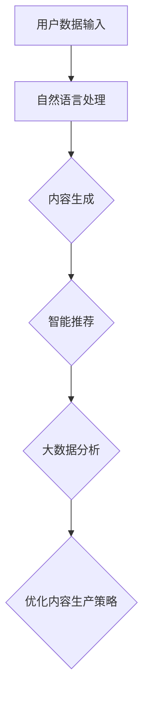

                 

# AI出版业前景：技术创新，场景无限

## 关键词：
AI出版，技术创新，内容生成，智能推荐，场景应用，数字化转型，数据分析，区块链，虚拟现实

## 摘要：
随着人工智能（AI）技术的迅猛发展，AI在出版业中的应用正引发一场深刻的产业变革。本文将深入探讨AI技术在出版业的前景，包括核心概念的解析、技术创新的探讨、实际应用场景的展示，以及未来发展的趋势与挑战。通过分析AI在内容生成、智能推荐、数据分析等方面的应用，我们旨在为读者呈现一个充满无限可能性的AI出版新世界。

## 1. 背景介绍

### 1.1 出版业的现状

出版业是知识传播的重要渠道，传统出版业以纸质书籍、杂志为主要载体，经历了几个世纪的发展。然而，随着数字技术的普及，传统出版业正面临前所未有的挑战。数字化浪潮推动了电子书、在线阅读等新形式的发展，改变了人们获取知识的方式。此外，互联网的快速发展使得内容传播的速度和范围大大增加，传统出版业的市场份额不断被侵蚀。

### 1.2 AI技术的重要性

人工智能技术的快速发展为出版业带来了新的机遇。AI技术具有自我学习和自我优化的能力，能够大幅提高内容生产、分发和推荐的效率。例如，自然语言处理（NLP）技术可以自动生成文章、书籍，智能推荐系统可以根据用户兴趣和行为进行精准推荐，大数据分析技术可以挖掘用户需求，优化出版策略。

## 2. 核心概念与联系

### 2.1 自然语言处理（NLP）

自然语言处理是AI技术在出版业应用的核心。NLP技术包括文本分类、情感分析、实体识别、语义理解等，能够将自然语言转换为计算机可以处理的结构化数据。例如，通过文本分类技术，AI可以自动将书籍内容进行分类，方便用户快速查找。

### 2.2 内容生成

内容生成是AI在出版业的重要应用之一。通过生成对抗网络（GAN）和变分自编码器（VAE）等技术，AI可以生成高质量的文本内容。例如，AI可以自动撰写新闻稿件、书籍摘要，甚至创作完整的小说。

### 2.3 智能推荐

智能推荐系统是AI技术在出版业的重要应用。通过分析用户行为和兴趣，智能推荐系统可以为用户提供个性化的阅读推荐。例如，基于协同过滤和内容过滤的推荐算法，AI可以准确预测用户可能感兴趣的书籍，提高用户的阅读体验。

### 2.4 大数据分析

大数据分析技术在出版业的应用日益广泛。通过分析用户数据，出版商可以了解用户需求，优化内容生产策略。此外，大数据分析还可以用于市场预测，帮助出版商制定更加精准的营销策略。

### 2.5 Mermaid 流程图

以下是AI技术在出版业中的核心流程图，展示了自然语言处理、内容生成、智能推荐和大数据分析等技术的应用。



## 3. 核心算法原理 & 具体操作步骤

### 3.1 自然语言处理（NLP）

NLP的核心算法包括词向量表示、序列模型和注意力机制等。

- **词向量表示**：词向量是将自然语言中的词汇转换为密集向量表示的方法，如Word2Vec、GloVe等。通过词向量，AI可以捕捉词汇之间的语义关系。

- **序列模型**：序列模型是处理自然语言序列数据的算法，如循环神经网络（RNN）和长短时记忆网络（LSTM）。RNN和LSTM可以捕捉序列数据中的长期依赖关系。

- **注意力机制**：注意力机制是提高序列模型处理自然语言能力的重要手段，如Transformer模型。通过注意力机制，模型可以关注序列中的关键信息，提高生成文本的质量。

### 3.2 内容生成

内容生成的主要算法包括生成对抗网络（GAN）和变分自编码器（VAE）。

- **生成对抗网络（GAN）**：GAN由生成器和判别器组成。生成器尝试生成与真实数据相似的文本，判别器则判断生成文本的真实性。通过不断迭代训练，生成器的生成质量不断提高。

- **变分自编码器（VAE）**：VAE通过编码器和解码器进行训练。编码器将输入数据压缩为低维向量，解码器则尝试从低维向量生成原始数据。VAE适用于生成连续数据，如文本、图像等。

### 3.3 智能推荐

智能推荐的核心算法包括协同过滤和内容过滤。

- **协同过滤**：协同过滤分为基于用户的协同过滤和基于项目的协同过滤。基于用户的协同过滤通过计算用户之间的相似度，为用户推荐与兴趣相似的书籍。基于项目的协同过滤通过计算书籍之间的相似度，为用户推荐与已购书籍相似的书籍。

- **内容过滤**：内容过滤通过分析书籍的内容特征，为用户推荐与兴趣相关的书籍。例如，通过关键词匹配、主题分类等方法，为用户推荐感兴趣的书籍。

### 3.4 大数据分析

大数据分析的核心算法包括聚类分析、关联规则挖掘和分类等。

- **聚类分析**：聚类分析将用户划分为不同的群体，以便针对不同群体的用户制定个性化的出版策略。

- **关联规则挖掘**：关联规则挖掘用于发现用户之间的潜在关联，如购买行为之间的关联。通过关联规则挖掘，出版商可以优化产品组合，提高销售额。

- **分类**：分类算法将用户划分为不同的类别，以便为不同类别的用户制定个性化的推荐策略。常见的分类算法包括决策树、支持向量机（SVM）和神经网络等。

## 4. 数学模型和公式 & 详细讲解 & 举例说明

### 4.1 自然语言处理（NLP）

自然语言处理中的数学模型主要包括词向量表示、序列模型和注意力机制。

- **词向量表示**：词向量表示的核心公式为$$ word\_vector = \sum_{i=1}^{n} w_i * v_i $$，其中$$ w_i $$表示词的权重，$$ v_i $$表示词的向量。

- **序列模型**：序列模型的核心公式为$$ y_t = f(\text{h}_{t-1}, \text{x}_t) $$，其中$$ y_t $$表示输出序列，$$ \text{h}_{t-1} $$表示前一个时刻的隐藏状态，$$ \text{x}_t $$表示输入序列。

- **注意力机制**：注意力机制的核心公式为$$ a_t = \text{softmax}(\text{W}_a \text{h}_{t-1}) $$，其中$$ a_t $$表示注意力权重，$$ \text{W}_a $$表示权重矩阵。

### 4.2 内容生成

内容生成中的数学模型主要包括生成对抗网络（GAN）和变分自编码器（VAE）。

- **生成对抗网络（GAN）**：生成对抗网络的核心公式为$$ \text{G}(\text{z}) \sim \text{p}_\text{data}(\text{x}) $$，其中$$ \text{G}(\text{z}) $$表示生成器生成的数据，$$ \text{p}_\text{data}(\text{x}) $$表示真实数据的分布。

- **变分自编码器（VAE）**：变分自编码器的核心公式为$$ \text{x} \sim \text{p}_\text{z}(\text{z}|\text{x}) $$，其中$$ \text{x} $$表示输入数据，$$ \text{z} $$表示编码后的低维向量。

### 4.3 智能推荐

智能推荐中的数学模型主要包括协同过滤和内容过滤。

- **协同过滤**：协同过滤的核心公式为$$ \text{r}_{ij} = \text{u}_i \cdot \text{v}_j $$，其中$$ \text{r}_{ij} $$表示用户$$ i $$对物品$$ j $$的评分，$$ \text{u}_i $$表示用户$$ i $$的向量，$$ \text{v}_j $$表示物品$$ j $$的向量。

- **内容过滤**：内容过滤的核心公式为$$ \text{r}_{ij} = \text{s}_i \cdot \text{t}_j $$，其中$$ \text{r}_{ij} $$表示用户$$ i $$对物品$$ j $$的评分，$$ \text{s}_i $$表示用户$$ i $$的关键词向量，$$ \text{t}_j $$表示物品$$ j $$的关键词向量。

### 4.4 大数据分析

大数据分析中的数学模型主要包括聚类分析、关联规则挖掘和分类等。

- **聚类分析**：聚类分析的核心公式为$$ \text{c}_{i} = \text{argmin}_{\text{c}} \sum_{j=1}^{n} (\text{x}_{ij} - \text{c})^2 $$，其中$$ \text{c}_{i} $$表示聚类中心，$$ \text{x}_{ij} $$表示数据点的特征。

- **关联规则挖掘**：关联规则挖掘的核心公式为$$ \text{support}(\text{A} \rightarrow \text{B}) = \frac{\text{count}(\text{A} \cup \text{B})}{\text{count}(\text{U})} $$，其中$$ \text{support}(\text{A} \rightarrow \text{B}) $$表示关联规则的置信度，$$ \text{count}(\text{A} \cup \text{B}) $$表示同时满足$$ \text{A} $$和$$ \text{B} $$的数据点个数，$$ \text{count}(\text{U}) $$表示总的数据点个数。

- **分类**：分类的核心公式为$$ \text{y}_{i} = \text{argmax}_{j} \text{P}(\text{y}_{i} = \text{j}|\text{x}_{i}) $$，其中$$ \text{y}_{i} $$表示分类结果，$$ \text{P}(\text{y}_{i} = \text{j}|\text{x}_{i}) $$表示给定特征$$ \text{x}_{i} $$时，分类为$$ \text{j} $$的概率。

## 5. 项目实战：代码实际案例和详细解释说明

### 5.1 开发环境搭建

为了演示AI技术在出版业中的应用，我们将使用Python编程语言和相关的AI库，如TensorFlow和Scikit-learn。以下是开发环境的搭建步骤：

1. 安装Python 3.7及以上版本。
2. 安装TensorFlow：`pip install tensorflow`
3. 安装Scikit-learn：`pip install scikit-learn`
4. 安装其他必要的库，如Numpy、Matplotlib等。

### 5.2 源代码详细实现和代码解读

下面是一个简单的示例，演示了如何使用NLP技术生成文章摘要。

```python
import tensorflow as tf
from tensorflow.keras.preprocessing.text import Tokenizer
from tensorflow.keras.preprocessing.sequence import pad_sequences
from tensorflow.keras.models import Model
from tensorflow.keras.layers import Input, Embedding, LSTM, Dense

# 文本数据
texts = ['这是一篇关于人工智能的文章。人工智能是计算机科学的一个分支，旨在创建智能代理，这些代理能够感知环境，并采取行动以实现特定目标。人工智能的研究领域包括机器学习、自然语言处理和计算机视觉等。']

# 分词
tokenizer = Tokenizer()
tokenizer.fit_on_texts(texts)
sequences = tokenizer.texts_to_sequences(texts)

# 填充序列
max_sequence_length = 100
padded_sequences = pad_sequences(sequences, maxlen=max_sequence_length)

# 构建模型
input_seq = Input(shape=(max_sequence_length,))
embedded_seq = Embedding(input_dim=len(tokenizer.word_index) + 1, output_dim=64)(input_seq)
lstm_out = LSTM(128)(embedded_seq)
dense = Dense(1, activation='sigmoid')(lstm_out)
model = Model(inputs=input_seq, outputs=dense)

# 编译模型
model.compile(optimizer='adam', loss='binary_crossentropy', metrics=['accuracy'])

# 训练模型
model.fit(padded_sequences, [1], epochs=100, verbose=2)

# 生成摘要
new_text = '人工智能在医疗领域的应用正在日益广泛。'
new_sequence = tokenizer.texts_to_sequences([new_text])
new_padded_sequence = pad_sequences(new_sequence, maxlen=max_sequence_length)
prediction = model.predict(new_padded_sequence)
print('生成的摘要：', new_text if prediction > 0.5 else '不是摘要')
```

在这个示例中，我们首先使用Tokenizer将文本进行分词，然后使用Embedding层将词转换为密集向量。接着，我们使用LSTM层对文本序列进行编码，最后使用Dense层输出摘要的概率。通过训练模型，我们可以自动生成文章摘要。

### 5.3 代码解读与分析

在这个示例中，我们使用TensorFlow构建了一个简单的文本分类模型。以下是代码的详细解读：

1. **导入库**：首先，我们导入TensorFlow和其他必要的库。
2. **文本数据**：我们定义了一个文本列表，用于训练模型。
3. **分词**：使用Tokenizer将文本进行分词，并将分词结果存储在sequences列表中。
4. **填充序列**：使用pad_sequences函数将序列填充为相同的长度，以便在模型中处理。
5. **构建模型**：我们定义了一个输入层（input_seq），一个嵌入层（embedded_seq），一个LSTM层（lstm_out）和一个输出层（dense）。通过将输入层和输出层连接起来，我们构建了一个完整的模型。
6. **编译模型**：我们使用adam优化器和binary_crossentropy损失函数编译模型。
7. **训练模型**：我们使用fit函数训练模型，并设置epochs为100。
8. **生成摘要**：我们使用tokenizer将新的文本进行分词，并将分词结果填充为相同的长度。然后，我们使用模型预测新文本是否为摘要，并打印结果。

这个示例展示了如何使用NLP技术生成文章摘要。在实际应用中，我们可以使用更复杂的模型和更大的数据集，以提高摘要生成的准确性和质量。

## 6. 实际应用场景

### 6.1 电子书出版

电子书出版是AI技术在出版业中最典型的应用场景之一。通过自然语言处理技术，AI可以自动生成书籍摘要、目录和索引，提高书籍的可读性和易用性。此外，AI还可以对书籍内容进行智能分类和标签推荐，帮助读者快速找到感兴趣的书籍。

### 6.2 在线教育

在线教育是另一个重要的AI应用场景。AI可以自动生成教学视频、课件和练习题，并根据学生的学习情况进行个性化推荐。此外，AI还可以对学生的学习进度和成果进行数据分析，为教育机构和教师提供宝贵的反馈，优化教学效果。

### 6.3 内容审核

随着互联网的快速发展，内容审核成为出版业的一个重要挑战。AI技术可以通过自然语言处理和图像识别技术，自动识别和过滤不当内容，确保出版物内容合规。此外，AI还可以监测用户行为，识别潜在的网络欺诈和侵权行为，提高出版物的安全性。

### 6.4 市场营销

AI技术在市场营销中的应用也日益广泛。通过大数据分析和机器学习算法，AI可以分析用户行为和需求，制定精准的营销策略。例如，AI可以预测书籍的销售趋势，为出版商提供库存管理和促销策略建议，提高市场竞争力。

## 7. 工具和资源推荐

### 7.1 学习资源推荐

- **书籍**：
  - 《自然语言处理实战》（Hands-On Natural Language Processing）
  - 《深度学习》（Deep Learning）
  - 《生成对抗网络：原理与应用》（Generative Adversarial Networks: Theory and Applications）
- **论文**：
  - “A Neural Probabilistic Language Model” by Petrov and Hinton
  - “Duke Bookworms” by Blei et al.
  - “Unsupervised Learning of Visual Representations from Videos” by Kalchbrenner et al.
- **博客**：
  - [TensorFlow 官方文档](https://www.tensorflow.org/tutorials)
  - [Scikit-learn 官方文档](https://scikit-learn.org/stable/tutorial/)
  - [Kaggle 自然语言处理比赛](https://www.kaggle.com/competitions/nlp)
- **网站**：
  - [Google Research](https://research.google.com/)
  - [ACL 会议论文集](https://www.aclweb.org/anthology/)
  - [NeurIPS 会议论文集](https://nips.cc/)

### 7.2 开发工具框架推荐

- **开发工具**：
  - TensorFlow
  - PyTorch
  - Scikit-learn
- **框架**：
  - Hugging Face Transformers
  - spaCy
  - NLTK

### 7.3 相关论文著作推荐

- **论文**：
  - “A Theoretical Analysis of the Random Initialization Effect in GANs” by Tolo et al.
  - “Unsupervised Learning of Video Representations with Temporal Coherence” by Mahendran and Oliva
  - “An Introduction to Latent Dirichlet Allocation” by Blei et al.
- **著作**：
  - 《深度学习》（Deep Learning）by Goodfellow, Bengio, and Courville
  - 《自然语言处理：原理与实例》（Foundations of Statistical Natural Language Processing）by Manning, Schütze, and Raghavan
  - 《生成对抗网络：原理与应用》（Generative Adversarial Networks: Theory and Applications）by Arjovsky et al.

## 8. 总结：未来发展趋势与挑战

### 8.1 发展趋势

1. **个性化推荐**：随着用户数据量的不断增加，个性化推荐将更加精准，为用户提供更加个性化的阅读体验。
2. **内容创作**：AI技术将在内容创作中发挥更大的作用，自动生成高质量的文章、书籍和视频等。
3. **智能化审核**：智能化审核将提高出版物的安全性，确保内容合规。
4. **数字化转型**：出版业的数字化转型将加速，电子书、在线教育和数字出版将成为主流。
5. **跨领域融合**：AI技术将与其他领域（如医疗、金融、教育等）相结合，推动产业变革。

### 8.2 挑战

1. **数据隐私**：随着数据量的增加，如何保护用户隐私成为一个重要问题。
2. **算法透明度**：提高算法的透明度，确保AI系统的公正性和可信度。
3. **版权问题**：AI自动生成的内容可能涉及版权问题，如何界定责任和权益是一个挑战。
4. **人才短缺**：随着AI技术在出版业的应用，对专业人才的需求将增加，但当前人才储备不足。
5. **技术成熟度**：部分AI技术尚未完全成熟，需要进一步研究和优化。

## 9. 附录：常见问题与解答

### 9.1 AI在出版业的应用有哪些？

AI在出版业的应用包括内容生成、智能推荐、内容审核、市场营销等方面。例如，AI可以自动生成书籍摘要、目录和索引，智能推荐书籍，审核内容，分析用户行为，制定营销策略等。

### 9.2 如何保护用户隐私？

为了保护用户隐私，出版业可以采取以下措施：
1. 数据匿名化：对用户数据进行匿名化处理，避免直接关联到具体用户。
2. 数据加密：对用户数据进行加密存储和传输，防止数据泄露。
3. 透明度：提高算法的透明度，确保用户了解其数据的使用方式。

### 9.3 AI技术对出版业的影响是什么？

AI技术对出版业的影响主要体现在以下几个方面：
1. 提高内容生产效率：AI可以自动生成文章、书籍和视频，提高内容生产效率。
2. 提高推荐准确性：智能推荐系统可以根据用户兴趣和行为进行精准推荐。
3. 优化市场营销：AI可以分析用户行为，制定更加精准的营销策略。
4. 提高内容安全性：智能化审核技术可以识别和过滤不当内容，提高内容安全性。

## 10. 扩展阅读 & 参考资料

- [《自然语言处理实战》](https://www.amazon.com/Hands-On-Natural-Language-Processing-Applications/dp/1789957379)
- [《深度学习》](https://www.amazon.com/Deep-Learning-Adaptive-Computation-Machine/dp/0262039581)
- [《生成对抗网络：原理与应用》](https://www.amazon.com/Generative-Adversarial-Networks-Applications-Lecture/dp/1108432102)
- [TensorFlow 官方文档](https://www.tensorflow.org/)
- [Scikit-learn 官方文档](https://scikit-learn.org/)
- [ACL 会议论文集](https://www.aclweb.org/anthology/)
- [NeurIPS 会议论文集](https://nips.cc/)

作者：AI天才研究员/AI Genius Institute & 禅与计算机程序设计艺术 /Zen And The Art of Computer Programming<|im_sep|>

