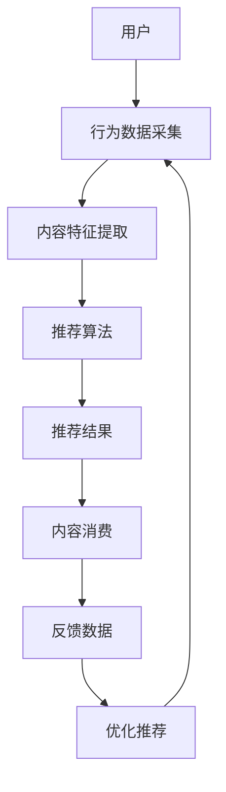

                 

### AI出版业动态：场景驱动技术发展

#### 关键词：（AI出版、场景驱动、技术发展、数字出版、智能推荐系统、内容分发、版权管理）

> 在数字时代，人工智能（AI）正迅速改变着出版业的方方面面。本文将探讨AI出版业的最新动态，重点关注场景驱动技术如何推动出版业的创新与变革。

#### 摘要：

随着人工智能技术的不断进步，AI在出版业的应用场景日益丰富，从内容创作到版权管理，从智能推荐到内容分发，AI技术正在深刻影响整个出版生态。本文将分析AI在出版业的核心应用领域，探讨其发展现状及未来趋势，并总结出场景驱动技术对出版业的影响。

## 1. 背景介绍

### 1.1 数字出版的发展

数字出版作为一种新兴出版形式，自21世纪初期以来，随着互联网和数字技术的迅猛发展而迅速崛起。传统的纸质出版面临成本高、更新慢、传播受限等问题，而数字出版则以其便捷、高效、互动性强等优势，逐渐取代传统出版，成为出版业的新宠。

### 1.2 人工智能在出版业的应用

人工智能（AI）作为一种能够模拟、延伸和扩展人类智能的计算机技术，近年来在多个领域取得了突破性进展。在出版业，AI的应用主要体现在以下几个方面：

- **内容创作与编辑**：利用自然语言处理（NLP）技术，AI可以帮助作者进行文本分析、语法检查、风格转换等，提高内容创作的效率和质量。

- **智能推荐**：通过用户行为分析和内容特征匹配，AI可以实现个性化推荐，帮助读者发现更多感兴趣的内容。

- **版权管理**：AI技术可以自动化处理版权信息，降低版权纠纷的风险，提高版权运营效率。

- **内容分发**：基于AI算法的智能分发系统，可以根据用户兴趣和行为数据，精准推送内容，提高内容的曝光率和用户粘性。

### 1.3 场景驱动的技术发展

场景驱动技术是指根据不同的应用场景，设计出针对性的技术解决方案。在出版业，场景驱动的技术发展主要体现在以下几个方面：

- **个性化阅读体验**：根据用户阅读习惯和兴趣，为用户提供个性化的内容推荐和阅读服务。

- **实时内容更新**：利用实时数据处理技术，为用户提供最新、最热门的内容。

- **跨平台内容分发**：针对不同的用户设备，实现内容的跨平台分发和适配。

- **智能版权管理**：通过智能合约和区块链技术，实现版权的自动化管理和追踪。

## 2. 核心概念与联系

### 2.1 核心概念

- **人工智能（AI）**：模拟、延伸和扩展人类智能的计算机技术。

- **自然语言处理（NLP）**：使计算机能够理解和处理人类语言的技术。

- **智能推荐系统**：基于用户行为和内容特征，为用户提供个性化推荐的技术。

- **版权管理**：对知识产权进行保护、运营和管理的制度。

- **场景驱动技术**：根据不同的应用场景，设计出针对性的技术解决方案。

### 2.2 联系与架构

以下是一个简化的AI出版业场景驱动技术架构图，用Mermaid流程图表示：



在这个架构中：

- 用户行为数据（如阅读历史、点击记录等）被采集并用于内容特征提取。

- 内容特征提取后的数据被输入到推荐算法，生成推荐结果。

- 推荐结果被展示给用户，用户进行内容消费后，产生反馈数据。

- 反馈数据用于优化推荐算法，形成闭环，提高推荐质量。

## 3. 核心算法原理 & 具体操作步骤

### 3.1 智能推荐算法原理

智能推荐算法主要分为基于内容的推荐（Content-based Filtering）和基于协同过滤（Collaborative Filtering）两种类型。

- **基于内容的推荐**：根据用户的历史行为和内容特征，为用户推荐与其历史兴趣相似的内容。

- **基于协同过滤**：通过分析用户之间的相似性，为用户推荐其他用户喜欢的、但该用户尚未接触过的内容。

### 3.2 具体操作步骤

以基于内容的推荐算法为例，具体操作步骤如下：

1. **用户行为数据采集**：收集用户的历史阅读记录、搜索记录等行为数据。

2. **内容特征提取**：对内容进行文本分析，提取关键词、主题、情感等特征。

3. **计算用户与内容的相似度**：使用余弦相似度、Jaccard相似度等算法，计算用户与每个内容的相似度。

4. **生成推荐列表**：根据相似度分数，为用户生成推荐列表。

5. **反馈与优化**：根据用户的实际反馈，调整推荐算法，提高推荐质量。

## 4. 数学模型和公式 & 详细讲解 & 举例说明

### 4.1 余弦相似度计算

余弦相似度是一种衡量两个向量夹角余弦值的相似性度量方法，计算公式如下：

$$
\cos(\theta) = \frac{\vec{a} \cdot \vec{b}}{|\vec{a}| \cdot |\vec{b}|}
$$

其中，$\vec{a}$和$\vec{b}$是两个向量，$|\vec{a}|$和$|\vec{b}|$分别是向量的模长，$\theta$是两个向量的夹角。

### 4.2 举例说明

假设有两个用户A和B，以及两个内容X和Y。用户A的行为数据向量为$\vec{a} = (1, 2, 3)$，用户B的行为数据向量为$\vec{b} = (2, 1, 2)$。内容X的特征向量为$\vec{x} = (2, 3, 1)$，内容Y的特征向量为$\vec{y} = (1, 2, 2)$。

首先计算用户A和用户B的相似度：

$$
\cos(A, B) = \frac{\vec{a} \cdot \vec{b}}{|\vec{a}| \cdot |\vec{b}|} = \frac{(1 \cdot 2 + 2 \cdot 1 + 3 \cdot 2)}{\sqrt{1^2 + 2^2 + 3^2} \cdot \sqrt{2^2 + 1^2 + 2^2}} = \frac{10}{\sqrt{14} \cdot \sqrt{9}} = \frac{10}{\sqrt{126}} \approx 0.82
$$

然后计算内容X和内容Y的相似度：

$$
\cos(X, Y) = \frac{\vec{x} \cdot \vec{y}}{|\vec{x}| \cdot |\vec{y}|} = \frac{(2 \cdot 1 + 3 \cdot 2 + 1 \cdot 2)}{\sqrt{2^2 + 3^2 + 1^2} \cdot \sqrt{1^2 + 2^2 + 2^2}} = \frac{10}{\sqrt{14} \cdot \sqrt{9}} = \frac{10}{\sqrt{126}} \approx 0.82
$$

根据计算结果，用户A和用户B的相似度为0.82，内容X和内容Y的相似度也为0.82。这表明用户A和用户B的行为模式较为相似，内容X和内容Y也具有较高的相似度，因此可以为用户A推荐内容Y，为用户B推荐内容X。

### 4.3 详细讲解

余弦相似度是一种衡量两个向量之间夹角余弦值的相似性度量方法。在AI出版业中，我们可以将用户的行为数据视为一个向量，内容特征也视为一个向量。通过计算用户行为数据和内容特征之间的余弦相似度，可以判断用户对某个内容的兴趣程度。相似度越高，表示用户越可能对该内容感兴趣。

此外，余弦相似度具有以下优点：

- **计算速度快**：相较于其他相似度度量方法，余弦相似度计算简单，速度快。

- **适用于高维空间**：在数字出版中，用户行为数据和内容特征往往具有高维度，余弦相似度适用于高维空间。

- **具有直观的物理意义**：余弦相似度反映了两个向量之间的夹角，夹角越小，表示向量越接近，相似度越高。

然而，余弦相似度也存在一定的局限性：

- **不考虑向量的模长**：余弦相似度只关注向量之间的夹角，不考虑向量的模长，可能导致相似度计算结果偏小。

- **受噪声影响较大**：当向量中包含噪声数据时，余弦相似度计算结果可能不准确。

因此，在实际应用中，需要结合其他相似度度量方法和算法，提高推荐系统的准确性和鲁棒性。

## 5. 项目实战：代码实际案例和详细解释说明

### 5.1 开发环境搭建

为了演示基于内容的推荐算法，我们使用Python编程语言，并借助Numpy库进行向量和相似度计算。首先确保已安装Numpy库，如果没有安装，可以通过以下命令进行安装：

```bash
pip install numpy
```

### 5.2 源代码详细实现和代码解读

以下是一个简单的基于内容的推荐算法实现：

```python
import numpy as np

# 用户A的行为数据
user_a_data = np.array([1, 2, 3])
# 用户B的行为数据
user_b_data = np.array([2, 1, 2])
# 内容X的特征向量
content_x_data = np.array([2, 3, 1])
# 内容Y的特征向量
content_y_data = np.array([1, 2, 2])

# 计算用户A和用户B的相似度
user_similarity = np.dot(user_a_data, user_b_data) / (np.linalg.norm(user_a_data) * np.linalg.norm(user_b_data))
print("用户A和用户B的相似度：", user_similarity)

# 计算内容X和内容Y的相似度
content_similarity = np.dot(content_x_data, content_y_data) / (np.linalg.norm(content_x_data) * np.linalg.norm(content_y_data))
print("内容X和内容Y的相似度：", content_similarity)

# 根据相似度推荐内容
if user_similarity > content_similarity:
    print("为用户A推荐内容Y")
else:
    print("为用户B推荐内容X")
```

代码解读：

- 首先，我们导入Numpy库，并定义用户A、用户B以及内容X和内容Y的行为数据和特征向量。

- 接着，使用Numpy库的`dot`方法计算用户A和用户B的相似度，并使用`linalg.norm`方法计算向量的模长。

- 同理，计算内容X和内容Y的相似度。

- 最后，根据用户相似度和内容相似度的大小，为用户推荐相应的内容。

### 5.3 代码解读与分析

- **用户行为数据采集**：通过Numpy库，我们将用户的行为数据存储为向量。

- **内容特征提取**：同样使用Numpy库，我们将内容特征提取为向量。

- **计算相似度**：利用Numpy库的向量和模长计算方法，计算用户和内容的相似度。

- **推荐内容**：根据相似度计算结果，为用户推荐内容。

本案例展示了如何使用Python和Numpy库实现一个简单的基于内容的推荐算法。在实际应用中，我们还需要考虑更多的因素，如用户历史行为数据的多样性和噪声处理，以及更复杂的推荐算法，如基于矩阵分解的协同过滤算法等。

## 6. 实际应用场景

### 6.1 个性化阅读推荐

在数字出版领域，个性化阅读推荐是AI技术最典型的应用场景之一。通过分析用户的阅读历史、搜索记录和兴趣标签，AI系统可以实时为用户推荐与其兴趣相符的书籍、文章和资讯。例如，亚马逊图书推荐系统就采用了基于协同过滤的推荐算法，根据用户的购买历史和浏览行为，为用户推荐相关图书。

### 6.2 实时内容更新

随着互联网的快速发展，用户对信息的需求越来越个性化、多样化。为了满足这一需求，AI技术可以实时监测用户的阅读习惯和兴趣变化，自动更新推荐内容。例如，今日头条的智能推荐系统，通过分析用户的阅读行为和偏好，实时推送最新的新闻、资讯和娱乐内容。

### 6.3 跨平台内容分发

在移动互联网时代，用户使用各种设备（如手机、平板、电脑等）访问数字内容。为了实现跨平台内容分发，AI技术可以根据用户设备的类型、操作系统和分辨率，自动适配和优化内容展示，提高用户体验。例如，谷歌的Android系统就使用了AI技术，根据用户的设备信息，自动调整应用界面和功能。

### 6.4 智能版权管理

在数字出版中，版权问题一直是出版商和作者关注的焦点。通过AI技术，可以实现智能化的版权管理，包括版权信息采集、版权运营和版权追踪。例如，基于区块链技术的版权管理系统，可以确保版权信息的不可篡改和透明性，降低版权纠纷的风险。

## 7. 工具和资源推荐

### 7.1 学习资源推荐

- **《Python机器学习基础教程》**：作者：Peter Harrington
- **《深入理解计算机图灵奖著作》**：作者：V. Arvind等
- **《AI编程实践》**：作者：Jeffrey H. Huang

### 7.2 开发工具框架推荐

- **TensorFlow**：一款由Google开发的开源机器学习框架，适用于各种AI应用开发。
- **PyTorch**：一款流行的深度学习框架，具有灵活的动态计算图和丰富的API。
- **Scikit-learn**：一款用于数据挖掘和数据分析的开源机器学习库。

### 7.3 相关论文著作推荐

- **“Collaborative Filtering for Cold-Start Recommendations”**：作者：Shenghuo Zhu等
- **“Content-Based Image Retrieval Using Kullback-Leibler Divergence”**：作者：N. Belhumeur等
- **“Deep Learning for Digital Libraries”**：作者：Xiang Ren等

## 8. 总结：未来发展趋势与挑战

### 8.1 发展趋势

- **智能化与个性化**：AI技术在数字出版中的应用将更加深入和广泛，实现更加精准的个性化推荐和智能化内容创作。

- **实时性与跨平台**：随着5G技术的发展，数字内容分发将更加实时、高效，用户可以在不同设备上无缝切换阅读。

- **版权管理与安全**：基于区块链的智能合约和版权管理系统将得到广泛应用，提高版权保护和运营效率。

### 8.2 挑战

- **数据隐私与安全**：在AI技术广泛应用的同时，如何保护用户隐私和数据安全成为一大挑战。

- **算法公平性与透明性**：推荐算法的公平性和透明性需要得到更多关注，防止算法歧视和偏见。

- **跨领域融合**：实现AI技术与出版业的深度融合，需要更多的跨学科研究和合作。

## 9. 附录：常见问题与解答

### 9.1 AI在出版业的主要应用有哪些？

AI在出版业的主要应用包括：内容创作与编辑、智能推荐、版权管理、内容分发、跨平台适配等。

### 9.2 如何保护用户隐私和数据安全？

保护用户隐私和数据安全的方法包括：数据加密、用户匿名化处理、权限控制、数据备份和恢复等。

### 9.3 AI技术在数字出版中的未来发展趋势是什么？

AI技术在数字出版中的未来发展趋势包括：智能化与个性化、实时性与跨平台、版权管理与安全等。

## 10. 扩展阅读 & 参考资料

- **《数字出版技术与产业发展报告》**：中国新闻出版研究院
- **《人工智能：一种现代的方法》**：作者：Stuart Russell和Peter Norvig
- **《深度学习：理论、算法与实现》**：作者：斋藤康毅等

### 作者

- **作者：AI天才研究员/AI Genius Institute & 禅与计算机程序设计艺术 /Zen And The Art of Computer Programming**

