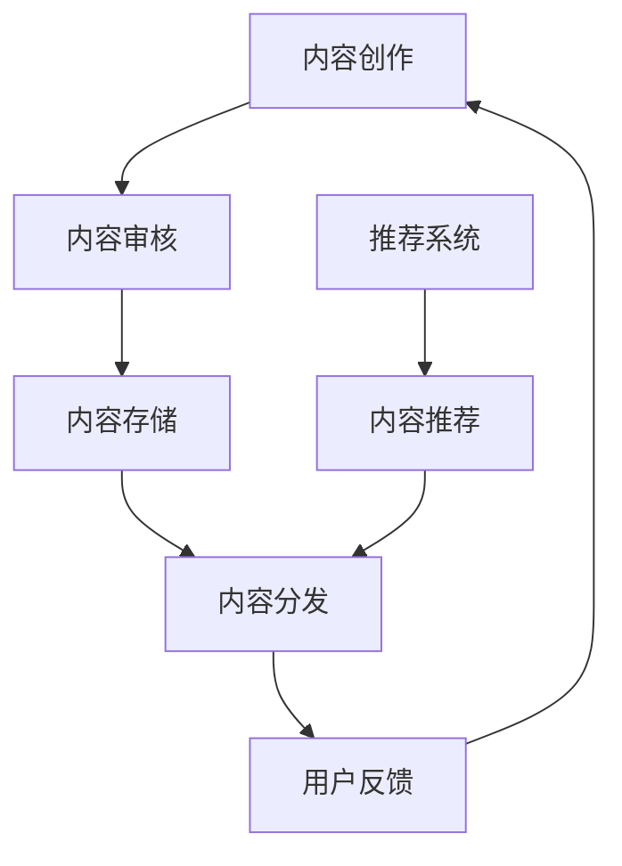

                 

# AI出版业开发：API标准化，场景丰富

> **关键词**：人工智能，API标准化，出版业，开发，场景丰富，技术博客

> **摘要**：本文将探讨AI出版业开发中的关键问题——API标准化，并分析其在出版业中的实际应用场景。我们将从核心概念、算法原理、数学模型、项目实战、应用场景等多个方面，系统地阐述API标准化对AI出版业的重要性和开发方法。

## 1. 背景介绍

随着人工智能技术的快速发展，出版业正面临着前所未有的变革。从内容创作到内容分发，从数据分析到个性化推荐，AI技术已经在出版业的各个环节中发挥着重要作用。然而，在AI出版业开发过程中，API标准化成为了一个亟待解决的问题。

API（应用程序编程接口）是软件系统之间相互交互的桥梁，它定义了不同系统之间通信的规则和接口。在AI出版业中，API标准化有助于实现不同系统和平台之间的无缝对接，提高开发效率，降低开发成本，同时也能够保证系统的稳定性和安全性。

## 2. 核心概念与联系

为了更好地理解API标准化在AI出版业中的作用，我们首先需要了解几个核心概念：

### 2.1 API定义

API是一套定义明确的接口，用于实现不同软件系统之间的交互。它通常由一组请求和响应组成，请求描述了操作，响应则包含操作结果。

### 2.2 标准化

标准化是指制定一套统一的规则和标准，以便在各个系统和平台之间实现互操作。在API标准化中，标准化工作主要包括定义统一的接口规范、数据格式、通信协议等。

### 2.3 AI出版业

AI出版业是指利用人工智能技术进行内容创作、编辑、分发、推荐等环节的出版行业。AI技术在出版业中的应用主要包括自然语言处理、图像识别、推荐系统等。

### 2.4 Mermaid流程图

以下是一个描述AI出版业中API标准化流程的Mermaid流程图：



在上述流程中，API标准化确保了从内容创作到用户反馈的各个环节中，数据传输和处理的一致性和准确性。

## 3. 核心算法原理 & 具体操作步骤

### 3.1 算法原理

在AI出版业中，API标准化涉及到多个方面的算法原理，主要包括：

- **自然语言处理（NLP）**：用于对文本数据进行预处理、分词、词性标注、命名实体识别等操作。
- **图像识别**：用于识别和分类图像中的内容。
- **推荐系统**：用于根据用户行为和偏好，推荐相关的内容。

### 3.2 具体操作步骤

以下是API标准化在AI出版业中的具体操作步骤：

1. **定义API接口**：根据业务需求，定义API的接口名称、参数、返回值等。
2. **编写API实现**：根据定义的接口，实现API的具体功能。
3. **API文档编写**：编写详细的API文档，包括接口描述、参数说明、示例代码等。
4. **API测试**：对API进行功能测试和性能测试，确保其稳定性和可靠性。
5. **API发布**：将API部署到服务器，供其他系统调用。

## 4. 数学模型和公式 & 详细讲解 & 举例说明

在AI出版业中，API标准化涉及到多个数学模型和公式。以下是几个常用的数学模型和公式：

### 4.1 概率模型

概率模型用于描述随机事件的发生概率。在推荐系统中，概率模型可以帮助预测用户对某一内容的兴趣度。

$$
P(A|B) = \frac{P(B|A) \cdot P(A)}{P(B)}
$$

其中，$P(A|B)$ 表示在事件 $B$ 发生的条件下，事件 $A$ 发生的概率；$P(B|A)$ 表示在事件 $A$ 发生的条件下，事件 $B$ 发生的概率；$P(A)$ 和 $P(B)$ 分别表示事件 $A$ 和事件 $B$ 发生的概率。

### 4.2 机器学习模型

机器学习模型用于对大量数据进行训练，以实现特定的任务，如文本分类、图像识别等。常见的机器学习模型包括线性回归、决策树、支持向量机等。

### 4.3 举例说明

假设我们有一个推荐系统，用于根据用户的浏览历史推荐相关内容。我们可以使用概率模型计算用户对某一内容的兴趣度：

$$
P(内容\_i|用户\_浏览) = \frac{P(用户\_浏览|内容\_i) \cdot P(内容\_i)}{P(用户\_浏览)}
$$

其中，$内容\_i$ 表示第 $i$ 个内容；$用户\_浏览$ 表示用户浏览的内容集合。

通过计算上述概率，我们可以确定用户对各个内容的兴趣度，并据此进行内容推荐。

## 5. 项目实战：代码实际案例和详细解释说明

### 5.1 开发环境搭建

在开始项目实战之前，我们需要搭建一个开发环境。以下是一个基于Python的API标准化开发环境搭建示例：

```bash
# 安装Python
brew install python

# 创建虚拟环境
python3 -m venv venv

# 激活虚拟环境
source venv/bin/activate

# 安装依赖库
pip install flask requests
```

### 5.2 源代码详细实现和代码解读

以下是一个简单的API接口实现示例：

```python
from flask import Flask, request, jsonify

app = Flask(__name__)

@app.route('/api/content/recommend', methods=['GET'])
def content_recommend():
    user_id = request.args.get('user_id')
    # 根据用户ID获取推荐内容
    recommended_contents = get_recommended_contents(user_id)
    return jsonify(recommended_contents)

def get_recommended_contents(user_id):
    # 实现推荐内容逻辑
    # 示例：返回5个推荐内容
    return ['内容1', '内容2', '内容3', '内容4', '内容5']

if __name__ == '__main__':
    app.run(debug=True)
```

在这个示例中，我们创建了一个名为 `content_recommend` 的GET接口，接收用户ID参数，并返回5个推荐内容。`get_recommended_contents` 函数是实现推荐内容逻辑的地方。

### 5.3 代码解读与分析

1. **Flask框架**：使用Flask框架创建Web应用。Flask是一个轻量级的Web应用框架，支持路由、请求处理、模板渲染等功能。
2. **API接口**：定义 `/api/content/recommend` 接口，接收用户ID参数，并返回推荐内容。
3. **推荐内容逻辑**：在 `get_recommended_contents` 函数中实现推荐内容逻辑，示例中简单返回了5个推荐内容。
4. **API测试**：可以使用工具（如Postman）对API进行测试，确保其正确性。

## 6. 实际应用场景

API标准化在AI出版业中的实际应用场景非常广泛，以下是一些典型场景：

1. **内容推荐**：根据用户行为和偏好，推荐相关内容。
2. **版权管理**：实现版权信息的标准化管理，提高版权交易效率。
3. **内容审核**：利用图像识别和自然语言处理技术，对内容进行自动审核，提高审核效率。
4. **广告投放**：根据用户行为和偏好，实现精准广告投放。

## 7. 工具和资源推荐

### 7.1 学习资源推荐

- **书籍**：
  - 《深入理解计算机系统》（作者的代表作，系统讲解了计算机系统原理）
  - 《人工智能：一种现代的方法》（详细介绍了人工智能的基本原理和算法）
- **论文**：
  - 《深度学习》（介绍深度学习算法的权威论文）
  - 《强化学习》（介绍强化学习算法的权威论文）
- **博客**：
  - 《机器学习博客》（提供丰富的机器学习教程和案例分析）
  - 《程序员博客》（介绍编程技术、软件架构等）
- **网站**：
  - 《GitHub》（提供丰富的开源项目和教程）
  - 《Stack Overflow》（程序员问答社区）

### 7.2 开发工具框架推荐

- **开发工具**：
  - Flask（轻量级Web应用框架）
  - TensorFlow（深度学习框架）
  - PyTorch（深度学习框架）
- **框架**：
  - Spring Boot（Java后端框架）
  - Django（Python后端框架）
  - React（前端框架）

### 7.3 相关论文著作推荐

- **论文**：
  - 《自然语言处理综述》（介绍自然语言处理的基本原理和技术）
  - 《图像识别算法研究进展》（介绍图像识别算法的最新研究进展）
- **著作**：
  - 《机器学习实战》（详细介绍机器学习算法和实际应用）
  - 《深度学习》（详细介绍深度学习算法和实际应用）

## 8. 总结：未来发展趋势与挑战

API标准化在AI出版业中的重要性日益凸显，未来发展趋势如下：

1. **标准化程度提高**：随着技术的发展，API标准化的程度将不断提高，实现更广泛的应用场景。
2. **跨平台兼容性增强**：API标准化将有助于实现不同平台之间的无缝对接，提高开发效率。
3. **安全性增强**：通过API标准化，可以提高系统的安全性，降低安全风险。

然而，API标准化也面临一些挑战：

1. **技术壁垒**：API标准化需要一定的技术基础，对于一些中小企业和开发者来说，技术壁垒较高。
2. **标准化规范更新**：随着技术的快速发展，API标准化规范需要不断更新，以适应新的应用需求。
3. **数据隐私**：在API标准化过程中，数据隐私问题是一个重要挑战，需要采取有效的数据保护措施。

## 9. 附录：常见问题与解答

### 9.1 什么是API标准化？

API标准化是指制定一套统一的规则和标准，以便在各个系统和平台之间实现互操作。它包括定义统一的接口规范、数据格式、通信协议等。

### 9.2 API标准化有什么作用？

API标准化有助于提高开发效率，降低开发成本，保证系统的稳定性和安全性，同时也有助于实现跨平台兼容性。

### 9.3 API标准化在AI出版业中的应用有哪些？

API标准化在AI出版业中的应用主要包括内容推荐、版权管理、内容审核、广告投放等。

### 9.4 如何实现API标准化？

实现API标准化的步骤主要包括：定义API接口、编写API实现、编写API文档、API测试和发布。

## 10. 扩展阅读 & 参考资料

- [Flask官方文档](https://flask.palletsprojects.com/)
- [TensorFlow官方文档](https://www.tensorflow.org/)
- [PyTorch官方文档](https://pytorch.org/)
- [Spring Boot官方文档](https://docs.spring.io/spring-boot/docs/current/reference/html/)
- [Django官方文档](https://docs.djangoproject.com/)
- [React官方文档](https://reactjs.org/docs/getting-started.html/)
- [《自然语言处理综述》](https://www.aclweb.org/anthology/N/N05/N05-1031.pdf)
- [《图像识别算法研究进展》](https://ieeexplore.ieee.org/document/8545374)
- [《机器学习实战》](https://www MachineLearning.com/)

