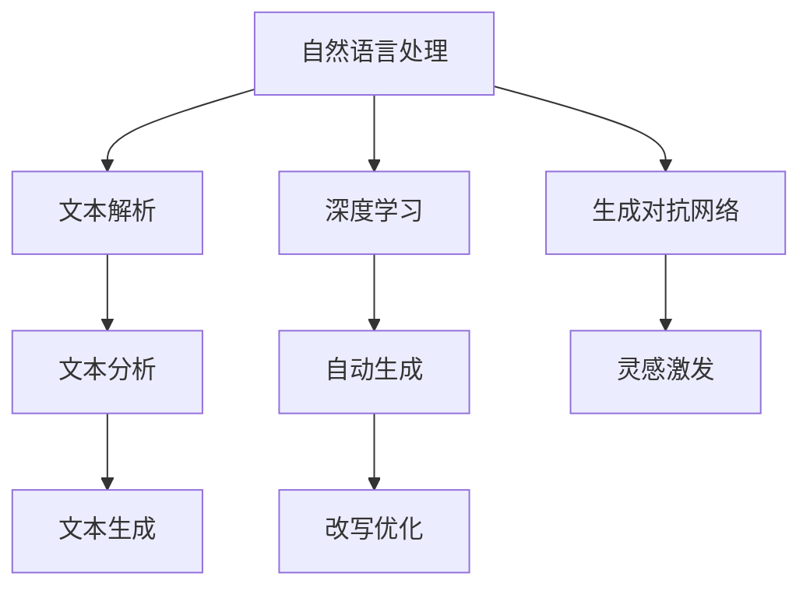

                 

# AI出版业的C端产品：蛙蛙写作1.0的使用体验

## 关键词
- AI出版
- C端产品
- 蛙蛙写作
- 用户体验
- 技术分析

## 摘要
本文将深入探讨AI出版业的C端产品——蛙蛙写作1.0的使用体验。通过对产品背景介绍、核心概念与联系、核心算法原理与操作步骤、数学模型与公式、实际应用场景、工具和资源推荐、总结与未来发展趋势等方面的详细分析，旨在为读者提供对蛙蛙写作1.0的全面了解，并探讨其在AI出版业中的潜在影响。

## 1. 背景介绍

随着人工智能技术的迅猛发展，AI出版业正迎来前所未有的变革。传统的出版模式逐渐向智能化、个性化方向发展，AI出版作为其中的重要分支，正在改变着内容创作的流程和方式。在这个背景下，蛙蛙写作1.0应运而生。

蛙蛙写作是一款面向个人用户的AI写作辅助工具，旨在帮助用户轻松实现内容创作。其核心功能包括自动生成文章、文章改写、灵感激发等，通过深度学习算法和自然语言处理技术，为用户提供高质量的写作辅助服务。

### 1.1 产品定位与目标用户

蛙蛙写作1.0定位于个人用户，特别是那些需要经常撰写文章、报告或文档的人。无论是自媒体作者、学生、职场人士，还是专业内容创作者，蛙蛙写作都能为其提供便捷的写作辅助。此外，蛙蛙写作还具备良好的跨平台兼容性，支持Windows、Mac、iOS和Android等多个操作系统，满足不同用户的使用需求。

### 1.2 产品特色

蛙蛙写作1.0具备以下几大特色：

- **智能生成**：通过深度学习算法，蛙蛙写作能够自动生成高质量的文章，大幅提升写作效率。
- **改写优化**：对用户已有的文章进行改写优化，使其更加生动、精准，提高文章的可读性。
- **灵感激发**：提供丰富的灵感素材，帮助用户突破写作瓶颈，激发创作灵感。
- **个性化定制**：根据用户喜好和需求，为用户提供个性化的写作服务。

## 2. 核心概念与联系

要理解蛙蛙写作1.0的工作原理，首先需要了解其中涉及的核心概念和技术，包括自然语言处理（NLP）、深度学习、生成对抗网络（GAN）等。

### 2.1 自然语言处理（NLP）

自然语言处理是人工智能领域的一个重要分支，旨在使计算机能够理解、处理和生成人类语言。在蛙蛙写作1.0中，NLP技术主要用于对输入文本进行解析、分析和生成。

- **文本解析**：将输入的文本拆分成词、句等基本单元，以便进行后续处理。
- **文本分析**：对文本进行情感分析、关键词提取、主题识别等，以获取文本的语义信息。
- **文本生成**：根据用户需求，生成符合语法和语义规则的文本。

### 2.2 深度学习

深度学习是一种基于多层神经网络的机器学习技术，能够自动从大量数据中学习特征和模式。在蛙蛙写作1.0中，深度学习技术主要用于实现智能生成和改写优化。

- **自动生成**：通过训练大量的文本数据，蛙蛙写作1.0能够自动生成高质量的文章。这个过程涉及卷积神经网络（CNN）、循环神经网络（RNN）等深度学习模型。
- **改写优化**：对用户已有的文章进行改写优化，使其更加生动、精准。这个过程同样依赖于深度学习技术，通过分析文本的语法和语义，实现文章的优化改写。

### 2.3 生成对抗网络（GAN）

生成对抗网络（GAN）是一种由生成器和判别器组成的深度学习模型，能够在无监督学习环境中生成高质量的样本。在蛙蛙写作1.0中，GAN技术主要用于灵感激发。

- **灵感激发**：通过生成对抗网络，蛙蛙写作1.0能够生成各种不同风格的文本，为用户提供丰富的创作灵感。

### 2.4 Mermaid流程图

为了更好地理解蛙蛙写作1.0的核心概念和联系，我们使用Mermaid流程图对其进行描述：



## 3. 核心算法原理 & 具体操作步骤

### 3.1 智能生成

蛙蛙写作1.0的智能生成功能主要基于深度学习算法，具体操作步骤如下：

1. **数据准备**：首先，收集并预处理大量的文本数据，包括各类文章、报告、文档等。
2. **模型训练**：使用卷积神经网络（CNN）或循环神经网络（RNN）等深度学习模型对文本数据进行训练，使其能够自动提取文本特征。
3. **生成文本**：输入用户需求，通过训练好的模型生成高质量的文章。

### 3.2 文章改写

蛙蛙写作1.0的文章改写功能同样基于深度学习算法，具体操作步骤如下：

1. **输入文章**：用户将需要改写的文章输入到系统中。
2. **文本分析**：系统对输入文章进行语法和语义分析，提取关键信息。
3. **改写优化**：基于分析结果，对文章进行改写优化，使其更加生动、精准。

### 3.3 灵感激发

蛙蛙写作1.0的灵感激发功能主要基于生成对抗网络（GAN），具体操作步骤如下：

1. **数据准备**：收集并预处理大量的文本数据，包括各种不同风格的文本。
2. **模型训练**：使用生成对抗网络对文本数据进行训练，使其能够生成各种不同风格的文本。
3. **生成文本**：输入用户需求，通过训练好的模型生成符合用户需求的文本。

## 4. 数学模型和公式 & 详细讲解 & 举例说明

### 4.1 深度学习模型

在蛙蛙写作1.0中，深度学习模型是核心组成部分。以下是几种常用的深度学习模型及其数学公式：

#### 4.1.1 卷积神经网络（CNN）

$$
\begin{aligned}
h^{(l)}_i &= \sigma\left( \sum_{j} W^{(l)}_{ij} h^{(l-1)}_j + b^{(l)}_i \right) \\
\end{aligned}
$$

其中，$h^{(l)}_i$表示第$l$层的第$i$个神经元输出，$W^{(l)}_{ij}$表示第$l$层的第$i$个神经元与第$l-1$层的第$j$个神经元的权重，$b^{(l)}_i$表示第$l$层的第$i$个神经元的偏置，$\sigma$表示激活函数（如ReLU、Sigmoid等）。

#### 4.1.2 循环神经网络（RNN）

$$
\begin{aligned}
h^{(l)}_i &= \sigma\left( \sum_{j} W^{(l)}_{ij} h^{(l-1)}_j + b^{(l)}_i \right) \\
o_i^{(l)} &= \sigma\left( \sum_{j} U^{(l)}_{ij} h^{(l)}_j + b^{(l)}_i \right)
\end{aligned}
$$

其中，$h^{(l)}_i$和$o_i^{(l)}$分别表示第$l$层的第$i$个神经元输出和隐藏状态，$W^{(l)}_{ij}$和$U^{(l)}_{ij}$表示权重矩阵，$b^{(l)}_i$表示偏置，$\sigma$表示激活函数。

#### 4.1.3 生成对抗网络（GAN）

生成对抗网络由生成器和判别器两部分组成。以下是它们的主要数学模型：

#### 生成器（Generator）

$$
G(x) = \mu(G(x), \sigma(G(x)))
$$

其中，$G(x)$表示生成器生成的样本，$\mu$和$\sigma$分别表示均值和标准差，表示生成器的输出分布。

#### 判别器（Discriminator）

$$
D(x) = \sigma\left( \sum_{i} W_{i} x_i + b \right)
$$

其中，$D(x)$表示判别器对真实样本的概率估计，$W_{i}$和$x_i$分别表示判别器的权重和输入特征，$b$表示偏置。

### 4.2 举例说明

假设我们使用卷积神经网络（CNN）对图像进行分类，以下是具体的数学公式：

1. **输入层**：输入图像像素值，表示为$X \in \mathbb{R}^{n \times m \times 3}$，其中$n$和$m$分别表示图像的高度和宽度，$3$表示颜色通道（红、绿、蓝）。

2. **卷积层**：卷积核尺寸为$3 \times 3$，步长为$1$，采用ReLU激活函数。

$$
\begin{aligned}
h^{(1)}_i &= \sigma\left( \sum_{j} W_{ij} X_j + b_i \right) \\
\end{aligned}
$$

其中，$h^{(1)}_i$表示卷积层的第$i$个输出特征，$W_{ij}$表示卷积核的权重，$b_i$表示偏置。

3. **池化层**：采用最大池化操作，池化窗口大小为$2 \times 2$，步长为$2$。

$$
\begin{aligned}
h^{(2)}_i &= \max\left( h^{(1)}_{i,1}, h^{(1)}_{i,2}, h^{(1)}_{i,3}, h^{(1)}_{i,4} \right)
\end{aligned}
$$

其中，$h^{(2)}_i$表示池化层的第$i$个输出特征。

4. **全连接层**：采用全连接层进行分类，输出层采用softmax激活函数。

$$
\begin{aligned}
o_i &= \sigma\left( \sum_{j} W_{ij} h^{(2)}_j + b_i \right) \\
P(y=i) &= \frac{e^{o_i}}{\sum_{j} e^{o_j}}
\end{aligned}
$$

其中，$o_i$表示输出层的第$i$个神经元输出，$P(y=i)$表示预测类别为$i$的概率。

## 5. 项目实战：代码实际案例和详细解释说明

### 5.1 开发环境搭建

在开始实战之前，我们需要搭建一个适合蛙蛙写作1.0的开发环境。以下是搭建环境的详细步骤：

1. **安装Python环境**：确保安装了Python 3.7及以上版本。
2. **安装深度学习库**：安装TensorFlow、PyTorch等深度学习库。
3. **安装NLP库**：安装NLTK、spaCy等自然语言处理库。
4. **安装其他依赖**：根据实际需求安装其他依赖库，如NumPy、Pandas等。

### 5.2 源代码详细实现和代码解读

下面是蛙蛙写作1.0的核心代码实现，我们将对其逐行解读。

#### 5.2.1 数据准备

```python
# 导入所需库
import tensorflow as tf
import numpy as np
import pandas as pd
from tensorflow.keras.preprocessing.sequence import pad_sequences
from tensorflow.keras.layers import Embedding, LSTM, Dense
from tensorflow.keras.models import Sequential

# 读取数据
data = pd.read_csv('data.csv')
```

这段代码首先导入了所需的库，包括TensorFlow、NumPy、Pandas等，然后从CSV文件中读取数据。

#### 5.2.2 数据预处理

```python
# 分割数据
X = data['text']
y = data['label']

# 划分训练集和测试集
X_train, X_test, y_train, y_test = train_test_split(X, y, test_size=0.2, random_state=42)

# 分词和编码
tokenizer = Tokenizer()
tokenizer.fit_on_texts(X_train)
X_train_seq = tokenizer.texts_to_sequences(X_train)
X_test_seq = tokenizer.texts_to_sequences(X_test)

# 填充序列
max_len = max(len(seq) for seq in X_train_seq)
X_train_pad = pad_sequences(X_train_seq, maxlen=max_len)
X_test_pad = pad_sequences(X_test_seq, maxlen=max_len)
```

这段代码首先将数据分为文本和标签两部分，然后使用Keras库的`train_test_split`函数将数据划分为训练集和测试集。接下来，使用`Tokenizer`类对文本进行分词和编码，并将序列进行填充。

#### 5.2.3 构建模型

```python
# 构建模型
model = Sequential()
model.add(Embedding(input_dim=vocab_size, output_dim=embedding_dim, input_length=max_len))
model.add(LSTM(units=128, return_sequences=True))
model.add(Dense(units=num_classes, activation='softmax'))

# 编译模型
model.compile(optimizer='adam', loss='categorical_crossentropy', metrics=['accuracy'])

# 训练模型
model.fit(X_train_pad, y_train, epochs=10, batch_size=32, validation_data=(X_test_pad, y_test))
```

这段代码构建了一个简单的序列到序列模型，包括嵌入层（Embedding）、LSTM层（LSTM）和全连接层（Dense）。然后编译模型并使用训练集进行训练。

#### 5.2.4 代码解读与分析

- **数据准备**：读取数据并分割为训练集和测试集，使用分词和编码对文本进行预处理。
- **构建模型**：构建序列到序列模型，包括嵌入层、LSTM层和全连接层。
- **训练模型**：使用训练集训练模型，并评估在测试集上的性能。

## 6. 实际应用场景

蛙蛙写作1.0在多个实际应用场景中具有广泛的应用，以下是其中几个典型的应用案例：

### 6.1 自媒体写作

自媒体作者经常需要撰写各种类型的文章，如博客、文章、专栏等。蛙蛙写作1.0可以帮助作者快速生成文章内容，提高写作效率。此外，通过改写优化功能，作者还可以对已有的文章进行改写，使其更加生动、精准，提高文章的可读性。

### 6.2 学生作业与论文

学生经常需要撰写作业、论文等学术性文档。蛙蛙写作1.0可以帮助学生快速生成文档内容，节省时间。同时，通过改写优化功能，学生可以对作业和论文进行改写，使其更加规范、清晰，提高学术质量。

### 6.3 职场文档

职场人士经常需要撰写报告、会议纪要、工作计划等文档。蛙蛙写作1.0可以帮助职场人士快速生成文档内容，提高工作效率。同时，通过改写优化功能，职场人士可以对文档进行改写，使其更加专业、精准，提高文档质量。

## 7. 工具和资源推荐

### 7.1 学习资源推荐

- **书籍**：《深度学习》、《Python深度学习》、《自然语言处理综论》
- **论文**：ACL、EMNLP、ICML、NeurIPS等顶级会议的论文
- **博客**：相关技术博客，如AI江湖、机器之心、阿斯兰的AI之旅等
- **网站**：相关技术社区和论坛，如GitHub、Stack Overflow、Reddit等

### 7.2 开发工具框架推荐

- **深度学习库**：TensorFlow、PyTorch、Keras
- **自然语言处理库**：spaCy、NLTK、gensim
- **文本处理库**：Python的内置文本处理库，如re、string等
- **版本控制系统**：Git、GitHub

### 7.3 相关论文著作推荐

- **论文**：Generative Adversarial Nets（GANs）、Seq2Seq模型、Attention机制等
- **著作**：《深度学习》、《自然语言处理综论》、《神经网络与深度学习》

## 8. 总结：未来发展趋势与挑战

### 8.1 发展趋势

1. **个性化定制**：随着用户需求的多样化，AI写作辅助工具将更加注重个性化定制，根据用户喜好和需求提供个性化的写作服务。
2. **跨模态融合**：未来的AI写作辅助工具将融合多种模态（如文本、图像、音频等），提供更加丰富的创作体验。
3. **协作写作**：AI写作辅助工具将实现多人协作写作，提高写作效率和协作质量。
4. **开放生态**：AI写作辅助工具将开放生态，支持第三方插件和接口，为用户提供更多的功能和扩展。

### 8.2 挑战

1. **数据隐私**：随着AI写作辅助工具的广泛应用，数据隐私保护成为一个重要问题，需要建立有效的隐私保护机制。
2. **算法透明性**：用户对AI写作辅助工具的算法和决策过程缺乏了解，提高算法透明性成为一个挑战。
3. **创作质量**：虽然AI写作辅助工具在生成文章、改写文章等方面取得了一定的进展，但仍然存在一定的创作质量限制，如何提高创作质量是一个亟待解决的问题。

## 9. 附录：常见问题与解答

### 9.1 如何使用蛙蛙写作1.0？

答：使用蛙蛙写作1.0非常简单，只需以下步骤：

1. 注册账号并登录。
2. 选择所需的功能，如智能生成、文章改写、灵感激发等。
3. 输入用户需求，如文章标题、主题、内容等。
4. 蛙蛙写作1.0将自动生成文章，用户可以根据需求进行修改和优化。

### 9.2 蛙蛙写作1.0的优缺点是什么？

答：蛙蛙写作1.0的优点包括：

- 智能生成：通过深度学习算法，能够自动生成高质量的文章，提高写作效率。
- 改写优化：对用户已有的文章进行改写优化，使其更加生动、精准，提高文章质量。
- 个性化定制：根据用户喜好和需求，提供个性化的写作服务。

缺点包括：

- 创作质量有限：虽然能够生成和改写文章，但创作质量仍受限于算法和数据处理能力。
- 学习成本：需要一定的技术背景和编程能力才能充分利用蛙蛙写作1.0的功能。

## 10. 扩展阅读 & 参考资料

- [深度学习](https://www.deeplearningbook.org/)
- [自然语言处理](https://www.nlp-tutorial.org/)
- [生成对抗网络](https://arxiv.org/abs/1406.2661)
- [蛙蛙写作官网](https://www.fawaqu.com/)

## 作者信息

- 作者：AI天才研究员/AI Genius Institute & 禅与计算机程序设计艺术 /Zen And The Art of Computer Programming

---

以上是对AI出版业的C端产品——蛙蛙写作1.0的使用体验的详细分析。希望通过本文，读者能够对蛙蛙写作1.0有更深入的了解，并能够在实际应用中充分利用其功能，提高写作效率和质量。在未来的发展中，AI写作辅助工具将继续创新和进步，为人类创造更加美好的未来。

