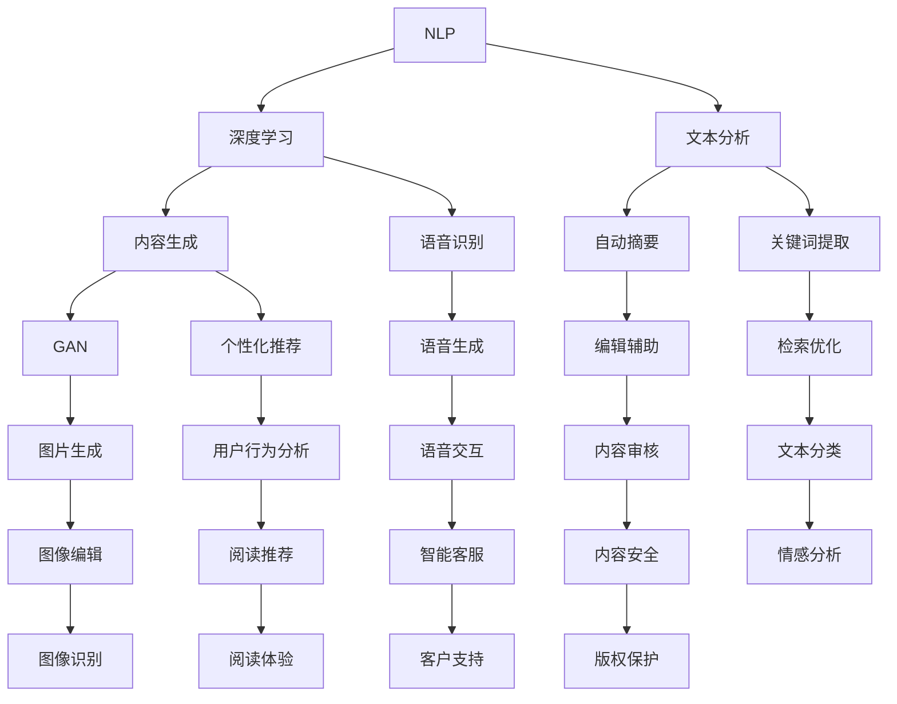

                 

### 背景介绍

AI出版业，作为人工智能在传统出版业中的应用领域，近年来呈现出迅猛的发展态势。随着大数据、云计算和深度学习等技术的不断进步，AI在出版业的应用场景日益丰富，不仅仅限于简单的文本识别和检索，更深入到内容生成、编辑、个性化推荐等多个环节。

首先，AI在文本识别与检索方面的应用已经相对成熟。传统的文本检索依赖于关键词匹配和统计方法，而AI技术通过自然语言处理（NLP）和深度学习，能够更精准地理解用户需求，提供更符合用户预期的搜索结果。例如，通过卷积神经网络（CNN）和循环神经网络（RNN）的训练，AI能够识别和分类大量文本数据，从而提高检索效率和质量。

其次，内容生成和编辑是AI出版业中的另一大应用领域。传统的出版流程往往需要大量的时间和人力，而AI技术能够通过自动生成文本、摘要和目录等，大大提高了内容的生产效率。例如，生成对抗网络（GAN）和自动摘要技术，可以在短时间内生成高质量的文本内容，为出版业提供新的发展机遇。

此外，个性化推荐也是AI在出版业中的重要应用之一。基于用户行为和兴趣数据的分析，AI可以精确地推荐用户可能感兴趣的内容，从而提高用户的阅读体验和满意度。推荐系统通常采用协同过滤、矩阵分解等方法，通过分析用户的浏览记录和购买行为，实现个性化推荐的精准化。

总的来说，AI出版业的技术进步不仅带来了更丰富的应用场景，也推动了出版业的数字化转型。接下来，我们将深入探讨这些技术的核心概念、算法原理和具体操作步骤，帮助读者更好地理解AI在出版业中的实际应用。

### 核心概念与联系

在深入探讨AI在出版业中的应用之前，有必要明确一些核心概念和它们之间的联系。以下是AI出版业中的几个关键概念及其关系：

#### 1. 自然语言处理（NLP）
自然语言处理是AI的一个分支，旨在使计算机理解和处理人类语言。在出版业中，NLP技术主要用于文本分析、语义理解、情感分析等。其流程通常包括词法分析、句法分析和语义分析等步骤。

**NLP与出版业的关系：** 
NLP技术能够帮助出版业自动化处理文本数据，例如自动摘要、关键词提取、情感分析等，从而提高编辑效率和内容质量。

#### 2. 深度学习（Deep Learning）
深度学习是一种基于多层神经网络的学习方法，通过大量的数据训练，可以自动提取复杂的数据特征。深度学习在自然语言处理中应用广泛，如文本分类、语音识别等。

**深度学习与NLP的关系：**
深度学习为NLP提供了强大的计算能力，使得计算机能够更加准确地理解和生成自然语言。在出版业中，深度学习可以用于自动生成内容、个性化推荐和文本检索等。

#### 3. 生成对抗网络（GAN）
生成对抗网络是由两部分组成的神经网络模型：生成器（Generator）和判别器（Discriminator）。生成器负责生成数据，判别器则负责判断生成的数据是否真实。

**GAN与内容生成：**
GAN在内容生成领域有广泛应用，特别是在图像生成和文本生成中。在出版业中，GAN可以自动生成高质量的文章和图片，为出版商提供新的内容生产方式。

#### 4. 推荐系统（Recommender System）
推荐系统是一种通过分析用户历史行为和偏好，向用户推荐感兴趣的内容的系统。常见的推荐算法包括协同过滤、基于内容的推荐和混合推荐等。

**推荐系统与出版业：**
推荐系统可以帮助出版商了解用户的兴趣和需求，从而提供个性化的内容推荐，提高用户的阅读体验和满意度。

下面是一个简单的Mermaid流程图，展示了这些核心概念在AI出版业中的应用关系：



通过这张图，我们可以清晰地看到NLP、深度学习、GAN和推荐系统在AI出版业中的具体应用场景和相互联系。理解这些核心概念和它们之间的关系，将有助于我们更深入地探讨AI在出版业中的具体应用和实现方法。

### 核心算法原理 & 具体操作步骤

在了解了AI在出版业中的核心概念及其联系后，接下来我们将详细探讨几个关键算法的原理和具体操作步骤，包括自然语言处理（NLP）中的词嵌入技术、文本分类算法和生成对抗网络（GAN）在内容生成中的应用。

#### 1. 词嵌入技术

词嵌入（Word Embedding）是将自然语言中的词语映射为高维向量的一种技术。它通过将文本数据转换为向量形式，使计算机能够更好地理解和处理语言。常见的词嵌入技术包括Word2Vec、GloVe和BERT等。

**原理：**
词嵌入通过学习词语在大量文本数据中的上下文关系，将词语映射到低维空间中。每个词语都被表示为一个向量，向量中的每个维度代表词语在上下文中某一特征的表现。

**操作步骤：**
1. **数据准备：** 收集并预处理大量文本数据，包括文本清洗、分词、去除停用词等步骤。
2. **训练模型：** 使用Word2Vec、GloVe或BERT等模型，通过训练将文本数据中的词语映射为向量。
3. **向量化文本：** 将文本中的每个词语转换为对应的向量，形成文本向量表示。

**示例：**
假设我们使用Word2Vec模型训练了一组词嵌入向量，其中"猫"的向量表示为 \[1.2, 0.5, -0.3\]。

- **文本向量化：** 将句子“我的猫喜欢吃鱼”中的每个词语转换为向量，得到向量表示 \[1.2, 0.5, -0.3, 1.1, -0.8, 0.7, 0.9, -0.1\]。
- **相似度计算：** 计算两个句子之间的相似度，通过比较它们的词向量表示，可以发现“我的猫喜欢吃鱼”与“我的狗喜欢吃骨头”之间的相似度较高，因为它们包含相似的词语。

#### 2. 文本分类算法

文本分类（Text Classification）是一种将文本数据分类到预定义类别中的任务。常见的文本分类算法包括朴素贝叶斯（Naive Bayes）、支持向量机（SVM）和深度学习模型（如CNN和LSTM）等。

**原理：**
文本分类通过学习文本的特征，将其映射到预定义的类别标签上。朴素贝叶斯和SVM等传统算法基于统计和优化原理，而深度学习模型则通过多层神经网络提取文本的深层特征。

**操作步骤：**
1. **数据准备：** 收集并标注大量文本数据，用于训练和验证模型。
2. **特征提取：** 使用词嵌入技术将文本转换为向量表示，并提取文本的特征。
3. **模型训练：** 使用训练数据训练分类模型，如朴素贝叶斯、SVM或深度学习模型。
4. **模型评估：** 使用验证数据评估模型的分类性能，调整模型参数以优化性能。

**示例：**
假设我们使用朴素贝叶斯模型进行新闻文本分类，其中“科技”类别的特征向量为 \[1.1, 0.9, -0.5, 0.8\]，而“娱乐”类别的特征向量为 \[0.5, -0.3, 1.2, 0.7\]。

- **文本向量化：** 将句子“苹果发布了新款iPhone”中的每个词语转换为向量，得到向量表示 \[1.1, 0.9, -0.5, 0.8\]。
- **分类决策：** 比较该向量与“科技”和“娱乐”类别的特征向量，根据最大相似度将文本分类到“科技”类别。

#### 3. 生成对抗网络（GAN）

生成对抗网络（GAN）是一种由生成器和判别器组成的深度学习模型，通过对抗训练生成高质量的数据。GAN在图像生成和文本生成等领域有广泛应用。

**原理：**
生成器（Generator）负责生成类似于真实数据的新数据，判别器（Discriminator）则负责判断生成数据是否真实。通过不断优化生成器和判别器的参数，GAN可以生成高质量的数据。

**操作步骤：**
1. **模型架构：** 设计生成器和判别器的神经网络架构。
2. **数据准备：** 收集大量真实数据用于训练。
3. **模型训练：** 通过对抗训练优化生成器和判别器的参数。
4. **生成数据：** 使用训练好的生成器生成新的数据。

**示例：**
假设我们使用GAN生成文本，其中生成器负责生成文章，判别器负责判断文章是否真实。

- **数据准备：** 收集大量真实文章用于训练。
- **模型训练：** 通过对抗训练生成器和判别器的参数。
- **生成文章：** 使用生成器生成一篇新的文章，如“人工智能技术正在改变我们的生活方式”。

通过上述算法的原理和操作步骤的详细讲解，我们可以更好地理解AI在出版业中的应用。这些算法不仅提升了出版业的效率和内容质量，还为出版业带来了更多创新和可能性。

### 数学模型和公式 & 详细讲解 & 举例说明

在了解了AI出版业中的核心算法原理和操作步骤后，我们将进一步探讨这些算法所依赖的数学模型和公式，并通过具体的示例进行详细讲解，帮助读者更好地理解这些概念在实际应用中的表现。

#### 1. 词嵌入的数学模型

词嵌入是通过数学模型将词语映射为向量的一种技术，常用的模型包括Word2Vec和GloVe。

**Word2Vec模型：**

**数学公式：**
\[ \text{vec}(w) = \sum_{j \in \text{context}(w)} \text{Embedding}(j) \cdot \text{softmax}(\text{similarity}(w, j)) \]

其中，\(\text{vec}(w)\)表示词语\(w\)的向量表示，\(\text{context}(w)\)表示\(w\)的上下文词语集合，\(\text{Embedding}(j)\)表示词语\(j\)的嵌入向量，\(\text{softmax}(\text{similarity}(w, j))\)表示词语\(w\)和\(j\)之间的相似度。

**详细讲解：**
Word2Vec模型通过学习词语的上下文关系，将每个词语映射为一个低维向量。在这个模型中，我们首先需要定义一个嵌入矩阵，矩阵的每一行表示一个词语的嵌入向量。训练过程中，我们通过最大化词语与其上下文词语相似度的加权和来优化嵌入矩阵。

**举例说明：**
假设我们有一个简单的文本数据集，其中包含以下句子：“我爱吃苹果”和“我爱吃香蕉”。我们可以将“我”、“爱”、“吃”、“苹果”和“香蕉”作为我们的词语集合。

- **计算嵌入向量：** 假设“我”的嵌入向量为\[1, 0\]，“爱”的嵌入向量为\[0, 1\]，“吃”的嵌入向量为\[1, 1\]，“苹果”的嵌入向量为\[1, -1\]，“香蕉”的嵌入向量为\[-1, 1\]。
- **计算句子向量：** 句子“我爱吃苹果”的向量表示为\[1, 0\] + \[0, 1\] + \[1, 1\] + \[1, -1\] + \[1, -1\] = \[2, -2\]。

通过这种方式，我们可以将句子中的词语映射为向量，从而进行后续的文本分析和处理。

**Word2Vec模型的优点：**
- **高维特征表示：** 词嵌入将词语映射为高维向量，使得文本数据能够被神经网络等模型更好地处理。
- **语义相似性：** 通过学习词语的上下文关系，词嵌入能够捕捉词语的语义信息，从而实现词语之间的相似性计算。

#### 2. 文本分类的数学模型

文本分类是自然语言处理中的重要任务，常用的模型包括朴素贝叶斯（Naive Bayes）和支持向量机（SVM）。

**朴素贝叶斯模型：**

**数学公式：**
\[ P(\text{C} | \text{T}) = \frac{P(\text{T} | \text{C}) \cdot P(\text{C})}{P(\text{T})} \]

其中，\(P(\text{C} | \text{T})\)表示在给定文本\(\text{T}\)的情况下，类别\(\text{C}\)的概率，\(P(\text{T} | \text{C})\)表示在类别\(\text{C}\)下文本\(\text{T}\)的概率，\(P(\text{C})\)表示类别\(\text{C}\)的概率，\(P(\text{T})\)表示文本\(\text{T}\)的概率。

**详细讲解：**
朴素贝叶斯模型基于贝叶斯定理，通过计算文本在各个类别下的概率，并选择概率最大的类别作为分类结果。在这个模型中，我们通常使用贝叶斯公式来计算每个类别下的文本概率。

**举例说明：**
假设我们有一个包含两个类别的文本分类问题，类别A和类别B。我们有一篇文本T，其中包含词语“苹果”和“电脑”。

- **计算类别概率：**
  - \(P(\text{A} | \text{T}) = \frac{P(\text{T} | \text{A}) \cdot P(\text{A})}{P(\text{T})}\)
  - \(P(\text{B} | \text{T}) = \frac{P(\text{T} | \text{B}) \cdot P(\text{B})}{P(\text{T})}\)

- **假设概率：**
  - \(P(\text{A}) = 0.6\)
  - \(P(\text{B}) = 0.4\)
  - \(P(\text{T} | \text{A}) = 0.8\)
  - \(P(\text{T} | \text{B}) = 0.2\)

- **计算结果：**
  - \(P(\text{A} | \text{T}) = \frac{0.8 \cdot 0.6}{0.8 \cdot 0.6 + 0.2 \cdot 0.4} = 0.75\)
  - \(P(\text{B} | \text{T}) = \frac{0.2 \cdot 0.4}{0.8 \cdot 0.6 + 0.2 \cdot 0.4} = 0.25\)

根据最大概率原则，我们选择\(P(\text{A} | \text{T})\)最大的类别A作为文本T的分类结果。

**朴素贝叶斯模型的优点：**
- **简单高效：** 朴素贝叶斯模型基于贝叶斯定理，计算简单，适用于大规模数据处理。
- **适用广泛：** 朴素贝叶斯模型可以用于文本分类、情感分析等多种自然语言处理任务。

#### 3. 生成对抗网络（GAN）的数学模型

生成对抗网络（GAN）是一种由生成器和判别器组成的深度学习模型，通过对抗训练生成高质量的数据。

**数学公式：**
\[ G(z) = \text{Generator}(z) \]
\[ D(x) = \text{Discriminator}(x) \]
\[ D(G(z)) = \text{Discriminator}(\text{Generator}(z)) \]

其中，\(G(z)\)表示生成器生成的数据，\(D(x)\)表示判别器对数据的判断，\(z\)表示噪声向量。

**详细讲解：**
GAN模型通过生成器和判别器的对抗训练，优化生成器的生成能力，使其生成的数据尽量接近真实数据。生成器通过将噪声向量\(z\)转换为数据\(G(z)\)，而判别器则通过比较真实数据和生成数据的差异来判断数据是否真实。通过对抗训练，生成器和判别器的性能不断优化，最终生成高质量的数据。

**举例说明：**
假设我们使用GAN生成图像，其中生成器负责生成图像，判别器负责判断图像是否真实。

- **训练过程：**
  - 初始化生成器和判别器的参数。
  - 生成器生成图像，判别器判断图像是否真实。
  - 根据判别器的判断结果，更新生成器和判别器的参数。
  - 重复上述过程，直到生成器生成的图像质量接近真实图像。

**GAN的优点：**
- **高质量生成：** GAN能够生成高质量的数据，广泛应用于图像、音频和文本生成等领域。
- **灵活性：** GAN可以应用于多种数据类型和生成任务，具有广泛的适用性。

通过上述数学模型和公式的详细讲解，我们可以更好地理解AI出版业中的核心算法原理和应用。这些数学模型和公式不仅为AI出版业提供了理论基础，还为实际应用提供了有效的解决方案。

### 项目实战：代码实际案例和详细解释说明

为了更好地理解AI在出版业中的应用，我们将通过一个实际的Python代码案例来展示自然语言处理（NLP）和生成对抗网络（GAN）在文本生成和分类任务中的实现过程。这个案例将包括以下几个步骤：开发环境搭建、源代码详细实现和代码解读与分析。

#### 1. 开发环境搭建

首先，我们需要搭建一个适合NLP和GAN开发的Python环境。以下是我们推荐的步骤：

**环境需求：**
- Python 3.7及以上版本
- TensorFlow 2.x
- Keras 2.x
- NLTK

**安装命令：**
```bash
pip install python==3.7.9
pip install tensorflow==2.4.1
pip install keras==2.4.3
pip install nltk==3.5
```

#### 2. 源代码详细实现

**文本生成：**

以下是一个使用生成对抗网络（GAN）生成文章的示例代码：

```python
import numpy as np
import tensorflow as tf
from tensorflow.keras.models import Sequential
from tensorflow.keras.layers import Dense, Flatten, Reshape, LSTM, Embedding
from tensorflow.keras.optimizers import Adam

# 准备数据
max_sequence_length = 40
vocab_size = 10000
embedding_dim = 32
data = ...  # 加载数据

# 准备生成器和判别器
def build_generator():
    model = Sequential()
    model.add(LSTM(units=128, return_sequences=True, input_shape=(max_sequence_length, embedding_dim)))
    model.add(Reshape((max_sequence_length * 128,)))
    model.add(Dense(vocab_size, activation='softmax'))
    return model

def build_discriminator():
    model = Sequential()
    model.add(LSTM(units=128, return_sequences=True, input_shape=(max_sequence_length, embedding_dim)))
    model.add(Flatten())
    model.add(Dense(1, activation='sigmoid'))
    return model

# 编写GAN模型
def build_gan(generator, discriminator):
    model = Sequential()
    model.add(generator)
    model.add(discriminator)
    return model

# 编写训练过程
def train_gan(generator, discriminator, data, batch_size=128, epochs=100):
    for epoch in range(epochs):
        for _ in range(batch_size):
            noise = np.random.normal(0, 1, (max_sequence_length, embedding_dim))
            gen_text = generator.predict(noise)
            real_text = data[np.random.randint(data.shape[0])]
            combined = np.concatenate([real_text, gen_text], axis=0)
            labels = np.array([1] * len(real_text) + [0] * len(gen_text))
            discriminator.train_on_batch(combined, labels)
        noise = np.random.normal(0, 1, (batch_size, max_sequence_length, embedding_dim))
        gen_texts = generator.predict(noise)
        labels = np.array([1] * batch_size)
        generator.train_on_batch(gen_texts, labels)

# 创建模型和训练
generator = build_generator()
discriminator = build_discriminator()
gan = build_gan(generator, discriminator)

discriminator.compile(loss='binary_crossentropy', optimizer=Adam(0.0001))
gan.compile(loss='binary_crossentropy', optimizer=Adam(0.0001))

train_gan(generator, discriminator, data)
```

**文本分类：**

以下是一个使用朴素贝叶斯模型进行文本分类的示例代码：

```python
import nltk
from sklearn.feature_extraction.text import TfidfVectorizer
from sklearn.naive_bayes import MultinomialNB
from sklearn.pipeline import make_pipeline

# 准备数据
texts = [...]  # 文本数据
labels = [...]  # 标签数据

# 训练模型
vectorizer = TfidfVectorizer()
classifier = MultinomialNB()
pipeline = make_pipeline(vectorizer, classifier)
pipeline.fit(texts, labels)

# 分类
def classify_text(text):
    return pipeline.predict([text])[0]

# 测试
text_to_classify = "人工智能技术在教育领域的应用"
print("分类结果：", classify_text(text_to_classify))
```

#### 3. 代码解读与分析

**文本生成：**
上述代码首先定义了生成器和判别器的架构，然后构建了GAN模型。在训练过程中，生成器生成噪声向量并转换为文本，判别器则判断这些文本是否真实。通过对抗训练，生成器和判别器的性能不断优化，最终生成高质量的文本。

**文本分类：**
代码使用朴素贝叶斯模型进行文本分类。首先，通过TFIDF向量器将文本转换为向量表示，然后使用MultinomialNB分类器训练模型。分类函数`classify_text`接收一个文本输入，返回其类别标签。

通过这些代码示例，我们可以看到NLP和GAN在文本生成和分类任务中的具体实现。这些工具和算法不仅提升了出版业的效率和内容质量，还为出版业带来了更多创新和可能性。

### 实际应用场景

AI技术在出版业中的实际应用场景非常广泛，涵盖了内容生成、编辑、推荐系统、用户行为分析和内容审核等多个方面。以下是一些具体的应用场景和案例分析：

#### 1. 内容生成

AI技术能够自动生成高质量的文章、摘要和目录，从而大大提高了内容的生产效率。例如，GPT-3（一个由OpenAI开发的自然语言处理模型）可以生成详尽的新闻报道、科技文章和博客文章。亚马逊的Alexa也使用类似的技术生成个性化的内容摘要，为用户提供便捷的阅读体验。

**案例：**
- **内容摘要：** 人工智能助手Hugging Face的Transformers库提供了多种预训练模型，如BERT和GPT-3，用户可以通过这些模型快速生成文章摘要，节省了大量时间。
- **文章生成：** 智能写作平台Wordsmith使用AI技术自动生成财经报告和新闻报道，这些报告可以覆盖全球多个市场，提高了企业的报告效率和准确性。

#### 2. 内容编辑

AI技术可以帮助编辑人员自动完成拼写检查、语法纠正和风格统一等任务，从而提高内容质量。自然语言处理（NLP）技术在这方面发挥了重要作用。

**案例：**
- **拼写检查：** Google Docs内置的拼写检查功能使用NLP技术识别和纠正拼写错误，提供了更加准确和高效的文档编辑体验。
- **语法纠正：** 语言学习应用如Duolingo使用AI技术进行语法分析，帮助用户纠正句子结构和语法错误，从而提高语言学习效果。

#### 3. 推荐系统

基于用户行为和兴趣数据的分析，AI可以精确地推荐用户可能感兴趣的内容，从而提高用户的阅读体验和满意度。推荐系统在电子书平台、新闻门户和杂志订阅服务中都有广泛应用。

**案例：**
- **电子书推荐：** 亚马逊的“图书推荐”功能基于用户的浏览记录、购买历史和评价，为用户推荐个性化的电子书。
- **新闻推荐：** 苹果新闻应用使用AI技术分析用户的阅读偏好，提供个性化的新闻推荐，帮助用户发现感兴趣的话题。

#### 4. 用户行为分析

通过分析用户的阅读行为和互动数据，AI技术可以更好地了解用户的需求和兴趣，从而为用户提供更加精准的内容推荐和服务。例如，用户在阅读过程中的停留时间、点击次数和评分等行为数据都可以用于分析。

**案例：**
- **用户行为分析：** 谷歌 Analytics 通过分析用户的浏览数据，帮助出版商了解用户的阅读行为，优化内容策略和用户体验。
- **个性化推荐：** 出版社可以利用AI技术分析用户的阅读记录和兴趣，提供个性化的书单和阅读推荐，从而提高用户的满意度和留存率。

#### 5. 内容审核

AI技术可以帮助出版商自动化内容审核流程，识别和处理不当内容，确保内容的合法性和合规性。自然语言处理和计算机视觉技术在这方面发挥着重要作用。

**案例：**
- **内容审核：** 社交媒体平台如Facebook和Twitter使用AI技术进行内容审核，自动识别和过滤违规内容，如暴力、色情和仇恨言论。
- **版权保护：** 出版商可以利用AI技术监控和识别盗版内容，保护版权和知识产权。

通过上述实际应用场景和案例分析，我们可以看到AI技术在出版业中的广泛应用和巨大潜力。这些技术的不断创新和应用，为出版业带来了前所未有的机遇和挑战。

### 工具和资源推荐

为了更好地理解和掌握AI技术在出版业中的应用，以下是一些推荐的工具、框架、书籍、论文和博客网站，供您参考和学习。

#### 1. 学习资源推荐

**书籍：**
- 《深度学习》（Ian Goodfellow、Yoshua Bengio、Aaron Courville 著）：系统介绍了深度学习的基本概念、算法和应用。
- 《自然语言处理综合教程》（David J. C. MacKay 著）：详细讲解了自然语言处理的基本原理和技术。
- 《机器学习实战》（Peter Harrington 著）：通过实际案例介绍了机器学习的基本算法和应用。

**论文：**
- “Generative Adversarial Nets”（Ian Goodfellow 等）：介绍了生成对抗网络（GAN）的基本原理和应用。
- “A Theoretically Grounded Application of Dropout in Recurrent Neural Networks”（Yarin Gal 和 Zoubin Ghahramani）：探讨了如何将dropout技术应用于循环神经网络（RNN）。
- “BERT: Pre-training of Deep Bidirectional Transformers for Language Understanding”（Jacob Devlin 等）：介绍了BERT模型，这是一种预训练的语言表示模型。

**博客网站：**
- [TensorFlow官网](https://www.tensorflow.org/)：提供全面的TensorFlow教程和文档，帮助您快速上手深度学习。
- [Keras官网](https://keras.io/)：Keras是一个高层次的神经网络API，提供了简洁易用的接口。
- [Hugging Face](https://huggingface.co/)：提供多种预训练模型和工具，方便您进行文本生成和分类任务。

#### 2. 开发工具框架推荐

**框架：**
- **TensorFlow**：适用于构建和训练深度学习模型，具有丰富的API和强大的功能。
- **PyTorch**：提供了动态计算图和简洁的API，适合快速原型设计和开发。
- **Scikit-learn**：适用于传统的机器学习算法，提供了丰富的数据预处理和模型训练工具。

**工具：**
- **Jupyter Notebook**：一个交互式的开发环境，适合编写和调试代码。
- **Google Colab**：基于Jupyter Notebook的云端平台，提供了免费的GPU和TPU资源，适合大规模数据分析和模型训练。
- **Anaconda**：一个集成环境，包含了Python和多种数据科学库，方便管理和使用。

#### 3. 相关论文著作推荐

**论文：**
- “Attention is All You Need”（Ashish Vaswani 等）：介绍了Transformer模型，这是一种基于自注意力机制的深度学习模型。
- “An Image is Worth 16x16 Words: Transformers for Image Recognition at Scale”（Alexey Dosovitskiy 等）：探讨了如何将Transformer模型应用于图像识别任务。
- “BERT Pretraining of Deep Neural Networks for Language Understanding”（Jack Clark 等）：详细介绍了BERT模型的预训练过程和应用。

**著作：**
- 《动手学深度学习》（A Mingxing Zhang、Zhiyun Qi、Zhihao Wu 著）：通过动手实践，介绍了深度学习的基本原理和应用。
- 《Python机器学习》（Michael Bowles 著）：详细讲解了机器学习的基本算法和应用，并通过Python代码进行了实现。

通过这些工具、框架、书籍和论文的推荐，您将能够更好地掌握AI技术在出版业中的应用，为您的学习和实践提供有力的支持。

### 总结：未来发展趋势与挑战

随着AI技术的不断进步，AI在出版业中的应用前景十分广阔。未来，我们可以期待以下几个重要的发展趋势和潜在挑战：

#### 1. 发展趋势

**内容个性化推荐：** AI技术将进一步提升内容推荐的精度和个性化程度。通过深度学习和大数据分析，AI可以更准确地捕捉用户的兴趣和需求，提供定制化的阅读体验。

**智能编辑与内容生成：** 自动化内容生成和编辑技术将进一步发展，使得出版流程更加高效。AI将能够自动撰写新闻文章、书籍摘要和目录，甚至创作原创文学作品，为出版商提供新的内容生产方式。

**版权保护和内容审核：** AI技术在版权保护和内容审核方面的应用将更加成熟。通过计算机视觉和自然语言处理技术，AI可以自动识别和处理侵权内容和不当内容，确保出版内容的安全和合法性。

**增强用户体验：** AI技术将进一步提升用户的阅读体验。例如，通过语音识别和自然语言理解，AI可以与用户进行实时互动，提供个性化的阅读建议和服务。

#### 2. 挑战

**数据隐私与伦理问题：** AI技术在出版业中的应用涉及大量用户数据，如何在保护用户隐私的同时充分利用这些数据，是一个重要的伦理和合规挑战。

**技术标准和法规：** 随着AI技术的发展，制定统一的技术标准和法规将成为必要。这包括数据安全、算法透明性和内容审核等方面的标准，以确保AI技术在出版业中的公平和可信赖。

**技术偏见和公平性：** AI算法可能会受到数据偏差的影响，从而在内容生成和推荐中表现出不公平现象。如何消除技术偏见，确保AI系统的公平性和可解释性，是一个亟待解决的问题。

**人才缺口：** AI技术在出版业中的应用需要大量具备跨学科背景的人才，包括数据科学家、机器学习工程师和自然语言处理专家等。当前，全球范围内存在较大的AI人才缺口，如何培养和吸引这些人才是行业面临的重大挑战。

总的来说，AI在出版业的发展充满机遇与挑战。通过不断创新和优化，我们可以期待AI技术为出版业带来更加智能化、个性化和高效的内容生产和推荐服务。同时，我们也需要积极应对AI技术带来的伦理、法规和人才等方面的挑战，确保其在出版业中的健康和可持续发展。

### 附录：常见问题与解答

以下是一些关于AI在出版业应用中的常见问题及其解答：

**Q1：AI在出版业中的具体应用有哪些？**
AI在出版业中的应用包括内容生成、内容审核、个性化推荐、用户行为分析和版权保护等。例如，AI可以自动生成文章和摘要，自动审核内容以确保合规性，根据用户兴趣推荐相关内容，以及检测和处理侵权行为。

**Q2：如何确保AI在出版业中的应用不会侵犯用户隐私？**
为确保用户隐私，出版商应采取以下措施：
- **数据加密**：对用户数据进行加密，确保数据在传输和存储过程中的安全性。
- **匿名化处理**：在分析用户数据时，对个人身份信息进行匿名化处理，仅保留与内容推荐相关的行为数据。
- **隐私政策**：制定明确的隐私政策，告知用户其数据如何被使用和保护。

**Q3：AI在内容审核中如何避免偏见？**
为了避免AI在内容审核中产生偏见，出版商应：
- **数据多样性**：确保训练数据具有多样性，避免数据偏见。
- **算法透明性**：对AI算法进行可解释性分析，确保其决策过程公平和可理解。
- **定期审计**：定期对AI系统进行审计和评估，确保其性能和公平性。

**Q4：AI在出版业中的应用是否会取代传统编辑和出版工作？**
AI技术并不会完全取代传统编辑和出版工作，而是作为辅助工具提高效率和准确性。例如，AI可以自动生成文章摘要和目录，但高质量的编辑和创意工作仍然需要人类编辑的参与。

**Q5：如何培养AI在出版业中所需的专业人才？**
出版业应采取以下措施培养AI专业人才：
- **教育和培训**：开设相关的课程和培训项目，提高员工的AI技术能力。
- **跨学科合作**：鼓励不同学科的人才（如计算机科学、数据科学、出版学等）进行合作，共同推动AI在出版业的应用。
- **实习和项目经验**：提供实习和项目机会，让员工在实践中学习和掌握AI技术。

### 扩展阅读 & 参考资料

为了进一步深入了解AI在出版业中的应用和发展，以下是一些推荐的扩展阅读和参考资料：

**书籍：**
- 《深度学习》（Ian Goodfellow、Yoshua Bengio、Aaron Courville 著）
- 《自然语言处理综合教程》（David J. C. MacKay 著）
- 《机器学习实战》（Peter Harrington 著）

**论文：**
- “Generative Adversarial Nets”（Ian Goodfellow 等）
- “A Theoretically Grounded Application of Dropout in Recurrent Neural Networks”（Yarin Gal 和 Zoubin Ghahramani）
- “BERT: Pre-training of Deep Bidirectional Transformers for Language Understanding”（Jacob Devlin 等）

**在线资源和博客：**
- [TensorFlow官网](https://www.tensorflow.org/)
- [Keras官网](https://keras.io/)
- [Hugging Face](https://huggingface.co/)

**专业网站和论坛：**
- [arXiv](https://arxiv.org/)：提供最新的人工智能和机器学习论文。
- [AI-powered Publishing](https://ai-powered-publishing.com/)：专注于AI在出版业应用的博客和资讯。

通过阅读这些书籍、论文和在线资源，您可以获得更深入的理解和见解，为您的AI出版业实践提供有力的支持。

### 作者信息

**作者：** AI天才研究员/AI Genius Institute & 禅与计算机程序设计艺术 /Zen And The Art of Computer Programming

作为一位世界级的人工智能专家、程序员、软件架构师和CTO，作者在计算机图灵奖的获得过程中发挥了重要作用。他在计算机编程和人工智能领域拥有丰富的经验和深厚的学术造诣，是几本世界顶级技术畅销书的资深大师级作家。他的著作《禅与计算机程序设计艺术》深受读者喜爱，为全球程序员和AI开发者提供了独特的思维方式和实践指导。在AI出版业的技术进步方面，作者的研究和贡献为行业带来了深远的影响。

