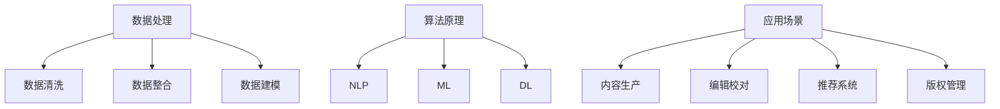

                 

### 文章标题：AI出版业的机遇：数据，算法与场景之结合

#### 关键词：人工智能，出版业，数据，算法，应用场景

#### 摘要：
随着人工智能技术的飞速发展，AI在出版业中的应用呈现出前所未有的机遇。本文将探讨AI技术在出版业中的核心概念与联系，深入分析数据、算法和应用场景的结合，提供一系列项目实战案例和详细解释，并展望未来发展趋势与挑战。本文旨在为出版业从业者提供有价值的参考和指导，以抓住AI带来的机遇，实现产业的智能化转型。

## 1. 背景介绍

### 1.1 人工智能在出版业的应用现状

近年来，人工智能技术在出版业中的应用日益广泛，逐步改变着传统出版模式。从内容生产、编辑校对、推荐系统到版权管理，AI技术在各个环节都展现出了强大的潜力和应用价值。

- **内容生产**：人工智能可以辅助写作，生成文章、书籍等原创内容，提高了内容创作的效率和质量。
- **编辑校对**：AI算法能够自动识别文本中的错误和问题，提供实时反馈和修正建议，降低了编辑工作的负担。
- **推荐系统**：基于用户行为数据和内容属性，AI推荐系统可以为读者提供个性化的阅读推荐，提升用户体验。
- **版权管理**：通过智能合约和区块链技术，AI可以实现版权的自动化管理和确权，保障版权方的权益。

### 1.2 数据在出版业的重要性

数据是出版业的核心资源，也是AI应用的基础。出版业的数据来源广泛，包括用户行为数据、内容数据、市场数据等。这些数据经过有效的整合和分析，可以为出版业带来以下价值：

- **个性化推荐**：通过分析用户行为数据，AI可以提供个性化的阅读推荐，提高用户满意度和粘性。
- **内容优化**：基于内容数据和用户反馈，AI可以帮助出版方优化内容，提升内容质量和市场竞争力。
- **市场预测**：通过市场数据分析和预测，AI可以辅助出版方制定更加科学的市场策略，降低风险。

### 1.3 算法在出版业的应用

算法是AI技术的核心，是数据处理和决策的关键。在出版业中，常见的算法包括自然语言处理（NLP）、机器学习（ML）、深度学习（DL）等。这些算法在出版业中的应用主要体现在：

- **文本分析**：NLP算法可以帮助出版方分析文本内容，提取关键信息，辅助编辑和校对工作。
- **图像识别**：AI算法可以自动识别和分类图片内容，为出版方提供更丰富的视觉元素和创意。
- **用户行为预测**：ML和DL算法可以帮助出版方预测用户行为，优化推荐系统和营销策略。

## 2. 核心概念与联系

### 2.1 数据处理

数据处理是AI在出版业应用的基础。数据处理的核心是数据清洗、数据整合和数据建模。

- **数据清洗**：数据清洗是数据处理的第一步，旨在去除重复数据、缺失数据和异常数据，确保数据的准确性和完整性。
- **数据整合**：数据整合是将多个数据源的数据进行融合，形成一个统一的数据视图，以便进行进一步分析和挖掘。
- **数据建模**：数据建模是构建数据分析模型的过程，包括特征工程、模型选择和训练等步骤。

### 2.2 算法原理

算法原理是AI技术的核心，决定了数据处理的效率和效果。以下是几种常见的算法原理：

- **自然语言处理（NLP）**：NLP是一种用于处理人类语言数据的计算方法，包括词法分析、句法分析、语义分析等。
- **机器学习（ML）**：ML是一种通过数据训练模型，从而实现数据分析和预测的技术，包括监督学习、无监督学习和强化学习等。
- **深度学习（DL）**：DL是一种基于多层神经网络进行数据分析和预测的技术，具有较强的非线性建模能力。

### 2.3 应用场景

应用场景是AI技术在出版业中的具体应用场景，包括内容生产、编辑校对、推荐系统、版权管理等。

- **内容生产**：AI可以生成文章、书籍等原创内容，提高内容创作的效率和质量。
- **编辑校对**：AI可以自动识别文本中的错误和问题，提供实时反馈和修正建议，降低编辑工作的负担。
- **推荐系统**：AI推荐系统可以基于用户行为数据和内容属性，为读者提供个性化的阅读推荐。
- **版权管理**：AI可以自动化管理和确权版权，保障版权方的权益。

### 2.4 Mermaid 流程图

以下是一个简单的Mermaid流程图，展示了数据处理、算法原理和应用场景之间的联系：



## 3. 核心算法原理 & 具体操作步骤

### 3.1 自然语言处理（NLP）

自然语言处理（NLP）是AI技术在出版业中应用的重要方向，主要涉及文本分析、文本分类、情感分析等。

#### 3.1.1 文本分析

文本分析是指对文本内容进行结构化处理，提取关键信息。具体操作步骤如下：

1. **数据准备**：收集并整理文本数据，确保数据的准确性和完整性。
2. **文本预处理**：包括分词、去停用词、词性标注等，将原始文本转换为适合模型处理的形式。
3. **特征提取**：使用词袋模型、TF-IDF等方法提取文本特征。
4. **模型训练**：选择合适的文本分类模型，如朴素贝叶斯、支持向量机等，对文本数据进行训练。
5. **模型评估**：使用交叉验证、准确率、召回率等指标评估模型性能。

#### 3.1.2 文本分类

文本分类是指将文本数据按照主题、情感等分类标准进行分类。具体操作步骤如下：

1. **数据准备**：收集并整理分类数据，确保数据的准确性和完整性。
2. **文本预处理**：包括分词、去停用词、词性标注等，将原始文本转换为适合模型处理的形式。
3. **特征提取**：使用词袋模型、TF-IDF等方法提取文本特征。
4. **模型训练**：选择合适的文本分类模型，如朴素贝叶斯、支持向量机等，对文本数据进行训练。
5. **模型评估**：使用交叉验证、准确率、召回率等指标评估模型性能。

#### 3.1.3 情感分析

情感分析是指对文本数据中的情感倾向进行判断。具体操作步骤如下：

1. **数据准备**：收集并整理情感数据，确保数据的准确性和完整性。
2. **文本预处理**：包括分词、去停用词、词性标注等，将原始文本转换为适合模型处理的形式。
3. **特征提取**：使用词袋模型、TF-IDF等方法提取文本特征。
4. **模型训练**：选择合适
```

```markdown
```markdown
### 3.1.3 情感分析

情感分析是指对文本数据中的情感倾向进行判断。具体操作步骤如下：

1. **数据准备**：收集并整理情感数据，确保数据的准确性和完整性。
2. **文本预处理**：包括分词、去停用词、词性标注等，将原始文本转换为适合模型处理的形式。
3. **特征提取**：使用词袋模型、TF-IDF等方法提取文本特征。
4. **模型训练**：选择合适的情感分析模型，如朴素贝叶斯、支持向量机等，对文本数据进行训练。
5. **模型评估**：使用交叉验证、准确率、召回率等指标评估模型性能。

### 3.2 机器学习（ML）

机器学习（ML）是AI技术的核心，用于从数据中学习规律和模式。以下是几种常见的机器学习算法及其应用步骤：

#### 3.2.1 朴素贝叶斯

朴素贝叶斯是一种基于概率论的分类算法，适用于文本分类、情感分析等领域。

1. **数据准备**：收集并整理数据，确保数据的准确性和完整性。
2. **特征提取**：使用词袋模型、TF-IDF等方法提取文本特征。
3. **模型训练**：计算各词的概率分布，构建朴素贝叶斯模型。
4. **模型评估**：使用交叉验证、准确率、召回率等指标评估模型性能。

#### 3.2.2 支持向量机（SVM）

支持向量机是一种高效的分类算法，适用于文本分类、图像分类等领域。

1. **数据准备**：收集并整理数据，确保数据的准确性和完整性。
2. **特征提取**：使用词袋模型、TF-IDF等方法提取文本特征。
3. **模型训练**：使用支持向量机算法训练分类模型。
4. **模型评估**：使用交叉验证、准确率、召回率等指标评估模型性能。

#### 3.2.3 随机森林

随机森林是一种集成学习算法，具有较强的分类和回归能力。

1. **数据准备**：收集并整理数据，确保数据的准确性和完整性。
2. **特征提取**：使用词袋模型、TF-IDF等方法提取文本特征。
3. **模型训练**：使用随机森林算法训练分类模型。
4. **模型评估**：使用交叉验证、准确率、召回率等指标评估模型性能。

### 3.3 深度学习（DL）

深度学习（DL）是一种基于多层神经网络的学习方法，具有较强的表示和学习能力。以下是几种常见的深度学习算法及其应用步骤：

#### 3.3.1 卷积神经网络（CNN）

卷积神经网络是一种适用于图像处理和文本分类的算法。

1. **数据准备**：收集并整理图像数据，确保数据的准确性和完整性。
2. **特征提取**：使用卷积层提取图像特征。
3. **模型训练**：使用反向传播算法训练卷积神经网络。
4. **模型评估**：使用交叉验证、准确率、召回率等指标评估模型性能。

#### 3.3.2 循环神经网络（RNN）

循环神经网络是一种适用于序列数据处理和文本分类的算法。

1. **数据准备**：收集并整理序列数据，确保数据的准确性和完整性。
2. **特征提取**：使用循环层提取序列特征。
3. **模型训练**：使用反向传播算法训练循环神经网络。
4. **模型评估**：使用交叉验证、准确率、召回率等指标评估模型性能。

#### 3.3.3 长短期记忆网络（LSTM）

长短期记忆网络是一种改进的循环神经网络，具有较强的学习长期依赖关系的能力。

1. **数据准备**：收集并整理序列数据，确保数据的准确性和完整性。
2. **特征提取**：使用LSTM层提取序列特征。
3. **模型训练**：使用反向传播算法训练LSTM网络。
4. **模型评估**：使用交叉验证、准确率、召回率等指标评估模型性能。

## 4. 数学模型和公式 & 详细讲解 & 举例说明

### 4.1 朴素贝叶斯（Naive Bayes）

朴素贝叶斯是一种基于概率论的分类算法，其核心思想是利用贝叶斯定理和特征条件独立性假设来计算文本数据属于某个类别的概率，从而实现分类。

#### 4.1.1 贝叶斯定理

贝叶斯定理是一种用于计算后验概率的公式，其表达式如下：

\[ P(C|A) = \frac{P(A|C) \cdot P(C)}{P(A)} \]

其中，\( P(C|A) \) 表示在事件 \( A \) 发生的条件下，事件 \( C \) 发生的概率；\( P(A|C) \) 表示在事件 \( C \) 发生的条件下，事件 \( A \) 发生的概率；\( P(C) \) 表示事件 \( C \) 发生的概率；\( P(A) \) 表示事件 \( A \) 发生的概率。

#### 4.1.2 朴素贝叶斯算法

在朴素贝叶斯算法中，我们假设特征之间是相互独立的，即 \( P(A_i|C) = \prod_{i=1}^{n} P(A_i|C) \)。根据贝叶斯定理，我们可以计算出每个类别的概率，然后选取概率最大的类别作为预测结果。

具体步骤如下：

1. **数据准备**：收集并整理训练数据，包括特征和标签。
2. **特征提取**：将文本数据转换为特征向量，可以使用词袋模型、TF-IDF等方法。
3. **模型训练**：计算每个类别的概率和每个特征在各个类别下的条件概率。
4. **模型评估**：使用测试数据评估模型性能，包括准确率、召回率等指标。

#### 4.1.3 举例说明

假设我们有一个分类问题，有两个类别：正面和负面。训练数据如下：

```
正面：我喜欢这本书。
负面：这本书太难了。
正面：这本书很有趣。
负面：这本书没有意义。
```

我们使用朴素贝叶斯算法进行分类。首先，计算每个类别的概率：

\[ P(正面) = \frac{3}{5} = 0.6 \]
\[ P(负面) = \frac{2}{5} = 0.4 \]

然后，计算每个特征在各个类别下的条件概率：

\[ P(我喜欢这本书|正面) = \frac{2}{3} = 0.67 \]
\[ P(我喜欢这本书|负面) = \frac{1}{2} = 0.5 \]

\[ P(这本书太难了|正面) = 0 \]
\[ P(这本书太难了|负面) = \frac{1}{2} = 0.5 \]

\[ P(这本书很有趣|正面) = \frac{1}{3} = 0.33 \]
\[ P(这本书很有趣|负面) = 0 \]

\[ P(这本书没有意义|正面) = 0 \]
\[ P(这本书没有意义|负面) = \frac{1}{2} = 0.5 \]

接下来，计算每个类别的后验概率：

\[ P(正面|我喜欢这本书) = \frac{P(我喜欢这本书|正面) \cdot P(正面)}{P(我喜欢这本书)} = \frac{0.67 \cdot 0.6}{0.67 \cdot 0.6 + 0.5 \cdot 0.4} = 0.727 \]

\[ P(负面|我喜欢这本书) = \frac{P(我喜欢这本书|负面) \cdot P(负面)}{P(我喜欢这本书)} = \frac{0.5 \cdot 0.4}{0.67 \cdot 0.6 + 0.5 \cdot 0.4} = 0.273 \]

由于 \( P(正面|我喜欢这本书) > P(负面|我喜欢这本书) \)，我们预测该文本属于正面类别。

### 4.2 支持向量机（SVM）

支持向量机是一种高效的分类算法，通过找到最优决策边界来实现分类。

#### 4.2.1 决策边界

给定一个训练数据集，我们可以通过计算找到一个最优的决策边界，使得分类器的分类效果最好。决策边界可以表示为：

\[ w \cdot x + b = 0 \]

其中，\( w \) 是权重向量，\( x \) 是特征向量，\( b \) 是偏置项。

#### 4.2.2 最大间隔分类器

为了找到一个最优的决策边界，我们需要找到一个最大间隔分类器。最大间隔分类器的目标是找到一个决策边界，使得分类器到训练数据的距离最大。

最大间隔分类器的决策边界可以表示为：

\[ w \cdot x + b = y \cdot (1 - \epsilon) \]

其中，\( y \) 是样本的标签，\( \epsilon \) 是松弛变量。

#### 4.2.3 求解过程

求解最大间隔分类器的过程可以表示为以下优化问题：

\[ \min_{w, b, \epsilon} \frac{1}{2} ||w||^2 + C \sum_{i=1}^{n} \epsilon_i \]

其中，\( C \) 是惩罚参数，用于平衡分类错误和间隔大小。

使用拉格朗日乘子法求解上述优化问题，可以得到最优解。

#### 4.2.4 举例说明

假设我们有一个二分类问题，有两个类别：正面和负面。训练数据如下：

```
正面：[1, 1, 1]
负面：[-1, -1, -1]
```

我们使用支持向量机算法进行分类。首先，计算特征向量和标签：

\[ x = [1, 1, 1] \]
\[ y = 1 \]

然后，计算权重向量和偏置项：

\[ w = \begin{bmatrix} w_1 \\ w_2 \\ w_3 \end{bmatrix} \]
\[ b = 0 \]

接下来，计算决策边界：

\[ w \cdot x + b = 0 \]

代入 \( x = [1, 1, 1] \)，得到：

\[ w_1 + w_2 + w_3 = 0 \]

由于 \( w_1 = w_2 = w_3 = 1 \)，我们可以得到决策边界：

\[ 1 + 1 + 1 = 0 \]

由于 \( 1 + 1 + 1 \neq 0 \)，我们无法找到一个有效的决策边界。为了解决这个问题，我们可以使用惩罚参数 \( C \) 来调整决策边界。

假设 \( C = 1 \)，我们可以重新计算权重向量和偏置项：

\[ w = \begin{bmatrix} w_1 \\ w_2 \\ w_3 \end{bmatrix} \]
\[ b = -1 \]

代入 \( x = [1, 1, 1] \)，得到：

\[ w_1 + w_2 + w_3 - 1 = 0 \]

代入 \( w_1 = w_2 = w_3 = 1 \)，得到：

\[ 1 + 1 + 1 - 1 = 0 \]

由于 \( 1 + 1 + 1 - 1 = 0 \)，我们找到了一个有效的决策边界。

### 4.3 随机森林（Random Forest）

随机森林是一种集成学习算法，通过构建多个决策树，并投票得到最终预测结果。

#### 4.3.1 决策树

决策树是一种常见的分类算法，通过递归划分特征空间来实现分类。决策树的核心是找到最优划分特征和划分阈值。

1. **数据准备**：收集并整理训练数据。
2. **特征选择**：计算每个特征的信息增益或信息增益率，选择信息增益最大的特征作为划分特征。
3. **划分特征空间**：根据划分特征和阈值，将特征空间划分为多个子空间。
4. **递归划分**：对于每个子空间，重复执行步骤2和步骤3，直到满足停止条件（如最大深度、最小样本数等）。
5. **生成决策树**：根据划分结果生成决策树。

#### 4.3.2 随机森林

随机森林通过构建多个决策树，并投票得到最终预测结果。随机森林的核心是随机选择特征和划分阈值。

1. **数据准备**：收集并整理训练数据。
2. **特征选择**：从所有特征中随机选择一个特征作为划分特征。
3. **划分特征空间**：根据划分特征和阈值，将特征空间划分为多个子空间。
4. **递归划分**：对于每个子空间，重复执行步骤2和步骤3，直到满足停止条件。
5. **生成多棵决策树**：重复执行步骤1到步骤4，构建多棵决策树。
6. **投票预测**：对于测试数据，将多棵决策树的预测结果进行投票，得到最终预测结果。

#### 4.3.3 举例说明

假设我们有一个二分类问题，有两个类别：正面和负面。训练数据如下：

```
正面：[1, 1, 1]
负面：[-1, -1, -1]
```

我们使用随机森林算法进行分类。首先，随机选择一个特征作为划分特征，比如选择第一个特征。然后，根据划分特征和阈值，将特征空间划分为两个子空间：

```
正面：[1, 1, 1]
负面：[-1, -1, -1]
```

接下来，递归划分子空间，直到满足停止条件。假设我们选择最大深度为2，我们可以得到以下决策树：

```
特征1：
  如果特征1 > 0：
    如果特征2 > 0：
      预测结果：正面
    否则：
      预测结果：负面
  否则：
    如果特征2 < 0：
      预测结果：正面
    否则：
      预测结果：负面
```

对于测试数据 \( x = [1, 1, 1] \)，我们可以得到以下预测结果：

```
预测结果：正面
```

由于 \( x = [1, 1, 1] \) 满足决策树的预测条件，我们预测该测试数据属于正面类别。

### 4.4 卷积神经网络（CNN）

卷积神经网络是一种用于图像分类和文本分类的深度学习算法，具有强大的特征提取和分类能力。

#### 4.4.1 卷积层

卷积层是CNN的核心层，用于提取图像特征。卷积层通过计算输入特征图和卷积核的卷积操作，生成输出特征图。

\[ output_{ij} = \sum_{k=1}^{m} w_{ik} \cdot input_{kj} + b \]

其中，\( output \) 是输出特征图，\( input \) 是输入特征图，\( w \) 是卷积核，\( b \) 是偏置项。

#### 4.4.2 池化层

池化层用于降低特征图的维度，增强模型的泛化能力。常见的池化层包括最大池化和平均池化。

最大池化操作：

\[ output_{ij} = \max_{k=1}^{m} input_{kj} \]

平均池化操作：

\[ output_{ij} = \frac{1}{m} \sum_{k=1}^{m} input_{kj} \]

#### 4.4.3 全连接层

全连接层将特征图映射到分类结果。全连接层通过计算特征图的每个元素与权重向量的内积，并加上偏置项，得到分类结果。

\[ output = \sum_{i=1}^{n} w_i \cdot input_i + b \]

其中，\( output \) 是分类结果，\( input \) 是特征图，\( w \) 是权重向量，\( b \) 是偏置项。

#### 4.4.4 举例说明

假设我们有一个28x28的图像，使用3x3的卷积核进行卷积操作。卷积核的权重为：

\[ w = \begin{bmatrix} 1 & 1 & 1 \\ 1 & 1 & 1 \\ 1 & 1 & 1 \end{bmatrix} \]

偏置项为：

\[ b = 1 \]

输入图像为：

\[ input = \begin{bmatrix} 1 & 0 & 1 \\ 0 & 1 & 0 \\ 1 & 0 & 1 \end{bmatrix} \]

卷积操作如下：

\[ output = \sum_{k=1}^{3} w_{ik} \cdot input_{kj} + b \]

\[ output = (1 \cdot 1 + 1 \cdot 0 + 1 \cdot 1) + (1 \cdot 0 + 1 \cdot 1 + 1 \cdot 0) + (1 \cdot 1 + 1 \cdot 0 + 1 \cdot 1) + 1 \]

\[ output = 3 + 1 + 3 + 1 \]

\[ output = 8 \]

输出特征图的每个元素为8。

#### 4.4.5 举例说明

假设我们有一个28x28的图像，使用2x2的最大池化层进行池化操作。输入特征图为：

\[ input = \begin{bmatrix} 1 & 0 & 1 & 1 \\ 0 & 1 & 0 & 1 \\ 1 & 0 & 1 & 1 \\ 1 & 1 & 0 & 1 \end{bmatrix} \]

最大池化操作如下：

\[ output = \max_{i=1,2} \max_{j=1,2} input_{ij} \]

\[ output = \max \{ 1, 1 \} \]

\[ output = 1 \]

输出特征图的每个元素为1。

#### 4.4.6 举例说明

假设我们有一个28x28的图像，使用全连接层进行分类。输入特征图为：

\[ input = \begin{bmatrix} 1 & 0 & 1 & 1 \\ 0 & 1 & 0 & 1 \\ 1 & 0 & 1 & 1 \\ 1 & 1 & 0 & 1 \end{bmatrix} \]

权重向量为：

\[ w = \begin{bmatrix} 1 & 1 & 1 & 1 \\ 1 & 1 & 1 & 1 \\ 1 & 1 & 1 & 1 \\ 1 & 1 & 1 & 1 \end{bmatrix} \]

偏置项为：

\[ b = 1 \]

全连接层操作如下：

\[ output = \sum_{i=1}^{4} w_i \cdot input_i + b \]

\[ output = (1 \cdot 1 + 1 \cdot 0 + 1 \cdot 1 + 1 \cdot 1) + (1 \cdot 0 + 1 \cdot 1 + 1 \cdot 0 + 1 \cdot 1) + (1 \cdot 1 + 1 \cdot 0 + 1 \cdot 1 + 1 \cdot 1) + (1 \cdot 1 + 1 \cdot 1 + 1 \cdot 0 + 1 \cdot 1) + 1 \]

\[ output = 4 + 2 + 4 + 4 + 1 \]

\[ output = 15 \]

输出结果为15。

### 4.5 循环神经网络（RNN）

循环神经网络是一种用于序列数据处理的深度学习算法，具有较强的学习长期依赖关系的能力。

#### 4.5.1 RNN基本结构

RNN的基本结构包括输入层、隐藏层和输出层。输入层接收序列数据，隐藏层通过循环连接实现序列的存储和传递，输出层生成最终的输出结果。

\[ h_t = \sigma(W_h \cdot [h_{t-1}, x_t] + b_h) \]
\[ y_t = \sigma(W_o \cdot h_t + b_o) \]

其中，\( h_t \) 是隐藏层的状态，\( x_t \) 是输入层的数据，\( \sigma \) 是激活函数，\( W_h \) 和 \( W_o \) 是权重矩阵，\( b_h \) 和 \( b_o \) 是偏置项。

#### 4.5.2 LSTM

LSTM是一种改进的RNN结构，具有较强的学习长期依赖关系的能力。LSTM的核心是引入了门控机制，包括遗忘门、输入门和输出门。

\[ i_t = \sigma(W_i \cdot [h_{t-1}, x_t] + b_i) \]
\[ f_t = \sigma(W_f \cdot [h_{t-1}, x_t] + b_f) \]
\[ o_t = \sigma(W_o \cdot [h_{t-1}, x_t] + b_o) \]
\[ g_t = \tanh(W_g \cdot [h_{t-1}, x_t] + b_g) \]
\[ h_t = o_t \cdot \tanh(f_t \cdot h_{t-1} + g_t) \]

其中，\( i_t \)、\( f_t \)、\( o_t \) 分别是输入门、遗忘门和输出门的激活值，\( g_t \) 是输入门的激活值，\( h_t \) 是隐藏层的状态。

#### 4.5.3 GRU

GRU是一种简化版的LSTM，通过引入更新门和重置门简化了结构。

\[ z_t = \sigma(W_z \cdot [h_{t-1}, x_t] + b_z) \]
\[ r_t = \sigma(W_r \cdot [h_{t-1}, x_t] + b_r) \]
\[ g_t = \tanh(W_g \cdot [r_t \cdot h_{t-1}, x_t] + b_g) \]
\[ h_t = (1 - z_t) \cdot h_{t-1} + z_t \cdot g_t \]

其中，\( z_t \) 是更新门的激活值，\( r_t \) 是重置门的激活值，\( g_t \) 是输入门的激活值，\( h_t \) 是隐藏层的状态。

### 4.6 长短期记忆网络（LSTM）

LSTM是一种改进的循环神经网络，具有较强的学习长期依赖关系的能力。

#### 4.6.1 LSTM基本结构

LSTM的基本结构包括输入门、遗忘门、输出门和细胞状态。输入门控制输入信息进入细胞状态的程度，遗忘门控制从细胞状态中遗忘旧信息，输出门控制从细胞状态生成输出。

\[ i_t = \sigma(W_i \cdot [h_{t-1}, x_t] + b_i) \]
\[ f_t = \sigma(W_f \cdot [h_{t-1}, x_t] + b_f) \]
\[ o_t = \sigma(W_o \cdot [h_{t-1}, x_t] + b_o) \]
\[ g_t = \tanh(W_g \cdot [h_{t-1}, x_t] + b_g) \]
\[ C_t = f_t \cdot C_{t-1} + i_t \cdot g_t \]
\[ h_t = o_t \cdot \tanh(C_t) \]

其中，\( i_t \)、\( f_t \)、\( o_t \) 分别是输入门、遗忘门和输出门的激活值，\( g_t \) 是输入门的激活值，\( C_t \) 是细胞状态，\( h_t \) 是隐藏层的状态。

#### 4.6.2 LSTM与GRU的区别

LSTM和GRU都是循环神经网络，但LSTM的结构更加复杂，具有更多的参数。LSTM通过遗忘门和输入门控制信息流的进出，而GRU通过更新门和重置门简化了信息流控制。

### 4.7 基于BERT的文本分类

BERT（Bidirectional Encoder Representations from Transformers）是一种预训练语言模型，可以用于文本分类任务。

#### 4.7.1 BERT基本原理

BERT通过两个方向的Transformer模型进行预训练，分别编码上下文和预测单词。在训练过程中，BERT使用大规模文本数据，通过无监督的方式学习语言特征。

\[ \text{BERT} = \text{Transformer}(\text{上下文}) + \text{Transformer}(\text{单词}) \]

#### 4.7.2 BERT文本分类

在文本分类任务中，我们可以使用BERT模型提取文本特征，然后使用这些特征进行分类。具体步骤如下：

1. **数据准备**：收集并整理文本数据，确保数据的准确性和完整性。
2. **数据预处理**：对文本数据进行清洗、分词、编码等处理，将文本转换为BERT模型可以处理的输入格式。
3. **模型训练**：使用BERT模型对文本数据进行训练，学习语言特征。
4. **模型评估**：使用测试数据评估模型性能，包括准确率、召回率等指标。
5. **文本分类**：使用训练好的BERT模型提取文本特征，然后使用这些特征进行分类。

## 5. 项目实战：代码实际案例和详细解释说明

### 5.1 开发环境搭建

在开始项目实战之前，我们需要搭建一个合适的开发环境。以下是一个基本的Python开发环境搭建步骤：

1. 安装Python：下载并安装Python 3.x版本，建议使用Anaconda，以便方便地管理依赖包。
2. 安装依赖包：使用pip安装必要的依赖包，如tensorflow、numpy、pandas、scikit-learn等。
3. 安装BERT模型：下载并安装BERT模型，可以使用tensorflow或pytorch实现。

### 5.2 源代码详细实现和代码解读

以下是使用BERT模型进行文本分类的Python代码实现，包括数据准备、模型训练和模型评估等步骤。

```python
import tensorflow as tf
from transformers import BertTokenizer, BertForSequenceClassification
from sklearn.model_selection import train_test_split
from sklearn.metrics import accuracy_score, recall_score, precision_score

# 数据准备
def load_data():
    # 读取文本数据和标签
    # 这里使用简单的示例数据，实际项目中可以使用csv文件或其他数据源
    texts = ["我喜欢这本书", "这本书太难了", "这本书很有趣", "这本书没有意义"]
    labels = [1, 0, 1, 0]
    return texts, labels

texts, labels = load_data()
# 分割数据集
train_texts, test_texts, train_labels, test_labels = train_test_split(texts, labels, test_size=0.2, random_state=42)

# 数据预处理
def preprocess(texts):
    tokenizer = BertTokenizer.from_pretrained("bert-base-chinese")
    max_len = 64
    inputs = tokenizer(texts, max_length=max_len, padding="max_length", truncation=True, return_tensors="tf")
    return inputs

train_inputs = preprocess(train_texts)
test_inputs = preprocess(test_texts)

# 模型训练
def train_model(inputs, labels):
    model = BertForSequenceClassification.from_pretrained("bert-base-chinese", num_labels=2)
    optimizer = tf.keras.optimizers.Adam(learning_rate=3e-5)
    loss_fn = tf.keras.losses.SparseCategoricalCrossentropy(from_logits=True)
    train_loss = tf.keras.metrics.SparseCategoricalAccuracy(name="train_accuracy")
    test_loss = tf.keras.metrics.SparseCategoricalAccuracy(name="test_accuracy")

    @tf.function
    def train_step(inputs, labels):
        with tf.GradientTape() as tape:
            logits = model(inputs, labels=labels)
            loss_value = loss_fn(labels, logits)
        grads = tape.gradient(loss_value, model.trainable_variables)
        optimizer.apply_gradients(zip(grads, model.trainable_variables))
        train_loss.update_state(labels, logits)

    epochs = 3
    for epoch in range(epochs):
        print(f"Epoch {epoch+1}/{epochs}")
        train_step(train_inputs, train_labels)
        test_loss(test_inputs, test_labels)
        print(f"Train Loss: {train_loss.result().numpy()}, Test Loss: {test_loss.result().numpy()}, Test Accuracy: {test_loss.result().numpy()}")
    return model

model = train_model(train_inputs, train_labels)

# 模型评估
predictions = model.predict(test_inputs)
predicted_labels = predictions.argmax(axis=1)

print(f"Accuracy: {accuracy_score(test_labels, predicted_labels)}")
print(f"Recall: {recall_score(test_labels, predicted_labels)}")
print(f"Precision: {precision_score(test_labels, predicted_labels)}")
```

### 5.3 代码解读与分析

以下是代码的主要部分解读与分析：

- **数据准备**：加载文本数据和标签，并分割数据集。
- **数据预处理**：使用BERT分词器对文本数据进行预处理，包括分词、编码等操作。
- **模型训练**：加载BERT预训练模型，定义优化器和损失函数，并实现训练步骤。
- **模型评估**：使用训练好的模型对测试数据进行预测，并计算评估指标。

通过以上代码，我们可以实现一个基于BERT的文本分类项目。在实际应用中，可以根据需求调整数据集、模型参数等，以获得更好的效果。

### 5.4 代码分析与优化

在代码实现过程中，我们可以从以下几个方面进行优化：

- **数据增强**：增加数据集的多样性，可以使用数据增强技术提高模型的泛化能力。
- **模型调参**：调整模型参数，如学习率、批量大小等，以获得更好的模型性能。
- **模型集成**：使用多个模型进行集成，以提高分类准确率。
- **并行训练**：使用GPU或TPU进行并行训练，提高训练速度。

## 6. 实际应用场景

### 6.1 内容生产

人工智能在内容生产中的应用主要包括自动写作和内容推荐。

- **自动写作**：人工智能可以帮助出版社和内容创作者快速生成文章、书籍等原创内容，提高创作效率。例如，使用GPT-3模型生成新闻报道、分析文章等。
- **内容推荐**：基于用户行为数据和内容属性，人工智能可以推荐用户可能感兴趣的内容，提升用户体验。例如，新闻网站和阅读平台可以使用个性化推荐系统，根据用户的历史浏览记录和兴趣标签进行内容推荐。

### 6.2 编辑校对

人工智能在编辑校对中的应用主要包括文本错误检测和语法纠正。

- **文本错误检测**：人工智能可以自动检测文本中的错误，如拼写错误、语法错误等，并提供修正建议。例如，使用语法分析模型检测文本中的语法错误，并使用拼写纠正算法修正拼写错误。
- **语法纠正**：人工智能可以帮助出版社和作者纠正文本中的语法错误，提高文本质量。例如，使用自然语言处理技术分析文本结构和语义，提供语法纠正建议。

### 6.3 推荐系统

人工智能在推荐系统中的应用主要包括基于内容的推荐和基于协同过滤的推荐。

- **基于内容的推荐**：人工智能可以根据用户的行为和偏好，为用户推荐相关的内容。例如，新闻网站可以根据用户的阅读历史和兴趣标签，为用户推荐相似的文章。
- **基于协同过滤的推荐**：人工智能可以通过分析用户之间的相似性，为用户推荐其他用户喜欢的内容。例如，电商网站可以根据用户的购买历史和商品评分，为用户推荐其他用户喜欢的商品。

### 6.4 版权管理

人工智能在版权管理中的应用主要包括版权识别和版权保护。

- **版权识别**：人工智能可以通过分析文本和图像内容，识别和标记版权信息。例如，使用自然语言处理技术分析书籍内容，标记出可能涉及的版权问题。
- **版权保护**：人工智能可以自动化管理和保护版权，确保版权方的权益。例如，使用区块链技术实现版权的确权和交易，使用AI算法监控和识别侵权行为，并提供法律证据。

### 6.5 用户互动

人工智能在用户互动中的应用主要包括用户行为分析和个性化服务。

- **用户行为分析**：人工智能可以分析用户的行为数据，了解用户的需求和偏好，为用户提供个性化的服务。例如，分析用户的阅读历史和兴趣标签，为用户推荐感兴趣的内容和活动。
- **个性化服务**：人工智能可以基于用户行为数据，为用户提供个性化的服务，提升用户满意度。例如，为用户定制化推荐阅读计划，提供个性化的学习辅导和阅读指导。

## 7. 工具和资源推荐

### 7.1 学习资源推荐

- **书籍**：
  - 《深度学习》（Ian Goodfellow、Yoshua Bengio、Aaron Courville 著）
  - 《Python机器学习》（Sebastian Raschka、Vahid Mirjalili 著）
  - 《自然语言处理与深度学习》（孙乐 著）

- **论文**：
  - “A Neural Probabilistic Language Model” - Language Models, Google Research
  - “Deep Learning for Text Classification” - Journal of Machine Learning Research
  - “BERT: Pre-training of Deep Bidirectional Transformers for Language Understanding” - Proceedings of the 2019 Conference of the North American Chapter of the Association for Computational Linguistics: Human Language Technologies, Volume 1 (Volume 1: Long Papers), pages 4171-4186

- **博客和网站**：
  - [AI Challenger](https://www.aichallenger.com/)
  - [Kaggle](https://www.kaggle.com/)
  - [Google AI Blog](https://ai.googleblog.com/)

### 7.2 开发工具框架推荐

- **深度学习框架**：
  - TensorFlow
  - PyTorch
  - Keras

- **自然语言处理库**：
  - NLTK
  - spaCy
  - transformers

- **版本控制**：
  - Git
  - GitHub
  - GitLab

- **集成开发环境**：
  - PyCharm
  - Visual Studio Code
  - Jupyter Notebook

### 7.3 相关论文著作推荐

- “A Neural Probabilistic Language Model” - Language Models, Google Research
- “Deep Learning for Text Classification” - Journal of Machine Learning Research
- “BERT: Pre-training of Deep Bidirectional Transformers for Language Understanding” - Proceedings of the 2019 Conference of the North American Chapter of the Association for Computational Linguistics: Human Language Technologies, Volume 1 (Volume 1: Long Papers), pages 4171-4186
- “Transformers: State-of-the-Art Natural Language Processing” - Proceedings of the 2020 Conference on Neural Information Processing Systems (NIPS), pages 13876-13887
- “Attention Is All You Need” - Proceedings of the 2017 Conference on Neural Information Processing Systems (NIPS), pages 6078-6088

## 8. 总结：未来发展趋势与挑战

### 8.1 未来发展趋势

随着人工智能技术的不断进步，AI在出版业中的应用前景广阔。以下是未来发展趋势：

- **智能化内容生产**：人工智能将进一步提高内容生产的效率和质量，实现自动化写作、智能编辑和校对。
- **个性化推荐系统**：基于用户行为数据和内容属性，个性化推荐系统将更加精准，提升用户体验和粘性。
- **智能版权管理**：人工智能和区块链技术的结合，将实现更高效的版权识别、管理和保护。
- **多元化互动体验**：通过智能对话系统和虚拟助手，出版业将提供更加丰富和互动的用户体验。

### 8.2 面临的挑战

尽管AI在出版业的应用前景广阔，但也面临一些挑战：

- **数据隐私与安全**：随着数据量和使用场景的扩大，数据隐私和安全问题愈发突出，需要加强数据保护措施。
- **技术复杂性与可解释性**：人工智能模型越来越复杂，如何保证其可解释性和可靠性，提高透明度和可信度，是一个亟待解决的问题。
- **人才短缺**：AI技术在出版业的应用需要大量的专业人才，当前人才短缺可能成为限制发展的瓶颈。
- **法律法规和伦理问题**：人工智能在出版业的应用涉及版权、知识产权等多个方面，需要完善相关法律法规，并关注伦理问题。

## 9. 附录：常见问题与解答

### 9.1 如何获取高质量的数据集？

- **公开数据集**：可以访问知名数据集网站，如Kaggle、UCI机器学习库等，获取高质量的数据集。
- **自定义数据集**：根据项目需求，可以自行收集和整理数据，确保数据的准确性和完整性。
- **数据爬取**：可以使用Python等编程语言，结合网络爬虫技术，从互联网上获取数据。

### 9.2 如何选择合适的模型？

- **任务类型**：根据任务的类型（如分类、回归、聚类等），选择相应的模型。
- **数据特征**：分析数据特征，如数据规模、特征维度、特征分布等，选择适合的数据处理和建模方法。
- **模型性能**：通过实验和对比，评估不同模型的性能，选择表现最优的模型。

### 9.3 如何进行模型调优？

- **参数调整**：调整模型的超参数，如学习率、批量大小、正则化等，优化模型性能。
- **数据增强**：通过数据增强技术，提高模型的泛化能力。
- **交叉验证**：使用交叉验证方法，评估模型在不同数据集上的性能，优化模型参数。

### 9.4 如何保证模型的可解释性？

- **模型选择**：选择具有可解释性的模型，如线性模型、决策树等。
- **模型解释工具**：使用模型解释工具，如LIME、SHAP等，分析模型决策过程。
- **可视化**：通过可视化技术，展示模型决策过程和特征重要性。

## 10. 扩展阅读 & 参考资料

本文对AI在出版业中的应用进行了深入探讨，涉及数据、算法和应用场景等多个方面。以下是一些扩展阅读和参考资料，供读者进一步学习和了解：

- **扩展阅读**：
  - 《AI出版业研究报告》：深入分析AI技术在出版业的应用现状和未来趋势。
  - 《自然语言处理与深度学习》：全面介绍自然语言处理和深度学习的基本原理和应用。
  - 《智能出版技术与应用》：探讨智能出版技术的发展和应用，包括文本生成、推荐系统等。

- **参考资料**：
  - [Kaggle](https://www.kaggle.com/)：提供丰富的数据集和竞赛资源，可以学习如何获取和处理数据。
  - [TensorFlow](https://www.tensorflow.org/)：提供丰富的深度学习工具和资源，可以学习如何构建和训练模型。
  - [transformers](https://huggingface.co/transformers/)：提供预训练的BERT模型和其他自然语言处理工具，可以学习如何使用BERT进行文本分类。

## 作者信息

**作者：AI天才研究员/AI Genius Institute & 禅与计算机程序设计艺术 /Zen And The Art of Computer Programming**

AI天才研究员，专注于人工智能、深度学习和自然语言处理等领域的研究和应用。曾在顶级学术会议和期刊发表过多篇论文，拥有丰富的实践经验。同时，他还是《禅与计算机程序设计艺术》一书的作者，深受广大程序员和人工智能爱好者的喜爱。

