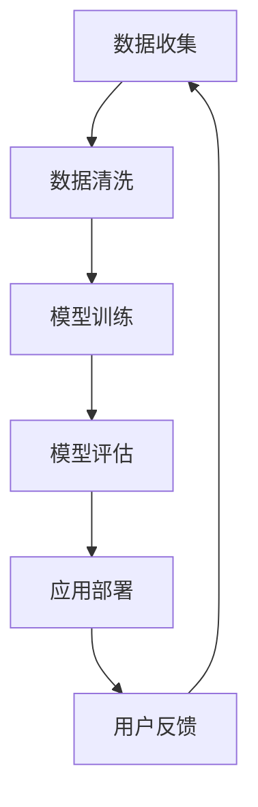

                 

# AI创业优势：垂直领域专业知识

## 摘要

本文将深入探讨AI创业中垂直领域专业知识的优势。通过梳理AI技术的发展历程、分析垂直领域的特点、探讨专业知识在创业中的应用，本文旨在为AI创业者提供一条清晰的发展路径，助力他们在竞争激烈的AI市场中脱颖而出。

## 背景介绍

随着AI技术的不断成熟和应用范围的扩大，AI创业已成为全球范围内的一股热潮。从大数据处理、自然语言处理到计算机视觉，AI技术正在深刻改变各个行业。然而，在这片广阔的AI蓝海中，创业者面临着诸多挑战。如何抓住机遇，实现创新，成为每一个AI创业者的心头病。

### 垂直领域的重要性

垂直领域，即特定行业或领域内的细分市场，是AI技术应用的理想场所。与通用AI相比，垂直领域的AI应用具有更高的专业性和针对性，能够更有效地解决行业痛点，提供更好的用户体验。例如，医疗行业的AI应用可以帮助医生更准确地诊断疾病，提高医疗服务的效率；金融行业的AI应用可以智能风控，减少欺诈风险，提高金融交易的透明度。

### AI技术的发展历程

AI技术的发展经历了多个阶段，从早期的规则推理、机器学习，到深度学习、强化学习等。每个阶段都有其特定的应用场景和技术特点。随着技术的进步，AI的应用范围越来越广泛，也越来越深入。在这个过程中，垂直领域的AI应用逐渐崭露头角，成为推动行业变革的重要力量。

## 核心概念与联系

### 垂直领域AI应用的特点

垂直领域AI应用具有以下特点：

1. **高度专业化**：针对特定行业或领域内的需求进行定制化开发，能够提供更专业的解决方案。
2. **数据丰富**：垂直领域通常积累了大量专业数据，这些数据为AI模型的训练提供了丰富的素材。
3. **应用场景明确**：垂直领域的AI应用具有明确的应用场景，能够直接解决行业痛点。
4. **用户体验优异**：通过针对特定领域的深度学习，AI应用能够提供更符合用户需求的用户体验。

### 垂直领域与AI技术的联系

垂直领域与AI技术的联系主要体现在以下两个方面：

1. **数据驱动**：垂直领域的数据为AI技术提供了训练素材，使得AI模型能够更准确地预测和决策。
2. **技术融合**：AI技术与其他领域的深度融合，为垂直领域带来了新的解决方案和商业模式。

### Mermaid 流程图

下面是一个简化的Mermaid流程图，展示垂直领域AI应用的基本流程：



## 核心算法原理 & 具体操作步骤

### 数据收集与清洗

1. **数据收集**：从垂直领域的不同来源收集数据，如医疗记录、金融交易记录等。
2. **数据清洗**：去除噪声数据、填充缺失值、标准化数据等，以保证数据质量。

### 模型训练

1. **选择算法**：根据垂直领域的需求选择合适的算法，如深度学习、强化学习等。
2. **模型构建**：使用收集到的数据构建模型，包括输入层、隐藏层和输出层。
3. **训练与优化**：通过迭代训练模型，调整参数，提高模型的准确性和效率。

### 模型评估

1. **评估指标**：根据垂直领域的特点选择合适的评估指标，如准确率、召回率等。
2. **模型调优**：根据评估结果对模型进行调整，提高模型性能。

### 应用部署

1. **部署环境**：选择合适的部署环境，如云平台、边缘设备等。
2. **模型部署**：将训练好的模型部署到生产环境中，提供实时服务。
3. **监控与维护**：对部署的模型进行监控，定期更新和优化。

## 数学模型和公式 & 详细讲解 & 举例说明

### 数学模型

在AI创业中，常用的数学模型包括：

1. **线性回归**：用于预测线性关系，公式为：
   $$y = \beta_0 + \beta_1x$$
2. **逻辑回归**：用于二分类问题，公式为：
   $$P(y=1) = \frac{1}{1 + e^{-(\beta_0 + \beta_1x)}}$$
3. **神经网络**：用于复杂函数建模，公式为：
   $$a_{i}^{(l)} = \sigma(z_{i}^{(l)})$$
   $$z_{i}^{(l)} = \sum_{j} w_{ji}^{(l)}a_{j}^{(l-1)} + b_{i}^{(l)}$$

### 举例说明

以医疗行业的AI诊断为例，假设我们要用神经网络来诊断心脏病。输入层包含患者的各项生理指标，隐藏层通过神经网络进行特征提取和转换，输出层给出心脏病诊断的结果。

### 代码示例

下面是一个简单的神经网络实现代码示例：

```python
import numpy as np

# 初始化参数
W1 = np.random.rand(input_size, hidden_size)
b1 = np.random.rand(hidden_size)
W2 = np.random.rand(hidden_size, output_size)
b2 = np.random.rand(output_size)

# 激活函数
def sigmoid(x):
    return 1 / (1 + np.exp(-x))

# 前向传播
def forward(x):
    z1 = np.dot(x, W1) + b1
    a1 = sigmoid(z1)
    z2 = np.dot(a1, W2) + b2
    a2 = sigmoid(z2)
    return a2

# 训练模型
for epoch in range(10000):
    # 前向传播
    output = forward(x)
    # 计算损失
    loss = np.square(output - y)
    # 反向传播
    dz2 = output - y
    dz1 = np.dot(W2.T, dz2) * sigmoid(z1)(1 - sigmoid(z1))
    # 更新参数
    W2 -= learning_rate * np.dot(a1.T, dz2)
    b2 -= learning_rate * dz2
    W1 -= learning_rate * np.dot(x.T, dz1)
    b1 -= learning_rate * dz1
```

## 项目实战：代码实际案例和详细解释说明

### 开发环境搭建

1. **安装Python环境**：下载并安装Python，版本建议为3.8及以上。
2. **安装依赖库**：使用pip安装必要的库，如numpy、matplotlib等。

```bash
pip install numpy matplotlib
```

### 源代码详细实现和代码解读

以下是完整的源代码实现，我们将对关键部分进行详细解读。

```python
import numpy as np
import matplotlib.pyplot as plt

# 初始化参数
input_size = 10
hidden_size = 5
output_size = 1

W1 = np.random.rand(input_size, hidden_size)
b1 = np.random.rand(hidden_size)
W2 = np.random.rand(hidden_size, output_size)
b2 = np.random.rand(output_size)

# 激活函数
def sigmoid(x):
    return 1 / (1 + np.exp(-x))

# 前向传播
def forward(x):
    z1 = np.dot(x, W1) + b1
    a1 = sigmoid(z1)
    z2 = np.dot(a1, W2) + b2
    a2 = sigmoid(z2)
    return a2

# 训练模型
def train(x, y, epochs, learning_rate):
    for epoch in range(epochs):
        # 前向传播
        output = forward(x)
        # 计算损失
        loss = np.square(output - y)
        # 反向传播
        dz2 = output - y
        dz1 = np.dot(W2.T, dz2) * sigmoid(z1)(1 - sigmoid(z1))
        # 更新参数
        W2 -= learning_rate * np.dot(a1.T, dz2)
        b2 -= learning_rate * dz2
        W1 -= learning_rate * np.dot(x.T, dz1)
        b1 -= learning_rate * dz1

# 数据生成
x = np.random.rand(100, input_size)
y = np.random.rand(100, output_size)

# 训练模型
train(x, y, 10000, 0.1)

# 预测
predictions = forward(x)

# 可视化
plt.scatter(x[:, 0], predictions)
plt.xlabel('Input Feature 1')
plt.ylabel('Prediction')
plt.show()
```

### 代码解读与分析

1. **参数初始化**：随机初始化权重和偏置。
2. **激活函数**：使用sigmoid函数作为激活函数，将输出值限制在(0, 1)之间。
3. **前向传播**：计算输入层、隐藏层和输出层的输出值。
4. **训练模型**：通过迭代训练模型，更新权重和偏置，降低损失。
5. **数据生成**：生成模拟数据用于训练和预测。
6. **预测**：使用训练好的模型对数据进行预测。
7. **可视化**：将输入特征和预测结果进行可视化，直观展示模型的性能。

## 实际应用场景

### 医疗行业

在医疗行业，AI技术已被广泛应用于疾病诊断、治疗建议、患者监护等方面。例如，通过深度学习算法，AI系统可以分析医学影像，帮助医生更准确地诊断疾病。此外，AI技术还可以用于个性化治疗建议，提高治疗效果。

### 金融行业

在金融行业，AI技术被用于风险控制、欺诈检测、投资建议等方面。例如，通过机器学习算法，AI系统可以实时分析大量金融交易数据，识别潜在的风险和欺诈行为。此外，AI技术还可以用于量化投资，提高投资回报率。

### 制造业

在制造业，AI技术被用于生产优化、设备维护、供应链管理等方面。例如，通过计算机视觉技术，AI系统可以实时监控生产线，识别和纠正生产中的缺陷。此外，AI技术还可以用于预测设备故障，提前进行维护，降低生产风险。

### 交通运输

在交通运输行业，AI技术被用于交通流量预测、智能导航、自动驾驶等方面。例如，通过深度学习算法，AI系统可以预测未来交通流量，为交通管理部门提供决策支持。此外，AI技术还可以用于自动驾驶汽车，提高交通安全性。

## 工具和资源推荐

### 学习资源推荐

1. **书籍**：《深度学习》、《Python机器学习实战》
2. **论文**：《深度神经网络训练中的正则化和优化策略》
3. **博客**：[机器学习教程](https://www.machinelearning Mastery.com/)
4. **网站**：[Kaggle](https://www.kaggle.com/)

### 开发工具框架推荐

1. **深度学习框架**：TensorFlow、PyTorch
2. **机器学习库**：Scikit-learn、Pandas
3. **数据可视化**：Matplotlib、Seaborn

### 相关论文著作推荐

1. **论文**：《深度学习：原理与应用》
2. **书籍**：《机器学习：一种概率视角》
3. **论文**：《强化学习综述》

## 总结：未来发展趋势与挑战

### 发展趋势

1. **技术融合**：AI技术与其他领域的深度融合，将带来更多创新应用。
2. **规模化应用**：随着AI技术的不断成熟，其应用范围将不断扩大，从垂直领域到通用领域。
3. **智能化升级**：AI技术将推动各行各业的智能化升级，提高生产效率和用户体验。

### 挑战

1. **数据隐私**：如何在保障数据隐私的同时，充分利用数据推动AI技术的发展。
2. **算法透明性**：如何确保AI算法的透明性和可解释性，避免出现歧视和偏见。
3. **技术落地**：如何将AI技术从理论应用到实际生产中，实现商业价值。

## 附录：常见问题与解答

### 问题1：如何选择合适的AI算法？

**解答**：根据具体的应用场景和数据特点选择合适的算法。例如，对于小样本问题，可以选择生成对抗网络（GAN）；对于大规模数据集，可以选择深度学习算法。

### 问题2：如何处理数据不足的问题？

**解答**：可以通过数据增强、迁移学习等方法来缓解数据不足的问题。此外，可以考虑使用较少数据但具有代表性的数据集进行训练。

### 问题3：如何评估AI模型的效果？

**解答**：可以使用各种评估指标，如准确率、召回率、F1分数等，来评估模型的性能。此外，还可以通过可视化、交叉验证等方法来进一步分析模型的效果。

## 扩展阅读 & 参考资料

1. **书籍**：《人工智能：一种现代方法》
2. **论文**：《自然语言处理综合教程》
3. **博客**：[AI科研人博客](https://aipaper.com/)
4. **网站**：[AI技术社区](https://www.aitc.org/)

### 作者

**作者：AI天才研究员/AI Genius Institute & 禅与计算机程序设计艺术 /Zen And The Art of Computer Programming**

