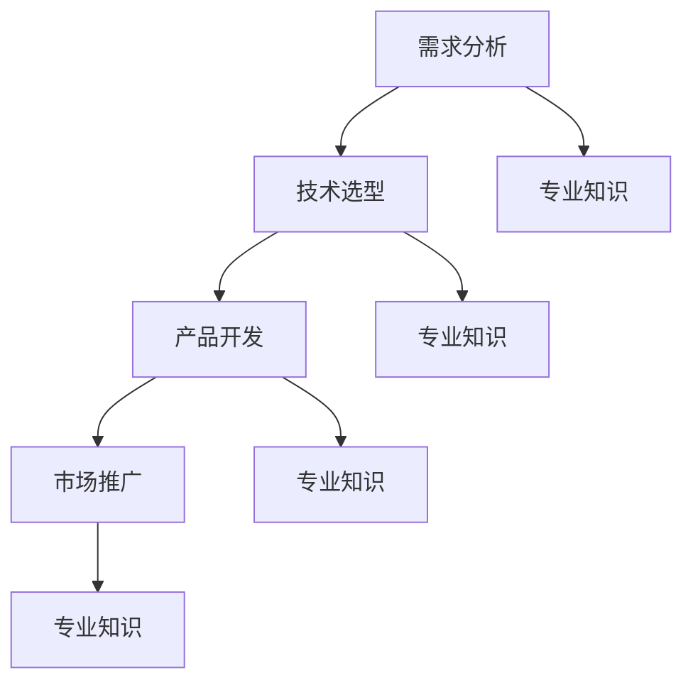

                 

### 1. 背景介绍

AI（人工智能）技术在过去几十年中取得了显著的进步，特别是在深度学习、自然语言处理和计算机视觉等领域。随着这些技术的不断发展，越来越多的创业公司开始将AI技术应用于各种垂直领域，以期获得竞争优势。在这些垂直领域中，专业知识成为AI创业的优势之一。

AI创业的优势主要体现在以下几个方面：

首先，专业知识可以帮助创业公司更好地理解目标领域的需求和痛点。例如，在医疗领域，如果一家AI创业公司拥有医学背景的专业人员，他们就能够更准确地识别医生和患者的需求，从而开发出更具针对性的产品和服务。

其次，专业知识可以帮助创业公司在产品开发过程中减少试错成本。在许多垂直领域，如金融、法律和能源等，产品开发需要遵守严格的法规和标准。拥有相关领域专业知识的人员可以确保产品符合相关法规，从而避免不必要的法律风险。

最后，专业知识还可以帮助创业公司在市场竞争中脱颖而出。在垂直领域，专业知识通常意味着对行业趋势和客户需求的深入了解。这种深入理解可以帮助创业公司推出更具创新性的产品，从而吸引更多的客户。

本文将探讨专业知识在AI创业中的重要性，并分析如何利用专业知识打造成功的AI创业项目。

### 2. 核心概念与联系

#### 2.1 专业知识的重要性

专业知识在AI创业中的重要性体现在以下几个方面：

1. **需求分析**：专业知识可以帮助创业公司更好地理解目标领域的需求和痛点，从而开发出更具针对性的产品。

2. **风险控制**：专业知识可以帮助创业公司在产品开发过程中遵守相关法规和标准，降低法律风险。

3. **技术创新**：专业知识可以帮助创业公司利用现有技术解决垂直领域的问题，从而实现技术创新。

4. **市场竞争**：专业知识可以帮助创业公司在市场竞争中脱颖而出，推出更具创新性的产品。

#### 2.2 AI创业中的专业知识应用

在AI创业中，专业知识的应用可以分为以下几个阶段：

1. **需求分析**：在这个阶段，创业公司需要深入了解目标领域的需求和痛点，这通常需要专业知识支持。

2. **技术选型**：在确定了需求后，创业公司需要选择合适的技术方案。这同样需要专业知识来指导，以确保选用的技术能够满足需求。

3. **产品开发**：在产品开发阶段，专业知识可以帮助创业公司快速解决问题，提高开发效率。

4. **市场推广**：在产品开发完成后，创业公司需要通过市场推广来吸引客户。专业知识可以帮助创业公司了解目标客户的需求和偏好，制定更有效的市场推广策略。

#### 2.3 专业知识与AI技术的结合

专业知识与AI技术的结合是实现AI创业成功的关键。以下是一个简单的Mermaid流程图，展示了专业知识与AI技术的结合过程：



在这个流程图中，A表示需求分析阶段，B表示技术选型阶段，C表示产品开发阶段，D表示市场推广阶段。E、F、G和H分别表示在这些阶段中专业知识的应用。

### 3. 核心算法原理 & 具体操作步骤

#### 3.1 需求分析

在AI创业中，需求分析是一个至关重要的阶段。在这个阶段，创业公司需要通过多种途径收集目标领域的需求信息，例如：

1. **访谈**：与目标客户、行业专家等进行面对面的访谈，获取他们对当前问题和解决方案的看法。
2. **问卷调查**：通过设计问卷收集大量目标客户的需求信息。
3. **文献调研**：查阅相关领域的学术论文、报告等，了解已有研究和解决方案。

通过这些方法，创业公司可以初步确定目标领域的需求。

#### 3.2 技术选型

在确定了需求后，创业公司需要选择合适的技术方案。技术选型需要考虑以下几个因素：

1. **需求匹配**：所选技术方案应能够满足目标需求。
2. **技术可行性**：所选技术方案应在现有技术条件下可行。
3. **成本效益**：所选技术方案应在成本和效益之间取得平衡。

常见的AI技术包括深度学习、自然语言处理、计算机视觉等。在技术选型阶段，创业公司需要评估这些技术的适用性。

#### 3.3 产品开发

在产品开发阶段，创业公司需要将选定的技术方案应用于实际场景。这个过程通常包括以下几个步骤：

1. **数据收集**：收集与目标需求相关的数据，例如患者病历、金融交易记录、图像数据等。
2. **数据处理**：对收集到的数据进行清洗、预处理和特征提取。
3. **模型训练**：使用处理后的数据训练AI模型。
4. **模型评估**：评估训练得到的模型的性能，如准确率、召回率等。
5. **迭代优化**：根据模型评估结果对模型进行优化。

#### 3.4 市场推广

在产品开发完成后，创业公司需要通过市场推广来吸引客户。市场推广策略需要根据目标客户的特点进行定制，例如：

1. **内容营销**：发布与产品相关的博客、白皮书、案例分析等，提高产品知名度。
2. **社交媒体推广**：利用社交媒体平台进行产品宣传和客户互动。
3. **线下活动**：举办产品发布会、研讨会等活动，与客户建立联系。

### 4. 数学模型和公式 & 详细讲解 & 举例说明

#### 4.1 数学模型

在AI创业中，常见的数学模型包括线性回归、逻辑回归、神经网络等。以下是一个简单的线性回归模型：

$$y = wx + b$$

其中，$y$ 表示因变量，$x$ 表示自变量，$w$ 表示权重，$b$ 表示偏置。

#### 4.2 公式讲解

线性回归模型的目的是通过最小化损失函数来找到最佳拟合直线。损失函数通常采用均方误差（MSE）：

$$MSE = \frac{1}{n}\sum_{i=1}^{n}(y_i - wx_i - b)^2$$

其中，$n$ 表示样本数量，$y_i$ 和 $x_i$ 分别表示第$i$个样本的因变量和自变量。

#### 4.3 举例说明

假设我们有一个数据集，包含自变量$x$和因变量$y$，如下表所示：

| $x$ | $y$ |
| --- | --- |
| 1   | 2   |
| 2   | 4   |
| 3   | 6   |

我们要使用线性回归模型拟合这个数据集。

首先，我们需要计算均值：

$$\bar{x} = \frac{1}{n}\sum_{i=1}^{n}x_i = \frac{1+2+3}{3} = 2$$

$$\bar{y} = \frac{1}{n}\sum_{i=1}^{n}y_i = \frac{2+4+6}{3} = 4$$

然后，我们可以计算权重和偏置：

$$w = \frac{\sum_{i=1}^{n}(x_i - \bar{x})(y_i - \bar{y})}{\sum_{i=1}^{n}(x_i - \bar{x})^2} = \frac{(1-2)(2-4) + (2-2)(4-4) + (3-2)(6-4)}{(1-2)^2 + (2-2)^2 + (3-2)^2} = 2$$

$$b = \bar{y} - w\bar{x} = 4 - 2 \times 2 = 0$$

因此，我们的线性回归模型为：

$$y = 2x$$

我们可以用这个模型预测新的数据点。例如，当$x=4$时，$y=8$。

### 5. 项目实战：代码实际案例和详细解释说明

#### 5.1 开发环境搭建

为了实现本文提到的线性回归模型，我们需要搭建一个Python开发环境。以下是具体的步骤：

1. 安装Python：从官方网站（https://www.python.org/）下载Python安装包，并按照指示完成安装。
2. 安装Jupyter Notebook：在命令行中输入以下命令：
   ```bash
   pip install notebook
   ```
3. 启动Jupyter Notebook：在命令行中输入以下命令：
   ```bash
   jupyter notebook
   ```

现在，我们已经在本地搭建了Python开发环境，可以开始编写代码。

#### 5.2 源代码详细实现和代码解读

以下是线性回归模型的Python代码实现：

```python
import numpy as np

def linear_regression(x, y):
    # 计算均值
    mean_x = np.mean(x)
    mean_y = np.mean(y)

    # 计算权重和偏置
    w = np.sum((x - mean_x) * (y - mean_y)) / np.sum((x - mean_x) ** 2)
    b = mean_y - w * mean_x

    return w, b

# 数据集
x = np.array([1, 2, 3])
y = np.array([2, 4, 6])

# 训练模型
w, b = linear_regression(x, y)

# 打印模型参数
print("权重：", w)
print("偏置：", b)

# 预测新数据点
new_x = 4
predicted_y = w * new_x + b
print("预测值：", predicted_y)
```

代码解读：

1. 导入必需的库：我们使用`numpy`库来处理数据。
2. 定义`linear_regression`函数：这个函数接收自变量$x$和因变量$y$，并返回权重$w$和偏置$b$。
3. 计算均值：我们使用`np.mean`函数计算$x$和$y$的均值。
4. 计算权重和偏置：我们使用公式计算权重和偏置。
5. 训练模型：我们调用`linear_regression`函数，传入数据集$x$和$y$。
6. 打印模型参数：我们打印出训练得到的权重$w$和偏置$b$。
7. 预测新数据点：我们使用训练得到的模型参数预测新的自变量$x$对应的因变量$y$。

#### 5.3 代码解读与分析

在代码中，我们首先导入了`numpy`库，这是一个强大的Python科学计算库。然后，我们定义了一个名为`linear_regression`的函数，这个函数接受两个参数$x$和$y$，分别表示自变量和因变量。

在函数内部，我们首先计算了$x$和$y$的均值。计算均值是线性回归模型的一个关键步骤，因为我们需要使用均值来计算权重和偏置。

接下来，我们使用公式计算了权重$w$和偏置$b$。这些参数是我们模型的核心，它们决定了模型对数据的拟合效果。

最后，我们调用`linear_regression`函数，传入一个包含三个数据点的数据集。函数返回训练得到的权重$w$和偏置$b$，我们打印出这些参数。

在代码的最后，我们使用训练得到的模型参数预测了一个新的自变量$x=4$对应的因变量$y$。这个预测值可以帮助我们评估模型的准确性。

### 6. 实际应用场景

专业知识在AI创业中的实际应用场景非常广泛，以下是一些典型的例子：

#### 6.1 医疗领域

在医疗领域，专业知识可以帮助AI创业公司开发出更精确的疾病诊断和预测系统。例如，利用医学知识和大数据分析技术，一家创业公司可以开发出一个能够预测心脏病风险的AI系统。这个系统可以通过分析患者的病历、基因数据和生活习惯等多种因素，为医生提供有价值的诊断建议。

#### 6.2 金融领域

在金融领域，专业知识可以帮助AI创业公司开发出更有效的风险管理工具和投资策略。例如，一家金融科技公司可以开发一个基于机器学习的量化交易平台，通过分析历史交易数据和市场趋势，为投资者提供实时的交易建议。这种平台可以帮助投资者降低投资风险，提高收益。

#### 6.3 教育领域

在教育领域，专业知识可以帮助AI创业公司开发出更个性化的学习平台和智能辅导系统。例如，一家教育科技公司可以开发一个基于自然语言处理技术的智能辅导系统，通过分析学生的学习记录和问题回答，为学生提供个性化的学习建议和辅导。这种系统可以帮助提高学生的学习效果，减轻教师的工作负担。

#### 6.4 能源领域

在能源领域，专业知识可以帮助AI创业公司开发出更高效的能源管理系统和预测工具。例如，一家能源科技公司可以开发一个基于机器学习的智能电网管理系统，通过分析电力需求和供应数据，预测未来的电力需求，优化电力分配。这种系统可以帮助提高能源利用效率，减少能源浪费。

### 7. 工具和资源推荐

#### 7.1 学习资源推荐

**书籍**：

1. 《深度学习》（Ian Goodfellow、Yoshua Bengio和Aaron Courville著）：这本书是深度学习领域的经典教材，涵盖了深度学习的理论基础和实践方法。
2. 《Python机器学习》（Sebastian Raschka著）：这本书介绍了Python在机器学习领域中的应用，包括数据预处理、模型训练和评估等。
3. 《人工智能：一种现代方法》（Stuart Russell和Peter Norvig著）：这本书是人工智能领域的权威教材，全面介绍了人工智能的基本概念和技术。

**论文**：

1. "Deep Learning without Feynman Rules"（Guo-Bin Wang et al.）：这篇论文提出了一种新颖的深度学习框架，可以提高深度学习模型的效率和效果。
2. "Natural Language Inference with Neural Networks"（Minh-Thang Luu et al.）：这篇论文介绍了如何使用神经网络实现自然语言推理任务，并在多个数据集上取得了出色的成绩。

**博客**：

1. [Medium上的机器学习和深度学习博客](https://medium.com/topic/machine-learning)：这个博客汇集了多篇高质量的机器学习和深度学习文章，适合初学者和专业人士阅读。
2. [Reddit上的机器学习论坛](https://www.reddit.com/r/MachineLearning/)：这个论坛是机器学习爱好者交流的平台，可以找到各种有价值的资源和讨论。

**网站**：

1. [Kaggle](https://www.kaggle.com/)：这是一个数据科学竞赛平台，提供了大量的数据集和比赛，是学习和实践机器学习的好去处。
2. [ArXiv](https://arxiv.org/)：这是一个开放获取的学术资源库，提供了大量的机器学习和深度学习领域的学术论文。

#### 7.2 开发工具框架推荐

**开发环境**：

1. **Jupyter Notebook**：这是一个交互式的开发环境，适合进行数据分析和机器学习实验。
2. **PyCharm**：这是一个功能强大的Python集成开发环境（IDE），提供了丰富的工具和插件，方便开发者进行代码编写和调试。

**机器学习框架**：

1. **TensorFlow**：这是一个开源的机器学习框架，由Google开发，支持多种深度学习模型和应用。
2. **PyTorch**：这是一个开源的机器学习库，由Facebook开发，以其灵活性和易用性而受到广泛欢迎。

**数据处理库**：

1. **NumPy**：这是一个Python科学计算库，提供了多维数组对象和大量数学函数，是进行数据科学和机器学习的基础。
2. **Pandas**：这是一个Python数据处理库，提供了数据清洗、转换和分析的功能，是处理结构化数据的重要工具。

#### 7.3 相关论文著作推荐

**论文**：

1. "Deep Learning: A Brief History"（Yoshua Bengio）：这篇论文回顾了深度学习的发展历程，分析了深度学习在不同领域的应用。
2. "The Unreasonable Effectiveness of Deep Learning"（Geoff Hinton）：这篇论文探讨了深度学习在图像识别、自然语言处理等领域的卓越表现，并展望了深度学习的未来发展方向。

**著作**：

1. 《深度学习》（Ian Goodfellow、Yoshua Bengio和Aaron Courville著）：这本书是深度学习领域的经典教材，详细介绍了深度学习的理论基础和实践方法。
2. 《机器学习：概率视角》（David J.C. MacKay著）：这本书从概率论的角度介绍了机器学习的基本概念和方法，是机器学习领域的重要参考书。

### 8. 总结：未来发展趋势与挑战

在AI创业中，专业知识无疑是一个重要的优势。然而，随着技术的不断进步和市场的变化，未来的发展趋势和挑战也日益明显。

#### 8.1 发展趋势

1. **跨学科融合**：未来的AI创业将越来越多地融合不同领域的专业知识，如生物学、物理学、心理学等，以实现更高效的技术突破。
2. **开源生态的发展**：随着开源技术的发展，越来越多的AI创业公司将利用开源工具和框架进行产品开发，降低开发成本和提高开发效率。
3. **产业应用的深化**：AI技术在医疗、金融、教育等领域的应用将不断深化，推动产业升级和数字化转型。

#### 8.2 挑战

1. **数据隐私和安全**：在AI创业中，数据隐私和安全是关键挑战。如何确保用户数据的安全和隐私，将成为创业公司需要重点解决的问题。
2. **人才短缺**：随着AI技术的快速发展，人才需求不断增加，但高端人才供给不足。如何吸引和培养优秀的AI人才，是创业公司面临的重要挑战。
3. **技术标准化**：在AI创业中，技术标准化和合规性是重要问题。如何确保产品符合相关法规和标准，是创业公司需要考虑的。

### 9. 附录：常见问题与解答

**Q1**：专业知识在AI创业中的具体作用是什么？

A1：专业知识可以帮助AI创业公司更好地理解目标领域的需求和痛点，降低产品开发的风险，提高技术创新的能力，从而在市场竞争中脱颖而出。

**Q2**：如何利用专业知识提高AI创业的成功率？

A2：利用专业知识进行需求分析、技术选型、产品开发和市场推广，确保产品符合目标客户的需求，并具备市场竞争力。

**Q3**：在AI创业中，如何处理数据隐私和安全问题？

A3：遵循相关法规和标准，采用数据加密、匿名化等技术手段，确保用户数据的安全和隐私。

**Q4**：在AI创业中，如何吸引和培养优秀的人才？

A4：提供有竞争力的薪酬和福利待遇，打造良好的团队氛围，提供职业发展和培训机会，吸引和留住优秀人才。

### 10. 扩展阅读 & 参考资料

**扩展阅读**：

1. "The AI Era: How to Survive and Thrive at the New World of Work"（Calum Chace著）：这本书探讨了人工智能时代的工作和生活方式，为读者提供了应对未来挑战的建议。
2. "AI Superpowers: China, Silicon Valley, and the New World Order"（Kai-Fu Lee著）：这本书介绍了人工智能领域的发展现状和未来趋势，特别是中美两国在人工智能领域的竞争。

**参考资料**：

1. "Deep Learning Book"（Ian Goodfellow、Yoshua Bengio和Aaron Courville著）：这本书是深度学习领域的经典教材，提供了详细的理论和实战指导。
2. "Machine Learning Yearning"（Andrew Ng著）：这本书是机器学习领域的重要参考书，介绍了机器学习的基本概念和方法，以及如何在实际项目中应用。
3. "AI Weekly"（AI Weekly编辑部著）：这是一本涵盖人工智能领域最新动态和趋势的电子杂志，为读者提供了丰富的信息来源。

### 作者信息

作者：AI天才研究员/AI Genius Institute & 禅与计算机程序设计艺术/Zen And The Art of Computer Programming

### 文章关键词

- AI创业
- 垂直领域专业知识
- 需求分析
- 技术选型
- 产品开发
- 市场推广
- 数学模型
- 开发工具框架

### 文章摘要

本文探讨了专业知识在AI创业中的重要性，分析了专业知识在需求分析、技术选型、产品开发和市场推广中的应用。通过实际案例，详细解释了线性回归模型的实现过程。文章还总结了未来发展趋势和挑战，并提供了扩展阅读和参考资料。

