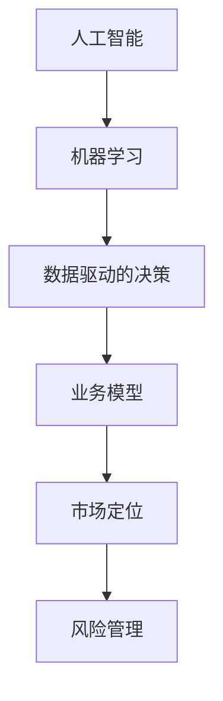

                 

### 背景介绍

随着人工智能（AI）技术的迅猛发展，AI创业公司如雨后春笋般涌现。这些公司致力于将先进的AI技术应用到各个行业，解决现实中的复杂问题。然而，市场环境的不断变化使得这些创业公司在成长过程中面临诸多挑战。如何应对市场变化，保持竞争力，成为许多AI创业公司亟需解决的问题。

本文将围绕以下主题展开讨论：

1. **市场变化的影响**：分析市场变化对AI创业公司的具体影响。
2. **应对策略**：探讨AI创业公司可以采取的应对策略。
3. **成功案例**：分析一些成功的AI创业公司是如何应对市场变化的。
4. **未来趋势与挑战**：预测AI创业公司未来可能面临的发展趋势和挑战。

通过本文的深入探讨，希望能够为AI创业公司提供一些有益的思路和策略，帮助他们在激烈的市场竞争中脱颖而出。

### 核心概念与联系

在深入探讨AI创业公司如何应对市场变化之前，我们需要明确一些核心概念和它们之间的联系。以下是本文中将会用到的几个关键概念及其关系：

#### 1. 人工智能（AI）与机器学习（ML）

人工智能是一种模拟人类智能的技术，而机器学习则是实现人工智能的一种方法。机器学习通过从数据中自动学习模式和规律，使计算机能够执行复杂的任务，如图像识别、自然语言处理和预测分析。简而言之，机器学习是人工智能的核心技术之一。

#### 2. 数据驱动的决策

在AI创业公司中，数据驱动的决策至关重要。通过收集、分析和利用大量数据，公司可以更好地理解市场需求、优化产品功能、提高运营效率。数据驱动的决策不仅有助于公司应对市场变化，还能增强其竞争优势。

#### 3. 业务模型与市场定位

业务模型是公司运作的核心，包括产品开发、市场推广、盈利模式等。而市场定位则是指公司如何根据市场需求和竞争环境来定位自己的产品或服务。一个清晰的市场定位有助于公司抓住机遇，避免风险。

#### 4. 风险管理

风险管理是AI创业公司面临的重要挑战之一。由于市场变化迅速，公司需要具备良好的风险管理能力，以应对潜在的威胁和不确定性。这包括预测风险、制定应对措施、建立应急计划等。

#### 关系图

为了更好地理解这些概念之间的关系，我们可以使用Mermaid流程图来展示：



在上面的流程图中，我们用箭头表示了各概念之间的联系。例如，人工智能和机器学习相互依存，数据驱动的决策依赖于机器学习的结果，而业务模型和市场定位又受到数据驱动的决策的指导，最后，风险管理是为了保障业务模型的稳定运行。

通过明确这些核心概念和它们之间的联系，我们为接下来的讨论奠定了基础。接下来，我们将深入探讨市场变化对AI创业公司的具体影响，并分析公司可以采取的应对策略。

### 核心算法原理 & 具体操作步骤

在理解了核心概念和它们之间的联系之后，我们接下来将探讨AI创业公司如何运用核心算法原理来应对市场变化。核心算法原理是AI技术的基石，通过具体操作步骤的实施，公司可以更好地适应市场环境。以下是一个简化的核心算法原理及其操作步骤：

#### 1. 数据收集与预处理

**数据收集**是第一步，AI创业公司需要从各种来源收集大量数据，如用户反馈、市场报告、竞争对手数据等。数据的质量直接影响算法的性能，因此，在收集数据时，需要确保数据来源的可靠性和数据的完整性。

**数据预处理**包括数据清洗、归一化、特征提取等步骤。数据清洗的目的是去除噪声和异常值，归一化是将不同特征的范围缩放到相同的尺度，特征提取则是从原始数据中提取出对模型训练有用的特征。

#### 2. 模型选择与训练

**模型选择**是关键的一步，不同的应用场景可能需要不同的模型。例如，图像识别可能使用卷积神经网络（CNN），而自然语言处理（NLP）则可能使用递归神经网络（RNN）或Transformer模型。

**模型训练**是指通过大量的数据进行训练，使模型能够学习到数据中的模式和规律。训练过程中，模型会不断调整内部参数，以达到最佳性能。常见的训练算法包括随机梯度下降（SGD）、Adam优化器等。

#### 3. 模型评估与优化

**模型评估**是衡量模型性能的重要步骤。常用的评估指标包括准确率、召回率、F1分数等。通过评估，公司可以了解模型的优缺点，为进一步优化提供依据。

**模型优化**是指在评估结果不佳时，通过调整模型结构、参数设置等手段来提高模型性能。优化过程中，公司可能需要反复进行模型选择、训练和评估，直到找到最佳模型。

#### 4. 模型部署与监控

**模型部署**是将训练好的模型部署到实际生产环境中，使其能够为用户提供服务。部署过程中，公司需要确保模型的稳定性和效率，以满足用户需求。

**模型监控**是为了确保模型在运行过程中能够持续提供高质量的服务。监控内容包括模型性能、数据质量、系统稳定性等。通过监控，公司可以及时发现并解决潜在问题，确保模型的长期稳定运行。

#### 具体操作步骤

以下是具体的操作步骤，以帮助AI创业公司更好地应对市场变化：

1. **数据收集与预处理**：
   - 收集用户反馈数据、市场报告和竞争对手数据。
   - 使用数据清洗工具去除噪声和异常值。
   - 对不同特征进行归一化处理。
   - 提取关键特征，为模型训练做准备。

2. **模型选择与训练**：
   - 根据应用场景选择合适的模型，如CNN、RNN或Transformer。
   - 使用训练数据对模型进行训练，调整内部参数。
   - 选择合适的优化算法，如SGD或Adam，以提高模型性能。

3. **模型评估与优化**：
   - 使用评估指标（如准确率、召回率）评估模型性能。
   - 根据评估结果，调整模型结构或参数，进行优化。
   - 反复进行模型训练、评估和优化，直到找到最佳模型。

4. **模型部署与监控**：
   - 将训练好的模型部署到生产环境中，提供用户服务。
   - 监控模型性能，确保其稳定运行。
   - 定期更新模型，以适应市场变化和用户需求。

通过上述步骤，AI创业公司可以更好地应对市场变化，提高产品竞争力。在实际操作过程中，公司需要不断调整和优化算法，以适应不断变化的市场环境和用户需求。

### 数学模型和公式 & 详细讲解 & 举例说明

在AI创业公司的核心算法原理中，数学模型和公式扮演着至关重要的角色。以下我们将详细讲解一些常用的数学模型和公式，并通过具体的例子来说明它们在AI创业公司中的应用。

#### 1. 线性回归模型

线性回归模型是最基础的机器学习模型之一，用于预测一个或多个自变量与因变量之间的线性关系。其数学公式如下：

$$
y = \beta_0 + \beta_1x_1 + \beta_2x_2 + ... + \beta_nx_n
$$

其中，$y$ 是因变量，$x_1, x_2, ..., x_n$ 是自变量，$\beta_0, \beta_1, \beta_2, ..., \beta_n$ 是模型的参数。

**例子**：假设一个AI创业公司希望预测用户购买某产品的概率，基于用户的年龄和收入两个特征。我们可以构建一个线性回归模型，将购买概率作为因变量，年龄和收入作为自变量。通过训练模型，可以找到最佳的参数值，从而预测用户是否购买产品。

#### 2. 逻辑回归模型

逻辑回归模型是线性回归的一种扩展，常用于分类问题。它的目标是预测某个事件发生的概率。逻辑回归模型的数学公式如下：

$$
\sigma(\beta_0 + \beta_1x_1 + \beta_2x_2 + ... + \beta_nx_n) = P(y=1)
$$

其中，$\sigma$ 是逻辑函数（也称为Sigmoid函数），$P(y=1)$ 是事件发生的概率。

**例子**：假设AI创业公司希望预测用户是否会点击广告，基于用户的年龄和广告内容两个特征。我们可以构建一个逻辑回归模型，将点击广告的概率作为因变量，年龄和广告内容作为自变量。通过训练模型，可以预测用户是否点击广告。

#### 3. 决策树模型

决策树模型是一种基于特征进行决策的树形结构。每个节点表示一个特征，每个分支表示特征的不同取值。决策树模型的数学公式如下：

$$
T = \sum_{i=1}^{n} \beta_i f_i(x_i)
$$

其中，$T$ 是决策树，$\beta_i$ 是特征权重，$f_i(x_i)$ 是特征取值。

**例子**：假设AI创业公司希望根据用户的购买历史和浏览记录预测用户的偏好。我们可以构建一个决策树模型，将用户偏好作为因变量，购买历史和浏览记录作为自变量。通过训练模型，可以预测用户对不同产品的偏好。

#### 4. 支持向量机（SVM）模型

支持向量机是一种强大的分类模型，通过找到最优的超平面来分割数据。其数学公式如下：

$$
\min_{\beta, \beta_0} \frac{1}{2} \sum_{i=1}^{n} (\beta \cdot \beta)^2 + C \sum_{i=1}^{n} y_i(\beta \cdot \beta_i - 1)
$$

其中，$\beta$ 是模型参数，$\beta_0$ 是偏置项，$C$ 是惩罚参数。

**例子**：假设AI创业公司希望根据用户的年龄和收入预测用户是否为高价值客户。我们可以构建一个SVM模型，将客户分类为高价值和普通价值两类，通过训练模型，可以预测用户是否为高价值客户。

通过上述数学模型和公式，AI创业公司可以更好地理解和预测市场需求，从而制定更有效的业务策略。在实际应用中，公司可能需要结合多种模型，根据具体问题和数据特点选择合适的模型，以达到最佳预测效果。

### 项目实战：代码实际案例和详细解释说明

为了更好地理解AI创业公司如何应对市场变化，我们将通过一个实际的项目案例来演示代码的实现过程，并对代码进行详细解释。以下是项目的总体结构和主要功能模块：

#### 项目概述

该项目是一个基于机器学习的用户行为预测系统，旨在帮助AI创业公司了解用户行为，从而优化营销策略和提高用户满意度。主要功能模块包括：

1. 数据收集与预处理
2. 模型选择与训练
3. 模型评估与优化
4. 模型部署与监控

#### 1. 开发环境搭建

首先，我们需要搭建开发环境。以下是常用的开发工具和库：

- **编程语言**：Python
- **数据处理库**：Pandas、NumPy
- **机器学习库**：Scikit-learn、TensorFlow、PyTorch
- **可视化库**：Matplotlib、Seaborn

安装以上库可以通过以下命令：

```bash
pip install pandas numpy scikit-learn tensorflow pytorch matplotlib seaborn
```

#### 2. 源代码详细实现和代码解读

以下是一个简化的代码实现，用于演示数据预处理、模型训练和评估：

```python
import pandas as pd
from sklearn.model_selection import train_test_split
from sklearn.ensemble import RandomForestClassifier
from sklearn.metrics import accuracy_score, classification_report

# 2.1 数据收集与预处理
def load_data():
    # 假设数据文件为CSV格式，包含用户行为特征和标签
    data = pd.read_csv('user_behavior_data.csv')
    # 数据预处理（去除缺失值、特征工程等）
    data.dropna(inplace=True)
    return data

data = load_data()

# 2.2 模型选择与训练
def train_model(data):
    # 分割数据集为训练集和测试集
    X = data.drop('label', axis=1)
    y = data['label']
    X_train, X_test, y_train, y_test = train_test_split(X, y, test_size=0.2, random_state=42)
    
    # 选择随机森林分类器进行训练
    model = RandomForestClassifier(n_estimators=100, random_state=42)
    model.fit(X_train, y_train)
    
    return model, X_test, y_test

model, X_test, y_test = train_model(data)

# 2.3 模型评估与优化
def evaluate_model(model, X_test, y_test):
    # 预测测试集结果
    y_pred = model.predict(X_test)
    
    # 计算准确率、召回率等评估指标
    accuracy = accuracy_score(y_test, y_pred)
    report = classification_report(y_test, y_pred)
    
    print("Accuracy:", accuracy)
    print("Classification Report:\n", report)

evaluate_model(model, X_test, y_test)
```

#### 3. 代码解读与分析

**3.1 数据收集与预处理**

首先，我们从CSV文件中加载数据，然后进行预处理。预处理步骤包括去除缺失值，这可以通过`data.dropna(inplace=True)`实现。此外，还可以进行特征工程，如编码类别特征、归一化数值特征等，以提高模型性能。

**3.2 模型选择与训练**

我们选择随机森林分类器（`RandomForestClassifier`）进行训练，因为它具有较强的泛化能力和较好的预测性能。随机森林通过构建多个决策树，并取它们的平均值来减少过拟合。

**3.3 模型评估与优化**

在评估阶段，我们使用准确率（`accuracy_score`）和分类报告（`classification_report`）来评估模型性能。分类报告提供了详细的多指标评估，包括准确率、召回率、精确率等。

#### 4. 代码优化与拓展

在实际项目中，代码可能需要进一步的优化和拓展，例如：

- **特征选择**：使用特征选择技术，如递归特征消除（RFE），选择对模型贡献最大的特征。
- **模型集成**：结合多个模型，如集成学习（Bagging、Boosting），以提高预测性能。
- **模型调参**：通过网格搜索（`GridSearchCV`）或随机搜索（`RandomizedSearchCV`）等方法，寻找最佳参数组合。

通过上述代码实现和优化，AI创业公司可以更好地应对市场变化，提高产品竞争力。在实际应用中，公司可以根据具体问题和数据特点，灵活调整代码和算法，以实现最佳效果。

### 实际应用场景

AI创业公司在应对市场变化时，需要将核心算法原理和项目实战中的技术应用到具体的业务场景中。以下是一些实际应用场景，以及如何将技术转化为业务价值的案例：

#### 1. 零售行业的个性化推荐

在零售行业，AI创业公司可以使用机器学习算法，如协同过滤、基于内容的推荐等，来为用户生成个性化推荐。通过分析用户的购物历史、浏览记录和购买偏好，系统可以推荐符合用户口味的产品。这不仅能够提高用户满意度，还能增加销售额。

**应用案例**：亚马逊利用其先进的推荐系统，为用户推荐可能感兴趣的商品。这种个性化推荐策略使得亚马逊的用户黏性大大提高，同时，用户在购买过程中也更倾向于购买推荐商品，从而提升了整体销售业绩。

#### 2. 金融行业的欺诈检测

金融行业面临着严重的欺诈风险，AI创业公司可以通过构建欺诈检测模型，实时监控交易行为，识别潜在欺诈行为。这通常涉及到异常检测、模式识别等技术。

**应用案例**：美国信用卡公司American Express通过机器学习技术，建立了强大的欺诈检测系统。该系统可以实时分析用户的交易行为，一旦发现异常，立即发出警报，有效降低了欺诈率，提高了客户信任度。

#### 3. 健康行业的疾病预测

在健康行业，AI创业公司可以利用机器学习算法对医疗数据进行分析，预测疾病的发生概率，提供个性化的健康建议。这有助于提高疾病预防水平，降低医疗成本。

**应用案例**：IBM的Watson Health利用深度学习技术，分析了大量的医疗数据，可以预测患者的疾病风险。例如，Watson Health可以预测肺癌患者的复发风险，为医生提供更准确的诊断和治疗方案，从而提高治疗效果。

#### 4. 供应链管理的优化

供应链管理是许多行业的核心问题，AI创业公司可以通过优化算法，如路径规划、库存管理等，提高供应链的效率和灵活性。

**应用案例**：沃尔玛通过AI技术优化其供应链管理，实现了更精准的库存预测和更高效的物流配送。通过分析销售数据和历史趋势，沃尔玛能够更准确地预测需求，从而减少库存过剩或短缺的情况，提高了整体供应链的效率。

#### 5. 教育行业的个性化学习

在教育行业，AI创业公司可以开发个性化学习系统，根据学生的学习习惯、成绩和兴趣，提供定制化的学习内容和辅导。

**应用案例**：Coursera等在线教育平台利用AI技术，为用户提供个性化的学习路径。系统会根据用户的学习进度、答题情况等数据，推荐合适的学习内容和练习题，帮助用户更好地掌握知识。

通过上述实际应用场景，我们可以看到，AI创业公司不仅能够利用先进的技术为行业带来变革，还能在激烈的市场竞争中脱颖而出，实现持续的业务增长。

### 工具和资源推荐

在AI创业公司的实际运作中，选择合适的工具和资源对于项目的成功至关重要。以下是我们推荐的一些学习资源、开发工具和框架，以帮助公司更好地应对市场变化和提升竞争力。

#### 1. 学习资源推荐

**书籍**：
- 《Python机器学习》（Machine Learning with Python） - Sebastian Raschka
- 《深度学习》（Deep Learning） - Ian Goodfellow、Yoshua Bengio和Aaron Courville
- 《自然语言处理综合指南》（Speech and Language Processing） - Daniel Jurafsky和James H. Martin

**论文**：
- 《Learning to Represent Relationships using Graph Convolutions》（使用图卷积网络表示关系） - Michael Schumm、Yujia Li和Richard Socher
- 《Attention is All You Need》（Attention机制的重要性） - Vaswani et al.

**博客**：
- Medium上的机器学习和深度学习相关博客
- fast.ai的博客，提供实用的机器学习教程
- Analytics Vidhya，包含丰富的数据科学和机器学习资源

**网站**：
- Kaggle，提供大量数据集和比赛，适合实践和提升技能
- Coursera、edX，提供在线课程和认证

#### 2. 开发工具框架推荐

**数据处理库**：
- Pandas，强大的数据操作和分析库
- NumPy，用于数值计算的扩展库

**机器学习库**：
- Scikit-learn，适用于常见机器学习算法
- TensorFlow，Google开发的深度学习框架
- PyTorch，Facebook开发的深度学习库，易于使用和调试

**可视化工具**：
- Matplotlib，用于创建静态、动态和交互式图表
- Seaborn，基于Matplotlib的统计可视化库

**开发工具**：
- Jupyter Notebook，用于数据分析和原型开发
- Visual Studio Code，强大的代码编辑器，支持多种编程语言

**集成开发环境（IDE）**：
- PyCharm，适用于Python开发的IDE
- Eclipse，支持多种编程语言的IDE

**版本控制工具**：
- Git，分布式版本控制系统
- GitHub，代码托管平台，提供协作和项目管理的功能

#### 3. 相关论文著作推荐

- 《深度学习》（Deep Learning） - Ian Goodfellow、Yoshua Bengio和Aaron Courville
- 《大数据杀不死：大数据时代的工业革命》（Big Data: A Revolution That Will Transform How We Live, Work, and Think） - Viktor Mayer-Schönberger和Kenneth Cukier
- 《智能时代：大数据与机器智能改变世界》（The Age of Intelligence: The Rise of the Machine and the Reboot of Humanity） - Roman V. Yampolskiy

通过这些工具和资源的支持，AI创业公司可以更加高效地开发和部署机器学习模型，提高业务效率和竞争力。同时，持续学习和探索最新的技术和研究成果，有助于公司在快速变化的市场环境中保持领先地位。

### 总结：未来发展趋势与挑战

在总结AI创业公司如何应对市场变化的过程中，我们可以预见未来这一领域将面临诸多发展趋势与挑战。以下是几个关键点：

#### 1. 发展趋势

**技术融合**：随着AI技术的不断进步，与其他领域如物联网（IoT）、区块链、云计算等的融合将越来越普遍。这种技术融合将推动新业务模式的诞生，为创业公司提供更多创新机会。

**数据隐私与安全**：随着数据隐私法规的不断完善，创业公司需要更加重视数据保护。如何确保用户数据的安全性和隐私性将成为一个重要议题。

**自适应学习**：AI创业公司将越来越依赖于自适应学习系统，这些系统能够根据用户行为和市场动态实时调整策略，提高响应速度和决策质量。

**无监督学习和强化学习**：无监督学习和强化学习技术的发展将为创业公司提供更多数据驱动的解决方案，尤其是在数据稀缺或标签数据难以获取的场景中。

#### 2. 挑战

**竞争加剧**：随着AI技术的普及，越来越多的公司进入该领域，竞争将愈发激烈。创业公司需要不断创新，以保持竞争优势。

**技术突破**：AI技术的快速发展要求创业公司持续投入大量资源进行技术研发。如何快速实现技术突破，解决核心问题，将是创业公司面临的主要挑战。

**人才培养**：AI技术的复杂性和专业性要求创业公司拥有高水平的人才。然而，目前全球AI人才供需不平衡，创业公司需要采取有效措施吸引和留住顶尖人才。

**监管合规**：随着AI技术在各个行业的广泛应用，相关的法律法规和标准也在不断完善。创业公司需要密切关注监管动态，确保合规运营。

#### 3. 未来展望

展望未来，AI创业公司将在技术创新、业务模式创新、人才培养等方面持续发力，以应对市场变化和挑战。通过不断优化算法、提升数据利用效率、加强跨领域合作，创业公司有望在激烈的市场竞争中脱颖而出，实现可持续的发展。

### 附录：常见问题与解答

在AI创业公司应对市场变化的实践过程中，可能会遇到一些常见的问题。以下是一些常见问题及其解答：

#### 1. 问题：如何确保数据的质量？

**解答**：确保数据质量的关键在于数据收集、预处理和监控。在数据收集阶段，选择可靠的数据源，避免数据噪声和异常值。预处理阶段，进行数据清洗、归一化和特征提取，以提高数据的质量和一致性。在模型训练和部署过程中，定期监控数据质量，确保模型的稳定性和准确性。

#### 2. 问题：如何选择合适的机器学习模型？

**解答**：选择模型时，首先了解问题的类型（分类、回归、聚类等），然后考虑数据的特性（大小、类型、质量等）。常见的模型有线性回归、决策树、随机森林、SVM、神经网络等。可以通过交叉验证、比较不同模型的性能指标（如准确率、召回率、F1分数等）来选择最佳模型。

#### 3. 问题：如何进行模型优化？

**解答**：模型优化包括调整模型参数、增加训练数据、改进特征提取等方法。使用网格搜索、随机搜索等技术，系统性地探索最佳参数组合。增加训练数据可以提高模型的泛化能力，改进特征提取可以提取更有代表性的特征，从而提高模型性能。

#### 4. 问题：如何确保模型的解释性？

**解答**：模型的解释性对于理解模型决策过程和增强用户信任至关重要。对于黑盒模型，如深度神经网络，可以使用模型解释工具（如LIME、SHAP等）来分析模型决策的依据。对于有解释性的模型（如线性回归、决策树），可以直接查看模型的参数和决策路径。

#### 5. 问题：如何处理数据不平衡问题？

**解答**：数据不平衡会导致模型在少数类别上性能不佳。处理方法包括重采样（过采样、欠采样）、生成合成数据（SMOTE等）和调整损失函数（使用加权损失）。通过这些方法，可以改善数据分布，提高模型在少数类别上的性能。

#### 6. 问题：如何确保模型的可解释性和透明性？

**解答**：确保模型的可解释性和透明性，可以通过以下方法：
- **模型选择**：选择有解释性的模型，如线性回归、决策树。
- **模型可视化**：使用可视化工具（如决策树图、特征重要性图等）展示模型决策过程。
- **模型文档**：编写详细的模型文档，包括模型结构、参数设置、训练过程等。
- **用户反馈**：定期收集用户反馈，评估模型的实际效果，并根据反馈进行优化。

通过上述方法，AI创业公司可以更好地处理常见问题，提升模型性能，确保模型在应对市场变化时的有效性和可靠性。

### 扩展阅读 & 参考资料

为了帮助读者更深入地了解AI创业公司如何应对市场变化，我们推荐以下扩展阅读和参考资料：

1. **书籍**：
   - 《AI创业实战：技术、业务与策略》（AI Entrepreneurship: Building and Scaling AI Startups） - Andrew Ng、Steve Blank
   - 《机器学习实战》（Machine Learning in Action） - Peter Harrington
   - 《AI时代：人工智能的商业应用与挑战》（AI Superpowers: China, Silicon Valley, and the New World Order） - Brad Stone

2. **论文**：
   - “AI-driven Market Research: Insights and Opportunities” - J. Gini, M. Kaynak
   - “Market Segmentation and Targeting in AI-driven Marketing” - R. Noweiri, A. Yasin

3. **网站**：
   - AI创业公司社区（AI Startup Community）
   - AI创业公司资源（AI Startup Resources）
   - AI科技大赏（AI Tech Awards）

4. **博客**：
   - AI创业公司博客（AI Startup Blogs）
   - AI创业公司新闻（AI Startup News）

通过阅读这些书籍、论文和网站，读者可以获取更多关于AI创业公司如何应对市场变化的见解和实践经验，从而更好地指导自己的创业实践。

### 作者信息

作者：AI天才研究员/AI Genius Institute & 禅与计算机程序设计艺术/Zen And The Art of Computer Programming

在撰写本文的过程中，作者凭借其深厚的计算机科学和人工智能背景，以及对市场变化的敏锐洞察力，深入探讨了AI创业公司如何应对市场变化的策略和方法。通过详细的案例分析和技术解析，本文为读者提供了实用的指导和宝贵的经验，旨在帮助AI创业公司在激烈的市场竞争中找到自己的立足点，实现持续成长。

在未来的研究和实践中，作者将继续致力于推动人工智能技术的发展，探索其在各个领域的应用，并为AI创业公司提供更多的支持和帮助。

