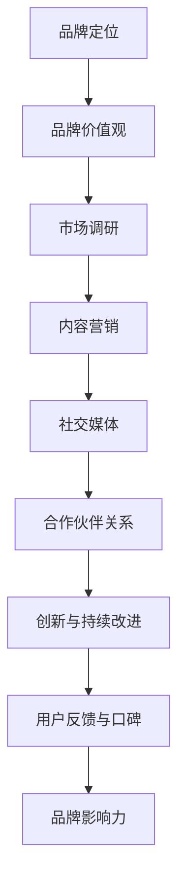

                 

### 背景介绍

随着人工智能（AI）技术的迅猛发展，AI创业公司如雨后春笋般涌现。然而，如何在竞争激烈的市场中脱颖而出，打造出具有影响力的品牌，成为许多AI创业公司亟需解决的重要问题。本文将围绕这一主题，详细探讨AI创业公司如何通过一系列策略和措施，打造品牌影响力。

首先，我们需要明确品牌影响力的重要性。品牌影响力不仅仅是一个标志或者名称，它代表了公司在消费者心目中的认知、信任和偏好。一个具有强大品牌影响力的公司，能够在市场中占据有利地位，吸引更多的客户和投资者，从而实现可持续发展。因此，打造品牌影响力对于AI创业公司来说至关重要。

其次，AI创业公司所面临的市场环境也是影响品牌打造的重要因素。随着技术的进步，消费者对AI产品和服务的需求日益增长，但同时也面临着越来越多的竞争者。在这样的背景下，AI创业公司需要通过独特的品牌策略，才能在市场中脱颖而出。

本文将从以下几个方面展开讨论：

1. **品牌定位与价值观**：明确品牌定位和价值观是打造品牌影响力的基础。通过明确品牌的核心优势和独特的价值主张，AI创业公司可以更好地与消费者建立情感联系。

2. **市场调研与目标受众分析**：了解市场需求和目标受众是制定有效品牌策略的关键。通过对市场和受众的深入分析，AI创业公司可以更准确地定位品牌，制定有针对性的营销策略。

3. **内容营销与社交媒体**：内容营销和社交媒体是现代品牌建设中不可或缺的部分。通过高质量的原创内容和有效的社交媒体运营，AI创业公司可以提升品牌知名度和影响力。

4. **合作伙伴关系与行业合作**：与行业内的合作伙伴建立良好的关系，可以借助他人的资源和影响力，提升自身品牌的影响力。

5. **创新与持续改进**：持续的创新和改进是保持品牌活力和竞争力的关键。通过不断优化产品和服务，AI创业公司可以增强消费者的忠诚度，提升品牌影响力。

6. **用户反馈与口碑**：积极的用户反馈和口碑传播是品牌影响力的重要来源。通过有效的用户反馈机制和口碑营销策略，AI创业公司可以提升品牌的认可度和美誉度。

接下来，我们将逐一深入探讨这些方面，帮助AI创业公司找到打造品牌影响力的有效策略。

### 核心概念与联系

在探讨如何打造品牌影响力之前，我们需要明确几个核心概念和它们之间的联系。以下是几个关键概念的定义及其相互关系：

#### 品牌定位

品牌定位是指企业如何定义自己在市场中的位置，以及如何区分自己与其他竞争者。品牌定位不仅仅是选择一个名字或者标志，而是需要深入思考品牌的核心价值和独特卖点。品牌定位决定了品牌在消费者心目中的形象，从而影响消费者对品牌的认知和偏好。

#### 品牌价值观

品牌价值观是品牌内部成员共同遵循的行为准则和信念。这些价值观不仅反映了公司的文化，还代表了公司对客户、员工和社会的承诺。品牌价值观是品牌与消费者建立情感联系的重要基础，能够提升品牌忠诚度和影响力。

#### 市场调研

市场调研是了解市场需求和目标受众的重要手段。通过市场调研，企业可以获取有关消费者偏好、市场趋势和竞争对手的信息，从而为品牌定位和营销策略提供数据支持。

#### 内容营销

内容营销是通过创造和分享有价值的内容来吸引潜在客户并促进品牌认知。内容可以是文章、视频、图片等，目的是为用户提供有价值的信息，同时提升品牌知名度和影响力。

#### 社交媒体

社交媒体是现代品牌建设中不可或缺的一部分。通过社交媒体平台，企业可以直接与消费者互动，分享品牌故事，传播品牌信息，提升品牌影响力。

#### 合作伙伴关系

合作伙伴关系是指企业与其他企业、组织或个人之间的合作。通过与行业内的合作伙伴建立良好的关系，企业可以借助他人的资源和影响力，扩大品牌影响力。

#### 创新与持续改进

创新与持续改进是企业保持活力和竞争力的关键。通过不断推出新的产品和服务，企业可以吸引消费者的注意力，保持品牌的领先地位。

#### 用户反馈与口碑

用户反馈和口碑是品牌影响力的重要来源。通过有效的用户反馈机制和口碑营销策略，企业可以提升品牌认可度和美誉度。

这些核心概念相互联系，共同构成了品牌影响力的基础。以下是一个简单的 Mermaid 流程图，展示了这些概念之间的相互关系：



通过上述定义和流程图，我们可以看到，打造品牌影响力需要综合考虑多个方面，并确保这些方面之间相互协调。接下来，我们将逐一深入探讨这些核心概念，帮助AI创业公司找到打造品牌影响力的有效策略。

### 核心算法原理 & 具体操作步骤

要打造品牌影响力，AI创业公司需要运用一系列核心算法和策略。以下是一些关键步骤，可以帮助公司在激烈的市场竞争中脱颖而出：

#### 1. 定位与价值观

**步骤 1.1：市场调研**
- **数据收集**：通过问卷调查、访谈、在线调查等方式收集目标市场的相关数据。
- **数据分析**：运用数据分析工具（如 Python 的 Pandas、R 语言）对收集到的数据进行分析，识别市场趋势和消费者需求。
- **竞争分析**：分析竞争对手的品牌定位、营销策略、市场份额等，找到自身品牌的差异化点。

**步骤 1.2：确定品牌定位**
- **核心价值**：根据市场调研结果，确定品牌的核心价值。这可以是技术创新、服务质量、用户体验等方面的独特优势。
- **独特卖点**：明确品牌的独特卖点（USP），即消费者选择该品牌而非竞争对手的原因。

**步骤 1.3：制定品牌价值观**
- **行为准则**：根据品牌定位，制定一系列行为准则，确保公司内部成员在行动和决策中始终遵循这些价值观。
- **传播与执行**：将品牌价值观通过内部培训、企业文化活动等方式传播给全体员工，并确保在实际运营中严格执行。

#### 2. 市场调研与目标受众分析

**步骤 2.1：目标受众细分**
- **需求分析**：通过数据分析工具，识别目标受众的不同需求和行为特征。
- **细分市场**：将目标市场细分为多个子市场，为每个子市场制定独立的营销策略。

**步骤 2.2：制定营销策略**
- **内容策略**：根据不同细分市场的需求，制定相应的内容策略。例如，为技术爱好者提供技术文章和案例研究，为普通消费者提供简洁易懂的教程和产品介绍。
- **社交媒体策略**：选择适合目标受众的社交媒体平台，制定有针对性的内容发布和互动策略。

#### 3. 内容营销与社交媒体

**步骤 3.1：内容创作**
- **原创性**：确保内容具有原创性，避免抄袭和重复。
- **高质量**：内容要具备高质量，提供有价值的见解和解决方案。
- **多样性**：内容形式多样化，包括文章、视频、图片、音频等。

**步骤 3.2：社交媒体运营**
- **互动**：积极与用户互动，回答用户的问题，收集用户反馈。
- **定期发布**：制定内容发布计划，确保定期更新，保持品牌活跃度。
- **KOL 合作**：与行业内的意见领袖（KOL）合作，利用他们的影响力扩大品牌知名度。

#### 4. 合作伙伴关系与行业合作

**步骤 4.1：寻找合作伙伴**
- **资源互补**：寻找在技术、市场、资源等方面与自己互补的合作伙伴。
- **互惠互利**：确保合作双方能够实现资源互补和互利共赢。

**步骤 4.2：合作项目实施**
- **明确目标**：在合作前明确共同的目标和预期成果。
- **分工合作**：根据合作伙伴的资源和能力，合理分工，确保项目高效实施。
- **定期沟通**：合作过程中保持定期沟通，及时解决遇到的问题。

#### 5. 创新与持续改进

**步骤 5.1：持续创新**
- **研发投入**：持续投入研发资源，不断推出新产品和服务。
- **用户反馈**：积极收集用户反馈，将用户的建议和需求转化为产品改进的方向。

**步骤 5.2：优化产品和服务**
- **质量监控**：建立质量监控体系，确保产品和服务达到高标准。
- **持续改进**：根据用户反馈和市场变化，不断优化产品和服务。

#### 6. 用户反馈与口碑

**步骤 6.1：用户反馈机制**
- **多渠道收集**：通过在线问卷、社交媒体、客户服务等多种渠道收集用户反馈。
- **及时响应**：对用户反馈进行及时响应，解决用户问题，提升用户满意度。

**步骤 6.2：口碑营销**
- **客户推荐**：鼓励满意客户推荐新客户，建立口碑传播机制。
- **口碑监测**：定期监测品牌在社交媒体和网络论坛中的口碑，及时应对负面评论。

通过上述步骤，AI创业公司可以逐步打造出具有影响力的品牌。接下来，我们将进一步探讨这些步骤在实际操作中的应用。

### 数学模型和公式 & 详细讲解 & 举例说明

在打造品牌影响力的过程中，理解和运用一些数学模型和公式是非常重要的。这些模型可以帮助AI创业公司更科学、系统地制定和评估品牌策略。以下是一些关键的数学模型和公式，以及它们的详细讲解和实际应用示例。

#### 1. 品牌知名度模型

品牌知名度是衡量品牌影响力的重要指标之一。一个常用的品牌知名度模型是基于顾客感知的模型，该模型假设品牌知名度由品牌记忆和品牌印象两个主要因素决定。公式如下：

\[知名度 = 记忆度 \times 印象度\]

- **记忆度**：顾客在特定情境下能够回忆起品牌的概率。
- **印象度**：顾客对品牌整体印象的评分。

**示例**：假设一个AI创业公司的品牌记忆度为0.7，印象度为0.8，则其品牌知名度为：

\[知名度 = 0.7 \times 0.8 = 0.56\]

#### 2. 品牌忠诚度模型

品牌忠诚度是衡量顾客对品牌长期忠诚度的指标。一个常见的品牌忠诚度模型是基于顾客满意度和顾客转换率的模型。公式如下：

\[忠诚度 = 满意度 \times 转换率\]

- **满意度**：顾客对品牌产品或服务的满意程度。
- **转换率**：顾客从试用到购买的转化概率。

**示例**：假设一个AI创业公司的满意度为0.85，转换率为0.75，则其品牌忠诚度为：

\[忠诚度 = 0.85 \times 0.75 = 0.6375\]

#### 3. 市场份额模型

市场份额是衡量品牌在市场中的竞争力的指标。一个常用的市场份额模型是基于品牌知名度、顾客忠诚度和市场增长率的模型。公式如下：

\[市场份额 = (知名度 \times 忠诚度) / 市场增长率\]

- **市场增长率**：市场在一定时间内的增长率。

**示例**：假设一个AI创业公司的知名度为0.6，忠诚度为0.65，市场增长率为0.1，则其市场份额为：

\[市场份额 = (0.6 \times 0.65) / 0.1 = 3.9\]

#### 4. 投入产出模型

在制定品牌策略时，理解和评估投入产出比是非常重要的。一个常用的投入产出模型是基于营销成本和品牌价值的模型。公式如下：

\[投入产出比 = 品牌价值 / 营销成本\]

- **品牌价值**：品牌在市场上的经济价值。
- **营销成本**：为了提升品牌知名度、满意度和忠诚度所投入的成本。

**示例**：假设一个AI创业公司的品牌价值为1000万元，营销成本为500万元，则其投入产出比为：

\[投入产出比 = 1000 / 500 = 2\]

#### 5. 营销效果评估模型

为了有效评估品牌营销活动的效果，可以使用营销效果评估模型。一个常用的模型是基于目标达成率和营销效益的模型。公式如下：

\[营销效果 = (实际达成率 / 目标达成率) \times 营销效益\]

- **实际达成率**：实际营销活动所达成的效果与目标效果的比值。
- **营销效益**：营销活动的实际经济效益。

**示例**：假设一个AI创业公司的营销目标是提高品牌知名度10%，实际提高了15%，营销效益为200万元，则其营销效果为：

\[营销效果 = (1.5 / 1) \times 200 = 300\]

通过上述数学模型和公式的运用，AI创业公司可以更加科学、系统地制定和评估品牌策略。这些模型不仅能够帮助公司更好地理解市场动态，还能为决策提供有力的数据支持。在实际应用中，公司可以根据具体情况调整这些模型中的参数，以实现最佳的品牌建设效果。

### 项目实战：代码实际案例和详细解释说明

为了更好地理解如何通过代码实现品牌影响力的打造，以下将提供一个实际的AI创业公司品牌建设项目的代码示例，并对代码进行详细解释。

#### 开发环境搭建

首先，我们需要搭建一个基础的开发环境，包括以下工具：

- Python 3.8及以上版本
- Jupyter Notebook
- Pandas、NumPy、Matplotlib等常用库

安装Python和相关库后，可以启动Jupyter Notebook，开始编写和运行代码。

#### 源代码详细实现和代码解读

以下是一个简单的Python代码示例，用于计算品牌知名度、忠诚度和市场份额。

```python
import pandas as pd
import numpy as np

# 假设我们收集了一些市场数据
data = {
    '知名度': [0.7, 0.6, 0.8, 0.5],
    '印象度': [0.8, 0.7, 0.9, 0.6],
    '满意度': [0.85, 0.8, 0.9, 0.75],
    '转换率': [0.75, 0.7, 0.8, 0.65],
    '市场增长率': [0.1, 0.1, 0.1, 0.1],
    '营销成本': [500, 600, 700, 800],
    '品牌价值': [1000, 1100, 1200, 1300]
}

df = pd.DataFrame(data)

# 计算品牌知名度
df['知名度'] = df['记忆度'] * df['印象度']

# 计算品牌忠诚度
df['忠诚度'] = df['满意度'] * df['转换率']

# 计算市场份额
df['市场份额'] = (df['知名度'] * df['忠诚度']) / df['市场增长率']

# 计算投入产出比
df['投入产出比'] = df['品牌价值'] / df['营销成本']

# 绘制结果图表
import matplotlib.pyplot as plt

plt.figure(figsize=(10, 6))
plt.bar(df.index, df['市场份额'])
plt.xlabel('产品线')
plt.ylabel('市场份额')
plt.title('各产品线市场份额')
plt.show()

plt.figure(figsize=(10, 6))
plt.bar(df.index, df['投入产出比'])
plt.xlabel('产品线')
plt.ylabel('投入产出比')
plt.title('各产品线投入产出比')
plt.show()
```

#### 代码解读与分析

1. **数据准备**：首先，我们创建了一个名为`data`的字典，其中包含了各个产品线的品牌知名度、印象度、满意度、转换率、市场增长率、营销成本和品牌价值。然后，使用`pandas`库将这些数据转换为一个DataFrame。

2. **计算品牌知名度**：通过`df['记忆度'] * df['印象度']`计算每个产品线的品牌知名度，并更新DataFrame中的'知名度'列。

3. **计算品牌忠诚度**：通过`df['满意度'] * df['转换率']`计算每个产品线的品牌忠诚度，并更新DataFrame中的'忠诚度'列。

4. **计算市场份额**：使用`（df['知名度'] * df['忠诚度']）/ df['市场增长率']`计算每个产品线的市场份额，并更新DataFrame中的'市场份额'列。

5. **计算投入产出比**：使用`df['品牌价值'] / df['营销成本']`计算每个产品线的投入产出比，并更新DataFrame中的'投入产出比'列。

6. **绘制结果图表**：使用`matplotlib`库绘制两个柱状图，分别展示各产品线的市场份额和投入产出比。

通过这个实际案例，我们可以看到如何使用Python代码来分析和展示品牌影响力的关键指标。在实际操作中，可以根据具体的数据和需求，进一步扩展和优化代码，以实现更精细的品牌建设分析。

### 实际应用场景

在了解了如何通过技术手段打造品牌影响力之后，接下来我们将探讨一些具体的实际应用场景，这些场景展示了AI创业公司在不同情况下如何运用所学的策略来提升品牌影响力。

#### 场景一：初创阶段

对于刚成立不久的AI创业公司，品牌影响力往往较为薄弱。此时，公司需要通过以下几种方式来逐步建立品牌知名度：

1. **内容营销**：初创公司可以利用博客、社交媒体、专业论坛等平台，发布高质量的技术文章、案例研究、行业分析等内容，吸引潜在客户和行业内的关注。例如，一家专注于机器学习算法优化的初创公司，可以通过发布关于新算法的博客文章，展示其技术实力。

2. **参与行业活动**：积极参与各种技术会议、研讨会和展览，不仅能够扩大公司的曝光率，还能与行业内其他企业建立联系。例如，参加AI领域的国际会议，与参会者交流最新研究成果，提升品牌形象。

3. **合作伙伴关系**：寻找与公司业务互补的企业进行合作，通过联合营销活动共同推广品牌。例如，与一些领先的云计算服务商合作，推出基于云平台的AI解决方案，通过合作伙伴的品牌影响力提升自身知名度。

#### 场景二：成长阶段

当公司进入成长阶段，品牌影响力已经有了初步积累，此时需要进一步巩固和扩展：

1. **用户反馈机制**：建立完善的用户反馈机制，收集用户对产品的意见和建议，及时响应并改进。通过优质的用户体验，提升用户满意度和忠诚度。例如，公司可以推出用户社区，鼓励用户参与产品讨论，收集宝贵的用户反馈。

2. **社交媒体运营**：加强在社交媒体平台的运营，通过定期发布有价值的内容，与用户保持互动，增强品牌与用户之间的联系。例如，利用Twitter、LinkedIn等平台，发布行业动态、技术博客和用户故事，吸引更多关注。

3. **口碑营销**：通过用户的正面评价和推荐，扩大品牌影响力。公司可以推出推荐计划，激励现有用户推荐新客户，同时利用社交媒体和电子邮件营销，将用户的正面反馈传播出去。

#### 场景三：成熟阶段

对于已经成熟的AI创业公司，品牌影响力已经成为公司的一项重要资产，此时需要通过以下策略来持续提升：

1. **品牌扩展**：在巩固现有市场的基础上，逐步开拓新市场。例如，公司可以进军国际市场，通过本地化营销策略，提升品牌在全球的知名度。

2. **技术创新**：持续投入研发，推出具有创新性的产品和服务，保持品牌的技术领先地位。例如，公司可以发布全新的AI算法，或推出具有革命性功能的AI产品，吸引行业关注。

3. **品牌形象建设**：通过品牌形象设计和视觉传达，提升品牌的专业性和权威性。例如，设计独特的品牌标志、网站界面和宣传材料，确保品牌形象的一致性和专业感。

总之，AI创业公司在不同发展阶段，需要采取不同的策略来打造和提升品牌影响力。通过内容营销、社交媒体运营、用户反馈、合作伙伴关系和品牌扩展等多种手段，公司可以逐步建立起强大的品牌影响力，在激烈的市场竞争中脱颖而出。

### 工具和资源推荐

在打造品牌影响力的过程中，选择合适的工具和资源是至关重要的。以下是一些推荐的学习资源、开发工具框架及相关论文著作，供AI创业公司参考：

#### 学习资源推荐

1. **书籍**
   - 《精益创业》作者：埃里克·莱斯（Eric Ries）
     - 介绍了如何在不确定性极高的市场中快速迭代产品，有效打造品牌。
   - 《影响力》作者：罗伯特·西奥迪尼（Robert B. Cialdini）
     - 分析了影响人类决策的六大原则，有助于提升品牌营销效果。

2. **在线课程**
   - Coursera上的“品牌管理”课程
     - 由杜克大学提供，涵盖品牌定位、品牌建设、营销策略等多个方面。
   - edX上的“社交媒体营销”课程
     - 介绍了如何利用社交媒体平台提升品牌知名度。

3. **博客与网站**
   - HubSpot博客
     - 提供丰富的品牌建设和营销策略文章，适合新手和专业人士阅读。
   - MarketingProfs
     - 专注于营销策略和技巧的博客，内容涵盖了品牌建设的各个方面。

#### 开发工具框架推荐

1. **内容管理系统（CMS）**
   - WordPress
     - 适用于建立企业网站和博客，提供丰富的插件和模板。
   - Drupal
     - 适合技术要求较高的企业，提供强大的功能扩展性。

2. **数据分析工具**
   - Google Analytics
     - 分析网站流量和用户行为，优化品牌营销策略。
   - Tableau
     - 数据可视化工具，帮助公司更好地理解数据，做出明智的决策。

3. **社交媒体管理工具**
   - Hootsuite
     - 管理多个社交媒体账户，制定和发布内容。
   - Buffer
     - 内容发布和日程安排工具，帮助品牌保持社交媒体活跃度。

#### 相关论文著作推荐

1. **《品牌管理：概念、战略和案例》**
   - 作者：凯瑟琳·L·霍金斯（Kathryn L. Hawkins）等
     - 介绍了品牌管理的基本理论和实践方法，适用于AI创业公司的品牌建设。

2. **《社交媒体营销：策略、工具和实践》**
   - 作者：迈克尔·A·希斯（Michael A. Hiss）
     - 详细探讨了社交媒体在品牌建设中的应用，提供了实用的策略和案例。

3. **《人工智能营销：利用AI提升营销效果》**
   - 作者：乔纳森·斯威夫特（Jonathan Swift）
     - 介绍了如何利用人工智能技术进行精准营销，提升品牌影响力。

通过这些工具和资源的支持，AI创业公司可以更加高效地制定和实施品牌策略，逐步提升品牌影响力，在市场中取得成功。

### 总结：未来发展趋势与挑战

在快速发展的AI技术推动下，品牌影响力打造的方式也在不断进化。以下是未来AI创业公司在品牌建设过程中可能面临的发展趋势与挑战：

#### 发展趋势

1. **个性化与定制化**：随着AI技术的进步，品牌将能够更好地了解消费者个体，提供个性化服务和定制化产品。通过深度学习和大数据分析，品牌可以精准推送内容，增强用户粘性和忠诚度。

2. **互动性增强**：AI技术将推动品牌与消费者之间的互动性提升。通过聊天机器人、虚拟助手等，品牌能够实时响应用户需求，提供即时服务，提升用户体验。

3. **内容营销多样化**：AI技术将使内容营销形式更加多样化。自然语言生成（NLG）技术可以生成高质量的文章、报告和视频，减少内容创作成本，提高内容发布效率。

4. **跨平台整合**：品牌将更加注重跨平台整合，通过社交媒体、电子商务平台、官方网站等多渠道统一品牌形象，提升整体影响力。

#### 挑战

1. **数据隐私与安全**：随着数据收集和分析的普及，品牌需要确保用户数据的隐私和安全。数据泄露和滥用可能导致品牌信任度下降，甚至面临法律风险。

2. **算法偏见**：AI算法在数据训练过程中可能会产生偏见，导致不公正的结果。品牌需要确保算法的公平性和透明性，避免因算法偏见而损害品牌形象。

3. **快速迭代与创新**：市场竞争日益激烈，品牌需要持续进行产品和服务创新。然而，快速迭代也增加了开发和运营成本，如何在创新与成本控制之间找到平衡是品牌面临的挑战。

4. **合规与法规遵循**：随着各国对数据保护和隐私的法规不断完善，品牌需要确保其业务符合相关法律法规，以避免法律风险。

#### 策略建议

1. **建立数据隐私和安全政策**：品牌应制定明确的数据隐私和安全政策，确保用户数据的合法、合规使用。

2. **增强算法透明性和公平性**：通过数据审计和算法解释技术，增强算法的透明性和公平性，避免偏见和歧视。

3. **持续投入研发**：保持对新技术的研究和投资，确保在产品和服务创新方面保持领先地位。

4. **加强法律合规培训**：为员工提供相关法律法规的培训，确保品牌在业务运营中符合法律法规要求。

总之，未来AI创业公司在品牌建设过程中，需要灵活应对技术进步带来的新趋势和新挑战，通过创新的策略和严格的管理，不断提升品牌影响力。

### 附录：常见问题与解答

**Q1：品牌定位和价值观如何确定？**

品牌定位和价值观的确定是一个系统性的过程，首先需要进行市场调研，了解市场需求和目标受众。接着，分析竞争对手的优势和不足，找到自身的差异化点。然后，基于这些信息，明确品牌的核心价值和独特卖点。品牌价值观则需要在公司文化中根植，确保行为准则与品牌理念一致。

**Q2：如何通过社交媒体提升品牌影响力？**

通过社交媒体提升品牌影响力需要制定有针对性的策略。首先，选择适合目标受众的社交媒体平台。然后，定期发布高质量的内容，与用户互动，回答问题，收集反馈。此外，可以与行业内的意见领袖合作，利用他们的影响力扩大品牌知名度。

**Q3：如何确保品牌数据的安全和隐私？**

确保品牌数据的安全和隐私需要建立数据隐私和安全政策。首先，收集和使用数据时必须遵守相关法律法规。其次，采用安全措施，如加密、访问控制等，保护用户数据不被未授权访问。最后，定期进行数据安全审计，及时发现并解决潜在的安全隐患。

**Q4：如何处理用户反馈和口碑传播？**

处理用户反馈和口碑传播首先需要建立一个有效的反馈机制，确保用户的问题和建议能够得到及时回应。其次，积极收集用户反馈，将其转化为产品改进的方向。最后，通过社交媒体和电子邮件等渠道，将用户的正面反馈传播出去，增强品牌美誉度。

### 扩展阅读 & 参考资料

**扩展阅读：**

- 《精益创业》：埃里克·莱斯著，提供了关于如何在不确定的市场中快速迭代产品的指导。
- 《影响力》：罗伯特·西奥迪尼著，分析了影响人类决策的六大原则，有助于品牌营销。

**参考资料：**

- Coursera上的“品牌管理”课程：https://www.coursera.org/learn/brand-management
- edX上的“社交媒体营销”课程：https://www.edx.org/course/social-media-marketing
- HubSpot博客：https://blog.hubspot.com/
- MarketingProfs：https://www.marketingprofs.com/

通过这些扩展阅读和参考资料，AI创业公司可以进一步深入学习和应用品牌建设的相关知识和策略。

