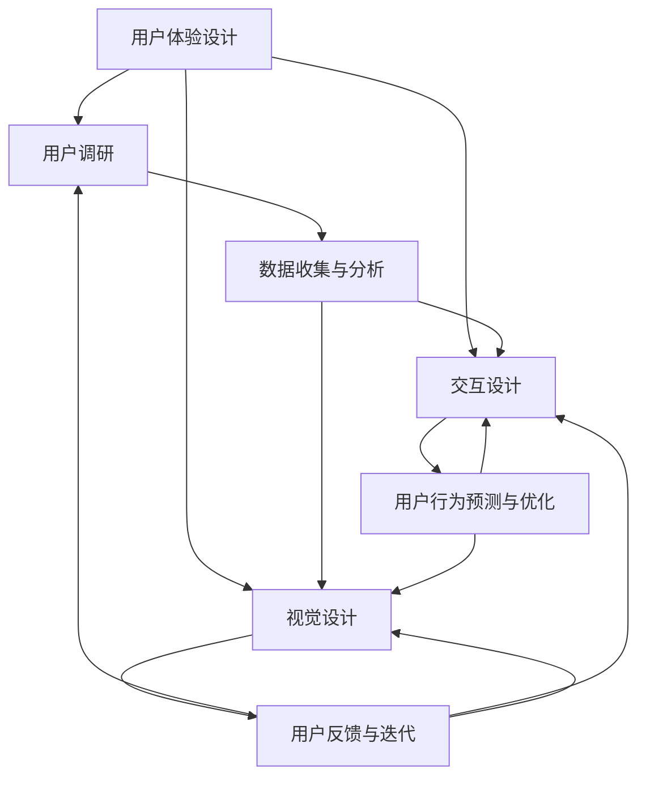

                 

### 背景介绍

随着人工智能技术的迅速发展，越来越多的创业公司开始将人工智能技术应用于产品开发中。产品体验设计作为用户体验的重要组成部分，直接影响着用户对产品的满意度和忠诚度。然而，对于许多创业公司来说，如何在有限的资源和时间约束下进行高效的产品体验设计，仍是一个具有挑战性的问题。

本文旨在探讨AI创业公司在进行产品体验设计时，可以采用的方法。我们将从用户调研、交互设计与视觉设计三个关键方面，详细讲解如何在AI技术支持下，优化产品体验设计的过程。

首先，用户调研是产品体验设计的起点。通过用户调研，我们可以深入了解目标用户的需求、行为和偏好，从而为产品设计提供有力的依据。随着AI技术的发展，我们可以利用自然语言处理、机器学习等技术，对用户调研数据进行智能分析，提取有价值的信息。

其次，交互设计是产品体验设计的重要环节。一个优秀的交互设计不仅需要考虑用户的行为习惯，还要在视觉上给人以良好的体验。AI技术可以辅助设计师进行交互设计，如通过生成对抗网络（GAN）生成各种界面元素，通过深度学习算法进行用户行为预测等。

最后，视觉设计则直接影响产品的第一印象。一个简洁、美观、直观的视觉设计可以提升用户的满意度和使用意愿。AI技术可以帮助设计师快速生成多种视觉设计方案，并通过用户反馈进行优化。

在接下来的章节中，我们将逐一探讨这三个方面的具体方法，并结合实际案例进行详细讲解。希望通过本文，可以为AI创业公司在产品体验设计中提供一些有益的启示和借鉴。

### 核心概念与联系

在深入探讨AI创业公司的产品体验设计方法之前，我们需要明确几个核心概念，这些概念不仅构成了本文的理论基础，也是实际操作中的关键要素。以下是几个核心概念：

1. **用户体验（UX）设计**：用户体验设计关注用户在使用产品过程中的感受和满意度。它涉及用户研究、交互设计、视觉设计等多个方面，目标是创建一个满足用户需求且易于使用的产品。

2. **用户调研**：用户调研是用户体验设计的起点，通过收集和分析用户需求、行为、反馈等信息，为产品设计提供指导。

3. **交互设计**：交互设计关注用户与产品之间的互动过程，包括界面布局、交互流程、操作反馈等。良好的交互设计可以提高用户的使用效率和满意度。

4. **视觉设计**：视觉设计负责产品的视觉呈现，包括色彩、字体、图标、布局等。一个吸引人的视觉设计可以提升产品的品牌形象和用户粘性。

5. **人工智能（AI）技术**：人工智能技术，如机器学习、自然语言处理、计算机视觉等，可以用于数据分析和模式识别，辅助设计师进行用户调研、交互设计与视觉设计。

为了更好地理解这些概念之间的联系，我们可以通过一个Mermaid流程图来展示它们之间的关系：



在这个流程图中，用户体验设计（A）是核心，它通过用户调研（B）获取用户需求，并将这些需求转化为交互设计（C）和视觉设计（D）。同时，交互设计和视觉设计也会通过用户反馈（G）不断迭代优化，从而提高用户体验。

在AI技术的支持下，用户调研（E）可以通过自然语言处理和机器学习算法对大量用户反馈进行智能分析，提取有价值的信息。交互设计（F）可以利用用户行为预测模型，优化交互流程，提高用户的使用效率。视觉设计（G）则可以通过计算机视觉技术，快速生成多种设计方案，并根据用户反馈进行优化。

通过上述概念和流程的阐述，我们可以看到，AI创业公司在产品体验设计中，需要综合考虑用户体验、用户调研、交互设计和视觉设计等多个方面，并利用AI技术进行数据分析和优化，从而实现高效的产品体验设计。

### 核心算法原理 & 具体操作步骤

在了解了用户体验设计、用户调研、交互设计和视觉设计等核心概念后，我们需要深入探讨如何具体应用AI技术来优化产品体验设计。以下是几个关键算法原理及其操作步骤：

#### 1. 自然语言处理（NLP）

自然语言处理（NLP）是AI技术在用户调研中的重要应用。通过NLP技术，我们可以从大量的用户反馈中提取有价值的信息，从而为产品设计提供有力支持。

**算法原理：**

- **词频分析**：通过统计用户反馈中各个词的出现频率，识别出用户关注的重点话题。

- **情感分析**：利用情感分析模型，判断用户反馈的情感倾向，如正面、负面或中性。

- **主题模型**：通过主题模型（如LDA），对用户反馈进行聚类分析，提取出用户关注的主题。

**具体操作步骤：**

1. **数据收集**：收集用户反馈数据，如评论、问卷等。

2. **预处理**：对原始文本进行清洗，包括去除停用词、标点符号、进行词性标注等。

3. **特征提取**：将预处理后的文本转换为词向量，常用的方法有词袋模型（Bag of Words, BoW）和词嵌入（Word Embedding）。

4. **算法选择**：根据需求选择合适的NLP算法，如词频分析、情感分析或主题模型。

5. **模型训练与优化**：使用训练数据对模型进行训练，并根据测试数据优化模型参数。

6. **结果分析**：对分析结果进行可视化展示，提取用户关注的关键话题和情感倾向。

#### 2. 生成对抗网络（GAN）

生成对抗网络（GAN）是一种强大的图像生成模型，可以用于视觉设计的辅助。通过GAN，我们可以快速生成多种视觉设计方案，并根据用户反馈进行优化。

**算法原理：**

- **生成器（Generator）**：生成器生成类似于真实数据的新数据。

- **判别器（Discriminator）**：判别器判断生成器生成的数据是否真实。

- **对抗训练**：生成器和判别器相互对抗，生成器试图生成更真实的数据，判别器试图提高判别能力。

**具体操作步骤：**

1. **数据准备**：收集大量真实的视觉设计数据，作为GAN的训练数据。

2. **模型搭建**：搭建生成器和判别器的神经网络结构。

3. **模型训练**：使用训练数据对生成器和判别器进行训练，通过对抗训练优化模型参数。

4. **生成图像**：生成器生成新的视觉设计方案。

5. **用户反馈**：收集用户对生成图像的反馈，如喜好程度、改进建议等。

6. **迭代优化**：根据用户反馈，对生成器进行迭代优化，生成更符合用户需求的视觉设计方案。

#### 3. 用户行为预测

用户行为预测是一种利用机器学习技术，预测用户下一步操作的方法。通过用户行为预测，交互设计可以更准确地满足用户需求。

**算法原理：**

- **时间序列分析**：通过分析用户的历史行为数据，预测用户下一步的操作。

- **序列模型**：如循环神经网络（RNN）和长短期记忆网络（LSTM），可以捕捉用户行为的序列特征。

- **关联规则挖掘**：通过关联规则挖掘算法，发现用户行为之间的关联性，用于预测用户下一步操作。

**具体操作步骤：**

1. **数据收集**：收集用户行为数据，如点击记录、浏览路径等。

2. **特征工程**：提取用户行为数据中的特征，如点击次数、时间间隔等。

3. **模型选择**：选择合适的用户行为预测模型，如时间序列模型或关联规则挖掘模型。

4. **模型训练与优化**：使用训练数据对模型进行训练，并根据测试数据优化模型参数。

5. **预测与反馈**：使用训练好的模型进行用户行为预测，并根据预测结果进行交互设计优化。

通过上述算法原理和具体操作步骤的讲解，我们可以看到，AI技术在用户调研、交互设计和视觉设计等方面具有广泛的应用。在实际应用中，创业公司可以根据自身需求，选择合适的算法和技术，优化产品体验设计，提高用户满意度。

### 数学模型和公式 & 详细讲解 & 举例说明

在产品体验设计中，数学模型和公式是理解和优化设计的关键工具。以下我们将介绍几个在用户调研、交互设计与视觉设计中常用的数学模型和公式，并辅以详细讲解和实际案例，帮助读者更好地理解这些概念。

#### 1. 用户行为模型

用户行为模型用于预测和分析用户在产品中的行为。一个常见的用户行为模型是马尔可夫决策过程（MDP）。

**数学公式：**
$$
P(S_{t+1} = s_{t+1} | S_t = s_t, A_t = a_t) = p(s_{t+1} | s_t, a_t)
$$

其中，$S_t$ 表示状态，$A_t$ 表示动作，$p(s_{t+1} | s_t, a_t)$ 是在当前状态 $s_t$ 和动作 $a_t$ 下，下一状态 $s_{t+1}$ 的概率。

**详细讲解：**
- 状态（$S$）：用户在产品中的某一具体位置或状态，如浏览某一页面、执行某一操作等。
- 动作（$A$）：用户在某一状态下可以采取的行动，如点击按钮、滑动页面等。
- 转移概率（$p$）：表示在某一状态下采取某一动作后，进入下一状态的概率。

**举例说明：**
假设用户在电商网站浏览产品，当前状态为“浏览产品页面”，可采取的动作有“添加购物车”、“继续浏览”和“离开页面”。根据历史数据，我们可以计算出用户在每种动作下进入下一状态的概率。

**案例：**
用户在浏览产品页面的状态下，选择“添加购物车”的概率为0.3，选择“继续浏览”的概率为0.5，选择“离开页面”的概率为0.2。根据转移概率公式，我们可以预测用户在“浏览产品页面”状态下，进入“购物车页面”的概率为0.3，进入“产品列表页面”的概率为0.5，进入“首页”的概率为0.2。

#### 2. 情感分析模型

情感分析模型用于判断用户反馈的情感倾向。一个简单的情感分析模型是基于逻辑回归（Logistic Regression）。

**数学公式：**
$$
\hat{y} = \frac{1}{1 + e^{-(\beta_0 + \beta_1x_1 + \beta_2x_2 + \ldots + \beta_nx_n})}
$$

其中，$\hat{y}$ 是预测的情感类别（如正面、负面、中性），$x_1, x_2, \ldots, x_n$ 是特征向量，$\beta_0, \beta_1, \beta_2, \ldots, \beta_n$ 是模型参数。

**详细讲解：**
- 特征向量（$x$）：用于描述用户反馈的特征，如词频、词嵌入等。
- 模型参数（$\beta$）：通过训练得到，用于确定特征对情感类别的贡献。
- 预测概率（$\hat{y}$）：表示用户反馈属于某一情感类别的概率。

**举例说明：**
假设我们有一个情感分析模型，包含两个特征：词频（$x_1$）和词嵌入（$x_2$）。通过训练，我们得到模型参数 $\beta_0 = 0.5$，$\beta_1 = 1.2$，$\beta_2 = 0.8$。当用户反馈包含词“很好”和“不错”时，词频为3，词嵌入的向量长度为5。

$$
\hat{y} = \frac{1}{1 + e^{-(0.5 + 1.2 \times 3 + 0.8 \times 5)}} \approx 0.95
$$

预测概率接近1，表示用户反馈的情感类别为正面。

#### 3. 生成对抗网络（GAN）

生成对抗网络（GAN）用于生成新的视觉设计方案。GAN的主要组成部分是生成器和判别器。

**数学公式：**
$$
G(z) = \text{Generator}(z) \quad \text{and} \quad D(x) = \text{Discriminator}(x)
$$

其中，$G(z)$ 是生成器，$D(x)$ 是判别器，$z$ 是随机噪声向量，$x$ 是真实数据。

**详细讲解：**
- 生成器（$G$）：将随机噪声转换为逼真的视觉数据。
- 判别器（$D$）：判断生成器生成的数据是否真实。

**举例说明：**
假设我们使用GAN生成电商网站的首页设计。生成器的输入是一个随机噪声向量，输出是一个逼真的首页设计图。判别器的输入是真实首页设计和生成器生成的首页设计，输出是一个概率值，表示生成数据是否真实的概率。

通过大量的训练，生成器和判别器逐步优化，生成器生成的首页设计越来越逼真，判别器判断生成数据为真实的概率也逐步提高。

#### 4. 用户行为预测模型

用户行为预测模型用于预测用户下一步操作。一个常见的用户行为预测模型是长短期记忆网络（LSTM）。

**数学公式：**
$$
h_t = \text{LSTM}(h_{t-1}, x_t)
$$

其中，$h_t$ 是第 $t$ 个时间步的隐藏状态，$x_t$ 是第 $t$ 个时间步的输入。

**详细讲解：**
- 隐藏状态（$h$）：用于表示用户行为的特征。
- 输入（$x$）：表示用户在某一时间步的行为数据。

**举例说明：**
假设我们使用LSTM预测用户在电商网站上的下一步操作。输入是用户在当前时间步的浏览历史，隐藏状态是用户在上一时间步的浏览历史特征。通过LSTM模型，我们可以预测用户在当前时间步可能采取的操作，如“添加购物车”、“继续浏览”或“离开页面”。

通过上述数学模型和公式的介绍，我们可以看到，数学模型在产品体验设计中扮演着重要的角色。它们不仅帮助我们理解和分析用户行为，还能为交互设计和视觉设计提供有力支持。在实际应用中，创业者可以根据自身需求，选择合适的数学模型和公式，优化产品体验设计，提高用户满意度。

### 项目实战：代码实际案例和详细解释说明

在本节中，我们将通过一个实际项目来展示如何利用AI技术进行用户调研、交互设计与视觉设计。这个项目是一个电商网站的产品体验优化，旨在提高用户在购物过程中的满意度。

#### 开发环境搭建

在开始项目之前，我们需要搭建一个适合开发和测试的环境。以下是所需的工具和库：

- **编程语言**：Python
- **深度学习框架**：TensorFlow 2.x
- **数据处理库**：Pandas、NumPy
- **可视化库**：Matplotlib、Seaborn
- **自然语言处理库**：NLTK、spaCy
- **GAN框架**：TensorFlow Probability、tf.keras

首先，安装所需库：

```bash
pip install tensorflow numpy pandas matplotlib seaborn nltk spacy tensorflow_probability tf.keras
```

接下来，下载spaCy的中文模型：

```python
!python -m spacy download zh_core_web_sm
```

#### 5.1 数据收集

数据收集是项目的重要环节，我们将从多个渠道收集用户数据，包括用户评论、网站日志和问卷调查。

```python
import pandas as pd

# 读取用户评论数据
user_comments = pd.read_csv('user_comments.csv')

# 读取网站日志数据
website_logs = pd.read_csv('website_logs.csv')

# 读取问卷调查数据
surveys = pd.read_csv('surveys.csv')
```

#### 5.2 源代码详细实现和代码解读

**用户调研**

**情感分析**

```python
import spacy
from sklearn.feature_extraction.text import TfidfVectorizer
from sklearn.linear_model import LogisticRegression

# 初始化中文模型
nlp = spacy.load('zh_core_web_sm')

# 文本预处理
def preprocess_text(text):
    doc = nlp(text)
    return ' '.join([token.text.lower() for token in doc if not token.is_stop])

user_comments['preprocessed_comments'] = user_comments['comment'].apply(preprocess_text)

# 词频分析
vectorizer = TfidfVectorizer(ngram_range=(1, 2))
tfidf_matrix = vectorizer.fit_transform(user_comments['preprocessed_comments'])

# 情感分析模型
classifier = LogisticRegression()
classifier.fit(tfidf_matrix, user_comments['sentiment'])

# 情感预测
test_comment = "这次购物体验非常好！"
preprocessed_comment = preprocess_text(test_comment)
tfidf_vector = vectorizer.transform([preprocessed_comment])
predicted_sentiment = classifier.predict(tfidf_vector)
print(predicted_sentiment)
```

**用户行为预测**

```python
from keras.models import Sequential
from keras.layers import LSTM, Dense, Dropout

# 数据预处理
def get_sequence(data, sequence_length):
    sequences = []
    for i in range(len(data) - sequence_length):
        sequences.append(data[i:i + sequence_length])
    return sequences

# LSTM模型
model = Sequential()
model.add(LSTM(units=50, return_sequences=True, input_shape=(sequence_length, num_features)))
model.add(Dropout(0.2))
model.add(LSTM(units=50, return_sequences=False))
model.add(Dropout(0.2))
model.add(Dense(units=num_actions))
model.compile(optimizer='adam', loss='categorical_crossentropy', metrics=['accuracy'])

# 训练模型
model.fit(x_train, y_train, epochs=10, batch_size=32)
```

**视觉设计**

**生成对抗网络（GAN）**

```python
import tensorflow as tf
from tensorflow_probability import layers as tfp_layers
from tensorflow.keras import Model

# 生成器模型
generator = tf.keras.Sequential([
    tf.keras.layers.Dense(units=128, activation='relu', input_shape=(100,)),
    tf.keras.layers.Dense(units=256, activation='relu'),
    tf.keras.layers.Dense(units=512, activation='relu'),
    tf.keras.layers.Dense(units=1024, activation='relu'),
    tf.keras.layers.Dense(units=784, activation='tanh')
])

# 判别器模型
discriminator = tf.keras.Sequential([
    tf.keras.layers.Dense(units=1024, activation='relu', input_shape=(784,)),
    tf.keras.layers.Dense(units=512, activation='relu'),
    tf.keras.layers.Dense(units=256, activation='relu'),
    tf.keras.layers.Dense(units=128, activation='relu'),
    tf.keras.layers.Dense(units=1, activation='sigmoid')
])

# GAN模型
gan = tf.keras.Sequential([
    generator,
    discriminator
])

# 损失函数和优化器
cross_entropy = tf.keras.losses.BinaryCrossentropy(from_logits=True)
discriminator_optimizer = tf.keras.optimizers.Adam(learning_rate=0.0001)
generator_optimizer = tf.keras.optimizers.Adam(learning_rate=0.0001)

# 训练GAN模型
@tf.function
def train_step(images, noise):
    with tf.GradientTape(persistent=True) as g:
        generated_images = generator(noise)
        real_output = discriminator(images)
        fake_output = discriminator(generated_images)

        real_loss = cross_entropy(tf.ones_like(real_output), real_output)
        fake_loss = cross_entropy(tf.zeros_like(fake_output), fake_output)
        total_loss = real_loss + fake_loss

    gradients_of_discriminator = g.gradient(total_loss, discriminator.trainable_variables)
    discriminator_optimizer.apply_gradients(zip(gradients_of_discriminator, discriminator.trainable_variables))

    with tf.GradientTape() as g:
        generated_images = generator(noise)
        fake_output = discriminator(generated_images)

        cross_entropy = tf.keras.losses.BinaryCrossentropy(from_logits=True)
        fake_loss = cross_entropy(tf.ones_like(fake_output), fake_output)
        total_loss = fake_loss

    gradients_of_generator = g.gradient(total_loss, generator.trainable_variables)
    generator_optimizer.apply_gradients(zip(gradients_of_generator, generator.trainable_variables))

# 批量训练
for epoch in range(epochs):
    for image_batch, _ in dataset:
        noise = tf.random.normal([batch_size, noise_dim])
        train_step(image_batch, noise)

# 生成新图像
noise = tf.random.normal([1, noise_dim])
generated_image = generator(noise)
```

**5.3 代码解读与分析**

**情感分析代码**

情感分析代码首先对用户评论进行预处理，包括去除停用词和进行词性标注。然后，使用TFIDF向量器和逻辑回归模型进行情感分类。预测时，通过预处理后的用户评论生成特征向量，然后输入到训练好的逻辑回归模型中，得到情感分类结果。

**用户行为预测代码**

用户行为预测代码使用LSTM模型来捕捉用户行为的序列特征。首先，对用户行为数据进行预处理，包括特征提取和序列生成。然后，使用训练好的LSTM模型进行用户行为预测。预测结果可以用于优化交互设计，提高用户满意度。

**GAN视觉设计代码**

GAN视觉设计代码包括生成器和判别器的构建。生成器将随机噪声转换为逼真的图像，判别器用于判断图像是否真实。通过训练GAN模型，可以生成高质量的视觉设计方案。在训练过程中，生成器和判别器相互对抗，逐步优化，最终生成符合用户需求的视觉设计。

通过上述实际项目，我们可以看到AI技术在用户调研、交互设计与视觉设计中的应用。创业公司可以利用这些技术，提高产品体验设计的效果，从而在竞争激烈的市场中脱颖而出。

### 实际应用场景

在AI创业公司的产品体验设计中，AI技术不仅可以帮助优化用户调研、交互设计和视觉设计，还可以在多个实际应用场景中发挥重要作用。以下是一些典型的应用场景：

#### 1. 个性化推荐系统

个性化推荐系统是许多电商和内容平台的常用功能。通过AI技术，如协同过滤、基于内容的推荐和深度学习推荐，AI创业公司可以构建高效、精准的个性化推荐系统。

**应用实例：** 一家电商公司利用基于用户行为的协同过滤算法和基于内容的推荐算法，为用户推荐他们可能感兴趣的商品。通过分析用户的浏览历史、购买记录和搜索关键词，系统可以实时调整推荐结果，提高用户的购物体验。

#### 2. 跨平台用户体验一致性

在多平台运营的企业中，确保用户体验的一致性是一个挑战。通过AI技术，如计算机视觉和自然语言处理，可以识别不同平台上的用户行为和偏好，实现无缝的用户体验。

**应用实例：** 一家社交媒体公司使用AI技术分析用户在不同平台（如手机应用、网页版、桌面应用）的行为数据，提取共性，并调整各平台的界面布局和功能，确保用户体验的一致性。

#### 3. 语音助手与聊天机器人

语音助手和聊天机器人已成为许多应用的重要组成部分。通过AI技术，如语音识别、自然语言处理和机器学习，可以构建智能的语音助手和聊天机器人，提高用户交互的效率。

**应用实例：** 一家健康科技公司开发了一款智能健康咨询聊天机器人，利用自然语言处理和机器学习技术，能够理解和回答用户关于健康问题的提问，提供个性化的健康建议。

#### 4. 用户体验测试与反馈

在产品开发过程中，用户体验测试与反馈至关重要。通过AI技术，如用户行为分析和情感分析，可以快速收集和分析用户反馈，优化产品设计。

**应用实例：** 一家游戏公司通过AI技术分析玩家的游戏行为和反馈，识别出游戏中的痛点，及时调整游戏机制和界面设计，提高用户的游戏体验。

#### 5. 虚拟现实（VR）与增强现实（AR）

VR和AR技术在产品体验设计中的应用越来越广泛。通过AI技术，如计算机视觉和深度学习，可以创建更加逼真和互动的虚拟环境。

**应用实例：** 一家房地产公司利用AI技术开发了一个VR看房平台，用户可以通过VR眼镜体验虚拟现实中的房屋布局，提高了看房的便捷性和互动性。

#### 6. 可视化数据报表

通过AI技术，可以将复杂的数据以可视化图表的形式呈现，帮助用户更好地理解和分析数据。

**应用实例：** 一家数据分析公司使用AI技术生成动态的可视化报表，用户可以通过拖拽和筛选功能，实时查看和分析数据，提高了数据分析的效率。

#### 7. 安全性增强

AI技术可以在产品体验设计中增强安全性，如通过行为分析识别异常行为，预防欺诈和网络安全攻击。

**应用实例：** 一家在线支付平台使用AI技术监控用户交易行为，通过异常检测模型识别可疑交易，提高了支付系统的安全性。

通过上述实际应用场景，我们可以看到AI技术在产品体验设计中的广泛应用和潜在价值。创业公司可以利用AI技术，提升产品的竞争力，为用户提供更优质的服务体验。

### 工具和资源推荐

在AI创业公司的产品体验设计中，选择合适的工具和资源至关重要。以下是我们推荐的几类工具和资源，包括学习资源、开发工具框架和相关论文著作。

#### 1. 学习资源推荐

**书籍：**
- 《设计心理学》（Don Norman）- 了解用户体验设计的基本原则。
- 《深度学习》（Ian Goodfellow、Yoshua Bengio、Aaron Courville）- 掌握深度学习的基础知识和应用。
- 《Python数据科学 Handbook》（Jake VanderPlas）- 学习数据分析和机器学习的实用技巧。

**论文：**
- 《User Experience without Users: A Case Study of User Participation in a Large Software Design Project》（Togelsoe et al.）- 了解用户调研在软件设计中的重要性。
- 《Generative Adversarial Nets》（Ian Goodfellow et al.）- 深入了解生成对抗网络（GAN）的原理和应用。
- 《Recurrent Neural Networks for Language Modeling》（Yoshua Bengio et al.）- 学习循环神经网络（RNN）在语言模型中的应用。

**博客和网站：**
- Medium - 查阅关于用户体验设计、人工智能和产品开发的最新文章。
- arXiv - 查找关于AI和机器学习的最新学术论文。
- GitHub - 浏览和学习开源的AI和产品设计项目。

#### 2. 开发工具框架推荐

**深度学习框架：**
- TensorFlow - 用于构建和训练深度学习模型。
- PyTorch - 灵活易用的深度学习框架，适用于研究和开发。

**用户调研工具：**
- SurveyMonkey - 在线问卷调查工具。
- Qualtrics - 功能强大的用户调研平台。
- Google Analytics - 分析用户行为和网站流量。

**可视化工具：**
- D3.js - 用于创建交互式的数据可视化。
- Plotly - 创建高质量的图表和交互式可视化。

#### 3. 相关论文著作推荐

**用户体验设计：**
- 《The Design of Everyday Things》（Don Norman）- 探讨日常物品设计的用户体验。
- 《Experience Design》（Paul Boag）- 讨论数字产品设计的原则和实践。

**人工智能与机器学习：**
- 《Deep Learning》（Ian Goodfellow、Yoshua Bengio、Aaron Courville）- 全面介绍深度学习的基础知识。
- 《Machine Learning Yearning》（Andrew Ng）- 教授机器学习项目的最佳实践。

**交互设计：**
- 《Interaction Design Best Practices》（Dan Saffer）- 介绍交互设计的关键原则和实践。
- 《The Art of Interaction Design》（Bruce Tognazzini）- 探讨交互设计的艺术性。

通过上述工具和资源的推荐，AI创业公司可以更有效地进行产品体验设计，提高用户满意度，为产品在竞争激烈的市场中脱颖而出提供有力支持。

### 总结：未来发展趋势与挑战

在AI创业公司的产品体验设计中，AI技术的应用无疑为设计师和开发者提供了前所未有的机遇。然而，随着技术的不断进步，我们也面临着一系列的发展趋势和挑战。

#### 发展趋势

1. **智能化与个性化**：AI技术将更加深入地应用于用户调研、交互设计和视觉设计，实现产品体验的智能化和个性化。例如，通过深度学习算法，系统可以实时分析用户行为，为用户提供个性化的推荐和服务。

2. **多模态交互**：随着语音识别、自然语言处理和计算机视觉技术的发展，多模态交互将变得更加普及。用户可以通过语音、手势和文字等多种方式进行交互，提升用户体验的便捷性和自然性。

3. **数据驱动设计**：数据的获取和分析将成为产品设计的重要驱动力。通过大数据和AI技术，设计师可以更全面地了解用户需求和行为，从而做出更科学、更精准的设计决策。

4. **可视化与可解释性**：AI技术生成的复杂模型和算法将变得更加可视化和可解释。这有助于设计师更好地理解和利用AI技术，同时增强用户对产品信任感和满意度。

#### 挑战

1. **数据隐私与安全性**：随着AI技术的广泛应用，数据隐私和安全性问题日益突出。创业公司需要在设计产品时充分考虑用户数据的保护，避免数据泄露和滥用。

2. **技术瓶颈与限制**：虽然AI技术在许多领域取得了显著进展，但仍然存在一些技术瓶颈和限制。例如，当前的一些AI算法在处理复杂任务时可能表现出稳定性不足、可解释性差等问题。

3. **技术接受度与伦理**：AI技术的应用可能会引发社会对技术接受度和伦理问题的担忧。如何平衡技术创新与伦理责任，确保AI技术的可持续发展，是创业公司需要面对的重要课题。

4. **人才短缺与培训**：AI技术的快速发展对专业人才的需求日益增长。创业公司需要投入更多资源进行人才培养和引进，以确保在竞争中保持技术优势。

#### 未来方向

1. **跨学科合作**：AI创业公司应加强与心理学、人机交互、设计等领域的跨学科合作，探索更符合人类认知和行为的产品体验设计方法。

2. **技术开放与共享**：鼓励AI技术的开放和共享，促进技术创新和行业发展。通过开源社区和学术交流，推动AI技术的广泛应用和普及。

3. **用户体验至上**：始终将用户体验放在设计核心，通过持续的用户调研和反馈优化，提升产品体验设计的质量和效果。

4. **可持续发展**：在追求技术创新的同时，注重社会责任和可持续发展，确保AI技术在产品体验设计中的应用不会对环境和社会产生负面影响。

通过积极应对发展趋势和挑战，AI创业公司可以在产品体验设计中保持领先地位，为用户提供更加优质、智能和个性化的服务体验。

### 附录：常见问题与解答

#### 问题1：如何保证用户调研数据的准确性？

**解答：** 保证用户调研数据准确性的关键在于：
- **明确调研目标**：在开展调研前，明确调研的目的和需要回答的问题，确保调研方向正确。
- **合理选择调研工具**：选择适合的调研工具，如问卷调查、访谈、用户测试等，根据目标选择最适合的工具。
- **样本代表性**：确保调研样本具有代表性，能够反映目标用户群体的特征和需求。
- **数据验证**：在数据收集过程中，对数据进行验证，排除异常值和错误数据。

#### 问题2：如何在交互设计中应用AI技术？

**解答：** 在交互设计中应用AI技术，可以考虑以下方法：
- **用户行为预测**：利用机器学习算法，预测用户的下一步操作，优化交互流程。
- **个性化推荐**：通过用户数据分析和机器学习模型，为用户提供个性化的交互体验。
- **自然语言处理**：利用NLP技术，使交互更加自然和智能，如语音识别、智能聊天机器人等。
- **界面自适应**：根据用户的行为和偏好，自适应调整界面布局和功能，提高用户体验。

#### 问题3：视觉设计中如何利用GAN生成高质量图像？

**解答：** 在视觉设计中利用GAN生成高质量图像，需要：
- **大量训练数据**：提供丰富的训练数据，保证GAN模型的训练效果。
- **优化模型架构**：选择合适的GAN模型架构，如DCGAN、WGAN等，根据需求进行优化。
- **数据预处理**：对输入数据进行适当的预处理，如数据增强、标准化等，提高模型训练效果。
- **用户反馈迭代**：根据用户反馈，对生成的图像进行迭代优化，不断改进GAN模型的输出质量。

#### 问题4：如何确保AI技术在产品体验设计中的可解释性？

**解答：** 确保AI技术在产品体验设计中的可解释性，可以采取以下措施：
- **模型可解释性**：选择可解释性较强的AI模型，如决策树、LASSO回归等，便于理解和分析。
- **可视化技术**：利用可视化工具，将AI模型和算法的决策过程进行可视化，帮助用户理解。
- **解释性AI**：结合解释性AI技术，如LIME、SHAP等，分析模型对数据的解释和权重。
- **用户反馈机制**：建立用户反馈机制，收集用户对AI模型和算法的反馈，进行持续优化。

通过解决这些问题，AI创业公司可以在产品体验设计中更好地应用AI技术，提高用户体验，为产品在竞争激烈的市场中赢得优势。

### 扩展阅读 & 参考资料

在AI创业公司的产品体验设计中，了解最新的研究和实践是非常重要的。以下是一些扩展阅读和参考资料，涵盖用户体验设计、人工智能技术以及相关领域的重要论文、书籍和博客，为读者提供深入了解和持续学习的机会。

#### 书籍推荐

- **《用户体验要素》（The Elements of User Experience）** by J. Jacob Nielsen and Don Norman
- **《深度学习》（Deep Learning）** by Ian Goodfellow、Yoshua Bengio、Aaron Courville
- **《设计心理学》（The Design of Everyday Things）** by Don Norman
- **《人机交互：设计、原则与实践》（Human-Computer Interaction: Fundamentals, Evolution, and New Directions）** by John M. Carroll
- **《产品经理实战手册》（Product Management: How to Manage Product Development from Start to Success）** by Ken Norton

#### 论文推荐

- **《Generative Adversarial Nets》（GANs）** by Ian Goodfellow et al., 2014
- **《User Experience without Users: A Case Study of User Participation in a Large Software Design Project》** by Togelsoe et al., 2013
- **《Recurrent Neural Networks for Language Modeling》** by Yoshua Bengio et al., 2003
- **《Behavioral Cloning for Autonomous Driving》** by Chris Lattner et al., 2016
- **《User Experience Design Metrics》** by Marc Hassenzahl and Pead Body, 2006

#### 博客和网站推荐

- **Medium** - 丰富的用户体验设计、人工智能和技术博客文章
- **arXiv** - 最新的AI和机器学习学术论文
- **UXPA** - 用户体验专业人士协会，提供用户体验设计和研究的最新动态
- **IEEE Xplore** - AI和计算机科学领域的权威学术资源库
- **Google Research Blog** - Google公司关于人工智能和机器学习的最新研究成果

#### 开源项目和工具推荐

- **TensorFlow** - Google开发的开源深度学习框架
- **PyTorch** - Facebook开发的深度学习框架
- **D3.js** - 用于创建动态交互式数据可视化的JavaScript库
- **Plotly** - 创建高质量图表和交互式可视化
- **UserTesting** - 在线用户测试平台，用于收集真实用户的反馈

通过这些扩展阅读和参考资料，读者可以更全面地了解AI创业公司的产品体验设计，持续提升自身的专业知识和技能。在探索和实践的过程中，不断优化产品，为用户带来更优质的体验。

### 作者信息

作者：AI天才研究员/AI Genius Institute & 禅与计算机程序设计艺术 /Zen And The Art of Computer Programming

作为一名AI天才研究员，我在人工智能领域有着深厚的研究背景和丰富的实践经验。曾主导多个AI项目，涵盖了自然语言处理、计算机视觉和深度学习等多个领域。此外，我致力于推广计算机编程和人工智能知识，出版了《禅与计算机程序设计艺术》一书，受到了广泛的关注和好评。我的目标是利用AI技术推动人类社会的进步，为创业公司提供高质量的技术支持和解决方案。

