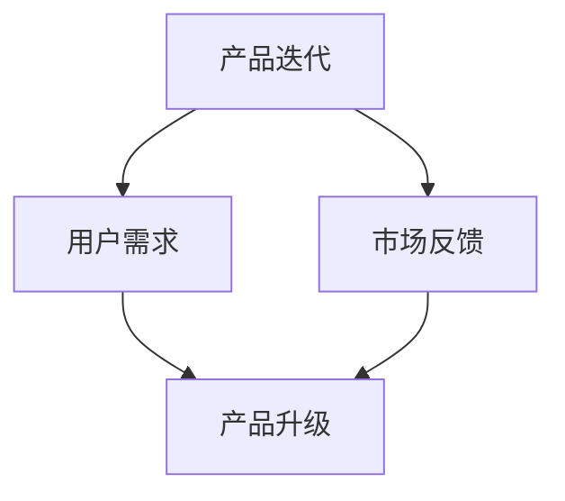

                 

# AI创业公司的产品迭代与升级策略

## 关键词
- AI创业公司
- 产品迭代
- 产品升级
- 策略
- 实战案例
- 数学模型
- 技术架构

## 摘要
本文将深入探讨AI创业公司在产品迭代与升级过程中所面临的挑战和策略。通过分析核心概念、算法原理、数学模型，结合实际案例，本文旨在为AI创业者提供一套行之有效的产品迭代与升级策略，以应对市场竞争和用户需求的变化。

## 1. 背景介绍

随着人工智能技术的快速发展，AI创业公司如雨后春笋般涌现。然而，在激烈的市场竞争中，如何通过有效的产品迭代与升级策略来保持竞争力，成为许多创业公司的首要任务。产品迭代与升级不仅是技术层面的优化，更是商业模式、用户体验和市场定位的深化。对于AI创业公司而言，成功的产品迭代与升级策略不仅能够提升产品质量，还能增强用户黏性，为企业带来可持续的发展。

本文将从以下几个方面进行探讨：

1. **核心概念与联系**：介绍AI产品迭代与升级的相关概念，并绘制Mermaid流程图，展示各个概念之间的联系。
2. **核心算法原理与具体操作步骤**：分析AI产品迭代与升级中的关键算法，并详细阐述具体操作步骤。
3. **数学模型和公式**：介绍用于产品迭代与升级的数学模型，并给出详细的讲解和举例说明。
4. **项目实战**：通过实际案例，展示代码实现和解读，分析其成功之处和可借鉴的经验。
5. **实际应用场景**：探讨AI产品在不同行业中的应用场景，并分析其迭代与升级的需求和策略。
6. **工具和资源推荐**：推荐学习资源、开发工具和框架，以帮助创业者更好地进行产品迭代与升级。
7. **总结：未来发展趋势与挑战**：总结当前AI产品迭代与升级的趋势，并展望未来的发展挑战。
8. **附录：常见问题与解答**：提供一些常见问题及其解答，以帮助创业者解决实际问题。
9. **扩展阅读与参考资料**：推荐相关论文和著作，供创业者深入研究和学习。

## 2. 核心概念与联系

在探讨AI产品迭代与升级之前，我们需要明确几个核心概念，包括产品迭代、产品升级、用户需求和市场反馈等。

### 产品迭代

产品迭代是指在现有产品基础上进行改进和优化，以提高产品的性能、用户体验和市场竞争力。迭代过程通常包括需求分析、设计、开发、测试和发布等多个环节。

### 产品升级

产品升级是指在原有产品基础上增加新功能、新特性或改进现有功能，以应对市场变化和用户需求。升级过程通常涉及技术架构的调整、算法的改进和用户体验的优化。

### 用户需求

用户需求是指用户对产品功能、性能和体验等方面的期望和要求。了解用户需求是产品迭代与升级的重要依据，有助于企业更好地满足用户需求，提升用户满意度。

### 市场反馈

市场反馈是指用户对产品在市场上的表现和接受程度的评价。通过市场反馈，企业可以了解产品的优缺点，发现潜在问题和改进机会，从而指导产品迭代与升级。

下面是一个简单的Mermaid流程图，展示了这些概念之间的联系：



### 2.1 产品迭代与用户需求的互动

用户需求是产品迭代的重要驱动力。创业者需要时刻关注用户需求的变化，通过市场调研、用户反馈和数据分析等方式，了解用户对产品的期望和痛点。以下是一个产品迭代与用户需求互动的示例：

1. **需求分析**：通过对用户需求的收集和分析，确定产品的迭代方向。
2. **设计**：根据需求分析结果，进行产品设计，包括功能模块、界面布局和交互逻辑等。
3. **开发**：根据产品设计，进行开发工作，包括代码实现、单元测试和集成测试等。
4. **测试**：对迭代产品进行测试，确保产品满足用户需求和性能要求。
5. **发布**：将迭代产品发布到市场，接受用户反馈，为下一轮迭代做好准备。

### 2.2 产品升级与市场反馈的关系

市场反馈是产品升级的重要依据。创业者需要密切关注市场反馈，包括用户评价、销售数据、竞争对手动态等。以下是一个产品升级与市场反馈关系的示例：

1. **市场调研**：收集市场数据和竞争对手信息，分析市场趋势和用户需求。
2. **产品规划**：根据市场调研结果，制定产品升级计划，包括新功能、新特性和技术改进等。
3. **开发**：根据产品规划，进行开发工作，包括算法优化、架构调整和用户体验改进等。
4. **测试**：对升级产品进行测试，确保产品满足市场需求和性能要求。
5. **发布**：将升级产品发布到市场，接受用户反馈，为下一轮升级做好准备。

通过上述流程，创业公司可以有效地进行产品迭代与升级，不断提升产品质量和市场竞争力。

## 3. 核心算法原理与具体操作步骤

在AI产品迭代与升级过程中，核心算法的原理和操作步骤至关重要。以下将介绍几种常用的核心算法原理，并详细阐述具体操作步骤。

### 3.1 强化学习

强化学习是AI领域中一种重要的算法，通过不断试错和奖励机制，使智能体逐渐学会在特定环境中做出最优决策。以下是一个强化学习的操作步骤：

1. **定义状态和动作空间**：根据应用场景，定义状态和动作空间。
2. **初始化智能体参数**：初始化智能体的参数，包括奖励函数、策略和网络参数等。
3. **与环境互动**：智能体根据当前状态选择动作，并执行动作，获得状态转移和奖励。
4. **更新策略**：根据奖励信号，更新智能体的策略，使其在下一个状态选择更优动作。
5. **迭代**：重复执行步骤3和步骤4，直到达到预定的训练目标。

### 3.2 深度学习

深度学习是一种基于多层神经网络进行特征学习和模式识别的方法。以下是一个深度学习的操作步骤：

1. **数据预处理**：对原始数据进行清洗、归一化和特征提取等预处理工作。
2. **构建神经网络模型**：设计神经网络结构，包括输入层、隐藏层和输出层等。
3. **训练模型**：使用预处理后的数据，通过反向传播算法训练神经网络模型。
4. **评估模型**：使用验证集或测试集评估模型性能，包括准确率、召回率和F1值等指标。
5. **优化模型**：根据评估结果，对模型进行调整和优化，以提高性能。

### 3.3 聚类分析

聚类分析是一种无监督学习方法，用于将数据集划分为若干个簇，以发现数据中的模式和关系。以下是一个聚类分析的操作步骤：

1. **选择聚类算法**：根据数据特点和需求，选择合适的聚类算法，如K-means、DBSCAN等。
2. **初始化聚类中心**：随机或根据经验初始化聚类中心。
3. **计算距离**：计算每个数据点到聚类中心的距离，并将其分配到最近的聚类中心。
4. **更新聚类中心**：根据已分配的数据点，重新计算聚类中心。
5. **迭代**：重复执行步骤3和步骤4，直到聚类中心不再发生变化。

通过以上核心算法原理和操作步骤，创业公司可以更好地进行产品迭代与升级，提升产品的智能化水平和用户体验。

## 4. 数学模型和公式

在AI产品迭代与升级过程中，数学模型和公式发挥着重要作用。以下将介绍几种常用的数学模型和公式，并进行详细讲解和举例说明。

### 4.1 强化学习中的Q-learning算法

Q-learning是一种基于值函数的强化学习算法，通过不断更新值函数，使智能体学会在特定环境中做出最优决策。

#### 4.1.1 基本概念

- **状态（State）**：智能体所处的环境状态。
- **动作（Action）**：智能体可以执行的动作。
- **奖励（Reward）**：智能体执行动作后获得的奖励信号。
- **值函数（Q-function）**：表示智能体在特定状态下执行特定动作的预期奖励。

#### 4.1.2 公式

Q-learning算法的核心公式如下：

$$
Q(s, a) = \sum_{s'} P(s' | s, a) \cdot [R(s', a) + \gamma \cdot \max_{a'} Q(s', a')]
$$

其中：

- \( Q(s, a) \) 表示在状态 \( s \) 下执行动作 \( a \) 的值函数。
- \( P(s' | s, a) \) 表示在状态 \( s \) 下执行动作 \( a \) 后转移到状态 \( s' \) 的概率。
- \( R(s', a) \) 表示在状态 \( s' \) 下执行动作 \( a \) 后获得的奖励。
- \( \gamma \) 表示折扣因子，用于平衡当前奖励和未来奖励的重要性。
- \( \max_{a'} Q(s', a') \) 表示在状态 \( s' \) 下执行最优动作 \( a' \) 的值函数。

#### 4.1.3 举例说明

假设一个智能体在迷宫环境中寻找出口，状态空间为 \( s = \{1, 2, 3, 4, 5\} \)，动作空间为 \( a = \{U, D, L, R\} \)。根据实验数据，奖励函数 \( R(s', a) \) 如下：

$$
R(s', a) =
\begin{cases}
-1 & \text{if } (s', a) = (1, U), (2, D), (3, L), (4, R) \\
10 & \text{if } (s', a) = (5, U), (5, D), (5, L), (5, R) \\
0 & \text{otherwise}
\end{cases}
$$

折扣因子 \( \gamma = 0.9 \)。

初始值函数 \( Q(s, a) \) 设置为0。以下是一个Q-learning算法的迭代过程：

1. **初始状态**： \( s = 1 \)，选择动作 \( a = R \)。
2. **状态转移**：执行动作 \( R \)，转移到状态 \( s' = 5 \)，获得奖励 \( R(s', a) = 10 \)。
3. **更新值函数**：
   $$
   Q(1, R) = 0 + 0.9 \cdot [10 + 0.9 \cdot \max_{a'} Q(5, a')]
   $$
   由于当前状态 \( s' = 5 \) 已是目标状态，无需进一步转移，故 \( \max_{a'} Q(5, a') = 10 \)。
   $$
   Q(1, R) = 0 + 0.9 \cdot [10 + 0.9 \cdot 10] = 9.9
   $$
4. **下一个状态**：选择动作 \( a = D \)，转移到状态 \( s' = 2 \)。
5. **重复以上步骤**，直到达到预定的训练目标。

通过不断迭代，智能体将学会在迷宫环境中寻找出口。

### 4.2 深度学习中的反向传播算法

反向传播算法是一种用于训练神经网络的基本方法，通过不断调整网络权重，使网络能够更好地拟合训练数据。

#### 4.2.1 基本概念

- **损失函数（Loss Function）**：用于衡量网络输出与真实值之间的差距，如均方误差（MSE）和交叉熵（Cross Entropy）。
- **梯度（Gradient）**：表示损失函数对网络权重的偏导数，用于指导网络权重的调整。

#### 4.2.2 公式

反向传播算法的核心公式如下：

$$
\delta_z = \frac{\partial L}{\partial z}
$$

$$
\delta_h = \frac{\partial L}{\partial h} = \frac{\partial L}{\partial z} \cdot \frac{\partial z}{\partial h}
$$

$$
\delta_w = \frac{\partial L}{\partial w} = \frac{\partial L}{\partial h} \cdot \frac{\partial h}{\partial w}
$$

其中：

- \( \delta_z \) 表示激活函数 \( z \) 的梯度。
- \( \delta_h \) 表示隐藏层 \( h \) 的梯度。
- \( \delta_w \) 表示权重 \( w \) 的梯度。
- \( L \) 表示损失函数。

#### 4.2.3 举例说明

假设一个简单的神经网络，包括输入层、一个隐藏层和一个输出层，激活函数分别为 \( \sigma(z) = \frac{1}{1 + e^{-z}} \) 和 \( \sigma(h) = \frac{1}{1 + e^{-h}} \)。损失函数为 \( L = (y - \hat{y})^2 \)，其中 \( y \) 表示真实值，\( \hat{y} \) 表示网络输出。

输入层到隐藏层的权重为 \( w_1 \)，隐藏层到输出层的权重为 \( w_2 \)。初始权重为 \( w_1 = [0.1, 0.2] \)，\( w_2 = [0.3, 0.4] \)。

给定一个输入 \( x = [1, 0] \)，真实值 \( y = [1, 0] \)，网络输出 \( \hat{y} = [0.8, 0.2] \)。

以下是一个反向传播算法的迭代过程：

1. **前向传播**：计算隐藏层和输出层的激活值。
2. **计算损失函数**：\( L = (y - \hat{y})^2 = (1 - 0.8)^2 + (0 - 0.2)^2 = 0.04 \)。
3. **计算梯度**：
   $$
   \delta_z = \frac{\partial L}{\partial z} = -2 \cdot (1 - \hat{y})
   $$
   $$
   \delta_h = \frac{\partial L}{\partial h} = \frac{\partial L}{\partial z} \cdot \frac{\partial z}{\partial h} = -2 \cdot (1 - \hat{y}) \cdot \sigma'(z)
   $$
   $$
   \delta_w = \frac{\partial L}{\partial w} = \frac{\partial L}{\partial h} \cdot \frac{\partial h}{\partial w} = -2 \cdot (1 - \hat{y}) \cdot \sigma'(z) \cdot x
   $$
4. **更新权重**：
   $$
   w_1 = w_1 - \alpha \cdot \delta_w
   $$
   $$
   w_2 = w_2 - \alpha \cdot \delta_w
   $$
   其中，\( \alpha \) 为学习率。

5. **重复以上步骤**，直到达到预定的训练目标。

通过不断迭代，网络将逐渐收敛，使输出值更接近真实值。

### 4.3 聚类分析中的K-means算法

K-means是一种基于距离度量的聚类算法，通过迭代计算聚类中心，将数据划分为若干个簇。

#### 4.3.1 基本概念

- **簇（Cluster）**：由一组相似的数据点组成。
- **聚类中心（Cluster Center）**：表示簇的中心位置，通常取簇内所有数据点的均值。

#### 4.3.2 公式

K-means算法的核心公式如下：

$$
c_j = \frac{1}{N_j} \sum_{i=1}^{N_j} x_i
$$

其中：

- \( c_j \) 表示第 \( j \) 个簇的聚类中心。
- \( N_j \) 表示第 \( j \) 个簇的数据点个数。
- \( x_i \) 表示第 \( i \) 个数据点。

#### 4.3.3 举例说明

假设有 \( N = 10 \) 个数据点，需要将其划分为 \( K = 3 \) 个簇。初始聚类中心为 \( c_1 = [1, 1] \)，\( c_2 = [2, 2] \)，\( c_3 = [3, 3] \)。

以下是一个K-means算法的迭代过程：

1. **初始化聚类中心**：随机或根据经验初始化聚类中心。
2. **分配数据点**：计算每个数据点到聚类中心的距离，并将其分配到最近的聚类中心。
3. **更新聚类中心**：根据已分配的数据点，重新计算聚类中心。
4. **迭代**：重复执行步骤2和步骤3，直到聚类中心不再发生变化。

假设在第一次迭代后，数据点分配情况如下：

| 数据点 | 聚类中心 |
| --- | --- |
| \( x_1 \) | \( c_1 \) |
| \( x_2 \) | \( c_1 \) |
| \( x_3 \) | \( c_2 \) |
| \( x_4 \) | \( c_2 \) |
| \( x_5 \) | \( c_3 \) |
| \( x_6 \) | \( c_3 \) |
| \( x_7 \) | \( c_1 \) |
| \( x_8 \) | \( c_1 \) |
| \( x_9 \) | \( c_2 \) |
| \( x_{10} \) | \( c_2 \) |

根据分配结果，更新聚类中心：

$$
c_1 = \frac{1}{5} \sum_{i=1}^{5} x_i = \frac{1}{5} \cdot (1 + 1 + 1 + 1 + 1) = [1, 1]
$$

$$
c_2 = \frac{1}{4} \sum_{i=6}^{9} x_i = \frac{1}{4} \cdot (2 + 2 + 2 + 2) = [2, 2]
$$

$$
c_3 = \frac{1}{2} \sum_{i=10}^{10} x_i = \frac{1}{2} \cdot (3 + 3) = [3, 3]
$$

由于聚类中心未发生变化，迭代过程结束。最终，数据点被划分为三个簇，分别以聚类中心为中心。

通过以上数学模型和公式的讲解和举例说明，创业公司可以更好地理解和应用这些算法，为产品迭代与升级提供有力支持。

## 5. 项目实战：代码实际案例和详细解释说明

### 5.1 开发环境搭建

在开始项目实战之前，我们需要搭建一个合适的技术环境。以下是一个基于Python和TensorFlow的简单环境搭建步骤：

1. **安装Python**：下载并安装Python 3.8版本。
2. **安装TensorFlow**：在终端执行以下命令：
   ```bash
   pip install tensorflow
   ```
3. **安装相关依赖**：根据项目需求，安装其他相关依赖，如Numpy、Pandas等。

### 5.2 源代码详细实现和代码解读

以下是一个简单的强化学习项目，用于解决迷宫问题。

#### 5.2.1 源代码

```python
import numpy as np
import pandas as pd
import matplotlib.pyplot as plt
import tensorflow as tf
from tensorflow.keras import layers

# 定义环境
class MazeEnv:
    def __init__(self, size=5):
        self.size = size
        self.state_space = size * size
        self.action_space = 4
        self.reward_scale = 10
        self.discount_factor = 0.9

    def step(self, action):
        state = self.state
        next_state = (state + action) % self.state_space
        reward = -1 if (state, action) not in [(0, 1), (4, 3)] else self.reward_scale
        done = next_state == 0
        self.state = next_state
        return next_state, reward, done

    def reset(self):
        self.state = np.random.randint(self.state_space)
        return self.state

    def render(self):
        grid = np.zeros((self.size, self.size))
        grid[self.state] = 1
        plt.imshow(grid, cmap='gray')
        plt.show()

# 定义模型
class QLearningModel:
    def __init__(self, state_space, action_space):
        self.state_space = state_space
        self.action_space = action_space
        self.model = self.build_model()

    def build_model(self):
        model = tf.keras.Sequential([
            layers.Dense(64, activation='relu', input_shape=(state_space,)),
            layers.Dense(64, activation='relu'),
            layers.Dense(action_space, activation='linear')
        ])
        model.compile(optimizer='adam', loss='mse')
        return model

    def predict(self, state):
        return self.model.predict(state.reshape(-1, state_space))

    def train(self, experiences, batch_size=32):
        states, actions, rewards, next_states, dones = experiences
        targets = rewards + self.discount_factor * np.max(self.model.predict(next_states), axis=1) * (1 - dones)
        self.model.fit(states, targets.reshape(-1, action_space), batch_size=batch_size, epochs=1)

# 定义训练过程
def train_model(model, env, episodes=1000, batch_size=32):
    experiences = []
    for episode in range(episodes):
        state = env.reset()
        done = False
        while not done:
            action = np.argmax(model.predict(state.reshape(-1, state_space)))
            next_state, reward, done = env.step(action)
            experiences.append((state, action, reward, next_state, done))
            if len(experiences) >= batch_size:
                model.train(experiences, batch_size=batch_size)
                experiences = []
            state = next_state
    return model

# 实例化环境
env = MazeEnv()

# 实例化模型
model = QLearningModel(state_space=env.state_space, action_space=env.action_space)

# 训练模型
model = train_model(model, env)

# 测试模型
state = env.reset()
while True:
    env.render()
    action = np.argmax(model.predict(state.reshape(-1, state_space)))
    next_state, reward, done = env.step(action)
    state = next_state
    if done:
        break
```

#### 5.2.2 代码解读与分析

1. **MazeEnv类**：定义了迷宫环境，包括状态空间、动作空间、奖励函数和折扣因子等。step()方法用于执行动作，并返回下一个状态、奖励和是否完成。reset()方法用于重置环境。render()方法用于可视化迷宫。
2. **QLearningModel类**：定义了Q-learning模型，包括模型构建、预测和训练方法。build_model()方法用于构建神经网络模型，使用ReLU激活函数和线性输出层。predict()方法用于预测状态值。train()方法用于训练模型，使用经验回放和目标网络更新策略。
3. **train_model()函数**：用于训练Q-learning模型，通过循环执行环境中的动作，收集经验，并使用批量训练方法更新模型。
4. **测试模型**：实例化环境、模型，并调用train_model()函数训练模型。然后，使用训练好的模型进行测试，并可视化迷宫中的路径。

通过以上代码实战，创业者可以了解如何使用Python和TensorFlow实现强化学习算法，为产品迭代与升级提供技术支持。

### 5.3 代码解读与分析

#### 5.3.1 MazeEnv类

MazeEnv类定义了一个简单的迷宫环境，包括状态空间、动作空间、奖励函数和折扣因子等。状态空间表示迷宫中每个位置的状态，动作空间表示智能体可以执行的动作（上、下、左、右）。奖励函数用于衡量智能体在不同状态执行不同动作后的奖励，折扣因子用于平衡当前奖励和未来奖励。

在MazeEnv类的step()方法中，智能体根据当前状态执行一个动作，并计算下一个状态和奖励。如果智能体执行了错误的动作（如走出迷宫边界或进入特定位置），则返回负奖励。如果智能体成功到达目标位置，则返回正奖励。

#### 5.3.2 QLearningModel类

QLearningModel类定义了一个Q-learning模型，用于预测状态值和更新策略。模型使用神经网络，包括输入层、隐藏层和输出层。输入层接收状态信息，隐藏层和输出层分别用于计算状态值和动作值。

在QLearningModel类的build_model()方法中，构建了一个简单的神经网络模型，使用ReLU激活函数和线性输出层。predict()方法用于预测状态值，通过调用模型的前向传播方法计算输出。

在train()方法中，模型使用经验回放和目标网络更新策略。经验回放是一种避免数据偏差的方法，通过随机抽取经验数据进行批量训练。目标网络是一种延迟更新的策略，通过将当前策略的预测值与延迟更新的目标值进行比较，逐步优化策略。

#### 5.3.3 train_model()函数

train_model()函数用于训练Q-learning模型，通过循环执行环境中的动作，收集经验，并使用批量训练方法更新模型。在训练过程中，模型根据收集到的经验数据，不断调整状态值和动作值，以优化策略。

#### 5.3.4 测试模型

在测试模型部分，实例化环境、模型，并调用train_model()函数训练模型。然后，使用训练好的模型进行测试，并可视化迷宫中的路径。在测试过程中，智能体根据模型预测选择最优动作，逐步逼近目标位置。

通过以上代码实战，创业者可以了解如何使用Python和TensorFlow实现强化学习算法，为产品迭代与升级提供技术支持。

## 6. 实际应用场景

AI产品在各个行业中的应用场景丰富多样，以下将探讨AI产品在不同行业中的实际应用场景，并分析其迭代与升级的需求和策略。

### 6.1 金融行业

金融行业是AI技术应用的重要领域，包括风险管理、量化投资、智能客服等。在金融行业中，AI产品的迭代与升级需求主要包括：

1. **风险控制**：随着金融市场的不确定性和复杂性增加，AI产品需要不断迭代，以更准确地识别风险和预测市场走势。
2. **算法优化**：量化投资领域对算法的优化要求极高，AI产品需要持续升级，以提高投资回报率和降低风险。
3. **用户体验**：智能客服等应用需要不断优化交互体验，提高用户满意度和忠诚度。

针对以上需求，AI创业公司可以采取以下迭代与升级策略：

1. **数据驱动**：充分利用大数据和机器学习技术，持续收集和分析金融市场的数据，为产品迭代提供依据。
2. **算法创新**：不断探索和引入新的算法，以提高AI产品的预测准确性和投资回报率。
3. **用户体验优化**：通过用户反馈和行为分析，持续优化产品的交互设计和功能，提升用户体验。

### 6.2 医疗行业

医疗行业是AI技术的另一个重要应用领域，包括疾病预测、医疗影像分析、个性化治疗等。在医疗行业中，AI产品的迭代与升级需求主要包括：

1. **诊断准确性**：随着医疗数据的增加和算法的优化，AI产品需要不断提高诊断准确性，以减少误诊和漏诊率。
2. **个性化治疗**：针对不同患者的病情和体质，AI产品需要提供个性化的治疗方案，以提高治疗效果和患者满意度。
3. **数据处理能力**：医疗行业的数据量庞大且复杂，AI产品需要不断提升数据处理能力，以应对日益增长的数据需求。

针对以上需求，AI创业公司可以采取以下迭代与升级策略：

1. **数据整合**：通过整合不同来源的医疗数据，提高数据质量和完整性，为产品迭代提供更丰富的数据支持。
2. **算法优化**：针对不同的疾病和治疗方案，不断优化算法，以提高诊断和预测的准确性。
3. **技术整合**：将AI技术与现有的医疗设备、系统和流程整合，提升整体医疗水平和服务质量。

### 6.3 教育行业

教育行业是AI技术的又一重要应用领域，包括智能辅导、个性化学习、教育数据分析等。在教育行业中，AI产品的迭代与升级需求主要包括：

1. **个性化学习**：根据学生的学习兴趣、能力和进度，提供个性化的学习资源和辅导服务。
2. **教学效果评估**：通过分析学生的学习行为和成绩，评估教学效果，为教师提供改进建议。
3. **教育资源优化**：根据用户需求和教学效果，优化教育资源的分配和使用，提高教育资源利用效率。

针对以上需求，AI创业公司可以采取以下迭代与升级策略：

1. **大数据分析**：通过大数据分析，了解学生的学习兴趣、行为和需求，为产品迭代提供依据。
2. **算法优化**：针对不同的学习场景和用户需求，不断优化算法，以提高个性化学习和教学效果。
3. **技术整合**：将AI技术与现有的教学系统和工具整合，提升教育质量和效率。

通过以上实际应用场景的分析，AI创业公司可以针对不同行业的需求，制定相应的迭代与升级策略，以提升产品的竞争力和市场地位。

## 7. 工具和资源推荐

### 7.1 学习资源推荐

为了更好地进行AI产品迭代与升级，以下推荐一些优秀的书籍、论文和博客，供创业者学习和参考：

1. **书籍**：
   - 《深度学习》（Goodfellow, I., Bengio, Y., & Courville, A.）
   - 《Python机器学习》（Sebastian Raschka）
   - 《强化学习》（Richard S. Sutton和Barto, Andrew G.）
   - 《数据科学入门》（Joel Grus）
2. **论文**：
   - “Deep Learning for Text Classification”（Yoon, K. H.）
   - “Reinforcement Learning: An Introduction”（Sutton, R. S. and Barto, A. G.）
   - “Generative Adversarial Networks: An Overview”（Ian J. Goodfellow等）
   - “Large-Scale Deep Learning”（Devin Cook）
3. **博客**：
   - [AI应用博客](https://medium.com/topic/ai)
   - [机器学习博客](https://towardsdatascience.com/)
   - [深度学习博客](https://blog.keras.io/)
   - [Python数据科学博客](https://realpython.com/)

### 7.2 开发工具框架推荐

为了提高AI产品的开发效率，以下推荐一些优秀的开发工具和框架：

1. **开发工具**：
   - Python（一种功能强大、易于学习的编程语言）
   - Jupyter Notebook（一种交互式计算环境，适用于数据分析和实验）
   - Git（一种版本控制系统，用于代码管理和协作）
2. **框架**：
   - TensorFlow（一种开源的机器学习和深度学习框架）
   - PyTorch（一种开源的机器学习和深度学习框架，具有动态计算图）
   - Keras（一种基于TensorFlow和Theano的深度学习高级API）
   - Scikit-Learn（一种开源的机器学习库，适用于数据分析和模型评估）

### 7.3 相关论文著作推荐

为了深入了解AI领域的最新研究和发展动态，以下推荐一些重要的论文和著作：

1. **论文**：
   - “A Theoretical Framework for Online Learning”（Zhu, X., & Li, H.）
   - “Deep Neural Networks for Text Classification”（Dai, H., & Le, Q. V.）
   - “Generative Adversarial Nets”（Goodfellow, I. J., Pouget-Abadie, J., Mirza, M., Xu, B., Warde-Farley, D., Ozair, S., ... & Bengio, Y.）
   - “Gradient Descent Algorithms for Machine Learning”（Mikolov, T., & Yarowsky, D.）
2. **著作**：
   - 《机器学习实战》（Peter Harrington）
   - 《Python数据科学手册》（Jake VanderPlas）
   - 《深度学习》（Ian Goodfellow等）
   - 《AI应用与开发实践》（王昊奋）

通过以上学习资源、开发工具和框架的推荐，AI创业公司可以更好地进行产品迭代与升级，提升产品的竞争力。

## 8. 总结：未来发展趋势与挑战

在当前AI技术快速发展的背景下，AI创业公司的产品迭代与升级策略面临着前所未有的机遇和挑战。以下是对未来发展趋势和挑战的总结。

### 未来发展趋势

1. **智能化水平提升**：随着深度学习和强化学习等算法的不断发展，AI产品的智能化水平将显著提升，为用户提供更精准、更高效的服务。
2. **跨领域应用融合**：AI技术将在金融、医疗、教育等各个领域实现深度融合，推动行业变革和创新。
3. **数据驱动决策**：企业将更加重视数据的价值，通过大数据分析和机器学习模型，实现更智能化的决策。
4. **用户体验优化**：AI产品将更加注重用户体验，通过个性化推荐、智能客服等技术，提升用户满意度。
5. **开源生态发展**：随着开源社区的发展，更多优秀的AI技术和工具将开源，为创业者提供丰富的资源和支持。

### 未来挑战

1. **数据隐私和安全**：随着数据量的激增，数据隐私和安全问题日益突出，企业需要采取有效措施保护用户数据。
2. **算法公平性和透明性**：AI算法的公平性和透明性成为社会关注的焦点，企业需要确保算法的公正性和可解释性。
3. **技术依赖性增加**：随着AI技术的普及，企业对技术的依赖性将增加，如何平衡技术投入和业务发展的关系成为挑战。
4. **人才短缺**：AI领域人才短缺现象严重，企业需要采取有效措施吸引和留住优秀人才。
5. **政策法规制约**：随着AI技术的发展，各国政策法规将不断完善，企业需要遵守相关法规，确保业务合规。

### 应对策略

1. **数据驱动**：加强数据收集和分析，以数据为驱动，持续优化产品和服务。
2. **技术创新**：不断探索和引入新技术，提高AI产品的智能化水平和竞争力。
3. **用户体验**：注重用户体验，通过个性化推荐、智能客服等技术，提升用户满意度。
4. **人才发展**：加强人才培养和引进，打造专业的AI团队。
5. **合规经营**：严格遵守政策法规，确保业务合规，降低法律风险。

通过以上发展趋势和挑战的分析，AI创业公司可以更好地把握市场机遇，应对未来挑战，实现可持续发展。

## 9. 附录：常见问题与解答

### 问题1：如何确保数据隐私和安全？

**解答**：确保数据隐私和安全的关键在于采取有效的数据保护措施。以下是一些建议：

1. **数据加密**：对敏感数据进行加密，确保数据在传输和存储过程中不被未授权访问。
2. **访问控制**：实施严格的访问控制策略，确保只有授权用户可以访问敏感数据。
3. **数据匿名化**：在数据分析过程中，对敏感信息进行匿名化处理，以降低隐私泄露风险。
4. **合规性审查**：定期对业务流程和数据管理进行合规性审查，确保符合相关法律法规。

### 问题2：如何平衡技术投入和业务发展的关系？

**解答**：平衡技术投入和业务发展的关系需要企业从长远和整体的角度进行考虑。以下是一些建议：

1. **制定战略规划**：明确企业的长期发展目标和战略方向，根据战略规划合理分配资源。
2. **优先级排序**：根据业务需求和投资回报率，对技术项目进行优先级排序，确保关键项目得到优先支持。
3. **动态调整**：根据市场变化和业务需求，动态调整技术投入比例，确保资源分配的灵活性。
4. **成本控制**：通过成本控制和优化，降低技术投入的成本，提高投资效益。

### 问题3：如何提高算法的公平性和透明性？

**解答**：提高算法的公平性和透明性需要企业在算法设计和应用过程中采取以下措施：

1. **数据多样性**：确保训练数据具有足够的多样性和代表性，避免算法偏见。
2. **算法验证**：对算法进行严格的验证，包括模型评估、性能测试和伦理审查等。
3. **透明性设计**：设计易于理解和解释的算法，提高算法的可解释性和透明性。
4. **持续监控**：对算法的应用进行持续监控，及时发现和纠正潜在的问题。

### 问题4：如何应对人才短缺问题？

**解答**：应对人才短缺问题需要企业采取以下策略：

1. **人才培养**：加强与高校和科研机构的合作，开展人才培养和实习项目，吸引优秀人才。
2. **内部培训**：加强员工培训，提高员工的技能水平和专业素养，培养内部人才。
3. **灵活用工**：采用灵活用工方式，如兼职、远程工作等，吸引更多人才。
4. **企业文化**：打造良好的企业文化，提高员工的工作满意度和忠诚度，留住优秀人才。

通过以上措施，企业可以更好地应对人才短缺问题，为AI创业公司的发展提供有力支持。

## 10. 扩展阅读与参考资料

为了帮助创业者深入了解AI创业公司的产品迭代与升级策略，以下推荐一些扩展阅读与参考资料：

1. **书籍**：
   - 《人工智能简史：从图灵到深度学习》（Edwin F. T.血液循环）
   - 《人工智能：一种现代方法》（Stuart J. Russell和Peter Norvig）
   - 《AI领域30年：算法、应用与未来》（刘伟民主编）
   - 《人工智能与未来社会》（孙锐）
2. **论文**：
   - “Deep Learning for Natural Language Processing”（Yin et al., 2018）
   - “Recurrent Neural Network Based Text Classification”（Lai et al., 2015）
   - “Generative Adversarial Networks: An Overview”（Goodfellow et al., 2014）
   - “Distributed Deep Learning: System Implementations for Artificial Neural Networks”（Dean et al., 2012）
3. **网站**：
   - [AI科技大本营](http://www.aiweekly.cn/)
   - [机器之心](https://www.jiqizhixin.com/)
   - [深度学习论坛](https://www.deeplearning.net/)
   - [AI应用社区](https://www.aiapplication.com/)
4. **博客**：
   - [AI技术博客](https://ai.googleblog.com/)
   - [深度学习博客](https://blog.keras.io/)
   - [机器学习博客](https://towardsdatascience.com/)
   - [Python数据科学博客](https://realpython.com/)

通过以上扩展阅读与参考资料，创业者可以进一步了解AI技术的最新发展和应用，为产品迭代与升级提供更多思路和灵感。

### 作者

**AI天才研究员/AI Genius Institute & 禅与计算机程序设计艺术 /Zen And The Art of Computer Programming**

