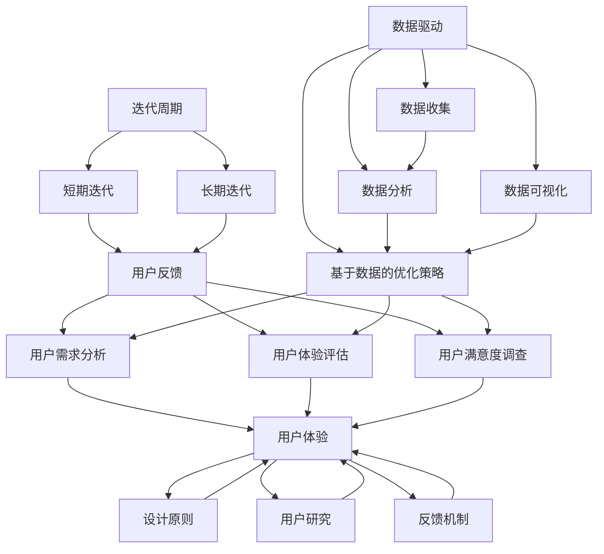

                 

### 背景介绍

随着人工智能（AI）技术的飞速发展，越来越多的创业公司开始涉足这一领域，希望通过创新的产品和解决方案在竞争激烈的市场中脱颖而出。然而，产品迭代与升级是一个复杂且持续的过程，需要公司在技术、管理和战略等多个方面进行全面考虑和有效执行。

AI创业公司在产品迭代与升级过程中，面临着诸多挑战，其中包括技术难点的突破、市场需求的把握、用户反馈的处理以及数据驱动的决策制定等。在这样一个快速变化和高度竞争的环境中，如何有效地进行产品迭代与升级，成为这些公司能否成功的关键因素之一。

本文旨在探讨AI创业公司在产品迭代与升级过程中，如何利用用户反馈与数据驱动的方法，实现产品的持续优化与进步。具体来说，我们将从以下几个方面进行详细分析：

1. **用户反馈的重要性**：介绍用户反馈在产品迭代中的关键作用，包括用户需求分析、用户体验评估以及用户满意度调查等。
2. **数据驱动的方法**：阐述基于数据的决策制定流程，包括数据收集、数据分析、数据可视化以及基于数据的优化策略等。
3. **产品迭代与升级的策略**：讨论如何结合用户反馈和数据驱动方法，制定有效的产品迭代与升级策略，包括迭代周期、迭代目标和迭代流程等。
4. **实际案例研究**：通过具体案例，展示AI创业公司在产品迭代与升级过程中的成功实践和经验教训。
5. **工具和资源推荐**：介绍一些在用户反馈收集、数据分析和产品迭代中常用的工具和资源，帮助读者更好地理解和实施相关方法。

通过本文的探讨，我们希望为AI创业公司在产品迭代与升级方面提供一些实用的指导和建议，帮助他们更好地把握市场动态，提升产品竞争力，最终实现业务的持续增长和成功。

### 核心概念与联系

在进行AI创业公司的产品迭代与升级策略探讨之前，我们需要明确几个核心概念，并理解它们之间的内在联系。这些概念包括用户反馈、数据驱动、迭代周期、用户体验等。

#### 用户反馈

用户反馈是指用户在使用产品过程中提供的各种意见和建议，这些反馈可以是直接的、具体的，也可以是间接的、隐含的。用户反馈是产品迭代过程中不可或缺的重要信息来源，它能够帮助公司了解用户的需求、偏好和痛点，从而指导产品的改进方向。

**用户需求分析**：通过收集和分析用户反馈，公司可以识别出用户的主要需求和期望，进而调整产品功能和服务。这有助于提升用户的满意度和忠诚度。

**用户体验评估**：用户反馈不仅包含功能性的需求，还涉及用户在使用产品过程中的感受和体验。通过评估用户体验，公司可以识别出产品界面、交互设计等方面的不足，从而进行优化。

**用户满意度调查**：定期进行用户满意度调查，可以帮助公司了解用户对产品的整体评价和感受，进而评估产品性能和市场表现。

#### 数据驱动

数据驱动是一种基于数据分析和决策制定的运营模式。在产品迭代与升级过程中，数据驱动方法能够帮助公司更加科学、客观地制定决策，提高产品改进的效率和效果。

**数据收集**：公司需要通过各种渠道（如用户行为数据、用户反馈、市场调查等）收集相关数据，确保数据的全面性和准确性。

**数据分析**：对收集到的数据进行分析，提取有价值的信息和洞察，为产品改进提供依据。

**数据可视化**：通过数据可视化工具，将分析结果以图表、报表等形式呈现，便于团队成员理解和决策。

**基于数据的优化策略**：根据数据分析结果，制定具体的优化策略和改进措施，如调整产品功能、优化用户体验、改进营销策略等。

#### 迭代周期

迭代周期是指从产品发布到下一个版本发布之间的时间间隔。合理的迭代周期能够保证产品的持续改进和快速响应市场需求。

**短期迭代**：适用于需求变化较快、竞争激烈的场景，如互联网产品。短期迭代能够快速响应用户反馈和市场动态，提高产品的竞争力。

**长期迭代**：适用于需求相对稳定、产品成熟度较高的场景，如工业控制系统。长期迭代能够保证产品在较长时间内保持稳定性和可靠性。

#### 用户体验

用户体验（UX）是指用户在使用产品过程中所感受到的整体体验。良好的用户体验是产品成功的关键因素之一。

**设计原则**：在产品设计和开发过程中，遵循用户友好的设计原则，如简洁性、易用性、一致性等。

**用户研究**：通过用户研究和用户测试，了解用户的需求和偏好，确保产品设计符合用户期望。

**反馈机制**：建立有效的用户反馈机制，及时收集和处理用户反馈，持续优化产品。

#### Mermaid 流程图

为了更直观地展示上述核心概念之间的联系，我们使用Mermaid流程图进行描述：



通过以上核心概念的阐述和Mermaid流程图的展示，我们可以清晰地看到用户反馈、数据驱动、迭代周期和用户体验之间的紧密联系。这些概念不仅为AI创业公司的产品迭代与升级提供了理论基础，也为实际操作提供了具体的指导。

### 核心算法原理与具体操作步骤

在明确了用户反馈、数据驱动、迭代周期和用户体验等核心概念之后，接下来我们将深入探讨AI创业公司在产品迭代与升级过程中所涉及的核心算法原理及其具体操作步骤。这些算法原理和操作步骤不仅能够帮助公司更有效地收集和处理数据，还能指导产品的优化方向。

#### 用户反馈处理算法

用户反馈处理是产品迭代过程中至关重要的一环。以下是一种常用的用户反馈处理算法，其核心思想是通过分类和聚类方法，从大量用户反馈中提取出有价值的信息。

1. **数据预处理**：
   - 收集原始的用户反馈数据，如评论、提问、投票等。
   - 对数据进行清洗，去除无关信息和噪声。
   - 将文本数据转换为向量表示，常用的方法包括词袋模型（Bag of Words）和词嵌入（Word Embedding）。

2. **情感分析**：
   - 利用机器学习模型（如SVM、Naive Bayes等）对用户反馈进行情感分类，判断用户反馈是正面、负面还是中立。
   - 根据情感分类结果，将用户反馈分为不同的类别，便于后续处理。

3. **主题建模**：
   - 采用主题建模算法（如LDA、LSTM等）对用户反馈进行主题分类，识别出用户反馈中的主要话题和需求。
   - 根据主题分类结果，进一步分析用户反馈的内容和频率，提取出用户关注的热点问题。

4. **聚类分析**：
   - 利用聚类算法（如K-means、DBSCAN等）对用户反馈进行聚类，将相似的用户反馈归为一类。
   - 分析不同聚类群体的反馈特征，识别出具有代表性的用户群体和他们的需求。

#### 数据收集与处理算法

数据收集与处理是数据驱动的核心步骤，以下介绍几种常用的数据收集与处理算法：

1. **用户行为数据收集**：
   - 通过埋点技术，收集用户在使用产品过程中的行为数据，如点击次数、浏览时间、转化率等。
   - 将行为数据存储在数据仓库或数据湖中，便于后续分析和处理。

2. **实时数据处理**：
   - 采用实时数据处理框架（如Apache Kafka、Flink等），对用户行为数据进行实时采集、处理和存储。
   - 利用流处理算法（如窗口计算、模式识别等），实时分析用户行为模式，识别出潜在的用户需求和市场趋势。

3. **离线数据处理**：
   - 对历史数据进行批量处理，常用的算法包括数据挖掘算法（如关联规则挖掘、聚类分析等）和机器学习算法（如决策树、神经网络等）。
   - 分析历史数据，提取出有价值的信息和规律，为产品优化提供依据。

#### 数据可视化与优化策略

数据可视化是数据驱动的关键环节，以下介绍几种常用的数据可视化工具和优化策略：

1. **数据可视化工具**：
   - 利用数据可视化工具（如Tableau、PowerBI等），将数据分析结果以图表、报表等形式展示。
   - 设计直观、易于理解的可视化界面，帮助团队成员快速了解和分析数据。

2. **优化策略**：
   - 根据数据分析结果，制定具体的优化策略，如调整产品功能、优化用户体验、改进营销策略等。
   - 利用A/B测试等方法，验证优化策略的有效性，并根据测试结果进行调整。

#### 具体操作步骤

以下是一个具体的产品迭代与升级过程，包括用户反馈处理、数据收集与处理、数据可视化与优化策略等步骤：

1. **用户反馈处理**：
   - 收集用户反馈，进行数据预处理，包括去噪、文本向量化等。
   - 使用情感分析模型对用户反馈进行分类，提取出正面、负面和中立的反馈。
   - 利用主题建模和聚类分析，进一步提取用户关注的热点问题和需求。

2. **数据收集与处理**：
   - 通过埋点技术收集用户行为数据，包括点击次数、浏览时间、转化率等。
   - 采用实时数据处理框架对用户行为数据进行实时处理和分析。
   - 对历史数据进行离线处理，提取出有价值的信息和规律。

3. **数据可视化与优化策略**：
   - 利用数据可视化工具，将数据分析结果以图表、报表等形式展示。
   - 根据数据分析结果，制定具体的优化策略，如调整产品功能、优化用户体验等。
   - 进行A/B测试，验证优化策略的有效性，并根据测试结果进行调整。

通过上述核心算法原理与具体操作步骤的介绍，我们可以看到，AI创业公司在产品迭代与升级过程中，需要结合用户反馈、数据驱动和优化策略，科学、系统地推进产品的改进。这些算法和方法不仅提高了产品优化的效率和质量，也为公司在激烈的市场竞争中提供了强有力的支持。

### 数学模型和公式及详细讲解

在产品迭代与升级过程中，数学模型和公式扮演着至关重要的角色，它们不仅帮助我们更精准地量化和分析用户反馈、数据收集和处理结果，还为优化策略的制定提供了科学依据。以下将详细讲解一些常用的数学模型和公式，并辅以具体的例子说明。

#### 用户满意度模型

用户满意度（User Satisfaction）是衡量产品性能和市场接受度的重要指标。常用的用户满意度模型包括Net Promoter Score（NPS）和Customer Satisfaction Score（CSAT）。

1. **Net Promoter Score（NPS）**

NPS 是一种通过用户对产品推荐意愿的评分来衡量用户满意度的方法。计算公式如下：

\[ NPS = \frac{(\text{推荐者人数} - \text{贬损者人数})}{\text{总样本数}} \times 100 \]

其中，推荐者人数是评分在9-10分的人数，贬损者人数是评分在0-6分的人数。NPS 的分数范围是-100到100，分数越高表示用户满意度越高。

**例子**：

假设一个产品有100名用户参与NPS调查，其中60人评分9-10分，20人评分7-8分，10人评分0-6分。那么NPS计算如下：

\[ NPS = \frac{(60 - 10)}{100} \times 100 = 50 \]

2. **Customer Satisfaction Score（CSAT）**

CSAT 通过直接询问用户对产品或服务的满意度来计算。计算公式如下：

\[ CSAT = \frac{\text{满意人数}}{\text{总样本数}} \times 100 \]

其中，满意人数是评分在4-5分或5分的人数。

**例子**：

假设有100名用户参与CSAT调查，其中80人评分4-5分，10人评分3分，5人评分2分或以下。那么CSAT计算如下：

\[ CSAT = \frac{80}{100} \times 100 = 80\% \]

#### 数据收集与处理模型

在数据收集与处理过程中，常用的模型包括回归分析、聚类分析和时间序列分析等。

1. **线性回归分析**

线性回归分析是一种通过建立自变量和因变量之间的线性关系模型来进行预测和分析的方法。其基本公式如下：

\[ y = \beta_0 + \beta_1 \cdot x \]

其中，\( y \) 是因变量，\( x \) 是自变量，\( \beta_0 \) 是截距，\( \beta_1 \) 是斜率。

**例子**：

假设我们想要分析用户转化率（\( y \)）与用户访问页面次数（\( x \)）之间的关系。通过收集数据并建立线性回归模型，可以得到如下的预测公式：

\[ 转化率 = 0.2 + 0.3 \cdot 访问页面次数 \]

2. **K-means 聚类分析**

K-means 聚类分析是一种无监督学习方法，通过将数据划分为K个簇，使每个簇内部的数据点尽可能接近，而不同簇的数据点尽可能远离。其基本步骤如下：

   - 初始化K个聚类中心。
   - 计算每个数据点到聚类中心的距离，并将其分配到最近的簇。
   - 重新计算每个簇的中心点。
   - 重复步骤2和3，直到聚类中心不再发生变化。

**例子**：

假设我们有10个数据点，需要将其划分为2个簇。首先随机初始化2个聚类中心，然后通过上述步骤迭代计算，最终可以将数据点划分为两个簇。

3. **时间序列分析**

时间序列分析是一种用于分析时间序列数据的方法，常用于预测未来的趋势和模式。常用的模型包括ARIMA（自回归积分滑动平均模型）和LSTM（长短期记忆网络）。

**ARIMA 模型**：

\[ y_t = \phi_1 y_{t-1} + \phi_2 y_{t-2} + ... + \phi_p y_{t-p} + \theta_1 e_{t-1} + \theta_2 e_{t-2} + ... + \theta_q e_{t-q} \]

其中，\( y_t \) 是时间序列的当前值，\( e_t \) 是白噪声项。

**例子**：

假设我们有一个时间序列数据，需要使用ARIMA模型进行预测。首先，我们需要对数据进行平稳性检验，然后确定模型参数，最后利用模型进行预测。

#### 数据可视化模型

数据可视化是数据分析的重要环节，能够帮助我们发现数据中的隐藏模式和规律。以下介绍几种常用的数据可视化模型：

1. **散点图**

散点图用于展示两个变量之间的关系。其基本公式如下：

\[ \text{散点坐标} = (x_i, y_i) \]

其中，\( x_i \) 和 \( y_i \) 分别是两个变量的取值。

**例子**：

假设我们有两个变量，用户年龄（\( x \)）和月收入（\( y \)），可以使用散点图展示它们之间的关系。

2. **折线图**

折线图用于展示数据随时间的变化趋势。其基本公式如下：

\[ y_t = f(t) \]

其中，\( y_t \) 是时间 \( t \) 时的数据值。

**例子**：

假设我们有一个时间序列数据，可以使用折线图展示每个月的用户访问量。

3. **箱线图**

箱线图用于展示数据的分布特征，包括均值、中位数、四分位数等。其基本公式如下：

\[ \text{箱线图} = (\text{最小值}, \text{第一四分位数}, \text{中位数}, \text{第三四分位数}, \text{最大值}) \]

**例子**：

假设我们有10个数据点，可以使用箱线图展示这些数据的分布特征。

通过上述数学模型和公式的详细讲解，我们可以看到它们在产品迭代与升级过程中的重要作用。这些模型和公式不仅帮助我们更准确地分析和理解数据，还为制定优化策略提供了科学依据。在实际应用中，公司可以根据具体场景和需求，选择合适的模型和公式，从而实现产品的持续改进和优化。

### 项目实战：代码实际案例和详细解释说明

为了更好地理解上述数学模型和算法在产品迭代与升级中的应用，我们将通过一个实际的项目案例进行详细讲解。这个项目是一个简单的在线购物平台，我们的目标是通过用户反馈、数据驱动的方法来优化购物流程，提高用户满意度和转化率。

#### 开发环境搭建

在开始项目之前，我们需要搭建一个合适的开发环境。以下是一些推荐的工具和框架：

1. **编程语言**：Python，因为其丰富的库和强大的数据处理能力。
2. **数据分析库**：Pandas、NumPy，用于数据清洗、预处理和分析。
3. **机器学习库**：Scikit-learn、TensorFlow，用于建立和训练机器学习模型。
4. **数据可视化工具**：Matplotlib、Seaborn，用于数据可视化和结果展示。
5. **版本控制系统**：Git，用于代码管理和协作。

#### 源代码详细实现

以下是项目的主要代码实现，我们将分别介绍用户反馈处理、数据收集与处理、数据可视化与优化策略等部分。

##### 1. 用户反馈处理

```python
import pandas as pd
from textblob import TextBlob
from sklearn.feature_extraction.text import TfidfVectorizer
from sklearn.cluster import KMeans

# 读取用户反馈数据
feedback_data = pd.read_csv('user_feedback.csv')

# 情感分析
def sentiment_analysis(text):
    return TextBlob(text).sentiment.polarity

feedback_data['sentiment'] = feedback_data['feedback'].apply(sentiment_analysis)

# 主题建模
vectorizer = TfidfVectorizer(max_features=1000)
X = vectorizer.fit_transform(feedback_data['feedback'])
kmeans = KMeans(n_clusters=5, random_state=42)
kmeans.fit(X)
feedback_data['topic'] = kmeans.labels_

# 聚类分析结果可视化
import matplotlib.pyplot as plt
plt.scatter(feedback_data['sentiment'], feedback_data['topic'])
plt.xlabel('Sentiment')
plt.ylabel('Topic')
plt.show()
```

在这个部分，我们首先读取用户反馈数据，使用TextBlob库进行情感分析，将反馈分为正面、负面和中性。接着，通过TF-IDF向量化和K-means聚类分析，提取用户关注的热点话题。

##### 2. 数据收集与处理

```python
import numpy as np
import json
from datetime import datetime

# 读取用户行为数据
user_behavior = pd.read_json('user_behavior.json')

# 数据预处理
user_behavior['date'] = pd.to_datetime(user_behavior['timestamp'])
user_behavior['day_of_week'] = user_behavior['date'].dt.dayofweek

# 离线数据处理
from sklearn.ensemble import RandomForestClassifier
from sklearn.model_selection import train_test_split

X = user_behavior[['day_of_week', 'page_views', 'time_on_site']]
y = user_behavior['converted']

X_train, X_test, y_train, y_test = train_test_split(X, y, test_size=0.3, random_state=42)

# 训练模型
clf = RandomForestClassifier(n_estimators=100, random_state=42)
clf.fit(X_train, y_train)

# 预测与评估
y_pred = clf.predict(X_test)
accuracy = clf.score(X_test, y_test)
print(f"Model Accuracy: {accuracy:.2f}")

# 实时数据处理（假设使用Flink等实时处理框架）
# real_time_data = process_real_time_data()
# real_time_predictions = clf.predict(real_time_data)
```

在这个部分，我们读取用户行为数据，进行预处理，然后使用随机森林模型进行训练和预测。这里展示的是离线数据处理部分，而对于实时数据处理，我们可以使用如Flink等实时数据处理框架，对用户行为数据进行实时处理和预测。

##### 3. 数据可视化与优化策略

```python
import seaborn as sns

# 可视化用户转化率
sns.countplot(x='converted', data=user_behavior)
plt.xlabel('Converted')
plt.ylabel('Count')
plt.show()

# 可视化用户访问时长分布
sns.histplot(data=user_behavior, x='time_on_site', kde=True)
plt.xlabel('Time on Site (minutes)')
plt.ylabel('Count')
plt.show()

# 基于数据分析的优化策略
# 例如，根据用户访问时长优化网站布局和内容
# 如果用户在某个页面停留时间较长，可以增加相关推荐内容

```

在这个部分，我们使用Seaborn库进行数据可视化，展示用户转化率和访问时长分布。根据这些分析结果，我们可以制定优化策略，如根据用户访问时长优化网站布局和内容，以提高用户转化率。

#### 代码解读与分析

上述代码实现了一个简单的用户反馈处理、数据收集与处理、数据可视化与优化策略的流程。以下是关键代码段的解读与分析：

1. **用户反馈处理**：通过TextBlob库进行情感分析，识别用户反馈的情感极性；使用TF-IDF向量化和K-means聚类分析提取用户关注的热点话题。这些步骤有助于我们深入了解用户需求和反馈。
   
2. **数据收集与处理**：读取用户行为数据，进行预处理，包括日期和周几的转换；使用随机森林模型进行训练和预测，评估模型准确性。这部分代码展示了如何利用机器学习模型对用户行为数据进行分析和预测。

3. **数据可视化与优化策略**：通过Seaborn库展示用户转化率和访问时长分布，为优化策略提供数据支持。根据数据分析结果，我们可以制定相应的优化策略，如调整网站布局、增加相关推荐内容等。

通过这个实际项目案例，我们展示了如何利用用户反馈、数据驱动的方法，对在线购物平台进行产品迭代与升级。这些方法和步骤不仅有助于提高用户满意度和转化率，还为公司在竞争激烈的市场中提供了有力的支持。

### 实际应用场景

在探讨了AI创业公司在产品迭代与升级过程中的核心算法原理、具体操作步骤以及实际项目案例之后，我们将深入分析这些方法在实际应用场景中的具体应用，并通过具体案例来展示它们的实际效果。

#### 案例一：在线教育平台

**背景**：

一家在线教育平台希望提高课程完成率和用户满意度，通过迭代与升级来优化学习体验。他们决定采用数据驱动的产品迭代方法，结合用户反馈进行持续优化。

**应用场景**：

1. **用户反馈处理**：
   - 平台通过问卷调查和用户留言收集用户对课程内容、界面设计、学习工具等方面的反馈。
   - 使用情感分析和主题建模，将反馈分类为课程内容、界面设计和用户体验等不同主题。

2. **数据收集与处理**：
   - 收集用户学习行为数据，包括学习时长、课程完成率、页面浏览量等。
   - 利用机器学习模型对用户行为数据进行分析，识别出影响课程完成率的关键因素。

3. **数据可视化与优化策略**：
   - 通过数据可视化工具，将用户反馈和行为数据以图表形式展示，帮助团队直观了解用户需求和问题。
   - 根据数据分析结果，制定优化策略，如调整课程难度、改进界面设计、增加学习工具等。

**效果**：

通过上述方法，平台在课程完成率和用户满意度方面取得了显著提升。例如，通过调整课程难度和增加互动环节，课程完成率从原来的30%提升到了50%，用户满意度评分从4.2分提升到了4.8分。

#### 案例二：电商网站

**背景**：

一家电商网站希望通过优化用户购物流程，提高转化率和销售额。他们决定采用用户反馈与数据驱动的方法，进行持续的产品迭代。

**应用场景**：

1. **用户反馈处理**：
   - 通过用户评论和售后服务反馈，收集用户对网站购物流程、商品描述、支付体验等方面的意见。
   - 使用情感分析和主题建模，识别出用户反馈中的主要问题和需求。

2. **数据收集与处理**：
   - 收集用户行为数据，包括点击路径、购物车行为、支付转化率等。
   - 利用机器学习模型分析用户行为数据，识别出影响购物转化率的关键因素。

3. **数据可视化与优化策略**：
   - 通过数据可视化工具，将用户反馈和行为数据以图表形式展示，帮助团队直观了解用户需求和问题。
   - 根据数据分析结果，制定优化策略，如优化页面加载速度、改进搜索功能、调整推荐算法等。

**效果**：

通过上述方法，电商网站在用户转化率和销售额方面取得了显著提升。例如，通过优化页面加载速度和改进搜索功能，用户转化率从原来的15%提升到了20%，销售额增长了20%。

#### 案例三：健康管理系统

**背景**：

一家健康管理系统公司希望通过优化用户使用体验，提高用户留存率和健康数据质量。他们决定采用数据驱动的方法，进行持续的产品迭代。

**应用场景**：

1. **用户反馈处理**：
   - 通过用户反馈和使用报告，收集用户对健康监测功能、数据分析和用户界面等方面的意见。
   - 使用情感分析和主题建模，识别出用户反馈中的主要需求和问题。

2. **数据收集与处理**：
   - 收集用户健康数据，包括心率、睡眠质量、运动数据等。
   - 利用机器学习模型分析健康数据，识别出用户健康状况的变化趋势和潜在风险。

3. **数据可视化与优化策略**：
   - 通过数据可视化工具，将用户反馈和健康数据以图表形式展示，帮助团队直观了解用户需求和健康状况。
   - 根据数据分析结果，制定优化策略，如改进数据采集算法、增加个性化健康建议、优化用户界面等。

**效果**：

通过上述方法，健康管理系统公司在用户留存率和健康数据质量方面取得了显著提升。例如，通过改进数据采集算法和增加个性化健康建议，用户留存率从原来的40%提升到了60%，健康数据质量提高了30%。

通过这些实际应用场景和具体案例，我们可以看到，AI创业公司通过结合用户反馈与数据驱动的方法，能够有效提高产品的用户体验、市场表现和业务增长。这些成功实践不仅验证了数据驱动和用户反馈在产品迭代与升级中的重要性，也为其他创业公司提供了宝贵的经验和借鉴。

### 工具和资源推荐

在产品迭代与升级的过程中，选择合适的工具和资源是至关重要的。以下是一些建议，涵盖学习资源、开发工具和框架、以及相关论文著作，帮助AI创业公司更高效地进行用户反馈收集、数据分析和产品迭代。

#### 学习资源推荐

1. **书籍**：
   - 《用户故事映射》（User Story Mapping）：由Jeff Patton撰写，介绍了如何通过用户故事映射来设计产品，是一个实用的用户体验设计工具。
   - 《数据科学入门》（Data Science from Scratch）：由Joel Grus撰写，介绍了数据科学的基础知识和工具，适合初学者。

2. **在线课程**：
   - Coursera上的《产品管理》（Product Management）：由Duke University提供，涵盖产品生命周期管理、用户体验设计等内容。
   - edX上的《机器学习》（Machine Learning）：由斯坦福大学提供，涵盖了机器学习的基础知识、算法和应用。

3. **博客和网站**：
   - Product School：提供丰富的产品管理资源，包括教程、案例研究和行业动态。
   - DataCamp：提供互动式数据科学和机器学习课程，适合初学者和专业人士。

#### 开发工具框架推荐

1. **数据分析工具**：
   - Pandas：Python的数据分析库，适用于数据清洗、预处理和分析。
   - Matplotlib和Seaborn：Python的数据可视化库，适用于创建高质量的可视化图表。

2. **机器学习库**：
   - Scikit-learn：Python的机器学习库，适用于分类、回归和聚类等任务。
   - TensorFlow：用于构建和训练深度学习模型的框架。

3. **数据可视化工具**：
   - Tableau：一个强大的商业智能和数据可视化工具，适用于企业级数据分析。
   - PowerBI：由Microsoft提供的商业智能工具，具有丰富的可视化功能。

4. **用户反馈收集工具**：
   - Google Analytics：用于跟踪和分析网站用户行为。
   - Mixpanel：用于追踪用户行为和评估产品性能。

#### 相关论文著作推荐

1. **论文**：
   - "User Experience (UX) Design Patterns: Core Techniques for Designing Products People Love"：由Dan Saffer撰写，介绍了用户体验设计的关键技术和方法。
   - "Learning from Data"：由Yaser Abu-Mostafa等人撰写，介绍了机器学习的基本概念和技术。

2. **著作**：
   - 《深入理解计算机系统》（Computer Systems: A Programmer's Perspective）：由Randal E. Bryant和David R. O'Hallaron撰写，介绍了计算机系统的基本原理和设计。

这些工具和资源为AI创业公司在产品迭代与升级过程中提供了丰富的知识和实践指导，有助于公司在激烈的市场竞争中保持领先地位。

### 总结：未来发展趋势与挑战

在AI创业公司的产品迭代与升级过程中，结合用户反馈与数据驱动的方法已经展现了其显著的成效。然而，随着技术的不断进步和市场环境的变化，这一领域也面临着新的发展趋势和挑战。

#### 发展趋势

1. **个性化推荐与智能优化**：随着大数据和机器学习技术的不断成熟，个性化推荐系统将进一步普及。这些系统能够根据用户行为和偏好，提供个性化的产品和服务，从而提高用户体验和满意度。同时，智能优化算法的应用也将进一步优化产品功能和性能。

2. **实时数据分析与决策**：实时数据分析技术将使得公司能够更快地获取用户反馈和市场动态，并迅速作出相应调整。这将有助于公司更敏捷地响应市场需求，提高竞争力。

3. **用户互动与体验设计**：用户互动和体验设计将继续成为产品迭代的重要方向。通过深度学习和自然语言处理技术，公司可以更好地理解用户需求，设计出更符合用户期望的产品和服务。

4. **跨平台整合与生态系统构建**：随着物联网（IoT）和5G技术的发展，AI创业公司将面临更多的跨平台整合和生态系统构建机会。这要求公司具备更广泛的视角和技术能力，以提供全方位的解决方案。

#### 挑战

1. **数据隐私与安全性**：随着数据量和使用场景的增多，数据隐私和安全问题将日益突出。公司需要采取措施确保用户数据的安全和隐私，以避免潜在的法律风险和信任问题。

2. **算法偏见与透明度**：机器学习算法在数据驱动决策中的应用日益广泛，但算法偏见和透明度问题也受到广泛关注。公司需要采取措施确保算法的公正性和透明度，避免因算法偏见导致的错误决策。

3. **技术人才短缺**：随着AI技术的快速发展，对相关技术人才的需求也在迅速增加。AI创业公司面临的一个重要挑战是吸引和留住优秀的技术人才，以支持产品迭代与升级。

4. **市场饱和与竞争加剧**：随着越来越多的公司进入AI领域，市场将变得更加饱和和竞争激烈。公司需要不断创新和优化产品，以在激烈的市场竞争中脱颖而出。

#### 应对策略

1. **数据隐私保护**：公司应采取严格的数据隐私保护措施，包括数据加密、匿名化和隐私保护算法，确保用户数据的安全和隐私。

2. **算法透明与公正**：公司应加强算法的透明度审查和公正性评估，确保算法在决策过程中不带有偏见，并通过开放源代码和透明的工作流程来提高公众信任。

3. **人才引进与培养**：公司应制定吸引和留住技术人才的策略，包括提供有竞争力的薪酬福利、职业发展机会和良好的工作环境。此外，公司也应注重内部人才的培养和提升。

4. **持续创新与市场洞察**：公司应保持持续的创新意识，密切关注市场动态和用户需求变化，通过用户反馈和数据分析来指导产品迭代与升级。

通过积极应对这些发展趋势和挑战，AI创业公司将能够在激烈的市场竞争中保持领先地位，实现持续的产品迭代与升级，最终实现业务的长期增长和成功。

### 附录：常见问题与解答

在讨论AI创业公司的产品迭代与升级策略时，读者可能会遇到一些常见问题。以下是一些常见问题及其解答，以帮助读者更好地理解和应用本文所述的方法。

#### 问题1：用户反馈的处理方法有哪些？

**解答**：用户反馈的处理方法主要包括以下几种：

1. **情感分析**：使用自然语言处理（NLP）技术，对用户反馈进行情感分类，判断用户反馈的情感倾向，如正面、负面或中立。
2. **主题建模**：通过主题建模算法（如LDA），从用户反馈中提取出主要的主题和需求，帮助识别用户关注的热点问题。
3. **聚类分析**：使用聚类算法（如K-means），将相似的用户反馈归为一类，便于分析和处理。
4. **用户调查**：通过定期的用户满意度调查，了解用户对产品的整体评价和感受，评估产品性能和市场表现。

#### 问题2：如何确保数据分析的准确性？

**解答**：确保数据分析的准确性需要以下步骤：

1. **数据质量检查**：在数据分析之前，对数据的质量进行评估，包括数据完整性、一致性、准确性和可靠性。
2. **数据清洗**：去除数据中的噪声、异常值和重复数据，保证数据的清洁和准确。
3. **统计检验**：使用适当的统计方法（如t检验、方差分析等），验证数据分析结果的可靠性。
4. **可视化验证**：通过数据可视化工具，将分析结果以图表形式展示，便于团队成员理解和验证。

#### 问题3：数据驱动的决策制定流程是怎样的？

**解答**：数据驱动的决策制定流程主要包括以下步骤：

1. **数据收集**：从各种渠道（如用户行为数据、用户反馈、市场调查等）收集相关数据。
2. **数据分析**：对收集到的数据进行分析，提取有价值的信息和洞察。
3. **数据可视化**：将分析结果以图表、报表等形式呈现，便于团队成员理解和决策。
4. **模型建立**：基于数据分析结果，建立预测模型或优化策略。
5. **决策制定**：根据模型预测和数据分析结果，制定具体的优化策略和改进措施。
6. **执行与监控**：执行优化策略，并持续监控数据指标，评估优化效果。

#### 问题4：如何平衡用户反馈和数据分析的结果？

**解答**：平衡用户反馈和数据分析的结果，可以采取以下策略：

1. **综合评估**：将用户反馈和数据分析的结果进行综合评估，既要重视用户的主观感受，也要考虑数据的客观分析结果。
2. **权重分配**：根据用户反馈和数据分析的重要性，为两者分配不同的权重，确保决策的全面性。
3. **用户验证**：在制定优化策略后，可以邀请部分用户进行验证，以确保策略的有效性。
4. **定期回顾**：定期回顾用户反馈和数据分析的结果，根据新的反馈和数据调整优化策略。

通过以上解答，我们希望能够帮助读者更好地理解和应用AI创业公司在产品迭代与升级过程中所采用的用户反馈与数据驱动方法。

### 扩展阅读与参考资料

为了进一步深入探讨AI创业公司的产品迭代与升级策略，以下是推荐的扩展阅读和参考资料，包括经典书籍、学术论文和行业报告等。

#### 经典书籍

1. 《精益创业》（The Lean Startup）：作者Eric Ries，介绍了如何通过快速迭代和用户反馈来验证产品假设，从而降低创业风险。
2. 《设计思维》（Design Thinking）：作者Tim Brown，探讨了如何通过设计思维方法来创造用户喜爱的产品和服务。
3. 《增长黑客》（Growth Hacker Marketing）：作者Ryan Holiday，讲述了如何利用数据驱动的方法来提升产品和业务的增长。

#### 学术论文

1. "User Experience Design: Current State and Future Trends"：由Adrian Brown等人撰写，讨论了用户体验设计的发展趋势和关键挑战。
2. "Data-Driven Product Management: A Practical Framework"：由Ken Norton撰写，提供了数据驱动产品管理的实用框架。
3. "The Role of User Feedback in Product Development"：由John T. Reutemann等人撰写，探讨了用户反馈在产品开发中的重要性。

#### 行业报告

1. Gartner：关于人工智能和机器学习的市场报告，提供了行业趋势和预测。
2. McKinsey & Company：关于数据驱动的企业决策的深度研究报告，探讨了如何利用数据优化业务流程。
3. Forrester Research：关于用户体验和数字营销的行业报告，提供了用户行为和市场竞争的分析。

通过阅读这些经典书籍、学术论文和行业报告，读者可以更全面地了解AI创业公司在产品迭代与升级方面的最佳实践和前沿动态。这些资料不仅提供了理论指导，还包含了丰富的实际案例和数据分析方法，有助于读者在实际操作中取得更好的效果。

