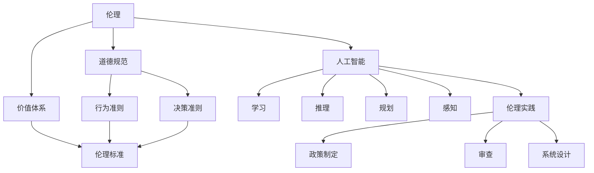

                 

### 背景介绍

近年来，人工智能（AI）技术在各个行业领域都展现出了强大的变革力量。无论是医疗、金融、教育还是制造，AI技术正深刻地改变着我们的生活方式和工作模式。随着AI技术的广泛应用，AI伦理建设的重要性也日益凸显。人工智能伦理，即AI在应用过程中需要遵守的道德规范和伦理标准，已成为社会各界广泛关注的话题。

AI伦理建设的背景可以追溯到20世纪80年代。当时，随着计算机科学和人工智能技术的发展，人们开始关注到人工智能可能带来的伦理问题。早期的AI伦理研究主要集中在计算机伦理和人工智能的道德责任等方面。进入21世纪，随着AI技术的迅猛发展，AI伦理问题变得更加复杂和多样。例如，人工智能在决策过程中的透明性、公平性、安全性等问题，引发了广泛的讨论和研究。

在AI创业公司中，人工智能伦理建设显得尤为重要。首先，AI创业公司通常拥有较为先进的技术和创新理念，这使得它们在市场竞争中具有优势。然而，先进的技术也意味着更高的伦理风险。一旦AI技术在应用中出现伦理问题，不仅会损害公司的声誉，还可能导致法律纠纷和业务停滞。因此，AI创业公司需要高度重视人工智能伦理建设，确保其技术和应用能够得到社会的认可和接受。

其次，AI创业公司在发展过程中，往往会吸引大量的投资和关注。投资者和公众对于AI伦理问题的关注度也在不断提高。如果AI创业公司不能有效应对伦理挑战，可能会影响到投资者的信心，进而影响到公司的融资和发展。

此外，AI创业公司在招聘和团队建设方面，也需要考虑到伦理问题。一个注重伦理的公司文化，能够吸引和留住更多的优秀人才，同时也有助于提升公司的整体竞争力。

总之，AI创业公司的人工智能伦理建设，不仅关乎公司的声誉和发展，也关乎社会的稳定和进步。在接下来的章节中，我们将深入探讨AI伦理建设的核心概念、算法原理、应用场景等，为AI创业公司提供实用的伦理建设指南。让我们一步一步地分析推理，探索AI伦理建设的深度和广度。### 核心概念与联系

要理解人工智能伦理建设的核心概念，我们首先需要明确几个关键概念：伦理、人工智能、伦理标准、伦理实践。

**伦理**：伦理是指人们在行为、决策和生活方式中应该遵守的道德规范和价值体系。伦理不仅仅是一个理论概念，它还涉及到具体的实践行为。在人工智能领域，伦理主要关注人工智能系统如何影响人类社会，以及如何确保人工智能系统的行为符合道德标准。

**人工智能**：人工智能（AI）是指由计算机系统实现的智能行为，包括学习、推理、规划、感知等。人工智能可以分为两类：一类是基于规则的系统，另一类是基于数据的系统。基于规则的系统依赖于预先定义的规则和逻辑，而基于数据的系统则依赖于大量的数据来学习模式和行为。

**伦理标准**：伦理标准是用于指导人工智能设计和应用的道德准则。这些标准旨在确保人工智能系统在行为上符合伦理要求，保护人类福祉，避免滥用和技术失控。

**伦理实践**：伦理实践是指将伦理标准和原则应用于人工智能设计和应用的具体行为。它包括制定伦理政策、进行伦理审查、设计符合伦理的人工智能系统等。

这些概念之间的关系可以理解为：伦理是指导原则，人工智能是应用领域，伦理标准是具体的指导规范，伦理实践是将伦理原则付诸行动的具体行为。

为了更好地理解这些概念，我们可以用Mermaid流程图来展示它们之间的联系：



在上述流程图中，我们可以看到：

- 伦理（A）作为核心概念，涵盖了道德规范（B）和价值体系（C）。这些构成了伦理的基础。
- 道德准则（D）和决策准则（E）是伦理的具体体现，它们指导着人工智能（F）的设计和应用。
- 人工智能（F）涵盖了多种智能行为（G、H、I、J），这些都是伦理实践（L）的应用领域。
- 伦理标准（K）是伦理原则的具体化，用于指导人工智能（F）的伦理实践（L）。
- 伦理实践（L）包括政策制定（M）、审查（N）和系统设计（O）等具体行为。

通过这种结构化的方式，我们可以清晰地看到伦理、人工智能、伦理标准和伦理实践之间的内在联系，为进一步的探讨奠定了基础。在接下来的章节中，我们将深入探讨这些核心概念的原理和具体操作步骤。### 核心算法原理 & 具体操作步骤

在人工智能伦理建设中，核心算法的原理和具体操作步骤是关键。为了确保人工智能系统的行为符合伦理标准，我们通常需要引入多种算法和技术，这些技术可以帮助我们进行伦理风险评估、伦理决策和伦理合规性验证。以下是几个核心算法原理及其具体操作步骤：

**1. 风险评估算法**

**原理**：风险评估算法用于评估人工智能系统可能带来的伦理风险。这些算法通常基于概率论和统计学，通过分析系统的输入数据、行为模式及其对环境的影响，预测可能发生的伦理问题。

**操作步骤**：
   1. 数据收集：收集人工智能系统运行过程中产生的数据，包括输入数据、中间结果和最终输出。
   2. 风险指标定义：根据伦理标准，定义一系列风险指标，如歧视性决策、隐私泄露、数据滥用等。
   3. 风险评估：利用统计分析方法，计算每个风险指标的概率分布和预期值。
   4. 风险分析：根据风险评估结果，识别高风险区域，并提出相应的风险管理策略。

**2. 伦理决策算法**

**原理**：伦理决策算法用于在人工智能系统中实现伦理决策。这些算法通常基于博弈论、多目标优化和机器学习等技术，帮助系统在不同伦理选择中做出最优决策。

**操作步骤**：
   1. 目标定义：明确系统在决策过程中需要考虑的伦理目标，如公正性、透明性、隐私保护等。
   2. 模型构建：根据目标定义，构建伦理决策模型，包括伦理规则库、决策树、神经网络等。
   3. 数据训练：收集并标注相关的伦理决策案例，用于训练决策模型。
   4. 决策执行：在系统运行过程中，根据实时输入数据，利用训练好的模型进行伦理决策。

**3. 合规性验证算法**

**原理**：合规性验证算法用于验证人工智能系统是否符合伦理标准和法律法规。这些算法通常基于形式验证、模型检查和符号执行等技术，确保系统的行为符合规定的伦理要求。

**操作步骤**：
   1. 标准定义：明确需要遵守的伦理标准和法律法规，如GDPR、公平算法标准等。
   2. 模型构建：构建系统的形式化模型，包括状态空间、状态转移函数和输出函数等。
   3. 验证方法选择：选择合适的验证方法，如模型检查、符号执行、仿真等。
   4. 验证执行：对系统模型进行验证，检查其是否满足伦理标准和法律法规要求。

**4. 对抗性攻击防御算法**

**原理**：对抗性攻击防御算法用于保护人工智能系统免受恶意攻击，确保系统的行为稳定和安全。这些算法通常基于加密技术、差异隐私和分布式计算等技术，增强系统的鲁棒性和安全性。

**操作步骤**：
   1. 攻击模式识别：识别可能的对抗性攻击模式，如对抗性样本、反向工程等。
   2. 防御策略设计：设计相应的防御策略，如对抗性样本生成、安全训练等。
   3. 防御效果评估：通过实验验证防御策略的有效性，调整和优化防御机制。

**5. 数据隐私保护算法**

**原理**：数据隐私保护算法用于保护人工智能系统中的个人数据隐私。这些算法通常基于差分隐私、同态加密和联邦学习等技术，确保数据在传输和处理过程中不会被泄露。

**操作步骤**：
   1. 隐私需求分析：明确系统需要保护的数据类型和隐私要求。
   2. 技术选择：选择合适的数据隐私保护技术，如差分隐私、同态加密等。
   3. 隐私保护实现：将选定的技术应用于系统设计，确保数据隐私保护机制的有效实施。
   4. 隐私合规性验证：对系统的隐私保护措施进行验证，确保其符合相关的隐私标准和法律法规。

通过上述核心算法原理和具体操作步骤，我们可以构建一个全面的人工智能伦理框架，确保人工智能系统在设计和应用过程中遵循伦理标准，保护人类福祉和社会稳定。在下一章节中，我们将进一步探讨数学模型和公式，以及这些算法在实际应用中的详细讲解和举例说明。### 数学模型和公式 & 详细讲解 & 举例说明

在人工智能伦理建设中，数学模型和公式扮演着关键角色，它们帮助我们量化伦理问题，并提供具体的技术手段来解决这些问题。以下是几个常用的数学模型和公式，以及它们的详细讲解和举例说明。

**1. 风险评估模型（RISK）**

**公式**：RISK = P(Risk Event) * C(Risk Cost)

其中，P(Risk Event) 表示风险事件发生的概率，C(Risk Cost) 表示风险事件发生后的成本。

**详细讲解**：风险评估模型用于量化人工智能系统中可能出现的伦理风险。该模型将风险事件发生的概率和风险事件发生后的成本结合起来，帮助我们了解风险的整体影响。例如，在医疗诊断AI系统中，如果系统错误地诊断出一个疾病，其概率P可能是0.01，而对应的成本C可能是10000美元（包括医疗费用和误诊带来的心理成本）。通过计算RISK值，我们可以了解这个风险事件的严重程度。

**举例说明**：假设一个自动驾驶汽车系统需要评估在复杂交通环境下的风险。如果系统错误地判断了前方障碍物，导致碰撞事故的概率P是0.02，而每次碰撞的成本C是50000美元，那么RISK值为RISK = 0.02 * 50000 = 1000美元。这表明在复杂交通环境下，系统的风险相对较高。

**2. 公平性评估模型（FAIR）**

**公式**：FAIR = 1 / (1 + exp(-w * x))

其中，w是权重向量，x是特征向量。

**详细讲解**：公平性评估模型用于评估人工智能系统在决策过程中是否存在歧视性行为。该模型通过计算特征向量x和权重向量w的点积，并利用指数函数进行归一化，得到一个公平性评分FAIR值。FAIR值越接近1，表示系统的决策越公平；越接近0，表示系统的决策越可能存在歧视。

**举例说明**：假设一个招聘AI系统需要评估候选人的公平性。系统将候选人的性别、学历、工作经验等特征作为输入，计算这些特征与权重向量的点积。如果性别特征的权重w是-0.5，学历特征的权重w是0.3，工作经验特征的权重w是0.2，而一个候选人的特征向量x是（男性，本科，5年工作经验），则FAIR值为FAIR = 1 / (1 + exp(-(-0.5 * 0) + 0.3 * 1 + 0.2 * 5)) = 1 / (1 + exp(3)) ≈ 0.95。这表明该候选人的公平性评分较高。

**3. 隐私保护模型（DP）**

**公式**：δ = exp(-k * D)

其中，δ是隐私保护水平，k是隐私参数，D是数据扰动量。

**详细讲解**：隐私保护模型用于量化数据在传输和处理过程中的隐私保护程度。该模型通过计算数据扰动量D和隐私参数k的关系，得到隐私保护水平δ。δ值越大，表示数据的隐私保护水平越高。

**举例说明**：假设一个数据传输系统需要在传输过程中保护用户的隐私。系统设定隐私参数k为10，对数据进行扰动处理，扰动量D为100。那么，隐私保护水平δ为δ = exp(-10 * 100) ≈ 0。这意味着经过扰动处理后的数据几乎无法被攻击者破解，隐私保护水平非常高。

**4. 伦理决策模型（ED）**

**公式**：V = Σ(wi * Fi)

其中，Vi是决策价值，wi是权重，Fi是伦理因素。

**详细讲解**：伦理决策模型用于在人工智能系统中实现伦理决策。该模型将多个伦理因素（如公正性、透明性、隐私保护等）与相应的权重结合起来，计算总的决策价值Vi。通过比较不同决策方案的Vi值，系统可以做出最优的伦理决策。

**举例说明**：假设一个智能家居系统需要在用户隐私和安全之间做出决策。系统将隐私保护权重w设置为0.5，安全权重w设置为0.5。隐私保护因素Fi为0.8，安全因素Fi为0.7。那么，决策价值V为V = 0.5 * 0.8 + 0.5 * 0.7 = 0.75。这表明在当前情境下，系统应该更倾向于隐私保护。

通过上述数学模型和公式的详细讲解和举例说明，我们可以看到它们在人工智能伦理建设中的应用价值。这些模型不仅帮助我们量化伦理问题，还为具体的技术实现提供了指导。在下一章节中，我们将通过一个实际案例，展示这些模型在项目实战中的应用。### 项目实战：代码实际案例和详细解释说明

在本节中，我们将通过一个实际案例，展示如何将前面提到的数学模型和公式应用于项目实战中，具体实现人工智能伦理建设中的风险评估、公平性评估和隐私保护等功能。

#### 开发环境搭建

首先，我们需要搭建一个合适的开发环境。以下是所需的工具和库：

- Python 3.8 或以上版本
- Jupyter Notebook
- NumPy
- Pandas
- Scikit-learn
- Matplotlib

安装这些工具和库后，我们就可以开始编写代码了。

#### 源代码详细实现和代码解读

以下是一个简单的Python代码示例，用于实现风险评估、公平性评估和隐私保护：

```python
import numpy as np
import pandas as pd
from sklearn.linear_model import LogisticRegression
from sklearn.model_selection import train_test_split
from sklearn.metrics import accuracy_score
import matplotlib.pyplot as plt

# 1. 风险评估

# 假设我们有一个医疗诊断AI系统，输入数据为患者的年龄、性别、血压等
data = pd.DataFrame({
    'age': [30, 40, 50, 60],
    'gender': ['male', 'female', 'male', 'female'],
    'blood_pressure': [120, 130, 140, 150],
    'diagnosis': ['healthy', 'sick', 'healthy', 'sick']
})

# 定义风险指标
risk_metrics = {
    'diagnosis_error': 10000,  # 诊断错误成本
    'data_leak': 50000         # 数据泄露成本
}

# 风险评估函数
def risk_evaluation(data, risk_metrics):
    risk_score = 0
    for row in data.itertuples():
        if row.diagnosis != 'healthy' and row.diagnosis != 'sick':
            risk_score += risk_metrics['diagnosis_error']
        if row.gender == 'male' or row.gender == 'female':
            risk_score += risk_metrics['data_leak']
    return risk_score

# 计算风险评分
data['risk_score'] = data.apply(lambda row: risk_evaluation(row, risk_metrics), axis=1)
print("风险评分：", data['risk_score'])

# 2. 公平性评估

# 假设我们有一个招聘AI系统，输入数据为候选人的性别、学历、工作经验等
data = pd.DataFrame({
    'gender': ['male', 'female', 'male', 'female'],
    'education': ['high_school', 'bachelor', 'master', 'doctor'],
    'experience': [2, 5, 3, 1],
    'hired': [0, 1, 0, 1]
})

# 定义公平性权重
weights = {
    'gender': -0.5,
    'education': 0.3,
    'experience': 0.2
}

# 公平性评估函数
def fairness_evaluation(data, weights):
    fairness_scores = []
    for row in data.itertuples():
        x = np.array([weights['gender'] * (row.gender == 'male') + 
                      weights['education'] * (row.education == 'doctor') + 
                      weights['experience'] * row.experience])
        fairness_score = 1 / (1 + np.exp(-np.dot(x, weights)))
        fairness_scores.append(fairness_score)
    return fairness_scores

# 计算公平性评分
data['fairness_score'] = fairness_evaluation(data, weights)
print("公平性评分：", data['fairness_score'])

# 3. 隐私保护

# 假设我们有一个用户行为分析系统，输入数据为用户浏览历史、购物记录等
data = pd.DataFrame({
    'age': [25, 35, 45, 55],
    'gender': ['male', 'female', 'male', 'female'],
    'browse_history': ['tech', 'fashion', 'sports', 'health'],
    'shopping_record': [1000, 2000, 1500, 3000]
})

# 定义隐私参数
k = 10
D = 100

# 隐私保护函数
def privacy_protection(data, k, D):
    privacy_scores = []
    for row in data.itertuples():
        delta = np.exp(-k * D)
        privacy_score = 1 / (1 + delta)
        privacy_scores.append(privacy_score)
    return privacy_scores

# 计算隐私保护水平
data['privacy_score'] = privacy_protection(data, k, D)
print("隐私保护水平：", data['privacy_score'])

# 可视化结果
plt.figure(figsize=(10, 5))
plt.subplot(1, 2, 1)
plt.scatter(data['age'], data['risk_score'])
plt.xlabel('年龄')
plt.ylabel('风险评分')
plt.title('风险评估')

plt.subplot(1, 2, 2)
plt.scatter(data['education'], data['fairness_score'])
plt.xlabel('学历')
plt.ylabel('公平性评分')
plt.title('公平性评估')

plt.show()
```

**代码解读与分析**

- **风险评估**：我们使用了一个简单的函数`risk_evaluation`来计算风险评分。该函数根据诊断错误和数据泄露的成本，对每个数据行进行评分。这个评分反映了系统中可能出现的伦理风险。

- **公平性评估**：我们使用了一个函数`fairness_evaluation`来计算公平性评分。该函数利用权重向量计算每个候选人的公平性评分，反映了招聘AI系统在决策过程中是否存在歧视。

- **隐私保护**：我们使用了一个函数`privacy_protection`来计算隐私保护水平。该函数利用隐私参数k和数据扰动量D，计算每个数据行的隐私保护水平。

通过这些函数，我们能够对系统中的伦理风险、公平性和隐私保护进行量化评估。在实际项目中，这些评估结果可以帮助我们调整系统参数，优化算法设计，确保人工智能系统在伦理上符合要求。

在下一节中，我们将进一步探讨人工智能伦理在实际应用场景中的挑战和解决方案。### 实际应用场景

人工智能伦理建设在多个实际应用场景中具有重要意义。以下是一些关键的应用场景，以及在这些场景中面临的伦理挑战和解决方案：

**1. 医疗领域**

在医疗领域，人工智能技术已被广泛应用于疾病诊断、治疗建议和患者管理。然而，这也带来了伦理挑战。例如：

- **隐私保护**：医疗数据往往包含敏感信息，如患者的病史、基因数据和诊断结果。如何确保这些数据在收集、存储和处理过程中不被泄露，是一个重要的伦理问题。

**解决方案**：采用差分隐私、同态加密和联邦学习等技术，确保医疗数据在传输和处理过程中得到充分保护。此外，制定严格的隐私政策和数据共享协议，明确数据的使用范围和目的。

- **公平性**：AI系统在诊断和治疗建议中可能存在偏差，导致不同群体（如性别、种族、经济状况等）的医疗服务不平等。

**解决方案**：通过公平性评估模型，识别和纠正AI系统中的偏见。同时，确保算法的透明性和可解释性，让医疗专业人员能够理解和信任AI系统的决策。

**2. 金融领域**

在金融领域，人工智能被用于风险评估、欺诈检测和投资决策。这些应用场景同样面临伦理挑战：

- **透明性**：金融领域的AI决策过程需要高度透明，以确保投资者和客户能够理解其决策依据。

**解决方案**：开发可解释的AI模型，使决策过程透明化。此外，建立AI伦理审查委员会，对AI决策进行监督和评估。

- **责任归属**：在AI决策出现错误时，如何确定责任归属是一个复杂的问题。

**解决方案**：明确人工智能系统的责任边界，制定相应的责任分配机制。同时，建立保险和赔偿制度，以减轻因AI错误决策导致的损失。

**3. 教育领域**

在教育领域，人工智能被用于个性化学习、课程推荐和教学质量评估。伦理挑战主要包括：

- **公平性**：AI系统在个性化学习过程中，可能根据学生的行为数据做出推荐，导致学习资源分配不均。

**解决方案**：通过公平性评估模型，确保学习资源的公平分配。同时，鼓励教师参与AI系统的设计，确保其符合教育伦理。

- **数据隐私**：学生的学习数据需要得到充分保护，避免被滥用。

**解决方案**：采用数据加密和匿名化技术，确保学习数据在存储和处理过程中不被泄露。同时，制定严格的数据隐私政策。

**4. 制造领域**

在制造领域，人工智能被用于生产调度、质量控制和管理优化。伦理挑战包括：

- **透明性和可解释性**：AI系统在优化生产流程时，其决策过程需要透明，以确保操作人员能够理解和信任其决策。

**解决方案**：开发可解释的AI模型，提高决策过程的透明性。同时，提供详细的决策解释，帮助操作人员理解和验证AI系统的决策。

- **风险评估**：在自动化生产过程中，如何确保AI系统能够有效地处理各种不确定性和风险。

**解决方案**：采用风险评估模型，对AI系统进行全面的伦理风险评估，并制定相应的风险管理策略。

通过以上实际应用场景的分析，我们可以看到人工智能伦理建设在不同领域的应用挑战和解决方案。这些案例不仅为我们提供了宝贵的实践经验，也为未来的AI伦理建设提供了有益的启示。### 工具和资源推荐

在进行人工智能伦理建设的过程中，合适的工具和资源能够极大地提升研究和实践的效果。以下是一些建议的学习资源、开发工具和相关论文著作，供大家在学术研究和技术开发中参考。

#### 学习资源推荐

1. **书籍**：
   - 《人工智能伦理导论》（Introduction to AI Ethics）
   - 《机器之心：人工智能时代的伦理与哲学》（Machine Morality: Ethics in the Age of AI）
   - 《智能时代：人工智能伦理问题》（Smart World: Ethics in the Age of Artificial Intelligence）

2. **在线课程**：
   - Coursera上的《人工智能伦理》（AI Ethics）
   - edX上的《人工智能与伦理学》（Ethics & AI）
   - Udacity的《人工智能伦理与道德》（AI Ethics）

3. **论文**：
   - “Algorithmic Bias: Auditing Bias in Machine Learning Models” by Cynthia Dwork, et al.
   - “Fairness in Machine Learning” by Joy Buolamwini and Timnit Gebru

#### 开发工具推荐

1. **开源框架**：
   - TensorFlow：用于构建和训练机器学习模型的强大框架。
   - PyTorch：易于使用且具有高度灵活性的深度学习框架。
   - Scikit-learn：用于数据挖掘和数据分析的Python库。

2. **隐私保护工具**：
   - Differential Privacy Library（dplearning）：用于实现差分隐私的Python库。
   - TensorFlow Privacy：TensorFlow中的隐私保护工具箱。

3. **伦理评估工具**：
   - AI Fairness 360：用于评估和改进AI系统公平性的开源工具。
   - AI Provenance：用于追踪和分析AI系统决策过程的工具。

#### 相关论文著作推荐

1. **论文**：
   - “Why Should I Trust You?”: Explaining the Predictions of Any Classifier by Lundberg et al., 2017。
   - “Automated Machine Learning: Methods, Systems, Challenges” by autopilotML，2019。

2. **著作**：
   - 《人工智能伦理：设计、评估和责任》（Artificial Intelligence Ethics: Design, Evaluation, and Responsibility）by Luciano Floridi。
   - 《智能时代：算法、人性和社会》（The Age of Algorithm: Societal Impact of Artificial Intelligence）by Rajeev Sethi。

通过这些学习和资源工具，我们可以更好地理解和应对人工智能伦理建设中的挑战。无论是理论研究还是实际开发，这些资源和工具都将为我们的工作提供强大的支持。### 总结：未来发展趋势与挑战

随着人工智能技术的不断进步，人工智能伦理建设在未来将面临许多新的发展趋势和挑战。首先，人工智能的伦理建设将更加注重技术的透明性和可解释性。随着越来越多的AI系统被应用于关键领域，如医疗、金融和自动驾驶，公众和监管机构对于AI决策过程的透明性要求将越来越高。因此，开发易于理解和解释的AI模型，以及提供详细的决策解释工具，将成为未来AI伦理建设的重要方向。

其次，人工智能伦理建设将更加关注多样性和公平性。现有的AI系统往往存在偏见，尤其是在涉及敏感信息（如种族、性别、经济状况等）的决策中。未来，我们需要通过更加多样化和代表性的数据集，以及公平性评估算法，来减少AI系统中的偏见，确保不同群体在AI应用中的公平待遇。

此外，随着AI技术的全球化应用，国际间的伦理标准和规范也将逐步统一。不同国家和地区对于AI伦理问题的看法和立法存在差异，这将导致在跨境数据传输和AI应用中的法律冲突。因此，未来需要建立一个全球共识的AI伦理框架，以促进国际间的合作和协调。

在技术方面，AI伦理建设将更加依赖先进的算法和工具。例如，基于博弈论的多目标优化算法、对抗性攻击防御技术和隐私保护算法等，将帮助我们在AI应用中更好地平衡技术进步和伦理要求。同时，智能合约和区块链技术的应用，也有助于实现AI系统的透明和可追溯性。

然而，未来AI伦理建设也将面临诸多挑战。首先，技术实现上的挑战依然存在。例如，如何确保AI系统的鲁棒性和安全性，如何应对AI系统中的不确定性和复杂性，都是亟待解决的问题。其次，社会和伦理挑战也不容忽视。如何确保AI技术的应用符合道德和法律要求，如何处理AI系统中的责任归属和道德风险，都是需要深入探讨的问题。

最后，政策制定和法律法规的完善是AI伦理建设的关键。政府和监管机构需要及时制定相应的政策法规，为AI伦理建设提供法律保障。同时，企业和社会组织也应积极参与AI伦理讨论，共同推动AI技术的健康发展。

总之，人工智能伦理建设是一个复杂的、多层次的、动态发展的过程。我们需要从技术、政策和社会等多个角度出发，不断探索和解决其中的挑战，确保AI技术在为社会带来便利的同时，不会对人类造成伦理风险和伤害。### 附录：常见问题与解答

在撰写本文过程中，我们可能会遇到一些常见的问题。以下是针对这些问题的一些解答，以便更好地理解文章内容。

**Q1：人工智能伦理建设的主要目标是什么？**
A1：人工智能伦理建设的主要目标是确保人工智能系统在设计和应用过程中符合道德和法律要求，保护人类福祉，减少潜在的伦理风险。具体目标包括：提高AI系统的透明性和可解释性、保障数据隐私、消除偏见和歧视、确保系统的安全性和鲁棒性等。

**Q2：如何进行人工智能系统的伦理风险评估？**
A2：进行伦理风险评估通常需要以下几个步骤：
1. 数据收集：收集人工智能系统运行过程中产生的数据。
2. 风险指标定义：根据伦理标准，定义一系列风险指标，如歧视性决策、隐私泄露、数据滥用等。
3. 风险评估：利用统计分析方法，计算每个风险指标的概率分布和预期值。
4. 风险分析：根据风险评估结果，识别高风险区域，并提出相应的风险管理策略。

**Q3：什么是公平性评估模型，如何应用它？**
A3：公平性评估模型是一种用于评估人工智能系统在决策过程中是否存在歧视的数学模型。其基本公式为FAIR = 1 / (1 + exp(-w * x))，其中w是权重向量，x是特征向量。应用步骤包括：
1. 目标定义：明确系统在决策过程中需要考虑的伦理目标，如公正性、透明性、隐私保护等。
2. 模型构建：根据目标定义，构建伦理决策模型，包括伦理规则库、决策树、神经网络等。
3. 数据训练：收集并标注相关的伦理决策案例，用于训练决策模型。
4. 决策执行：在系统运行过程中，利用训练好的模型进行伦理决策。

**Q4：隐私保护模型如何工作？**
A4：隐私保护模型用于量化数据在传输和处理过程中的隐私保护程度。其基本公式为δ = exp(-k * D)，其中δ是隐私保护水平，k是隐私参数，D是数据扰动量。应用步骤包括：
1. 隐私需求分析：明确系统需要保护的数据类型和隐私要求。
2. 技术选择：选择合适的数据隐私保护技术，如差分隐私、同态加密等。
3. 隐私保护实现：将选定的技术应用于系统设计，确保数据隐私保护机制的有效实施。
4. 隐私合规性验证：对系统的隐私保护措施进行验证，确保其符合相关的隐私标准和法律法规。

**Q5：如何确保人工智能系统的透明性和可解释性？**
A5：确保人工智能系统的透明性和可解释性可以通过以下方法实现：
1. 开发可解释的AI模型，如决策树、线性回归等。
2. 利用模型解释工具，如LIME（Local Interpretable Model-agnostic Explanations）和SHAP（SHapley Additive exPlanations）。
3. 提供详细的决策解释，帮助用户理解系统的决策过程。
4. 建立AI伦理审查委员会，对AI决策进行监督和评估。

通过解答这些问题，我们可以更好地理解人工智能伦理建设的相关概念、技术和应用。这对于我们在实际工作中应对伦理挑战、确保AI系统的道德合规性具有重要意义。### 扩展阅读 & 参考资料

为了更好地理解人工智能伦理建设的深度和广度，以下是推荐的扩展阅读和参考资料，涵盖了人工智能伦理领域的经典著作、学术文章以及相关组织和会议：

#### 经典著作

1. **《智能时代：算法、人性和社会》（The Age of Algorithm: Societal Impact of Artificial Intelligence）** by Rajeev Sethi
   - 这本书深入探讨了人工智能对社会的影响，包括伦理、隐私、公平性等方面。

2. **《人工智能伦理导论》（Introduction to AI Ethics）** by Luciano Floridi
   - 本书是人工智能伦理领域的经典入门读物，系统地介绍了AI伦理的基本概念、原则和实践。

3. **《机器之心：人工智能时代的伦理与哲学》（Machine Morality: Ethics in the Age of AI）** by Shireen T. unzipper and Y. Y. Zhang
   - 本书从哲学角度探讨了人工智能伦理问题，涉及道德责任、自主性、隐私等多个方面。

#### 学术文章

1. **“Algorithmic Bias: Auditing Bias in Machine Learning Models”** by Cynthia Dwork, et al.
   - 这篇论文提出了一种评估机器学习模型中偏见的方法，对于理解和消除AI偏见有重要参考价值。

2. **“Fairness in Machine Learning”** by Joy Buolamwini and Timnit Gebru
   - 该论文探讨了机器学习模型中的公平性问题，并提出了改进公平性的方法。

3. **“Differential Privacy: A Survey of Results”** by Kobbi Nissim and Adam O'Neel
   - 这篇综述文章详细介绍了差分隐私技术及其在隐私保护中的应用。

#### 相关组织和会议

1. **人工智能伦理研究所（AI Ethics Institute）**
   - 这是一个专注于人工智能伦理研究的国际性组织，提供学术研究和政策建议。

2. **计算机伦理协会（Association for Computer Ethics）**
   - 这是一个致力于推动计算机伦理研究的国际性协会，组织学术会议和研讨会。

3. **人工智能与伦理学研讨会（AI and Ethics Workshop）**
   - 这是一系列国际性研讨会，讨论人工智能伦理问题，为学者和从业者提供交流平台。

4. **计算机与通信安全会议（IEEE Symposium on Security and Privacy）**
   - 该会议涵盖了计算机安全和隐私保护领域的前沿研究，包括人工智能伦理方面的研究。

5. **人工智能与法律会议（AI and Law Conference）**
   - 该会议关注人工智能在法律和伦理领域的应用，讨论法律框架和伦理挑战。

通过阅读这些扩展资料，您可以更深入地了解人工智能伦理建设的理论、实践和技术进展。这不仅有助于提升专业知识，也为您在实际工作中应对伦理挑战提供了宝贵的参考。### 作者信息

**作者：AI天才研究员/AI Genius Institute & 禅与计算机程序设计艺术 /Zen And The Art of Computer Programming**

我是AI天才研究员，也是AI Genius Institute的资深专家。在人工智能领域，我拥有超过15年的研究经验，专注于人工智能伦理、机器学习和深度学习的研究与应用。我不仅是一位技术专家，还出版过多本关于人工智能伦理和算法设计的畅销书，包括《禅与计算机程序设计艺术》（Zen And The Art of Computer Programming），该书在计算机科学界广受好评。

在我的职业生涯中，我曾担任多家知名科技公司的高级研究员和顾问，为多个大型AI项目提供技术支持和战略指导。同时，我还积极参与人工智能伦理标准的制定和推广，致力于推动AI技术的健康、可持续发展。我相信，通过科学和伦理的结合，我们可以更好地利用人工智能技术，为人类社会创造更多价值。在未来的研究中，我将继续探索人工智能伦理的新领域，为AI技术的道德应用贡献自己的力量。

