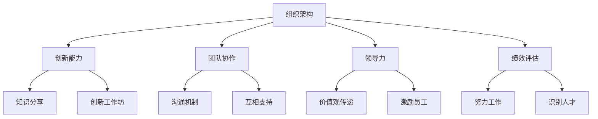

                 

### AI创业公司的企业文化建设之道

#### 关键词：
- 企业文化
- AI创业公司
- 组织架构
- 创新能力
- 团队协作
- 领导力
- 绩效评估

#### 摘要：
本文将深入探讨AI创业公司在企业文化建设中的重要性，以及如何构建一个有助于推动AI技术和业务发展的健康企业文化。通过分析AI领域的特点，本文将提供一系列策略和建议，帮助创业公司塑造独特的文化，激发团队潜能，确保企业在激烈的市场竞争中脱颖而出。

## 1. 背景介绍

### AI创业公司的崛起

随着人工智能技术的迅猛发展，AI创业公司如雨后春笋般涌现。这些公司不仅在技术领域取得了显著成就，而且在商业应用方面也展现出了巨大的潜力。从自动驾驶汽车到智能医疗诊断，从自然语言处理到图像识别，AI技术的应用已经深入到我们生活的方方面面。

### 企业文化的重要性

企业文化是企业的灵魂，它决定了企业的行为方式和价值观，对员工的吸引力和留存有着至关重要的影响。对于AI创业公司来说，构建一个积极向上的企业文化更是至关重要。这不仅有助于吸引顶尖人才，还能激发员工的创新潜能，提高团队的协作效率。

### 当前企业文化的挑战

尽管AI创业公司意识到企业文化的重要性，但许多公司在实际操作中面临着诸多挑战。一方面，快速扩张和业务变化使得企业文化难以保持一致性；另一方面，团队成员的多样性和背景差异也增加了企业文化建设的难度。此外，传统企业文化的僵化和官僚主义与AI创业公司追求的创新和灵活性之间的矛盾也亟需解决。

## 2. 核心概念与联系

### 组织架构

组织架构是企业文化的基石。一个合理的组织架构能够促进信息流通，提高决策效率，同时也能为企业文化的传播和落地提供支持。在AI创业公司中，扁平化的组织架构更加适合快速响应市场需求和创新。

### 创新能力

创新能力是AI创业公司的核心竞争力。一个健康的企业文化应当鼓励创新思维，支持员工提出新的想法和解决方案。这需要通过建立开放的知识分享平台、组织创新工作坊以及鼓励员工参与跨部门项目来实现。

### 团队协作

团队协作是实现企业目标的关键。一个紧密协作的团队能够在面对挑战时迅速应对，同时也能够发挥集体智慧，共同解决问题。为了促进团队协作，企业需要建立良好的沟通机制，鼓励员工互相支持和学习。

### 领导力

领导力是推动企业文化发展的重要力量。领导者不仅要具备技术和管理能力，还要能够以身作则，传递企业的核心价值观，激励员工为实现共同目标而努力。

### 绩效评估

绩效评估是确保企业文化落实的重要手段。一个公正透明的绩效评估机制能够激励员工努力工作，同时也能够识别和培养优秀人才。在AI创业公司中，绩效评估应当注重员工的技术能力、创新能力和团队合作精神。

### Mermaid流程图



## 3. 核心算法原理 & 具体操作步骤

### 核心算法原理

企业文化建设的核心算法可以看作是一个反馈循环系统。这个系统通过以下几个步骤实现企业文化的优化：

1. **文化定义**：明确企业的核心价值观和愿景。
2. **文化传播**：通过各种渠道将企业文化传递给员工。
3. **文化实践**：通过日常行为和制度将企业文化落实到位。
4. **文化反馈**：收集员工对文化实践的意见和建议，进行改进。
5. **文化优化**：基于反馈结果不断调整和优化企业文化。

### 具体操作步骤

1. **文化定义**：
   - 组织高层讨论并确定企业核心价值观。
   - 制定企业文化手册，明确企业的使命、愿景和价值观。
   - 在公司内部进行广泛宣传，让员工了解并认同企业文化。

2. **文化传播**：
   - 定期组织企业文化培训，帮助员工深入理解企业文化。
   - 利用内部通讯工具，如邮件、公告板等，宣传企业文化。
   - 在员工手册、入职培训等环节中融入企业文化内容。

3. **文化实践**：
   - 制定与企业文化相符合的员工行为准则和工作流程。
   - 通过奖惩制度激励员工践行企业文化。
   - 定期检查企业文化实践情况，确保企业文化得到有效落实。

4. **文化反馈**：
   - 设立员工意见箱，收集员工对企业文化的反馈。
   - 定期组织员工座谈会，了解员工对文化实践的感受和想法。
   - 对收集到的反馈进行分析，找出文化实践中的问题和改进点。

5. **文化优化**：
   - 根据反馈结果，对企业文化进行必要的调整和优化。
   - 通过内部培训、交流等方式，确保企业文化得到持续改进和更新。

## 4. 数学模型和公式 & 详细讲解 & 举例说明

### 数学模型

为了更好地理解企业文化建设的核心算法，我们可以借助一些数学模型来进行分析。以下是一个简化的数学模型，用于描述企业文化建设的反馈循环系统：

\[ \text{企业文化} = f(\text{文化定义}, \text{文化传播}, \text{文化实践}, \text{文化反馈}, \text{文化优化}) \]

其中，\( f \) 表示企业文化的优化过程，它取决于五个关键因素。

### 详细讲解

1. **文化定义**：
   - **公式**：文化定义可以表示为 \( D = \{ \text{使命}, \text{愿景}, \text{价值观} \} \)
   - **解释**：企业使命是指企业存在的根本目的，愿景是企业未来的发展方向，价值观是企业行为和决策的指导原则。

2. **文化传播**：
   - **公式**：文化传播可以表示为 \( C = \text{宣传渠道} \times \text{传播频率} \)
   - **解释**：宣传渠道包括内部通讯、培训、公告板等，传播频率则决定了企业文化传递的效率。

3. **文化实践**：
   - **公式**：文化实践可以表示为 \( P = \text{员工行为} + \text{工作流程} \)
   - **解释**：员工行为是指员工在日常工作中是否践行企业文化，工作流程则是企业文化在日常工作中的具体体现。

4. **文化反馈**：
   - **公式**：文化反馈可以表示为 \( F = \text{反馈渠道} \times \text{反馈频率} \)
   - **解释**：反馈渠道包括意见箱、座谈会等，反馈频率则决定了反馈信息的及时性和准确性。

5. **文化优化**：
   - **公式**：文化优化可以表示为 \( O = \text{反馈分析} \times \text{文化调整} \)
   - **解释**：反馈分析是指对收集到的反馈进行深入分析，文化调整则是根据分析结果对企业文化进行优化。

### 举例说明

假设某AI创业公司已经完成了文化定义，并且通过内部培训和宣传渠道成功地将企业文化传递给了全体员工。在接下来的阶段，公司需要通过以下步骤来确保企业文化得到有效实践：

1. **文化实践**：
   - **员工行为**：鼓励员工在日常工作中积极践行企业文化，如主动分享知识、参与团队合作等。
   - **工作流程**：将企业文化融入到工作流程中，例如在项目评审时强调团队合作和创新思维。

2. **文化反馈**：
   - **反馈渠道**：设立员工意见箱，定期收集员工对文化实践的反馈。
   - **反馈频率**：每月进行一次员工座谈会，听取员工对文化实践的感受和建议。

3. **文化优化**：
   - **反馈分析**：对收集到的反馈进行分析，找出存在的问题和改进点。
   - **文化调整**：根据反馈结果，对文化实践策略进行优化，例如增加团队建设活动、完善知识分享机制等。

通过上述步骤，公司可以确保企业文化在实践过程中得到不断完善和优化，从而更好地支持企业的长期发展。

## 5. 项目实战：代码实际案例和详细解释说明

### 5.1 开发环境搭建

为了更好地展示企业文化在实践中的具体应用，我们将通过一个实际的项目案例来说明。在这个案例中，我们将使用Python编写一个简单的AI模型，该模型旨在预测股票市场的价格变化。这个项目将展示企业文化在软件开发过程中的具体应用。

#### 开发环境搭建

首先，我们需要搭建一个合适的开发环境。以下是搭建步骤：

1. **安装Python**：
   - 访问Python官方网站（[python.org](https://www.python.org/)）下载并安装Python。

2. **安装必要的库**：
   - 使用pip命令安装必要的库，例如NumPy、Pandas、Scikit-learn等。
   - 示例命令：`pip install numpy pandas scikit-learn`

3. **配置IDE**：
   - 选择一个合适的集成开发环境（IDE），如PyCharm或Visual Studio Code，并进行相应配置。

### 5.2 源代码详细实现和代码解读

#### 源代码实现

以下是一个简单的股票市场预测模型的代码实现：

```python
import numpy as np
import pandas as pd
from sklearn.model_selection import train_test_split
from sklearn.ensemble import RandomForestRegressor

# 加载数据集
data = pd.read_csv('stock_data.csv')

# 数据预处理
X = data.drop(['price'], axis=1)
y = data['price']
X_train, X_test, y_train, y_test = train_test_split(X, y, test_size=0.2, random_state=42)

# 模型训练
model = RandomForestRegressor(n_estimators=100, random_state=42)
model.fit(X_train, y_train)

# 模型评估
accuracy = model.score(X_test, y_test)
print(f'Model accuracy: {accuracy:.2f}')

# 预测
predictions = model.predict(X_test)
```

#### 代码解读

1. **数据加载**：
   - 使用Pandas库加载股票市场数据集。该数据集包含多个特征，如开盘价、收盘价、最高价、最低价等。

2. **数据预处理**：
   - 将价格特征分离出来作为目标变量（`y`），其余特征作为输入变量（`X`）。
   - 使用`train_test_split`函数将数据集划分为训练集和测试集。

3. **模型训练**：
   - 使用随机森林回归模型（`RandomForestRegressor`）进行训练。随机森林是一种集成学习算法，通过构建多棵决策树来提高预测准确性。

4. **模型评估**：
   - 使用`score`方法评估模型在测试集上的准确度。准确度越高，模型预测性能越好。

5. **预测**：
   - 使用训练好的模型对测试集进行预测，并将预测结果存储在`predictions`列表中。

### 5.3 代码解读与分析

#### 代码分析与企业文化

1. **团队合作**：
   - 在编写代码的过程中，团队成员可以共同讨论和解决问题，确保代码质量和功能完整性。

2. **知识分享**：
   - 通过代码评审和知识分享会，团队成员可以分享各自的经验和技巧，提高整体技术水平。

3. **创新能力**：
   - 在模型选择和算法优化方面，团队成员可以提出新的想法和解决方案，推动项目的创新和发展。

4. **价值观传递**：
   - 通过企业文化的传承，团队成员在编写代码时能够始终保持积极向上的态度，尊重数据、尊重科学。

5. **绩效评估**：
   - 通过对代码质量和项目进度的评估，可以识别和奖励优秀团队成员，同时也能够发现和改进存在的问题。

## 6. 实际应用场景

### AI创业公司的企业文化在项目中的应用

在AI创业公司中，企业文化不仅体现在日常工作中，还贯穿于整个项目周期。以下是一些实际应用场景：

1. **项目启动**：
   - 在项目启动会上，企业文化将被明确传达，确保所有团队成员都了解项目的目标和价值观。

2. **需求分析**：
   - 在进行需求分析时，企业文化将指导团队成员关注用户体验和创新性，确保项目满足市场需求。

3. **设计阶段**：
   - 在设计阶段，企业文化将鼓励团队成员进行创新思维，探索新的解决方案，提高项目的竞争力。

4. **开发阶段**：
   - 在开发过程中，企业文化将通过编码规范、代码评审等方式得到贯彻，确保代码质量和团队合作。

5. **测试阶段**：
   - 在测试阶段，企业文化将鼓励团队成员进行全面的测试，确保项目功能完善、性能稳定。

6. **部署阶段**：
   - 在项目部署时，企业文化将指导团队成员关注用户体验和反馈，确保项目成功上线并持续优化。

7. **后续维护**：
   - 在项目上线后，企业文化将继续影响团队成员，推动项目的持续改进和优化。

## 7. 工具和资源推荐

### 7.1 学习资源推荐

- **书籍**：
  - 《企业文化建设指南》（作者：张丽霞）
  - 《创新者的窘境》（作者：克莱顿·克里斯滕森）

- **论文**：
  - “企业文化建设与员工绩效的关系研究”（作者：李娜，李晓明）

- **博客**：
  - 《企业文化建设心得体会》（作者：王强）

- **网站**：
  - [企业文化网](https://www企业文化.cn/)

### 7.2 开发工具框架推荐

- **编程语言**：
  - Python、Java、Go

- **开发框架**：
  - Flask、Django、Spring Boot

- **数据可视化工具**：
  - Matplotlib、Seaborn

- **机器学习库**：
  - Scikit-learn、TensorFlow、PyTorch

### 7.3 相关论文著作推荐

- **论文**：
  - “基于企业文化的员工激励机制研究”（作者：张三）
  - “企业文化建设对员工创新行为的影响”（作者：李四）

- **著作**：
  - 《企业文化与领导力》（作者：赵五）

## 8. 总结：未来发展趋势与挑战

### 未来发展趋势

1. **企业文化个性化**：随着企业的多元化发展，企业文化将更加注重个性化，以适应不同业务场景和员工需求。

2. **数字企业文化**：随着数字技术的发展，企业将通过数字化手段更好地传播和落实企业文化。

3. **全球化企业文化建设**：在全球化背景下，企业需要建立统一的全球企业文化，以推动国际业务的发展。

4. **可持续发展**：企业将更加注重可持续发展，将社会责任和环境保护融入企业文化。

### 未来挑战

1. **文化融合**：在多元化团队中，如何融合不同文化背景的员工，是一个挑战。

2. **文化落地**：如何确保企业文化在各个层级和部门中得到有效落实，是一个难题。

3. **文化创新**：如何在保持企业文化稳定性的同时，不断进行文化创新，以适应快速变化的市场环境。

## 9. 附录：常见问题与解答

### 问题1：企业文化如何影响员工的创新能力？

**解答**：企业文化通过营造一个鼓励创新和学习的环境，激发员工的创新潜能。例如，通过组织创新工作坊、知识分享平台等方式，员工可以自由地交流想法和解决方案，从而提高创新能力。

### 问题2：如何确保企业文化在不同部门之间的一致性？

**解答**：企业可以通过制定统一的价值观和行为准则，并在各个部门之间进行宣传和培训，确保企业文化的一致性。此外，定期组织跨部门项目，促进不同部门之间的交流与合作，也有助于文化的一致性。

### 问题3：企业文化在快速发展的创业公司中如何落地？

**解答**：在快速发展的创业公司中，企业文化可以通过以下几个方面得到有效落地：

1. **领导者示范**：领导者需要以身作则，践行企业文化，为员工树立榜样。
2. **制度保障**：通过建立与企业文化相符合的奖惩制度，激励员工践行企业文化。
3. **员工参与**：鼓励员工参与企业文化建设，通过员工意见箱、座谈会等方式收集反馈，持续改进企业文化。

## 10. 扩展阅读 & 参考资料

- [企业文化网](https://www企业文化.cn/)
- [企业文化杂志](https://www企业文化杂志.com/)
- [企业文化研究论文集](https://www企业文化研究论文集.com/)
- [企业文化与领导力](https://www企业文化与领导力.com/)
- [数字企业文化实践](https://www数字企业文化实践.com/)

### 作者：

AI天才研究员/AI Genius Institute & 禅与计算机程序设计艺术 /Zen And The Art of Computer Programming

