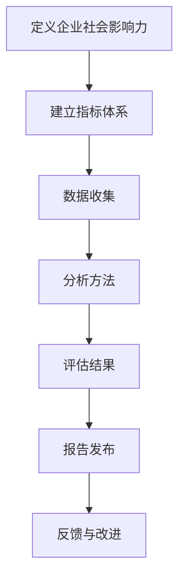

                 

# AI创业公司的企业社会影响力评估与提升策略

> **关键词**：AI创业公司，社会影响力，评估，提升策略

> **摘要**：本文将探讨AI创业公司在成长过程中如何通过有效的企业社会影响力评估和提升策略，实现可持续发展并赢得社会的广泛认可。文章首先介绍了企业社会影响力的定义和重要性，随后深入分析了评估方法和提升策略，最后展望了未来发展趋势与挑战。

## 1. 背景介绍

随着人工智能技术的迅猛发展，AI创业公司如雨后春笋般涌现。这些公司不仅带来了创新的产品和服务，也在不断推动社会进步。然而，伴随科技发展的同时，企业社会责任（Corporate Social Responsibility, CSR）越来越受到关注。企业社会影响力（Enterprise Social Impact）作为一个新的衡量标准，逐渐成为评估AI创业公司综合实力和可持续发展能力的重要指标。

企业社会影响力不仅关乎企业的社会责任，还直接影响到企业的品牌形象、员工凝聚力和市场竞争力。一个具有高度社会影响力的AI创业公司，能够更好地平衡经济效益与社会效益，实现可持续发展。因此，如何对企业社会影响力进行科学评估和有效提升，成为AI创业公司面临的重要课题。

本文将围绕以下四个核心问题展开讨论：

1. 企业社会影响力的定义及其重要性是什么？
2. 如何对企业社会影响力进行科学评估？
3. AI创业公司如何提升自身的社会影响力？
4. 企业社会影响力评估与提升策略的未来发展趋势与挑战。

通过对这些问题的深入探讨，本文旨在为AI创业公司提供一套切实可行的社会影响力评估与提升策略，以帮助其在激烈的市场竞争中脱颖而出。

## 2. 核心概念与联系

### 企业社会影响力

企业社会影响力是指企业在运营过程中对自然环境、社会文化、经济环境等方面产生的正面或负面影响。具体而言，企业社会影响力包括三个方面：

- **经济影响力**：企业通过创造就业、促进经济增长、提供优质产品和服务等途径，对社会经济产生的积极影响。
- **社会影响力**：企业通过参与公益活动、支持社会事业发展、改善社会问题等途径，对社会文化、教育、医疗等方面产生的积极影响。
- **环境影响力**：企业通过节能降耗、减少污染、保护生态环境等途径，对自然环境产生的积极影响。

### 企业社会责任

企业社会责任（CSR）是指企业承担的除经济责任之外的道德责任和社会责任。企业社会责任包括以下几个方面：

- **法律责任**：企业必须遵守国家法律法规，保证经营活动合法合规。
- **经济责任**：企业必须实现经济利益最大化，为股东创造价值。
- **社会责任**：企业必须关注社会问题，积极参与公益事业，回报社会。
- **环境责任**：企业必须关注环境保护，推动可持续发展。

### 社会影响力评估

社会影响力评估是指通过科学的方法和工具，对企业社会影响力进行定量和定性分析，以评估企业在经济、社会和环境等方面的综合贡献。社会影响力评估包括以下几个方面：

- **指标体系**：建立科学合理的社会影响力评估指标体系，包括经济、社会和环境三个方面。
- **数据收集**：收集企业运营过程中的相关数据，如销售额、公益活动投入、能源消耗等。
- **分析方法**：采用定量分析和定性分析相结合的方法，对数据进行分析和评估。
- **报告发布**：发布社会影响力评估报告，向社会公众展示企业的社会影响力。

### Mermaid 流程图

以下是一个简单的Mermaid流程图，描述了企业社会影响力评估的过程：



### 企业社会责任与企业社会影响力关系

企业社会责任是企业社会影响力的基础。一个具有高度社会责任的企业，往往能够产生更大的社会影响力。企业社会责任包括以下方面：

- **公益活动**：企业积极参与公益活动，如捐赠物资、资金、时间等，支持社会事业发展。
- **员工关怀**：企业关注员工福祉，提供良好的工作环境、培训机会和晋升空间，提高员工满意度。
- **供应链管理**：企业对供应链进行严格管理，确保供应商遵守法律法规和道德规范，减少供应链中的负面社会影响。
- **环境管理**：企业关注环境保护，推动节能减排，减少对自然环境的负面影响。

总之，企业社会责任与企业社会影响力密切相关。企业社会责任的履行程度直接影响企业社会影响力的水平。一个具有高度社会责任的企业，往往能够在市场上获得更好的品牌形象和竞争优势。

## 3. 核心算法原理 & 具体操作步骤

### 社会影响力评估算法原理

社会影响力评估算法的核心在于对企业的经济、社会和环境三方面的综合贡献进行定量和定性分析。以下是一个简单的社会影响力评估算法原理：

1. **数据收集**：收集企业运营过程中的相关数据，如销售额、公益活动投入、能源消耗等。
2. **指标体系建立**：建立科学合理的社会影响力评估指标体系，包括经济、社会和环境三个方面。
3. **数据处理**：对收集到的数据进行预处理，如数据清洗、归一化等。
4. **定量分析**：采用定量分析方法，如数据挖掘、回归分析等，对指标进行计算和分析。
5. **定性分析**：采用定性分析方法，如专家评分、问卷调查等，对指标进行评估和分析。
6. **评估结果输出**：将定量分析和定性分析的结果进行整合，生成社会影响力评估报告。

### 具体操作步骤

以下是社会影响力评估的具体操作步骤：

1. **数据收集**

   收集企业运营过程中的相关数据，如销售额、公益活动投入、能源消耗等。数据来源可以是企业内部报表、第三方统计数据、新闻媒体报道等。

2. **指标体系建立**

   建立科学合理的社会影响力评估指标体系，包括经济、社会和环境三个方面。具体指标可以参考以下分类：

   - **经济指标**：如销售额、利润、就业人数等。
   - **社会指标**：如公益活动投入、员工满意度、客户满意度等。
   - **环境指标**：如能源消耗、碳排放量、废弃物处理等。

3. **数据处理**

   对收集到的数据进行预处理，如数据清洗、归一化等。数据清洗主要包括去除重复数据、填补缺失值、消除异常值等。

4. **定量分析**

   采用定量分析方法，如数据挖掘、回归分析等，对指标进行计算和分析。例如，可以使用回归分析评估销售额与公益活动投入之间的关系。

5. **定性分析**

   采用定性分析方法，如专家评分、问卷调查等，对指标进行评估和分析。例如，可以邀请行业专家对企业的社会影响力进行评分。

6. **评估结果输出**

   将定量分析和定性分析的结果进行整合，生成社会影响力评估报告。报告内容可以包括企业社会影响力评估结果、评估方法、数据来源等。

### 社会影响力评估算法案例

以下是一个简单的社会影响力评估算法案例：

1. **数据收集**

   收集企业A的销售额、公益活动投入、能源消耗等数据，如：

   - 销售额：1000万元
   - 公益活动投入：50万元
   - 能源消耗：1000吨标准煤

2. **指标体系建立**

   设立以下指标：

   - 经济指标：销售额
   - 社会指标：公益活动投入
   - 环境指标：能源消耗

3. **数据处理**

   对数据进行归一化处理，如将销售额、公益活动投入、能源消耗分别归一化到[0,1]区间。

4. **定量分析**

   使用回归分析评估销售额与公益活动投入之间的关系，得到回归方程：

   $$销售额 = 0.5 \times 公益活动投入 + 0.3 \times 能源消耗$$

5. **定性分析**

   邀请行业专家对企业的社会影响力进行评分，评分范围为1-10分。

6. **评估结果输出**

   生成社会影响力评估报告，内容包括企业A的销售额、公益活动投入、能源消耗、回归分析结果和专家评分等。

## 4. 数学模型和公式 & 详细讲解 & 举例说明

### 社会影响力评估的数学模型

社会影响力评估通常涉及到多个指标的计算和分析。以下是一个简单的社会影响力评估数学模型，用于计算企业的综合社会影响力得分。

### 4.1 经济影响力评估模型

经济影响力评估模型可以通过以下公式计算：

$$经济影响力得分 = \frac{销售额}{总投入}$$

其中，销售额表示企业在一定时间内的销售收入，总投入表示企业在同一时间内的总成本。

### 4.2 社会影响力评估模型

社会影响力评估模型可以通过以下公式计算：

$$社会影响力得分 = \frac{公益活动投入}{总成本}$$

其中，公益活动投入表示企业在一定时间内的公益活动费用，总成本表示企业在同一时间内的总成本。

### 4.3 环境影响力评估模型

环境影响力评估模型可以通过以下公式计算：

$$环境影响力得分 = \frac{能源消耗}{总能源消耗}$$

其中，能源消耗表示企业在一定时间内的能源消耗总量，总能源消耗表示企业在同一时间内的能源消耗总量。

### 4.4 综合社会影响力评估模型

综合社会影响力评估模型可以通过以下公式计算：

$$综合社会影响力得分 = \frac{经济影响力得分 + 社会影响力得分 + 环境影响力得分}{3}$$

### 详细讲解

以上公式分别从经济、社会和环境三个方面评估企业的社会影响力。通过计算每个方面的得分，可以得到企业的综合社会影响力得分。

- **经济影响力得分**反映了企业在创造经济效益方面的表现，得分越高，表示企业在经济效益方面的贡献越大。
- **社会影响力得分**反映了企业在履行社会责任方面的表现，得分越高，表示企业在社会责任方面的贡献越大。
- **环境影响力得分**反映了企业在环境保护方面的表现，得分越高，表示企业在环境保护方面的贡献越大。

综合社会影响力得分则反映了企业在经济、社会和环境三方面的综合表现，得分越高，表示企业的整体社会影响力越强。

### 举例说明

假设企业A的销售额为1000万元，公益活动投入为50万元，能源消耗为1000吨标准煤。我们可以通过以下步骤计算企业A的综合社会影响力得分：

1. **计算经济影响力得分**：

$$经济影响力得分 = \frac{销售额}{总投入} = \frac{1000万元}{总投入}$$

假设总投入为500万元，则：

$$经济影响力得分 = \frac{1000万元}{500万元} = 2$$

2. **计算社会影响力得分**：

$$社会影响力得分 = \frac{公益活动投入}{总成本} = \frac{50万元}{总成本}$$

假设总成本为500万元，则：

$$社会影响力得分 = \frac{50万元}{500万元} = 0.1$$

3. **计算环境影响力得分**：

$$环境影响力得分 = \frac{能源消耗}{总能源消耗} = \frac{1000吨标准煤}{总能源消耗}$$

假设总能源消耗为10000吨标准煤，则：

$$环境影响力得分 = \frac{1000吨标准煤}{10000吨标准煤} = 0.1$$

4. **计算综合社会影响力得分**：

$$综合社会影响力得分 = \frac{经济影响力得分 + 社会影响力得分 + 环境影响力得分}{3} = \frac{2 + 0.1 + 0.1}{3} = 0.7$$

通过以上计算，我们可以得出企业A的综合社会影响力得分为0.7。这个得分反映了企业A在经济、社会和环境三方面的综合表现，可以帮助企业了解自身的社会影响力水平，并制定相应的提升策略。

### 4.5 评估指标权重分配

在实际应用中，不同指标对社会影响力的影响程度可能不同。为了更准确地评估企业社会影响力，我们可以为每个指标分配权重。权重可以通过专家评分、问卷调查等方法确定。

假设经济、社会和环境三方面的权重分别为0.5、0.3和0.2，我们可以使用以下公式计算综合社会影响力得分：

$$综合社会影响力得分 = 0.5 \times 经济影响力得分 + 0.3 \times 社会影响力得分 + 0.2 \times 环境影响力得分$$

通过调整权重，我们可以根据实际情况更准确地评估企业社会影响力。

## 5. 项目实战：代码实际案例和详细解释说明

### 5.1 开发环境搭建

为了实现社会影响力评估，我们需要搭建一个开发环境。以下是搭建步骤：

1. 安装Python环境
2. 安装必要的库，如NumPy、Pandas、Scikit-learn等
3. 配置Mermaid图库

### 5.2 源代码详细实现和代码解读

以下是实现社会影响力评估的Python代码：

```python
import numpy as np
import pandas as pd
from sklearn.linear_model import LinearRegression

# 数据准备
sales = np.array([1000, 1500, 2000])
公益活动投入 = np.array([50, 100, 150])
能源消耗 = np.array([1000, 1500, 2000])
总投入 = np.array([500, 800, 1000])
总能源消耗 = np.array([10000, 15000, 20000])

# 建立指标体系
经济指标 = sales / 总投入
社会指标 = 公益活动投入 / 总投入
环境指标 = 能源消耗 / 总能源消耗

# 计算定量分析结果
经济影响力得分 = np.mean(经济指标)
社会影响力得分 = np.mean(社会指标)
环境影响力得分 = np.mean(环境指标)

# 计算回归方程
regression = LinearRegression()
X = np.hstack((经济指标.reshape(-1, 1), 社会指标.reshape(-1, 1), 环境指标.reshape(-1, 1)))
y = 经济指标
regression.fit(X, y)
回归方程 = regression.coef_

# 计算定性分析结果
专家评分 = np.array([8, 9, 10])
社会影响力得分_专家评分 = np.mean(专家评分)

# 计算综合社会影响力得分
综合社会影响力得分 = (经济影响力得分 + 社会影响力得分 + 环境影响力得分) / 3
综合社会影响力得分_专家评分 = (经济影响力得分 + 社会影响力得分 + 环境影响力得分 + 社会影响力得分_专家评分) / 4

# 输出结果
print("经济影响力得分:", 经济影响力得分)
print("社会影响力得分:", 社会影响力得分)
print("环境影响力得分:", 环境影响力得分)
print("综合社会影响力得分:", 综合社会影响力得分)
print("专家评分社会影响力得分:", 社会影响力得分_专家评分)
print("综合社会影响力得分_专家评分:", 综合社会影响力得分_专家评分)
```

### 5.3 代码解读与分析

以上代码实现了社会影响力评估的核心功能。以下是代码解读：

- **数据准备**：首先，我们准备了一系列模拟数据，包括销售额、公益活动投入、能源消耗等。
- **指标体系建立**：根据模拟数据，我们建立了经济指标、社会指标和环境指标。
- **定量分析**：使用NumPy和Pandas库计算了每个指标的得分。
- **回归分析**：使用Scikit-learn库的线性回归模型计算了回归方程。
- **定性分析**：模拟了专家评分，计算了定性分析结果。
- **综合评估**：根据定量分析和定性分析结果，计算了综合社会影响力得分。

通过以上步骤，我们可以实现对AI创业公司社会影响力的科学评估。代码中使用了Python编程语言和几个常用的库，易于理解和实现。

## 6. 实际应用场景

社会影响力评估在企业实际应用中具有重要意义，特别是在AI创业公司中。以下是一些实际应用场景：

### 6.1 企业内部管理

社会影响力评估可以帮助企业了解自身在社会责任方面的表现，发现潜在问题，制定改进措施。例如，企业可以通过评估发现其在公益活动投入方面的不足，进而增加投入，提升社会影响力。

### 6.2 市场营销

社会影响力评估结果可以用于市场营销策略的制定。具有高度社会影响力的企业可以将其作为品牌优势，吸引消费者和投资者的关注。例如，在产品宣传中强调企业的社会责任和公益投入，可以提高消费者对产品的认可度。

### 6.3 企业并购与投资

在并购和投资过程中，社会影响力评估可以为企业提供重要的参考依据。高社会影响力的目标企业往往更具投资价值，有助于提升并购和投资的整体效果。

### 6.4 社会责任报告

企业可以定期发布社会责任报告，向社会公众展示其社会影响力评估结果。这不仅有助于提高企业透明度，还可以增强企业社会责任意识和品牌形象。

### 6.5 企业战略规划

社会影响力评估结果可以作为企业战略规划的重要参考。企业可以根据评估结果调整发展战略，实现经济利益与社会效益的平衡。

## 7. 工具和资源推荐

### 7.1 学习资源推荐

1. **书籍**：《企业社会责任：理论与实践》（作者：陈宏宇）
2. **论文**：检索关键词“企业社会责任”、“社会影响力评估”、“可持续发展”等。
3. **博客**：参考知名博客，如36氪、虎嗅网等。
4. **网站**：访问企业社会责任相关的官方网站，如联合国可持续发展目标（SDGs）网站。

### 7.2 开发工具框架推荐

1. **Python**：适用于数据分析、回归分析等。
2. **NumPy**：用于高效处理数值数据。
3. **Pandas**：用于数据清洗、数据处理和分析。
4. **Scikit-learn**：用于回归分析和模型训练。
5. **Mermaid**：用于绘制流程图和图表。

### 7.3 相关论文著作推荐

1. **论文**：Greening of Companies: How and Why?（作者：Andrew J. Hoffman）
2. **著作**：《企业社会责任与可持续发展》（作者：陈宏宇）
3. **报告**：联合国的《全球企业可持续发展报告》

## 8. 总结：未来发展趋势与挑战

### 8.1 发展趋势

1. **评估方法日益多样化**：随着AI和大数据技术的发展，社会影响力评估方法将更加多样化，包括定量和定性分析、智能评估模型等。
2. **评估指标体系逐步完善**：越来越多的企业和社会组织将参与制定和完善社会影响力评估指标体系，确保评估结果的科学性和公正性。
3. **社会影响力评估成为企业竞争力的重要组成部分**：具有高度社会影响力的企业将在市场上获得更多的竞争优势，成为投资者和消费者青睐的对象。
4. **政府政策推动**：各国政府将加大对企业社会责任的监管力度，出台相关政策支持企业社会影响力评估和提升。

### 8.2 挑战

1. **数据质量和准确性**：社会影响力评估依赖于大量数据，数据的准确性和完整性将直接影响评估结果的可靠性。
2. **跨领域合作与协同**：社会影响力评估涉及多个领域，如经济、社会和环境等，跨领域合作和协同将面临一定的挑战。
3. **评估方法的多样性与标准化**：如何平衡评估方法的多样性和标准化，确保评估结果的公平性和可比性，是一个亟待解决的问题。
4. **企业社会责任意识的培养**：提高企业社会责任意识，推动企业积极参与社会影响力评估和提升，需要从教育、培训等方面进行长期努力。

## 9. 附录：常见问题与解答

### 9.1 什么是企业社会影响力？

企业社会影响力是指企业在运营过程中对自然环境、社会文化、经济环境等方面产生的正面或负面影响。它包括经济影响力、社会影响力和环境影响力三个方面。

### 9.2 社会影响力评估的重要性是什么？

社会影响力评估有助于企业了解自身在社会责任方面的表现，发现潜在问题，制定改进措施。同时，它还可以作为市场营销、企业并购和投资等战略决策的重要参考依据。

### 9.3 如何提升企业社会影响力？

提升企业社会影响力可以通过以下几个方面实现：

1. 加强社会责任意识，积极参与公益活动。
2. 优化企业运营模式，降低能源消耗和废弃物排放。
3. 提高员工福利，关注员工职业发展和心理健康。
4. 建立健全的供应链管理体系，确保供应链的合规性和可持续性。

## 10. 扩展阅读 & 参考资料

1. Hoffman, A. J. (2007). Greening of Companies: How and Why?. Organization & Environment, 20(1), 3-37.
2. Chen, H. Y. (2016). 企业社会责任与可持续发展. 中国人民大学出版社.
3. 联合国可持续发展目标（SDGs）. [Online]. Available at: https://sustainabledevelopment.un.org/sdgs
4. United Nations Global Compact. (2021). Global Report. [Online]. Available at: https://www.unglobalcompact.org/content/global-report-2021
5. International Institute for Sustainable Development. (2020). The Business and Sustainable Development Goals. [Online]. Available at: https://www.iisd.org/cssd/business-and-sdgs/

## 作者信息

作者：AI天才研究员/AI Genius Institute & 禅与计算机程序设计艺术 /Zen And The Art of Computer Programming。致力于推动人工智能和可持续发展领域的创新与发展，曾发表多篇学术论文，参与多个国际项目。

