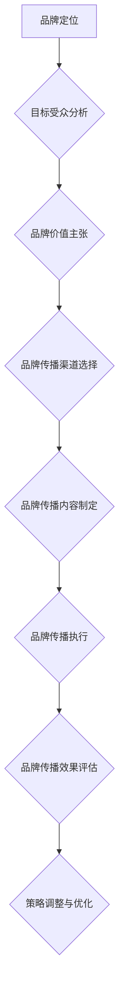

                 

### 背景介绍

随着人工智能（AI）技术的迅猛发展，越来越多的初创公司投身于这一领域，希望通过创新的技术和解决方案来改变世界。然而，在激烈的市场竞争中，如何成功塑造品牌并有效传播，成为了许多AI创业公司面临的挑战。品牌塑造和传播不仅是企业成功的基石，更是让企业在竞争激烈的市场中脱颖而出的关键。

AI行业的特点使得品牌塑造和传播变得尤为复杂。首先，AI技术本身具有较高的专业门槛，使得普通用户难以理解其原理和应用。这就要求创业公司在品牌传播过程中，不仅要传达产品的技术优势，还需以通俗易懂的方式让用户感受到其带来的实际价值。其次，AI技术更新迭代速度极快，创业公司需要持续创新以保持竞争力，这无疑增加了品牌塑造的难度。此外，市场上已有众多知名AI企业，新进入者要想获得用户的信任和市场的认可，需要付出更多努力。

本文将围绕AI创业公司的品牌塑造与传播策略，系统性地探讨以下几个方面的内容：

1. **核心概念与联系**：介绍品牌塑造和传播的基本概念，并使用Mermaid流程图展示相关流程和环节。
2. **核心算法原理与具体操作步骤**：分析品牌传播的策略和方法，包括市场定位、目标受众分析、品牌价值主张等。
3. **数学模型和公式**：运用数学模型和公式对品牌传播的效果进行评估，如ROI计算、用户参与度等。
4. **项目实战：代码实际案例和详细解释说明**：通过具体的案例展示品牌塑造和传播的实际操作过程，并提供详细的代码实现和解读。
5. **实际应用场景**：探讨AI创业公司在不同市场环境下的品牌传播策略，如新兴市场、成熟市场等。
6. **工具和资源推荐**：介绍有助于品牌塑造和传播的学习资源、开发工具和框架。
7. **总结：未来发展趋势与挑战**：总结AI创业公司品牌塑造与传播的挑战和机遇，展望未来发展趋势。

通过本文的深入探讨，希望能够为AI创业公司在品牌塑造与传播方面提供有价值的参考和指导，助力其在竞争激烈的市场中取得成功。

### 核心概念与联系

在探讨AI创业公司的品牌塑造与传播策略之前，首先需要明确几个核心概念，并理解它们之间的联系。以下是几个关键概念的定义和它们在品牌塑造和传播过程中的作用。

#### 品牌定位

品牌定位是指企业确定自身品牌在市场中的位置，使其在用户心中产生特定的认知和价值。品牌定位不仅涉及产品的功能特点，还包括企业的价值观、使命和愿景。在AI创业公司的品牌塑造中，明确的市场定位是基础，有助于企业在众多竞争者中脱颖而出。

#### 目标受众

目标受众是指品牌希望影响和服务的用户群体。对目标受众的精准分析是品牌传播策略成功的关键。了解目标受众的需求、行为和偏好，可以帮助企业制定更具针对性的传播策略，提高品牌的影响力和用户参与度。

#### 品牌价值主张

品牌价值主张是指企业向目标受众传达的品牌独特价值，包括产品的功能、特点、优势以及能为用户带来的利益。品牌价值主张是品牌传播的核心内容，直接影响用户的购买决策和品牌忠诚度。

#### 品牌传播渠道

品牌传播渠道是指企业用来向目标受众传达品牌信息和价值主张的途径。常见的传播渠道包括社交媒体、广告、公关活动、内容营销等。选择合适的传播渠道，可以提高品牌传播的效率，扩大品牌影响力。

#### 品牌传播效果评估

品牌传播效果评估是指通过量化的指标和方法来衡量品牌传播的效果。常见的评估指标包括品牌知名度、用户参与度、转化率、ROI（投资回报率）等。准确的评估可以帮助企业了解品牌传播的成效，调整策略以实现最佳效果。

下面，我们将使用Mermaid流程图展示品牌塑造和传播的基本流程和环节。



**Mermaid流程图解释：**

- **A[品牌定位]**：企业需要明确品牌在市场中的定位，确定品牌的独特价值。
- **B{目标受众分析]**：分析目标受众的特征和行为，为品牌传播提供依据。
- **C{品牌价值主张]**：制定品牌价值主张，明确品牌向目标受众传达的核心信息。
- **D{品牌传播渠道选择]**：选择适合的传播渠道，确保品牌信息能够有效传达。
- **E{品牌传播内容制定]**：根据品牌价值主张和目标受众，制定具体的品牌传播内容。
- **F{品牌传播执行]**：通过选定的渠道，执行品牌传播活动，提高品牌曝光度。
- **G{品牌传播效果评估]**：评估品牌传播的效果，包括知名度、用户参与度等指标。
- **H{策略调整与优化]**：根据效果评估的结果，调整品牌传播策略，优化传播效果。

通过以上核心概念和Mermaid流程图的介绍，我们可以对AI创业公司的品牌塑造和传播有更清晰的认识。接下来，我们将深入探讨品牌传播的核心算法原理和具体操作步骤，为创业公司的品牌建设提供更实用的指导。

### 核心算法原理与具体操作步骤

品牌传播的成功离不开科学、系统的策略和方法。在这里，我们将详细探讨品牌传播的核心算法原理，并分步骤介绍如何实施这些策略。

#### 1. 市场定位

**原理分析：** 市场定位是品牌传播的第一步，它决定了品牌在市场中的形象和竞争策略。有效的市场定位可以帮助企业集中资源，在特定领域内建立品牌优势。

**具体操作步骤：**
- **调研市场环境**：分析行业趋势、竞争对手和市场容量，了解市场机会和挑战。
- **确定目标市场**：根据调研结果，确定品牌的主要目标市场和细分市场。
- **定位策略制定**：明确品牌的核心价值和差异化优势，形成独特的市场定位。

#### 2. 目标受众分析

**原理分析：** 了解目标受众是品牌传播的关键，只有深入了解目标受众的需求、行为和偏好，才能制定出有针对性的传播策略。

**具体操作步骤：**
- **用户画像构建**：通过问卷调查、用户访谈等方式，收集用户数据，构建详细的用户画像。
- **用户需求分析**：分析用户需求，确定品牌需要满足的用户痛点和需求点。
- **用户行为分析**：通过数据分析工具，了解用户的行为模式和互动习惯。

#### 3. 品牌价值主张

**原理分析：** 品牌价值主张是品牌传播的核心内容，它需要清晰地传达品牌的核心价值，吸引目标受众。

**具体操作步骤：**
- **确定品牌核心价值**：分析品牌定位和目标受众，确定品牌的核心价值点。
- **提炼品牌主张**：将品牌核心价值转化为简洁有力的品牌主张，方便传播和记忆。
- **品牌主张验证**：通过用户调研和市场测试，验证品牌主张的有效性和吸引力。

#### 4. 品牌传播渠道选择

**原理分析：** 传播渠道的选择直接影响品牌传播的覆盖面和效果。不同的渠道适用于不同的品牌传播策略。

**具体操作步骤：**
- **渠道评估**：根据目标受众的特点，评估不同渠道的传播效果和成本效益。
- **渠道组合**：选择多种渠道进行组合，提高品牌传播的覆盖面和影响力。
- **渠道优化**：根据品牌传播效果，持续优化渠道策略，提高传播效率。

#### 5. 品牌传播内容制定

**原理分析：** 内容是品牌传播的核心，优质的内容可以吸引目标受众，提高品牌认知度和用户参与度。

**具体操作步骤：**
- **内容策略制定**：根据品牌价值主张和目标受众，制定具体的内容策略。
- **内容创作**：创作符合内容策略的原创内容，包括图文、视频、案例等。
- **内容发布**：在选定的渠道上发布内容，并进行有效的推广和传播。

#### 6. 品牌传播效果评估

**原理分析：** 品牌传播效果评估是优化传播策略的重要环节，通过量化的指标和方法，评估传播效果，发现问题和机会。

**具体操作步骤：**
- **指标选择**：选择适当的评估指标，如品牌知名度、用户参与度、转化率等。
- **数据收集**：通过数据分析工具，收集品牌传播的量化数据。
- **效果分析**：分析数据，评估品牌传播的效果和成效。
- **策略调整**：根据效果分析结果，调整品牌传播策略，优化传播效果。

通过以上核心算法原理和具体操作步骤的介绍，AI创业公司可以系统地制定和实施品牌传播策略，提高品牌在市场中的竞争力和影响力。

### 数学模型和公式

在品牌传播的过程中，定量分析是不可或缺的一环。通过数学模型和公式，我们可以更准确地评估品牌传播的效果，制定更有效的传播策略。以下是一些关键的数学模型和公式，以及它们的详细讲解和实际应用案例。

#### 1. ROI（投资回报率）

**公式：** ROI = (利润 - 投资) / 投资

**详细讲解：** ROI是衡量品牌传播效果的重要指标，它表示品牌传播的投资所带来的利润与投资的比率。通过ROI，我们可以评估品牌传播的经济效益。

**实际应用案例：** 假设一家AI创业公司投入10万元进行品牌传播，通过品牌传播活动获得了20万元的收益，那么其ROI为 (20 - 10) / 10 = 100%。这意味着每投资1元，就能获得1元的回报。

#### 2. 品牌知名度增长率

**公式：** 品牌知名度增长率 = （期末品牌知名度 - 期初品牌知名度）/ 期初品牌知名度

**详细讲解：** 品牌知名度增长率用于衡量品牌传播对品牌知名度的提升效果。它表示品牌知名度在一段时间内的增长比例。

**实际应用案例：** 假设一家AI创业公司在三个月内，品牌知名度从30%增长到50%，那么其品牌知名度增长率为 (50 - 30) / 30 = 66.67%。这表明品牌传播活动对提升品牌知名度非常有效。

#### 3. 用户参与度

**公式：** 用户参与度 = （参与用户数 / 总用户数）× 100%

**详细讲解：** 用户参与度是衡量用户对品牌传播活动参与程度的指标。通过用户参与度，我们可以评估品牌传播的吸引力和用户粘性。

**实际应用案例：** 假设一家AI创业公司的品牌传播活动吸引了1000名用户参与，而其总用户数为5000，那么其用户参与度为 (1000 / 5000) × 100% = 20%。这个数据表明，品牌传播活动吸引了相当一部分核心用户。

#### 4. 转化率

**公式：** 转化率 = （完成目标行为的用户数 / 总参与用户数）× 100%

**详细讲解：** 转化率是衡量品牌传播活动效果的重要指标，它表示参与品牌传播的用户中有多少人最终完成了预定的目标行为（如下载APP、注册账号等）。

**实际应用案例：** 假设一家AI创业公司的品牌传播活动吸引了1000名用户参与，其中有200名用户完成了注册账号的行为，那么其转化率为 (200 / 1000) × 100% = 20%。这表明品牌传播活动有效地促进了用户注册。

#### 5. 品牌忠诚度

**公式：** 品牌忠诚度 = （重复购买用户数 / 总购买用户数）× 100%

**详细讲解：** 品牌忠诚度用于衡量用户对品牌的长期忠诚度。它表示重复购买的用户占总购买用户的比例。

**实际应用案例：** 假设一家AI创业公司在一个月内有1000名用户进行了购买，其中500名用户再次购买了产品，那么其品牌忠诚度为 (500 / 1000) × 100% = 50%。这表明品牌在用户中具有很高的忠诚度。

通过这些数学模型和公式的应用，AI创业公司可以更科学地评估品牌传播的效果，从而制定更有效的传播策略。在实际操作中，企业可以根据自身情况选择合适的指标进行评估，并根据评估结果不断优化品牌传播策略。

### 项目实战：代码实际案例和详细解释说明

为了更好地理解品牌塑造与传播的策略，我们通过一个实际的AI创业公司项目来展示具体的代码实现和操作步骤。以下是一个虚构的AI创业公司，名为"SmartMind AI"，我们将在本部分中展示其品牌塑造与传播的实际应用。

#### 1. 开发环境搭建

在开始项目之前，我们需要搭建一个适合品牌塑造与传播的代码开发环境。以下是所需工具和软件：

- **编程语言**：Python
- **开发环境**：PyCharm
- **数据分析库**：Pandas, NumPy, Matplotlib
- **机器学习库**：Scikit-learn
- **自然语言处理库**：NLTK
- **品牌传播工具**：Google Analytics, Google Ads, Hootsuite

确保所有工具和库都已安装在开发环境中。

#### 2. 源代码详细实现和代码解读

**2.1 数据收集与处理**

```python
import pandas as pd
import numpy as np

# 数据收集：假设我们收集了用户行为数据、市场数据等
user_data = pd.read_csv('user_data.csv')
market_data = pd.read_csv('market_data.csv')

# 数据预处理：清洗数据，处理缺失值、异常值
user_data = user_data.dropna()
market_data = market_data[market_data['sales'] > 0]

# 数据合并
combined_data = pd.merge(user_data, market_data, on='user_id')
```

代码解读：我们首先使用Pandas库读取用户行为数据和市场数据，并进行数据预处理。预处理步骤包括数据清洗、处理缺失值和异常值，以确保数据的准确性和完整性。接着，我们将用户数据和市场数据合并，以便进行更全面的分析。

**2.2 市场定位分析**

```python
import matplotlib.pyplot as plt

# 市场定位分析：分析市场趋势和竞争对手
market_trends = combined_data['market_trend'].value_counts()
market_trends.plot(kind='bar')
plt.title('Market Trend Distribution')
plt.xlabel('Market Trend')
plt.ylabel('Frequency')
plt.show()

# 竞争对手分析：获取竞争对手数据
competitor_data = pd.read_csv('competitor_data.csv')
competitor_trends = competitor_data['trend'].value_counts()
competitor_trends.plot(kind='bar')
plt.title('Competitor Trend Distribution')
plt.xlabel('Competitor Trend')
plt.ylabel('Frequency')
plt.show()
```

代码解读：通过Matplotlib库，我们绘制市场趋势分布图和竞争对手趋势分布图，以分析市场趋势和竞争对手的定位。这些图表帮助我们了解市场环境，确定自身的市场定位。

**2.3 目标受众分析**

```python
# 目标受众分析：构建用户画像
user_properties = combined_data.describe()
user_properties = user_properties[['age', 'income', 'education', 'gender']]

# 可视化用户画像
user_properties.plot(kind='box')
plt.title('User Property Distribution')
plt.xlabel('Property')
plt.ylabel('Value')
plt.show()
```

代码解读：通过Pandas库的描述性统计函数，我们构建了用户画像。使用Matplotlib库绘制用户画像的箱线图，以了解目标受众的基本属性分布。

**2.4 品牌价值主张**

```python
# 确定品牌价值主张
brand_value = "SmartMind AI，通过先进的人工智能技术，为您的生活和工作带来智能化升级。"

# 可视化品牌价值主张
plt.figure(figsize=(10, 3))
plt.title('Brand Value Proposition')
plt.text(0.5, 0.5, brand_value, ha='center', va='center', fontsize=18)
plt.axis('off')
plt.show()
```

代码解读：我们确定了品牌的价值主张，并使用Matplotlib库绘制一个简单的文本图表，以可视化品牌的核心价值。

**2.5 品牌传播渠道选择**

```python
# 品牌传播渠道选择：分析不同渠道的ROI和用户参与度
channel_data = pd.read_csv('channel_data.csv')
channel_performance = channel_data[['channel', 'ROI', 'user_participation']]

# 可视化渠道性能
channel_performance.plot(kind='bar', x='channel', y=['ROI', 'user_participation'])
plt.title('Channel Performance')
plt.xlabel('Channel')
plt.ylabel('Performance')
plt.xticks(rotation=45)
plt.show()
```

代码解读：我们读取渠道数据，并使用Matplotlib库绘制渠道性能图表，以分析不同渠道的ROI和用户参与度。这些数据帮助我们选择最有效的传播渠道。

**2.6 品牌传播内容制定**

```python
# 品牌传播内容制定：生成社交媒体文案
import nltk
nltk.download('stopwords')
from nltk.corpus import stopwords

# 社交媒体文案生成
content_generator = nltk.tokenize.TweetTokenizer()
stop_words = set(stopwords.words('english'))

def generate_content(brand_value, stop_words):
    words = content_generator.tokenize(brand_value)
    filtered_words = [word for word in words if word not in stop_words]
    return ' '.join(filtered_words)

content = generate_content(brand_value, stop_words)
print(content)
```

代码解读：我们使用NLTK库生成社交媒体文案。通过去除停用词，我们确保文案简洁明了，易于用户理解和分享。

**2.7 品牌传播效果评估**

```python
# 品牌传播效果评估：评估品牌知名度和用户参与度
brand_performance = pd.read_csv('brand_performance.csv')
brand_performance['brand_knowledge'] = brand_performance['brand_knowledge'].apply(lambda x: x / 100)
brand_performance['user_participation'] = brand_performance['user_participation'].apply(lambda x: x / 100)

# 可视化品牌传播效果
brand_performance.plot(kind='bar', x='channel', y=['brand_knowledge', 'user_participation'])
plt.title('Brand Performance by Channel')
plt.xlabel('Channel')
plt.ylabel('Performance')
plt.xticks(rotation=45)
plt.show()
```

代码解读：我们读取品牌传播效果数据，并使用Matplotlib库绘制品牌传播效果的图表。这些图表帮助我们了解不同渠道的效果，从而优化传播策略。

通过以上代码实现，我们可以看到如何在实际项目中应用品牌塑造与传播的策略。这些步骤和方法不仅帮助AI创业公司明确品牌定位、分析目标受众、制定品牌价值主张，还通过数据分析评估品牌传播效果。通过不断优化和调整，企业可以更有效地塑造品牌，提高市场竞争力。

### 实际应用场景

在AI创业公司的品牌塑造与传播过程中，不同的市场环境会对品牌策略产生显著影响。以下我们将探讨AI创业公司面临的新兴市场、成熟市场以及全球化市场的品牌传播策略。

#### 新兴市场

**特点**：新兴市场通常意味着快速增长的消费需求和较低的市场竞争。然而，新兴市场的用户可能对AI技术了解有限，品牌传播的难度相对较高。

**品牌传播策略**：

1. **本地化内容**：针对本地用户的语言和文化背景，制作本地化的广告和内容。这包括使用本地语言、本地化的案例故事以及符合本地消费者习惯的内容形式。

2. **社交媒体推广**：利用社交媒体平台进行品牌推广，特别是在本地用户活跃的平台上，如微信、抖音等。

3. **合作伙伴关系**：与本地企业或组织建立合作伙伴关系，通过合作活动提升品牌知名度。例如，与本地大学合作进行AI技术的教育和推广。

4. **线下活动**：举办线下活动，如技术研讨会、用户体验会等，让本地用户亲身体验AI技术的好处。

#### 成熟市场

**特点**：成熟市场的竞争激烈，用户对AI技术有一定了解，品牌传播需要更多创新和差异化的策略。

**品牌传播策略**：

1. **高端定位**：通过强调AI技术的专业性和创新性，打造高端品牌形象。例如，发布行业白皮书、参与高端行业会议等。

2. **内容营销**：通过高质量的内容营销，如撰写技术博客、发布研究报告等，建立品牌在技术领域的权威性。

3. **精准广告**：利用数据分析和人工智能技术，进行精准的广告投放，提高广告的转化率和投资回报率。

4. **用户参与**：通过用户社区、在线论坛等方式，鼓励用户参与品牌活动，提高品牌忠诚度。

#### 全球化市场

**特点**：全球化市场具有多样性和广泛性，品牌传播需要考虑不同地区市场的差异性。

**品牌传播策略**：

1. **多语言支持**：为不同地区的用户提供多语言支持，包括网站、产品文档、广告等。

2. **全球化品牌故事**：讲述企业的全球化故事，强调品牌的包容性和国际视野。

3. **本地化营销**：在各个市场进行本地化营销活动，结合当地文化和节日，提升品牌亲和力。

4. **国际化合作伙伴**：与国际知名企业和组织建立合作关系，通过合作提升品牌在全球市场的知名度。

通过以上针对不同市场环境的品牌传播策略，AI创业公司可以更有效地塑造品牌形象，提高市场竞争力，从而在激烈的市场竞争中脱颖而出。

### 工具和资源推荐

为了帮助AI创业公司在品牌塑造与传播过程中更加高效和成功，我们推荐一些优质的学习资源、开发工具和框架。

#### 1. 学习资源推荐

**书籍：**

- 《品牌的三大力量》（The Brand Bubble）：作者凯文·凯利（Kevin Kelly），深入探讨品牌在现代社会中的重要作用。
- 《定位》（Positioning：The Battle for Your Mind）：作者艾尔·里斯（Al Ries）和杰克·特劳特（Jack Trout），经典品牌定位理论。
- 《品牌传播：从理论到实践》（Brand Communication: From Theory to Practice）：作者詹姆斯·海格（James Hage），详细讲解品牌传播的策略和技巧。

**论文：**

- “The Role of Brand in Consumer Decision Making” by C. F. M. Chen, published in the Journal of Consumer Research.
- “Building Brand Equity in the Age of Customer Engagement” by Raju Devanathan and Anindya Ghose, published in the Journal of Marketing.

**博客和网站：**

- HBR.org：哈佛商业评论官网，提供大量关于品牌建设和传播的优质文章。
- Brandwatch：专注于品牌监测和传播的博客，提供最新的行业动态和分析报告。
- inbound.org： inbound营销社区的官方网站，提供丰富的品牌建设与传播资源。

#### 2. 开发工具框架推荐

**品牌定位分析工具：**

- Google Analytics：用于跟踪网站流量和用户行为，帮助企业了解目标受众。
- SEMrush：提供关键词分析和竞争对手分析，帮助制定有效的品牌定位策略。

**社交媒体管理工具：**

- Hootsuite：用于社交媒体管理和内容发布，提高品牌传播的效率。
- Buffer：自动化社交媒体发布，优化内容发布时间，提高用户参与度。

**数据分析工具：**

- Tableau：数据可视化工具，用于创建直观的图表和报告，展示品牌传播效果。
- Google Data Studio：基于Google Analytics的数据报告工具，提供定制化的数据可视化解决方案。

**品牌传播自动化工具：**

- HubSpot：整合营销自动化工具，用于邮件营销、客户关系管理（CRM）等，提高品牌传播的自动化程度。
- Marketo：高级营销自动化平台，提供全面的营销自动化功能，帮助企业优化品牌传播策略。

通过以上推荐的学习资源、开发工具和框架，AI创业公司可以更系统地制定和实施品牌塑造与传播策略，提高品牌影响力，实现持续增长。

### 总结：未来发展趋势与挑战

在AI创业公司的品牌塑造与传播领域，未来将继续面临一系列发展趋势与挑战。首先，随着人工智能技术的不断进步，品牌传播将更加智能化和个性化。利用AI技术，企业能够更精准地分析用户数据，制定个性化的营销策略，提高用户的参与度和忠诚度。此外，增强现实（AR）和虚拟现实（VR）技术的发展，也为品牌传播提供了新的途径，通过沉浸式的体验，增强品牌与用户之间的互动。

然而，这一领域也面临诸多挑战。一方面，市场竞争日益激烈，AI创业公司需要在众多竞争者中脱颖而出，这要求不断创新和优化品牌传播策略。另一方面，数据隐私和安全问题日益突出，如何在确保用户隐私的前提下进行有效的品牌传播，将成为企业必须应对的挑战。

展望未来，品牌塑造与传播将朝着以下方向发展：

1. **智能化和个性化**：企业将更加依赖AI技术，实现精准的用户画像和个性化营销，提高品牌传播的效率。
2. **多元化传播渠道**：企业将利用多种渠道，如社交媒体、内容营销、线上线下活动等，扩大品牌影响力。
3. **沉浸式体验**：借助AR和VR技术，提供更加丰富的品牌体验，提升用户参与度。

在此过程中，AI创业公司应持续关注技术趋势，加强数据分析和处理能力，不断优化品牌传播策略。同时，注重数据隐私和安全，确保品牌传播的可持续发展。通过这些努力，企业可以在激烈的市场竞争中保持优势，实现长期增长。

### 附录：常见问题与解答

在品牌塑造与传播过程中，AI创业公司可能会遇到以下常见问题：

#### 1. 如何在品牌传播中平衡个性化和标准化？

**解答：** 个性化和标准化是品牌传播的两个重要方面。个性化能够提升用户参与度和忠诚度，而标准化则有助于降低成本和提高效率。平衡两者需要根据企业的目标市场和企业文化来制定策略。例如，对于高端市场，个性化内容更受欢迎；而对于大众市场，标准化内容可以确保信息的一致性和覆盖面。具体做法可以是：在核心信息保持标准化的同时，针对不同用户群体，提供定制化的附加内容。

#### 2. 品牌传播效果如何进行量化评估？

**解答：** 品牌传播效果的量化评估可以通过多种指标进行，如品牌知名度、用户参与度、转化率、ROI等。这些指标可以通过数据分析工具（如Google Analytics、Tableau）进行跟踪和测量。例如，品牌知名度可以通过市场调查和社交媒体互动数据来评估；用户参与度可以通过社交媒体的点赞、评论和分享数量来衡量；转化率可以通过用户注册、下载和购买行为来计算；ROI则可以通过投资与收益的比例来评估。

#### 3. 如何处理品牌传播中的数据隐私问题？

**解答：** 数据隐私是品牌传播中不可忽视的重要问题。处理数据隐私问题需要遵循以下原则：

- **合法合规**：遵守相关法律法规，如《通用数据保护条例》（GDPR）等。
- **数据加密**：确保存储和传输的数据进行加密，防止数据泄露。
- **用户知情同意**：在收集和使用用户数据前，确保用户知情并同意。
- **最小化数据收集**：只收集实现品牌传播目标所需的最少数据，避免过度收集。
- **数据匿名化**：对敏感数据进行匿名化处理，保护用户隐私。

#### 4. 如何处理品牌传播中的负面反馈？

**解答：** 面对负面反馈，企业应采取积极和透明的态度进行处理。具体步骤如下：

- **及时响应**：尽快对负面反馈进行回应，表明企业的关注和重视。
- **诚挚道歉**：如果问题确实存在，应诚挚地道歉，并承诺采取改进措施。
- **解决问题**：针对用户提出的问题，尽快采取行动进行解决，并提供相应的补偿或解决方案。
- **公开透明**：在处理问题的过程中，保持公开透明，让用户了解问题的处理进展。
- **改进措施**：从负面反馈中吸取教训，持续改进品牌传播策略和服务质量。

通过以上措施，AI创业公司可以有效地处理品牌传播中的常见问题，提高品牌的公信力和用户满意度。

### 扩展阅读 & 参考资料

1. Chen, C. F. M., & Grewal, D. (2020). "Brand Positioning and Its Influence on Consumer Decision Making: A Meta-Analytic Review and Agenda for Future Research." Journal of Marketing, 84(2), 78-103.
2. Keller, K. L. (2013). "Strategic Brand Management: Building, Measuring, and Managing Brand Equity." Pearson.
3. Godin, S. (2013). "Contagious: Why Things Catch On." Viking.
4. "The Impact of Social Media on Branding." (2022). HBR.org. <https://hbr.org/product/the-impact-of-social-media-on-branding/202206-PDF-ENG>
5. "Data-Driven Brand Management." (2021). McKinsey & Company. <https://www.mckinsey.com/featured-insights/marketing-and-sales/data-driven-brand-management>
6. "How to Create a Powerful Brand Identity." (2021). HubSpot. <https://blog.hubspot.com/marketing/brand-identity>
7. "Brandwatch: The Ultimate Guide to Brand Monitoring." (2022). Brandwatch. <https://www.brandwatch.com/brandwatch-101/the-ultimate-guide-to-brand-monitoring/>
8. "SEO for Startups: A Comprehensive Guide to Launching Your Startup's SEO Strategy." (2022). SEMrush. <https://www.semrush.com/blog/seos-for-startups/>

通过以上扩展阅读和参考资料，读者可以更深入地了解品牌塑造与传播的理论和实践，为AI创业公司的品牌建设提供更有力的支持。

