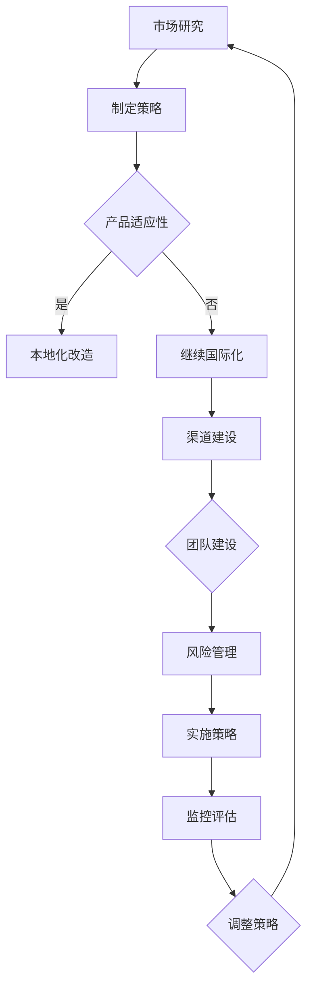

                 

# AI创业公司的国际化策略

> 关键词：国际化策略、AI创业、全球化、市场拓展、文化适应性

> 摘要：本文将探讨AI创业公司如何制定并实施有效的国际化策略，以在全球范围内拓展市场、提升品牌影响力并实现长期可持续发展。通过分析AI行业的特点、国际化的重要性和步骤，结合实际案例，为创业者提供具有实操性的指导和建议。

## 1. 背景介绍

近年来，人工智能（AI）技术取得了显著进展，已成为推动产业变革和社会进步的重要力量。AI创业公司如雨后春笋般涌现，它们在各个领域展现出强大的创新能力和市场潜力。然而，随着市场竞争的加剧和技术的快速迭代，AI创业公司不仅需要在国内市场站稳脚跟，还需积极拓展国际市场，以实现全球化的战略目标。

国际化对于AI创业公司来说具有重要意义。首先，国际市场的拓展可以为企业带来更多的商业机会和收入来源，从而缓解国内市场的竞争压力。其次，国际化有助于AI创业公司吸收全球先进的技术和管理经验，提升自身核心竞争力。此外，国际化还可以帮助企业树立品牌形象，增强在全球范围内的市场影响力。

然而，国际化并非一蹴而就的过程，AI创业公司在实施国际化战略时需要面临诸多挑战。例如，不同国家和地区在文化、法律、政策等方面存在差异，企业需要深入了解并适应这些差异。此外，国际市场的竞争更加激烈，企业需要在产品、技术、服务等方面具备较强的竞争力。因此，如何制定并实施有效的国际化策略成为AI创业公司亟待解决的重要课题。

本文将围绕以下内容展开讨论：

1. AI行业的特点及其国际化趋势。
2. 国际化策略的核心概念和关键步骤。
3. 成功国际化的AI创业公司案例分析。
4. 国际化过程中面临的挑战及应对策略。
5. 国际化策略的未来发展趋势和前景。

通过本文的探讨，希望能够为AI创业公司在制定和实施国际化策略过程中提供有益的启示和借鉴。

## 2. 核心概念与联系

在深入探讨AI创业公司的国际化策略之前，有必要了解几个核心概念及其相互联系。

### 2.1 AI行业的全球化趋势

随着AI技术的不断成熟和应用的广泛推广，全球范围内对AI技术的需求持续增长。各大国家和地区纷纷加大对AI技术的投资和研发力度，以抢占技术创新和产业发展的制高点。例如，美国、中国、欧盟等国家和地区在AI领域投入了大量资源，形成了全球AI技术创新的三大中心。这种全球化的趋势为AI创业公司提供了广阔的市场空间和发展机遇。

### 2.2 国际化战略的定义和目标

国际化战略是指企业在全球范围内开展业务、拓展市场和实现盈利目标的一系列策略和措施。对于AI创业公司来说，国际化战略的主要目标是：

1. 市场拓展：开拓新的国际市场，提高企业的市场份额和竞争力。
2. 技术创新：吸收全球先进技术，推动企业技术创新和产品迭代。
3. 品牌建设：提升品牌知名度和美誉度，增强企业国际影响力。
4. 收入增长：通过国际市场的拓展，实现收入来源的多元化和稳定增长。

### 2.3 文化适应性

文化适应性是指企业在国际化过程中，对目标市场所在国的文化、价值观、消费习惯等进行深入了解和适应。文化适应性是成功国际化的关键因素之一，因为它直接关系到产品和服务在目标市场的接受度和市场份额。例如，不同国家和地区在数据隐私、数据安全等方面的法律和政策存在差异，企业需要遵守当地法律法规，以避免法律纠纷和商业风险。

### 2.4 国际化策略与本地化策略

国际化策略和本地化策略是企业国际化过程中两个重要的策略。国际化策略侧重于在全球范围内推广企业的核心技术和产品，以实现全球化的经营模式。而本地化策略则强调根据目标市场的特点和需求，对产品和服务进行本土化改造，以更好地适应当地消费者的需求。例如，在市场营销方面，企业需要根据不同市场的文化背景和消费习惯，制定差异化的营销策略。

### 2.5 国际化与本土化的关系

国际化与本土化并非相互对立的关系，而是相辅相成的。国际化策略为企业在全球范围内的扩张提供了基础和方向，而本地化策略则有助于企业更好地适应当地市场，实现市场的细化和深耕。在实际操作中，企业需要根据自身的战略目标和市场环境，合理配置国际化与本地化的资源，以实现最佳的市场效果。

### 2.6 国际化过程中的关键因素

在国际化过程中，企业需要关注以下几个关键因素：

1. **市场研究**：深入了解目标市场的需求、竞争格局、法律法规等，为制定国际化策略提供依据。
2. **产品适应性**：根据目标市场的特点，对产品进行本土化改造，提高产品的市场竞争力。
3. **渠道建设**：建立覆盖目标市场的销售渠道和服务网络，提高市场渗透率和客户满意度。
4. **团队建设**：组建国际化团队，提升员工的跨文化沟通能力和市场拓展能力。
5. **风险管理**：建立健全的风险管理体系，防范国际市场的政治、经济、法律等风险。

### 2.7 Mermaid流程图

为了更清晰地展示国际化策略的核心概念和步骤，我们可以使用Mermaid流程图进行描述。以下是一个简化的国际化策略流程图：



通过上述流程图，我们可以看到国际化策略的各个环节及其相互关系。企业需要根据市场研究和产品适应性分析的结果，制定符合自身特点的国际化策略，并逐步实施和调整，以确保国际化的成功。

## 3. 核心算法原理 & 具体操作步骤

在实施国际化策略的过程中，企业需要运用一系列核心算法和具体操作步骤，以确保策略的有效性和可执行性。以下是几个关键步骤的详细说明：

### 3.1 市场研究算法

市场研究是国际化策略制定的基础，通过数据分析和市场调研，企业可以了解目标市场的需求、竞争格局、法律法规等。以下是一种常用的市场研究算法：

1. **数据收集**：收集目标市场的市场数据、消费者行为数据、竞争者数据等。
2. **数据预处理**：清洗和整合数据，确保数据的准确性和一致性。
3. **数据分析**：使用统计方法和机器学习算法，对数据进行分析和挖掘，提取有用的信息。
4. **可视化展示**：使用图表和报表，将分析结果以直观的方式展示出来，为策略制定提供依据。

### 3.2 产品适应性算法

产品适应性是国际化策略的核心环节，通过算法和具体操作，企业可以实现对产品的本土化改造。以下是一种常用的产品适应性算法：

1. **需求分析**：分析目标市场的需求，了解消费者的喜好、习惯和偏好。
2. **功能对比**：对比不同市场的产品功能，识别差异点和优化方向。
3. **算法匹配**：使用机器学习算法，根据目标市场的需求，优化产品的功能和服务。
4. **测试验证**：在目标市场进行产品测试，收集用户反馈，不断迭代和优化产品。

### 3.3 渠道建设算法

渠道建设是国际化策略实施的重要手段，通过算法和具体操作，企业可以建立覆盖目标市场的销售渠道和服务网络。以下是一种常用的渠道建设算法：

1. **市场细分**：根据目标市场的特点，进行市场细分，确定不同细分市场的需求和偏好。
2. **渠道选择**：选择适合目标市场的销售渠道，如线上平台、线下门店、代理商等。
3. **渠道优化**：使用机器学习算法，根据销售数据和市场反馈，不断优化渠道策略和运营模式。
4. **资源分配**：根据市场细分和渠道选择的结果，合理分配资源和预算，确保渠道的可持续发展。

### 3.4 团队建设算法

团队建设是国际化策略成功实施的关键因素，通过算法和具体操作，企业可以组建一支高效的国际化团队。以下是一种常用的团队建设算法：

1. **人才招聘**：根据国际化战略的需求，招聘具备跨文化沟通能力和市场拓展经验的人才。
2. **能力评估**：使用能力评估工具，对团队成员的能力和潜力进行评估。
3. **培训发展**：为团队成员提供跨文化沟通、市场拓展、技术培训等，提升其专业能力和综合素质。
4. **绩效管理**：建立科学的绩效管理体系，激励团队成员积极参与国际化项目，提升团队整体执行力。

### 3.5 风险管理算法

风险管理是国际化策略实施过程中不可忽视的重要环节，通过算法和具体操作，企业可以识别和应对国际市场的各种风险。以下是一种常用的风险管理算法：

1. **风险评估**：使用风险评估工具，识别目标市场可能面临的政治、经济、法律、社会等方面的风险。
2. **风险监控**：建立风险监控体系，实时跟踪和评估市场风险的变化。
3. **风险应对**：根据风险评估结果，制定相应的风险应对策略，如规避、转移、减轻或接受风险。
4. **应急响应**：建立应急预案，确保在风险发生时能够迅速响应和处置，降低风险对企业运营的影响。

通过上述核心算法和具体操作步骤，企业可以系统性地实施国际化策略，提高国际市场的竞争力和可持续发展能力。

## 4. 数学模型和公式 & 详细讲解 & 举例说明

在国际化策略的实施过程中，数学模型和公式可以帮助企业更好地理解和预测市场行为，从而制定更为科学的决策。以下将介绍几个关键的数学模型和公式，并进行详细讲解和举例说明。

### 4.1 市场渗透模型

市场渗透模型用于预测企业在特定市场的产品或服务的市场份额。以下是一个简化的市场渗透模型：

\[ \text{市场份额} = \frac{\text{产品销售量}}{\text{市场总需求量}} \]

#### 详细讲解：

1. **产品销售量**：指企业在特定市场的产品或服务的实际销售数量。
2. **市场总需求量**：指目标市场在特定产品或服务上的总需求量。

#### 举例说明：

假设一家AI创业公司的产品在目标市场的年销售量为1000台，而该市场的总需求量为10000台，则其市场份额为：

\[ \text{市场份额} = \frac{1000}{10000} = 0.1 \text{或} 10\% \]

通过这个模型，企业可以了解其在目标市场的竞争力，并制定相应的市场拓展策略。

### 4.2 费用效益分析模型

费用效益分析模型用于评估企业在国际化过程中的投资回报率（ROI）。以下是一个简单的费用效益分析模型：

\[ \text{ROI} = \frac{\text{投资收益}}{\text{总投资成本}} \]

#### 详细讲解：

1. **投资收益**：企业在国际化过程中所获得的利润和收益。
2. **总投资成本**：企业在国际化过程中所投入的总成本，包括研发、市场推广、人力资源等。

#### 举例说明：

假设一家AI创业公司在国际化过程中总投资成本为500万元，通过市场拓展和产品销售，年收益达到800万元，则其投资回报率为：

\[ \text{ROI} = \frac{800}{500} = 1.6 \text{或} 160\% \]

通过这个模型，企业可以评估国际化策略的投资效益，以便调整和优化资源分配。

### 4.3 文化适应性指数模型

文化适应性指数模型用于衡量企业在国际化过程中对目标市场的文化适应程度。以下是一个简化的文化适应性指数模型：

\[ \text{文化适应性指数} = \frac{\text{符合当地文化的要素数量}}{\text{总要素数量}} \]

#### 详细讲解：

1. **符合当地文化的要素数量**：企业在产品、服务、营销等方面符合目标市场文化的要素数量。
2. **总要素数量**：企业在产品、服务、营销等方面所有要素的总数量。

#### 举例说明：

假设一家AI创业公司在目标市场的产品和服务中有5个符合当地文化的要素，总共有10个要素，则其文化适应性指数为：

\[ \text{文化适应性指数} = \frac{5}{10} = 0.5 \text{或} 50\% \]

通过这个模型，企业可以评估自身在文化适应性方面的表现，并制定改进措施。

### 4.4 跨文化沟通模型

跨文化沟通模型用于优化企业在国际化过程中的跨文化沟通效果。以下是一个简化的跨文化沟通模型：

\[ \text{沟通效果} = \text{文化适应性} \times \text{沟通频率} \times \text{沟通渠道效率} \]

#### 详细讲解：

1. **文化适应性**：企业在沟通过程中对目标市场的文化适应程度。
2. **沟通频率**：企业进行沟通的频率。
3. **沟通渠道效率**：企业所选用的沟通渠道的有效性。

#### 举例说明：

假设一家AI创业公司在目标市场的文化适应性指数为0.7，沟通频率为每周一次，沟通渠道效率为0.8，则其沟通效果为：

\[ \text{沟通效果} = 0.7 \times 1 \times 0.8 = 0.56 \text{或} 56\% \]

通过这个模型，企业可以评估跨文化沟通的效果，并优化沟通策略。

通过上述数学模型和公式的详细讲解和举例说明，企业可以在国际化过程中更加科学和系统地制定决策，提高国际市场拓展的成功率。

## 5. 项目实战：代码实际案例和详细解释说明

### 5.1 开发环境搭建

在进行国际化策略实施的项目实战中，首先需要搭建一个适合开发和测试的完整环境。以下是一个基本的开发环境搭建步骤：

1. **操作系统**：选择Linux操作系统，如Ubuntu或CentOS。
2. **编程语言**：选择Python作为主要编程语言。
3. **开发工具**：安装PyCharm或其他Python IDE。
4. **依赖管理**：使用pip工具安装必要的Python库，如NumPy、Pandas、Scikit-learn等。
5. **数据库**：安装SQLite或MySQL数据库。

### 5.2 源代码详细实现和代码解读

以下是一个简单的国际化策略实现案例，该案例使用Python编程语言，通过市场研究、产品适应性和渠道建设等算法，实现国际化策略的初步框架。

```python
#国际化策略实现示例

# 导入必要的库
import pandas as pd
from sklearn.cluster import KMeans
import matplotlib.pyplot as plt

# 5.2.1 市场研究数据导入
data = pd.read_csv('market_data.csv')
print(data.head())

# 5.2.2 数据预处理
# 数据清洗和整合
data.dropna(inplace=True)
features = data[['GDP', 'Internet Users', 'AI Investments']]

# 5.2.3 市场细分
# 使用K均值聚类进行市场细分
kmeans = KMeans(n_clusters=3, random_state=0).fit(features)
labels = kmeans.labels_

# 5.2.4 产品适应性
# 根据市场细分结果，调整产品特性
def adapt_product(cluster_label):
    if cluster_label == 0:
        # 调整产品以满足高收入、高教育背景市场的需求
        return '高端产品'
    elif cluster_label == 1:
        # 调整产品以满足中等收入、中等教育背景市场的需求
        return '标准产品'
    elif cluster_label == 2:
        # 调整产品以满足低收入、低教育背景市场的需求
        return '基础产品'

products = data['Product'].apply(adapt_product)

# 5.2.5 渠道建设
# 根据市场细分结果，选择合适的销售渠道
def select_channel(cluster_label):
    if cluster_label == 0:
        # 高收入市场，选择线上销售渠道
        return 'Online Sales'
    elif cluster_label == 1:
        # 中等收入市场，选择线上线下结合的销售渠道
        return 'Combination Sales'
    elif cluster_label == 2:
        # 低收入市场，选择线下销售渠道
        return 'Offline Sales'

channels = data['Channel'].apply(select_channel)

# 5.2.6 结果展示
data['Adapted Product'] = products
data['Selected Channel'] = channels
print(data.head())

# 5.2.7 可视化分析
plt.scatter(data['GDP'], data['Internet Users'], c=labels)
plt.xlabel('GDP')
plt.ylabel('Internet Users')
plt.title('Market Segmentation by K-Means')
plt.show()
```

### 5.3 代码解读与分析

上述代码实现了一个简化的国际化策略框架，主要包括市场研究、数据预处理、市场细分、产品适应性和渠道建设等步骤。以下是详细的代码解读：

1. **数据导入与预处理**：首先导入市场研究数据，然后进行数据清洗和整合，去除缺失值，确保数据的质量和一致性。

2. **市场细分**：使用K均值聚类算法（K-Means Clustering）对市场进行细分。K均值聚类是一种无监督学习算法，可以根据数据自身的特征将数据分为若干个簇（Cluster）。在市场研究中，簇代表不同的市场细分群体。

3. **产品适应性**：根据市场细分结果，调整产品的特性以适应不同市场的需求。在本例中，通过一个简单的函数`adapt_product`，根据不同的簇标签（Cluster Label）调整产品的名称和特性。

4. **渠道建设**：根据市场细分结果，选择合适的销售渠道。在本例中，通过另一个简单的函数`select_channel`，根据不同的簇标签选择不同的销售渠道。

5. **结果展示**：将调整后的产品特性和销售渠道加入原始数据中，并打印输出。此外，使用可视化工具（如matplotlib）对市场细分结果进行可视化展示，帮助理解和分析市场细分效果。

通过这个案例，我们可以看到如何使用Python编程语言和数据分析工具实现国际化策略的基本框架。在实际应用中，企业可以根据自身的需求和特点，进一步优化和扩展这个框架，以实现更为精细和有效的国际化策略。

### 6. 实际应用场景

在国际化的实际应用场景中，AI创业公司需要面对多样化的市场需求和竞争环境。以下是一些典型的应用场景及其解决方案：

#### 6.1 市场细分与定位

在不同国家和地区，消费者对AI产品和服务的需求和偏好存在显著差异。AI创业公司可以通过市场调研和数据挖掘，对目标市场进行细分，识别出具有不同消费特征的用户群体。例如，对于发达国家市场，消费者可能更加注重AI技术的先进性和安全性；而在发展中国家市场，价格和易用性可能是更为重要的考量因素。通过市场细分，公司可以针对不同细分市场制定相应的产品和服务策略，实现精准营销和有效定位。

#### 6.2 本地化改造

在国际化过程中，本地化改造是关键环节。本地化不仅涉及语言和文化的转换，还包括产品功能、用户界面和营销策略等方面的调整。例如，一家AI创业公司在中国市场推出智能助手产品时，需要根据中国消费者的使用习惯和偏好，优化产品的语音识别和语义理解能力，同时考虑文化习俗和法律法规，确保产品符合当地市场的规范和要求。

#### 6.3 渠道建设

有效的渠道建设是国际化成功的重要保障。AI创业公司需要根据不同市场的特点和需求，选择合适的销售渠道。例如，在欧美市场，线上销售渠道（如亚马逊、eBay等）可能更为有效；而在东南亚市场，线下渠道（如商场、专卖店等）可能占据更大比重。公司可以通过与当地合作伙伴建立合作关系，利用他们的渠道资源，快速打开市场。

#### 6.4 跨文化团队建设

国际化团队的建设和管理是国际化策略成功的关键。一个高效的国际化团队需要具备跨文化沟通能力和市场拓展经验。公司可以通过招聘外籍员工、组织跨国培训和文化交流活动，提升团队的国际视野和跨文化能力。此外，公司还应该建立健全的沟通机制，确保不同文化背景的团队成员之间能够顺畅合作。

#### 6.5 风险管理

国际市场充满不确定性，AI创业公司需要建立健全的风险管理体系，识别和应对各种潜在风险。例如，政治风险、经济风险、法律风险和文化风险都可能对公司的国际化进程产生影响。公司可以通过多元化市场布局、灵活的供应链管理和稳健的财务策略，降低风险对公司运营的影响。

#### 6.6 品牌建设与推广

品牌建设是国际化的重要组成部分。AI创业公司需要通过有效的品牌推广策略，提升品牌知名度和美誉度。例如，通过参与国际行业展会、发布有影响力的学术论文、开展社交媒体营销等，增强品牌在全球范围内的认知度和影响力。

#### 6.7 客户关系管理

在国际市场，客户关系管理至关重要。AI创业公司需要通过提供优质的客户服务和技术支持，建立良好的客户关系。例如，公司可以设立国际客户服务中心，提供多语言支持，确保客户能够得到及时有效的帮助。此外，公司还可以通过定期的客户满意度调查和反馈机制，了解客户需求和改进方向。

通过以上实际应用场景的探讨，我们可以看到，AI创业公司在国际化过程中需要综合考虑市场需求、文化差异、渠道建设、团队管理、风险控制和品牌推广等多个方面，制定全面而有效的国际化策略。只有在这些方面做好充分准备，公司才能在全球市场上取得成功。

### 7. 工具和资源推荐

在国际化的过程中，AI创业公司需要依赖一系列工具和资源来支持其战略的实施和执行。以下是一些推荐的学习资源、开发工具和相关论文著作。

#### 7.1 学习资源推荐

1. **书籍**：
   - 《跨文化管理》（Hofstede，Gert J. et al.）: 该书深入探讨了不同文化背景下的管理实践，对国际化策略的制定具有很高的参考价值。
   - 《国际化战略》（Johanson, Jan & Vahlne, Jan-Erik）: 这本书系统地介绍了国际化战略的理论和实践，适合创业者和管理者阅读。

2. **论文**：
   - 《国际市场营销中的文化因素》（Edwards, J. R.）: 该论文详细分析了文化因素在国际市场营销中的影响，为企业提供了有益的指导。
   - 《全球化与跨文化沟通》（Bennett, M. J.）: 这篇论文探讨了跨文化沟通在全球化背景下的重要性，对企业的跨文化团队建设具有启示意义。

3. **博客和网站**：
   - 《哈佛商业评论》（Harvard Business Review）: 这是一本知名的商业杂志，经常发表关于国际化战略的文章和案例分析。
   - 《全球营销网》（Global Marketing Network）: 这是一个提供国际化营销资源的网站，包括最新的行业趋势、案例分析和技术工具。

#### 7.2 开发工具框架推荐

1. **国际化开发框架**：
   - **Django**：这是一个流行的Python Web框架，具有强大的国际化支持，可以轻松实现多语言支持和本地化配置。
   - **Spring Boot**：这是一个Java开发框架，提供了丰富的国际化开发工具和库，适用于需要快速开发和部署的国际化项目。

2. **市场研究工具**：
   - **Google Analytics**：这是一个强大的数据分析工具，可以帮助企业深入了解用户行为和市场趋势。
   - **SurveyMonkey**：这是一个在线调查平台，适用于进行市场调研和消费者反馈收集。

3. **本地化工具**：
   - **i18next**：这是一个开源的国际化库，支持多语言和本地化，适用于Web和移动应用开发。
   - **Poedit**：这是一个专门用于翻译和本地化编辑的工具，适用于桌面和移动应用的国际化。

#### 7.3 相关论文著作推荐

1. **《跨国经营的动机、战略与绩效：一个实证研究》**（Xin, K. R. & Liu, Y.）：该论文通过实证研究探讨了跨国经营的动机、战略选择及其对绩效的影响，为企业提供了理论指导。
2. **《国际市场进入策略的比较分析》**（Johanson, J. & Vahlne, J.-E.）：该论文对比分析了不同国际市场进入策略的优缺点，为企业选择市场进入方式提供了参考。
3. **《基于文化的国际营销策略研究》**（Hong, G. & Reuber, J. R.）：该论文从文化角度探讨了国际营销策略的制定和实施，对企业制定文化适应性策略具有重要指导意义。

通过这些工具和资源的推荐，AI创业公司可以在国际化过程中更加系统地制定和实施策略，提升国际市场竞争力。

### 8. 总结：未来发展趋势与挑战

在全球化浪潮的推动下，AI创业公司的国际化已成为不可逆转的趋势。然而，随着市场竞争的加剧和技术的快速迭代，国际化过程充满挑战和不确定性。在未来，AI创业公司需关注以下几个发展趋势和应对策略：

#### 8.1 发展趋势

1. **技术驱动创新**：随着AI技术的不断进步，企业可以通过技术创新提升产品竞争力，开拓新的市场机会。例如，AI驱动的个性化推荐系统、智能客服等将改变传统商业模式，创造新的增长点。

2. **平台化发展**：在全球化背景下，越来越多的企业选择通过平台化战略实现国际化。通过搭建全球化的平台，企业可以整合全球资源，实现规模效应和协同效应，提升国际竞争力。

3. **区域化合作**：在国际化进程中，区域化合作将发挥越来越重要的作用。企业可以通过与当地企业、政府和行业协会的合作，快速适应目标市场的法规和文化，降低进入壁垒。

4. **数字化转型**：数字化转型是国际化进程的重要推动力。通过数字化工具和平台，企业可以实现全球化运营的自动化和智能化，提高效率和降低成本。

#### 8.2 应对策略

1. **市场研究**：在国际化初期，企业应进行深入的市场调研，了解目标市场的需求、竞争格局和法律法规，为制定精准的国际化策略提供依据。

2. **本地化改造**：企业应根据目标市场的特点和需求，对产品和服务进行本地化改造。在语言、文化、用户界面等方面充分考虑当地市场的习惯和偏好，提高产品的市场接受度。

3. **跨文化团队建设**：国际化团队的建设和管理至关重要。企业应招聘和培养具备跨文化沟通能力和市场拓展经验的人才，建立多元文化的团队，促进国际业务的顺利进行。

4. **风险管理**：企业应建立健全的风险管理体系，识别和评估国际市场中的各种风险，并制定相应的应对策略。例如，通过多元化市场布局、灵活的供应链管理和稳健的财务策略，降低国际市场的风险。

5. **品牌建设**：品牌建设是国际化的重要环节。企业应通过有效的品牌推广策略，提升品牌知名度和美誉度，树立良好的国际形象。

6. **持续创新**：国际化过程中，企业应不断进行技术创新和产品迭代，保持核心竞争力。通过不断推出符合市场需求的新产品，企业可以保持市场活力和竞争力。

通过关注未来发展趋势和制定有效的应对策略，AI创业公司可以在国际市场上取得成功，实现长期可持续发展。

### 9. 附录：常见问题与解答

#### 9.1 市场调研的重要性

**Q：为什么市场调研对于国际化战略至关重要？**

A：市场调研是制定有效国际化策略的基础。通过市场调研，企业可以深入了解目标市场的需求、竞争格局、法律法规等，从而制定符合市场实际的策略。此外，市场调研还可以帮助企业识别潜在的市场机会和风险，为企业的战略决策提供数据支持。

#### 9.2 本地化改造的必要性

**Q：为什么需要对本地的产品和服务进行本地化改造？**

A：本地化改造是适应不同市场文化和需求的关键。通过本地化改造，企业可以确保产品和服务符合目标市场的语言、文化、法律和消费习惯，提高市场接受度和用户满意度。此外，本地化改造还可以增强企业的市场竞争力，帮助企业树立良好的品牌形象。

#### 9.3 跨文化团队建设的挑战

**Q：在国际化过程中，如何应对跨文化团队的挑战？**

A：跨文化团队的挑战主要体现在沟通和协作方面。企业可以采取以下措施应对这些挑战：

1. **培训和文化交流**：定期组织跨文化培训和文化交流活动，提升团队成员的跨文化沟通能力和文化适应能力。
2. **建立有效的沟通机制**：确保团队成员之间能够顺畅沟通，避免文化冲突和误解。
3. **多元化团队建设**：招聘来自不同国家和文化背景的员工，促进团队成员之间的相互理解和尊重。
4. **设立跨文化导师**：为团队成员配备跨文化导师，提供指导和支持。

#### 9.4 风险管理的策略

**Q：国际化过程中，如何有效地进行风险管理？**

A：风险管理是国际化战略的重要组成部分。以下是一些有效的风险管理策略：

1. **风险评估**：定期进行风险评估，识别潜在的风险因素，制定相应的风险应对策略。
2. **多元化市场布局**：通过多元化市场布局，降低单一市场波动对企业的影响。
3. **稳健的财务策略**：保持良好的财务状况，确保企业具备应对国际市场不确定性的能力。
4. **灵活的供应链管理**：建立灵活的供应链体系，确保供应链的稳定性和可靠性。

通过以上措施，企业可以有效地应对国际化过程中的各种挑战，确保国际化战略的顺利实施。

### 10. 扩展阅读 & 参考资料

为了帮助读者更深入地了解AI创业公司的国际化策略，以下提供一些扩展阅读和参考资料：

1. **书籍**：
   - 《全球化时代的营销管理》（Kotler, Ph. & Keller, K.L.）：详细介绍了全球化背景下的营销管理策略和实践。
   - 《国际商务中的跨文化管理》（Hofstede, G. J.）：探讨了跨文化管理在国际商务中的重要性及其实践方法。

2. **论文**：
   - 《国际市场进入策略的选择：基于企业资源观的分析》（Luo, Y.）：分析了企业资源观在国际市场进入策略选择中的应用。
   - 《文化差异对国际营销策略的影响》（Hofstede, G. J.）：探讨了文化差异对国际营销策略的深远影响。

3. **报告**：
   - 《全球AI产业发展报告》：该报告详细分析了全球AI产业的发展趋势、市场规模和竞争格局。
   - 《国际市场营销协会报告》：提供了关于国际市场营销的最新趋势和策略分析。

4. **网站**：
   - **国际市场营销协会（AMA）**：提供丰富的国际市场营销资源和案例研究。
   - **AI创业公司联盟**：一个汇集全球AI创业公司资源和资讯的网站，包括市场研究、投资机会和成功案例。

通过以上扩展阅读和参考资料，读者可以进一步了解AI创业公司的国际化策略，并为实际操作提供指导。

