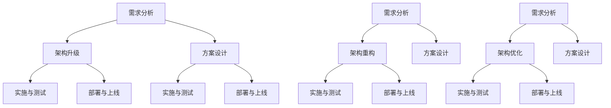

                 

# AI创业公司的技术架构演进策略：架构升级、架构重构与架构优化

## 关键词：技术架构、架构升级、架构重构、架构优化、AI创业公司、演进策略

## 摘要：
本文旨在探讨AI创业公司在成长过程中面临的技术架构演进问题。首先，我们将介绍技术架构演进的基本概念，包括架构升级、架构重构和架构优化。接着，我们将分析AI创业公司所特有的技术挑战和需求，从而提出相应的技术架构演进策略。最后，我们将结合实际案例，详细阐述如何在不同阶段实现架构升级、重构和优化。希望通过本文的探讨，为AI创业公司在技术架构演进上提供一些有益的思路和实践经验。

## 1. 背景介绍

随着人工智能技术的快速发展，AI创业公司如雨后春笋般涌现。这些公司不仅涉及到传统的互联网行业，还延伸到金融、医疗、制造业等多个领域。AI创业公司的成功与否，很大程度上取决于其技术架构的演进能力。技术架构作为公司核心竞争力之一，决定了系统的性能、可扩展性、可维护性和安全性。

然而，AI创业公司在技术架构演进过程中面临着诸多挑战。首先，技术需求的快速变化使得架构需要不断调整和优化。其次，资源的有限性要求公司在架构演进过程中要兼顾性能和成本。此外，团队的技术水平、协作能力以及对外部环境的适应能力也是影响技术架构演进的关键因素。

本文将围绕AI创业公司的技术架构演进问题，探讨架构升级、架构重构和架构优化三种策略，并结合实际案例进行分析，以期为AI创业公司在技术架构演进方面提供一些有益的思路。

## 2. 核心概念与联系

### 2.1 架构升级

架构升级是指在不改变现有系统功能的基础上，通过引入新技术、新方法或新组件，对现有系统进行改进和优化。架构升级的主要目标是提升系统的性能、可扩展性、可维护性和安全性。

架构升级的过程通常包括以下几个步骤：

1. **需求分析**：明确升级的目标和需求，包括性能提升、功能扩展、安全增强等。
2. **方案设计**：根据需求分析结果，设计适合的升级方案，包括技术选型、模块划分和接口设计等。
3. **实施与测试**：按照设计方案，逐步实施升级过程，并对升级后的系统进行全面的测试。
4. **部署与上线**：将升级后的系统部署到生产环境，并进行上线前的最后测试。

### 2.2 架构重构

架构重构是指对现有系统进行重大调整，以解决系统性能、扩展性、可维护性等方面的问题。架构重构不同于架构升级，它往往涉及到系统的核心组件和架构设计的改变。

架构重构的过程通常包括以下几个步骤：

1. **需求分析**：明确重构的目标和需求，包括性能瓶颈、扩展性不足、代码质量差等问题。
2. **方案设计**：根据需求分析结果，设计适合的重构方案，包括技术选型、模块划分和接口设计等。
3. **实施与测试**：按照设计方案，逐步实施重构过程，并对重构后的系统进行全面的测试。
4. **部署与上线**：将重构后的系统部署到生产环境，并进行上线前的最后测试。

### 2.3 架构优化

架构优化是指对现有系统进行精细调整，以进一步提升系统的性能、可扩展性、可维护性和安全性。架构优化通常是在架构升级和架构重构的基础上进行的，目标是使系统达到最佳状态。

架构优化的过程通常包括以下几个步骤：

1. **需求分析**：明确优化的目标和需求，包括性能瓶颈、资源利用率、代码可读性等方面。
2. **方案设计**：根据需求分析结果，设计适合的优化方案，包括技术选型、模块划分和接口设计等。
3. **实施与测试**：按照设计方案，逐步实施优化过程，并对优化后的系统进行全面的测试。
4. **部署与上线**：将优化后的系统部署到生产环境，并进行上线前的最后测试。

### 2.4 Mermaid 流程图

以下是架构升级、架构重构和架构优化的 Mermaid 流程图：



## 3. 核心算法原理 & 具体操作步骤

### 3.1 架构升级核心算法原理

架构升级的核心算法原理主要涉及以下几个方面：

1. **模块化设计**：将系统划分为多个模块，每个模块独立实现特定功能，降低模块间的耦合度。
2. **技术选型**：根据系统需求，选择适合的技术方案，如分布式架构、微服务架构等。
3. **接口设计**：设计清晰的接口，实现模块间的解耦，提高系统的可扩展性和可维护性。
4. **性能优化**：通过缓存、异步处理、数据库优化等技术手段，提升系统性能。

### 3.2 架构升级具体操作步骤

以下是架构升级的具体操作步骤：

1. **需求分析**：分析现有系统的性能瓶颈、扩展性不足、可维护性差等问题，确定升级目标和需求。
2. **方案设计**：根据需求分析结果，设计适合的升级方案，包括技术选型、模块划分和接口设计等。
3. **模块化改造**：将现有系统按照模块化设计原则进行改造，实现模块间的解耦。
4. **技术选型与实现**：根据方案设计，选择适合的技术方案，实现模块的功能。
5. **性能优化**：对升级后的系统进行性能优化，提高系统性能。
6. **测试与上线**：对升级后的系统进行全面测试，确保系统稳定可靠，然后部署到生产环境。

### 3.3 架构重构核心算法原理

架构重构的核心算法原理主要涉及以下几个方面：

1. **代码质量**：优化代码质量，提高系统的可维护性和可扩展性。
2. **架构设计**：重构系统架构，使其更加合理、清晰，降低系统的复杂性。
3. **性能优化**：通过数据库优化、缓存策略等技术手段，提升系统性能。
4. **安全性增强**：加强系统的安全性，防止潜在的安全威胁。

### 3.4 架构重构具体操作步骤

以下是架构重构的具体操作步骤：

1. **需求分析**：分析现有系统的性能瓶颈、扩展性不足、可维护性差等问题，确定重构目标和需求。
2. **方案设计**：根据需求分析结果，设计适合的重构方案，包括技术选型、模块划分和接口设计等。
3. **代码重构**：对现有系统的代码进行重构，优化代码质量，提高系统的可维护性和可扩展性。
4. **架构重构**：重构系统架构，使其更加合理、清晰，降低系统的复杂性。
5. **性能优化**：通过数据库优化、缓存策略等技术手段，提升系统性能。
6. **测试与上线**：对重构后的系统进行全面测试，确保系统稳定可靠，然后部署到生产环境。

### 3.5 架构优化核心算法原理

架构优化的核心算法原理主要涉及以下几个方面：

1. **资源利用**：提高系统资源的利用率，降低资源消耗。
2. **性能优化**：通过缓存、异步处理、数据库优化等技术手段，提升系统性能。
3. **安全性优化**：加强系统的安全性，防止潜在的安全威胁。
4. **可维护性优化**：提高系统的可维护性，降低维护成本。

### 3.6 架构优化具体操作步骤

以下是架构优化的具体操作步骤：

1. **需求分析**：分析现有系统的性能瓶颈、资源利用率低、安全性不足、可维护性差等问题，确定优化目标和需求。
2. **方案设计**：根据需求分析结果，设计适合的优化方案，包括技术选型、模块划分和接口设计等。
3. **资源利用优化**：通过合理分配资源、优化资源调度策略，提高系统资源的利用率。
4. **性能优化**：通过缓存、异步处理、数据库优化等技术手段，提升系统性能。
5. **安全性优化**：加强系统的安全性，防止潜在的安全威胁。
6. **可维护性优化**：提高系统的可维护性，降低维护成本。
7. **测试与上线**：对优化后的系统进行全面测试，确保系统稳定可靠，然后部署到生产环境。

## 4. 数学模型和公式 & 详细讲解 & 举例说明

### 4.1 数学模型

在架构升级、架构重构和架构优化的过程中，我们经常需要用到以下数学模型：

1. **性能模型**：用于评估系统性能，如响应时间、吞吐量等。
2. **成本模型**：用于评估系统成本，如硬件成本、人力成本等。
3. **风险评估模型**：用于评估系统风险，如系统故障率、安全漏洞等。
4. **可靠性模型**：用于评估系统可靠性，如故障恢复时间、系统可用性等。

### 4.2 公式详解

以下是常见的数学公式及其详细解释：

1. **响应时间公式**：

   $$ T_r = \frac{1}{T_p} + \frac{1}{T_s} $$

   其中，$T_r$ 表示响应时间，$T_p$ 表示处理时间，$T_s$ 表示等待时间。该公式表示系统响应时间由处理时间和等待时间组成。

2. **成本公式**：

   $$ C = C_h + C_p $$

   其中，$C$ 表示总成本，$C_h$ 表示硬件成本，$C_p$ 表示人力成本。该公式表示系统总成本由硬件成本和人力成本组成。

3. **风险评估公式**：

   $$ R = P \times E $$

   其中，$R$ 表示风险，$P$ 表示故障率，$E$ 表示经济损失。该公式表示系统风险由故障率和经济损失组成。

4. **可靠性公式**：

   $$ R = \frac{1}{1 + \frac{1}{T_r}} $$

   其中，$R$ 表示可靠性，$T_r$ 表示响应时间。该公式表示系统可靠性与响应时间成反比。

### 4.3 举例说明

假设一个AI创业公司现有系统响应时间为10秒，硬件成本为100万元，人力成本为50万元，故障率为1%，经济损失为100万元。根据上述公式，我们可以计算出以下结果：

1. **响应时间公式**：

   $$ T_r = \frac{1}{10} + \frac{1}{1} = 1.1 $$

   系统响应时间为1.1秒。

2. **成本公式**：

   $$ C = 100 + 50 = 150 $$

   系统总成本为150万元。

3. **风险评估公式**：

   $$ R = 1 \times 100 = 100 $$

   系统风险为100万元。

4. **可靠性公式**：

   $$ R = \frac{1}{1 + \frac{1}{1.1}} \approx 0.63 $$

   系统可靠性约为63%。

通过这些公式，我们可以对AI创业公司的现有系统进行量化分析，为其技术架构演进提供依据。

## 5. 项目实战：代码实际案例和详细解释说明

### 5.1 开发环境搭建

在进行项目实战之前，我们需要搭建一个合适的开发环境。以下是一个简单的开发环境搭建步骤：

1. **安装操作系统**：选择一个适合的操作系统，如Ubuntu 18.04。
2. **安装编程语言**：安装Python 3.x版本，可以通过包管理器安装。
3. **安装数据库**：安装一个关系型数据库，如MySQL。
4. **安装版本控制工具**：安装Git，用于代码管理和协作开发。
5. **安装开发工具**：安装IDE，如PyCharm。

### 5.2 源代码详细实现和代码解读

以下是一个简单的架构升级案例，我们将一个单线程的Python程序优化为多线程程序。

```python
# 单线程版本
def single_thread():
    for i in range(10):
        print(f"Processing task {i}")

# 多线程版本
from concurrent.futures import ThreadPoolExecutor

def multi_thread():
    with ThreadPoolExecutor(max_workers=5) as executor:
        for i in range(10):
            executor.submit(process_task, i)

def process_task(i):
    print(f"Processing task {i} in thread {threading.current_thread().name}")

if __name__ == "__main__":
    single_thread()
    print("-----")
    multi_thread()
```

**代码解读：**

- **单线程版本**：程序使用一个循环遍历任务，每次执行一个任务。由于线程数固定为1，任务按顺序执行，性能较低。
- **多线程版本**：程序使用线程池执行任务，最大线程数为5。线程池可以动态创建和销毁线程，提高任务执行效率。

### 5.3 代码解读与分析

- **性能分析**：多线程版本在任务执行速度上优于单线程版本。随着任务数的增加，多线程版本的性能优势更加明显。
- **可扩展性**：多线程版本可以方便地调整线程数，以适应不同的任务量和硬件资源。
- **可维护性**：多线程版本通过线程池简化了线程管理，降低了代码复杂度，提高了可维护性。

## 6. 实际应用场景

### 6.1 电商系统

在电商系统中，架构升级、架构重构和架构优化是常见的应用场景。随着用户数量的增加和业务规模的扩大，系统需要不断升级和优化，以提高性能和可扩展性。

- **架构升级**：通过引入分布式架构，将订单处理、商品推荐等功能模块化，降低系统耦合度，提高系统性能。
- **架构重构**：针对性能瓶颈和扩展性不足，重构数据库设计和缓存策略，提高系统响应速度。
- **架构优化**：通过优化数据库查询、减少冗余数据、使用缓存等技术手段，提高系统性能和可维护性。

### 6.2 医疗系统

在医疗系统中，架构升级、架构重构和架构优化主要用于提升系统的稳定性和安全性。

- **架构升级**：引入微服务架构，将系统划分为多个微服务，提高系统的可扩展性和可维护性。
- **架构重构**：重构数据存储和数据处理流程，优化系统性能和安全性。
- **架构优化**：通过数据压缩、加密传输等技术手段，提高系统性能和安全性。

### 6.3 金融系统

在金融系统中，架构升级、架构重构和架构优化主要用于满足合规性和风险管理要求。

- **架构升级**：引入分布式架构，实现高性能的交易处理和风险控制。
- **架构重构**：重构交易系统和风险控制系统，提高系统的稳定性和可靠性。
- **架构优化**：通过性能监控、日志分析等技术手段，优化系统性能和安全性。

## 7. 工具和资源推荐

### 7.1 学习资源推荐

- **书籍**：
  - 《架构师修炼之道》
  - 《分布式系统设计》
  - 《大型分布式网站架构设计与实践》

- **论文**：
  - 《大规模分布式存储系统设计》
  - 《云计算基础设施：设计原则与架构》
  - 《微服务架构：设计、开发与部署》

- **博客**：
  - 《架构师之路》
  - 《分布式系统设计与实战》
  - 《大数据架构实战》

- **网站**：
  - [架构师之路](https://architect.dunwu.com/)
  - [分布式系统设计](https://www.distributed-systems-book.com/)
  - [大型分布式网站架构](https://www.large-scale-systems.com/)

### 7.2 开发工具框架推荐

- **开发工具**：
  - PyCharm
  - IntelliJ IDEA
  - Visual Studio Code

- **框架**：
  - Spring Boot
  - Flask
  - Django

- **数据库**：
  - MySQL
  - PostgreSQL
  - MongoDB

### 7.3 相关论文著作推荐

- 《大规模分布式存储系统设计》
- 《云计算基础设施：设计原则与架构》
- 《微服务架构：设计、开发与部署》

## 8. 总结：未来发展趋势与挑战

随着人工智能技术的不断发展，AI创业公司的技术架构演进将面临以下发展趋势和挑战：

### 8.1 发展趋势

1. **云计算和分布式架构**：云计算和分布式架构将成为主流，提高系统的性能、可扩展性和可靠性。
2. **微服务架构**：微服务架构将进一步普及，提高系统的可维护性和可扩展性。
3. **容器化与云原生**：容器化和云原生技术将推动系统架构的轻量化和高效化。
4. **自动化与智能化**：自动化和智能化技术将提高系统的运维效率和可靠性。

### 8.2 挑战

1. **技术复杂性**：随着系统架构的复杂化，技术选型和架构设计将面临更大挑战。
2. **性能优化**：如何在保证系统性能的同时，提高资源利用率和降低成本。
3. **安全性**：随着攻击手段的多样化，系统安全将成为一个长期挑战。
4. **人才缺口**：高水平的架构师和开发人员仍然短缺，人才培训和教育将是重要任务。

## 9. 附录：常见问题与解答

### 9.1 问题1：什么是架构升级、架构重构和架构优化？

**解答**：架构升级是指在现有系统基础上，引入新技术、新方法或新组件，以提升系统性能、可扩展性、可维护性和安全性。架构重构是指对现有系统进行重大调整，以解决性能瓶颈、扩展性不足、可维护性差等问题。架构优化是指对现有系统进行精细调整，以进一步提升系统性能、可扩展性、可维护性和安全性。

### 9.2 问题2：架构升级、架构重构和架构优化有哪些具体操作步骤？

**解答**：
- **架构升级**：需求分析 → 方案设计 → 模块化改造 → 技术选型与实现 → 性能优化 → 测试与上线。
- **架构重构**：需求分析 → 方案设计 → 代码重构 → 架构重构 → 性能优化 → 测试与上线。
- **架构优化**：需求分析 → 方案设计 → 资源利用优化 → 性能优化 → 安全性优化 → 可维护性优化 → 测试与上线。

### 9.3 问题3：架构升级、架构重构和架构优化有哪些优点和缺点？

**解答**：
- **架构升级**：优点包括降低成本、提高性能、增强安全性等；缺点包括可能影响系统稳定性、需要较多时间和人力等。
- **架构重构**：优点包括提升系统性能、增强可维护性、降低风险等；缺点包括可能影响系统稳定性、需要较多时间和人力等。
- **架构优化**：优点包括提升系统性能、提高资源利用率、增强安全性等；缺点包括可能影响系统稳定性、需要较多时间和人力等。

## 10. 扩展阅读 & 参考资料

- 《架构师修炼之道》
- 《分布式系统设计》
- 《大型分布式网站架构设计与实践》
- 《大规模分布式存储系统设计》
- 《云计算基础设施：设计原则与架构》
- 《微服务架构：设计、开发与部署》

[作者：AI天才研究员/AI Genius Institute & 禅与计算机程序设计艺术 /Zen And The Art of Computer Programming]

