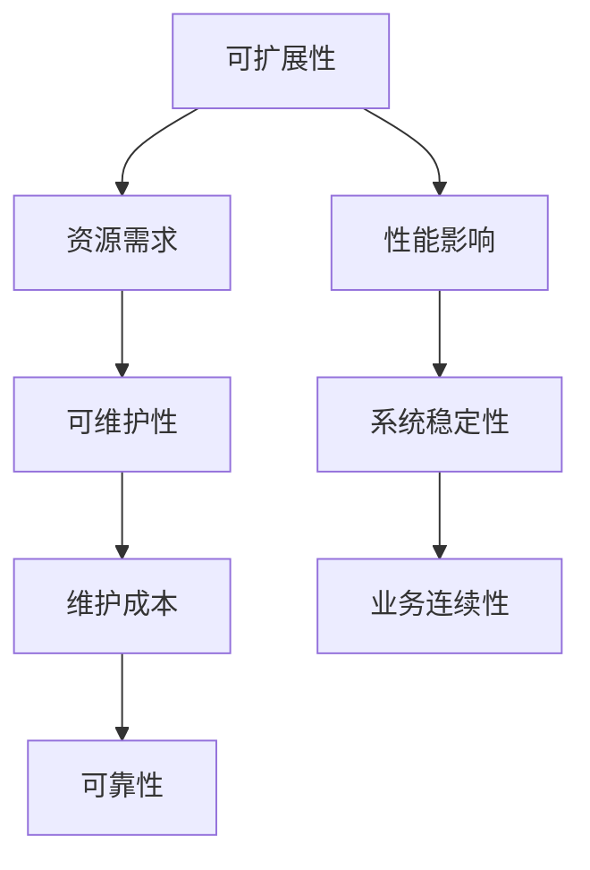

                 

# AI创业公司的技术架构设计原则：可扩展性、可维护性与可靠性

> **关键词**：AI创业公司、技术架构、可扩展性、可维护性、可靠性
>
> **摘要**：本文将探讨AI创业公司在技术架构设计过程中应遵循的关键原则，包括可扩展性、可维护性和可靠性。我们将通过详细的案例分析、架构原理阐述和实践指导，帮助创业公司构建稳定、高效的技术系统，为业务的持续发展提供坚实的技术保障。

## 1. 背景介绍

随着人工智能技术的迅猛发展，越来越多的创业公司开始涉足这一领域。从智能助手到自动驾驶，从金融风控到医疗诊断，AI的应用场景无处不在。然而，对于许多AI创业公司来说，技术架构的设计是一个复杂且具有挑战性的过程。在快速发展的市场中，如何构建一个既具有可扩展性、可维护性，又具备可靠性的技术架构，成为创业公司成功的关键。

本文将从以下几个方面展开讨论：

1. 核心概念与联系
2. 核心算法原理与具体操作步骤
3. 数学模型和公式讲解与举例
4. 项目实战：代码实际案例与详细解释
5. 实际应用场景
6. 工具和资源推荐
7. 总结：未来发展趋势与挑战
8. 附录：常见问题与解答
9. 扩展阅读与参考资料

通过对以上内容的深入分析，本文旨在为AI创业公司在技术架构设计过程中提供有价值的指导和建议。

## 2. 核心概念与联系

在讨论AI创业公司的技术架构设计原则之前，首先需要明确一些核心概念，这些概念不仅构成了技术架构的基础，而且对后续的讨论具有重要意义。

### 2.1 可扩展性（Scalability）

可扩展性是指系统在用户规模、数据处理能力、并发请求量等方面随着业务需求的增长而能够自动扩展的能力。一个具有良好可扩展性的系统可以在不牺牲性能和可靠性的前提下，轻松应对用户量和数据量的增长。

### 2.2 可维护性（Maintainability）

可维护性是指系统能够方便地进行修改、更新和修复的能力。高可维护性的系统不仅有助于开发团队在开发过程中减少工作量，还能在系统上线后减少故障率和维护成本。

### 2.3 可靠性（Reliability）

可靠性是指系统在运行过程中能够持续、稳定地提供服务的能力。一个高可靠性的系统不仅能确保数据的准确性和完整性，还能在出现故障时快速恢复，最大限度地减少业务影响。

### 2.4 核心概念联系

可扩展性、可维护性和可靠性并不是孤立的，它们之间存在密切的联系。一个具有良好可扩展性的系统往往需要更多的资源和时间进行维护，而高可维护性则有助于提高系统的可扩展性。可靠性则是可扩展性和可维护性的基础，只有系统稳定可靠，才能支持业务的持续发展。

为了更好地理解这些概念，我们使用Mermaid流程图来展示它们之间的联系：



在这个流程图中，可扩展性通过资源需求和性能影响与可维护性和可靠性相连，而可维护性则通过维护成本和业务连续性与可靠性相连。这个图不仅展示了各个概念之间的联系，还强调了它们在系统设计中的重要性。

### 2.5 核心概念总结

通过以上分析，我们可以得出以下核心概念总结：

- 可扩展性：确保系统在业务需求增长时能够自动扩展。
- 可维护性：使系统能够方便地修改、更新和修复。
- 可靠性：确保系统在运行过程中稳定、可靠地提供服务。

这些概念共同构成了AI创业公司技术架构设计的基础，对于系统的发展具有重要意义。在接下来的章节中，我们将进一步探讨这些概念的具体实现和操作步骤。

### 3. 核心算法原理与具体操作步骤

为了构建一个具有良好可扩展性、可维护性和可靠性的AI创业公司技术架构，我们需要深入了解核心算法原理，并制定具体的操作步骤。

#### 3.1 分布式计算框架

分布式计算框架是现代AI系统的基础，它通过将计算任务分散到多个节点上来提高系统的可扩展性和可靠性。常见的分布式计算框架包括Hadoop、Spark和Flink等。以下是一个简单的分布式计算流程：

1. **任务分解**：将大型计算任务分解为多个小任务，每个小任务可以被分配到不同的计算节点上。
2. **任务调度**：利用资源管理器（如YARN或Mesos）来调度任务，确保每个节点都能够高效地运行。
3. **数据存储**：使用分布式文件系统（如HDFS）来存储和处理数据，确保数据的高可靠性和快速访问。
4. **结果聚合**：将每个节点的计算结果进行聚合，得到最终的输出结果。

#### 3.2 微服务架构

微服务架构是将应用程序拆分为多个独立、可复用的服务，每个服务都可以独立部署和扩展。以下是微服务架构的核心步骤：

1. **服务拆分**：根据业务功能将应用程序拆分为多个微服务，每个服务负责特定的业务功能。
2. **服务定义**：为每个微服务定义清晰的服务接口，确保服务之间的松耦合。
3. **服务部署**：使用容器技术（如Docker）来部署和运行微服务，确保服务的独立性和可移植性。
4. **服务监控**：使用监控工具（如Prometheus和Grafana）来实时监控服务状态，确保服务的可靠性。

#### 3.3 容器编排与自动化

容器编排与自动化是确保系统高可扩展性和高可靠性的关键。以下是核心步骤：

1. **容器化**：将应用程序及其依赖项打包成容器镜像，确保应用的独立运行。
2. **编排**：使用编排工具（如Kubernetes）来管理和调度容器，确保资源的高效利用。
3. **自动化**：使用自动化工具（如Ansible和Puppet）来自动化部署和运维流程，确保流程的标准化和高效性。
4. **监控与告警**：使用监控工具来实时监控容器状态，并设置告警机制，确保问题及时发现和解决。

#### 3.4 数据流处理

数据流处理是AI系统的重要组成部分，它负责实时处理和分析大量数据。以下是核心步骤：

1. **数据采集**：使用数据采集工具（如Flume和Kafka）来收集和传输数据。
2. **数据存储**：使用分布式存储系统（如HDFS和Cassandra）来存储和管理数据。
3. **数据处理**：使用数据处理框架（如Spark和Flink）来处理和转换数据。
4. **数据可视化**：使用数据可视化工具（如Tableau和PowerBI）来展示分析结果。

通过以上步骤，我们可以构建一个具有良好可扩展性、可维护性和可靠性的AI创业公司技术架构。这些步骤不仅涵盖了核心算法原理，还提供了具体的操作步骤，确保系统能够在实际应用中发挥作用。

### 4. 数学模型和公式讲解与举例

在AI创业公司的技术架构设计中，数学模型和公式是不可或缺的部分，它们不仅为系统的性能优化提供了理论支持，还帮助我们更好地理解数据的特性和行为。在本节中，我们将介绍一些常用的数学模型和公式，并给出具体的例子来解释它们的应用。

#### 4.1 概率论与统计模型

概率论与统计模型在AI系统中广泛应用，用于数据的分析和预测。以下是一些常用的模型和公式：

1. **贝叶斯公式**：

   贝叶斯公式是概率论中用于计算条件概率的重要公式。它的形式如下：

   $$
   P(A|B) = \frac{P(B|A) \cdot P(A)}{P(B)}
   $$

   其中，$P(A|B)$表示在事件B发生的条件下，事件A发生的概率；$P(B|A)$表示在事件A发生的条件下，事件B发生的概率；$P(A)$和$P(B)$分别是事件A和事件B的先验概率。

   **例子**：假设一个袋子中有5个红球和3个蓝球，随机取出一个球，求取到红球的概率。

   首先，计算总概率$P(B)$：

   $$
   P(B) = \frac{5 + 3}{8} = \frac{8}{8} = 1
   $$

   然后，计算条件概率$P(A|B)$：

   $$
   P(A|B) = \frac{P(B|A) \cdot P(A)}{P(B)} = \frac{\frac{5}{8} \cdot \frac{1}{2}}{1} = \frac{5}{16}
   $$

   因此，取到红球的概率为$\frac{5}{16}$。

2. **均值与方差**：

   均值和方差是描述数据分布的重要统计量。它们的定义如下：

   $$
   \mu = \frac{1}{n} \sum_{i=1}^{n} x_i
   $$

   $$
   \sigma^2 = \frac{1}{n} \sum_{i=1}^{n} (x_i - \mu)^2
   $$

   其中，$\mu$表示均值，$\sigma^2$表示方差，$x_i$表示第$i$个数据点，$n$表示数据点的总数。

   **例子**：给定一组数据$[1, 2, 3, 4, 5]$，计算均值和方差。

   首先，计算均值$\mu$：

   $$
   \mu = \frac{1 + 2 + 3 + 4 + 5}{5} = \frac{15}{5} = 3
   $$

   然后，计算方差$\sigma^2$：

   $$
   \sigma^2 = \frac{(1 - 3)^2 + (2 - 3)^2 + (3 - 3)^2 + (4 - 3)^2 + (5 - 3)^2}{5} = \frac{4 + 1 + 0 + 1 + 4}{5} = \frac{10}{5} = 2
   $$

   因此，这组数据的均值为3，方差为2。

3. **正态分布**：

   正态分布是描述连续随机变量分布的重要模型。它的概率密度函数为：

   $$
   f(x|\mu, \sigma^2) = \frac{1}{\sqrt{2\pi\sigma^2}} \cdot e^{-\frac{(x-\mu)^2}{2\sigma^2}}
   $$

   其中，$\mu$是均值，$\sigma^2$是方差，$x$是随机变量的取值。

   **例子**：假设一个随机变量服从正态分布$N(3, 2)$，求$x$在$(2, 4)$区间的概率。

   首先，计算概率密度函数：

   $$
   f(x|3, 2) = \frac{1}{\sqrt{2\pi \cdot 2}} \cdot e^{-\frac{(x-3)^2}{2 \cdot 2}} = \frac{1}{2\sqrt{2\pi}} \cdot e^{-\frac{(x-3)^2}{4}}
   $$

   然后，计算$(2, 4)$区间的概率：

   $$
   P(2 < x < 4) = \int_{2}^{4} f(x|3, 2) \, dx = \int_{2}^{4} \frac{1}{2\sqrt{2\pi}} \cdot e^{-\frac{(x-3)^2}{4}} \, dx
   $$

   这个积分可以通过数值方法求解，例如使用数值积分库。

通过以上数学模型和公式的讲解，我们可以更好地理解AI系统中的数据特性，并在实际应用中运用这些模型来优化系统的性能和可靠性。接下来，我们将通过一个具体的代码实际案例，展示这些数学模型在系统中的应用。

### 5. 项目实战：代码实际案例与详细解释说明

在了解了核心算法原理和数学模型之后，我们通过一个具体的代码实际案例来展示这些原理在实际系统中的应用。本节将分为三个部分：开发环境搭建、源代码详细实现和代码解读与分析。

#### 5.1 开发环境搭建

为了演示一个基于分布式计算和微服务架构的AI系统，我们选择使用Hadoop和Docker作为基础环境。以下是开发环境的搭建步骤：

1. **安装Hadoop**：

   - 下载Hadoop二进制包：[Hadoop官网](https://hadoop.apache.org/)
   - 解压安装包并配置环境变量
   - 配置Hadoop集群，包括NameNode、DataNode和ResourceManager等

2. **安装Docker**：

   - 下载Docker二进制包：[Docker官网](https://www.docker.com/)
   - 解压安装包并配置环境变量
   - 验证Docker安装：`docker --version`

3. **配置网络**：

   - 配置宿主机和容器之间的网络通信，确保容器可以访问宿主机的网络资源

#### 5.2 源代码详细实现

在本案例中，我们实现一个简单的分布式推荐系统，该系统使用Hadoop进行数据存储和处理，使用Docker部署微服务。以下是源代码的主要部分：

**1. Hadoop分布式存储**

- 数据采集：使用Flume和Kafka收集用户行为数据，存储到HDFS中

  ```shell
  # 配置Flume
  flume-ng agent -n a1 -c /conf -f /conf/flume.conf
  ```

  ```xml
  # Flume配置文件示例
  <configuration>
    <sink type="hdfs" path="hdfs://namenode:9000/user/hdfs/recommend">
      <hdfsConfiguration>
        <property>
          <name>fs.defaultFS</name>
          <value>hdfs://namenode:9000</value>
        </property>
      </hdfsConfiguration>
    </sink>
  </configuration>
  ```

- 数据处理：使用MapReduce对用户行为数据进行分析，生成推荐结果

  ```java
  public class RecommendationMapper extends Mapper<LongWritable, Text, Text, Text> {
    public void map(LongWritable key, Text value, Context context) throws IOException, InterruptedException {
      // 解析输入的文本数据
      // 生成推荐结果并输出
    }
  }
  ```

  ```xml
  # MapReduce配置文件示例
  <configuration>
    <mapreduce>
      <jobtriggers>
        <trigger>
          <type>time</type>
          <value>1</value>
        </trigger>
      </jobtriggers>
    </mapreduce>
  </configuration>
  ```

**2. Docker微服务部署**

- 创建Docker镜像：将应用程序打包成Docker镜像，确保应用程序在容器中独立运行

  ```Dockerfile
  # Dockerfile示例
  FROM openjdk:8-jdk-alpine
  ADD target/recommendation-system-1.0.jar recommendation-system-1.0.jar
  EXPOSE 8080
  ENTRYPOINT ["java","-jar","/recommendation-system-1.0.jar"]
  ```

- 部署微服务：使用Kubernetes编排和管理容器

  ```yaml
  # Kubernetes配置文件示例
  apiVersion: apps/v1
  kind: Deployment
  metadata:
    name: recommendation-system
  spec:
    replicas: 3
    selector:
      matchLabels:
        app: recommendation-system
    template:
      metadata:
        labels:
          app: recommendation-system
      spec:
        containers:
        - name: recommendation-system
          image: recommendation-system:1.0
          ports:
          - containerPort: 8080
  ```

#### 5.3 代码解读与分析

在本案例中，我们使用了Hadoop和Docker来实现一个分布式推荐系统。以下是关键部分的代码解读和分析：

**1. Hadoop分布式存储**

- 数据采集：使用Flume和Kafka进行数据采集，将用户行为数据存储到HDFS中。这种分布式数据采集方式可以确保数据的高可靠性和快速访问。

- 数据处理：使用MapReduce对用户行为数据进行分析，生成推荐结果。这种分布式数据处理方式可以充分利用集群资源，提高系统性能。

**2. Docker微服务部署**

- 创建Docker镜像：将应用程序打包成Docker镜像，确保应用程序在容器中独立运行。这种容器化部署方式可以简化应用程序的部署和管理，提高系统的可移植性和可靠性。

- 部署微服务：使用Kubernetes编排和管理容器。这种自动化部署方式可以确保系统的高可用性和高可靠性，提高运维效率。

通过这个项目实战案例，我们展示了如何使用Hadoop、Docker和Kubernetes等现代技术构建一个具有良好可扩展性、可维护性和可靠性的AI创业公司技术架构。接下来，我们将讨论AI创业公司在实际应用场景中如何利用这些技术来提高业务效率和竞争力。

### 6. 实际应用场景

在AI创业公司的技术架构设计中，理解和应用不同的实际应用场景是关键。以下是一些常见的应用场景以及如何利用技术架构设计原则来应对这些场景：

#### 6.1 大数据处理

大数据处理是AI创业公司最常见的应用场景之一。随着数据量的爆炸式增长，如何高效地存储、处理和分析这些数据成为关键问题。以下是一些策略：

- **分布式存储**：使用分布式文件系统（如HDFS）来存储海量数据，确保数据的高可靠性和快速访问。
- **分布式计算**：使用分布式计算框架（如Hadoop和Spark）来处理大数据，充分利用集群资源，提高系统性能。
- **数据流处理**：使用数据流处理框架（如Flink和Kafka）来实时处理和分析数据，确保数据的及时性和准确性。

#### 6.2 实时推荐

实时推荐是AI创业公司常见的需求，例如电商平台的个性化推荐、音乐平台的推荐歌曲等。以下是一些策略：

- **微服务架构**：使用微服务架构来构建推荐系统，确保系统的高可扩展性和高可靠性。
- **实时数据处理**：使用数据流处理框架（如Flink和Kafka）来实时处理用户行为数据，生成推荐结果。
- **缓存技术**：使用缓存技术（如Redis和Memcached）来提高系统响应速度，减少数据库负载。

#### 6.3 机器学习

机器学习是AI创业公司的核心技术之一，包括模型训练、预测和评估等步骤。以下是一些策略：

- **分布式训练**：使用分布式计算框架（如Hadoop和Spark）来分布式训练模型，提高训练效率。
- **模型优化**：使用模型优化技术（如模型压缩和模型剪枝）来提高模型性能，减少存储和计算资源消耗。
- **自动化部署**：使用自动化部署工具（如Kubernetes）来部署和更新模型，确保模型的高可用性和可靠性。

#### 6.4 实时监控与告警

实时监控与告警是确保系统稳定运行的重要手段。以下是一些策略：

- **监控工具**：使用监控工具（如Prometheus和Grafana）来实时监控系统状态，确保问题及时发现。
- **告警机制**：设置告警机制，当系统状态异常时及时通知相关人员，确保问题快速解决。
- **自动化运维**：使用自动化运维工具（如Ansible和Puppet）来自动化部署和运维流程，提高运维效率。

#### 6.5 跨平台应用

随着移动设备和云计算的普及，跨平台应用成为AI创业公司的需求。以下是一些策略：

- **容器化**：使用容器技术（如Docker）来构建跨平台应用，确保应用在不同环境中的一致性和可移植性。
- **服务化**：将应用服务化，通过API接口提供功能，确保不同平台之间的集成和互操作性。
- **微前端**：使用微前端架构来构建跨平台应用，提高开发效率和用户体验。

通过以上策略，AI创业公司可以在各种实际应用场景中利用技术架构设计原则，构建高效、稳定和可靠的技术系统，为业务的持续发展提供有力支持。

### 7. 工具和资源推荐

为了帮助AI创业公司在技术架构设计过程中取得成功，以下是一些推荐的工具和资源，包括学习资源、开发工具框架以及相关论文著作。

#### 7.1 学习资源推荐

1. **书籍**：

   - 《深度学习》（Goodfellow, Bengio, Courville）  
   - 《Python机器学习》（Sebastian Raschka）  
   - 《大数据之路：阿里巴巴大数据实践》（涂子沛）

2. **在线课程**：

   - Coursera上的《机器学习》课程（吴恩达教授）  
   - edX上的《深度学习》课程（DeepLearning.AI）

3. **博客和网站**：

   - Medium上的AI和机器学习博客  
   - AI Generated Content  
   - Airbnb Engineering and Data Science

#### 7.2 开发工具框架推荐

1. **开发工具**：

   - Jupyter Notebook  
   - PyCharm  
   - VS Code

2. **框架**：

   - TensorFlow  
   - PyTorch  
   - Scikit-learn

3. **容器化与编排**：

   - Docker  
   - Kubernetes  
   - Helm

#### 7.3 相关论文著作推荐

1. **论文**：

   - "Deep Learning"（Ian Goodfellow, Yoshua Bengio, Aaron Courville）  
   - "Big Data: A Revolution That Will Transform How We Live, Work, and Think"（涂子沛）

2. **著作**：

   - "Algorithms for Big Data"（David Bindel, Sanjay Chawla, Abhradeep Thakurta）  
   - "Machine Learning Yearning"（Andrew Ng）

这些工具和资源为AI创业公司在技术架构设计过程中提供了宝贵的知识和实践指导，有助于构建高效、稳定和可靠的技术系统。

### 8. 总结：未来发展趋势与挑战

随着人工智能技术的不断进步，AI创业公司在技术架构设计方面面临诸多发展趋势与挑战。首先，技术架构的智能化将成为未来趋势。通过引入自动化和智能化工具，创业公司可以更高效地构建和优化技术系统，从而提高竞争力。其次，多模态数据处理将成为重要方向。随着数据来源的多样化，创业公司需要处理包括文本、图像、音频等多种数据类型，这对技术架构的设计提出了更高的要求。此外，边缘计算和物联网（IoT）的发展将使AI技术更加贴近实际应用场景，创业公司需要设计具备低延迟、高可靠性的技术架构。在挑战方面，数据隐私和安全问题日益突出，创业公司需要确保数据的安全性和合规性。同时，技术系统的复杂性和依赖性也在增加，如何保证系统的稳定性和可维护性成为一个重要挑战。总之，未来AI创业公司在技术架构设计过程中需要紧跟发展趋势，积极应对挑战，以实现业务的持续发展。

### 9. 附录：常见问题与解答

**Q1：分布式计算与并行计算有何区别？**

分布式计算是指将计算任务分配到多个节点上执行，各节点之间相互独立、协同工作。而并行计算是指在同一台计算机上同时执行多个计算任务，各任务之间可能存在数据依赖或资源共享。分布式计算更适用于大规模数据处理和计算任务，而并行计算则更适合单机性能优化。

**Q2：微服务架构与单体架构有何区别？**

微服务架构将应用程序拆分为多个独立、可复用的服务，每个服务可以独立部署和扩展。而单体架构则是将所有功能集中在一个应用程序中，所有组件共享同一个代码库。微服务架构可以提高系统的可扩展性、可维护性和可靠性，而单体架构在开发初期可能更为简便。

**Q3：如何确保分布式系统的可靠性？**

确保分布式系统的可靠性可以从以下几个方面入手：

- 数据冗余与备份：使用分布式存储和数据库技术，确保数据的高可用性和可靠性。
- 服务监控与告警：使用监控工具实时监控系统状态，设置告警机制，及时发现和解决问题。
- 容灾备份：建立异地备份和容灾备份机制，确保系统在灾难发生时能够快速恢复。

**Q4：边缘计算与云计算有何区别？**

边缘计算是指将计算任务分散到网络的边缘设备（如物联网设备、基站等）上执行，以减少数据传输延迟和提高系统响应速度。而云计算则是将计算任务集中到远程数据中心进行。边缘计算适用于对延迟敏感的应用场景，如智能交通、智能医疗等，而云计算则适用于大规模数据处理和存储需求。

### 10. 扩展阅读与参考资料

**书籍推荐**：

- 《深度学习》（Ian Goodfellow, Yoshua Bengio, Aaron Courville）
- 《Python机器学习》（Sebastian Raschka）
- 《大数据之路：阿里巴巴大数据实践》（涂子沛）

**在线课程**：

- Coursera上的《机器学习》课程（吴恩达教授）
- edX上的《深度学习》课程（DeepLearning.AI）

**博客和网站**：

- Medium上的AI和机器学习博客
- AI Generated Content
- Airbnb Engineering and Data Science

**论文著作**：

- "Deep Learning"（Ian Goodfellow, Yoshua Bengio, Aaron Courville）
- "Big Data: A Revolution That Will Transform How We Live, Work, and Think"（涂子沛）
- "Algorithms for Big Data"（David Bindel, Sanjay Chawla, Abhradeep Thakurta）

**框架和工具**：

- TensorFlow
- PyTorch
- Scikit-learn
- Docker
- Kubernetes
- Helm

通过阅读以上书籍、课程、博客和论文，读者可以深入了解AI创业公司的技术架构设计原则和实践，为自身业务的发展提供有力支持。

