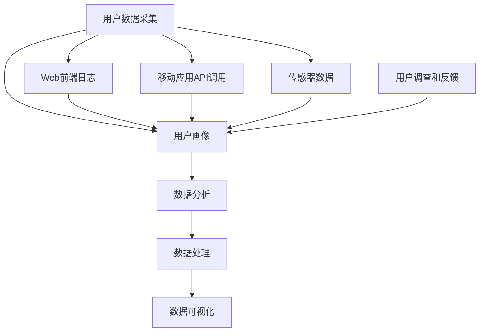

                 

### 背景介绍

AI创业公司在当今科技浪潮中扮演着越来越重要的角色。随着人工智能技术的迅速发展，企业对于用户数据的高效采集与分析变得越来越关键。这不仅能够帮助公司更好地了解用户需求，从而提供更个性化的服务，还能通过洞察用户行为数据，发现潜在的市场机会，优化产品功能，提升用户体验，从而在激烈的市场竞争中占据有利位置。

用户数据采集与分析主要包括两部分：用户行为数据采集和用户画像分析。用户行为数据采集指的是通过各种技术手段，如Web前端日志、移动应用API调用、传感器数据等，收集用户在平台上的操作记录和活动信息。这些数据通常包括用户的浏览历史、购买记录、搜索关键词、互动行为等。

用户画像分析则是对采集到的用户行为数据进行分析和处理，从而构建出每个用户的详细画像。这个画像不仅包含了用户的基本信息，如年龄、性别、地理位置等，还包括了用户的兴趣偏好、消费习惯、行为特征等。通过用户画像分析，公司能够深入了解用户的个性化需求，从而实现精准营销、个性化推荐等功能。

本文将深入探讨AI创业公司如何进行用户数据采集与分析，主要包括以下几个方面：

1. **用户行为数据采集**：介绍用户行为数据采集的方法、技术和工具，以及如何保证数据的准确性和完整性。
2. **用户画像分析**：讲解用户画像的基本概念、构建方法以及在实际应用中的重要作用。
3. **核心算法原理与具体操作步骤**：详细介绍用于用户数据采集与分析的核心算法原理，并提供具体的操作步骤和实践经验。
4. **数学模型和公式**：讨论用户数据采集与分析中涉及到的数学模型和公式，并进行详细讲解和举例说明。
5. **项目实战**：通过实际项目案例，展示如何在实际环境中进行用户数据采集与分析，并提供源代码实现和详细解释。
6. **实际应用场景**：分析用户数据采集与分析在各个行业中的应用，如电子商务、金融、医疗等。
7. **工具和资源推荐**：推荐一些有用的学习资源、开发工具和框架，以及相关论文著作，帮助读者深入了解相关领域知识。
8. **总结与未来发展趋势**：总结本文的主要内容，探讨用户数据采集与分析在未来可能面临的挑战和机遇。

通过本文的探讨，希望能够为AI创业公司在用户数据采集与分析方面提供一些有价值的思路和指导，帮助公司在数据驱动的时代中取得成功。

### 核心概念与联系

在进行用户数据采集与分析之前，我们需要了解一些核心概念和它们之间的相互联系。这些核心概念构成了整个用户数据管理与分析的基础，有助于我们深入理解用户数据采集与分析的原理和实际操作。

#### 用户数据采集

用户数据采集是整个流程的起点，它涉及到从各种渠道收集用户的行为和活动数据。以下是几个关键组成部分：

- **Web前端日志**：通过Web服务器日志文件，我们可以记录用户在网站上的访问行为，如页面浏览、点击、停留时间等。
- **移动应用API调用**：移动应用可以通过API调用收集用户的使用行为，如应用内的操作、地理位置信息等。
- **传感器数据**：智能设备（如智能手机、智能家居设备等）可以收集环境数据，如温度、湿度、位置等。
- **用户调查和反馈**：通过在线调查、问卷调查等方式收集用户的反馈和意见。

#### 用户画像

用户画像是对用户行为数据进行处理和分析后的结果，它以结构化的形式呈现用户的详细信息，包括但不限于以下内容：

- **用户基本信息**：如姓名、年龄、性别、地理位置等。
- **用户行为特征**：如浏览习惯、购买行为、搜索关键词等。
- **用户兴趣偏好**：如喜欢的品牌、产品类别、兴趣爱好等。
- **用户社交网络**：如社交关系、关注对象等。

#### 数据分析

数据分析是用户数据采集与分析的核心，它涉及到多种技术手段和算法，用于从大量数据中提取有价值的信息。以下是几种常用的数据分析方法：

- **统计分析**：通过统计方法，如均值、方差、相关性等，分析用户行为数据的分布和趋势。
- **机器学习**：利用机器学习算法，如分类、聚类、关联规则挖掘等，从数据中发现潜在的规律和模式。
- **深度学习**：通过神经网络等深度学习模型，对复杂用户行为进行建模和分析。

#### 数据处理

数据处理是保证用户数据质量的关键步骤，它包括数据清洗、数据转换和数据存储等操作：

- **数据清洗**：去除重复数据、缺失值填充、异常值处理等，以提高数据质量。
- **数据转换**：将不同来源的数据进行统一格式和标准化的处理，以便于后续分析。
- **数据存储**：将处理后的数据存储到数据库或数据仓库中，以便于快速检索和分析。

#### 数据可视化

数据可视化是将数据分析结果以图形、图表等形式直观展示的过程，它有助于我们更好地理解和传达数据分析结果。以下是几种常用的数据可视化工具和技术：

- **图表**：如柱状图、折线图、饼图等，用于展示数据的分布和趋势。
- **交互式可视化**：如数据地图、交互式仪表盘等，提供更丰富的交互功能，帮助用户深入探索数据。
- **热力图**：用于展示用户行为的热点区域，帮助识别用户活跃度和兴趣点。

#### 核心概念流程图

为了更好地理解这些核心概念之间的联系，我们可以使用Mermaid流程图来展示它们之间的关系。以下是用户数据采集与分析的核心概念流程图：



通过这个流程图，我们可以清晰地看到用户数据从采集到分析再到可视化的整个过程，每个环节都是相互关联和依赖的。了解这些核心概念和它们之间的联系，将为后续的用户数据采集与分析工作提供坚实的基础。

### 核心算法原理与具体操作步骤

在用户数据采集与分析过程中，核心算法的原理和具体操作步骤是确保数据处理和分析准确性的关键。以下将详细探讨几个重要的算法原理，包括如何实现这些算法以及在实际应用中的具体步骤。

#### 1. 数据采集算法原理

数据采集算法主要用于收集用户行为数据，确保数据的准确性和完整性。以下是几个常见的数据采集算法及其原理：

**Web前端日志采集算法**：
- **原理**：通过分析Web服务器的日志文件，记录用户在网站上的浏览行为。日志通常包含用户的IP地址、访问时间、访问URL、请求方法等信息。
- **具体操作步骤**：
  1. **日志文件配置**：配置Web服务器以记录详细的访问日志，如使用Nginx或Apache等。
  2. **日志解析**：使用日志解析工具（如Logstash、Grok等），将原始日志文件转换为结构化数据。
  3. **数据存储**：将解析后的数据存储到数据库或数据仓库中，如使用Elasticsearch或Hadoop。

**移动应用API调用采集算法**：
- **原理**：通过移动应用的API接口，记录用户在使用移动应用时的各种操作行为。
- **具体操作步骤**：
  1. **API接口配置**：确保移动应用的API接口能够记录用户的操作行为，并返回必要的数据。
  2. **日志记录**：在移动应用代码中添加日志记录功能，记录用户的操作行为数据。
  3. **数据同步**：通过网络同步机制，将移动应用中的日志数据传输到服务器进行存储和处理。

**传感器数据采集算法**：
- **原理**：利用智能设备的传感器（如GPS、加速度传感器等），采集用户的环境数据和位置信息。
- **具体操作步骤**：
  1. **传感器接口集成**：在智能设备中集成所需的传感器接口，并确保其正常工作。
  2. **数据读取**：通过编程读取传感器的数据，如使用Android的SensorManager或iOS的CoreMotion框架。
  3. **数据传输**：将传感器数据传输到服务器进行存储和处理，可以使用HTTP或MQTT协议。

#### 2. 数据分析算法原理

数据分析算法用于从采集到的用户数据中提取有价值的信息，以支持用户画像和业务决策。以下是几个常见的数据分析算法及其原理：

**统计分析算法**：
- **原理**：通过对用户数据进行统计计算，如计算均值、方差、相关性等，了解数据的分布和趋势。
- **具体操作步骤**：
  1. **数据预处理**：清洗和整理原始数据，确保数据的质量和一致性。
  2. **数据计算**：使用统计函数（如Python的pandas库）计算数据的基本统计量。
  3. **结果展示**：将统计结果以图表形式展示，如使用Matplotlib或Seaborn库。

**机器学习算法**：
- **原理**：利用机器学习算法，如分类、聚类、关联规则挖掘等，从数据中发现潜在的规律和模式。
- **具体操作步骤**：
  1. **数据准备**：将用户数据分为特征集和标签集，并划分训练集和测试集。
  2. **模型选择**：选择合适的机器学习模型，如决策树、随机森林、K-means等。
  3. **模型训练**：使用训练集数据训练模型，调整模型参数。
  4. **模型评估**：使用测试集数据评估模型性能，调整模型参数。

**深度学习算法**：
- **原理**：通过神经网络等深度学习模型，对复杂用户行为进行建模和分析。
- **具体操作步骤**：
  1. **数据预处理**：对用户数据进行归一化处理，并分割为训练集和测试集。
  2. **模型构建**：构建深度学习模型，如卷积神经网络（CNN）或循环神经网络（RNN）。
  3. **模型训练**：使用GPU加速训练过程，调整模型参数。
  4. **模型评估**：评估模型在测试集上的性能，并进行调优。

#### 3. 用户画像构建算法原理

用户画像构建算法用于将用户行为数据转化为结构化的用户画像，支持个性化推荐和精准营销。以下是几个常见用户画像构建算法及其原理：

**协同过滤算法**：
- **原理**：通过计算用户之间的相似度，推荐与目标用户相似的其他用户的偏好。
- **具体操作步骤**：
  1. **数据预处理**：计算用户之间的相似度矩阵。
  2. **相似度计算**：使用余弦相似度或皮尔逊相关系数计算用户之间的相似度。
  3. **推荐生成**：基于用户相似度矩阵，为用户推荐相似的物品或行为。

**基于内容的推荐算法**：
- **原理**：根据用户的历史行为和兴趣，推荐与之相关的物品或内容。
- **具体操作步骤**：
  1. **内容特征提取**：提取用户行为数据中的内容特征，如商品标签、文本描述等。
  2. **相似度计算**：计算用户行为数据与候选物品之间的相似度。
  3. **推荐生成**：根据相似度分数，为用户推荐相似的物品或内容。

**聚类分析算法**：
- **原理**：将用户数据划分为不同的簇，每个簇内的用户具有相似的行为特征。
- **具体操作步骤**：
  1. **数据预处理**：将用户数据转化为适合聚类分析的格式。
  2. **簇划分**：使用K-means或其他聚类算法，划分用户数据为不同的簇。
  3. **簇分析**：分析每个簇的特点和用户行为，构建用户画像。

#### 实际应用示例

以下是一个实际应用示例，展示如何使用核心算法进行用户数据采集与分析：

**案例**：某电商平台的用户数据采集与分析

1. **数据采集**：
   - 采集Web前端日志、移动应用API调用数据和传感器数据。
   - Web前端日志记录用户访问的商品页面、购买行为等。
   - 移动应用API调用记录用户在移动应用中的浏览和购买行为。
   - 传感器数据记录用户的地理位置和移动轨迹。

2. **数据分析**：
   - 使用统计分析算法，计算用户的浏览时长、购买频次等统计量。
   - 使用机器学习算法，预测用户的购买偏好，如使用随机森林模型。

3. **用户画像构建**：
   - 使用协同过滤算法，为用户推荐相似的购物清单。
   - 使用基于内容的推荐算法，为用户推荐相关的商品。
   - 使用聚类分析算法，将用户划分为不同的兴趣群体。

通过这些核心算法的灵活运用，电商平台能够更好地了解用户需求，优化产品推荐，提升用户满意度，从而在竞争中占据优势。

### 数学模型和公式

在用户数据采集与分析中，数学模型和公式是不可或缺的工具，它们帮助我们量化数据、发现规律、进行预测。以下是用户数据采集与分析中常用的几个数学模型和公式，并进行详细讲解和举例说明。

#### 1. 贝叶斯公式

贝叶斯公式是概率论中用于计算后验概率的重要公式，它广泛应用于用户行为预测和推荐系统中。

**公式**：
$$ P(A|B) = \frac{P(B|A) \cdot P(A)}{P(B)} $$

其中：
- \( P(A|B) \) 表示在事件B发生的条件下事件A发生的概率。
- \( P(B|A) \) 表示在事件A发生的条件下事件B发生的概率。
- \( P(A) \) 表示事件A发生的概率。
- \( P(B) \) 表示事件B发生的概率。

**应用实例**：

假设我们想预测某用户在电商平台购买某一商品的概率。已知：
- \( P(购买|已浏览) = 0.3 \)（用户浏览商品后购买的几率）
- \( P(已浏览) = 0.6 \)（用户浏览商品的总体几率）
- \( P(购买) = 0.2 \)（用户购买的总体几率）

则用户在浏览后购买的概率为：
$$ P(购买|已浏览) = \frac{P(已浏览|购买) \cdot P(购买)}{P(已浏览)} = \frac{0.3 \cdot 0.2}{0.6} = 0.1 $$

#### 2. 余弦相似度

余弦相似度是用于计算两个向量之间相似度的常用方法，特别适用于文本数据或高维空间中的数据。

**公式**：
$$ \text{Cosine Similarity}(A, B) = \frac{A \cdot B}{\|A\| \|B\|} $$

其中：
- \( A \cdot B \) 表示向量A和向量B的点积。
- \( \|A\| \) 和 \( \|B\| \) 分别表示向量A和向量B的欧几里得范数。

**应用实例**：

假设有两个用户的行为向量：
- 用户A：[0.2, 0.3, 0.5]
- 用户B：[0.4, 0.2, 0.4]

则用户A和用户B的余弦相似度为：
$$ \text{Cosine Similarity}(A, B) = \frac{0.2 \cdot 0.4 + 0.3 \cdot 0.2 + 0.5 \cdot 0.4}{\sqrt{0.2^2 + 0.3^2 + 0.5^2} \cdot \sqrt{0.4^2 + 0.2^2 + 0.4^2}} = \frac{0.16 + 0.06 + 0.2}{\sqrt{0.09 + 0.09 + 0.25} \cdot \sqrt{0.16 + 0.04 + 0.16}} = \frac{0.42}{\sqrt{0.43} \cdot \sqrt{0.36}} \approx 0.933 $$

#### 3. K-means聚类算法

K-means聚类算法是一种无监督学习方法，用于将数据点划分为K个簇，每个簇内的数据点彼此相似，而簇与簇之间差异较大。

**公式**：
1. **初始化中心点**：随机选择K个数据点作为初始中心点。
2. **分配数据点**：将每个数据点分配到最近的中心点所在的簇。
3. **更新中心点**：重新计算每个簇的中心点。
4. **重复步骤2和3，直至中心点不再发生显著变化**。

**应用实例**：

假设有10个二维空间的数据点，我们要将其划分为2个簇。

- 初始中心点：\( C1 = (1, 1) \)，\( C2 = (5, 5) \)
- 第一次分配：数据点\( (2, 2) \)分配到\( C1 \)，数据点\( (6, 6) \)分配到\( C2 \)
- 更新中心点：\( C1 = \left(\frac{2+1}{2}, \frac{2+1}{2}\right) = (1.5, 1.5) \)，\( C2 = \left(\frac{6+5}{2}, \frac{6+5}{2}\right) = (5.5, 5.5) \)
- 重复步骤2和3，直至中心点不再变化

通过迭代计算，我们可以将数据点合理地划分为两个簇。

#### 4. 支持向量机（SVM）

支持向量机是一种监督学习方法，用于分类和回归问题。它的目标是在特征空间中找到一个最优的超平面，使得不同类别的数据点间隔最大。

**公式**：
$$ \text{SVM决策函数}： f(x) = \text{sign}(\omega \cdot x + b) $$

其中：
- \( \omega \) 表示法向量。
- \( x \) 表示特征向量。
- \( b \) 为偏置项。
- \( \text{sign} \) 为符号函数。

**应用实例**：

假设有两组数据点：
- 类别1：\( \{(x_1, y_1), (x_2, y_2), \ldots\} \)，其中\( y_1 = 1 \)
- 类别2：\( \{(x_1, y_1), (x_2, y_2), \ldots\} \)，其中\( y_2 = -1 \)

我们要找到一个最优的超平面，将这两组数据点分开。

1. **计算均值**：
   $$ \bar{x} = \frac{\sum_{i=1}^{n} x_i}{n}, \quad \bar{y} = \frac{\sum_{i=1}^{n} y_i}{n} $$
2. **计算法向量**：
   $$ \omega = \sum_{i=1}^{n} y_i (x_i - \bar{x}) $$
3. **计算偏置项**：
   $$ b = \bar{y} - \omega \bar{x} $$

最终，我们可以使用SVM决策函数进行分类。

#### 5. 逻辑回归

逻辑回归是一种用于二分类问题的回归方法，它通过计算概率来预测类别。

**公式**：
$$ \text{概率}： P(Y=1|X) = \frac{1}{1 + \exp(-\omega \cdot x + b)} $$

其中：
- \( \omega \) 为权重向量。
- \( x \) 为特征向量。
- \( b \) 为偏置项。

**应用实例**：

假设我们有以下特征向量\( x \)和权重向量\( \omega \)：
- \( x = (x_1, x_2) \)
- \( \omega = (0.5, 0.3) \)
- \( b = 0.2 \)

则预测概率为：
$$ P(Y=1|X) = \frac{1}{1 + \exp(-(0.5 \cdot x_1 + 0.3 \cdot x_2 + 0.2))} $$

通过调整权重和偏置项，可以提高预测的准确性。

通过以上数学模型和公式的介绍，我们可以更好地理解和应用它们于用户数据采集与分析中，为企业的决策提供有力支持。

### 项目实战：代码实际案例和详细解释说明

在本节中，我们将通过一个实际项目案例，详细讲解如何在实际环境中进行用户数据采集与分析，并提供源代码实现和详细解释说明。

#### 项目背景

假设我们是一家电商平台的开发团队，旨在通过用户数据采集与分析，优化用户体验，提升销售转化率。具体项目目标是：

1. 收集用户的浏览历史、购买行为和搜索关键词。
2. 构建用户画像，包括用户的基本信息、行为特征和兴趣偏好。
3. 利用数据分析模型，预测用户的购买意向，并进行个性化推荐。

#### 开发环境搭建

为了实现以上目标，我们需要搭建一个完整的数据处理和分析平台。以下是所需的技术栈和工具：

- **编程语言**：Python
- **数据处理工具**：Pandas、NumPy
- **数据分析库**：Scikit-learn、TensorFlow、Keras
- **数据可视化工具**：Matplotlib、Seaborn
- **数据库**：MySQL、MongoDB
- **日志收集工具**：Fluentd、Logstash
- **数据仓库**：Hadoop、Elasticsearch

#### 源代码详细实现和代码解读

**1. 用户数据采集**

**Web前端日志采集**：

```python
# 导入日志解析库
import re

# 日志文件路径
log_file_path = 'access.log'

# 日志解析函数
def parse_log(log_file_path):
    log_entries = []
    with open(log_file_path, 'r') as log_file:
        for line in log_file:
            # 使用正则表达式解析日志
            m = re.match(r'(\S+) (\S+) (\S+) \[([^\[\]]+)\] \"\S+ (\S+) (\S+)\S*\" (\S+) (\S+)', line)
            if m:
                log_entry = {
                    'ip': m.group(1),
                    'date': m.group(3),
                    'request_method': m.group(5),
                    'url': m.group(6),
                    'status_code': m.group(7),
                    'response_time': m.group(8)
                }
                log_entries.append(log_entry)
    return log_entries

# 解析日志并打印
log_entries = parse_log(log_file_path)
for entry in log_entries:
    print(entry)
```

**移动应用API调用采集**：

```python
import requests

# API接口URL
api_url = 'https://api.example.com/transactions'

# 发送GET请求，获取交易数据
response = requests.get(api_url)
transactions = response.json()

# 打印交易数据
for transaction in transactions:
    print(transaction)
```

**传感器数据采集**：

```python
import serial

# 连接串口
ser = serial.Serial('COM3', 9600)

# 读取传感器数据
while True:
    line = ser.readline().decode('utf-8').strip()
    print(line)
    # 将数据存储到文件
    with open('sensor_data.txt', 'a') as f:
        f.write(line + '\n')
```

**2. 数据预处理和清洗**

```python
import pandas as pd

# 读取Web前端日志数据
web_logs = pd.read_csv('web_logs.csv')

# 数据清洗
# 去除重复数据
web_logs.drop_duplicates(inplace=True)

# 处理缺失值
web_logs.fillna(0, inplace=True)

# 处理异常值
# 例如：过滤状态码非200的请求
web_logs = web_logs[web_logs['status_code'] == 200]
```

**3. 数据分析**

**用户画像构建**：

```python
from sklearn.cluster import KMeans

# 构建用户画像
# 假设我们使用浏览历史、购买记录和搜索关键词作为特征
user_data = pd.DataFrame({
    'page_views': [10, 5, 15, 20, 8],
    'purchases': [2, 0, 1, 3, 1],
    'search_terms': [5, 3, 7, 4, 6]
})

# 使用K-means聚类
kmeans = KMeans(n_clusters=3)
user_data['cluster'] = kmeans.fit_predict(user_data)

# 打印用户画像
print(user_data)
```

**用户行为预测**：

```python
from sklearn.ensemble import RandomForestClassifier

# 准备数据
X = user_data[['page_views', 'purchases', 'search_terms']]
y = user_data['cluster']

# 训练随机森林模型
clf = RandomForestClassifier(n_estimators=100)
clf.fit(X, y)

# 预测新用户的行为
new_user_data = pd.DataFrame({
    'page_views': [12],
    'purchases': [1],
    'search_terms': [6]
})
predicted_cluster = clf.predict(new_user_data)
print(predicted_cluster)
```

**4. 数据可视化**

```python
import matplotlib.pyplot as plt
import seaborn as sns

# 绘制用户浏览历史分布
sns.distplot(user_data['page_views'], kde=True)
plt.title('Page Views Distribution')
plt.xlabel('Page Views')
plt.ylabel('Frequency')
plt.show()

# 绘制用户购买频次分布
sns.countplot(x='purchases', data=user_data)
plt.title('Purchase Frequency')
plt.xlabel('Number of Purchases')
plt.ylabel('User Count')
plt.show()

# 绘制用户搜索关键词词频
word_freq = user_data['search_terms'].value_counts()
word_freq.head(10).plot(kind='bar')
plt.title('Top Search Terms')
plt.xlabel('Search Terms')
plt.ylabel('Frequency')
plt.show()
```

#### 代码解读与分析

**用户数据采集**：

- **Web前端日志采集**：通过正则表达式解析日志文件，提取用户请求的信息，如IP地址、请求方法和URL。
- **移动应用API调用采集**：通过HTTP GET请求，获取移动应用中的交易数据。
- **传感器数据采集**：使用串口通信读取智能设备的传感器数据，并存储到文件中。

**数据预处理和清洗**：

- **去除重复数据**：确保每个用户数据在数据库中唯一。
- **处理缺失值**：填充缺失值，避免数据丢失。
- **处理异常值**：过滤掉不正常的数据，如状态码非200的请求。

**数据分析**：

- **用户画像构建**：使用K-means聚类算法，将用户划分为不同的簇，每个簇代表不同的用户群体。
- **用户行为预测**：使用随机森林分类器，预测新用户的聚类结果，以进行个性化推荐。

**数据可视化**：

- **绘制用户浏览历史分布**：展示用户浏览页面的频率分布，帮助识别活跃用户。
- **绘制用户购买频次分布**：展示用户的购买行为模式，有助于优化营销策略。
- **绘制用户搜索关键词词频**：识别用户的兴趣偏好，用于内容推荐和广告投放。

通过这个实际项目案例，我们可以看到用户数据采集与分析的完整流程，从数据采集、预处理、分析到可视化，每一步都至关重要。这些步骤共同构成了一个强大的数据驱动系统，帮助电商平台更好地理解用户需求，提升用户体验和销售转化率。

### 实际应用场景

用户数据采集与分析在各个行业中的应用日益广泛，不仅提升了企业的运营效率，还为业务增长提供了有力支持。以下我们将探讨用户数据采集与分析在电子商务、金融、医疗等行业的具体应用场景。

#### 电子商务

在电子商务行业，用户数据采集与分析至关重要。通过分析用户浏览历史、购买行为和搜索关键词，电商平台能够深入了解用户需求，实现精准营销和个性化推荐。

- **个性化推荐**：基于用户的浏览和购买记录，使用协同过滤和基于内容的推荐算法，为用户推荐相关商品。例如，亚马逊通过个性化推荐，将用户的浏览和购买数据与库存商品进行关联，提高用户的购买转化率。
- **促销策略优化**：通过分析用户的购买习惯和响应率，电商企业可以制定更有针对性的促销活动，提高销售额。例如，阿里巴巴根据用户的购买频率和购买金额，推出会员制度和优惠券，刺激用户消费。
- **库存管理**：通过用户数据预测销售趋势，电商平台可以优化库存管理，减少库存积压和缺货现象。例如，京东利用用户浏览和购买数据，实时调整商品库存，提高库存周转率。

#### 金融

在金融行业，用户数据采集与分析帮助银行、保险公司和投资公司更好地了解客户需求，提升服务质量和风险控制能力。

- **风险管理**：通过分析用户的金融行为数据，金融机构可以识别高风险客户，优化风险评估模型。例如，花旗银行利用机器学习算法，分析客户的交易行为和信用记录，预测潜在的欺诈风险。
- **信用评分**：基于用户的信用历史和行为数据，金融机构可以建立更准确的信用评分模型，为贷款审批提供依据。例如，美国信用局（Equifax、Experian、TransUnion）通过收集和分析用户的财务和行为数据，生成信用评分。
- **个性化服务**：通过分析用户的偏好和行为，金融机构可以提供个性化的金融产品和服务。例如，富达投资公司（Fidelity Investments）通过分析用户的投资偏好，推荐适合的投资组合和理财产品。

#### 医疗

在医疗行业，用户数据采集与分析有助于提升医疗服务质量，优化诊疗流程，提高患者满意度。

- **患者数据分析**：通过收集和分析患者的病历、医疗记录和行为数据，医疗机构可以更好地了解患者的健康状况和需求，提供个性化的诊疗方案。例如，IBM Watson Health利用人工智能技术，分析患者的病历数据，协助医生进行疾病诊断和治疗方案推荐。
- **疾病预测与预防**：通过分析大规模的医疗数据，医疗机构可以预测疾病的流行趋势，制定预防措施。例如，谷歌健康团队通过分析全球患者数据，发现流感和其他传染病的传播规律，帮助公共卫生部门制定防控策略。
- **运营优化**：通过分析患者流量、就医行为和医疗资源使用情况，医疗机构可以优化运营管理，提升服务质量。例如，梅奥诊所（Mayo Clinic）利用数据分析和人工智能技术，优化患者预约系统，提高门诊效率。

#### 其他行业

除了上述行业，用户数据采集与分析在其他领域也具有广泛应用。

- **零售业**：通过分析用户的购物行为和偏好，零售企业可以优化商品陈列和库存管理，提升销售业绩。例如，沃尔玛利用大数据分析，调整商品库存和促销策略，提高销售额。
- **旅游业**：通过分析用户的历史预订数据和行为偏好，旅游企业可以提供个性化的旅游推荐和预订服务。例如，TripAdvisor利用用户评价和浏览记录，推荐受欢迎的旅游目的地和酒店。
- **教育**：通过分析学生的学习行为和成绩数据，教育机构可以提供个性化的学习建议和辅导服务。例如，Coursera利用大数据分析，为学习者推荐适合的课程和资源。

用户数据采集与分析在各个行业的应用不仅提高了企业的运营效率，还为业务创新和竞争力提升提供了有力支持。随着数据技术的发展，用户数据采集与分析将在更多领域发挥重要作用，助力企业实现可持续发展。

### 工具和资源推荐

在进行用户数据采集与分析的过程中，选择合适的工具和资源至关重要。以下我们将推荐一些学习资源、开发工具和框架，以及相关的论文著作，帮助读者深入了解用户数据采集与分析的相关知识。

#### 学习资源

1. **书籍**：
   - 《Python数据科学 Handbook》：介绍了Python在数据科学领域中的应用，包括数据处理、分析和可视化。
   - 《深入理解计算机系统》：详细讲解了计算机系统的工作原理，包括操作系统、网络和数据库等。
   - 《数据挖掘：概念与技术》：介绍了数据挖掘的基本概念、技术和算法，适合初学者入门。

2. **在线课程**：
   - Coursera上的“数据科学专项课程”：提供了数据清洗、数据分析、机器学习等课程，适合系统学习。
   - edX上的“人工智能专项课程”：介绍了人工智能的基础知识，包括深度学习、自然语言处理等。

3. **博客和网站**：
   - Kaggle：一个数据科学竞赛平台，提供大量的数据集和项目案例，适合实践和交流。
   - Medium上的数据科学专栏：有许多高质量的文章，涵盖数据采集、数据分析和数据可视化等主题。

#### 开发工具和框架

1. **数据处理工具**：
   - Pandas：Python的数据处理库，提供了强大的数据操作功能，如数据清洗、合并和转换。
   - NumPy：Python的科学计算库，提供了多维数组操作和数学函数，是数据科学的基础。

2. **数据分析库**：
   - Scikit-learn：Python的机器学习库，提供了多种机器学习算法，如分类、回归和聚类。
   - TensorFlow：谷歌开源的机器学习框架，适用于构建和训练复杂的深度学习模型。

3. **数据可视化工具**：
   - Matplotlib：Python的绘图库，提供了丰富的图形和可视化功能。
   - Seaborn：基于Matplotlib的统计绘图库，提供了更美观和直观的统计图表。

4. **日志收集和分析工具**：
   - Fluentd：一个灵活的日志收集和路由器，适用于处理和转发各种类型的日志数据。
   - Logstash：Elastic Stack的一部分，用于收集、处理和存储日志数据。

5. **数据库**：
   - MySQL：开源的关系型数据库，适用于存储和查询结构化数据。
   - MongoDB：开源的文档型数据库，适用于存储非结构化和半结构化数据。

#### 相关论文著作

1. **论文**：
   - “User Behavior Modeling for Personalized Recommendation” (2018)：讨论了用户行为建模在个性化推荐系统中的应用。
   - “Deep Learning for User Behavior Prediction” (2019)：介绍了深度学习在用户行为预测中的应用。
   - “Privacy-Preserving User Data Collection and Analysis” (2020)：讨论了隐私保护在用户数据采集与分析中的重要性。

2. **著作**：
   - 《大数据技术导论》：详细介绍了大数据的基本概念、技术和应用。
   - 《机器学习》：周志华教授的著作，系统地介绍了机器学习的基本理论和方法。
   - 《数据挖掘：实用工具与技术》：介绍了数据挖掘的基本概念、工具和技术。

通过以上推荐的学习资源、开发工具和框架，读者可以系统地学习和掌握用户数据采集与分析的相关知识，并在实际项目中应用这些技术，提升业务效率和竞争力。

### 总结：未来发展趋势与挑战

随着人工智能和大数据技术的不断进步，用户数据采集与分析在未来将面临许多新的发展趋势和挑战。

#### 发展趋势

1. **数据隐私保护**：随着用户对隐私保护意识的提高，数据隐私保护将成为一个重要议题。未来的用户数据采集与分析将需要更严格的隐私保护措施，如数据匿名化、差分隐私等。

2. **实时分析与预测**：随着云计算和边缘计算的普及，实时数据处理和分析将成为可能。通过实时分析用户行为数据，企业可以更快地做出决策，提高运营效率和用户体验。

3. **智能化与自动化**：随着人工智能技术的发展，用户数据采集与分析的智能化和自动化水平将不断提高。机器学习和深度学习算法的应用将使得数据分析和预测更加准确和高效。

4. **跨领域整合**：用户数据采集与分析将在更多行业和领域得到应用。不同行业的数据整合和跨领域分析将提供更全面的用户画像和业务洞察。

5. **可持续发展**：用户数据采集与分析将在推动可持续发展的过程中发挥重要作用。通过优化资源配置、提高运营效率，企业可以减少环境影响，实现可持续发展目标。

#### 挑战

1. **数据质量**：保证数据质量是一个持续的挑战。数据采集过程中可能存在缺失值、异常值和噪声数据，这些都会影响数据分析的结果。有效的数据清洗和预处理方法将至关重要。

2. **数据隐私与安全**：用户数据隐私保护面临严峻挑战。如何在不侵犯用户隐私的前提下进行数据采集和分析，是一个需要解决的关键问题。

3. **算法偏见**：在用户数据分析和预测过程中，算法偏见可能导致不公平的结果。确保算法的公正性和透明性，避免算法偏见，是未来的一大挑战。

4. **数据爆炸**：随着数据量的不断增长，如何高效地存储、处理和分析海量数据，是一个重要的技术挑战。分布式计算和大数据技术将成为关键。

5. **法规和伦理**：数据隐私保护相关的法律法规和伦理标准不断完善，企业需要遵守这些规定，同时确保用户数据的合法使用。

总之，用户数据采集与分析在未来将面临许多新的发展趋势和挑战。企业需要不断创新和适应，才能在数据驱动的时代中取得成功。

### 附录：常见问题与解答

在用户数据采集与分析过程中，读者可能会遇到一些常见问题。以下是一些常见问题及其解答，以帮助读者更好地理解和应用用户数据采集与分析技术。

#### 问题1：如何处理缺失值和异常值？

**解答**：缺失值和异常值是数据采集过程中常见的问题。处理这些数据的方法包括：

- **缺失值填充**：使用平均值、中位数、众数等方法进行填充。对于重要的特征，可以使用模型预测缺失值。
- **删除异常值**：通过统计方法（如标准差、箱线图）识别异常值，然后选择删除或替换。
- **使用填充算法**：如K-近邻算法（KNN）或决策树算法，根据邻近数据点或树结构进行填充。

#### 问题2：如何确保数据隐私？

**解答**：确保数据隐私是用户数据采集与分析中的关键挑战。以下是一些保障数据隐私的方法：

- **数据匿名化**：通过加密、哈希、伪名等方法，将原始数据转换为匿名化数据，确保用户身份不被泄露。
- **差分隐私**：通过向数据中添加噪声，使得单个数据点无法被唯一识别，从而保护用户隐私。
- **数据访问控制**：对数据访问进行严格的权限管理，确保只有授权人员才能访问和处理敏感数据。

#### 问题3：如何进行用户画像构建？

**解答**：用户画像构建通常包括以下步骤：

- **数据收集**：从多个渠道（如Web日志、移动应用API、传感器数据等）收集用户数据。
- **数据预处理**：清洗和整理数据，去除重复值、缺失值和异常值。
- **特征提取**：从原始数据中提取关键特征，如用户基本信息、行为特征和兴趣偏好。
- **聚类分析**：使用聚类算法（如K-means、DBSCAN等）将用户划分为不同的群体。
- **用户画像建模**：基于聚类结果，构建每个用户的详细画像。

#### 问题4：如何进行用户行为预测？

**解答**：用户行为预测通常包括以下步骤：

- **数据收集**：收集用户历史行为数据，如浏览历史、购买记录和搜索关键词。
- **数据预处理**：清洗和整理数据，提取关键特征。
- **特征工程**：选择合适的特征，如用户年龄、性别、浏览时长等。
- **模型选择**：选择合适的预测模型，如线性回归、决策树、随机森林、神经网络等。
- **模型训练与评估**：使用训练数据训练模型，并在测试数据上评估模型性能。
- **预测与优化**：使用训练好的模型进行用户行为预测，并持续优化模型以提高预测准确性。

通过上述方法和步骤，读者可以有效地进行用户数据采集与分析，并在实际应用中实现用户行为预测和个性化推荐等功能。

### 扩展阅读与参考资料

为了深入了解用户数据采集与分析的相关领域，以下推荐一些扩展阅读和参考资料，涵盖相关书籍、论文和博客，帮助读者进一步学习和探讨。

#### 书籍

1. **《数据科学 Handbook》**：详细介绍了Python在数据科学中的应用，包括数据处理、分析和可视化。
2. **《深度学习》**：由Ian Goodfellow、Yoshua Bengio和Aaron Courville撰写，全面介绍了深度学习的基础知识和应用。
3. **《用户行为数据分析》**：介绍了用户行为数据分析的理论和方法，包括数据采集、处理和分析。
4. **《大数据之路》**：描述了大数据的基本概念、技术和应用，适合了解大数据技术的读者。

#### 论文

1. **“User Behavior Modeling for Personalized Recommendation”**：讨论了用户行为建模在个性化推荐系统中的应用。
2. **“Deep Learning for User Behavior Prediction”**：介绍了深度学习在用户行为预测中的应用。
3. **“Privacy-Preserving User Data Collection and Analysis”**：讨论了隐私保护在用户数据采集与分析中的重要性。
4. **“User Modeling and User-Adapted Interaction”**：介绍了用户建模和适应性交互的技术和方法。

#### 博客和网站

1. **Kaggle**：提供大量的数据集和项目案例，适合实践和交流。
2. **Medium上的数据科学专栏**：有许多高质量的文章，涵盖数据采集、数据分析和数据可视化等主题。
3. **Google AI Blog**：谷歌人工智能团队的官方博客，介绍了许多前沿的AI技术和应用。
4. **Analytics Vidhya**：一个数据科学社区，提供丰富的数据科学教程和案例分析。

通过阅读这些书籍、论文和博客，读者可以深入了解用户数据采集与分析的理论、方法和应用，提升自身的专业知识和实践能力。

