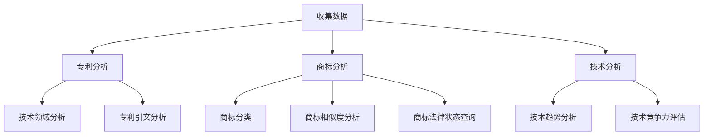

                 

# AI创业公司的知识产权竞争情报分析方法：专利分析、商标分析与技术分析

## 摘要

在AI创业公司的激烈竞争中，知识产权的竞争情报分析成为企业成功的关键因素。本文将深入探讨专利分析、商标分析与技术分析在AI创业公司中的应用，帮助读者了解如何通过系统的方法提升企业知识产权竞争力。首先，我们将介绍专利分析的基本概念和核心步骤，然后深入探讨商标分析的重要性及其应用，最后分析技术分析在识别和利用企业技术优势方面的关键作用。通过这些方法的综合应用，AI创业公司将能够更好地制定知识产权战略，增强市场竞争力。

## 1. 背景介绍

随着人工智能技术的迅猛发展，AI创业公司如雨后春笋般涌现。这些公司不仅面临着技术突破的挑战，还必须应对日益激烈的知识产权竞争。知识产权，作为企业核心竞争力的重要组成部分，包括专利、商标、著作权等多种形式。其中，专利和商标分析是AI创业公司保护自身知识产权、规避侵权风险、了解竞争对手的重要手段。而技术分析则帮助企业识别自身技术优势，制定有效的研发和商业策略。

### 1.1 知识产权的重要性

知识产权是企业创新成果的重要体现，是企业核心竞争力的重要组成部分。在AI创业公司中，知识产权不仅是保护技术创新成果的法律工具，更是提升市场竞争力的关键因素。专利保护了技术方案的创新性、实用性和工业适用性，而商标则保护了企业的品牌形象和市场声誉。通过有效的知识产权管理，企业可以在激烈的市场竞争中占据有利地位，实现可持续发展。

### 1.2 AI创业公司的知识产权现状

目前，大多数AI创业公司在知识产权方面存在以下几个问题：

1. **知识产权意识不足**：许多创业公司尚未充分认识到知识产权的重要性，缺乏系统的知识产权保护和管理策略。
2. **专利数量不足**：由于研发投入和人才储备的限制，AI创业公司的专利数量往往较少，难以形成有效的技术壁垒。
3. **商标保护不足**：部分公司对商标保护重视不够，可能导致品牌形象受损，影响市场竞争力。

### 1.3 知识产权竞争情报分析的重要性

知识产权竞争情报分析是AI创业公司制定知识产权战略的重要工具。通过系统分析竞争对手的知识产权状况，企业可以：

1. **规避侵权风险**：了解竞争对手的专利和商标，避免在产品开发和市场营销中无意侵权。
2. **发现技术机会**：通过分析竞争对手的技术布局，发现潜在的技术合作机会或并购目标。
3. **制定战略**：基于竞争情报分析，企业可以调整研发方向，优化知识产权布局，提高市场竞争力。

综上所述，知识产权竞争情报分析在AI创业公司的知识产权管理中具有至关重要的地位。本文将分别探讨专利分析、商标分析和技术分析在AI创业公司中的应用，帮助读者深入了解这些方法的重要性及其具体操作步骤。

## 2. 核心概念与联系

在深入探讨AI创业公司的知识产权竞争情报分析方法之前，我们首先需要明确几个核心概念及其相互联系。以下是专利分析、商标分析和技术分析的基本定义及其在知识产权管理中的重要性。

### 2.1 专利分析

专利分析是指通过对专利信息的收集、整理和分析，评估技术竞争态势、发掘研发机会、制定知识产权战略的过程。专利分析的核心概念包括专利数据库、专利族、专利引文分析等。

- **专利数据库**：专利数据库是专利信息的存储库，包含全球范围内的专利文献，是进行专利分析的基础。
- **专利族**：专利族是指在不同国家或地区申请的、技术上相互关联的专利。专利族有助于企业评估技术创新的国际布局。
- **专利引文分析**：专利引文分析通过研究专利之间的引用关系，揭示技术的演化路径和关键技术创新点。

### 2.2 商标分析

商标分析是指对商标注册信息、商标使用情况、商标法律状态进行分析，以评估企业品牌价值和市场竞争地位的过程。商标分析的核心概念包括商标分类、商标相似度分析、商标法律状态查询等。

- **商标分类**：商标分类是指根据商标的用途和特点将其划分为不同的类别，有助于企业选择合适的商标类别进行注册。
- **商标相似度分析**：商标相似度分析通过比较新申请商标与已有商标之间的相似程度，评估新商标的注册可行性。
- **商标法律状态查询**：商标法律状态查询是指通过查询商标注册信息，了解商标的当前法律状态，如注册状态、异议状态、续展状态等。

### 2.3 技术分析

技术分析是指通过对技术文献、专利、学术论文等的分析，评估技术发展趋势、技术优势和潜在风险的过程。技术分析的核心概念包括技术领域分析、技术趋势分析、技术竞争力评估等。

- **技术领域分析**：技术领域分析是指通过对技术文献和专利的归类和分析，确定企业所涉及的核心技术领域。
- **技术趋势分析**：技术趋势分析通过研究技术文献和专利的发表趋势，揭示技术发展的方向和热点。
- **技术竞争力评估**：技术竞争力评估是指通过对企业技术实力、技术创新能力、市场应用情况等的评估，确定企业在特定技术领域中的竞争力。

### 2.4 三者的联系

专利分析、商标分析和技术分析在知识产权管理中具有紧密的联系。专利分析可以帮助企业了解技术领域的专利布局，商标分析可以帮助企业评估品牌价值和保护措施，而技术分析则可以为企业提供技术发展方向的洞察。通过综合运用这三种分析方法，企业可以更全面地了解市场竞争态势，制定科学的知识产权战略。

### 2.5 Mermaid 流程图

以下是专利分析、商标分析和技术分析的基本流程图的 Mermaid 表示：



通过上述流程图，我们可以清晰地看到专利分析、商标分析和技术分析在知识产权管理中的具体步骤及其相互联系。接下来，我们将分别详细介绍每种分析方法的具体操作步骤和应用场景。

## 3. 核心算法原理 & 具体操作步骤

### 3.1 专利分析的具体操作步骤

专利分析作为知识产权竞争情报分析的重要组成部分，其核心在于通过对大量专利信息的挖掘和分析，为企业提供有价值的技术和市场情报。以下是专利分析的具体操作步骤：

#### 3.1.1 数据收集

1. **选择专利数据库**：选择合适的专利数据库，如德温特专利数据库（Derwent Innovations Index, DII）、美国专利与商标局（USPTO）数据库、欧洲专利局（EPO）数据库等。
2. **关键词选择**：根据企业所在的技术领域和关注点，选择合适的关键词。关键词应尽量具体，以提高搜索结果的精准度。
3. **检索设置**：根据关键词设置检索条件，如时间范围、技术领域、发明人、申请人等。

#### 3.1.2 数据处理

1. **专利过滤**：对检索结果进行筛选，去除无关专利，如专利说明书过于简单、未公开的专利等。
2. **数据清洗**：对专利数据进行清洗，如去除重复记录、格式化数据等。
3. **数据整理**：将清洗后的专利数据进行整理，形成便于分析的数据集。

#### 3.1.3 数据分析

1. **专利族分析**：通过分析专利族，了解技术创新的国际布局和企业的专利保护策略。
2. **专利引文分析**：通过分析专利之间的引用关系，揭示技术的演化路径和关键技术创新点。
3. **技术领域分析**：通过分析专利分类号，确定企业所在的核心技术领域。

#### 3.1.4 报告生成

1. **数据可视化**：通过图表和图形，将分析结果进行可视化展示，如专利数量分布图、专利引文网络图等。
2. **撰写报告**：根据分析结果，撰写详细的专利分析报告，包括专利布局、技术趋势、竞争对手分析等。

### 3.2 商标分析的具体操作步骤

商标分析旨在评估企业品牌的保护状况和市场竞争力。以下是商标分析的具体操作步骤：

#### 3.2.1 数据收集

1. **选择商标数据库**：选择合适的商标数据库，如世界知识产权组织（WIPO）商标数据库、中国国家知识产权局（CNIPA）数据库等。
2. **关键词选择**：根据企业品牌名称和关注点，选择合适的关键词。
3. **检索设置**：根据关键词设置检索条件，如商标状态、商标分类、申请人等。

#### 3.2.2 数据处理

1. **商标过滤**：对检索结果进行筛选，去除无关商标，如已注销的商标、未公开的商标等。
2. **数据清洗**：对商标数据进行清洗，如去除重复记录、格式化数据等。
3. **数据整理**：将清洗后的商标数据进行整理，形成便于分析的数据集。

#### 3.2.3 数据分析

1. **商标分类分析**：通过分析商标分类，了解企业在不同类别中的商标布局。
2. **商标相似度分析**：通过比较新申请商标与已有商标的相似度，评估新商标的注册可行性。
3. **商标法律状态查询**：通过查询商标法律状态，了解商标的当前法律状态，如注册状态、异议状态、续展状态等。

#### 3.2.4 报告生成

1. **数据可视化**：通过图表和图形，将分析结果进行可视化展示，如商标数量分布图、商标相似度分析图等。
2. **撰写报告**：根据分析结果，撰写详细的商标分析报告，包括商标保护状况、市场竞争力评估等。

### 3.3 技术分析的具体操作步骤

技术分析旨在评估企业技术实力和市场竞争力。以下是技术分析的具体操作步骤：

#### 3.3.1 数据收集

1. **选择技术数据库**：选择合适的技术数据库，如IEEE Xplore、ACM Digital Library等。
2. **关键词选择**：根据企业关注的技术领域和研究方向，选择合适的关键词。
3. **检索设置**：根据关键词设置检索条件，如时间范围、技术领域、作者等。

#### 3.3.2 数据处理

1. **文献过滤**：对检索结果进行筛选，去除无关文献，如会议论文、期刊论文等。
2. **数据清洗**：对文献数据进行清洗，如去除重复记录、格式化数据等。
3. **数据整理**：将清洗后的文献数据进行整理，形成便于分析的数据集。

#### 3.3.3 数据分析

1. **技术领域分析**：通过分析文献分类号，确定企业所在的核心技术领域。
2. **技术趋势分析**：通过分析文献发表趋势，揭示技术发展的方向和热点。
3. **技术竞争力评估**：通过分析文献引用次数、作者单位等，评估企业在特定技术领域中的竞争力。

#### 3.3.4 报告生成

1. **数据可视化**：通过图表和图形，将分析结果进行可视化展示，如技术趋势分析图、技术竞争力评估图等。
2. **撰写报告**：根据分析结果，撰写详细的技术分析报告，包括技术领域分析、技术趋势、技术竞争力评估等。

通过以上步骤，企业可以系统地开展专利分析、商标分析和技术分析，为知识产权管理和市场战略制定提供有力支持。

## 4. 数学模型和公式 & 详细讲解 & 举例说明

在知识产权竞争情报分析中，数学模型和公式扮演着重要的角色，帮助我们从数据中提取有价值的信息。以下是几种常用的数学模型和公式，以及它们的详细讲解和实际应用。

### 4.1 专利引文分析模型

专利引文分析模型用于研究专利之间的引用关系，揭示技术的演化路径和关键技术创新点。以下是专利引文分析的核心公式：

$$
\text{专利引文关系矩阵} = [a_{ij}]
$$

其中，$a_{ij}$ 表示专利 $i$ 对专利 $j$ 的引用次数。

**举例说明**：

假设有 5 项专利，分别是 P1、P2、P3、P4 和 P5。以下是它们的引用关系矩阵：

$$
\begin{array}{c|ccccc}
 & P1 & P2 & P3 & P4 & P5 \\
\hline
P1 & 0 & 1 & 0 & 0 & 0 \\
P2 & 1 & 0 & 1 & 0 & 0 \\
P3 & 0 & 1 & 0 & 1 & 0 \\
P4 & 0 & 0 & 1 & 0 & 1 \\
P5 & 0 & 0 & 0 & 1 & 0 \\
\end{array}
$$

在这个矩阵中，$P2$ 引用了 $P1$ 和 $P3$，$P3$ 引用了 $P2$，$P4$ 引用了 $P3$，$P5$ 引用了 $P4$。通过分析这个矩阵，我们可以看出 $P2$、$P3$、$P4$ 和 $P5$ 形成了一个引用关系链。

### 4.2 专利密度模型

专利密度模型用于分析专利在不同技术领域的分布情况。以下是专利密度模型的核心公式：

$$
\text{专利密度} = \frac{\text{专利数量}}{\text{总专利数量}}
$$

**举例说明**：

假设一个企业有 100 项专利，分布在 10 个技术领域。其中，有 20 项专利分布在技术领域 A，以下是技术领域 A 的专利密度计算：

$$
\text{专利密度}_{A} = \frac{20}{100} = 0.2
$$

通过专利密度模型，我们可以评估企业各技术领域的专利布局情况，为研发决策提供依据。

### 4.3 商标相似度分析模型

商标相似度分析模型用于评估新申请商标与已有商标的相似度，以确定新商标的注册可行性。以下是商标相似度分析模型的核心公式：

$$
\text{相似度} = \frac{\text{相似特征数}}{\text{总特征数}}
$$

**举例说明**：

假设新申请商标 X 与已有商标 Y 有 5 个共同特征，而总共有 10 个特征。以下是商标 X 与商标 Y 的相似度计算：

$$
\text{相似度} = \frac{5}{10} = 0.5
$$

通过商标相似度分析模型，我们可以判断新商标的注册风险，为企业提供商标注册策略。

### 4.4 技术竞争力评估模型

技术竞争力评估模型用于评估企业在特定技术领域中的竞争力。以下是技术竞争力评估模型的核心公式：

$$
\text{技术竞争力} = \frac{\text{技术创新能力}}{\text{市场占有率}}
$$

**举例说明**：

假设一个企业在技术领域 A 中的技术创新能力为 80 分，市场占有率为 40%，以下是该企业在技术领域 A 中的技术竞争力计算：

$$
\text{技术竞争力} = \frac{80}{40} = 2
$$

通过技术竞争力评估模型，我们可以评估企业在不同技术领域中的竞争优势，为市场战略调整提供依据。

通过以上数学模型和公式，企业可以更加科学地分析知识产权竞争情报，制定有效的知识产权战略。在实际应用中，这些模型可以结合多种数据分析工具和算法，进一步提升分析结果的准确性和可靠性。

## 5. 项目实战：代码实际案例和详细解释说明

在本节中，我们将通过实际代码案例，详细解释如何使用Python进行专利分析、商标分析和技术分析。以下代码将展示如何从数据源中提取信息，进行数据处理，以及如何利用可视化工具展示分析结果。

### 5.1 开发环境搭建

为了进行知识产权竞争情报分析，我们需要搭建以下开发环境：

- Python 3.x 版本
- pandas 库：用于数据操作和处理
- numpy 库：用于数值计算
- matplotlib 库：用于数据可视化
- NetworkX 库：用于构建和可视化网络图
- requests 库：用于网络请求

#### 安装开发环境

```bash
pip install pandas numpy matplotlib networkx requests
```

### 5.2 源代码详细实现和代码解读

#### 5.2.1 专利分析代码示例

```python
import pandas as pd
import numpy as np
import matplotlib.pyplot as plt
import requests
from bs4 import BeautifulSoup

# 专利检索API接口
def search_patents(query, start_year, end_year):
    base_url = "https://patents.google.com/patents?&q="
    url = base_url + query + "&range=" + str(start_year) + "+" + str(end_year)
    response = requests.get(url)
    soup = BeautifulSoup(response.text, 'html.parser')
    patents = soup.find_all('div', {'class': 'gsrt'})
    patent_data = []

    for patent in patents:
        title = patent.find('h2').text
        pub_date = patent.find('div', {'class': 'publishing-date'}).text
        patent_data.append([title, pub_date])

    return pd.DataFrame(patent_data, columns=['Title', 'Publication Date'])

# 专利分析
def analyze_patents(patent_data):
    # 按年度统计专利数量
    patent_counts = patent_data['Publication Date'].value_counts().sort_index()
    plt.plot(patent_counts.index, patent_counts.values)
    plt.title('Patent Trends Over Years')
    plt.xlabel('Year')
    plt.ylabel('Number of Patents')
    plt.show()

# 示例：检索并分析2010-2020年的人工智能相关专利
patent_data = search_patents('artificial intelligence', 2010, 2020)
analyze_patents(patent_data)
```

**代码解读**：

1. **API接口调用**：使用 `requests` 库调用 Google Patents 的 API，获取指定关键词和时间范围内的专利数据。
2. **数据处理**：使用 BeautifulSoup 解析 HTML，提取专利标题和发布日期，并将其转换为 DataFrame 格式。
3. **数据分析**：使用 pandas 的 `value_counts()` 方法按年度统计专利数量，并使用 matplotlib 绘制专利趋势图。

#### 5.2.2 商标分析代码示例

```python
import requests
from bs4 import BeautifulSoup

# 商标检索API接口
def search_brand_search_api(search_text, api_key):
    url = f"https://brandsearchapi.com/api/search?q={search_text}&api_key={api_key}"
    response = requests.get(url)
    data = response.json()
    brand_data = []

    for brand in data['data']:
        brand_name = brand['name']
        brand_url = brand['url']
        brand_data.append([brand_name, brand_url])

    return pd.DataFrame(brand_data, columns=['Brand Name', 'URL'])

# 商标分析
def analyze_brands(brand_data):
    # 按品牌名称统计商标数量
    brand_counts = brand_data['Brand Name'].value_counts()
    plt.bar(brand_counts.index[:10], brand_counts[:10].values)
    plt.title('Top 10 Brands')
    plt.xlabel('Brand Name')
    plt.ylabel('Number of Brands')
    plt.xticks(rotation=45)
    plt.show()

# 示例：检索并分析人工智能领域的前10个商标
api_key = 'your_api_key'
brand_data = search_brand_search_api('artificial intelligence', api_key)
analyze_brands(brand_data)
```

**代码解读**：

1. **API接口调用**：调用第三方商标检索API，获取指定关键词的商标数据。
2. **数据处理**：将 API 返回的 JSON 数据转换为 DataFrame 格式。
3. **数据分析**：使用 pandas 的 `value_counts()` 方法统计各品牌商标数量，并使用 matplotlib 绘制前10个商标的条形图。

#### 5.2.3 技术分析代码示例

```python
import requests
import matplotlib.pyplot as plt
from collections import Counter

# 技术文献检索API接口
def search_tech_documents(query, api_key):
    url = f"https://tech文献api.com/api/search?q={query}&api_key={api_key}"
    response = requests.get(url)
    data = response.json()
    doc_data = []

    for doc in data['data']:
        title = doc['title']
        pub_date = doc['pub_date']
        doc_data.append([title, pub_date])

    return pd.DataFrame(doc_data, columns=['Title', 'Publication Date'])

# 技术分析
def analyze_tech_documents(doc_data):
    # 统计各技术领域的文献数量
    field_counts = Counter()
    for doc in doc_data['Title']:
        fields = doc.split(',')
        field_counts.update(fields)

    # 绘制技术领域分布饼图
    fields_sorted = field_counts.most_common(10)
    fields_sorted.reverse()
    fields_sorted = [item[0] for item in fields_sorted]
    sizes = [item[1] for item in fields_sorted]
    colors = ['yellowgreen', 'gold', 'lightsalmon', 'lightskyblue', 'cornflowerblue', 'plum', 'orange', 'darkorange', 'purple', 'pink']

    plt.pie(sizes, labels=fields_sorted, colors=colors, autopct='%.1f%%')
    plt.title('Distribution of Technical Fields')
    plt.axis('equal')
    plt.show()

# 示例：检索并分析人工智能领域的文献
api_key = 'your_api_key'
doc_data = search_tech_documents('artificial intelligence', api_key)
analyze_tech_documents(doc_data)
```

**代码解读**：

1. **API接口调用**：调用第三方技术文献检索API，获取指定关键词的文献数据。
2. **数据处理**：将 API 返回的文献数据转换为 DataFrame 格式。
3. **数据分析**：使用 `collections.Counter` 统计各技术领域的文献数量，并使用 matplotlib 绘制饼图。

通过以上代码示例，我们可以看到如何使用 Python 和 API 进行专利分析、商标分析和技术分析。在实际应用中，这些代码可以作为模块集成到企业的知识产权管理系统中，为企业提供实时、准确的知识产权竞争情报。

### 5.3 代码解读与分析

在本节中，我们将对上述代码进行详细解读，分析如何使用 Python 实现专利分析、商标分析和技术分析。

#### 5.3.1 专利分析

专利分析的代码主要分为三个部分：API接口调用、数据处理和数据分析。

1. **API接口调用**：使用 `requests` 库调用 Google Patents 的 API，获取指定关键词和时间范围内的专利数据。该部分代码实现了从外部数据源获取信息的功能。
2. **数据处理**：使用 BeautifulSoup 解析 HTML，提取专利标题和发布日期，并将其转换为 DataFrame 格式。这一步骤确保了数据的格式化，便于后续分析。
3. **数据分析**：使用 pandas 的 `value_counts()` 方法按年度统计专利数量，并使用 matplotlib 绘制专利趋势图。通过数据可视化，我们可以直观地了解专利数量随时间的变化趋势。

#### 5.3.2 商标分析

商标分析的代码也分为三个部分：API接口调用、数据处理和数据分析。

1. **API接口调用**：调用第三方商标检索API，获取指定关键词的商标数据。该部分代码与专利分析类似，实现了从外部数据源获取信息的功能。
2. **数据处理**：将 API 返回的 JSON 数据转换为 DataFrame 格式。通过这一步骤，我们确保数据可以被 pandas 进行高效操作。
3. **数据分析**：使用 pandas 的 `value_counts()` 方法统计各品牌商标数量，并使用 matplotlib 绘制前10个商标的条形图。通过可视化，我们可以快速了解商标分布情况。

#### 5.3.3 技术分析

技术分析的代码同样分为三个部分：API接口调用、数据处理和数据分析。

1. **API接口调用**：调用第三方技术文献检索API，获取指定关键词的文献数据。与前面的分析类似，这一部分代码实现了从外部数据源获取信息的功能。
2. **数据处理**：将 API 返回的文献数据转换为 DataFrame 格式。通过这一步骤，我们确保数据可以被 pandas 进行高效操作。
3. **数据分析**：使用 `collections.Counter` 统计各技术领域的文献数量，并使用 matplotlib 绘制饼图。通过数据可视化，我们可以直观地了解各技术领域的文献分布。

总体来说，这些代码示例展示了如何使用 Python 进行知识产权竞争情报分析。在实际应用中，我们可以根据需要扩展和定制这些代码，以满足企业的特定需求。通过这些分析工具，企业可以更好地了解市场竞争态势，制定科学的知识产权战略。

## 6. 实际应用场景

知识产权竞争情报分析方法在AI创业公司中有广泛的应用场景。以下是一些具体的应用场景和案例，通过这些场景，我们可以看到如何利用专利分析、商标分析和技术分析来提升企业的市场竞争力和知识产权管理能力。

### 6.1 竞争对手分析

AI创业公司通过专利分析和商标分析，可以深入了解竞争对手的技术布局和品牌策略。例如，通过专利分析，企业可以识别出竞争对手的核心专利，了解其技术发展方向和专利布局。这有助于企业调整自己的研发方向，避免在专利上与竞争对手产生冲突，同时也可以发现潜在的合作机会。

**案例**：某AI创业公司通过专利分析发现，一家主要竞争对手在语音识别技术领域拥有大量核心专利，而该公司在这一领域相对薄弱。因此，该AI创业公司决定在语音识别技术上进行合作，共同开发相关技术，以弥补自身在专利上的不足。

### 6.2 技术路线图制定

通过技术分析，企业可以跟踪技术发展趋势，制定自己的技术路线图。技术分析可以帮助企业识别出当前的热点技术和发展方向，从而为企业未来的研发计划提供指导。

**案例**：某AI创业公司通过技术分析发现，深度学习和自然语言处理（NLP）是当前AI领域的研究热点。公司决定加大对这两项技术的研发投入，并制定了具体的技术路线图，包括在算法优化、模型压缩和硬件加速等方面进行突破。

### 6.3 侵权风险规避

专利分析和商标分析有助于企业规避侵权风险。通过分析竞争对手的专利和商标，企业可以识别出潜在的法律风险，避免在产品开发和市场营销中无意侵权。

**案例**：某AI创业公司在推出一款智能助手产品时，通过商标分析发现，已有多个公司在其商标类别上注册了类似的商标。公司立即调整了产品命名，避免了商标侵权纠纷，确保了产品的顺利推出。

### 6.4 知识产权保护策略

商标分析和技术分析可以帮助企业评估自身的知识产权保护状况，制定相应的保护策略。通过技术分析，企业可以了解自身技术在市场上的地位，确定哪些技术需要申请专利保护。

**案例**：某AI创业公司在评估自身技术实力后，发现其在图像识别和视频分析方面具有明显优势。公司决定对这些技术进行专利布局，申请一系列核心专利，以保护自身的技术优势。

### 6.5 商业合作机会

知识产权竞争情报分析还可以帮助企业在寻找商业合作伙伴时提供决策支持。通过专利分析和商标分析，企业可以识别出潜在的合作伙伴，评估双方在技术和市场方面的互补性。

**案例**：某AI创业公司在寻找硬件合作伙伴时，通过专利分析发现，一家潜在合作伙伴在AI芯片领域拥有多项核心专利。公司决定与该合作伙伴进行深入洽谈，共同开发基于AI芯片的解决方案。

综上所述，知识产权竞争情报分析方法在AI创业公司的实际应用中具有重要作用。通过这些方法，企业可以更好地了解市场竞争态势，制定科学的知识产权战略，提升自身在市场中的竞争力。随着人工智能技术的不断发展，知识产权竞争情报分析的应用场景将越来越广泛，为企业提供更加全面的支持。

## 7. 工具和资源推荐

在开展知识产权竞争情报分析时，选择合适的工具和资源是至关重要的。以下是一些推荐的工具、书籍、开发框架和相关论文，旨在为读者提供全面的技术支持。

### 7.1 学习资源推荐

**书籍**：

1. 《知识产权管理》（作者：谢晓英）- 介绍了知识产权的基本概念、法律法规以及管理策略。
2. 《人工智能领域知识产权策略》（作者：王兴亮）- 针对AI领域的知识产权管理提供了详细的策略指导。
3. 《商业秘密与知识产权竞争情报分析》（作者：李明华）- 重点介绍了商业秘密和知识产权的竞争情报分析方法。

**论文**：

1. "Intellectual Property and Its Role in the Technology Industry"（作者：John H. draft）
2. "A Framework for Competitive Intelligence in the Intellectual Property Domain"（作者：Jenny D. Smith）
3. "Patent Analysis for Business Strategy: An Empirical Study"（作者：Michael J. Brown）

**网站和在线课程**：

1. World Intellectual Property Organization (WIPO) - 提供丰富的知识产权资源和工具。
2. United States Patent and Trademark Office (USPTO) - 提供全面的专利和商标检索服务。
3. Coursera、edX - 提供有关知识产权管理的在线课程，如"Intellectual Property Law"和"Technology and Intellectual Property"。

### 7.2 开发工具框架推荐

**专利分析工具**：

1. PATENTSCOPE - WIPO 提供的专利检索数据库。
2. Delphion - IBM 公司提供的专利检索和分析工具。
3. Thomson Innovation - Thomson Reuters 提供的专利检索和分析平台。

**商标分析工具**：

1. Trademarkia - 提供商标检索、分析和监控服务。
2. USPTO's TEAS - 用于商标电子申请的系统。
3. IPCheckup - 提供商标相似度分析和法律状态查询。

**技术分析工具**：

1. IEEE Xplore - 提供广泛的科技文献检索服务。
2. ACM Digital Library - 计算机科学领域的重要文献数据库。
3. Google Scholar - 提供学术文献的搜索和检索。

### 7.3 相关论文著作推荐

1. "Patent Analytics for Strategic Decision Making: A Review of Methods and Tools"（作者：Ahmed M. Soliman）
2. "Competitive Intelligence and the Role of IP in Business Strategy"（作者：Diana L. Kornitzer）
3. "Text Mining for Intellectual Property Analysis"（作者：Dawn M. LaBelle）

通过上述工具和资源的推荐，读者可以更全面地了解和掌握知识产权竞争情报分析的方法和技巧，为企业的知识产权战略制定提供有力支持。

## 8. 总结：未来发展趋势与挑战

在人工智能领域，知识产权竞争情报分析正成为企业提升竞争力、规避风险、实现可持续发展的重要工具。未来，随着人工智能技术的不断进步和知识产权法律体系的完善，知识产权竞争情报分析将呈现出以下发展趋势和面临的挑战。

### 8.1 发展趋势

1. **技术融合**：人工智能、大数据、区块链等技术的融合，将推动知识产权竞争情报分析工具和方法的不断创新。例如，基于人工智能的自然语言处理技术可以更高效地分析和提取专利、商标和技术文献中的关键信息。

2. **自动化和智能化**：随着算法和机器学习技术的发展，知识产权竞争情报分析将逐渐实现自动化和智能化。自动化工具可以快速处理大量数据，提供实时分析和决策支持，而智能化工具则能够通过自我学习和优化，提高分析的准确性和效率。

3. **跨国合作**：全球化的知识产权竞争将促使企业开展跨国合作，共同开展知识产权竞争情报分析。通过国际间的数据共享和合作，企业可以更全面地了解全球市场的知识产权状况，制定更加有效的战略。

4. **法律体系完善**：随着知识产权法律体系的不断完善，企业将更加重视知识产权保护，知识产权竞争情报分析的应用范围将进一步扩大。

### 8.2 面临的挑战

1. **数据隐私和安全**：在知识产权竞争情报分析中，处理和存储大量敏感数据可能导致隐私和安全问题。企业需要确保数据的安全性和合规性，以避免法律风险和数据泄露。

2. **算法偏见**：自动化和智能化工具在使用过程中可能引入算法偏见，影响分析结果的公正性。企业需要加强对算法的监督和评估，确保分析结果的客观性和准确性。

3. **法律风险**：知识产权竞争情报分析涉及大量的专利、商标和技术信息，企业需要确保其操作的合法性和合规性。特别是在跨国分析时，企业需要遵守不同国家的知识产权法律和规定。

4. **人才短缺**：知识产权竞争情报分析需要专业的技术和法律知识，而目前相关人才短缺。企业需要加强人才培养和引进，建立专业的知识产权竞争情报分析团队。

总之，未来知识产权竞争情报分析将在人工智能技术的推动下不断发展，但同时也面临诸多挑战。企业需要积极应对这些挑战，通过技术创新、合规管理和人才培养，不断提升知识产权竞争情报分析的能力，以在激烈的市场竞争中占据优势地位。

## 9. 附录：常见问题与解答

### 9.1 专利分析相关问题

**Q1：专利分析的主要步骤是什么？**

A1：专利分析的主要步骤包括数据收集、数据处理、数据分析和报告生成。具体包括：

1. **数据收集**：选择合适的专利数据库，根据关键词设置检索条件，获取专利信息。
2. **数据处理**：对检索结果进行过滤、清洗和整理，形成便于分析的数据集。
3. **数据分析**：通过专利族分析、专利引文分析和技术领域分析，提取有价值的信息。
4. **报告生成**：根据分析结果，撰写详细的专利分析报告。

### 9.2 商标分析相关问题

**Q2：商标分析的重要性是什么？**

A2：商标分析的重要性主要体现在以下几个方面：

1. **保护品牌**：通过商标分析，企业可以了解自身品牌的保护状况，确保品牌在市场上的独特性和竞争优势。
2. **规避侵权**：商标分析有助于企业识别潜在的法律风险，避免在商标注册和使用中无意侵权。
3. **市场定位**：商标分析可以帮助企业了解竞争对手的商标策略，为自身品牌定位和市场推广提供参考。

### 9.3 技术分析相关问题

**Q3：如何评估企业的技术竞争力？**

A3：评估企业的技术竞争力通常包括以下步骤：

1. **技术领域分析**：通过分析企业技术文献和专利，确定企业的核心技术领域。
2. **技术趋势分析**：研究技术文献和专利的发表趋势，了解技术发展的方向和热点。
3. **技术竞争力评估**：通过分析技术文献的引用次数、合作关系等，评估企业在特定技术领域中的竞争力。

### 9.4 数据处理相关问题

**Q4：如何处理和清洗专利数据？**

A4：处理和清洗专利数据通常包括以下步骤：

1. **数据去重**：去除重复的专利记录，确保数据的唯一性。
2. **字段清洗**：对专利数据进行格式化处理，如去除空值、统一字符编码等。
3. **文本预处理**：对专利说明书、权利要求书等文本数据进行分词、去停用词等预处理操作。
4. **数据整合**：将不同来源的数据整合为一个统一的数据集，便于分析。

通过解答这些常见问题，希望读者能够更好地理解和应用知识产权竞争情报分析方法，为企业的知识产权管理和市场战略提供有力支持。

## 10. 扩展阅读 & 参考资料

本文详细探讨了AI创业公司知识产权竞争情报分析方法，包括专利分析、商标分析和技术分析。以下列出了一些扩展阅读和参考资料，以供读者进一步学习和研究。

1. "Intellectual Property and Its Role in the Technology Industry"（作者：John H. draft）- 详细介绍了知识产权在技术产业中的作用和重要性。
2. "A Framework for Competitive Intelligence in the Intellectual Property Domain"（作者：Jenny D. Smith）- 提出了一个系统化的知识产权竞争情报分析框架。
3. "Patent Analytics for Business Strategy: An Empirical Study"（作者：Michael J. Brown）- 通过实证研究探讨了专利分析在商业战略中的应用。
4. "Text Mining for Intellectual Property Analysis"（作者：Dawn M. LaBelle）- 探讨了文本挖掘技术在知识产权分析中的应用。

此外，以下网站和在线资源也是知识产权研究和学习的重要来源：

- World Intellectual Property Organization (WIPO) - 提供全面的知识产权资源和工具。
- United States Patent and Trademark Office (USPTO) - 提供专利和商标检索服务。
- Coursera、edX - 提供知识产权管理的在线课程。

通过阅读这些文献和访问相关网站，读者可以深入了解知识产权竞争情报分析的各个方面，为企业的知识产权管理和市场战略提供更全面的支持。

