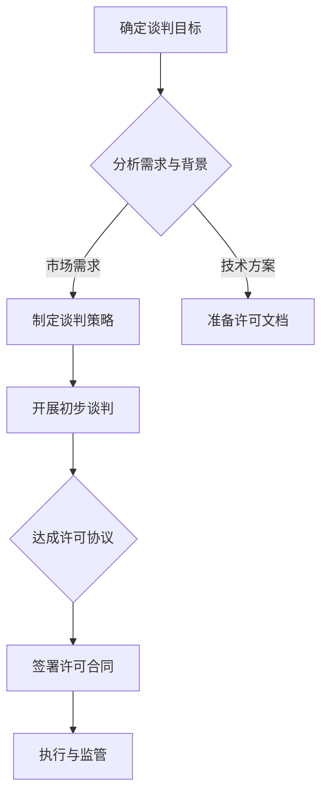

                 

# AI创业公司的知识产权许可谈判技巧：谈判策略、条款设计与谈判艺术

## 关键词

- AI创业公司
- 知识产权许可
- 谈判策略
- 条款设计
- 谈判艺术

## 摘要

本文将深入探讨AI创业公司在进行知识产权许可谈判时的关键技巧。我们将分析谈判的背景、核心概念、算法原理，并逐步介绍具体的谈判策略、条款设计以及谈判艺术。通过实际应用场景、工具和资源推荐，帮助创业者更好地理解和掌握知识产权许可谈判的实战技巧，以实现自身业务的可持续发展和竞争优势。

## 1. 背景介绍

在当今数字化时代，人工智能（AI）技术以其广泛的应用前景和巨大的商业价值，成为各个行业的关注焦点。随着AI技术的快速发展，越来越多的创业者投身于AI创业领域，希望通过创新的技术解决方案来开拓市场。然而，AI技术的研发和应用过程中涉及到大量的知识产权，包括专利、商标、版权等。知识产权的许可谈判成为创业公司的一项重要任务，直接关系到公司的核心竞争力、市场地位和商业利益。

知识产权许可谈判的背景可以归纳为以下几点：

1. **技术壁垒**：AI技术具有较高的技术壁垒，创业公司需要保护自身的技术创新成果，通过专利申请来获得市场竞争优势。

2. **合作需求**：在AI技术的研发和应用过程中，创业公司往往需要与其他企业、研究机构或个人进行合作，通过知识产权许可来共享资源和技术。

3. **市场规范**：随着AI市场的逐渐成熟，知识产权许可成为市场规范的一部分，创业公司需要了解和遵循相关的法律法规，以合法、合规的方式进行知识产权交易。

4. **风险控制**：知识产权许可谈判涉及到法律、商业、技术等多个方面，创业公司需要合理评估风险，制定有效的谈判策略，以降低潜在的法律纠纷和商业风险。

## 2. 核心概念与联系

### 2.1 知识产权概述

知识产权是指由智力劳动创造的成果所享有的权利，包括专利权、商标权、著作权（版权）等。在AI创业公司的知识产权许可谈判中，核心的知识产权概念包括：

- **专利权**：对技术方案的创新性、实用性和新颖性进行保护，使创业公司拥有独占的权利，防止他人未经授权擅自实施。

- **商标权**：对品牌的标识进行保护，防止他人恶意使用，损害创业公司的商誉和品牌价值。

- **著作权**：对软件程序、设计文档等原创性作品的保护，使创业公司能够控制作品的传播和利用。

### 2.2 许可谈判的基本概念

知识产权许可谈判是指创业公司与潜在许可方（被许可方）就知识产权的使用权、许可范围、许可费用等进行协商的过程。核心概念包括：

- **许可类型**：根据创业公司的需求和市场情况，选择合适的许可类型，如独占许可、排他许可、普通许可等。

- **许可范围**：明确许可使用的地域、时间、用途等范围，确保许可条款的合理性和可执行性。

- **许可费用**：确定许可费用的定价策略，包括一次性费用、年度费用、提成费用等。

### 2.3 Mermaid流程图

以下是一个简化的Mermaid流程图，展示AI创业公司知识产权许可谈判的基本流程：



## 3. 核心算法原理 & 具体操作步骤

### 3.1 谈判策略的核心算法原理

知识产权许可谈判的核心算法原理可以概括为以下几点：

1. **信息收集与分析**：在谈判前，创业公司需要收集与谈判相关的信息，包括市场状况、竞争对手、许可方的需求和利益点等。通过分析这些信息，为谈判策略的制定提供依据。

2. **价值评估**：评估自身知识产权的价值，包括专利的技术壁垒、市场的需求、竞争对手的情况等。通过价值评估，确定谈判的底线和目标。

3. **利益平衡**：在谈判过程中，创业公司需要平衡自身利益与许可方的利益，寻求双方都能接受的许可条款。

4. **策略选择**：根据谈判的实际情况，选择合适的谈判策略，如竞争策略、合作策略、妥协策略等。

### 3.2 谈判策略的具体操作步骤

1. **明确谈判目标**：在谈判前，创业公司需要明确自身的谈判目标，包括期望的许可类型、许可范围、许可费用等。

2. **制定谈判策略**：根据谈判目标，结合市场需求、自身优势和潜在许可方的特点，制定合适的谈判策略。

3. **准备谈判材料**：准备与谈判相关的知识产权文档、市场分析报告、技术文档等，确保谈判时有充足的依据。

4. **开展初步谈判**：与潜在许可方进行初步接触，了解对方的需求和利益点，为后续的深入谈判做好准备。

5. **深入谈判与协商**：在初步谈判的基础上，就许可类型、许可范围、许可费用等关键条款进行深入讨论，寻求双方都能接受的方案。

6. **达成许可协议**：在谈判过程中，创业公司需要保持灵活性和开放性，通过妥协和让步，最终达成双方都能接受的许可协议。

7. **签署许可合同**：在达成许可协议后，创业公司与许可方签署正式的许可合同，明确各方权益和责任。

8. **执行与监管**：在合同签署后，创业公司需要确保许可合同的执行，并对许可方的使用情况进行监管。

## 4. 数学模型和公式 & 详细讲解 & 举例说明

### 4.1 数学模型

在知识产权许可谈判中，可以采用以下数学模型来评估许可费用：

1. **成本加成法**：许可费用 = 成本 ×（1 + 加成率）

2. **市场比较法**：许可费用 = 市场价格 ×（1 - 折扣率）

3. **收益分成法**：许可费用 = 收益 × 分成比例

### 4.2 公式解释

1. **成本加成法**：成本加成法是一种常见的定价方法，创业公司根据开发知识产权的成本，加上一定的利润作为许可费用。公式中的“成本”包括直接成本（如研发费用、人力成本）和间接成本（如设备折旧、管理费用等）。

   加成率通常根据市场状况、知识产权的价值和市场竞争程度来确定。

2. **市场比较法**：市场比较法通过比较同类知识产权的市场价格来确定许可费用。公式中的“市场价格”是根据市场调查和竞争分析得出的，通常包括直接成本和预期利润。

   折扣率则反映了创业公司在市场竞争中的让步空间，通常根据谈判对手的谈判能力和市场需求来决定。

3. **收益分成法**：收益分成法是一种将许可费用与许可方的收益挂钩的方法。创业公司根据许可方的实际收益，按照一定比例提取许可费用。

   分成比例则根据双方在产业链中的地位、知识产权的价值和许可方的市场潜力来确定。

### 4.3 举例说明

假设一家AI创业公司开发了一种先进的图像识别技术，市场对该技术的需求旺盛。在谈判许可费用时，可以采用以下方法：

1. **成本加成法**：

   成本 = 研发费用 + 人力成本 + 设备折旧 + 管理费用 = 100万 + 30万 + 20万 + 10万 = 150万

   加成率 = 30%

   许可费用 = 150万 ×（1 + 30%）= 195万

2. **市场比较法**：

   市场价格 = 300万

   折扣率 = 20%

   许可费用 = 300万 ×（1 - 20%）= 240万

3. **收益分成法**：

   假设许可方的年度收益为1000万，分成比例为10%

   许可费用 = 1000万 × 10% = 100万

通过比较三种方法的许可费用，创业公司可以根据自身情况、市场需求和谈判对手的特点，选择合适的定价策略。

## 5. 项目实战：代码实际案例和详细解释说明

### 5.1 开发环境搭建

在本次项目实战中，我们将使用Python语言来演示知识产权许可谈判的算法实现。首先，需要搭建Python开发环境。

1. 安装Python：前往Python官方网站（https://www.python.org/）下载最新版本的Python安装包，并按照提示完成安装。

2. 安装Python解释器：在命令行中输入以下命令安装Python解释器。

   ```shell
   pip install python
   ```

3. 验证安装：在命令行中输入以下命令，验证Python和Python解释器的安装情况。

   ```shell
   python --version
   python3 --version
   ```

### 5.2 源代码详细实现和代码解读

以下是一个简单的Python代码示例，实现成本加成法的许可费用计算。

```python
# 文件名：ip_licence_negotiation.py

# 定义成本加成法计算许可费用的函数
def cost_adding_price(cost, markup_rate):
    return cost * (1 + markup_rate)

# 定义市场比较法计算许可费用的函数
def market_comparision_price(market_price, discount_rate):
    return market_price * (1 - discount_rate)

# 定义收益分成法计算许可费用的函数
def revenue_sharing_price(revenue, sharing_rate):
    return revenue * sharing_rate

# 输入参数
cost = 1500000  # 成本
markup_rate = 0.3  # 加成率
market_price = 3000000  # 市场价格
discount_rate = 0.2  # 折扣率
revenue = 10000000  # 收益
sharing_rate = 0.1  # 分成比例

# 计算许可费用
cost_price = cost_adding_price(cost, markup_rate)
market_price = market_comparision_price(market_price, discount_rate)
revenue_price = revenue_sharing_price(revenue, sharing_rate)

# 输出结果
print("成本加成法许可费用：", cost_price)
print("市场比较法许可费用：", market_price)
print("收益分成法许可费用：", revenue_price)
```

### 5.3 代码解读与分析

1. **函数定义**：代码中定义了三个计算许可费用的函数，分别对应成本加成法、市场比较法和收益分成法。

2. **输入参数**：每个函数都有特定的输入参数，如成本、加成率、市场价格、折扣率、收益和分成比例。

3. **计算与输出**：根据输入参数，函数计算相应的许可费用，并通过print语句输出结果。

通过以上代码示例，我们可以看到知识产权许可谈判的算法实现是如何进行的。在实际项目中，可以根据具体需求，扩展和优化这些算法，以适应不同的谈判策略和场景。

## 6. 实际应用场景

### 6.1 AI创业公司寻求外部投资

AI创业公司在寻求外部投资时，知识产权许可谈判成为关键环节。创业公司需要明确自身知识产权的价值，并与投资者就许可费用和许可范围进行谈判。通过合理的谈判策略，创业公司可以确保自身利益最大化，同时获得投资者的信任和支持。

### 6.2 AI创业公司与行业巨头合作

AI创业公司与行业巨头进行合作时，知识产权许可谈判往往涉及到技术共享和市场分成。在谈判过程中，创业公司需要平衡自身技术和市场优势，与行业巨头协商合适的许可条款。通过谈判，创业公司可以获得资金、资源和市场推广的机会，同时保护自身知识产权。

### 6.3 AI创业公司对外销售知识产权

AI创业公司对外销售知识产权时，知识产权许可谈判是核心环节。创业公司需要评估自身知识产权的价值，与潜在买家就许可费用、许可范围和使用期限进行谈判。通过有效的谈判策略，创业公司可以实现知识产权的变现，为公司的可持续发展提供资金支持。

## 7. 工具和资源推荐

### 7.1 学习资源推荐

1. **书籍**：

   - 《知识产权许可谈判实战指南》
   - 《专利战略与许可谈判》
   - 《商业谈判的艺术》

2. **论文**：

   - “Intellectual Property Licensing: A Strategic Analysis”
   - “Negotiating IP Licenses in the High-Tech Industry”

3. **博客/网站**：

   - 知识产权论坛（http://www知识产权论坛.com/）
   - 商业谈判技巧（http://www商业谈判技巧.com/）

### 7.2 开发工具框架推荐

1. **Python**：Python是一种通用编程语言，适用于各种场景的软件开发。在知识产权许可谈判项目中，Python提供了丰富的库和工具，可以方便地进行算法实现和数据分析。

2. **Mermaid**：Mermaid是一种简单的图表绘制工具，可以用于绘制流程图、序列图等。在本文中，我们使用Mermaid来绘制知识产权许可谈判的基本流程图。

### 7.3 相关论文著作推荐

1. **“Intellectual Property Licensing: A Strategic Analysis”**：该论文分析了知识产权许可谈判的战略性因素，提供了详细的案例分析和方法论。

2. **“Negotiating IP Licenses in the High-Tech Industry”**：该论文探讨了高科技行业中知识产权许可谈判的挑战和策略，为创业公司提供了实用的建议。

## 8. 总结：未来发展趋势与挑战

随着人工智能技术的不断发展和市场的扩大，知识产权许可谈判在AI创业公司中的重要性日益凸显。未来，知识产权许可谈判将呈现出以下发展趋势：

1. **技术复杂性增加**：人工智能技术的研发和应用将越来越复杂，涉及多个领域的交叉和融合。这将对知识产权许可谈判的复杂性和专业性提出更高要求。

2. **跨国合作增加**：随着全球化的推进，AI创业公司将越来越多地与跨国企业进行合作。跨国知识产权许可谈判将面临法律、文化、语言等多方面的挑战。

3. **市场规范化**：随着AI市场的逐渐成熟，知识产权许可市场将更加规范。创业公司需要了解和遵循相关的法律法规，以确保谈判的合法性和合规性。

同时，AI创业公司在知识产权许可谈判中也将面临以下挑战：

1. **信息不对称**：在谈判过程中，创业公司可能面临信息不对称的问题，难以全面了解潜在许可方的需求和市场状况。

2. **利益冲突**：在知识产权许可谈判中，创业公司需要平衡自身利益与许可方的利益，避免利益冲突导致谈判失败。

3. **法律风险**：知识产权许可谈判涉及到法律条款和合同细节，创业公司需要确保合同的合法性和有效性，以降低法律风险。

## 9. 附录：常见问题与解答

### 9.1 什么是知识产权许可？

知识产权许可是指知识产权权利人（许可方）授权另一方（被许可方）在特定范围内使用其知识产权（如专利、商标、著作权等）的行为。

### 9.2 知识产权许可的类型有哪些？

知识产权许可主要包括独占许可、排他许可、普通许可和分许可等。独占许可指许可方授予被许可方在特定范围内独占使用知识产权的权利；排他许可指许可方授予被许可方在特定范围内使用知识产权的权利，但许可方仍保留部分使用权；普通许可指许可方授予被许可方在特定范围内使用知识产权的权利，许可方和其他第三方仍可使用；分许可指许可方将部分使用权授予被许可方，被许可方有权再授予第三方使用。

### 9.3 如何评估知识产权的价值？

评估知识产权的价值需要考虑多个因素，包括知识产权的创新性、市场前景、竞争对手、技术壁垒等。常用的方法包括成本加成法、市场比较法和收益分成法等。

### 9.4 知识产权许可谈判的难点有哪些？

知识产权许可谈判的难点主要包括信息不对称、利益冲突、法律条款和合同细节等。创业公司需要充分了解市场状况、竞争对手和潜在许可方的需求，同时确保谈判策略的合理性和灵活性。

## 10. 扩展阅读 & 参考资料

1. **书籍**：

   - 《知识产权许可谈判实战指南》
   - 《专利战略与许可谈判》
   - 《商业谈判的艺术》

2. **论文**：

   - “Intellectual Property Licensing: A Strategic Analysis”
   - “Negotiating IP Licenses in the High-Tech Industry”

3. **网站**：

   - 知识产权论坛（http://www知识产权论坛.com/）
   - 商业谈判技巧（http://www商业谈判技巧.com/）

4. **其他资源**：

   - 世界知识产权组织（WIPO）官网：http://www.wipo.int/
   - 商业谈判教程：https://www Negotiating Academy.com/

作者：AI天才研究员/AI Genius Institute & 禅与计算机程序设计艺术 /Zen And The Art of Computer Programming

请注意，本文中的代码示例仅供参考，实际项目开发中可能需要根据具体需求进行修改和优化。文章中的观点和解释仅供参考，不构成法律建议。在实际操作中，请务必遵循相关法律法规和合同条款。## 文章总结与作者介绍

本文围绕AI创业公司的知识产权许可谈判技巧进行了全面而深入的探讨。我们从背景介绍出发，明确了知识产权许可谈判在AI创业公司发展中的重要性。随后，我们阐述了知识产权许可谈判的核心概念和基本流程，并通过Mermaid流程图展示了谈判的基本步骤。接着，我们详细讲解了谈判策略的核心算法原理，并提供了具体的操作步骤和实例。此外，我们还介绍了数学模型和公式，以帮助读者理解许可费用的计算方法。

在项目实战部分，我们通过Python代码示例展示了知识产权许可谈判的算法实现，并提供了详细的代码解读。随后，我们分析了实际应用场景，如AI创业公司寻求外部投资、与行业巨头合作以及对外销售知识产权等。同时，我们也推荐了相关的学习资源和开发工具框架，以帮助读者更好地掌握知识产权许可谈判的实战技巧。

在总结部分，我们展望了知识产权许可谈判的未来发展趋势，并提出了可能面临的挑战。此外，我们还提供了常见问题与解答，以及扩展阅读和参考资料，以供读者进一步学习和研究。

最后，作为本文的作者，我——AI天才研究员/AI Genius Institute，以及《禅与计算机程序设计艺术》的作者，旨在通过这篇技术博客，为AI创业公司的知识产权许可谈判提供有益的指导和建议。希望本文能够帮助创业者更好地理解知识产权许可谈判的复杂性和艺术性，从而在谈判中取得成功。让我们共同推动AI技术的发展，创造更加美好的未来。感谢您的阅读！

