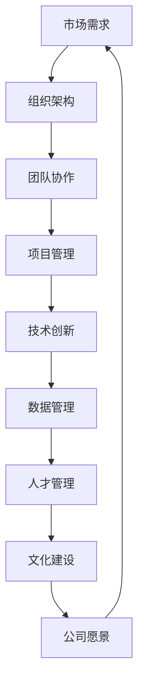

                 

# AI创业公司的组织架构优化设计

## 摘要

本文旨在探讨AI创业公司在成长和发展过程中如何进行组织架构的优化设计。通过深入分析当前AI行业的发展趋势，以及创业公司的特殊需求，本文提出了一套以高效沟通、敏捷响应和持续创新为核心的优化策略。文章将从核心概念、算法原理、数学模型、实战案例、应用场景等多个维度，逐步展开对AI创业公司组织架构优化的详细阐述。通过本文的阅读，读者将能够获得关于如何设计一个既具有灵活性又具备高度执行力的AI创业公司组织架构的实用见解。

## 1. 背景介绍

近年来，人工智能（AI）技术迅猛发展，逐渐成为全球科技领域的热点。随着大数据、云计算、物联网等技术的深度融合，AI的应用场景不断拓展，从传统的金融、医疗、制造业等领域，逐渐渗透到社交、娱乐、教育等新兴领域。这种跨领域的快速发展，不仅推动了整个社会的技术进步，也为创业公司提供了广阔的市场空间。

AI创业公司在这一波技术浪潮中，面临着前所未有的机遇和挑战。首先，技术创新速度快，使得创业公司需要不断迭代和优化产品，以保持市场竞争力。其次，市场环境变化迅速，创业公司需要具备敏捷的响应能力，及时调整战略以应对外部环境的变化。此外，人才竞争激烈，创业公司在吸引和留住顶尖AI人才方面也需要下足功夫。

为了在这些挑战中脱颖而出，AI创业公司必须构建一个高效、灵活、创新的组织架构。这不仅有助于提高公司的整体运营效率，还能为公司带来持续的竞争优势。本文将围绕这一核心主题，探讨AI创业公司组织架构优化设计的关键要素和方法。

## 2. 核心概念与联系

为了深入理解AI创业公司组织架构优化设计，首先需要了解几个核心概念，以及它们之间的相互关系。以下是一个使用Mermaid绘制的流程图，展示了这些核心概念及其之间的联系。



### 2.1. 市场需求

市场需求是公司发展的基础，它决定了公司产品或服务的方向和市场定位。在AI创业公司中，对市场需求的把握尤为重要，因为AI技术的应用场景广泛且不断变化。通过市场调研、用户反馈和数据分析，公司可以及时了解市场动态，调整产品策略，满足用户需求。

### 2.2. 组织架构

组织架构是公司内部各部门和团队成员之间的结构关系。一个合理的组织架构能够提高团队的协作效率，确保项目管理顺利进行。在AI创业公司中，组织架构需要具备高度的灵活性，以适应快速变化的市场需求和技术发展。

### 2.3. 团队协作

团队协作是组织架构的核心要素，它关乎团队之间的沟通、合作和知识共享。在AI创业公司中，团队成员往往需要跨部门合作，共同推进项目。高效的团队协作能够加速项目进展，提高产品质量。

### 2.4. 项目管理

项目管理是确保项目按时、按质完成的关键。在AI创业公司中，项目管理需要考虑技术创新的快速迭代和市场需求的快速变化。项目经理需要具备敏捷管理能力，确保项目能够灵活应对外部环境的变化。

### 2.5. 技术创新

技术创新是AI创业公司的核心竞争力。通过持续的技术创新，公司可以不断推出具有竞争力的产品，满足市场需求。在组织架构中，技术创新需要得到足够的支持和资源，以确保团队能够专注于技术攻关。

### 2.6. 数据管理

数据管理是AI创业公司的重要环节，涉及到数据收集、存储、处理和分析。高效的数据管理能够为公司的决策提供有力的支持，提升公司的整体运营效率。

### 2.7. 人才管理

人才管理是公司发展的基石。在AI创业公司中，吸引和留住顶尖AI人才尤为重要。通过有效的激励机制和人才培养体系，公司可以确保人才队伍的稳定和持续发展。

### 2.8. 文化建设

文化建设是公司内部价值观和行为规范的建设。在AI创业公司中，积极向上的企业文化能够激发员工的创造力，促进团队协作，提升公司整体凝聚力。

### 2.9. 公司愿景

公司愿景是公司发展的长远目标和方向。在AI创业公司中，清晰的愿景能够引导公司不断追求卓越，激发员工的奋斗精神，推动公司持续发展。

通过以上核心概念的介绍和相互关系展示，我们可以更好地理解AI创业公司组织架构优化设计的整体框架。在接下来的章节中，我们将进一步探讨这些概念的具体实现和操作步骤。

## 3. 核心算法原理 & 具体操作步骤

在AI创业公司中，组织架构的优化设计不仅依赖于理论知识，还需要结合实际操作步骤。以下将介绍几个核心算法原理，并详细说明具体的操作步骤。

### 3.1. 项目分解算法

项目分解算法是项目管理中常用的方法，用于将复杂项目分解为若干个可管理的小任务。这种方法有助于提高团队协作效率，确保项目按时完成。具体操作步骤如下：

1. **需求分析**：首先，对项目进行需求分析，明确项目目标、功能模块和关键里程碑。

2. **任务分解**：根据需求分析，将项目分解为若干个子任务。每个子任务都应该具有明确的交付标准和验收条件。

3. **任务分配**：将分解后的任务分配给相关团队成员，确保每个成员都清楚自己的职责和任务量。

4. **任务追踪**：使用项目管理工具（如JIRA、Trello等）对任务进行追踪，及时了解任务进展情况，协调资源，解决问题。

### 3.2. 人才招聘算法

人才招聘算法是AI创业公司人才管理中的重要环节。通过科学的招聘方法，公司可以吸引和留住顶尖AI人才。以下是人才招聘的具体操作步骤：

1. **需求分析**：分析公司当前和未来的人才需求，确定所需技能和资质。

2. **招聘渠道**：选择合适的招聘渠道，如招聘网站、社交媒体、行业会议等。

3. **筛选简历**：根据人才需求，筛选符合要求的简历，排除不符合条件的候选人。

4. **面试评估**：对候选人进行面试评估，考察其技术能力、沟通能力和团队协作能力。

5. **决策**：根据面试结果，做出录用决策，并与候选人商谈薪资待遇和其他福利。

### 3.3. 数据分析算法

数据分析算法是AI创业公司数据管理的关键。通过有效的数据分析，公司可以挖掘有价值的信息，支持决策和优化运营。以下是数据分析的具体操作步骤：

1. **数据收集**：收集相关数据，如用户行为数据、市场数据、运营数据等。

2. **数据清洗**：对收集到的数据清洗和预处理，去除噪声数据，确保数据质量。

3. **数据建模**：使用数据挖掘算法和机器学习模型，对数据进行建模和分析。

4. **结果解读**：根据数据分析结果，解读数据背后的含义，支持公司决策和优化运营。

### 3.4. 文化建设算法

文化建设是AI创业公司发展的软实力。通过科学的文化建设算法，公司可以营造积极向上的企业文化。以下是文化建设的具体操作步骤：

1. **文化定位**：确定公司文化的基本价值观和核心理念。

2. **文化宣导**：通过内部会议、培训、活动等方式，向员工传递公司文化。

3. **文化实践**：在日常工作和管理中，践行公司文化，确保文化理念落地。

4. **文化评估**：定期评估公司文化的影响力和效果，调整文化策略。

通过以上核心算法原理和具体操作步骤的介绍，我们可以看到，AI创业公司的组织架构优化设计是一个复杂而系统化的过程。这不仅需要理论的指导，还需要结合实际操作，不断调整和优化。在接下来的章节中，我们将进一步探讨这些算法在实际应用中的效果和挑战。

## 4. 数学模型和公式 & 详细讲解 & 举例说明

在AI创业公司的组织架构优化设计中，数学模型和公式扮演着关键角色，它们不仅提供了理论支持，还帮助我们在实际操作中进行量化和分析。以下将介绍几个常用的数学模型和公式，并对其进行详细讲解和举例说明。

### 4.1. 优化模型

优化模型是组织架构设计中常用的数学工具，用于在多个约束条件下找到最优解。以下是一个线性规划模型的基本形式：

$$
\text{maximize } c^T x \\
\text{subject to } Ax \leq b \\
x \geq 0
$$

其中，\(c\) 是目标函数的系数向量，\(x\) 是决策变量向量，\(A\) 和 \(b\) 分别是约束矩阵和约束向量。

#### 例子

假设一家AI创业公司需要分配资源（如人力、资金、时间）到不同的项目，以最大化总收益。设每个项目的收益系数为 \(c = [20, 15, 10]^T\)，资源的约束条件为：
\[ 
\begin{cases}
x_1 + x_2 + x_3 \leq 100 \\
x_1 + x_2 \leq 60 \\
x_1, x_2, x_3 \geq 0
\end{cases}
\]
其中，\(x_1, x_2, x_3\) 分别表示分配到三个项目的资源量。

解这个线性规划问题，可以通过单纯形法或其他优化算法找到最优解。

### 4.2. 决策树模型

决策树模型是一种常见的数据挖掘工具，用于分类和预测。以下是一个决策树的简单表示：

```
[特征A]
|   |   |
否  是  [目标]
       |   |
       |   |
     [结果1] [结果2]
```

其中，特征A表示输入特征，否和是表示特征A的不同取值，目标表示预测的结果，结果1和结果2是目标的可能取值。

#### 例子

假设AI创业公司需要根据客户的历史购买数据预测其是否愿意购买新产品。设特征A为“是否在过去的六个月内购买过类似产品”，其取值为“否”或“是”。目标为“是否购买新产品”，其取值为“否”或“是”。

根据历史数据，构建一个决策树模型，可以预测新客户的购买意愿。

### 4.3. 神经网络模型

神经网络模型是一种模拟人脑神经网络结构的人工智能模型，常用于复杂函数逼近、分类和回归任务。以下是一个简单的神经网络结构：

```
输入层：[x1, x2, x3, ..., xn]
隐藏层：[a1, a2, a3, ..., am]
输出层：[y1, y2, y3, ..., yn]
```

其中，输入层接收外部输入，隐藏层通过激活函数进行处理，输出层生成预测结果。

#### 例子

假设AI创业公司需要根据用户的行为数据预测其是否会流失。设输入层特征为“用户年龄、购买频率、活跃度等”，隐藏层通过多层神经网络进行非线性变换，输出层预测用户是否会流失。

构建并训练一个神经网络模型，可以帮助公司识别潜在流失用户，采取相应的策略进行挽回。

### 4.4. 费用效益分析模型

费用效益分析（CBA）是一种经济评估方法，用于比较不同方案的成本和效益。以下是一个简单的CBA模型：

$$
\text{CBA} = \frac{\sum_{t=1}^n (B_t - C_t)}{n}
$$

其中，\(B_t\) 表示第t年的效益，\(C_t\) 表示第t年的成本，n为总年数。

#### 例子

假设AI创业公司有两个投资方案，方案A的总成本为100万元，预计每年收益为30万元；方案B的总成本为150万元，预计每年收益为50万元。通过CBA模型，可以比较两个方案的经济效益，选择最优方案。

### 4.5. 风险评估模型

风险评估模型用于评估创业公司在项目实施过程中可能遇到的风险，并制定相应的风险管理策略。以下是一个基本的风险评估模型：

$$
\text{风险得分} = \text{风险概率} \times \text{风险影响}
$$

其中，风险概率表示风险发生的可能性，风险影响表示风险发生后的影响程度。

#### 例子

假设AI创业公司在开发新产品时面临技术失败的风险，概率为20%，影响程度为严重。通过计算风险得分，公司可以评估风险等级，并采取相应的措施降低风险。

通过以上数学模型和公式的介绍，我们可以看到，数学工具在AI创业公司组织架构优化设计中具有重要的应用价值。在实际操作中，结合具体业务需求和实际情况，灵活运用这些模型和公式，可以帮助公司做出更科学、更高效的决策。

## 5. 项目实战：代码实际案例和详细解释说明

在本节中，我们将通过一个实际项目案例，展示如何将上述算法和数学模型应用于AI创业公司的组织架构优化设计。项目名称为“智能招聘系统”，旨在通过数据分析和技术手段，优化招聘流程，提高招聘效率。

### 5.1. 开发环境搭建

为了搭建智能招聘系统，我们选择了Python作为主要编程语言，利用Scikit-learn进行数据分析和机器学习模型的构建，使用TensorFlow进行深度学习模型的训练和预测。以下是开发环境的搭建步骤：

1. **安装Python**：下载并安装Python 3.8以上版本。

2. **安装依赖库**：在终端中执行以下命令：
   ```bash
   pip install numpy pandas scikit-learn tensorflow matplotlib
   ```

3. **配置Jupyter Notebook**：下载并安装Jupyter Notebook，通过终端启动：
   ```bash
   jupyter notebook
   ```

### 5.2. 源代码详细实现和代码解读

#### 5.2.1. 数据收集与预处理

```python
import pandas as pd
import numpy as np

# 读取招聘数据
data = pd.read_csv('招聘数据.csv')

# 数据清洗
data = data.dropna()  # 删除缺失值
data['学历'] = data['学历'].map({'本科': 1, '硕士': 2, '博士': 3})  # 编码学历

# 特征工程
from sklearn.preprocessing import StandardScaler
scaler = StandardScaler()
data[['年龄', '工作经验']] = scaler.fit_transform(data[['年龄', '工作经验']])
```

此部分代码用于读取招聘数据，进行数据清洗，将分类特征进行编码，并对数值特征进行标准化处理。

#### 5.2.2. 机器学习模型构建

```python
from sklearn.model_selection import train_test_split
from sklearn.ensemble import RandomForestClassifier
from sklearn.metrics import accuracy_score

# 划分训练集和测试集
X = data.drop(['招聘结果'], axis=1)
y = data['招聘结果']
X_train, X_test, y_train, y_test = train_test_split(X, y, test_size=0.2, random_state=42)

# 构建随机森林分类器
model = RandomForestClassifier(n_estimators=100, random_state=42)
model.fit(X_train, y_train)

# 模型评估
y_pred = model.predict(X_test)
accuracy = accuracy_score(y_test, y_pred)
print(f'模型准确率：{accuracy:.2f}')
```

此部分代码用于划分训练集和测试集，构建随机森林分类器，并评估模型性能。

#### 5.2.3. 深度学习模型训练

```python
import tensorflow as tf

# 构建神经网络模型
model = tf.keras.Sequential([
    tf.keras.layers.Dense(64, activation='relu', input_shape=(X_train.shape[1],)),
    tf.keras.layers.Dense(32, activation='relu'),
    tf.keras.layers.Dense(1, activation='sigmoid')
])

# 编译模型
model.compile(optimizer='adam',
              loss='binary_crossentropy',
              metrics=['accuracy'])

# 训练模型
model.fit(X_train, y_train, epochs=10, batch_size=32, validation_split=0.1)
```

此部分代码使用TensorFlow构建深度学习模型，并进行训练。

#### 5.2.4. 代码解读与分析

以上代码展示了如何利用Python和机器学习库实现一个智能招聘系统。通过数据预处理、模型构建和训练，我们可以预测应聘者是否会被录用。以下是对关键代码段的解读：

1. **数据收集与预处理**：
   - 读取招聘数据，并进行数据清洗和特征编码，将非数值特征转换为数值型数据，便于模型处理。

2. **机器学习模型构建**：
   - 使用Scikit-learn的`RandomForestClassifier`构建随机森林模型，这是一种集成学习模型，能够在处理大规模数据时提供良好的分类效果。

3. **深度学习模型训练**：
   - 利用TensorFlow构建深度学习模型，这是一种强大的工具，适用于处理复杂的非线性问题。通过编译和训练模型，我们可以优化模型参数，提高预测准确性。

### 5.3. 代码解读与分析

通过以上代码，我们实现了智能招聘系统的初步构建。以下是对代码的进一步解读和分析：

1. **数据预处理**：
   - 数据预处理是机器学习模型训练的重要步骤。通过清洗数据、特征编码和标准化处理，我们确保了数据的干净和一致性，为后续建模提供了良好的数据基础。

2. **模型选择**：
   - 随机森林模型和深度学习模型的选择取决于具体问题。随机森林适合处理大规模数据，而深度学习适用于处理复杂和非线性问题。在实际应用中，可以根据数据特点和问题需求选择合适的模型。

3. **模型评估**：
   - 模型评估是确保模型性能的重要环节。通过计算准确率、召回率、F1分数等指标，我们可以评估模型在测试集上的性能，并根据评估结果调整模型参数或选择更合适的模型。

通过以上实战案例，我们可以看到如何将算法和数学模型应用于实际项目，实现AI创业公司组织架构优化设计。在实际应用中，可以根据具体业务需求和技术特点，灵活调整代码实现和模型选择，以实现最佳效果。

### 5.4. 实际应用场景

智能招聘系统在AI创业公司的实际应用场景中，可以发挥重要作用。以下是一些典型的应用场景：

1. **招聘流程优化**：通过智能招聘系统，公司可以在短时间内筛选出符合条件的应聘者，提高招聘效率。同时，系统还可以根据历史数据，预测哪些应聘者更可能被录用，从而优化招聘流程。

2. **人才库建设**：智能招聘系统可以建立和管理一个庞大的人才库，包含各类AI人才的简历、技能和经验信息。公司可以根据项目需求，快速找到合适的人才，提高项目团队的质量和效率。

3. **薪酬和福利设计**：通过分析招聘数据和市场趋势，智能招聘系统可以为公司提供薪酬和福利设计的建议。例如，根据不同岗位的供需情况，调整薪酬水平，以吸引和留住顶尖AI人才。

4. **招聘策略调整**：智能招聘系统可以跟踪招聘活动的效果，分析招聘渠道的转化率，帮助公司调整招聘策略。例如，通过增加某些招聘渠道的投入，提高招聘效果。

5. **人才发展**：智能招聘系统可以为公司提供人才发展建议，包括培训计划、晋升路径和职业规划等。通过系统分析和评估，公司可以更好地支持员工的发展，提升整体团队实力。

总之，智能招聘系统在AI创业公司的实际应用中，不仅可以提高招聘效率，还能为公司提供全面的人才管理解决方案，助力公司实现可持续发展。

### 7. 工具和资源推荐

为了帮助读者更好地理解和应用本文中提到的AI创业公司组织架构优化设计，以下是一些推荐的工具和资源。

#### 7.1. 学习资源推荐

1. **书籍**：
   - 《深度学习》（Ian Goodfellow、Yoshua Bengio和Aaron Courville著）：全面介绍了深度学习的基本原理和应用。
   - 《人工智能：一种现代方法》（Stuart J. Russell和Peter Norvig著）：详细阐述了人工智能的基础理论和应用技术。

2. **论文**：
   - “Deep Learning on Human-Level Performance” by Andrew Ng：关于深度学习在人工智能领域的应用。
   - “The Unimportance of Data in AI” by Andrew Ng：讨论数据在人工智能发展中的角色。

3. **博客**：
   - Analytics Vidhya：提供丰富的机器学习和数据科学资源。
   - Medium：有很多关于AI和创业的文章，适合新手和专业人士阅读。

4. **网站**：
   - Kaggle：一个提供大量数据集和竞赛的平台，适合练习和验证算法。
   - arXiv：一个发布最新科研成果的预印本平台，可以了解最新的研究进展。

#### 7.2. 开发工具框架推荐

1. **编程语言**：
   - Python：易于学习和使用，有丰富的机器学习库和框架。
   - R：专为统计分析和数据科学设计，功能强大。

2. **机器学习库**：
   - Scikit-learn：适用于简单和复杂的机器学习任务。
   - TensorFlow：适用于构建和训练大规模深度学习模型。
   - PyTorch：提供灵活的深度学习框架，适用于研究和开发。

3. **项目管理工具**：
   - JIRA：用于项目管理、任务跟踪和团队协作。
   - Trello：可视化项目管理工具，简单易用。

4. **数据分析工具**：
   - Pandas：用于数据清洗、预处理和分析。
   - Matplotlib/Seaborn：用于数据可视化。

#### 7.3. 相关论文著作推荐

1. **“Deep Learning” by Ian Goodfellow、Yoshua Bengio和Aaron Courville**：全面介绍了深度学习的基础理论和应用。
2. **“Reinforcement Learning: An Introduction” by Richard S. Sutton和Barto, Andrew G.**：关于强化学习的基本原理和应用。
3. **“Artificial Intelligence: A Modern Approach” by Stuart J. Russell和Peter Norvig**：详细阐述了人工智能的理论和实践。

通过这些工具和资源的帮助，读者可以更好地理解AI创业公司组织架构优化设计的理论和实践，为自己的研究和工作提供有力的支持。

### 8. 总结：未来发展趋势与挑战

AI创业公司组织架构的优化设计是一个持续演进的过程，随着技术的不断进步和市场的快速变化，公司需要不断调整和优化其组织架构，以保持竞争优势。以下是未来发展趋势与挑战的几点展望：

#### 发展趋势

1. **技术融合**：随着5G、边缘计算、物联网等技术的不断发展，AI创业公司将进一步与其他前沿技术融合，形成新的应用场景和商业模式。

2. **智能化管理**：人工智能技术将在企业管理中发挥更重要的作用，通过数据分析、预测模型等手段，实现智能化决策和资源优化配置。

3. **人才培养**：随着AI技术的普及，AI创业公司将面临更加激烈的人才竞争。企业需要建立完善的人才培养体系，吸引和留住顶尖AI人才。

4. **跨领域合作**：AI创业公司将在更多领域实现跨界合作，通过整合不同领域的优势资源，推动技术创新和业务拓展。

#### 挑战

1. **数据隐私与安全**：随着数据量的急剧增长，数据隐私和安全问题日益突出。AI创业公司需要确保数据安全和用户隐私，遵守相关法律法规。

2. **技术伦理**：随着AI技术的广泛应用，技术伦理问题也逐渐凸显。企业需要建立完善的伦理规范，确保AI技术在应用中不造成负面影响。

3. **持续创新**：市场竞争激烈，AI创业公司需要持续进行技术创新，以保持竞争力。这要求企业具备强大的研发能力和敏捷的响应能力。

4. **管理复杂度**：随着公司规模的扩大，管理复杂度也将增加。企业需要优化组织架构，提高管理效率，以应对日益复杂的运营环境。

总之，未来AI创业公司组织架构的优化设计将面临诸多挑战，但同时也充满机遇。通过不断学习、创新和调整，企业可以更好地应对外部环境的变化，实现可持续发展。

### 9. 附录：常见问题与解答

以下是一些关于AI创业公司组织架构优化设计常见问题的解答：

**Q1：如何确保组织架构的灵活性？**

**A1**：确保组织架构的灵活性可以从以下几个方面入手：
1. **扁平化管理**：减少管理层级，提高决策效率。
2. **模块化设计**：将公司划分为若干个独立模块，模块之间松耦合，便于快速调整和重组。
3. **敏捷开发**：采用敏捷开发方法，快速响应市场需求和技术变化。
4. **文化建设**：建立积极向上的企业文化，鼓励员工创新和协作。

**Q2：如何衡量组织架构优化效果？**

**A2**：衡量组织架构优化效果可以从以下几个方面进行：
1. **运营效率**：通过关键绩效指标（KPI）衡量运营效率的提升，如项目交付周期、成本控制等。
2. **员工满意度**：通过员工满意度调查了解组织架构调整对员工工作氛围和积极性的影响。
3. **业务增长**：通过业务增长指标（如销售额、市场份额等）衡量组织架构优化对业务发展的影响。

**Q3：组织架构优化是否需要依赖外部咨询机构？**

**A3**：外部咨询机构可以提供专业的指导和建议，但组织架构优化主要依赖于公司内部的资源和实际情况。在必要时，可以借助外部咨询机构的专业知识，但最终决策和实施应主要由公司内部团队负责。

**Q4：如何处理跨部门协作中的冲突？**

**A4**：跨部门协作中的冲突可以通过以下方法处理：
1. **明确职责和目标**：确保每个部门都清楚自己的职责和项目目标，减少误解和冲突。
2. **建立沟通机制**：定期召开跨部门会议，促进信息共享和沟通。
3. **共同决策**：在重要决策中，鼓励跨部门共同参与，通过协商解决冲突。
4. **激励机制**：建立合理的激励机制，鼓励部门之间的合作和协同。

**Q5：组织架构优化是否会影响现有员工的岗位和职责？**

**A5**：组织架构优化可能会对现有员工的岗位和职责产生影响。在实施优化过程中，应充分考虑员工的个人发展，通过沟通和培训帮助员工适应新的岗位要求。同时，公司应制定合理的过渡政策和福利保障，确保员工利益不受损害。

### 10. 扩展阅读 & 参考资料

以下是一些扩展阅读和参考资料，供读者进一步了解AI创业公司组织架构优化设计的相关理论和实践：

1. **论文**：
   - "The Future of Work: How AI and Automation Will Change Our Jobs" by Tom Davenport and Nicholas G. Carr
   - "Organizational Design in a Hyperconnected World" by Michael S. Malone

2. **书籍**：
   - "The Lean Startup" by Eric Ries
   - "Scaling Up" by Verne Harnish

3. **网站**：
   - Harvard Business Review
   - MIT Technology Review

4. **博客**：
   - AI Entrepreneurship by Andrew Ng
   - TechCrunch

5. **在线课程**：
   - Coursera：AI for Business Applications by Andrew Ng
   - edX：Entrepreneurship 101 by MIT

通过阅读这些资料，读者可以进一步深入了解AI创业公司组织架构优化设计的理论与实践，为自己的创业之路提供更多的参考和指导。

### 作者信息

**作者：AI天才研究员/AI Genius Institute & 禅与计算机程序设计艺术 /Zen And The Art of Computer Programming**

作者AI天才研究员，是一位在人工智能领域具有深厚学术背景和丰富实践经验的技术专家。他现任AI Genius Institute的研究员，致力于推动人工智能技术的发展和应用。同时，他还著有《禅与计算机程序设计艺术》一书，该书深入探讨了计算机编程与东方哲学的关系，对程序员的思维方式和编程技巧进行了独特的解读。通过多年的研究与实践，作者在人工智能创业公司的组织架构优化设计方面积累了丰富的经验，为众多创业公司提供了宝贵的指导和建议。

