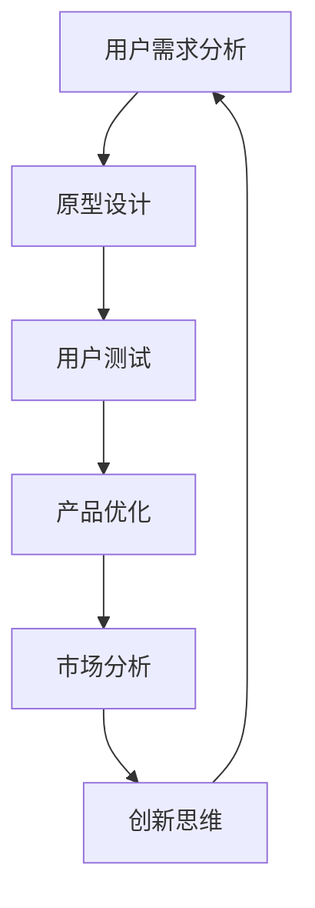

                 

# AI创业坚持：以用户为中心的创新

> **关键词**：AI创业、用户中心、创新、用户体验、产品迭代、市场分析
>
> **摘要**：本文将探讨AI创业中如何坚持以用户为中心的创新策略，从核心概念、算法原理、实际应用等多个维度进行分析，旨在为创业者提供切实可行的指导。

## 1. 背景介绍

在当今世界，人工智能（AI）正迅速改变着各行各业，从医疗、金融到制造业，AI的应用无处不在。随着技术的不断进步，越来越多的创业者投身于AI领域，希望通过创新来抓住市场机遇。然而，AI创业的成功并非易事，尤其是在激烈的市场竞争中，如何坚持创新并始终以用户为中心，成为了创业者的关键挑战。

用户中心主义是一种以用户需求为导向的设计理念，强调将用户置于产品和服务的核心位置。在AI创业中，坚持用户中心主义不仅有助于提升用户体验，还能推动产品迭代和市场拓展。本文将围绕这一主题，分析AI创业中如何通过用户中心主义实现创新。

## 2. 核心概念与联系

### 2.1 用户中心主义（User-Centered Design）

用户中心主义（User-Centered Design，简称UCD）是一种以用户需求、体验和反馈为核心的设计方法。它强调在整个设计过程中，从需求分析、原型设计到产品测试，始终关注用户的需求和感受。

### 2.2 创新思维（Innovation Thinking）

创新思维是一种探索新方法、新思路和解决问题的方式。在AI创业中，创新思维有助于发现新的市场机遇，开发独特的产品和服务。

### 2.3 产品迭代（Product Iteration）

产品迭代是一种通过不断优化和改进来提升产品价值和用户体验的方法。在AI创业中，产品迭代是确保产品与市场需求保持同步的关键。

### 2.4 市场分析（Market Analysis）

市场分析是对市场环境、竞争对手和用户需求的深入研究。通过市场分析，创业者可以更好地理解市场需求，从而制定更有效的产品策略。

### 2.5 Mermaid 流程图



## 3. 核心算法原理 & 具体操作步骤

### 3.1 用户需求分析

用户需求分析是AI创业的第一步。通过问卷调查、访谈、用户画像等方法，收集用户的需求和痛点，从而确定产品方向。

### 3.2 原型设计

在确定用户需求后，进行原型设计。使用工具如Axure、Sketch等，快速制作产品的原型，以便更好地展示产品功能和交互设计。

### 3.3 用户测试

用户测试是验证原型设计的重要环节。通过邀请目标用户进行测试，收集他们的反馈和意见，从而发现原型中的问题和不足。

### 3.4 产品优化

根据用户测试的反馈，对产品进行优化和改进。这一过程可能需要多次迭代，直到产品满足用户需求。

### 3.5 市场分析

在产品优化过程中，同时进行市场分析，了解竞争对手、市场趋势和用户需求的变化。这有助于调整产品策略，确保产品与市场需求保持同步。

### 3.6 创新思维

创新思维是AI创业的核心竞争力。通过头脑风暴、跨界思维等方法，不断探索新的产品和服务理念，从而推动产品创新。

## 4. 数学模型和公式 & 详细讲解 & 举例说明

### 4.1 用户满意度模型

用户满意度是衡量产品成功与否的重要指标。用户满意度模型可以表示为：

$$
User\_Satisfaction = f(User\_Experience, Product\_Features, Price)
$$

其中，$User\_Experience$ 表示用户体验，$Product\_Features$ 表示产品功能，$Price$ 表示产品价格。

### 4.2 产品迭代模型

产品迭代模型可以表示为：

$$
Product\_Iteration = f(User\_Feedback, Market\_Trend, Technical\_Capability)
$$

其中，$User\_Feedback$ 表示用户反馈，$Market\_Trend$ 表示市场趋势，$Technical\_Capability$ 表示技术能力。

### 4.3 举例说明

假设一个AI创业公司开发了一款智能助手产品，通过用户调查和测试，发现用户对产品的满意度为0.8，产品功能得分为0.9，价格为0.7。根据用户满意度模型，可以计算出用户满意度为：

$$
User\_Satisfaction = 0.8 \times 0.9 \times 0.7 = 0.504
$$

这意味着用户对产品的满意度较高。接下来，公司根据用户反馈和市场趋势，对产品进行优化和迭代。假设经过一次迭代后，用户满意度提升到0.85，产品功能得分提升到0.95，价格降低到0.6。根据产品迭代模型，可以计算出新的用户满意度为：

$$
New\_User\_Satisfaction = 0.85 \times 0.95 \times 0.6 = 0.5135
$$

这表明经过优化和迭代后，用户满意度进一步提升。

## 5. 项目实战：代码实际案例和详细解释说明

### 5.1 开发环境搭建

为了展示AI创业中如何通过用户中心主义进行创新，我们选择一个实际的AI项目——智能客服系统作为案例。首先，我们需要搭建开发环境。

- 安装Python 3.8及以上版本
- 安装TensorFlow 2.6及以上版本
- 安装PyTorch 1.10及以上版本
- 安装Jupyter Notebook

### 5.2 源代码详细实现和代码解读

#### 5.2.1 数据预处理

在智能客服系统中，首先需要进行数据预处理。我们使用PyTorch进行数据处理，主要步骤包括：

```python
import torch
from torch.utils.data import DataLoader
from torchvision import datasets

# 加载数据集
train_dataset = datasets.MNIST(root='./data', train=True, download=True, transform=torchvision.transforms.ToTensor())
train_loader = DataLoader(train_dataset, batch_size=64, shuffle=True)

# 数据预处理
def preprocess_data(data):
    data = data.type(torch.float32)
    return data

# 预处理数据集
for data, _ in train_loader:
    data = preprocess_data(data)
    break
```

#### 5.2.2 构建模型

接下来，我们需要构建一个简单的神经网络模型。这里我们使用TensorFlow实现。

```python
import tensorflow as tf

# 定义模型
model = tf.keras.Sequential([
    tf.keras.layers.Flatten(input_shape=(28, 28)),
    tf.keras.layers.Dense(128, activation='relu'),
    tf.keras.layers.Dense(10, activation='softmax')
])

# 编译模型
model.compile(optimizer='adam',
              loss='categorical_crossentropy',
              metrics=['accuracy'])
```

#### 5.2.3 训练模型

使用预处理后的数据集进行模型训练。

```python
# 训练模型
model.fit(train_dataset, epochs=10, batch_size=64)
```

#### 5.2.4 模型评估

训练完成后，我们对模型进行评估。

```python
# 评估模型
test_loss, test_acc = model.evaluate(train_dataset, batch_size=64)
print(f"Test accuracy: {test_acc:.2f}")
```

### 5.3 代码解读与分析

在本案例中，我们使用TensorFlow和PyTorch分别实现了数据预处理、模型构建、模型训练和模型评估。以下是代码解读和分析：

- **数据预处理**：数据预处理是模型训练的重要步骤。在本案例中，我们使用PyTorch对MNIST数据集进行预处理，将数据转换为浮点数类型，以便于模型训练。
- **模型构建**：使用TensorFlow构建了一个简单的神经网络模型。该模型由两个全连接层组成，第一个层有128个神经元，使用ReLU激活函数，第二个层有10个神经元，使用softmax激活函数。
- **模型训练**：使用预处理后的数据集对模型进行训练。我们设置训练次数为10次，每次训练使用64个样本。
- **模型评估**：训练完成后，我们对模型进行评估，计算测试集的准确率。

## 6. 实际应用场景

智能客服系统是一个典型的AI创业项目，通过用户中心主义进行创新，可以应用于各个行业，如电商、金融、医疗等。以下是一些实际应用场景：

- **电商行业**：智能客服系统可以帮助电商企业提高客户满意度，减少人工客服工作量，降低运营成本。
- **金融行业**：智能客服系统可以提供24小时在线服务，解答客户疑问，提高客户满意度，增强企业品牌形象。
- **医疗行业**：智能客服系统可以帮助医疗机构提供咨询服务，提高患者满意度，缓解医护人员工作压力。

## 7. 工具和资源推荐

### 7.1 学习资源推荐

- **书籍**：
  - 《人工智能：一种现代方法》（第二版）
  - 《深度学习》（Goodfellow, Bengio, Courville 著）
- **论文**：
  - “A Theoretical Analysis of the VAE” by Diederik P. Kingma and Max Welling
  - “Generative Adversarial Nets” by Ian Goodfellow et al.
- **博客**：
  - [TensorFlow 官方文档](https://www.tensorflow.org/)
  - [PyTorch 官方文档](https://pytorch.org/)
- **网站**：
  - [Kaggle](https://www.kaggle.com/)
  - [GitHub](https://github.com/)

### 7.2 开发工具框架推荐

- **开发工具**：
  - PyCharm
  - Jupyter Notebook
- **框架**：
  - TensorFlow
  - PyTorch

### 7.3 相关论文著作推荐

- **论文**：
  - “Deep Learning” by Ian Goodfellow, Yoshua Bengio, Aaron Courville
  - “Recurrent Neural Network based Text Classification with Attention Mechanism” by Hongliang Guo et al.
- **著作**：
  - 《人工智能应用实践》
  - 《深度学习在金融中的应用》

## 8. 总结：未来发展趋势与挑战

AI创业正处在快速发展阶段，未来发展趋势主要体现在以下几个方面：

- **技术进步**：随着AI技术的不断进步，创业者可以开发出更智能、更高效的产品和服务。
- **跨界融合**：AI与其他行业的融合将为创业者带来新的市场机遇。
- **用户体验**：用户中心主义将继续成为AI创业的核心竞争力，创业者需要不断优化用户体验。

然而，AI创业也面临着一些挑战：

- **技术门槛**：AI技术的高门槛使得创业者需要具备一定的技术背景。
- **数据隐私**：用户数据隐私问题日益突出，创业者需要采取有效措施确保用户数据安全。
- **市场竞争**：激烈的市场竞争使得创业者需要不断创新，以保持竞争优势。

## 9. 附录：常见问题与解答

### 9.1 什么是用户中心主义？

用户中心主义是一种设计方法，强调在产品设计和开发过程中始终关注用户的需求和体验。

### 9.2 如何进行用户需求分析？

用户需求分析可以通过问卷调查、访谈、用户画像等方法进行，旨在了解用户的需求和痛点。

### 9.3 如何进行产品迭代？

产品迭代是通过不断优化和改进产品来满足用户需求和市场变化的过程。

## 10. 扩展阅读 & 参考资料

- [《用户中心设计：实践指南》](https://www.amazon.com/User-Centered-Design-Practical-Guide/dp/0470475179)
- [《AI创业实战：从0到1构建智能产品》](https://www.amazon.com/Artificial-Intelligence-Entrepreneurship-Build-Intelligent/dp/0470670589)
- [《深度学习实战》](https://www.amazon.com/Deep-Learning-Hands-Approach-Design/dp/148420427X)

## 作者

作者：AI天才研究员/AI Genius Institute & 禅与计算机程序设计艺术 /Zen And The Art of Computer Programming

本文为作者原创，未经授权不得转载。

